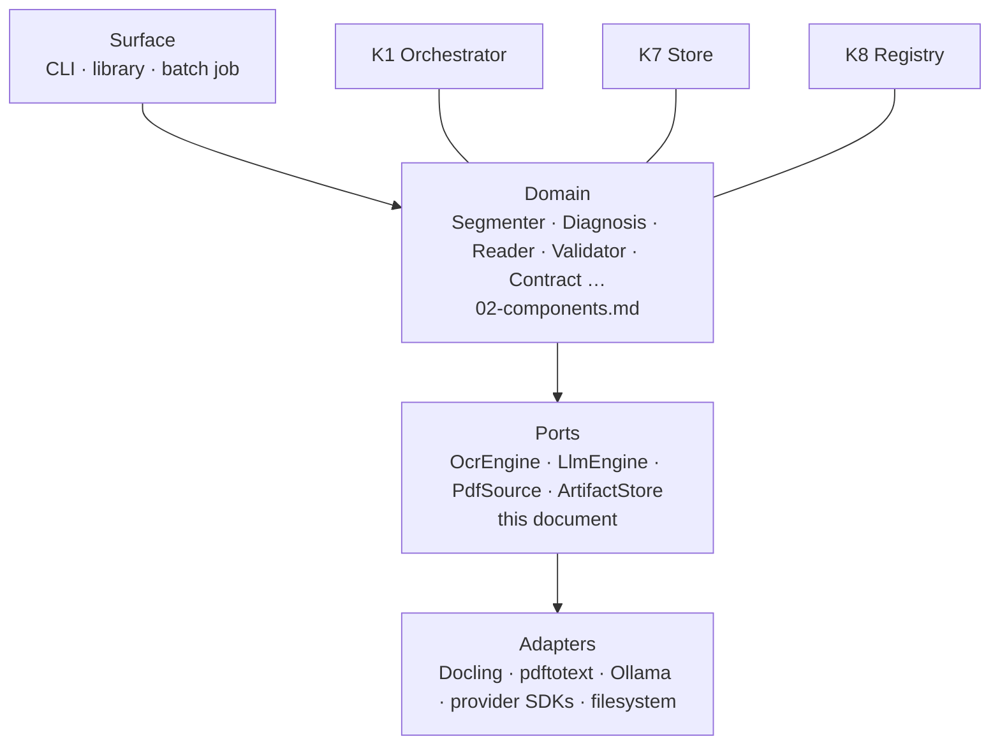

# Architecture components

The **kernels**: the capability layer the domain components are built from.

`02-components.md` defines ten components named by **what they produce** — Segmenter, Diagnosis, Validator. That is the **domain** layer: it knows about documents, fields, verdicts and escalation, and its nouns exist only in this system.

This document defines the layer underneath. A **kernel** mechanizes one kind of work and knows nothing about documents: an orchestrator that executes any stage graph, a PDF probe, a raster engine, an OCR port, two model ports, a store, a registry. They exist so the ten domain components can be written once, tested without documents, and so the next project does not rewrite them.

`02-components.md` and this file are **two layers of one design**, not two proposals. A domain component says *what must happen to a document*; a kernel says *how a class of work is done at all*.

| Axis | Named by | Where |
|---|---|---|
| **Material** | How the text is obtained | `01-pipelines.md` — `M0`–`M4` |
| **Extractor** | How values are read | `01-pipelines.md` — `r`, `p`, `rp` |
| **Domain component** | What it produces | `02-components.md` — ten components |
| **Kernel** | What it mechanizes | this document — eight kernels |

---

## Three layers



**The dependency arrow only points down.** A domain component imports ports, never an adapter. An adapter imports a vendor SDK, never a domain component. That single rule is what makes the layer reusable: replacing Docling, moving from local files to object storage, or adding a provider is a change at the bottom of the diagram, invisible to everything above it.

**Only the domain layer knows the word "field".** A kernel's API has no nouns from the problem domain — no `invoice`, no `CUIT`, no `field`, no `verdict`. Where domain knowledge is needed, it arrives as **data** from the registry (K8): patterns, prompts, schemas, policies. That is the mechanism that turns six document-shaped utilities into kernels a different project can consume unchanged.

---

## Why there is a kernel layer at all

Three reasons, and the third is the one that pays for the other two.

**The same capability is needed by several components, with different settings.** Rendering a page is needed by Diagnosis (to measure legibility), by the Reader (to rasterize an image PDF), by the Reconstructor (to inspect layout) and by escalation (`01-pipelines.md` — "render the region"). Four call sites, one kernel. Written per component, it would be four renderers that drift, and the escalation crop would eventually disagree with the diagnosis crop about what a page looks like.

**A kernel is where an external dependency is pinned.** Docling has a version, `pdftotext` has a version, Ollama has a digest, a provider has a model revision. All of them change results while looking like the same call. The kernel is the only place that records them, so the ledger's `config_hash` (`03-cli.md`) has one origin instead of six.

**A kernel outlives the project it was written for.** The user requirement is explicit: these utilities are generic **not only for the current engine but for a series of different projects**. An orchestrator that runs a stage graph over units with a per-unit ledger is not a document-extraction idea; it is a batch-processing idea that this project happens to need first. The test of the design is whether a different project could take K1, K2 and K7 unchanged and only write new stages.

---

## Kernel inventory

Eight kernels. Six are the engines the system was asked for; K7 and K8 are the substrate that makes them resumable and configurable, and without them the other six cannot serve eleven thousand files.

| Code | Kernel | Mechanizes | Determinism | Artifact cacheable | Cost |
|---|---|---|---|---|---|
| **K1** | `kernel.orchestrator` | Stage-graph execution over units; ledger, pause, resume, stop | deterministic | n/a — it *drives* | CPU |
| **K2** | `kernel.pdf` | Probes, text extraction, rendering, physical splitting | deterministic | ✓ | CPU |
| **K3** | `kernel.image` | Raster operations: rescale, deskew, crop, compress, legibility | deterministic | ✓ | CPU |
| **K4** | `kernel.ocr` | Pixels → positioned tokens | model-dependent | ✓ by engine revision | GPU/CPU heavy |
| **K5** | `kernel.llm.local` | Local generation and structured output (Ollama) | sampled | ✓ by digest + params | GPU |
| **K6** | `kernel.llm.frontier` | Hosted generation, structured output, vision, judging | sampled, external | partial — records the call | $ per token |
| **K7** | `kernel.store` | Content-addressed artifacts, per-unit ledger, run manifest | deterministic | n/a — it *is* the cache | I/O |
| **K8** | `kernel.registry` | Declarative assets: patterns, prompts, schemas, policies, pipelines | deterministic | n/a | trivial |

**Two kernels are not engines.** K7 and K8 mechanize *state* and *configuration*. They are in this document because a kernel is defined by what it hides, and both hide something the six engines would otherwise each implement badly: where an artifact lives and how it is verified; where a corpus's tunable decisions live and how they are versioned.

---

## Determinism is a declared property

Every kernel declares one of three classes. The class is not documentation — the orchestrator reads it, and it decides what resume can and cannot mean.

| Class | Kernels | Re-running gives | Consequence for resume |
|---|---|---|---|
| **deterministic** | K1, K2, K3, K7, K8 | The identical result | The artifact is a cache; it can be dropped and recomputed |
| **sampled** | K4, K5, K6 | A different result, usually | The artifact is **evidence**; it must be kept, never regenerated to check it |
| **external** | K6's remote calls | The supplier's current answer | The artifact is a **record** of a moment; a later call is a new observation, not a correction |

**A sampled artifact is not reproducible, and treating it as if it were is a silent error.** `03-cli.md` makes verification mandatory on every ledger read: a stage claiming `done` is checked against the filesystem. For a deterministic kernel, "the artifact is gone" can be answered by recomputation. For a sampled kernel it cannot — recomputation produces a *different* value, and a run that silently substitutes a fresh sample for a missing artifact has changed the result while reporting success. The correct outcome is `failed`, with the reason that the evidence is missing.

### The cache key

A stage's result is a pure function of its key; the orchestrator uses the key for idempotency, for `--force`, and for resuming.

$$key = H\big(\;\text{input hash}\;\|\;\text{kernel id}\;\|\;\text{kernel version}\;\|\;\text{adapter revision}\;\|\;\text{params}\;\|\;\text{registry hash}\;\|\;\text{model revision}\;\big)$$

| Term | Source | Why it is in the key |
|---|---|---|
| **input hash** | K7, sha256 of the upstream artifact | The same stage on different bytes is different work |
| **kernel id / version** | The kernel itself | A bug fix must invalidate what the bug produced |
| **adapter revision** | Docling, `pdftotext`, provider SDK | Same call, different engine version, different output |
| **params** | The stage's own settings | DPI, chunk size, language, temperature |
| **registry hash** | K8 | The prompt, the pattern, the schema — a corpus tuning change is a key change |
| **model revision** | Ollama digest, provider model string | `qwen2.5` is a **moving tag**; the digest is the identity |

The last two are the ones that are usually missing, and they are the ones that produce the failure `03-cli.md` describes: a stage that is `done` and no longer correct. An improved prompt changes the registry hash, so every `extract.p` key changes, so the ledger's completion claims are visibly stale rather than quietly wrong. `--force --stage` then has something precise to invalidate.

---

## Values that cross the boundary

Kernels exchange a small set of types. They are deliberately few, and none of them is a domain noun.

| Type | Is | Produced by |
|---|---|---|
| `Bytes` | An opaque buffer with a media type | K2, K3, K7 |
| `RenderedPage` | A bitmap, its page number, its DPI, its source box | K2, K3 |
| `Region` | A box in **source page coordinates** | K3 |
| `Token` | Text with a page, a box, a confidence and a role | K4 |
| `Artifact` | A stored blob with a content hash and a media type | K7 |
| `Evidence` | What the kernel observed, attached to every result | all |
| `Reason` | Why a kernel could not produce a value | all |
| `CallRecord` | Provider, model revision, tokens, cost, latency, request id | K5, K6 |

```python
@dataclass(frozen=True, slots=True)
class Token:
    """One positioned token as a reader returned it.

    Attributes:
        text: The token's characters, exactly as read, before any correction.
        page: One-based page number within the source document.
        bbox: Bounding box in source page coordinates, at the render DPI.
        confidence: Reader confidence in [0, 1], or None when the reader reports none.
        role: Reader-assigned role, e.g. "text", "table_cell", "header".
    """

    text: str
    page: int
    bbox: Box
    confidence: float | None
    role: str
```

**Every kernel result carries its evidence and its reason.** The convention is one shape rather than three:

```python
@dataclass(frozen=True, slots=True)
class KernelResult(Generic[T]):
    """The outcome of one kernel call, always with its evidence.

    Attributes:
        value: The result, or None when the kernel could not produce one.
        evidence: What was observed — versions, parameters, measurements.
        reason: Why value is None, or None when it is not.
    """
```

**There is no third state.** A kernel either returns a value with evidence, or returns no value and a reason. It never returns a plausible stand-in — an empty string, a zero, an empty token list, a default model. Those are the shapes a silent error takes at a layer boundary, and every one of them is a decision the caller must never be able to skip.

---

## K1 — Orchestrator

Executes a stage graph over a set of units, durably.

**It knows:** units, stages, dependencies, policies, slots, artifacts.
**It does not know:** document, PDF, OCR, model, field. Any of them.

| Operation | Does |
|---|---|
| `submit(spec) -> job_id` | Validates a pipeline descriptor and starts a run |
| `status(job_id) -> RunState` | Totals, per-stage counters, inflight, outcomes |
| `pause(job_id)` / `resume(job_id)` | Stops dispatching; running stages finish or are cancelled cooperatively |
| `stop(job_id, force: bool)` | `force=False` drains in-flight work; `force=True` kills and leaves stages written as `running` |
| `verify(unit)` | Checks every `done` stage against the store — mandatory, never optional |
| `rebuild_index()` | Recomputes the run manifest from the ledgers |

### The model

| Term | Definition | In this project |
|---|---|---|
| **Unit** | What the graph iterates over; the ledger's subject | A file (`03-cli.md`'s batch) |
| **Stage** | A named step producing artifacts from artifacts | `acquire`, `extract.r`, `validate`, `report` |
| **Graph** | Stages plus dependencies, with barriers | The primitive: prefix → extractor → validate → report |
| **Ledger** | Per-unit durable record of stage states | `<name>.ledger.json` |
| **Manifest** | Derived whole-run summary | `run.json` |

The unit is the reason K1 is reusable. Nothing in the definition above mentions files: a unit is whatever the caller iterates over, so the same orchestrator runs a batch of documents, a batch of records, or a batch of messages. The project supplies a descriptor and a ledger mapping; the scheduler is not rewritten.

### Durable states

The seven states of `03-cli.md` are implemented here, and two of them exist for exactly one reason each.

| State | Written when | Why it exists |
|---|---|---|
| `running` | **Before** the stage's work starts | Distinguishes *never began* from *began and was cut off* |
| `done` | **After** the artifact is written and fsynced | `done` may only be written about bytes that exist |
| `failed` | The stage ran and produced a Reason | Failure is a result, not an absence |
| `pending` | Not dispatched, or invalidated by a key change | Resumable |
| `blocked` | Waiting on an upstream stage | Resumable |
| `stale` | Kept deliberately over changed inputs | A successor exists but is knowingly out of date |
| `skipped` | This pipeline does not run this stage | Records absence as a fact, not as a gap |

**`running` is the whole crash-recovery design.** Writing it at the start is what makes a forced kill recoverable: the ledger can tell a stage that was interrupted, and whose artifact may be partial, from a stage that was never dispatched. A scheduler that wrote state only on completion would report a killed stage as never having run — and then resume it as if nothing had happened.

**The single rule that never bends: never write `done` about work that did not produce a durable artifact.** Everything else in K1 is an optimisation; this is the invariant that makes resume mean anything.

### Scheduling

Stages are dispatched by dependency readiness, subject to **typed slots**. A single `--jobs 8` is wrong for this workload: eight page renders and eight Ollama generations are not eight of the same thing.

| Slot | Contended by | Default bound | Bounded by |
|---|---|---|---|
| `cpu` | K2 render, K3 ops, K4 CPU OCR | `DOCFLOW_JOBS` | Cores, memory for full-page bitmaps |
| `gpu` | K4 with a GPU backend, K5 | 1 per device | VRAM; each model is loaded once |
| `remote` | K6 | Provider rate limits | Tokens per minute, concurrency caps |

**A barrier is a dependency on a set, not on one stage.** The Contract waits for all pages; the Segmenter waits for all pages read; the across-extractor Consistency comparison waits for both `extract.r` and `extract.p`. K1 models this as a fan-in that releases when the whole declared set is `done` or `failed` — a partial set releases only when every member has reached a terminal state, so a failure does not deadlock the barrier.

**Failure is contained to the unit.** One unit failing never aborts the run: it moves to a terminal outcome and the batch continues. That is what makes eleven thousand files a single command rather than eleven thousand.

### Retries

| Property | Rule |
|---|---|
| Scope | Per kernel, declared by the kernel, not chosen per stage |
| Backoff | Exponential with jitter; honour a supplier's `retry-after` verbatim |
| Semantics | A retry of a **sampled** kernel is a **new sample** — the attempt count is recorded, and retrying to obtain agreement is forbidden |
| Ceiling | Bounded attempts; exhaustion produces `failed` with the last Reason, never a partial value |

**Retrying to agreement is a silent error generator.** Calling a model repeatedly until two answers match, then reporting the agreeing pair, manufactures contrast where none existed. The attempt count in the ledger is what makes that visible if it ever happens by accident.

---

## K2 — PDF

Everything about a PDF that is not reading values from it.

| Operation | Returns |
|---|---|
| `probe(path) -> PdfProfile` | Page count, encryption, page boxes, rotation, producer metadata, per-page facts |
| `page_facts(page) -> PageFacts` | Text character count, alphabetic ratio, invisible-text detection, image coverage, embedded image pixel size, ink coverage |
| `classify(page) -> PageKind` | `text` · `image` · `mixed` · `blank` |
| `extract_tokens(pages) -> Sequence[Token]` | Positioned tokens, no reading order resolved |
| `render(pages, dpi) -> Sequence[RenderedPage]` | Rasterized pages with their source box |
| `embedded_images(page) -> Sequence[Bytes]` | The rasters already inside the page, at native resolution |
| `split(ranges) -> Bytes` | A physical child PDF, or the same document as a page stream |
| `merge(parts) -> Bytes` | The inverse, for a document assembled from parts |

### Classification is the probe's reason to exist

Diagnosis asks a question that `01-pipelines.md` states precisely: **quality, not presence**. A page with a text layer is not a text page. The kernel answers with measurements, and the policy that turns measurements into a route lives in the registry, so a corpus can retune the gate without a code change (`DOCFLOW_MIN_CHARS`).

| Measurement | Answers | Silent failure it prevents |
|---|---|---|
| Character count and alphabetic ratio | Is the layer real text, or 40 bytes of garbage on A4? | Routing a junk layer to conversion and dragging its errors along, uncorrected |
| **Invisible text** (render mode 3) | Is this a stale OCR layer planted under a scan? | The classic failure: a scan with a hidden layer from a 2009 tool reads as "text PDF" and never goes to OCR |
| Producer / creator metadata | Who wrote it | Corroborates the above; a scan producer plus a large text layer is a contradiction worth logging |
| Embedded image pixel size ÷ page size | Actual effective DPI of a scanned page | A fixed DPI threshold that is meaningless when the page is one full-page image |
| Image coverage ratio | Is this a scan at all | `blank` pages, and pages where the text is a caption over a photo |

**`blank` is a first-class answer**, not `text` with zero characters. A blank page must not be sent to OCR (it returns invented text, see K4) and must not be counted as a page whose fields are missing (`02-components.md` — the two escalate differently and at different cost).

### Rendering decisions the kernel owns

- **DPI is an input, not a setting.** Every `RenderedPage` carries the DPI it was rendered at, and that value is part of the cache key of anything downstream. A model read at 150 DPI and at 300 DPI are two different reads, and a cache that conflates them will return the wrong one.
- **Prefer `embedded_images` over `render` when the page is a single full-page scan.** It is the native resolution, it is faster, and it avoids the resample artifact of rasterizing a raster.
- **`render` never upscales.** Rendering a 150 DPI scan at 300 DPI produces a 300 DPI file of a 150 DPI scan — larger, no more legible, and indistinguishable downstream from a real 300 DPI render. If the effective resolution is insufficient, that is a `Reason`, and the decision (adapt or route aside) belongs to Diagnosis.

### Splits

Two different things share the word, and confusing them is how a document gets separated from its pages.

| Kind | Who | What it does | Where |
|---|---|---|---|
| **Physical split** | **K2** | Page ranges, size-bounded chunks, transport limits | It is a property of the container, mechanism only |
| **Logical split** | **Segmenter** (domain) | Where one document ends and the next begins | A judgement, with a confidence per cut |

K2 provides `split` and nothing about where to cut. The Segmenter decides the cut and asks K2 to perform it. Keeping the splitter mechanism-only is what lets `01-pipelines.md`'s re-segmentation loop reuse already-read pages: the physical split is a cheap, repeatable operation, so re-cutting does not imply re-reading.

**The source-to-output mapping is data.** `03-cli.md` mirrors the input tree in the output; the kernel does not know either tree. It receives a page selection and returns bytes, and the mapping lives beside the run as a data file. A store or orchestrator for a different project maps differently without touching K2.

---

## K3 — Image

Raster operations. The kernel that decides whether a pixel read is even worth attempting.

| Operation | Notes |
|---|---|
| `load(source) -> Bitmap` | **Applies EXIF orientation.** Ignores it and every photo read is sideways |
| `estimate_dpi(bitmap) -> int \| None` | From metadata, else from page size; `None` when unknown, never a guess |
| `rescale(bitmap, target) -> Bitmap` | Lanczos; **records whether it upscaled** |
| `deskew(bitmap) -> Bitmap` | Returns the angle applied |
| `denoise` · `binarize` · `auto_contrast` | Each reversible in the sense that the original is retained |
| `legibility(bitmap) -> Legibility` | Laplacian variance, contrast, skew estimate — a **measurement with a reason**, never a bare boolean |
| `crop(bitmap, region) -> Bitmap` | Region in source coordinates; the inverse map is returned with the crop |
| `to_format(bitmap, media_type, quality)` | Lossy conversions record their quality |
| `tile(bitmap, max_pixels) -> Sequence[Bitmap]` | Bounded memory on large scans |
| `phash(bitmap) -> str` | Duplicate detection across a corpus |

### Legibility is not resolution

`02-components.md` is explicit about the consequence, and K3 is where it is enforced: an image can pass a DPI gate and still be illegible. Passing it to OCR anyway is the outcome the architecture calls **invalid** — the reader returns invented text indistinguishable from a real reading.

So `legibility` returns a measurement plus a reason, and the *policy* that consumes it lives in Diagnosis and the registry. Two valid outcomes (adapt, or route aside with a reason) and one invalid one (proceed). The kernel's job is to make the third impossible to express: an illegible bitmap that has not been adapted carries a `Reason`, and the Reader treats a bitmap with an unresolved legibility reason as not readable.

### The coordinate contract

**A cropped region's coordinates must be mapped back to source page coordinates before they leave the kernel.** Escalation (`01-pipelines.md`) renders a region, reads it, and attaches a bbox to the field. If the crop's local coordinates reach the Contract, the trace points at the wrong place in the page — and the trace's entire purpose is to let a human look at the right pixels. The mismatch is invisible in JSON: both are valid boxes.

### Photography is not scanning

A photo has a perspective, a background, a shadow and an orientation. A scan has none of them. K3 exposes the distinction as facts rather than guessing: EXIF, estimated skew, background variance. `01-pipelines.md` lists input adaptation as Diagnosis's job and treats legibility as distinct from resolution; the adaptation is composed from these operations, but the *decision* to adapt is not the kernel's.

---

## K4 — OCR

Pixels to positioned tokens.

| Operation | Returns |
|---|---|
| `capabilities() -> OcrCapabilities` | Tables, bbox, per-token confidence, languages, handwriting, max pages per call |
| `read(pages, options) -> OcrResult` | Tokens with coordinates and confidence, plus per-page status |
| `engine_info() -> EngineInfo` | Name, version, backend, language packs — what goes in the cache key |

**The implementation is fixed and the port still exists.** `README.md` and `02-components.md` state the engine is Docling and only Docling, and `03-cli.md` is explicit that the engine is **not a setting**: a per-corpus engine choice would make the OCR path a matrix of behaviours for the ledger to track, and buy a choice the architecture does not make. The port is not for per-corpus selection. It exists for three other reasons: a test double in place of a GPU-heavy dependency, a pinned adapter revision in the cache key, and the reuse requirement — a different project takes the port and picks its own engine without inheriting this project's Docling decision.

### What it returns, and what it drops

**Tokens with coordinates, no reading order resolved.** `02-components.md` gives the reason: if the reader delivered ordered text it would absorb part of the Reconstructor, and that component would lose its reason to exist. Reading order is a heuristic decision and it belongs to the component that owns layout.

**Docling returns layout and table structure, and the kernel does not forward it.** This boundary is deliberate and load-bearing. If the OCR result carried layout, the Reconstructor's layout pass would be redundant work over an answer that arrived from somewhere else, and its remaining job — cross-page continuity — would be evaluated against structure nobody in this system validated. The boundary holds at the tokens.

### Correction

| Allowed | Forbidden |
|---|---|
| Character confusions, spacing, line-break artifacts | **Digits.** A "0" corrected to "O" in an amount is an invented value |
| Scoped to the OCR path only | The conversion path — a converter does not read badly, and a model applied "just in case" can only introduce damage |

**The raw text is retained.** Correction produces a second artifact; the uncorrected tokens are the audit record, because the question "what did the engine actually read?" can only be answered from the raw output. `DOCFLOW_CORRECT` gates the corrected artifact, never the raw one.

### Its silent failures

| Failure | Why it is silent | Evidence that prevents it |
|---|---|---|
| Blank page returns `""` | Looks like a page with no text, which is also a legitimate outcome | Per-page status: `read` with zero tokens vs `blank` vs `unreadable` |
| Invented text on a smudged page | Fluent, plausible, unmarked | Per-token confidence plus the legibility measurement from K3 |
| Confidence absent and read as perfect | A missing field defaulted to the best value | `confidence: float \| None`; `None` is not `1.0` |
| Truncated page (max pages per call) | The remaining pages are simply absent | `OcrResult` declares pages requested and pages read |

**Its inputs are in its cache key.** The render DPI, the language, the page selection and the adapter revision all change the output. An OCR artifact keyed only on the input PDF silently serves a 150 DPI read to a stage that asked for 300.

---

## K5 — Local LLM

Generation on the machine: Ollama.

| Operation | Notes |
|---|---|
| `generate(model, prompt, **params) -> Completion` | Plain generation |
| `structured(model, prompt, schema) -> Completion` | Grammar-constrained decoding; the model cannot emit an invalid shape |
| `vision(model, prompt, images, schema) -> Completion` | For `M4-EpVR`, where the extractor reads pixels |
| `warm(model)` / `ps()` / `pull(model)` | Keep loaded, inspect, provisioning |
| `capabilities(model) -> ModelCapabilities` | Context size, vision, structured output, quantization |

### Parameters that must be pinned and hashed

| Parameter | Why |
|---|---|
| **Model digest, not tag** | `qwen2.5` is a moving tag. The digest is the identity; a tag is a pointer that can silently change under an eleven thousand file run |
| `num_ctx` | The context window. Overflow is the classic silent truncation |
| `num_predict`, stop sequences | Bound the output; an unbounded generation on one file can stall a batch |
| Temperature, top_p, seed | Recorded as sampling parameters. Recorded for audit — **not** as a reproducibility guarantee, because there isn't one |
| Quantization | Same weights, different numbers. It is part of the model revision |

**Truncation must be detected, not inferred.** Providers signal it; the kernel maps the signal to a typed error and fails the stage. A completion that was cut off by the context window parses cleanly if the cut happens to land after the last complete field, which is exactly the plausible-but-false outcome the whole architecture is built to avoid.

### Resource governance

**One in-flight generation per GPU.** Ollama serializes internally; dispatching two generations from the orchestrator produces queueing that looks like latency and makes the ledger's per-stage timings meaningless. The orchestrator's `gpu` slot enforces this at the scheduler, so the kernel is never asked to do two things at once.

**`keep_alive` matters at this scale.** Over eleven thousand files, reloading a model per call is the difference between a usable batch and an unusable one. The kernel exposes the parameter; the policy belongs to the run.

### Batching is not free of semantics

A batched call and N single calls are different work. If the kernel batches, the batch boundary becomes part of the result: a failure in one item of a batch of eight fails eight units, and per-unit retry granularity is lost. The kernel therefore keeps batching **off by default** and lets the orchestrator's slot control concurrency, which preserves per-unit isolation.

### Its silent failures

| Failure | Prevented by |
|---|---|
| Model not pulled | Typed error naming the remedy (`ollama pull <model>`), never a fallback model |
| OOM / context exceeded | Typed error, distinct from truncation, distinct from timeout |
| Output truncated | Signal mapped to an error; never parsed as if complete |
| Model replaced under a moving tag | Digest recorded at first use and compared for the remainder of the run |

---

## K6 — Frontier LLM

Hosted generation. In this system it has more than one role, and the roles are where its risk lives.

| Operation | Notes |
|---|---|
| `structured(model, prompt, schema) -> Completion` | Schema validated before the call and the response parsed by the same schema |
| `judge(model, rubric, samples) -> Verdict` | The comparison use: grading reads against criteria |
| `vision(model, prompt, images, schema) -> Completion` | Escalation reads |
| `count_tokens(text) -> int` | Budgeting before spending |
| `capabilities(model) -> ModelCapabilities` | Structured output, vision, context, caching, batch API |

### Roles, not engines

The system uses a frontier model for five distinct jobs. **The role is a policy object — prompt, schema, model, budget, escalation rule — carried by the same engine.** Conflating a role with an engine is how a validation prompt ends up applied to an extraction call.

| Role | Job | Where it is defined |
|---|---|---|
| **Escalation governor** | The frontier read that `02-components.md` makes the definition of "could not" | `--validator` |
| **Frontier extractor** | `p` where the local model is insufficient | `--pipeline`, escalation |
| **Consistency arbiter** | Tie-breaking a disagreement on a field with no arithmetic relation | Consistency, unresolved |
| **Golden-set labeller** | Produces the reference values the pipelines are measured against | Offline |
| **Reviewer assistant** | Proposes a corrected value or a new rule from accumulated cases | Offline |

**The labeller role must not share a run with the governor role.** If the same model instance both validates production output and defines the golden truth, the comparison in `01-pipelines.md` is circular: the pipelines are graded against the judgement of one of the components being graded. The technical consequence is concrete — the offline job writes golden values as artifacts, and the online run consumes them read-only. Whether that separation is *sufficient* is an open question below.

### Audit before normalize

`wip/d.md` states the rule and K6 is where it is enforced at the boundary: the kernel returns the **raw completion** and the parsed structure **separately**, and the raw completion is persisted before anything coerces it. A `total: Decimal = 0` default converts "the model did not return this" into "the model returned zero", with no error, and that distinction cannot be recovered after the fact. Three states must stay distinguishable end to end: absent, explicit `null`, present.

**`CallRecord` is the return value's other half.** Provider, model revision, token counts, cost, latency, request id. Without it there is no per-document cost, no way to answer "why is this batch expensive", and no way to deduplicate a retried call.

### Failure policy

| Failure | Response |
|---|---|
| `429` | Backoff honouring `retry-after` verbatim |
| `5xx` / timeout | Bounded retries, then a terminal Reason |
| Sustained unavailability | **Circuit breaker** → the stage degrades to `unverified` / review, never to a rejection |

The last row is the rule `02-components.md` gives for the Catalog, applied to the provider: confusing an outage with a rejection turns a service incident into a queue of bad documents. It applies here for the same reason, and it is the same shape of decision.

**Secrets come from the environment only** (`03-cli.md`): no flag, so nothing reaches shell history or a process listing.

---

## K7 — Store

Where artifacts, ledgers and manifests live, and the reason resume is possible at all.

| Operation | Contract |
|---|---|
| `put(bytes, media_type) -> Artifact` | Content-addressed by sha256; identical bytes stored once |
| `get(artifact) -> Bytes` | Raises on miss — **never returns empty** |
| `verify(artifact) -> bool` | Hash matches and bytes are present |
| `begin(unit, stage)` / `commit(...)` / `fail(...)` | The ledger's write path |
| `read_ledger(unit)` / `write_ledger(unit, ledger)` | The document's own history |
| `rebuild_manifest()` | Recompute `run.json` from the ledgers |

### The write rules

**Content-addressed, atomically written.** Every artifact is written to a temporary path, flushed, fsynced, then renamed into place. A reader therefore never observes a partial artifact — and `commit` writes `done` only after the rename returns. There is no window in which the ledger claims bytes that are not fully on disk.

**`running` goes down before the work starts**, for the reason K1 gives: it is the difference between *never began* and *began and was cut off*.

**Verification happens on every read of a ledger, and there is no flag to skip it.** `03-cli.md` argues this and the argument is worth repeating at the layer that implements it: the run that most needs the check is the one immediately after a forced kill, which is also the run whose operator is least likely to ask for it. An existence check and a hash comparison are cheap; believing a stale ledger is not.

**The manifest is derived and rebuildable, never authoritative.** Counters cached over ledgers can drift — a kill lands mid-write, an artifact is deleted by hand, an input is replaced. If the manifest were the truth, a stale count would report a finished run that is not finished: a silent error at the scale of the whole batch. `rebuild_manifest()` must be able to reconstruct it from the tree alone.

**Assume the process may die between any two syscalls.** This is the design assumption; every ordering above follows from it.

### Reusability

The store is parameterised by a root and an addressing scheme, so a different project can point it at object storage or a database. What it does not do is decide *where things go in the tree* — the input-to-output mirroring in `03-cli.md` is a mapping supplied as data. That keeps a project's layout decisions out of the kernel, which is what lets two projects share it.

---

## K8 — Registry

Everything a corpus tunes, as versioned data.

| Asset | Consumed by | Example |
|---|---|---|
| **Anchors and patterns** | Rules extraction (`r`) | Anchor synonyms, per-field regex, proximity windows |
| **Prompts** | Prompt extraction (`p`) | Extraction prompt per document type |
| **Schemas** | Validation, structured output | The field contract, and the JSON Schema sent to a provider |
| **Business rules** | Validator | Range, relation, conditional, structural rules — the pending categories in `02-components.md` |
| **Policies** | Consistency, escalation | Critical fields, tolerances, contrast scope, escalation limits |
| **Pipelines** | K1 | The stage graph, as a descriptor |
| **Model catalog** | K5, K6 | Available models, capabilities, cost |

### Why the registry is a kernel and not a config file

**It is the boundary between code and corpus.** `01-pipelines.md` observes that at eleven thousand files the wording variants are unknown, which is why `r` needs one pattern per variant and why patterns must be tunable without a release. Putting them in code makes each tuning a deployment; putting them in a registry makes each tuning a hash change.

**Its hash is part of every cache key.** That is the mechanism that turns "the prompt improved" into a precise set of invalidated stages rather than a batch-wide `--force`. Without it, `03-cli.md`'s `--force --stage extract.p` would have nothing to compute and would be a blunt instrument.

**Validation at load, fail fast.** An asset that fails its own schema stops the run. There is no default for a missing prompt, pattern or schema: a missing asset silently substituted with an empty one produces a run that completes and extracts nothing, which is indistinguishable from a corpus with no extractable fields.

---

## Selection and resolution

`--model` and `--validator` name a capability, not a constructor.

```
ollama:qwen2.5          docling:default        anthropic:claude-sonnet-4-6
openai:gpt-4o           deepseek:chat          local:rules
```

| Rule | Consequence |
|---|---|
| Resolution is by **capability**, not by name | `vision` asks for vision; it does not ask whether the name contains "llava" |
| Unknown provider or model → **fail fast** | Never a fallback to a default model |
| Precedence follows `03-cli.md` | CLI flag → environment → `.env` → built-in default |
| The resolved adapter revision is recorded | It enters the cache key and the `CallRecord` |

**A silent fallback to a default model is the worst failure this layer can have.** It changes every downstream value, produces no error, and leaves a ledger that says the run succeeded. If a model is unavailable, the stage fails with a reason naming the model.

---

## Composition

Kernels are not used directly by the CLI; the domain components are compositions of them. Three mappings show that the layer is load-bearing rather than decorative.

### Domain component → kernels

| Component (`02-components.md`) | Kernels |
|---|---|
| **Segmenter** | K2 (probe, page facts, physical split), K7 (cut decisions as evidence) |
| **Identifier** | K2, K4, K5/K6 (type by content), K8 (type catalog) |
| **Diagnosis** | K2 (page classification), K3 (legibility, adaptation), K8 (thresholds) |
| **Reader** | K2 (conversion or render), K3 (adaptation), K4 (OCR, correction) |
| **Reconstructor** | K2 (tokens with coordinates), K8 (layout policy) |
| **Validator** | K1, K8 (rules), K6 (escalation governor), K5 (local checks) |
| **Consistency** | K5/K6 (the second read), K8 (critical fields, tolerance) |
| **Catalog** | K7 (retry queue), an outbound-source adapter with K6's failure policy |
| **Contract** | K7 (write), K1 (the emission barrier) |
| **Reviewer** | K7 (cases beside their document), K6 (assist) |
| **CLI / batch** | K1, K7, K8 |

### Material prefix → kernels

| Material | Kernels | What it costs |
|---|---|---|
| **M0** | none | Zero acquisition, and no acquisition evidence |
| **M1** | K2 conversion (`pdftotext`) | Reading order is heuristic |
| **M2** | K2 render → K3 adapt → K4 OCR | Rasterization; inherits OCR error |
| **M3** | K3 adapt → K4 OCR | Inherits OCR error; loses everything visual |
| **M4** | K5 or K6 vision | No offset, no second read |

**M2 and M3 are one implementation with a switch at the front**, and that switch is exactly `K2.render`. Nothing else differs, which is why the two materials share a code path and why the kernel boundary is where the switch belongs.

### Extractor mode → kernels

| Mode | Kernels | Notes |
|---|---|---|
| **`ErVR`** | K8 (patterns) + pure matching | Deterministic, cheap, invents nothing, cannot see its own bad anchor |
| **`EpVR`** | K5 (local) or K6 (frontier) | Can invent a value; can misattribute |
| **`ErpVR`** | both, over the same tokens | The only mode that can produce contrast |

**Contrast is a kernel-level saving.** The second read is one more call against tokens already in memory. Nothing is re-acquired, no render is repeated, no OCR is re-run — the saving is available precisely because acquisition lives in K2/K3/K4 and extraction lives above them.

---

## What the kernels never do

| Never | Why |
|---|---|
| Contain a domain noun | A kernel with `invoice` in its API is a component wearing the wrong name |
| Emit a verdict, a confidence score or a routing decision | Policy belongs to the domain layer and the registry |
| Return an empty value as a stand-in for a failure | Empty string, `0`, `[]`, `None`-without-reason are the shapes a silent error takes |
| Coerce a model's output | Audit and normalize are separate steps that must not share a model (`wip/d.md`) |
| Fall back to a default model, engine or threshold | A default changes results invisibly |
| Retry until agreement | It manufactures contrast |
| Write `done` about bytes that are not durable | It makes resume a lie |
| Upscale and report a satisfied resolution gate | The result is larger and no more legible |
| Return a crop's local coordinates as a page region | The trace points at the wrong pixels and looks valid |
| Let an outage become a rejection | It turns an incident into a queue of bad documents |

---

## Silent failures, per kernel

The lens the whole architecture uses, applied one layer down. Each kernel's characteristic silent failure, and the evidence that makes it visible.

| Kernel | Silent failure | Evidence that prevents it |
|---|---|---|
| **K1** | A killed stage reported as never started, then resumed | `running` written before the work |
| **K1** | A stage marked `done` whose artifact is partial | Write → fsync → rename → then `done`; verify on every read |
| **K2** | A stale invisible OCR layer read as a text PDF | Invisible-text detection plus producer metadata |
| **K2** | A 150 DPI scan rendered at 300 and reported as 300 | Effective DPI measured from embedded pixels; `render` never upscales |
| **K2** | A split that separates a document from its pages | The physical/logical distinction — only the Segmenter cuts |
| **K3** | A photo read sideways | EXIF orientation applied at load |
| **K3** | A blurred image passed to OCR | Legibility returns a measurement and a reason, never a boolean |
| **K3** | A crop's local coordinates reported as a page region | The inverse map is returned with every crop |
| **K4** | A blank page returning invented text | Per-page status plus the legibility measurement |
| **K4** | Missing confidence read as perfect | `float \| None`; `None` is not `1.0` |
| **K4** | A truncated page read as a page with no text | Pages requested vs pages read |
| **K5** | Output cut by `num_ctx`, parsed as complete | Truncation signal mapped to a typed error |
| **K5** | A model swapped under a moving tag mid-run | The digest is recorded at first use |
| **K6** | The model's absence, `null` and a default collapsed into one | Raw completion persisted before any parse |
| **K6** | A golden set graded by the model that produced it | The labeller role runs offline and writes read-only artifacts |
| **K7** | A manifest reporting a finished run that is not finished | The manifest is derived and rebuildable |
| **K8** | A missing asset defaulted, producing a run that extracts nothing | Assets validated at load; fail fast |

**This table is the layer's real specification.** Everything else here is structure; these are the errors that would otherwise reach the consuming system undetected.

---

## Extension points

What it costs to change something, and what must not move.

| Change | Touches | Must not touch |
|---|---|---|
| **Add an OCR engine** | A new K4 adapter, capability declaration | Domain components, other materials |
| **Add a provider** | A new K6 adapter, the model catalog | Any role's prompt or policy |
| **Add an image operation** | A function in K3 | Diagnosis's policy, which decides when to use it |
| **Move artifacts to object storage** | A K7 backend | The tree layout, supplied as data |
| **Add a document type** | A K8 asset set — patterns, prompt, schema, rules | Code |
| **Change the extractor mode** | The pipeline descriptor in K8 | Any kernel |
| **Add a pipeline** | A stage graph in K8 | K1, which executes graphs it did not write |
| **Reuse everything in another project** | New stages, new assets, new ledger mapping | K1, K2, K3, K7, K8 |

**The last row is the test of the design.** If a second project cannot take the orchestrator, the store and the configurable half of the engines unchanged, the boundary is in the wrong place and the layer is a component in disguise.

---

## Invariants

- **The abstraction arrow only points down.** Domain imports ports; adapters import SDKs; nothing imports upward.
- **A kernel has no domain nouns.** Domain knowledge arrives as registry data.
- **A result carries evidence, or a reason — never a stand-in.** No empty strings, no zeros, no `None` without a reason.
- **No silent fallback.** An unavailable model, engine or asset fails the stage; it never substitutes a default.
- **No retry until agreement.** The attempt count is recorded; two agreeing samples after N attempts are not contrast.
- **A sampled artifact is evidence, not a cache.** It may be kept; it may never be regenerated to verify it.
- **`done` is written only about durable bytes.** Everything about resume depends on it.
- **The cache key includes the engine revision and the registry hash.** Without them, a `done` stage is a claim nobody can check.
- **A model's raw output is persisted before any coercion.** Absent, `null` and present stay distinguishable.
- **Effective resolution is measured, not asserted.** Rendering at a DPI does not create it.
- **Coordinates leaving a kernel are in source page coordinates.**
- **Auditing is not normalizing.** Two separate steps that must not share a model.
- **An outage is not a rejection.** Providers and external sources degrade to `unverified`, with a retry queue and an owner.

---

## Open questions

- **Whether the golden set can be produced by a frontier model at all.** K6's labeller role makes the comparison in `01-pipelines.md` possible, but the pipelines are graded against the judgement of a model that also serves as the escalation governor. Either the labeller is a different model from the governor, or the golden set is human-confirmed on a sample. Undefined, and it decides what "comparing the pipelines" can mean.
- **Whether a sampled artifact may ever be regenerated.** This document says no, and the consequence is that a lost model artifact makes a document permanently unreproducible. Whether a corpus accepts "regenerate and mark it as a new observation" is a policy question nobody has answered.
- **What the determinism class of Docling actually is.** Treated here as model-dependent, which makes an OCR artifact non-reproducible. If a pinned Docling with a pinned backend and language pack is in fact deterministic on identical input bytes, the whole OCR cache becomes a deterministic cache and the design gets simpler.
- **How many GPU slots exist, and whether the slot model is enough.** `gpu = 1` is a simplification: concurrent OCR and generation compete for VRAM on one device, and the scheduling policy for that competition is not defined.
- **Whether the registry is one asset store or several.** Patterns, prompts, schemas and policies have different owners and different change rates. A single hash means a prompt tweak invalidates a schema version, which is safe but imprecise.
- **What is in the per-document cost ceiling.** K6 needs a budget to spend against, and `03-cli.md` has no flag for one. Nothing today says what a document may cost before it escalates instead of trying harder.
- **Whether the store's addressing survives the move to object storage.** Content addressing does; the colocation of ledger and result (`03-cli.md`) is a filesystem property, and object storage has no equivalent of "beside".
- **Where the Reviewer's cases live once the run is over.** `03-cli.md` puts them in the ledger, which is per document and per run. Whether they are aggregated afterwards into anything the Reviewer can work from is undefined.
- **Whether M0 needs a kernel the other materials do not.** It has no acquisition, so its targeted escalation has nothing to render — see `01-pipelines.md`. If it resolves as "re-read a span of the supplied string", that is a K5/K6 call with a windowing parameter, and no new kernel.
