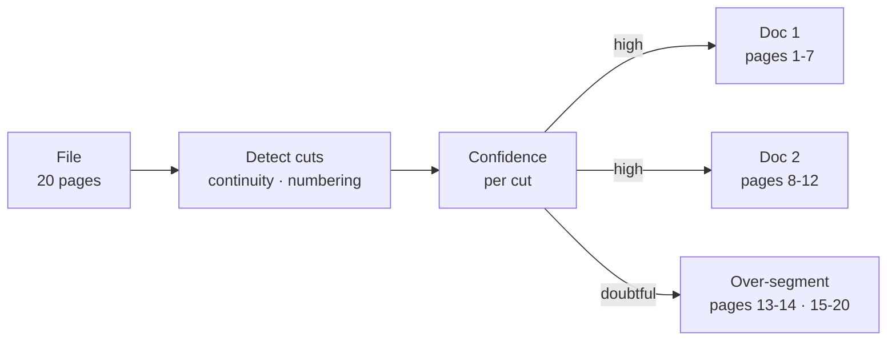
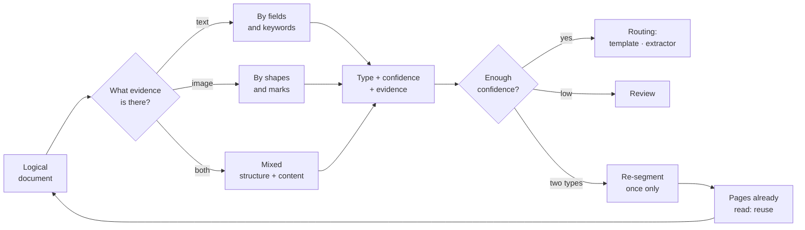
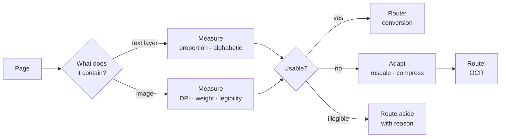
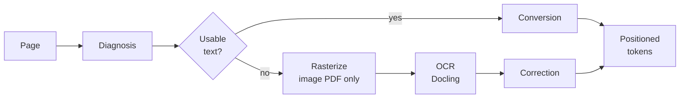
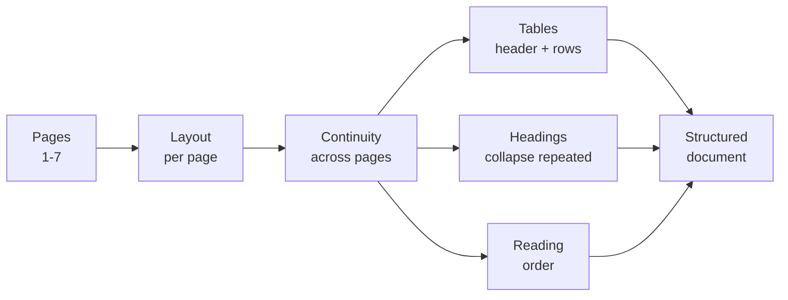
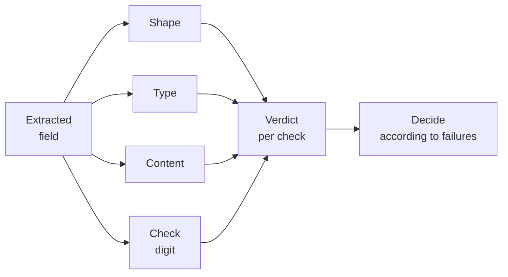
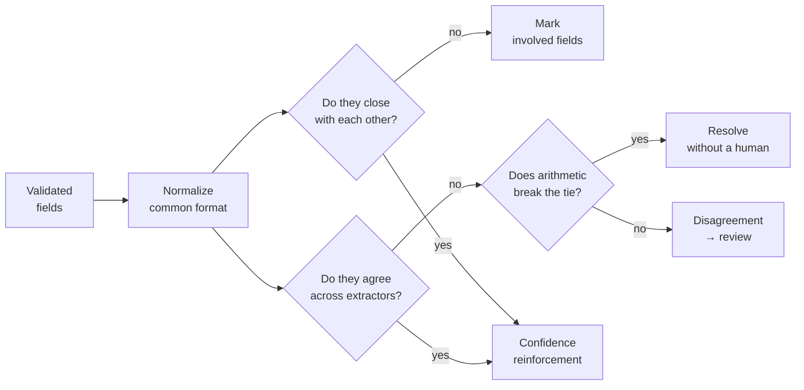
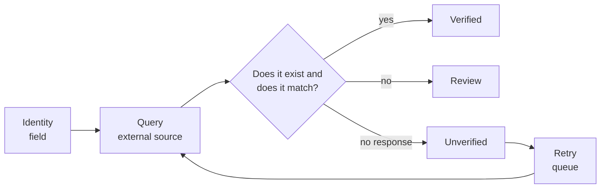
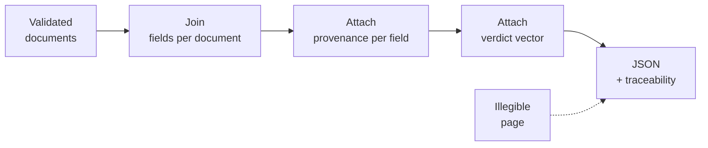
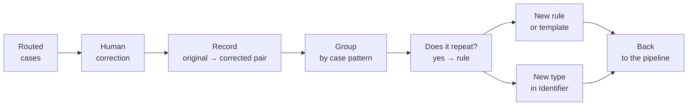

# Components

The component reference for the document extraction system.

Components are named by **what they produce**.

Two other decompositions exist and are orthogonal to this one:

| Axis | Named by | Where |
|---|---|---|
| **Material** | How the text is obtained | `pipelines.md` — five materials, `M0`–`M4` |
| **Extractor** | How values are read | `r` regex · `p` prompt, written inside the primitive |

A primitive is **EVR** = **E**xtractor → **V**alidate → **R**eport, named `ErVR`, `EpVR` or `ErpVR`. A pipeline is a material prefix plus a primitive — thirteen in total, defined in `pipelines.md`.

The traditional flow names (Rules, Interpretation, Vision) are aliases for the extractor modes: Rules is `ErVR`; Interpretation and Vision are both `EpVR`, on text and on pixels respectively. See `README.md`.

**In this document, "flow" means one extractor run.** Where Consistency compares two runs, that is a comparison of extractors.

---

## Components by level

| Component | Level | When | What it does | Rules | Interp. | Vision |
|---|---|---|---|:---:|:---:|:---:|
| **Segmenter** | File | Inside | Groups pages into logical documents | ✓ | ✓ | ✓ |
| **Identifier** | Document | Inside | Determines the type and the routing | ✓ | ✓ | ✓ |
| **Diagnosis** | Page | Inside | Detects content, measures quality, adapts | ✓ | ✓ | — |
| **Reader** | Page | Inside | Extracts tokens by conversion or OCR | ✓ | ✓ | — |
| **Reconstructor** | Pages | Inside | Layout, tables, reading order | ✓ | ✓ | ◐ |
| **Validator** | Field | Inside | Shape, type, content, check digit | ✓ | ✓ | ✓ |
| **Catalog** | Document | Inside | Validates against external sources | ✓ | ✓ | ✓ |
| **Consistency** | Document | **Between** | Cross-checks fields and compares extractors | ✓ | ✓ | ✓ |
| **Contract** | Document | **After** | Canonical shape of the output | ✓ | ✓ | ✓ |
| **Reviewer** | All | **After** | Closes the loop with human corrections | ✓ | ✓ | ✓ |

Vision uses neither Diagnosis nor Reader: it hands pixels to the model, which reads and extracts in a single step. The ◐ for Reconstructor under Vision is for the same reason: the VLM absorbs one page's layout, but continuity across pages is still needed.

### Barriers

Three components cannot emit until another has finished:

| Barrier | Waits for |
|---|---|
| **Segmenter** | All pages read |
| **Consistency across extractors** | Both reads over the same field |
| **Contract** | All pages resolved |

Page-level components are **parallelizable**. Consistency across fields is not a barrier: it operates inside one extractor run, over already-extracted fields.

---

## Segmenter



It groups the pages into logical documents before the Identifier. Without it, a PDF with three invoices is processed as one and the fields get mixed between documents.

Cut signals are restarted page numbering, a new document header, or the absence of continuity in open tables.

**It is the only component without an escape hatch.** All the others have a way out when in doubt: the Identifier routes aside, the Diagnosis routes aside with a reason, the Contract emits partially. The Segmenter decides first and its error is **unrecoverable downstream**: if it merges two documents, the second document's fields overwrite the first's and no later check notices.

Hence the asymmetry that governs its policy:

| Error | Consequence | Detected later |
|---|---|---|
| **Over-splitting** | Two documents where there was one | Yes: the Identifier returns the same type twice and the Contract sees missing fields in both |
| **Over-merging** | One document where there were two | **No**: the fields are mixed silently |

When a cut is doubtful, **over-segment**. One extra document is recoverable noise; one missing document is silent corruption.

---

## Identifier



It determines the document type and the routing (which extractor processes it).

Three variants depending on which evidence is available: text only, image only, or both. The difference is not one of accuracy but of what can be observed.

It returns the **evidence** alongside the type: which words or shapes triggered the decision. Without that, a misclassified document is invisible and the error only shows up at the end, as a badly extracted field.

Low confidence routes to review instead of picking the most likely type. And an "other" category with its own route is needed: that is where new types come from.

**It has an edge back to the Segmenter, with three limits.** Segmenting well sometimes requires knowing the type, and identifying requires the segment: it is circular. When the evidence shows **two different types** in the same segment, the Identifier does not pick one: it returns the cut and forces re-segmentation. But a loop without a stopping condition is a risk, so:

| Limit | Why |
|---|---|
| **A single re-segmentation** | If the second pass again yields two types, it goes to review. There is no third |
| **Reuse what was already read** | Diagnosis and Reader are page-level and do not depend on the cut: they are kept. Re-segmenting does not mean re-reading |
| **Feed the cut confidence** | The case is recorded, and if the same pattern repeats, the Segmenter adjusts its threshold |

That last point closes the overlap between the two mechanisms: **doubt splits, error returns**. If the Segmenter was in doubt, it already over-segmented — the "two types" case should not appear. If it does appear, it is because the cut confidence came back high and it got it wrong, and that signal is exactly what the threshold needs in order to correct itself.

---

## Diagnosis



It runs before reading and does three things: it **detects** what is there, **measures** whether it is processable, and **adapts** the input.

Asking whether text exists is not enough: you have to see whether it is usable. A PDF may carry an old, bad OCR layer; routing by presence sends it to conversion and drags those errors along without anyone reviewing them. The check is one of proportion and quality — a layer with 40 characters on an A4 sheet is garbage.

Legibility is not the same as resolution: an image may have enough DPI and still be out of focus. If it fails, there are two valid outcomes (preprocess or route aside) and one invalid one: passing it to OCR anyway and letting it return invented text indistinguishable from a real reading.

---

## Reader



| Path | Input | Engine | Correction | Confidence |
|---|---|---|:---:|---|
| Conversion | Existing text layer | `pdftotext` | No | 1.0 |
| OCR | Image | **Docling** | Yes | Estimated |

**The engine is unified: Docling is the OCR engine, and the only one.** There is no per-invocation engine choice, so the OCR path is one implementation rather than a dispatcher over interchangeable backends. Docling runs an OCR backend underneath, but which one is not the Reader's contract — the engine is Docling, and it is a stack decision, not a value a corpus sets.

**Docling does not apply to the conversion path.** When Diagnosis finds a usable text layer, the reader is `pdftotext`: a native text PDF has its text already, and re-reading it through OCR can only degrade it. Docling applies **only** where the page is read from pixels.

**An image PDF is rasterized first.** Docling reads an image, so an image PDF takes one step before it: render the page, then OCR. That prefix is the whole difference between M2 and M3 — and since both then read with the same engine, the two materials share one implementation.

Correction exists only in OCR: a converter does not read badly, it transcribes what is there. Applying a language model to it "just in case" can only introduce damage.

Routing is **per page**: a mixed PDF combines both paths and joins them at the end.

**It returns tokens, not text.** The distinction matters: if the Reader delivered already-ordered text, it would absorb part of the Reconstructor and that component would not be needed. It delivers **tokens with coordinates**, with no reading order resolved — that way the Reconstructor has a reason to exist and both text modes need it equally.

**Docling returns more than that, and the Reader does not pass it on.** A Docling result carries layout and table structure as well as text. Everything past the positioned tokens stays inside the OCR path: if the Reader forwarded it, the Reconstructor's layout pass would be redundant work over an answer already given, and Continuity — its remaining job — would be evaluated against structure that arrived from somewhere else. The boundary holds at the tokens.

---

## Reconstructor



It receives **several pages**, not one: layout is local, but continuity crosses pages.

- A table with a header on one page and rows that continue on the next loses the association if each page is processed in isolation.
- A header repeated across all 5 pages is captured 5 times without continuity control.

**It runs in Rules and Interpretation; in Vision only the continuity part.** The VLM absorbs each page's layout, but continuity across pages is still needed.

---

## Validator



Four **independent** checks: each one looks at the same field and issues its own verdict. They are not chained — a correct shape does not enable the type check, nor the other way around.

| Check | Question | What it sees that the others do not | Failure → |
|---|---|---|---|
| **Shape** | Does it have the expected shape? | That *something* with the correct appearance is there | Retry with another anchor |
| **Type** | Is it of the type it claims to be? | That the value is usable | Retry, otherwise review |
| **Content** | Is it admissible in the domain? | That it matches the business: the only one that knows the rules | Review |
| **Check digit** | Is it valid in itself? | Mathematical guarantee: the only one with no false positives | Reject |

The table order goes from weakest to strongest, but **that order does not describe execution**: all four run over the same field and none needs another's result.

The final decision combines the verdicts, and **the most severe failure governs**: a field can pass shape and type, fail content, and route to review; or fail the check digit and be rejected even though the other three pass.

**The Validator is the one that governs escalation.** "Could not" is defined here and nowhere else. The policy used to live scattered across three components — Identifier, Diagnosis and Validator — with none of them aware of the others; centralizing it here is what makes it applicable.

**Two different cases escalate differently:**

| Case | What is there | How it escalates |
|---|---|---|
| **Invalid field** | Value, page and offset | **Targeted**: that region is rendered and that field is asked about |
| **Missing field** | Nothing: it did not find the anchor | **Whole document**: there is no region to point at |

The difference decides the cost. An invalid field has a location, so Vision looks at a crop: cheap and precise. A missing field has nowhere to look, so the pixel read has to re-run over the entire document just as if it were the only extractor.

That is why **"reprocess those 2, not the 20" applies only to the first case**. If escalation is mostly due to missing fields, the saving is not one order of magnitude but none at all.

### Pending business rules

The Validator currently runs 4 universal checks (Shape, Type, Content, Digit). But the domain has additional rules that are not yet formalized.

**Categories of missing rules:**

| Category | Examples | Status |
|---|---|---|
| **Range validations** | Amount > 0; date not in the future; percentage between 0-100 | ⏳ Pending definition |
| **Relations between fields** | Issue date ≤ due date; subtotal ≤ total | ⏳ Pending definition |
| **Conditional rules** | If tax=VAT then a rate must be present; if it is an invoice A then it must have a CUIT | ⏳ Pending definition |
| **Structural validations** | Number of lines > 0; table has a header | ⏳ Pending definition |
| **Domain-specific business rules** | Amounts respect currency rounding; CUIT valid by province | ⏳ Pending definition |
| **Cross-document checks** | If there is a debit, there must be a source voucher | ⏳ Pending definition |

**How they integrate:** Each new rule follows the same model as the 4 checks — it issues its own verdict and the most severe failure governs. They run in parallel, not chained. The decision of which rules apply per document type is the Identifier's responsibility (when routing).

**Where they are defined:** The concrete rules will go in a separate file (e.g. `reglas-negocio.md`) with the format: Document type → Fields → Rules → How it fails → What escalates.

---

## Consistency



It compares values against each other at two levels:

| Level | What it compares | Example |
|---|---|---|
| **Between fields** | Arithmetic and ordering inside the document | subtotal + taxes = total; issue ≤ due |
| **Across extractors** | The same field read by two paths | total by `r` vs. total by `p` |

**The across-extractors level is the answer to the plausible-but-false error.** A total of 15400 that was 1540 passes shape, type and content and has no check digit: no internal check sees it. But if `r` reads 1540 and `p` reads 15400 on the same document, the disagreement appears — and it is the strongest signal available in the whole system.

### How to make contrast usable

**Normalize first.** Otherwise you compare format instead of value: `1.540,00` against `1540.00`, a CUIT with spaces against one without. Both values have to be brought to canonical form and **the normalized ones compared**, not the raw ones.

**Tolerance by field type.**

| Type | Tolerance | Why |
|---|---|---|
| Amounts | Cents | Rounding between paths is legitimate |
| Identifiers | **Exact** | A CUIT has no rounding: a different digit is an error |
| Dates | Exact | There is no approximate equivalent |

**Let arithmetic arbitrate.** The two levels are not independent. If the reads differ on the total but only one of the two values closes with the document's own `subtotal + taxes`, **Consistency already has the answer** and no human is needed. The arithmetic level breaks the tie at the across-extractors level.

Only when neither of the two closes, or the field is an identifier with no arithmetic relation, does the disagreement go to review.

**Cost.** Running two reads over everything is expensive, so contrast is reserved: per critical field (amounts, identifiers) and not per whole document.

**Cheapest when the text is already in hand.** The acquisition is paid once, so a second read costs one extra call on critical fields rather than a second pass over the document. That makes `ErpVR` the only primitive whose characteristic failure is detectable. See `pipelines.md`.

---

## Catalog



It validates against something that exists outside the document: a supplier registry, the issuing authority's service, an identifier's registry.

**It is the only one that closes the gap for identity fields.** A CUIT can have a correct check digit and belong to a company that did not issue the document. No internal check distinguishes it; querying it against the source does.

Different from Consistency: that one compares the document against itself, this one against external reality. And different from the Validator in that **it is not deterministic** — it depends on a third party's availability and latency.

That is why failure due to unavailability is not a rejection: if the external source does not respond, the field remains **unverified**, not invalid. Confusing the two turns a service outage into a queue of rejections.

**`Unverified` has an owner: the Catalog itself.** It keeps its **retry queue** with backoff, and the state is visible in the output as a pending field, not as a missing field. Without its own retry, the state is a hole through which documents with never-confirmed identity leak away.

---

## Contract



Emitting is a **barrier**: it waits until all pages are resolved before producing the document's output.

It joins the fields that came from different pages and attaches the `(page, extractor)` trace per field.

**It handles heterogeneous provenance.** With per-field escalation, one document holds fields resolved by `r` with an `exact offset` alongside fields resolved by `p` on pixels with an `approximate bbox`. The Contract cannot assume a single origin: each field declares its extractor and its trace type.

**It emits the verdict vector, not a score.** A field accumulates signals from five sources: cut confidence, Reader confidence, the Validator's four verdicts, Consistency's reinforcement or disagreement, and the Catalog's verified/unverified. Collapsing them into a number repeats the mistake the Catalog prohibits: mixing `unverified due to service outage` with `verified and matching`.

So each field is emitted with its verdicts kept separate:

```json
{
  "total": {
    "value": "15400.00",
    "extractor": "r",
    "trace": { "page": 3, "offset": [412, 424] },
    "verdicts": {
      "shape": "ok",
      "type": "ok",
      "content": "ok",
      "digit": null,
      "consistency": "ok",
      "catalog": "unverified"
    }
  }
}
```

**The threshold is set by the consumer.** There is no single magic number: for one use case, `unverified` on identity is blocking; for another, an amount with `content: doubtful` is acceptable.

Failure is **partial**: an illegible page is marked as such and the rest of the document is still emitted, with that absence declared.

---

## Reviewer



It closes the loop. Without it, the architecture ends at "review" and everything review produces is lost.

It receives what the others routed out: low Identifier confidence, illegible pages from Diagnosis, content failures from the Validator, Consistency disagreements, and the "other" category.

It has three outputs:

| Output | When |
|---|---|
| **Corrected datum** | The case was a one-off: it is fixed and moves on |
| **New rule** | The case repeats: it goes to Rules and stops reaching review |
| **New type** | The "other" category accumulates cases: a type and its route are defined |

It is also the one that closes the Segmenter's loop: when the Identifier returns two types in one segment, the case comes back here and the re-segmentation becomes a rule if it repeats.

**Without the Reviewer, the system does not improve.** Human corrections pile up in logs nobody reads and the same errors return in every batch.
