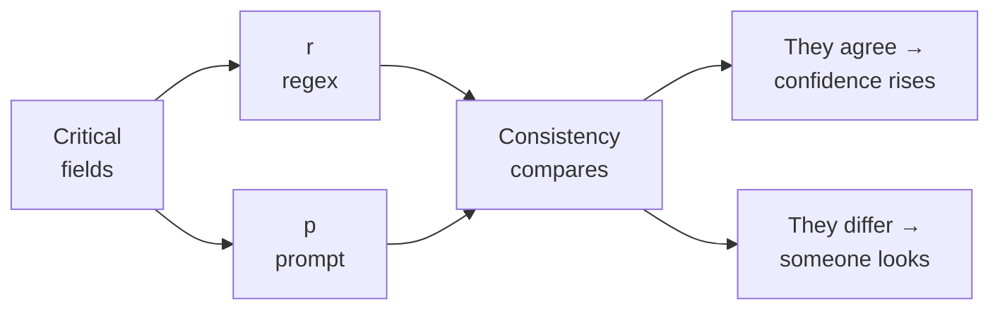
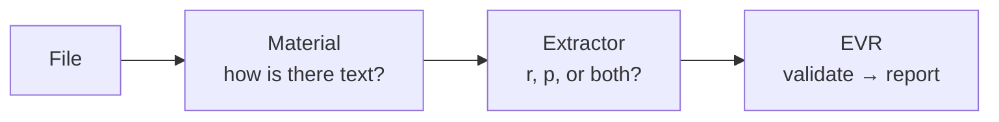

# The story of a document

A narrative companion to `components.md` and `pipelines.md`. Those two are reference documents — one lists what the parts do, the other lists the routes. This one explains *why* the architecture has the shape it does.

It is not a summary. Everything here is drawn from those two files; if you need a table or a specification, go there. This is the reasoning behind the tables.

---

## The problem is not extraction

Eleven thousand documents. Pull the fields out. Hand them to another system.

The obvious framing — "get the values out" — is wrong, and everything downstream depends on rejecting it early. Extracting a value is easy. **Knowing whether to trust it is the actual problem.**

An extraction that returns the wrong total is not a failure. It is worse than a failure, because it produces no exception. It produces a number, in a field, that looks exactly like the right answer. The consuming system invoices against it, or routes it, or files it. Nothing anywhere says "this might be wrong."

So the system is not built to maximise extraction. It is built to **know what it doesn't know**, and to express that honestly enough that the consumer can decide.

Three sentences describe the whole shape:

- Some errors shout. Some whisper. **Only the whisperers get architected for.**
- Two independent readers disagreeing is worth more than one confident reader.
- A system that cannot explain itself cannot be trusted with money.

---

## The antagonist

Name the enemy precisely, because the architecture is a response to it.

**A silent error is one that produces output indistinguishable from correct output.** The reference documents give three, and they escalate in nastiness.

**The plausible-but-false value.** A total of 15400 that was really 1540. It has the correct shape. It is the correct type. If it is an amount, it has no check digit to catch it. Every internal check the system can run, it passes. Nothing in the document itself contradicts it.

**The bad anchor.** A value that is completely real, correctly formatted, correctly typed — and taken from the wrong place. `components.md` names the mechanism in Rules: textual proximity. The regex found ⟨some number⟩ near ⟨some label⟩, and both were genuinely in the document. It just took the neighbouring block's value. There is nothing wrong with the value except where it came from.

**The merged document.** This is the worst one. `components.md` is blunt about it: the Segmenter "decides first and its error is **unrecoverable downstream**." If two invoices in one PDF are read as one invoice, the second document's fields overwrite the first's, and *no later check notices*. Every field that survives is real, well-formed, correctly typed, and belongs to a different document than the one it is reported under.

Against these three, validation is not enough. That is the discovery that shapes everything else.

---

## Why validation alone loses

The instinct is to build a better validator. `components.md` has one, and it is good: four independent checks on every field, each with a distinct role.

| Check | What it sees that the others cannot |
|---|---|
| **Shape** | That *something* with the correct appearance is there |
| **Type** | That the value is usable |
| **Content** | Whether it matches the business — the only one that knows the rules |
| **Check digit** | Mathematical guarantee — the only one with no false positives |

They are deliberately **independent**, not chained. A correct shape does not enable the type check, and the final decision lets the most severe failure govern. A field can pass shape and type, fail content, and go to review; or fail its check digit and be rejected though the other three passed.

That is a genuinely strong net. And the 15400 passes straight through it. So does the bad anchor. So does every field of the merged document.

**The net catches wrong values. It cannot catch right values in the wrong place.** Shape, type, content and check digit all describe the value in isolation. None of them asks whether it belongs here.

That is the limit, and it is a structural one — not a matter of adding a fifth check. Which means the answer has to come from somewhere else entirely.

---

## The answer: two readers, and the disagreement

If one read cannot detect its own characteristic error, then the error has to be found by a second read that fails differently.



This is the pivot of the whole architecture, and it is worth stating as plainly as the reference documents do: **contrast is not an optimisation, it is the only mechanism that sees the most silent class of error.**

Work through the 15400 again with a second reader in the room. `r` reads 1540. `p` reads 15400. Neither can prove the other wrong — but the *disagreement* is unambiguous, and it is the strongest signal available anywhere in the system. Not because either reader is better, but because they fail differently.

The same logic rescues the bad anchor. A value taken from the wrong place is invisible to every check on the value. It is very visible when a second reader, working from the same text by a different method, comes back with a different answer.

**And note what contrast does not fix.** It does nothing at all for the merged document. If the Segmenter merged two invoices into one, both readers see the same merged text and both report the same fields — they *agree*, and agreement is exactly what the system reads as confidence. Two readers cannot catch an error that precedes both of them. That asymmetry matters later.

---

## The two axes, and why they are separate

The reference documents are strict about something that is easy to conflate, and the strictness pays off.

There are **two independent decisions**, not one:

| Axis | Question |
|---|---|
| **Material** | How do we obtain something readable? |
| **Extractor** | How do we read values from it? |

Getting text and reading values from it are different problems. `pipelines.md` states the consequence: `pdftotext` yields a text stream, and **that fact says nothing about how the values get read from it.** Nor does the text that OCR produces.

So the combinations multiply rather than add. Four materials can produce text, and each admits three extractor modes:

$$\underbrace{4}_{\text{text materials}} \times \underbrace{3}_{r,\ p,\ rp} + \underbrace{1}_{\text{pixels only}} = 13$$

The single `+1` is the interesting term. **M4 is the one material where the choice does not exist** — pixels go to the model and fields come back, so there is no string for a regex to run on. Everywhere else, the mode is a free decision made after the material is settled.

---

## The five ways to get text

The material axis looks like a taxonomy of file types. `pipelines.md` makes a better observation: **it is not really what the input is, it is what has to happen before there is text.**

| Material | Steps before text exists | Cost |
|---|---|---|
| **M0** | none — it arrives as text | zero |
| **M1** | extract text from a PDF | low |
| **M2** | rasterize, then OCR | high |
| **M3** | OCR | high |
| **M4** | never — the model reads pixels | n/a |

Once stated that way, **M0 turns out to be the point of the whole exercise.** With acquisition cost at zero, M0 is nothing but extraction, validation and reporting. Every other material is that same pipeline with work prepended to obtain the text.

Which means: the pipeline is *extraction plus verification*, and the materials are five ways of arriving at its input. That is a much cleaner statement of what the system does than any list of file formats.

### Each material pays a specific price

None of them is free, and each cost is different in kind.

**M1's price is reading order.** Conversion needs no correction — `components.md` notes a converter does not read badly, it transcribes what is there, so applying a language model to its output "just in case" can only introduce damage. But `pdftotext` is heuristic. A table header is not associated with rows continuing on the next page; a header repeated across five pages is not collapsed. Broken linear text still reads plausibly, so this failure is quiet.

**M3's price is everything visual.** Layout, signatures, seals, checkboxes, logos — all gone once the page becomes a string. It also inherits OCR error, which cuts two ways: a pattern can be written to tolerate the specific misreads OCR produces, while a prompt handles unfamiliar corruption better but may quietly "repair" a digit it should have flagged.

**M4's price is the second opinion.** It is the only material that *sees* visual evidence as part of extraction rather than losing it in conversion. And it is the only one that can never contrast, because a single fused read leaves nothing to compare against.

That trade is real and unavoidable: **what M4 uniquely sees, it uniquely cannot verify.**

---

## The two ways to read

The extractor axis is where the character of the system lives.

**`r` — rules.** Regex over text. Deterministic, and it invents nothing: it either captures a value that is there or it fails. Its weakness is not accuracy but *detection*. `README.md` is explicit that a bad anchor in Rules is caught only by contrast — the value is real and carries the correct shape and type. Running `r` alone means running the one mode that cannot notice its own characteristic error.

**`p` — prompts.** A prompt over text, or over pixels in M4. It tolerates wording variation, which is what makes it viable when the corpus is unknown — and at eleven thousand documents, the variants are unknown. Its weaknesses are the mirror image: it **can invent** a value nobody wrote, and it **can misattribute** a real value to the wrong field.

**`rp` — both.** Runs them over the same text and lets Consistency compare. **This is the only mode that can produce contrast**, and therefore the only primitive whose characteristic failure is detectable.

### Why `rp` is cheaper than it sounds

`components.md` treats contrast as expensive and rations it — per critical field, never the whole document. That rationing exists because a second read would otherwise have to *re-acquire the document*.

Then the observation that changes the economics: **in a text pipeline, the acquisition is already paid.**

The text is in hand. A second read costs one extra call on critical fields, not a second pass over the document. Contrast has never been cheaper than in `ErpVR` — at M0, M1, M2 or M3 alike, and cheapest of all at M0, where there was no acquisition cost to weigh against it in the first place.

---

## The journey

Put a document through the system and watch the decisions happen.



**First: is there usable text?** This is the Diagnosis question, and `components.md` insists it is a question of **quality, not presence**. A PDF may carry an old, bad OCR layer, and routing by presence sends it to conversion and drags those errors along unreviewed. The test is proportion and quality — a layer with 40 characters on an A4 sheet is not a text layer.

Quality, not presence. That distinction is what stands between the system and a silent error at the very first step.

**Then: which extractor?** A free choice, made after the material is settled. On anything that produced text, all three modes are available.

**Then: validate and report.** Four independent checks, then the Contract assembles the output — and this part never varies.

### What the Contract refuses to do

Here the story has a quiet but important moment.

A field accumulates signals from five sources: cut confidence, Reader confidence, the Validator's four verdicts, Consistency's reinforcement or disagreement, and the Catalog's verified-or-unverified state. The obvious move is to collapse them into a confidence score.

**The Contract refuses, and the reason is worth understanding.** A single number would repeat the exact mistake the Catalog exists to prevent: mixing `unverified because the service was down` with `verified and matching`. Those are different facts about a field, and averaging them destroys the difference.

So each field reports its verdicts separately:

```json
{
  "total": {
    "value": "15400.00",
    "extractor": "r",
    "trace": { "page": 3, "offset": [412, 424] },
    "verdicts": {
      "shape": "ok",
      "type": "ok",
      "content": "ok",
      "digit": null,
      "consistency": "ok",
      "catalog": "unverified"
    }
  }
}
```

**The threshold is the consumer's job.** There is no universal number, because there is no universal use case. For one workload, an unverified identity is blocking; for another, an amount with doubtful content is acceptable. The system's obligation is to make the difference visible, not to guess which one matters.

Failure follows the same principle: it is **partial**. An illegible page is marked as such, and the rest of the document is still emitted, with the absence declared.

---

## The one that cannot be caught

Now the asymmetry that governs the most consequential component.

The Segmenter groups pages into logical documents before anything else happens. Every other component has somewhere to go when it is in doubt — the Identifier routes aside, the Diagnosis routes aside with a reason, the Contract emits partially. **The Segmenter decides first, and it has no escape hatch.**

The consequence is a clean asymmetry:

| Error | Consequence | Detected later? |
|---|---|---|
| **Over-splitting** | Two documents where there was one | Yes |
| **Over-merging** | One document where there were two | **No** |

Over-splitting is recoverable noise: the Identifier returns the same type twice, the Contract sees missing fields in both. Someone notices.

Over-merging is silent corruption. The fields mix, every one of them real and well-formed, and nothing downstream can tell.

So the policy is settled by that asymmetry: **when a cut is doubtful, over-segment.** One extra document is recoverable. One missing document is not.

And this is where the earlier observation about contrast returns. The Segmenter's failure is the one thing two readers cannot catch, because it happens *before* either of them. Recall that only 4 of the 13 pipelines have contrast — and that even those four keep the Segmenter as their single silent gap. **The Segmenter is the one loss no pipeline closes.**

---

## The loop that makes it learn

The architecture so far is a machine that produces verdicts. Without a return path, that is where it ends: good decisions and bad ones both vanish into a review queue, and the same errors return in the next batch.

The Reviewer closes it. It takes what the others routed out — low Identifier confidence, illegible pages, content failures, Consistency disagreements, the "other" category — and does three things with it:

| Output | When |
|---|---|
| **Corrected datum** | The case was a one-off. Fix and move on |
| **New rule** | The case repeats. It becomes a rule and stops reaching review |
| **New type** | "Other" accumulates cases. Define the type and its route |

**Without it, the system does not improve.** Human corrections pile up in logs nobody reads, and the same error appears in every batch. With it, each correction is a candidate rule.

It also closes the Segmenter's loop. When the Identifier finds two types in one segment it returns the cut and forces re-segmentation — once only, no third pass. That case comes back here, and if it repeats it becomes a rule. Which is how the two mechanisms reconcile: **doubt splits, error returns.** If the Segmenter was doubtful it already over-segmented. If the "two types" case still appears, the cut confidence came back *high* and it was wrong — and that signal is exactly what the threshold needs to correct itself.

---

## What the story guarantees

Every pipeline, all thirteen, ends in the same primitive:

**EVR** — **E**xtractor → **V**alidate → **R**eport.

The `r`, `p` or `rp` is the extractor. The **V** and the **R** are identical everywhere.

| Slot | Varies by |
|---|---|
| Material prefix | Material |
| **E**xtractor | Mode |
| **V**alidate | — never |
| **R**eport | — never |

**No pipeline skips validation**, including the rules-only ones. Not because rules are untrustworthy, but because the reason validation exists has nothing to do with how the text arrived. A regex match proves a value was **captured**, not that it is **correct**. Text of perfect provenance does not make a value correctly anchored — `M0-ErVR` and `M1-ErVR` are the same read, differing only in where the text came from.

The guarantee this buys is what makes the pipelines substitutable rather than merely similar: **a field always arrives with its four check verdicts and a trace, whatever route produced it.** Thirteen ways in, one shape out.

That is what lets the consumer write one integration and choose a pipeline per document type based on cost and residual risk — instead of writing thirteen.

---

## What each choice actually costs

The decision surface is small once the components are understood. Choosing a pipeline means choosing **which residual blind spot to accept**.

| Blind spot | Pipelines | Undetected |
|---|---|---|
| Single read, `ErVR` | 1, 4, 7, 10 | A bad anchor — a real value from the wrong place |
| Single read, `EpVR` | 2, 5, 8, 11, 13 | A plausible-but-false value, and a bad anchor |
| No visual evidence | 1–12 | Signatures, seals, checkboxes, logos |
| No offset | 13 | Precise traceability |

Read this as **residual** risk, not as coverage. Validation already runs on all thirteen; these are the failures that remain *after* the four checks — the ones the Validator structurally cannot see. The only remedies are contrast, or an external source through the Catalog, which no pipeline currently runs.

Two things follow, and they are the actionable conclusions:

**The extractor choice decides whether a pipeline can catch its own characteristic error.** That is why it is not a detail, and why `ErpVR` has the strongest case on text materials.

**The material choice decides cost and evidence — but not the reader's blind spot.** The `ErVR` anchor problem and the `EpVR` invention risk are properties of how values are read, not of how the text arrived. No amount of clean input compensates for them.

---

## Where the story is not finished

An honest narrative names its open threads. These are live in `pipelines.md`, and several are load-bearing.

**Who chooses the pipeline?** Nothing yet says whether the caller declares it or the system infers it. This bites hardest at two places: M0, which is a caller *assertion* with no artifact to diagnose, and the M3-versus-M4 fork, where both are valid and the choice is a genuine cost-versus-verification trade rather than a technicality.

**How M0 escalates at all.** Targeted escalation means "render the region" — which is meaningless for text with no page and no image. So either it becomes "re-read a span of the string", or M0 can only escalate to the full cascade. Unresolved, and unique to M0.

**What makes a field "critical".** Both the contrast policy and the target of escalation depend on this, and today it exists only as an expression rather than a definition.

**What the extraction prompt is built from** — per document type, derived from the schema, or shared with the general path. It decides whether tuning carries over between them or whether there are two prompt sets to maintain.

**Whether the Segmenter is needed after all.** It is the only silent gap that no pipeline closes. A cheap continuity check — page numbering, header recurrence — might be enough to keep it, though M0 gives it nothing to inspect.

Alongside these, `components.md` lists six categories of **business rules not yet formalized**: range checks, relations between fields, conditional rules, structural validations, domain-specific rules, and cross-document checks. Each will follow the same model as the four existing checks — its own verdict, most severe failure governs, all in parallel.

---

## The three sentences, again

The architecture reduces to the three claims it opened with.

**Only the whisperers get architected for.** Shape, type, content and check digit catch wrong values. They cannot catch right values in the wrong place — so the design accounts for the errors that leave no trace.

**Two readers disagreeing beats one reader confidently.** Contrast is not a refinement of validation. It is the only mechanism that reaches the silent class of error, and on text materials it costs one call.

**A system that cannot explain itself cannot be trusted with money.** That is why a field carries a verdict vector rather than a score, why provenance is declared per field, and why the consumer — who knows the use case — sets the threshold rather than the system guessing it.

Everything else in the reference documents exists to make those three hold.
