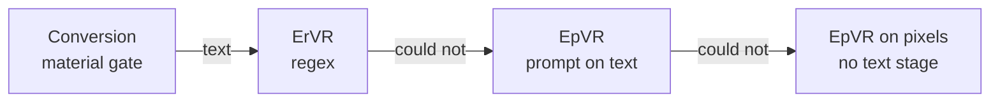
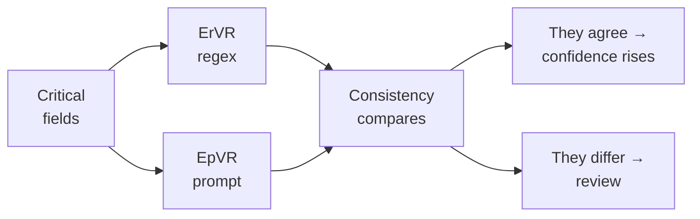

# Document extraction

Eleven thousand documents. Extract structured information from them and expose it for another system to consume.

**The problem is not extraction — it is knowing whether to trust the result.** A wrong total produces no exception. It produces a number in a field that looks like the right answer, and the consuming system invoices against it. Everything here is a response to that.

## Documents

| Document | What it covers |
|---|---|
| `docs/idea/01-pipelines.md` | The thirteen input pipelines, from material to output |
| `docs/idea/02-components.md` | The ten components — what each produces, its diagram, its failure modes |
| `docs/idea/02-arch-components.md` | The eight kernels underneath them — the reusable engines (orchestrator, PDF, image, OCR, local LLM, frontier LLM, store, registry) |
| `docs/idea/03-cli.md` | How to invoke them: commands, flags, batch, resume |
| `docs/idea/04-storytelling.md` | Why the architecture has this shape, as a narrative |
| `docs/artifacts/prd.md` | The PoC requirements: 33 functional, 13 non-functional, 6 acceptance scenarios |
| `docs/artifacts/sad.md` | The architecture: 4 layers, K1–K8, the cache key, 9 ADRs, the stage mapping |
| `docs/artifacts/wbs.md` | The build plan: 53 tasks across 3 stages, critical path, DoR/DoD |
| `docs/artifacts/kernel-cli.md` | The Stage 1 acceptance harness: exit codes, the 17-row silent-failure matrix |
| `docs/artifacts/traceability.md` | Requirement → pipeline → task → test, including the deviations from `my_prompt.md` |
| `docs/plans/README.md` | The gate model — how the three plans relate, what each one freezes, what can slip |
| `docs/plans/plan-01-kernels.md` | Stage 1: the 22 kernel and ports/adapters tasks, closing on the synthetic flow |
| `docs/plans/issues/plan-01-kernels/` | Stage 1 split into 8 capability epics and 22 issues, with acceptance criteria and test evidence |
| `docs/plans/plan-02-components.md` | Stage 2: the 17 domain-component tasks, closing on a real document |
| `docs/plans/plan-03-pipelines.md` | Stage 3: the 14 pipeline tasks, closing on the 11k-file corpus |
| `docs/quickstart/` | What each landed kernel *actually does* today, verified by running it — K2 `kernel-pdf.md`, K3 `kernel-image.md`, K4 `kernel-ocr.md`, K5 `kernel-llm-local.md`, K6 `kernel-llm-frontier.md`, and the lab surface `lab-cli.md` |
| `docs/findings/` | Measurements taken while implementing, where the runtime disagreed with the specification — and `03-kernel-port-adapter-compliance.md` measures whether the kernel/port/adapter separation actually holds |
| `my_prompt.md` | The original specification — requirements and constraints |

Start with `docs/idea/04-storytelling.md` for the reasoning, or `docs/idea/03-cli.md` if you need to run something. The `docs/artifacts/` set is the specification the PoC is built against; where an artifact and an `idea/` document disagree, the artifact is the decision and the `idea/` document is the exploration that led to it. The **quickstarts** are the opposite direction: they record what a landed kernel *actually does*, verified by running it, so a page that strays from the specification says so and says why.

---

## The idea in four sentences

Confidence does not come from one method. It comes from **two independent methods disagreeing**, which is the only thing that detects a value that is real, correctly typed, and taken from the wrong place. Internal validation catches wrong values; it cannot catch right values in the wrong place. So the architecture reads a field twice, by different means, and treats the disagreement as the signal.

That single decision explains most of the design: why there are three extractor modes, why contrast is worth paying for, and why the output carries a verdict per field instead of a confidence score.

---

## Three levels

A file is not a document. A 20-page PDF may hold one invoice, or three.

| Level | What it is |
|---|---|
| **File** | What enters the system |
| **Document** | A unit with meaning of its own inside the file |
| **Page** | The physical unit of processing |

Getting this wrong is the one mistake nothing downstream can catch — see *Invariants*.

---

## Two axes

Everything the system does reduces to two independent choices:

| Axis | Question | Values |
|---|---|---|
| **Material** | How is the text obtained? | text in hand · extracted from a PDF · OCR · pixels only |
| **Extractor** | How are values read from it? | `r` regex · `p` prompt |

**The OCR engine is fixed: Docling.** It sits on the OCR materials only — M2 and M3. The extraction of a text PDF is not OCR and does not use it (`pdftotext`), and an image PDF is rasterized before Docling sees it. `docs/idea/02-components.md` develops the boundary.

The mode is written inside the primitive — **EVR** = **E**xtractor → **V**alidate → **R**eport:

| Primitive | Mode | Reads |
|---|---|---|
| **`ErVR`** | `r` — rules | regex over text |
| **`EpVR`** | `p` — prompts | a prompt over text, or over pixels |
| **`ErpVR`** | both | either, or both over the same text |

The traditional names — Rules, Interpretation, Vision — are aliases: Rules is `ErVR`; Interpretation and Vision are both `EpVR`, on text and on pixels. **They are the same method on different materials.**

Multiplying the axes gives the thirteen pipelines. `docs/idea/01-pipelines.md` develops them fully.

---

## The escalation ladder

Each stage does the cheapest thing and hands the next one what it could not do. Conversion is the material gate; what follows is extractor escalation, and `p` on pixels is a *material* change, not a more expensive extractor.

**The Validator governs the whole ladder.** "Could not" is defined in exactly one place — see `docs/idea/02-components.md` — which is what makes escalation a policy rather than a habit spread across three components.

### Contrast, and why it is not an optimization

A total of 15400 that was really 1540 passes shape, type and content, and has no check digit. No internal check sees it. If `r` reads 1540 and `p` reads 15400, the disagreement does.

**Contrast needs text.** Two independent reads are cheap only when the text is already in hand — one extra call on critical fields, not a second acquisition. That is why `ErpVR` is the only primitive whose characteristic failure is detectable, and why the pixels-only material cannot contrast at all.

---

## Invariants

These hold everywhere. Each one exists because breaking it produces an error nothing downstream can see.

- **When the Segmenter is in doubt, over-segment.** Splitting too much is detected later; merging too much is silent and contaminates fields from other documents.
- **The re-segmentation loop runs once only.** A loop without a cap is a risk; the second pass is final.
- **The model never replaces the Validator.** Arithmetic catches hallucination in amounts.
- **The quote proves provenance, not correctness.** Verify the literal and the value separately.
- **Structure is validated separately.** A shifted column has real amounts and passes any value check.
- **Normalize before comparing.** Otherwise you measure format instead of value, and the review queue fills with spelling differences.
- **Emission is a verdict vector, not a score.** The threshold is set by the consumer, who knows their use case.
- **The trace declares page and extractor.** With per-field escalation, provenance stops being single.
- **Failure is partial.** An illegible page marks that page; it does not discard the whole document.
- **`Unverified` is not a final state.** It needs an owner and a retry queue, or it is invisible debt.
- **Without a return loop, the system does not improve.** Corrections that do not go back into the pipeline are the ones that make the same error repeat.
- **Auditing is not normalizing.** Two separate steps that must not share a model.

---

## Known limitations

Declared rather than assumed covered.

| Limitation | Why it is not solved inside |
|---|---|
| **Plausible but false value** | Needs contrast or an external source; no internal check sees it |
| **Bad anchor in either mode** | The value is real and correctly typed; only contrast detects it |
| **Doubtful segmentation cut** | Over-segmentation mitigates, it does not eliminate |
| **External source down** | It is retried, but meanwhile the field stays unverified |
| **Merged documents** | The one gap no pipeline closes — a merge error precedes every extractor, so contrast agrees with it |
| **Missing field escalated** | With no prior location, the pixel read re-runs over the whole document: no saving |

The first two are why contrast exists. The fifth is why the Segmenter matters more than its size suggests.
