# Document extraction

Summary version. Details are in `README.md`.

## Overview

This system solves one problem: **extracting information from mixed documents with enough confidence** to automate processes that require it (invoicing, compliance, auditing).

Confidence does not come from a single method — it comes from:
1. **Three cascading flows**: each one is more expensive but more accurate than the previous
2. **Internal validation**: arithmetic, check digit, business rules
3. **Contrast between flows**: when two independent methods see the same thing, confidence rises
4. **External lookup**: verifying identity against reality outside the document

Without contrast, the system sees logical errors (2+2=5). Without external lookup, it does not see identity errors (a valid CUIT but the wrong company). Both are needed.

---

## Key terminology

**Flows** are named by what the extractor receives. **Components**, by what they produce.

| Flow | Receives |
|---|---|
| **Rules** | Nothing |
| **Interpretation** | Text |
| **Vision** | Pixels |

| Component | Produces |
|---|---|
| **Segmenter** | Logical documents + cut confidence |
| **Identifier** | Document type + evidence |
| **Diagnosis** | Route and input warnings |
| **Reader** | Positioned tokens + confidence |
| **Reconstructor** | Structured document |
| **Validator** | Per-field verdict |
| **Consistency** | Verdict across fields and across flows |
| **Catalog** | Verdict against an external source |
| **Contract** | Shape of the output |
| **Reviewer** | Corrections + new cases |

---

## Levels

A file is not a document. A 20-page PDF may contain one invoice, or three.

| Level | What it is |
|---|---|
| **File** | What enters the system |
| **Document** | A unit with a meaning of its own inside the file |
| **Page** | The physical unit of processing |

---

## Decision architecture

### Cascade

The hybrid resolves cost: each stage does the cheapest thing and hands the next one what it could not do.

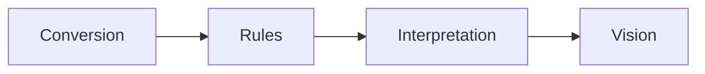

- **Conversion**: Is there usable text in the PDF? Yes → the whole document.
- **Rules**: Can I extract with predefined patterns? Yes → stop.
- **Interpretation**: Does an LLM over the reconstructed text see the fields? Yes → stop.
- **Vision**: Does a VLM read the pixels directly? Last resort.

Each step is governed by the **Validator**: "could not" is defined in a single place.

### Contrast

Two flows over the same field, compared. This defines confidence.

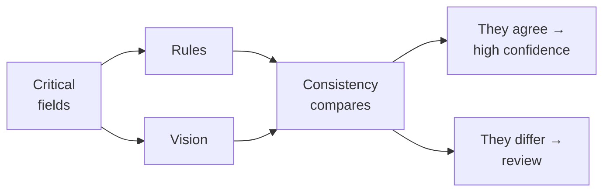

**Without contrast, the hybrid is just a fallback.** Internal validation does not see the plausible-but-false error: a total of 15400 that was 1540, with the correct shape and type. But if Rules reads 1540 and Vision reads 15400, the disagreement appears — and it is the strongest signal available.

Cost is bounded by contrasting **per critical field** (amounts, identifiers) and not the whole document.

---

## Components by level

| Component | Level | When | What it does | Rules | Interp. | Vision |
|---|---|---|---|:---:|:---:|:---:|
| **Segmenter** | File | Inside | Groups pages into logical documents | ✓ | ✓ | ✓ |
| **Identifier** | Document | Inside | Determines the type and the routing | ✓ | ✓ | ✓ |
| **Diagnosis** | Page | Inside | Detects content, measures quality, adapts | ✓ | ✓ | — |
| **Reader** | Page | Inside | Extracts tokens by conversion or OCR | ✓ | ✓ | — |
| **Reconstructor** | Pages | Inside | Layout, tables, reading order | ✓ | ✓ | ◐ |
| **Validator** | Field | Inside | Shape, type, content, check digit | ✓ | ✓ | ✓ |
| **Catalog** | Document | Inside | Validates against external sources | ✓ | ✓ | ✓ |
| **Consistency** | Document | **Between** | Cross-checks fields and compares flows | ✓ | ✓ | ✓ |
| **Contract** | Document | **After** | Canonical shape of the output | ✓ | ✓ | ✓ |
| **Reviewer** | All | **After** | Closes the loop with human corrections | ✓ | ✓ | ✓ |

Vision uses neither Diagnosis nor Reader: it hands pixels to the model, which reads and extracts in a single step. The ◐ for Reconstructor under Vision is for the same reason: the VLM absorbs one page's layout, but continuity across pages is still needed.

### Barriers

Three components cannot emit until another has finished:

| Barrier | Waits for |
|---|---|
| **Segmenter** | All pages read |
| **Consistency across flows** | Both flows over the same field |
| **Contract** | All pages resolved |

Page-level components are **parallelizable**. Consistency across fields is not a barrier: it operates inside one flow, over already-extracted fields.

---

## Components in depth

### Segmenter

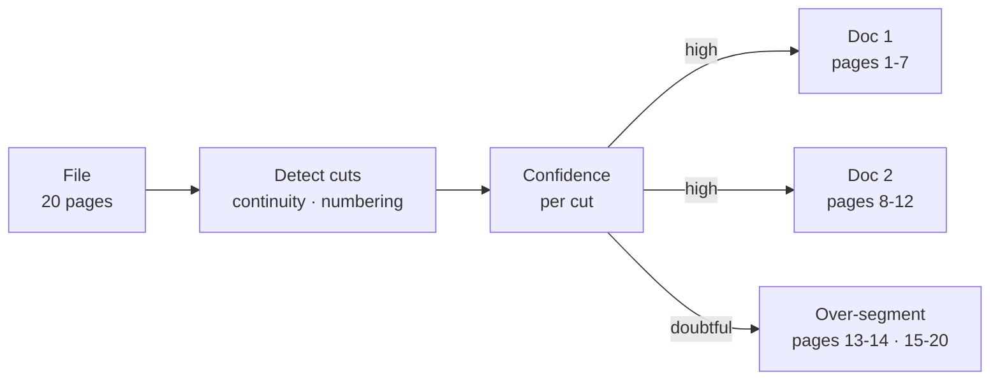

It groups the pages into logical documents before the Identifier. Without it, a PDF with three invoices is processed as one and the fields get mixed between documents.

Cut signals are restarted page numbering, a new document header, or the absence of continuity in open tables.

**It is the only component without an escape hatch.** All the others have a way out when in doubt: the Identifier routes aside, the Diagnosis routes aside with a reason, the Contract emits partially. The Segmenter decides first and its error is **unrecoverable downstream**: if it merges two documents, the second document's fields overwrite the first's and no later check notices.

Hence the asymmetry that governs its policy:

| Error | Consequence | Detected later |
|---|---|---|
| **Over-splitting** | Two documents where there was one | Yes: the Identifier returns the same type twice and the Contract sees missing fields in both |
| **Over-merging** | One document where there were two | **No**: the fields are mixed silently |

When a cut is doubtful, **over-segment**. One extra document is recoverable noise; one missing document is silent corruption.

---

### Identifier

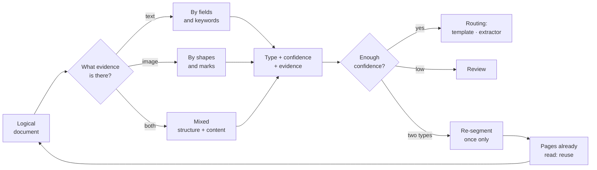

It determines the document type and the routing (which extractor processes it).

Three variants depending on which evidence is available: text only, image only, or both. The difference is not one of accuracy but of what can be observed.

It returns the **evidence** alongside the type: which words or shapes triggered the decision. Without that, a misclassified document is invisible and the error only shows up at the end, as a badly extracted field.

Low confidence routes to review instead of picking the most likely type. And an "other" category with its own route is needed: that is where new types come from.

**It has an edge back to the Segmenter, with three limits.** Segmenting well sometimes requires knowing the type, and identifying requires the segment: it is circular. When the evidence shows **two different types** in the same segment, the Identifier does not pick one: it returns the cut and forces re-segmentation. But a loop without a stopping condition is a risk, so:

| Limit | Why |
|---|---|
| **A single re-segmentation** | If the second pass again yields two types, it goes to review. There is no third |
| **Reuse what was already read** | Diagnosis and Reader are page-level and do not depend on the cut: they are kept. Re-segmenting does not mean re-reading |
| **Feed the cut confidence** | The case is recorded, and if the same pattern repeats, the Segmenter adjusts its threshold |

That last point closes the overlap between the two mechanisms: **doubt splits, error returns**. If the Segmenter was in doubt, it already over-segmented — the "two types" case should not appear. If it does appear, it is because the cut confidence came back high and it got it wrong, and that signal is exactly what the threshold needs in order to correct itself.

---

### Diagnosis

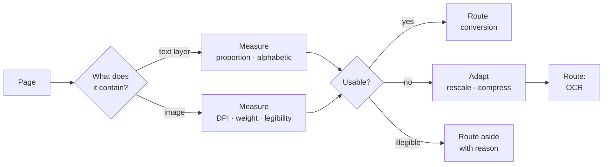

It runs before reading and does three things: it **detects** what is there, **measures** whether it is processable, and **adapts** the input.

Asking whether text exists is not enough: you have to see whether it is usable. A PDF may carry an old, bad OCR layer; routing by presence sends it to conversion and drags those errors along without anyone reviewing them. The check is one of proportion and quality — a layer with 40 characters on an A4 sheet is garbage.

Legibility is not the same as resolution: an image may have enough DPI and still be out of focus. If it fails, there are two valid outcomes (preprocess or route aside) and one invalid one: passing it to OCR anyway and letting it return invented text indistinguishable from a real reading.

---

### Reader

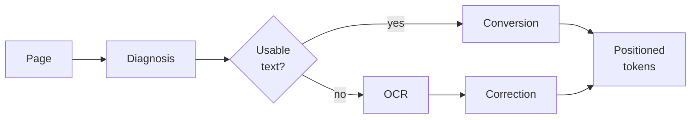

| Path | Input | Correction | Confidence |
|---|---|:---:|---|
| Conversion | Existing text layer | No | 1.0 |
| OCR | Image | Yes | Estimated |

Correction exists only in OCR: a converter does not read badly, it transcribes what is there. Applying a language model to it "just in case" can only introduce damage.

Routing is **per page**: a mixed PDF combines both paths and joins them at the end.

**It returns tokens, not text.** The distinction matters: if the Reader delivered already-ordered text, it would absorb part of the Reconstructor and that component would not be needed. It delivers **tokens with coordinates**, with no reading order resolved — that way the Reconstructor has a reason to exist and both text flows need it equally.

---

### Reconstructor

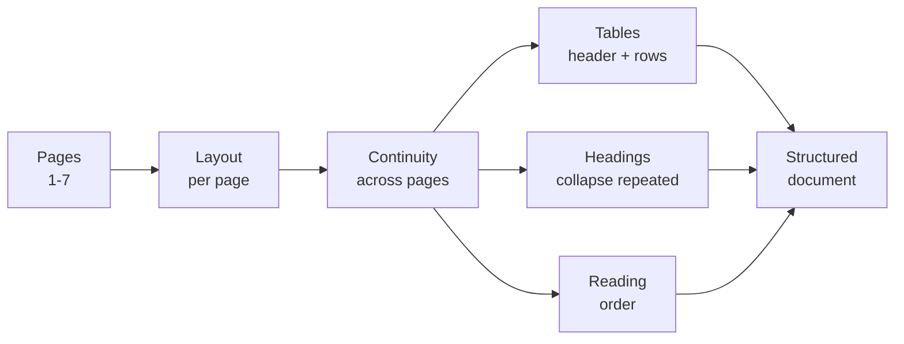

It receives **several pages**, not one: layout is local, but continuity crosses pages.

- A table with a header on one page and rows that continue on the next loses the association if each page is processed in isolation.
- A header repeated across all 5 pages is captured 5 times without continuity control.

**It runs in Rules and Interpretation; in Vision only the continuity part.** The VLM absorbs each page's layout, but continuity across pages is still needed.

---

### Validator

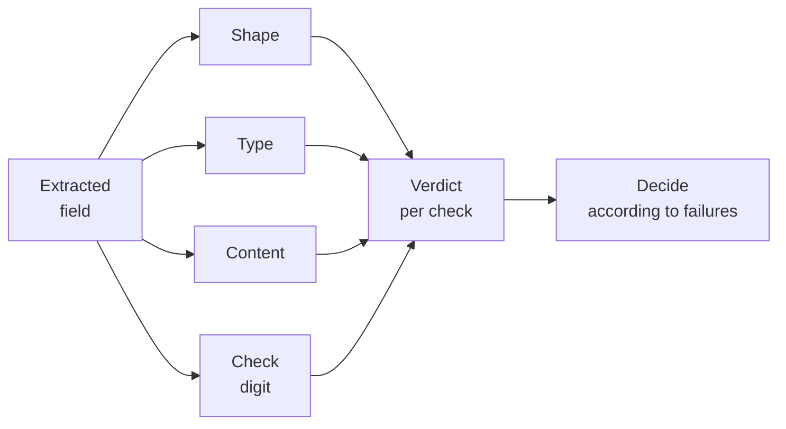

Four **independent** checks: each one looks at the same field and issues its own verdict. They are not chained — a correct shape does not enable the type check, nor the other way around.

| Check | Question | What it sees that the others do not | Failure → |
|---|---|---|---|
| **Shape** | Does it have the expected shape? | That *something* with the correct appearance is there | Retry with another anchor |
| **Type** | Is it of the type it claims to be? | That the value is usable | Retry, otherwise review |
| **Content** | Is it admissible in the domain? | That it matches the business: the only one that knows the rules | Review |
| **Check digit** | Is it valid in itself? | Mathematical guarantee: the only one with no false positives | Reject |

The table order goes from weakest to strongest, but **that order does not describe execution**: all four run over the same field and none needs another's result.

The final decision combines the verdicts, and **the most severe failure governs**: a field can pass shape and type, fail content, and route to review; or fail the check digit and be rejected even though the other three pass.

**The Validator is the one that governs escalation.** "Could not" is defined here and nowhere else. The policy used to live scattered across three components — Identifier, Diagnosis and Validator — with none of them aware of the others; centralizing it here is what makes it applicable.

**Two different cases escalate differently:**

| Case | What is there | How it escalates |
|---|---|---|
| **Invalid field** | Value, page and offset | **Targeted**: that region is rendered and that field is asked about |
| **Missing field** | Nothing: it did not find the anchor | **Whole document**: there is no region to point at |

The difference decides the cost. An invalid field has a location, so Vision looks at a crop: cheap and precise. A missing field has nowhere to look, so Vision has to re-read the entire document just as if it were the only flow.

That is why **"reprocess those 2, not the 20" applies only to the first case**. If escalation is mostly due to missing fields, the saving is not one order of magnitude but none at all.

#### Pending business rules

The Validator currently runs 4 universal checks (Shape, Type, Content, Digit). But the domain has additional rules that are not yet formalized.

**Categories of missing rules:**

| Category | Examples | Status |
|---|---|---|
| **Range validations** | Amount > 0; date not in the future; percentage between 0-100 | ⏳ Pending definition |
| **Relations between fields** | Issue date ≤ due date; subtotal ≤ total | ⏳ Pending definition |
| **Conditional rules** | If tax=VAT then a rate must be present; if it is an invoice A then it must have a CUIT | ⏳ Pending definition |
| **Structural validations** | Number of lines > 0; table has a header | ⏳ Pending definition |
| **Domain-specific business rules** | Amounts respect currency rounding; CUIT valid by province | ⏳ Pending definition |
| **Cross-document checks** | If there is a debit, there must be a source voucher | ⏳ Pending definition |

**How they integrate:** Each new rule follows the same model as the 4 checks — it issues its own verdict and the most severe failure governs. They run in parallel, not chained. The decision of which rules apply per document type is the Identifier's responsibility (when routing).

**Where they are defined:** The concrete rules will go in a separate file (e.g. `reglas-negocio.md` or `d.md`) with the format: Document type → Fields → Rules → How it fails → What escalates.

---

### Consistency

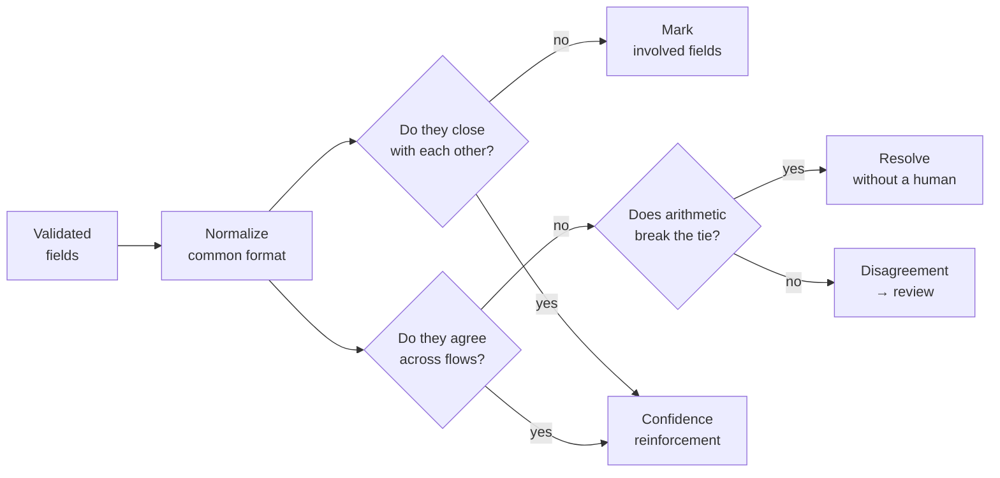

It compares values against each other at two levels:

| Level | What it compares | Example |
|---|---|---|
| **Between fields** | Arithmetic and ordering inside the document | subtotal + taxes = total; issue ≤ due |
| **Across flows** | The same field extracted by two paths | total according to Rules vs. total according to Vision |

**The across-flows level is the answer to the plausible-but-false error.** A total of 15400 that was 1540 passes shape, type and content and has no check digit: no internal check sees it. But if Rules reads 1540 and Vision reads 15400 on the same document, the disagreement appears — and it is the strongest signal available in the whole system.

#### How to make contrast usable

**Normalize first.** Otherwise you compare format instead of value: `1.540,00` against `1540.00`, a CUIT with spaces against one without. Both values have to be brought to canonical form and **the normalized ones compared**, not the raw ones.

**Tolerance by field type.**

| Type | Tolerance | Why |
|---|---|---|
| Amounts | Cents | Rounding between paths is legitimate |
| Identifiers | **Exact** | A CUIT has no rounding: a different digit is an error |
| Dates | Exact | There is no approximate equivalent |

**Let arithmetic arbitrate.** The two levels are not independent. If the flows differ on the total but only one of the two values closes with the document's own `subtotal + taxes`, **Consistency already has the answer** and no human is needed. The arithmetic level breaks the tie at the across-flows level.

Only when neither of the two closes, or the field is an identifier with no arithmetic relation, does the disagreement go to review.

**Cost.** Running two flows over everything is expensive, so contrast is reserved: per critical field (amounts, identifiers) and not per whole document.

---

### Catalog

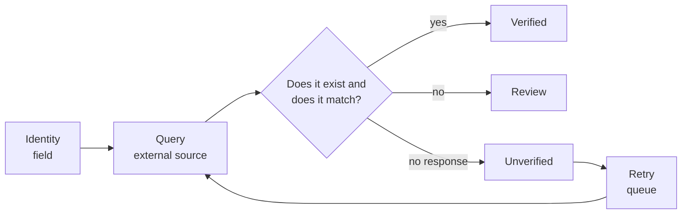

It validates against something that exists outside the document: a supplier registry, the issuing authority's service, an identifier's registry.

**It is the only one that closes the gap for identity fields.** A CUIT can have a correct check digit and belong to a company that did not issue the document. No internal check distinguishes it; querying it against the source does.

Different from Consistency: that one compares the document against itself, this one against external reality. And different from the Validator in that **it is not deterministic** — it depends on a third party's availability and latency.

That is why failure due to unavailability is not a rejection: if the external source does not respond, the field remains **unverified**, not invalid. Confusing the two turns a service outage into a queue of rejections.

**`Unverified` has an owner: the Catalog itself.** It keeps its **retry queue** with backoff, and the state is visible in the output as a pending field, not as a missing field. Without its own retry, the state is a hole through which documents with never-confirmed identity leak away.

---

### Contract

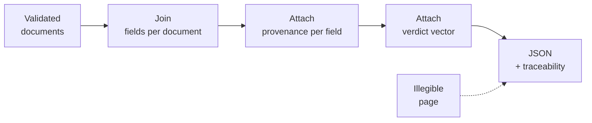

Emitting is a **barrier**: it waits until all pages are resolved before producing the document's output.

It joins the fields that came from different pages and attaches the `(page, flow)` trace per field.

**It handles heterogeneous provenance.** With per-field escalation, one document holds fields resolved by Rules with an `exact offset` alongside fields resolved by Vision with an `approximate bbox`. The Contract cannot assume a single origin: each field declares its flow and its trace type.

**It emits the verdict vector, not a score.** A field accumulates signals from five sources: cut confidence, Reader confidence, the Validator's four verdicts, Consistency's reinforcement or disagreement, and the Catalog's verified/unverified. Collapsing them into a number repeats the mistake the Catalog prohibits: mixing `unverified due to service outage` with `verified and matching`.

So each field is emitted with its verdicts kept separate:

```json
{
  "total": {
    "value": "15400.00",
    "flow": "rules",
    "trace": { "page": 3, "offset": [412, 424] },
    "verdicts": {
      "shape": "ok",
      "type": "ok",
      "content": "ok",
      "digit": null,
      "consistency": "ok",
      "catalog": "unverified"
    }
  }
}
```

**The threshold is set by the consumer.** There is no single magic number: for one use case, `unverified` on identity is blocking; for another, an amount with `content: doubtful` is acceptable.

Failure is **partial**: an illegible page is marked as such and the rest of the document is still emitted, with that absence declared.

---

### Reviewer

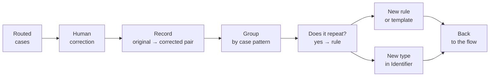

It closes the loop. Without it, the architecture ends at "review" and everything review produces is lost.

It receives what the others routed out: low Identifier confidence, illegible pages from Diagnosis, content failures from the Validator, Consistency disagreements, and the "other" category.

It has three outputs:

| Output | When |
|---|---|
| **Corrected datum** | The case was a one-off: it is fixed and moves on |
| **New rule** | The case repeats: it goes to Rules and stops reaching review |
| **New type** | The "other" category accumulates cases: a type and its route are defined |

It is also the one that closes the Segmenter's loop: when the Identifier returns two types in one segment, the case comes back here and the re-segmentation becomes a rule if it repeats.

**Without the Reviewer, the system does not improve.** Human corrections pile up in logs nobody reads and the same errors return in every batch.

---

## The three flows

Each resolves what it can and hands the next one what it could not. Escalation is governed by the Validator.

### Rules

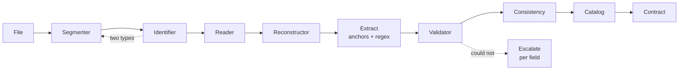

### Interpretation

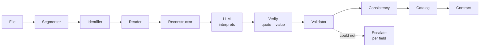

### Vision

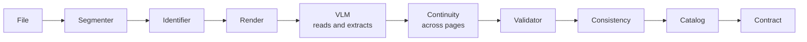

All three end at the **Reviewer**: whatever is routed out for any reason comes back, is corrected, and becomes a rule or a new type.

---

## Flow comparison

| | Rules | Interpretation | Vision |
|---|---|---|---|
| Receives | Nothing | Text | Pixels |
| Sees signatures, seals | If modeled | No | Yes |
| Cost | Low | Medium | High |
| **Invents values** | No | Yes | Yes |
| **Anchors badly** | Yes: textual proximity | Yes: semantic confusion | Yes: wrong row or region |
| How it errs | Takes a real value from the neighboring block | Attributes a real value to the wrong field | Reads the row that was not |
| Deterministic | Yes | No | No |
| Traceability | Exact offset | Quote + offset | Approximate bbox |

**All three anchor badly.** What changes is the mechanism and the frequency, not the existence of the problem. The useful difference is not *whether* they anchor badly, but **how each error is detected**:

| Error | Detected with |
|---|---|
| Invented value | Arithmetic, check digit |
| Bad anchor in Rules | **Only cross-flow contrast**: the value exists and has the correct shape and type |
| Bad anchor in Interpretation | Contrast, or a quote that does not support the value |
| Bad anchor in Vision | Contrast, or a bbox outside the expected region |

This reinforces a central point: **contrast is not an optimization, it is the only mechanism that sees the most silent class of error** — the one that produces a valid value in the wrong place.

---

## Invariants

They apply to all three flows:

- **When the Segmenter is in doubt, over-segment.** Splitting too much is detected later; merging too much is silent and contaminates fields from other documents.
- **The re-segmentation loop runs once only.** A loop without a cap is a risk; the second pass is final.
- **The model never replaces the Validator.** Arithmetic catches hallucination in amounts.
- **The quote proves provenance, not correctness.** Verify the literal and the value separately.
- **Structure is validated separately.** A shifted column has real amounts and passes any value check.
- **Normalize before comparing.** Otherwise you measure format instead of value, and the review queue fills with spelling differences.
- **Emission is a verdict vector, not a score.** The threshold is set by the consumer, who knows their use case.
- **The trace declares page and flow.** With per-field escalation, provenance stops being single.
- **Failure is partial.** An illegible page marks that page; it does not discard the whole document.
- **`Unverified` is not a final state.** It needs an owner and a retry queue, or it is invisible debt.
- **Without a return loop, the system does not improve.** The corrections that do not go back into the flow are the ones that make the same error repeat.
- **Auditing is not normalizing.** See `d.md`.

---

## Known limitations

They are declared rather than assumed covered:

| Limitation | Why it is not solved inside |
|---|---|
| Plausible but false value | Needs cross-flow contrast or an external source; no internal check sees it |
| Bad anchor in any of the three flows | The value is real and of the correct type; only contrast detects it |
| Doubtful segmentation cut | Over-segmentation mitigates, it does not eliminate |
| External source down | It is retried, but meanwhile the field stays unverified |
| Missing field escalated | With no prior location, Vision re-reads the whole document: there is no saving |
