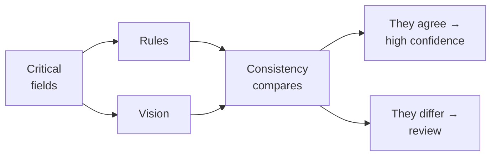
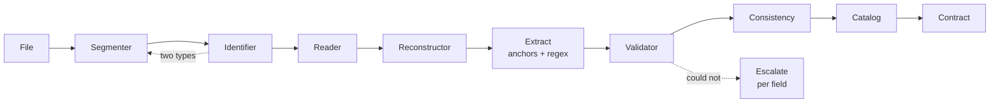
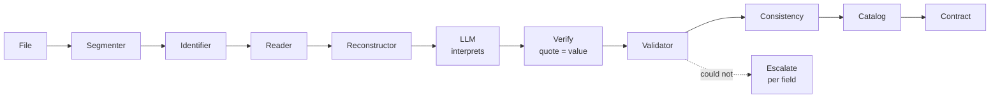
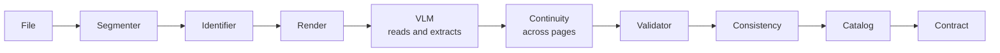

# Document extraction

Architecture overview. Component details are in `components.md`, the input-specific routes in `workflow.md`, and the product spec in `my_prompt.md`.

## Overview

This system solves one problem: **extracting information from mixed documents with enough confidence** to automate processes that require it (invoicing, compliance, auditing).

Confidence does not come from a single method — it comes from:
1. **Three cascading flows**: each one is more expensive but more accurate than the previous
2. **Internal validation**: arithmetic, check digit, business rules
3. **Contrast between flows**: when two independent methods see the same thing, confidence rises
4. **External lookup**: verifying identity against reality outside the document

Without contrast, the system sees logical errors (2+2=5). Without external lookup, it does not see identity errors (a valid CUIT but the wrong company). Both are needed.

---

## Key terminology

**Flows** are named by what the extractor receives. **Components**, by what they produce.

| Flow | Receives |
|---|---|
| **Rules** | Nothing |
| **Interpretation** | Text |
| **Vision** | Pixels |

| Component | Produces |
|---|---|
| **Segmenter** | Logical documents + cut confidence |
| **Identifier** | Document type + evidence |
| **Diagnosis** | Route and input warnings |
| **Reader** | Positioned tokens + confidence |
| **Reconstructor** | Structured document |
| **Validator** | Per-field verdict |
| **Consistency** | Verdict across fields and across flows |
| **Catalog** | Verdict against an external source |
| **Contract** | Shape of the output |
| **Reviewer** | Corrections + new cases |

---

## Levels

A file is not a document. A 20-page PDF may contain one invoice, or three.

| Level | What it is |
|---|---|
| **File** | What enters the system |
| **Document** | A unit with a meaning of its own inside the file |
| **Page** | The physical unit of processing |

---

## Decision architecture

### Cascade

The hybrid resolves cost: each stage does the cheapest thing and hands the next one what it could not do.

- **Conversion**: Is there usable text in the PDF? Yes → the whole document.
- **Rules**: Can I extract with predefined patterns? Yes → stop.
- **Interpretation**: Does an LLM over the reconstructed text see the fields? Yes → stop.
- **Vision**: Does a VLM read the pixels directly? Last resort.

Each step is governed by the **Validator**: "could not" is defined in a single place.

### Contrast

Two flows over the same field, compared. This defines confidence.

**Without contrast, the hybrid is just a fallback.** Internal validation does not see the plausible-but-false error: a total of 15400 that was 1540, with the correct shape and type. But if Rules reads 1540 and Vision reads 15400, the disagreement appears — and it is the strongest signal available.

Cost is bounded by contrasting **per critical field** (amounts, identifiers) and not the whole document.

---

## Components

The ten components, their diagrams, barriers and escalation policy are in **`components.md`**.

| Component | Level | What it does |
|---|---|---|
| **Segmenter** | File | Groups pages into logical documents |
| **Identifier** | Document | Determines the type and the routing |
| **Diagnosis** | Page | Detects content, measures quality, adapts |
| **Reader** | Page | Extracts tokens by conversion or OCR |
| **Reconstructor** | Pages | Layout, tables, reading order |
| **Validator** | Field | Shape, type, content, check digit |
| **Catalog** | Document | Validates against external sources |
| **Consistency** | Document | Cross-checks fields and compares flows |
| **Contract** | Document | Canonical shape of the output |
| **Reviewer** | All | Closes the loop with human corrections |

Two of them carry the weight of the architecture: the **Validator** defines "could not" in a single place and governs escalation, and the **Contract** emits a verdict vector per field instead of a score. Both are explained in `components.md`.

---

## The three flows

Each resolves what it can and hands the next one what it could not. Escalation is governed by the Validator.

### Rules

### Interpretation

### Vision

All three end at the **Reviewer**: whatever is routed out for any reason comes back, is corrected, and becomes a rule or a new type.

---

## Flow comparison

| | Rules | Interpretation | Vision |
|---|---|---|---|
| Receives | Nothing | Text | Pixels |
| Sees signatures, seals | If modeled | No | Yes |
| Cost | Low | Medium | High |
| **Invents values** | No | Yes | Yes |
| **Anchors badly** | Yes: textual proximity | Yes: semantic confusion | Yes: wrong row or region |
| How it errs | Takes a real value from the neighboring block | Attributes a real value to the wrong field | Reads the row that was not |
| Deterministic | Yes | No | No |
| Traceability | Exact offset | Quote + offset | Approximate bbox |

**All three anchor badly.** What changes is the mechanism and the frequency, not the existence of the problem. The useful difference is not *whether* they anchor badly, but **how each error is detected**:

| Error | Detected with |
|---|---|
| Invented value | Arithmetic, check digit |
| Bad anchor in Rules | **Only cross-flow contrast**: the value exists and has the correct shape and type |
| Bad anchor in Interpretation | Contrast, or a quote that does not support the value |
| Bad anchor in Vision | Contrast, or a bbox outside the expected region |

This reinforces a central point: **contrast is not an optimization, it is the only mechanism that sees the most silent class of error** — the one that produces a valid value in the wrong place.

---

## Invariants

They apply to all three flows:

- **When the Segmenter is in doubt, over-segment.** Splitting too much is detected later; merging too much is silent and contaminates fields from other documents.
- **The re-segmentation loop runs once only.** A loop without a cap is a risk; the second pass is final.
- **The model never replaces the Validator.** Arithmetic catches hallucination in amounts.
- **The quote proves provenance, not correctness.** Verify the literal and the value separately.
- **Structure is validated separately.** A shifted column has real amounts and passes any value check.
- **Normalize before comparing.** Otherwise you measure format instead of value, and the review queue fills with spelling differences.
- **Emission is a verdict vector, not a score.** The threshold is set by the consumer, who knows their use case.
- **The trace declares page and flow.** With per-field escalation, provenance stops being single.
- **Failure is partial.** An illegible page marks that page; it does not discard the whole document.
- **`Unverified` is not a final state.** It needs an owner and a retry queue, or it is invisible debt.
- **Without a return loop, the system does not improve.** The corrections that do not go back into the flow are the ones that make the same error repeat.
- **Auditing is not normalizing.** See `d.md`.

---

## Known limitations

They are declared rather than assumed covered:

| Limitation | Why it is not solved inside |
|---|---|
| Plausible but false value | Needs cross-flow contrast or an external source; no internal check sees it |
| Bad anchor in any of the three flows | The value is real and of the correct type; only contrast detects it |
| Doubtful segmentation cut | Over-segmentation mitigates, it does not eliminate |
| External source down | It is retried, but meanwhile the field stays unverified |
| Missing field escalated | With no prior location, Vision re-reads the whole document: there is no saving |
