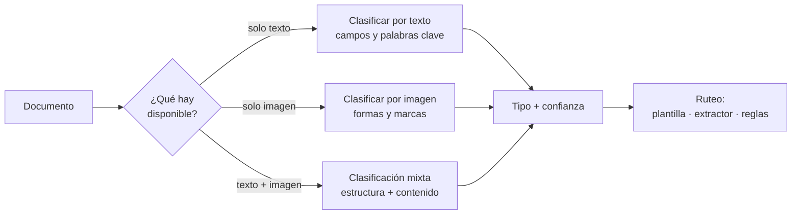
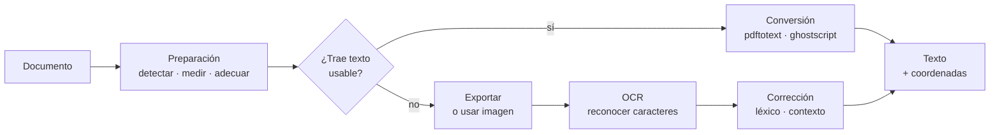
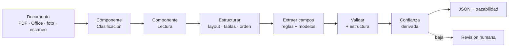
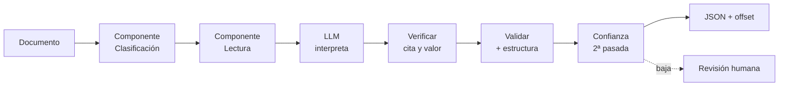
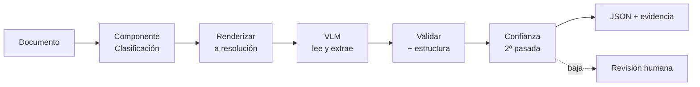
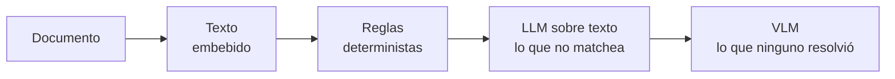

# Extracción de documentos

Pipeline para extraer datos estructurados de documentos heterogéneos: facturas, órdenes de compra, formularios, contratos, reportes.

## Subflujos y componentes

Los flujos principales comparten actividades que aparecen en más de uno. Se definen una vez acá y se referencian desde cada flujo, en lugar de repetirlas.

| Componente | Qué resuelve | Lo usan |
|---|---|---|
| **Clasificación** | Determina qué es el documento y qué ruta toma | Los tres |
| **Lectura** | Obtiene texto y estructura: por conversión determinista o por OCR | Tradicional, AI sobre texto |
| ↳ *Preparación* | Detecta qué contiene, mide su calidad y lo adecúa antes de leer | Los dos anteriores |
| **Estructurar** | Layout, tablas y orden de lectura | Tradicional |
| **Validación** | Cuatro chequeos sobre un valor: forma, tipo, consistencia, dominio | Los tres, en varios puntos |
| **Esquema** | Contrato de salida de los datos | Los tres |

### Componente: Clasificación

Corre primero y decide el ruteo: qué tipo de documento es y, con eso, qué plantilla, qué extractor y qué reglas se aplican. Se puede implementar sobre texto, sobre imagen, o sobre ambos.



#### Las tres variantes

| Variante | En qué se basa | Ejemplo |
|---|---|---|
| **Solo texto** | Presencia y combinación de campos o palabras clave | Es factura si tiene fecha, importe y número de comprobante |
| **Solo imagen** | Formas, marcas y símbolos gráficos | Es tipo A/B/C según el rectángulo con la letra en el encabezado |
| **Mixto** | Estructura del layout **más** el contenido | Es factura si tiene encabezado, cuerpo de ítems y pie de totales, **y** esos bloques contienen fecha, importes y descripción |

La diferencia entre las tres no es de precisión sino de **qué evidencia está disponible**:

- **Solo texto** sirve cuando el documento ya trae texto legible y el tipo se distingue por su contenido. Es el más barato y el más fácil de auditar: la decisión se justifica mostrando las palabras que la dispararon.
- **Solo imagen** sirve cuando lo distintivo es gráfico y no está escrito como texto interpretable. El caso del recuadro con la letra A/B/C es típico: hay que ver la forma y el símbolo, no leer una palabra.
- **Mixto** es el más robusto cuando ninguno de los dos alcanza. Clasificar por texto solo puede fallar en documentos que dicen lo mismo pero se ven distintos; por imagen solo, en documentos que se ven igual pero difieren en el contenido.

#### Por qué es un componente y no una etapa suelta

Porque las tres variantes tienen la misma interfaz y el mismo rol: reciben el documento y devuelven **tipo + confianza**. El flujo no necesita saber cómo se decidió.

```
clasificar(documento) → (tipo, confianza, evidencia)
```

Y la evidencia importa tanto como el tipo: guardar qué palabras, formas o bloques dispararon la decisión permite auditar la clasificación y detectar tipos nuevos que empiezan a aparecer. Sin esa traza, un documento mal clasificado es invisible — se procesa con la plantilla equivocada y el error aparece recién al final, como un campo mal extraído.

#### El error de clasificación contamina todo lo que sigue

A diferencia de un error de lectura —que afecta un campo— un error de clasificación cambia el camino completo: se aplica la plantilla equivocada, el extractor equivocado y las reglas equivocadas. Todo el resto del pipeline trabaja con el supuesto incorrecto.

Dos consecuencias de diseño:

- **Confianza baja no debería decidir: debería derivar.** Si la clasificación no supera un umbral, conviene mandar a revisión en vez de elegir el tipo más probable y seguir.
- **Los tipos nuevos necesitan una salida.** Un clasificador cerrado sobre las categorías conocidas va a forzar todo lo desconocido dentro de la categoría más parecida. Hace falta una categoría "otro" con su propia ruta, y un registro de esos casos, que es de donde salen las categorías nuevas.

### Componente: Lectura

Obtiene el texto del documento. Antes de leer, un subcomponente **prepara** el archivo: mide qué contiene y en qué estado, y adecúa la entrada. Después rutea al camino que corresponda, y la diferencia entre caminos no es de calidad sino de naturaleza: uno extrae, el otro interpreta. La corrección solo aplica al segundo.



#### Subcomponente: Preparación

Corre antes de cualquier lectura y hace tres cosas: **detecta** qué hay en el archivo, **mide** si es procesable, y **adecúa** la entrada para que la lectura tenga chance.

| Chequeo | Qué mira | Qué decide |
|---|---|---|
| **PDF · proporción de texto** | Cuánta capa de texto hay por página, y si es usable | Conversión o exportar imagen |
| **DOCX · contenido** | Si el cuerpo es texto estructurado o imágenes embebidas | Parsear el marcado o exportar imagen |
| **Imagen · resolución** | DPI y dimensiones | Leer como está, reescalar o rechazar |
| **Imagen · peso** | Bytes y tamaño del lienzo | Comprimir o dividir antes de procesar |
| **Imagen · legibilidad** | Nitidez, contraste, inclinación | Procesar, preprocesar o derivar |

**No alcanza con preguntar si hay texto: hay que ver si es usable.** Un PDF escaneado puede traer una capa de OCR de una pasada anterior, mala. El archivo "tiene texto", así que el ruteo por presencia lo manda a conversión — y arrastra los errores de esa capa vieja sin que nadie los revise. Por eso el chequeo es de **proporción y calidad**, no de existencia: cuántos caracteres por página, qué proporción son alfabéticos, si la longitud es coherente con el área de la página. Una capa con 40 caracteres en una página A4, o llena de símbolos sueltos, es basura y corresponde tratarla como imagen.

**Las medidas son por página, no por documento.** Un expediente armado a mano mezcla páginas digitales con escaneos, y el porcentaje global no dice nada útil sobre ninguna de las dos. Cada página se mide y se rutea por separado.

**El DPI se adecúa, no solo se mide.** Por debajo de cierto umbral el OCR falla de forma sistemática, y el umbral depende del cuerpo de texto: letra chica necesita más resolución que letra grande. Un valor orientativo para texto de cuerpo normal es ~300 DPI; muy por debajo de eso conviene reescalar y registrar que se hizo, porque el reescalado mejora la lectura pero no recupera información que nunca se capturó.

**Legibilidad es distinto de resolución.** Una imagen puede tener DPI suficiente y aun así no ser procesable: desenfocada, con contraste plano, o muy inclinada. Los indicadores habituales son la varianza del laplaciano para nitidez, el rango dinámico para contraste, y el ángulo detectado para inclinación. Si el archivo no pasa, hay dos salidas válidas —preprocesar o derivar a revisión— y una inválida: pasarlo al OCR igual y dejar que devuelva texto inventado que después nadie puede distinguir de una lectura real.

**Cuando se rechaza, se registra el motivo.** Un documento ilegible derivado con la razón explícita es información: puede indicar que el escáner está mal configurado, que el origen manda fotos de baja calidad, o que hace falta pedir el documento de nuevo. Sin el motivo, es solo un archivo que no se procesó.

#### Ruteo

| Caso | Camino | Cómo | Corrección |
|---|---|---|---|
| **Trae texto usable** | Conversión | `pdftotext`, `ghostscript` y similares extraen la capa existente | No |
| **PDF sin texto usable** | Exportar + OCR | Se extrae la imagen embebida y se le aplica OCR | Sí |
| **Imagen** | OCR | Se le aplica OCR directo | Sí |

#### Por qué la corrección solo aplica a un camino

**Un conversor no lee mal: extrae lo que está.** `pdftotext` no interpreta píxeles, no estima formas, no adivina caracteres. Toma la capa de texto que el archivo ya tiene y la transcribe. Si esa capa dice algo incorrecto, el problema está en el PDF —no en el conversor— y ninguna corrección léxica o contextual lo arregla. Aplicarle un modelo de lenguaje "por las dudas" solo puede introducir daño.

**Un OCR sí interpreta, y por eso puede equivocarse.** Reconstruye caracteres a partir de píxeles, con confianza estimada y errores predecibles. Ahí sí tiene sentido corregir, y ahí está todo el cuidado que se describe abajo.

De esta asimetría sale una regla simple: **la corrección pertenece al camino de imagen, nunca al de conversión.** El ruteo entre ambos es lo que decide si entra o no.

#### El ruteo es por página, no por documento

Un PDF puede tener texto en unas páginas e imágenes escaneadas en otras — es habitual en expedientes armados a mano. Decidir por documento fuerza un camino equivocado sobre la mitad del archivo. La verificación se hace **página por página**: si la capa de texto está vacía o es basura, esa página va a OCR; si no, va a conversión. Ambos caminos pueden convivir en un mismo documento y el resultado se une al final.

#### Qué devuelve cada camino

| | Conversión | OCR |
|---|---|---|
| Texto | Exacto | Estimado |
| Coordenadas | Exactas, del registro fuente | Estimadas |
| Confianza | 1.0, no aplica | Por token |
| Traza de corrección | No existe | Par `original → corregido` |

Misma forma de salida, distinta fidelidad. Esa propiedad es lo que permite que el flujo trate a los dos caminos como un solo componente.

#### Corrección: tres tipos, no dos

Aplica **solo** sobre la salida del OCR.

| Tipo | Cómo corrige | Ejemplo |
|---|---|---|
| **Palabra aislada** | Diccionario, tabla de confusiones del motor | `recibo` mal segmentado |
| **Dependiente del contexto** | Modelo de lenguaje sobre la frase o el párrafo | `c0nteo` → `conteo` |
| **Nivel campo** | Validación posterior a la extracción | suma que no cierra, dígito verificador |

El tipo del medio es el que necesita semántica, y ninguno de los otros dos lo resuelve: un diccionario no tiene `c0nteo` (con cero) porque no distingue un error de una palabra desconocida, y si el término está en texto libre no hay campo que validar.

**Se corrige lo que es prosa, no lo que es identificador.** El mismo mecanismo que arregla `c0nteo` puede arruinar un CUIT o un importe convirtiéndolo en un valor plausible pero falso. Medido en documentos de dominio técnico: un LLM sin restricciones sobre-corrige y empeora el texto por debajo del OCR original, por "alucinaciones de terminología" sobre códigos válidos.

Por eso la corrección por contexto solo actúa con tres restricciones:

1. **Léxico de dominio** — el texto corregido se compara contra términos conocidos, para no reemplazar términos válidos.
2. **Conjuntos de confusión** — si la corrección propuesta no coincide con la tendencia esperada, se revierte.
3. **Validación de formato por reglas** — patrones fijos (identificadores, importes, fechas) se verifican con regex, no con el modelo.

**Nunca corregir en silencio.** Cada corrección se registra como par con su razón. Sin eso se pierde la trazabilidad, y se pierde la mejor señal de calidad de lectura que hay: el conteo de correcciones por tipo sobre el corpus dice más que cualquier accuracy global. Los valores más sensibles son importes, unidades y cifras, donde un cambio silencioso afecta directo el dato final.

#### Interfaz

El componente devuelve una forma única, sin importar el camino que haya tomado:

```
leer(documento) → (texto, coordenadas por token, confianza por token, traza de corrección)
```

En el camino de conversión la confianza es 1.0, las coordenadas son exactas y la traza está vacía. En el de OCR todo es estimado y la traza tiene contenido. El consumidor recibe siempre la misma estructura — y por eso el ruteo entre caminos queda **dentro** del componente, no repetido en cada flujo.

### Componente: Validación

Corre en varios puntos del pipeline y sobre distintos objetos: un token de la lectura, un campo extraído, un conjunto de campos relacionados. Lo que cambia entre variantes es **qué pregunta responde**, no el mecanismo.

| Variante | Pregunta que responde | Ejemplo |
|---|---|---|
| **Forma** | ¿El texto tiene la forma esperada? | Un patrón regex con anclas: el importe después de "total a pagar" |
| **Tipo** | ¿El valor es del tipo que dice ser? | El precio es un número, la fecha es una fecha |
| **Contenido** | ¿El valor es admisible según el dominio? | El IVA es 10% o 21%, no 17% |
| **Dígito verificador** | ¿El identificador es válido en sí mismo? | El CUIT argentino cierra su dígito verificador |

#### Por qué son cuatro y no una

Cada variante detecta un error que las otras no ven, y el orden en que corren importa:

- **Forma** es la más débil: confirma que *algo* con la apariencia correcta está ahí. No dice si el valor es cierto. Un importe que matchea el patrón puede ser cualquier número.
- **Tipo** confirma que el valor es usable. Una fecha que no parsea no sirve, aunque tenga la forma esperada. Es el chequeo que evita que un valor inválido llegue a la base.
- **Contenido** confirma que el valor tiene sentido en el dominio. Es el único de los cuatro que **conoce el negocio**: un IVA de 17% es un número válido, es un tipo válido, y aun así es un error, porque en el dominio solo existen ciertas alícuotas.
- **Dígito verificador** es el más fuerte de todos, y el único que da una garantía matemática: si el dígito cierra, el identificador es válido por construcción. No hay falso positivo posible — un número inventado no pasa el chequeo salvo por azar de 1 en 10.

De ahí el orden natural: forma primero (descarta rápido), después tipo, después contenido, y dígito verificador cuando el campo lo tiene. Los cuatro son baratos, así que corren todos.

#### Dónde se reutilizan

El mismo conjunto de chequeos se aplica en puntos distintos, con distinto objeto:

| Punto del pipeline | Qué se valida |
|---|---|
| Dentro de la lectura | Que el texto salido del OCR tenga forma de texto: ratio de caracteres alfabéticos, longitud, coherencia |
| Al corregir OCR | Que una corrección propuesta no rompa un identificador ni un importe |
| Al extraer un campo | Forma, tipo, contenido y dígito verificador del campo individual |
| Entre campos | Consistencia: subtotal + impuestos = total, fecha de emisión ≤ vencimiento |
| Contra catálogos externos | Que el emisor exista en el padrón de proveedores conocidos |

Esto es lo que hace que valga como componente: **los mismos cuatro chequeos, aplicados en cinco lugares del pipeline.** Definirlos una vez evita tener cuatro implementaciones de "validar CUIT" con reglas que se van desincronizando.

#### Qué NO puede hacer esta capa

Ninguna de las cuatro variantes detecta un valor **plausible pero falso**. Un total de 15400.00 que en realidad era 1540.00 tiene forma válida, tipo válido, y si no hay otra cifra con la que cruzarlo, no hay contenido ni dígito verificador que lo delate.

Para eso hace falta comparar contra algo externo: un padrón, un servicio del ente emisor, o el mismo dato por otra vía. Es una etapa distinta y más costosa, y conviene tenerla como decisión explícita en vez de suponer que la validación ya la cubre.

#### Cuándo derivar y cuándo rechazar

Con cuatro variantes hace falta una política de qué hacer con cada falla:

| Falla en | Gravedad | Acción |
|---|---|---|
| Forma | El valor puede estar en otra parte del documento | Reintentar extracción con otra ancla |
| Tipo | El dato no es usable como está | Reintentar, si no, revisión |
| Contenido | El dato es usable pero no corresponde | Revisión humana: puede ser un caso legítimo no contemplado |
| Dígito verificador | El identificador es inválido | Rechazar, salvo error de lectura recuperable |

La distinción importa porque no todas las fallas significan lo mismo: contenido suele indicar una regla de negocio incompleta, mientras que dígito verificador indica un dato mal leído o mal inventado.

#### Interfaz

```
validar(valor, contexto) → (válido, variante_fallida, mensaje)
```

`contexto` es lo que permite que la misma función sirva en los cinco puntos: recibe el tipo de campo esperado, las reglas de dominio aplicables y el catálogo contra el que comparar. Devolver **qué variante falló** —no solo si es válido— es lo que alimenta la métrica por tipo de error y la política de derivación.

## Flujo tradicional (determinista)

Construido a mano: OCR, layout, reglas y plantillas por proveedor.



### Etapas del flujo tradicional

| # | Etapa | Qué hace | Salida |
|---|-------|----------|--------|
| 1 | **Clasificar** | **Componente Clasificación**: tipo de documento y ruteo | Tipo + confianza + evidencia |
| 2 | **Leer** | **Componente Lectura**: rutea internamente entre conversión y OCR | Texto + coordenadas + confianza |
| 3 | **Estructurar** | Reconstruye layout, tablas y orden de lectura | Documento estructurado |
| 4 | **Extraer** | Reglas con anclas semánticas, luego modelos para campos sin clave fija | Campos tentativos |
| 5 | **Validar** | **Componente Validación**: forma, tipo, contenido, dígito verificador, consistencia | Campos verificados |
| 6 | **Confianza** | Derivada de la evidencia: tipo de match, validaciones, ambigüedad | Score por campo |
| 7 | **Trazabilidad** | Origen del dato: offset de texto o bounding box | JSON auditable |

Un dato puede estar mal **y** pasar la validación aritmética: si una columna de la tabla se desplaza una posición, los importes existen, las citas son reales y la suma puede cerrar igual. Por eso la etapa 5 valida también la **estructura** (asociación encabezado–dato, alineación de columnas, integridad de filas), no solo los valores.

Si el documento trae un código impreso (QR, barras, PDF417), se decodifica dentro de la etapa 2 como una fuente de texto más. No cambia el flujo.

## Flujo AI sobre texto (LLM)

Le pasás texto ya extraído y el modelo interpreta qué hay. No ve la imagen: decide qué fragmento es el total, la fecha o el emisor por significado, sin regex ni anclas. Solo sirve si el dato está en el texto: si la respuesta depende de qué había arriba, al lado o dentro de otra cosa, no es un problema de texto.



### Etapas del flujo AI sobre texto

| # | Etapa | Qué hace | Salida |
|---|-------|----------|--------|
| 1 | **Clasificar** | **Componente Clasificación** (variante texto) | Tipo + confianza |
| 2 | **Leer** | **Componente Lectura**, paginado con índices | Texto indexado |
| 3 | **Definir esquema** | Campos `required` y `nullable`, con cita obligatoria por campo | Contrato de salida |
| 4 | **Interpretar** | El LLM asigna cada campo a su fragmento por significado | Valor + cita literal |
| 5 | **Verificar** | Busca el literal **y** comprueba que el valor sea el de la cita | Offset, o campo sospechoso |
| 6 | **Validar** | **Componente Validación**: forma, tipo, contenido, dígito verificador | Campos verificados |
| 7 | **Confianza** | Segunda pasada con distinto orden del texto: la discrepancia es la señal | Score por campo |
| 8 | **Trazabilidad** | Valor + offset + regla aplicada | JSON auditable |

**La cita no alcanza.** Una cita literal y verificable es *grounding*, no correctitud: es ortogonal al valor. Un modelo puede citar texto real y asignarle el importe equivocado. Por eso la etapa 4 verifica dos cosas — que el literal exista en el texto **y** que el valor extraído sea el que ese literal contiene. Sin lo segundo, medís grounding y creés que medís acierto.

**El esquema no garantiza completitud.** El mismo documento, mismo prompt y temperatura 0 puede devolver 15 campos en una corrida y 12 en la siguiente, sin ninguna señal. No es alucinación: el dato estaba y no se devolvió. Por eso la etapa 6 repite la pasada: un campo que aparece en una y no en la otra es el caso a revisar.

**Tope de salida obligatorio.** Existen entradas que disparan repetición indefinida hasta el límite de tokens. La etapa 2 debe fijar `max_output_tokens`, timeout y detección de repetición: sin eso, un solo documento puede generar facturación sin techo.

## Flujo AI sobre imagen (VLM)

Le pasás la página como imagen y el modelo lee y extrae en el mismo paso. No hay OCR previo, ni motor de layout, ni plantillas. Es el único que ve lo no textual (firma, sello, casilla marcada) y el único que funciona con manuscritos y plantillas nunca vistas.



### Etapas del flujo AI sobre imagen

| # | Etapa | Qué hace | Salida |
|---|-------|----------|--------|
| 1 | **Clasificar y alinear** | **Componente Clasificación** (variante imagen o mixta) + rotación a horizontal | Tipo + imagen alineada |
| 2 | **Renderizar** | Resolución elegida por el dato más chico a leer; recorte y centrado si está en el margen | Imagen normalizada |
| 3 | **Definir esquema** | Campos `required` con evidencia obligatoria por campo | Contrato de salida |
| 4 | **Leer y extraer** | El VLM lee la página y llena el esquema en un paso | Valor + evidencia |
| 5 | **Validar** | **Componente Validación**: forma, tipo, contenido, dígito verificador | Campos verificados |
| 6 | **Confianza** | Segunda pasada o recorte de la zona en conflicto | Score por campo |
| 7 | **Trazabilidad** | bbox aproximado, cruzado con la capa de texto si existe | JSON auditable |

**La resolución no es una constante, es la palanca de costo.** Los tokens visuales por página dominan la factura, y su cantidad se elige: menos tokens abarata y degrada la lectura de detalle, más tokens la mejora y encarece. Fijar "resolución fija" sin más esconde la única decisión económica del flujo. Elegila por el tamaño del dato más chico que necesitás leer, y validá con un set dorado que la elección no rompe campos.

**El sesgo de atención también aplica a imagen.** Los VLM atienden mejor las zonas centrales, salientes y de alto contraste que el detalle tenue de una esquina. Si el dato crítico es una marca chica en el margen, hay que recortarla y centrarla. Subir resolución por mosaicos tiene su propio punto ciego: un objeto que cruza dos mosaicos se cuenta doble o se pierde.

**El grounding empeora bajo degradación.** Lo específico de este flujo es justamente el caso difícil: fotos torcidas, sombras, baja resolución. Los VLM alucinan más en documentos degradados que en escaneos limpios, porque el entrenamiento supone entradas no degradadas. Si el corpus es de fotos de celular, ese es el benchmark que importa, no DocVQA.

## Puente: VLM como parser

Variante que combina los dos: el VLM convierte la página a **DocTags** — estructura con procedencia, no Markdown — y sobre ese texto corren las reglas deterministas. Se paga el costo de visión una vez, para leer.

La salida tiene que preservar la procedencia. **Markdown no sirve para esto**: descarta bounding boxes, orden de lectura, scores de confianza y estructura de tablas. Exportar a Markdown rompe la trazabilidad que este puente promete conservar. DocTags mantiene jerarquía, tablas y coordenadas; el Markdown queda solo para consumo humano o RAG, donde la procedencia no se audita.

## Comparación

| Dimensión | Tradicional | AI sobre texto | AI sobre imagen |
|---|---|---|---|
| Qué recibe el modelo | Nada | Texto plano | Píxeles de la página |
| Usa el componente Lectura | Sí | Sí | No |
| Etapas que reemplaza | — | Extracción por reglas | Lectura + estructura + extracción |
| Clasificación previa | Necesaria: variante texto | Necesaria: variante texto | Necesaria: variante imagen o mixta |
| Plantillas por proveedor | Necesarias | Ninguna | Ninguna |
| Layout nuevo | Regla nueva o reentrenar | Generaliza | Generaliza |
| Ve firmas, sellos, casillas | Solo si lo modelaste | No | Sí |
| Costo por documento | Bajo (CPU) | Medio (tokens de texto) | Variable: hasta 6× más caro que OCR, pero puede ser 20× más barato si hay compresión óptica |
| Determinismo | Reproducible | No determinista | No determinista |
| Trazabilidad | Nativa: las coordenadas del PDF son el registro fuente | Cita → offset verificable | bbox reconstruido: descarta el exacto que ya existía en la capa de texto |
| No alucina | Sí, por construcción | No | No |
| Un error, ¿de qué es? | Lectura o regla, aislado | Lectura ya validada, solo lógica | Lectura y razonamiento mezclados |

Sobre el costo: la intuición "imagen siempre más caro" es falsa. La representación óptica puede comprimir texto a menos tokens que el texto crudo (medido: 23,6× menos para 5 páginas, con ~97% de precisión a 10× de compresión). Y el **MoE** abarata el cómputo por token en cualquier modalidad, no solo en texto. Lo que decide la cuenta es la **tokenización y la resolución elegida**, no la arquitectura.

Sobre alucinación: los modelos especializados (`LayoutLM` y similares) clasifican los tokens que ya existen, así que no pueden inventar un valor — cuestan 30 a 100× menos por página, pero exigen anotar y entrenar. Un VLM evita ese trabajo y a cambio introduce un modo de falla que no existe en el flujo determinista.

## Qué no cambió

La validación y la trazabilidad siguen siendo tuyas en los tres flujos. El modelo reemplaza la lectura o la interpretación, nunca el control:

- **La cita prueba procedencia, no acierto.** Es ortogonal al valor: una cita verificable puede acompañar un importe equivocado. Verificá el literal y el valor por separado.
- **La aritmética atrapa una parte.** Ayuda que la mayoría de los errores de extracción en documentos financieros sean valores numéricos inventados, pero un total plausible que no rompe ninguna suma pasa el filtro. Sin cruce contra un padrón o un servicio externo, esos casos no se ven.
- **La estructura se valida aparte.** Una columna desplazada una posición pasa los chequeos de similitud y rompe el sistema aguas abajo, sin que ningún importe sea falso.
- **El bucle humano sigue siendo necesario.** En un caso medido sobre 100.000 facturas/año, IA pura daba 85% de accuracy a 6 s por documento; IA + revisión del 15% de los casos daba 98,5% a 18 s.[^1]

## Orden de ejecución

El híbrido no es una excepción: es la arquitectura de producción. Cada etapa hace lo más barato que puede resolver su caso, y solo pasa al siguiente lo que no resolvió.



La razón de este orden es el costo: interpretar cada píxel de cada página es lo más caro del sistema. Usar un modelo frontera para leer documentos que una regla resuelve es lo que erosiona el margen a volumen, no el precio del modelo.

[^1]: [MADP: A Multi-Agent Pipeline for Sustainable Document Processing with Human-in-the-Loop](https://arxiv.org/html/2605.17159v1)

## Salida

```json
{
  "tipo": "factura",
  "campos": {
    "emisor": "…",
    "identificador": "0001-00001234",
    "fecha": "2026-09-16",
    "total": 15400.00,
    "moneda": "ARS"
  },
  "fuente": {
    "origen": "texto_embebido",
    "campos": {
      "total": {
        "offset": [412, 424],
        "cita": "TOTAL A PAGAR $ 15.400,00",
        "cita_verificada": true,
        "valor_coincide_con_cita": true
      }
    }
  },
  "confianza": 0.94
}
```

`cita_verificada` y `valor_coincide_con_cita` son los dos chequeos de la etapa 4: el literal existe en el texto, y el valor es el que ese literal contiene.

## Documentos

| Archivo | Enfoque |
|---------|---------|
| `a.md` | Solo texto — OCR lineal + anclas semánticas |
| `b.md` | Solo visual — segmentación + detección de objetos |
| `c.md` | Multimodal — fusión texto + posición + imagen |
| `d.md` | Nota técnica — validación con Pydantic (auditar vs. normalizar) |

Los tres describen capas del flujo tradicional: el AI sobre texto reemplaza la extracción por reglas, y el AI sobre imagen reemplaza además la lectura y la estructura.

## Pendientes

- [ ] Dataset dorado con métricas F1 por campo, por región y por tipo de error
- [ ] Elección de resolución validada contra el set dorado (flujo de imagen)
- [ ] Few-shot y multi-pass: 4–8 puntos de F1 cada uno
- [ ] Cierre del bucle HITL (correcciones → reglas)
- [ ] Topes de salida, timeout y detección de repetición
- [ ] Idempotencia y versionado de plantillas
- [ ] Observabilidad y drift en producción
- [ ] Banco de pruebas con documentos degradados, no solo escaneos limpios
