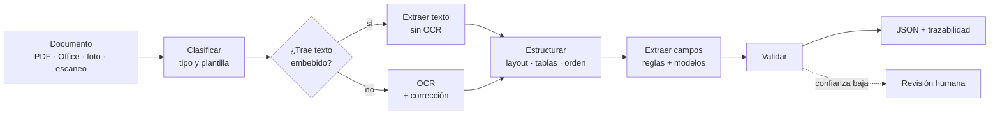
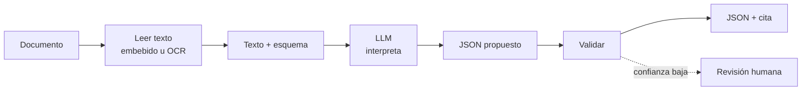
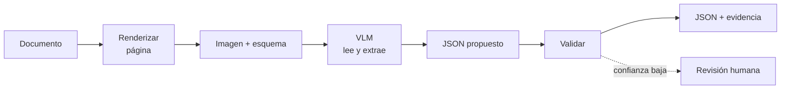

# Extracción de documentos

Pipeline para extraer datos estructurados de documentos heterogéneos: facturas, órdenes de compra, formularios, contratos, reportes.

## Flujo tradicional (determinista)

Construido a mano: OCR, layout, reglas y plantillas por proveedor.



### Etapas del flujo tradicional

| # | Etapa | Qué hace | Salida |
|---|-------|----------|--------|
| 1 | **Clasificar** | Identifica el tipo de documento y el ruteo | Tipo + confianza |
| 2 | **Leer** | Extrae el texto: capa embebida si existe, OCR si es escaneo | Texto + coordenadas |
| 3 | **Estructurar** | Reconstruye layout, tablas y orden de lectura | Documento estructurado |
| 4 | **Extraer** | Reglas con anclas semánticas, luego modelos para campos sin clave fija | Campos tentativos |
| 5 | **Validar** | Consistencia aritmética, formatos, catálogos externos | Campos verificados |
| 6 | **Trazabilidad** | Origen del dato: offset de texto o bounding box | JSON auditable |

Si el documento trae un código impreso (QR, barras, PDF417), se decodifica dentro de la etapa 2 como una fuente de texto más. No cambia el flujo.

## Flujo AI sobre texto (LLM)

Le pasás texto ya extraído y el modelo interpreta qué hay. No ve la imagen: decide qué fragmento es el total, la fecha o el emisor por significado, sin regex ni anclas.



### Etapas del flujo AI sobre texto

| # | Etapa | Qué hace | Salida |
|---|-------|----------|--------|
| 1 | **Leer** | Extrae el texto: capa embebida si existe, OCR si es escaneo | Texto paginado con índices |
| 2 | **Definir esquema** | Campos requeridos y nullable, con cita obligatoria por campo | Contrato de salida |
| 3 | **Interpretar** | El LLM asigna cada campo a su fragmento por significado | Valor + cita literal |
| 4 | **Verificar cita** | Busca el literal en el texto normalizado | Offset por campo |
| 5 | **Validar** | Reglas deterministas en código: aritmética, fechas, formatos | Campos verificados |
| 6 | **Trazabilidad** | Valor + offset + regla aplicada | JSON auditable |

## Flujo AI sobre imagen (VLM)

Le pasás la página como imagen y el modelo lee y extrae en el mismo paso. No hay OCR previo, ni motor de layout, ni plantillas.



### Etapas del flujo AI sobre imagen

| # | Etapa | Qué hace | Salida |
|---|-------|----------|--------|
| 1 | **Renderizar** | Página a imagen en resolución fija | Imagen normalizada |
| 2 | **Definir esquema** | Campos requeridos y evidencia obligatoria por campo | Contrato de salida |
| 3 | **Leer y extraer** | El VLM lee la página y llena el esquema en un solo paso | Valor + evidencia |
| 4 | **Validar** | Reglas deterministas en código: aritmética, fechas, formatos | Campos verificados |
| 5 | **Trazabilidad** | Bounding box por campo | JSON auditable |

## Puente: VLM como parser

Variante que combina los dos: el VLM solo convierte la página a Markdown o DocTags estructurado, y sobre ese texto corren las reglas deterministas. Pagás el costo de visión una vez, para leer, y después operás sobre texto con trazabilidad nativa.

## Comparación

| Dimensión | Tradicional | AI sobre texto | AI sobre imagen |
|---|---|---|---|
| Qué recibe el modelo | Nada | Texto plano | Píxeles de la página |
| Necesita OCR antes | Sí, si es escaneo | Sí, si es escaneo | No |
| Etapas que reemplaza | — | Extracción por reglas | Lectura + estructura + extracción |
| Plantillas por proveedor | Necesarias | Ninguna | Ninguna |
| Layout nuevo | Regla nueva o reentrenar | Generaliza | Generaliza |
| Ve firmas, sellos, casillas | Solo si lo modelaste | No | Sí |
| Costo por documento | Bajo (CPU) | Medio (tokens de texto) | Alto (tokens de imagen) |
| Determinismo | Reproducible | No determinista | No determinista |
| Trazabilidad | Nativa (offset / bbox) | Cita → offset del texto | bbox, poco confiable |
| Un error, ¿de qué es? | Lectura o regla, aislado | Lectura ya validada, solo lógica | Lectura y razonamiento mezclados |
| Alucinación en importes | No aplica | Riesgo | Riesgo |

Una nota sobre el costo: el **MoE** (Mixture of Experts) es lo que volvió viable al LLM sobre texto en volumen — al activar una fracción de los expertos por token, un modelo grande cuesta una fracción de uno denso. En el flujo de imagen el ahorro se pierde parcialmente, porque la cantidad de tokens visuales, no la arquitectura, es lo que domina la cuenta.

## Qué no cambió

La validación sigue siendo tuya en los tres flujos. El modelo reemplaza la lectura o la interpretación, nunca el control:

- La **validación aritmética** es lo que atrapa la alucinación en importes. Sin ella, un modelo que devuelve un total plausible pero falso pasa sin ser detectado. Aplica igual a los dos flujos AI.
- La **trazabilidad se degrada distinto** en cada uno: con texto ajeno se pide la cita literal y se mapea a un offset verificable; con imagen se pide el bounding box, que el modelo suele dar aproximado. La evidencia del flujo de imagen hay que tratarla como indicio, no como prueba.
- El **bucle humano sigue siendo necesario**. En un caso medido sobre 100.000 facturas/año, IA pura daba 85% de accuracy a 6 s por documento; IA + revisión del 15% de los casos daba 98,5% a 18 s.[^1]

Ninguno reemplaza a los otros. Lo habitual es encadenarlos: texto embebido → reglas para los campos estables de alto volumen → LLM sobre texto para lo que no matchea → VLM solo para las páginas que ninguno resolvió.

[^1]: [MADP: A Multi-Agent Pipeline for Sustainable Document Processing with Human-in-the-Loop](https://arxiv.org/html/2605.17159v1)

## Salida

```json
{
  "tipo": "factura",
  "campos": {
    "emisor": "…",
    "identificador": "0001-00001234",
    "fecha": "2026-09-16",
    "total": 15400.00,
    "moneda": "ARS"
  },
  "fuente": {
    "origen": "vlm",
    "campos": { "total": { "offset": [412, 424] } }
  },
  "confianza": 0.94
}
```

## Documentos

| Archivo | Enfoque |
|---------|---------|
| `a.md` | Solo texto — OCR lineal + anclas semánticas |
| `b.md` | Solo visual — segmentación + detección de objetos |
| `c.md` | Multimodal — fusión texto + posición + imagen |

Los tres describen capas del flujo tradicional: el AI sobre texto reemplaza la extracción por reglas, y el AI sobre imagen reemplaza además la lectura y la estructura.

## Pendientes

- [ ] Dataset dorado con métricas F1 por campo
- [ ] Confianza calibrada por campo
- [ ] Cierre del bucle HITL (correcciones → reglas)
- [ ] Idempotencia y versionado de plantillas
- [ ] Observabilidad y drift en producción
