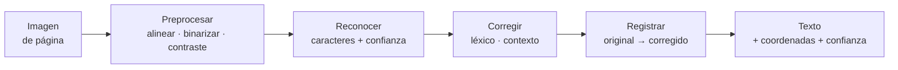
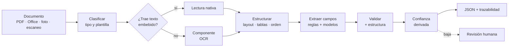
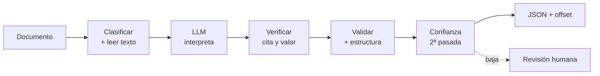
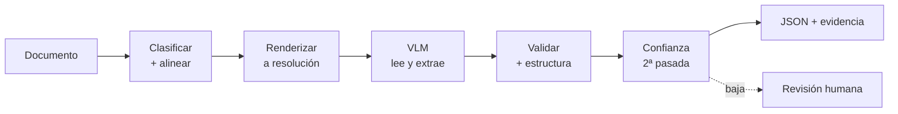
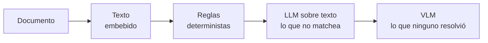

# Extracción de documentos

Pipeline para extraer datos estructurados de documentos heterogéneos: facturas, órdenes de compra, formularios, contratos, reportes.

## Subflujos y componentes

Los flujos principales comparten actividades que aparecen en más de uno. Se definen una vez acá y se referencian desde cada flujo, en lugar de repetirlas.

| Componente | Qué resuelve | Lo usan |
|---|---|---|
| **Lectura nativa** | Extrae texto y estructura de formatos que ya la declaran (PDF con capa, Office, HTML) | Tradicional, AI sobre texto |
| **OCR** | Lee páginas sin capa de texto y reconstruye texto legible | Tradicional, AI sobre texto |
| **Estructurar** | Layout, tablas y orden de lectura | Tradicional |
| **Esquema y validación** | Contrato de salida, chequeos deterministas | Los tres |

### Componente: OCR

Se usa cuando el documento no trae texto. A diferencia de la lectura nativa —donde los caracteres y las coordenadas son el registro fuente—, acá todo es estimado, así que el componente produce texto **y** su nivel de confianza.



| # | Etapa | Qué hace | Salida |
|---|-------|----------|--------|
| 1 | **Preprocesar** | Endereza, recorta y normaliza la imagen antes de leer | Imagen limpia |
| 2 | **Reconocer** | Motor OCR: caracteres con coordenadas y confianza por token | Texto crudo + confianza |
| 3 | **Corregir** | Repara errores de lectura, con los límites de abajo | Texto corregido |
| 4 | **Registrar** | Guarda cada par `original → corregido` con la razón | Traza de corrección |

#### Corrección: tres tipos, no dos

| Tipo | Cómo corrige | Ejemplo |
|---|---|---|
| **Palabra aislada** | Diccionario, tabla de confusiones del motor | `recibo` mal segmentado |
| **Dependiente del contexto** | Modelo de lenguaje sobre la frase o el párrafo | `c0nteo` → `conteo` |
| **Nivel campo** | Validación posterior a la extracción | suma que no cierra, dígito verificador |

El tipo del medio es el que necesita semántica, y ninguno de los otros dos lo resuelve: un diccionario no tiene `c0nteo` (con cero) porque no distingue un error de una palabra desconocida, y si el término está en texto libre no hay campo que validar.

**Se corrige lo que es prosa, no lo que es identificador.** El mismo mecanismo que arregla `c0nteo` puede arruinar un CUIT o un importe convirtiéndolo en un valor plausible pero falso. Medido en documentos de dominio técnico: un LLM sin restricciones sobre-corrige y empeora el texto por debajo del OCR original, por "alucinaciones de terminología" sobre códigos válidos.

Por eso la corrección por contexto solo actúa con tres restricciones:

1. **Léxico de dominio** — el texto corregido se compara contra términos conocidos, para no reemplazar términos válidos.
2. **Conjuntos de confusión** — si la corrección propuesta no coincide con la tendencia esperada, se revierte.
3. **Validación de formato por reglas** — patrones fijos (identificadores, importes, fechas) se verifican con regex, no con el modelo.

**Nunca corregir en silencio.** Cada corrección se registra como par con su razón. Sin eso se pierde la trazabilidad, y se pierde la mejor señal de calidad de lectura que hay: el conteo de correcciones por tipo sobre el corpus dice más que cualquier accuracy global. Los valores más sensibles son importes, unidades y cifras, donde un cambio silencioso afecta directo el dato final.

#### Interfaz

El componente devuelve una forma única, más allá de cómo se implemente:

```
leer(imagen) → (texto, coordenadas por token, confianza por token, traza de corrección)
```

La diferencia con la lectura nativa está en la fidelidad, no en la forma: allí la confianza es 1.0 y las coordenadas son exactas. Misma salida, distinta procedencia — y por eso el ruteo entre ambas queda **dentro** del componente de lectura, no repetido en cada flujo.

## Flujo tradicional (determinista)

Construido a mano: OCR, layout, reglas y plantillas por proveedor.



### Etapas del flujo tradicional

| # | Etapa | Qué hace | Salida |
|---|-------|----------|--------|
| 1 | **Clasificar** | Identifica el tipo de documento y el ruteo | Tipo + confianza |
| 2 | **Leer** | Rutea a lectura nativa u OCR según haya capa de texto | Texto + coordenadas + confianza |
| 3 | **Estructurar** | Reconstruye layout, tablas y orden de lectura | Documento estructurado |
| 4 | **Extraer** | Reglas con anclas semánticas, luego modelos para campos sin clave fija | Campos tentativos |
| 5 | **Validar** | Aritmética, **estructura de la tabla**, fechas, formatos, catálogos | Campos verificados |
| 6 | **Confianza** | Derivada de la evidencia: tipo de match, validaciones, ambigüedad | Score por campo |
| 7 | **Trazabilidad** | Origen del dato: offset de texto o bounding box | JSON auditable |

Un dato puede estar mal **y** pasar la validación aritmética: si una columna de la tabla se desplaza una posición, los importes existen, las citas son reales y la suma puede cerrar igual. Por eso la etapa 5 valida también la **estructura** (asociación encabezado–dato, alineación de columnas, integridad de filas), no solo los valores.

Si el documento trae un código impreso (QR, barras, PDF417), se decodifica dentro de la etapa 2 como una fuente de texto más. No cambia el flujo.

## Flujo AI sobre texto (LLM)

Le pasás texto ya extraído y el modelo interpreta qué hay. No ve la imagen: decide qué fragmento es el total, la fecha o el emisor por significado, sin regex ni anclas. Solo sirve si el dato está en el texto: si la respuesta depende de qué había arriba, al lado o dentro de otra cosa, no es un problema de texto.



### Etapas del flujo AI sobre texto

| # | Etapa | Qué hace | Salida |
|---|-------|----------|--------|
| 1 | **Clasificar y leer** | Tipo y ruteo; lectura nativa u **componente OCR**, paginado con índices | Tipo + texto indexado |
| 2 | **Definir esquema** | Campos `required` y `nullable`, con cita obligatoria por campo | Contrato de salida |
| 3 | **Interpretar** | El LLM asigna cada campo a su fragmento por significado | Valor + cita literal |
| 4 | **Verificar** | Busca el literal **y** comprueba que el valor sea el de la cita | Offset, o campo sospechoso |
| 5 | **Validar** | Aritmética, estructura de tabla, fechas, formatos | Campos verificados |
| 6 | **Confianza** | Segunda pasada con distinto orden del texto: la discrepancia es la señal | Score por campo |
| 7 | **Trazabilidad** | Valor + offset + regla aplicada | JSON auditable |

**La cita no alcanza.** Una cita literal y verificable es *grounding*, no correctitud: es ortogonal al valor. Un modelo puede citar texto real y asignarle el importe equivocado. Por eso la etapa 4 verifica dos cosas — que el literal exista en el texto **y** que el valor extraído sea el que ese literal contiene. Sin lo segundo, medís grounding y creés que medís acierto.

**El esquema no garantiza completitud.** El mismo documento, mismo prompt y temperatura 0 puede devolver 15 campos en una corrida y 12 en la siguiente, sin ninguna señal. No es alucinación: el dato estaba y no se devolvió. Por eso la etapa 6 repite la pasada: un campo que aparece en una y no en la otra es el caso a revisar.

**Tope de salida obligatorio.** Existen entradas que disparan repetición indefinida hasta el límite de tokens. La etapa 2 debe fijar `max_output_tokens`, timeout y detección de repetición: sin eso, un solo documento puede generar facturación sin techo.

## Flujo AI sobre imagen (VLM)

Le pasás la página como imagen y el modelo lee y extrae en el mismo paso. No hay OCR previo, ni motor de layout, ni plantillas. Es el único que ve lo no textual (firma, sello, casilla marcada) y el único que funciona con manuscritos y plantillas nunca vistas.



### Etapas del flujo AI sobre imagen

| # | Etapa | Qué hace | Salida |
|---|-------|----------|--------|
| 1 | **Clasificar y alinear** | Tipo de documento y rotación automática a horizontal | Tipo + imagen alineada |
| 2 | **Renderizar** | Resolución elegida por el dato más chico a leer; recorte y centrado si está en el margen | Imagen normalizada |
| 3 | **Definir esquema** | Campos `required` con evidencia obligatoria por campo | Contrato de salida |
| 4 | **Leer y extraer** | El VLM lee la página y llena el esquema en un paso | Valor + evidencia |
| 5 | **Validar** | Aritmética, estructura de tabla, fechas, formatos | Campos verificados |
| 6 | **Confianza** | Segunda pasada o recorte de la zona en conflicto | Score por campo |
| 7 | **Trazabilidad** | bbox aproximado, cruzado con la capa de texto si existe | JSON auditable |

**La resolución no es una constante, es la palanca de costo.** Los tokens visuales por página dominan la factura, y su cantidad se elige: menos tokens abarata y degrada la lectura de detalle, más tokens la mejora y encarece. Fijar "resolución fija" sin más esconde la única decisión económica del flujo. Elegila por el tamaño del dato más chico que necesitás leer, y validá con un set dorado que la elección no rompe campos.

**El sesgo de atención también aplica a imagen.** Los VLM atienden mejor las zonas centrales, salientes y de alto contraste que el detalle tenue de una esquina. Si el dato crítico es una marca chica en el margen, hay que recortarla y centrarla. Subir resolución por mosaicos tiene su propio punto ciego: un objeto que cruza dos mosaicos se cuenta doble o se pierde.

**El grounding empeora bajo degradación.** Lo específico de este flujo es justamente el caso difícil: fotos torcidas, sombras, baja resolución. Los VLM alucinan más en documentos degradados que en escaneos limpios, porque el entrenamiento supone entradas no degradadas. Si el corpus es de fotos de celular, ese es el benchmark que importa, no DocVQA.

## Puente: VLM como parser

Variante que combina los dos: el VLM convierte la página a **DocTags** — estructura con procedencia, no Markdown — y sobre ese texto corren las reglas deterministas. Se paga el costo de visión una vez, para leer.

La salida tiene que preservar la procedencia. **Markdown no sirve para esto**: descarta bounding boxes, orden de lectura, scores de confianza y estructura de tablas. Exportar a Markdown rompe la trazabilidad que este puente promete conservar. DocTags mantiene jerarquía, tablas y coordenadas; el Markdown queda solo para consumo humano o RAG, donde la procedencia no se audita.

## Comparación

| Dimensión | Tradicional | AI sobre texto | AI sobre imagen |
|---|---|---|---|
| Qué recibe el modelo | Nada | Texto plano | Píxeles de la página |
| Usa el componente OCR | Sí, si no hay capa de texto | Sí, si no hay capa de texto | No |
| Etapas que reemplaza | — | Extracción por reglas | Lectura + estructura + extracción |
| Clasificación previa | Necesaria | Necesaria (+6,8 pp de F1 con ejemplos de contexto) | Necesaria (el error de tipo contamina el prompt) |
| Plantillas por proveedor | Necesarias | Ninguna | Ninguna |
| Layout nuevo | Regla nueva o reentrenar | Generaliza | Generaliza |
| Ve firmas, sellos, casillas | Solo si lo modelaste | No | Sí |
| Costo por documento | Bajo (CPU) | Medio (tokens de texto) | Variable: hasta 6× más caro que OCR, pero puede ser 20× más barato si hay compresión óptica |
| Determinismo | Reproducible | No determinista | No determinista |
| Trazabilidad | Nativa: las coordenadas del PDF son el registro fuente | Cita → offset verificable | bbox reconstruido: descarta el exacto que ya existía en la capa de texto |
| No alucina | Sí, por construcción | No | No |
| Un error, ¿de qué es? | Lectura o regla, aislado | Lectura ya validada, solo lógica | Lectura y razonamiento mezclados |

Sobre el costo: la intuición "imagen siempre más caro" es falsa. La representación óptica puede comprimir texto a menos tokens que el texto crudo (medido: 23,6× menos para 5 páginas, con ~97% de precisión a 10× de compresión). Y el **MoE** abarata el cómputo por token en cualquier modalidad, no solo en texto. Lo que decide la cuenta es la **tokenización y la resolución elegida**, no la arquitectura.

Sobre alucinación: los modelos especializados (`LayoutLM` y similares) clasifican los tokens que ya existen, así que no pueden inventar un valor — cuestan 30 a 100× menos por página, pero exigen anotar y entrenar. Un VLM evita ese trabajo y a cambio introduce un modo de falla que no existe en el flujo determinista.

## Qué no cambió

La validación y la trazabilidad siguen siendo tuyas en los tres flujos. El modelo reemplaza la lectura o la interpretación, nunca el control:

- **La cita prueba procedencia, no acierto.** Es ortogonal al valor: una cita verificable puede acompañar un importe equivocado. Verificá el literal y el valor por separado.
- **La aritmética atrapa una parte.** Ayuda que la mayoría de los errores de extracción en documentos financieros sean valores numéricos inventados, pero un total plausible que no rompe ninguna suma pasa el filtro. Sin cruce contra un padrón o un servicio externo, esos casos no se ven.
- **La estructura se valida aparte.** Una columna desplazada una posición pasa los chequeos de similitud y rompe el sistema aguas abajo, sin que ningún importe sea falso.
- **El bucle humano sigue siendo necesario.** En un caso medido sobre 100.000 facturas/año, IA pura daba 85% de accuracy a 6 s por documento; IA + revisión del 15% de los casos daba 98,5% a 18 s.[^1]

## Orden de ejecución

El híbrido no es una excepción: es la arquitectura de producción. Cada etapa hace lo más barato que puede resolver su caso, y solo pasa al siguiente lo que no resolvió.



La razón de este orden es el costo: interpretar cada píxel de cada página es lo más caro del sistema. Usar un modelo frontera para leer documentos que una regla resuelve es lo que erosiona el margen a volumen, no el precio del modelo.

[^1]: [MADP: A Multi-Agent Pipeline for Sustainable Document Processing with Human-in-the-Loop](https://arxiv.org/html/2605.17159v1)

## Salida

```json
{
  "tipo": "factura",
  "campos": {
    "emisor": "…",
    "identificador": "0001-00001234",
    "fecha": "2026-09-16",
    "total": 15400.00,
    "moneda": "ARS"
  },
  "fuente": {
    "origen": "texto_embebido",
    "campos": {
      "total": {
        "offset": [412, 424],
        "cita": "TOTAL A PAGAR $ 15.400,00",
        "cita_verificada": true,
        "valor_coincide_con_cita": true
      }
    }
  },
  "confianza": 0.94
}
```

`cita_verificada` y `valor_coincide_con_cita` son los dos chequeos de la etapa 4: el literal existe en el texto, y el valor es el que ese literal contiene.

## Documentos

| Archivo | Enfoque |
|---------|---------|
| `a.md` | Solo texto — OCR lineal + anclas semánticas |
| `b.md` | Solo visual — segmentación + detección de objetos |
| `c.md` | Multimodal — fusión texto + posición + imagen |
| `d.md` | Nota técnica — validación con Pydantic (auditar vs. normalizar) |

Los tres describen capas del flujo tradicional: el AI sobre texto reemplaza la extracción por reglas, y el AI sobre imagen reemplaza además la lectura y la estructura.

## Pendientes

- [ ] Dataset dorado con métricas F1 por campo, por región y por tipo de error
- [ ] Elección de resolución validada contra el set dorado (flujo de imagen)
- [ ] Few-shot y multi-pass: 4–8 puntos de F1 cada uno
- [ ] Cierre del bucle HITL (correcciones → reglas)
- [ ] Topes de salida, timeout y detección de repetición
- [ ] Idempotencia y versionado de plantillas
- [ ] Observabilidad y drift en producción
- [ ] Banco de pruebas con documentos degradados, no solo escaneos limpios
