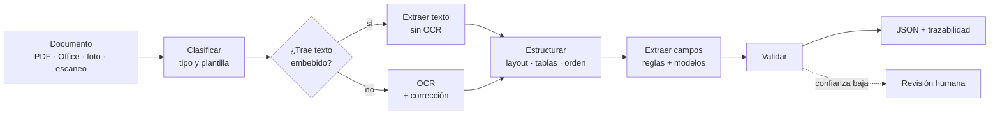

# Extracción de documentos

Pipeline para extraer datos estructurados de documentos heterogéneos: facturas, órdenes de compra, formularios, contratos, reportes.

## Flujo primario



## Etapas

| # | Etapa | Qué hace | Salida |
|---|-------|----------|--------|
| 1 | **Clasificar** | Identifica el tipo de documento y el ruteo | Tipo + confianza |
| 2 | **Leer** | Extrae el texto: capa embebida si existe, OCR si es escaneo | Texto + coordenadas |
| 3 | **Estructurar** | Reconstruye layout, tablas y orden de lectura | Documento estructurado |
| 4 | **Extraer** | Reglas con anclas semánticas, luego modelos para campos sin clave fija | Campos tentativos |
| 5 | **Validar** | Consistencia aritmética, formatos, catálogos externos | Campos verificados |
| 6 | **Trazabilidad** | Origen del dato: offset de texto o bounding box | JSON auditable |

Si el documento trae un código impreso (QR, barras, PDF417), se decodifica dentro de la etapa 2 como una fuente de texto más. No cambia el flujo.

## Salida

```json
{
  "tipo": "factura",
  "campos": {
    "emisor": "…",
    "identificador": "0001-00001234",
    "fecha": "2026-09-16",
    "total": 15400.00,
    "moneda": "ARS"
  },
  "fuente": {
    "origen": "texto_embebido",
    "campos": { "total": { "offset": [412, 424] } }
  },
  "confianza": 0.94
}
```

## Documentos

| Archivo | Enfoque |
|---------|---------|
| `a.md` | Solo texto — OCR lineal + anclas semánticas |
| `b.md` | Solo visual — segmentación + detección de objetos |
| `c.md` | Multimodal — fusión texto + posición + imagen |

Los tres describen capas del mismo sistema, no alternativas excluyentes.

## Pendientes

- [ ] Dataset dorado con métricas F1 por campo
- [ ] Confianza calibrada por campo
- [ ] Cierre del bucle HITL (correcciones → reglas)
- [ ] Idempotencia y versionado de plantillas
- [ ] Observabilidad y drift en producción
