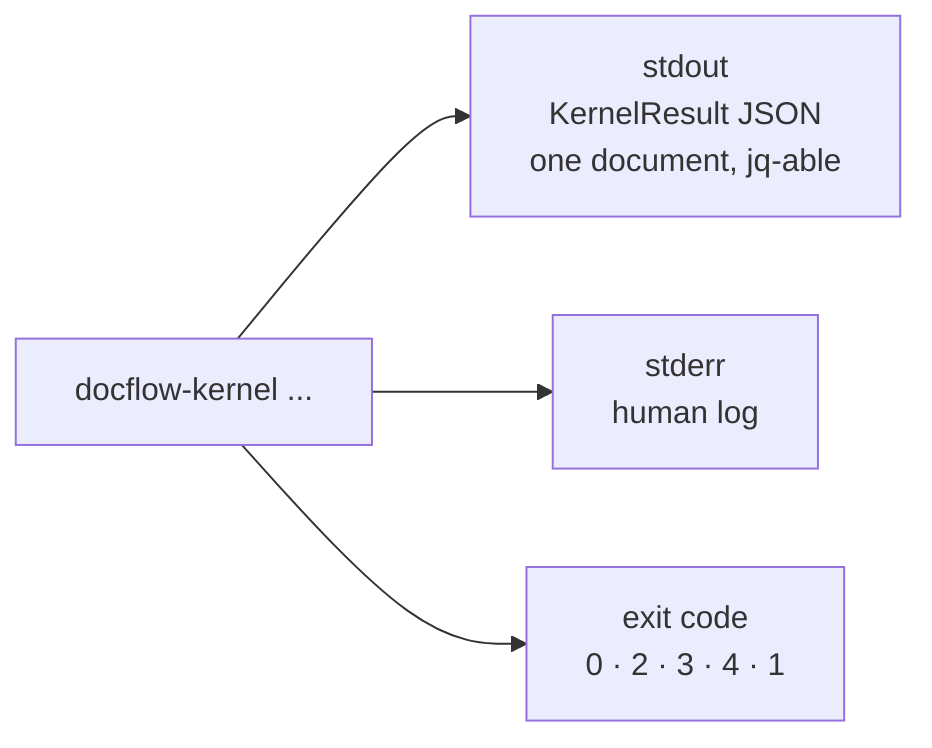

# Kernel CLI — `docflow-kernel`

A lab surface that exposes the 8 kernels (K1–K8) of `02-arch-components.md` as a command line, one command per kernel operation.

| Field | Value |
|---|---|
| Lifecycle stage | **PoC** — close the end-to-end flow, happy path first |
| Status | **Design proposal**, not implemented |
| Surface | `docflow-kernel` — a **development/verification** surface, distinct from the product surface `docflow` |
| Companion docs | `sad.md` (§3 kernels, §4 determinism), `prd.md`, `wbs.md` (Stage 1), `../idea/02-arch-components.md` |

---

## 1. Purpose

`02-arch-components.md` closes with a table of **17 silent failures, one per kernel**, and states that *"this table is the layer's real specification."* Today each of those 17 rows can only be exercised by writing Python.

This document turns each row into an invocable, assertable command.

The motivation is stated by the user and is load-bearing: *the kernels are a cornerstone of the project, so they must be tested independently before the domain layer is built on top of them.* A kernel that fails silently under a component is discovered late and attributed to the wrong layer.

**What this buys:**

- Each of the 17 silent failures becomes a shell assertion instead of a code review.
- `S1-T19` (the Stage 1 closing flow) becomes runnable and inspectable from outside the process.
- The determinism class of each kernel becomes observable rather than documented.
- A kernel can be validated before its first consumer exists.

---

## 2. Non-goals

| Not this | Why |
|---|---|
| A second product surface | `docflow` is the product. `docflow-kernel` is a bench. |
| A way to run pipelines | Pipelines are domain compositions. `docflow run --pipeline <CODE>` owns that. |
| A stable public API | This surface may change freely as kernels evolve. Nothing downstream may depend on it. |
| A replacement for unit tests | It is the complement: a test asserts a function; the CLI asserts the wired boundary. |
| Shipped in the release package | Declared dev-only. `# TODO: [MVP]` move to a `[dev]` extra. |

**`02-arch-components.md` states that "kernels are not used directly by the CLI; the domain components are compositions of them."** That statement governs the **product** surface and is not contradicted here: `docflow run` never invokes `docflow-kernel`. The two are separate entry points with separate audiences.

---

## 3. The three guardrails

These are what keep a lab surface from becoming a second product that drifts.

### Guardrail 1 — One command = one port method. Zero logic in the CLI.

Every subcommand dispatches to exactly one operation on a port or kernel. If a flag is not a parameter of that operation, it does not exist.

The test that enforces it: introspect the port signature and compare its parameter set against the command's declared flag set. A flag with no counterpart fails the test. *(`# TODO: [MVP]` — implement as a contract test.)*

### Guardrail 2 — Never emit a verdict, a confidence score, or a routing decision.

Those belong to the domain layer and the registry (`02-arch-components.md`, "What the kernels never do"). The CLI prints the raw `KernelResult` — tokens, measurements, `Evidence`, `Reason`. It never says `"usable"`, `"illegible"`, `"route to OCR"`, or `"confidence: 0.87"`.

### Guardrail 3 — No silent fallback.

An unavailable model, engine or asset fails the stage with a typed error naming the remedy. It never substitutes a default. This is the failure the layer's own invariant calls the worst it can have: *"A silent fallback to a default model is the worst failure this layer can have."*

---

## 4. Entry point and discovery

**One binary, namespaced by kernel.** Eight separate executables would multiply the install surface and make discovery worse, not better; dotted command names (`docflow-kernel.ocr`) are fragile across shells, `--help` handling and process tooling.

```toml
# pyproject.toml
[project.scripts]
docflow        = "docflow.cli:main"          # product surface
docflow-kernel = "docflow.kernel_cli:main"   # lab surface (dev-only, # TODO: [MVP] -> [dev] extra)
```

```bash
docflow-kernel <kernel> <operation> [arguments] [flags]
```

The kernel names are exactly the lower half of the `K<code>` identifiers in `02-arch-components.md`:

| Kernel | Name | Adapter |
|---|---|---|
| K1 | `orchestrator` | — (drives) |
| K2 | `pdf` | `pdftotext` (poppler) |
| K3 | `image` | raster library |
| K4 | `ocr` | Docling |
| K5 | `llm.local` | Ollama |
| K6 | `llm.frontier` | provider SDK |
| K7 | `store` | filesystem |
| K8 | `registry` | filesystem |

### `--list` — the inventory

```bash
$ docflow-kernel --list
kernel          determinism    adapter              available
orchestrator    deterministic  —                    yes
pdf             deterministic  pdftotext 24.02.0    yes
image           deterministic  <raster lib> 11.1.0  yes
ocr             sampled        docling 2.14.0       yes
llm.local       sampled        ollama 0.5.7         yes
llm.frontier    external       anthropic            yes
store           deterministic  filesystem           yes
registry        deterministic  filesystem           yes
```

`available` is `no` when the adapter's precondition is unmet — a missing binary, an unpulled model, a missing provider key. An unavailable adapter is reported here and **never** silently replaced.

---

## 5. Exit code contract

The kernel contract has no third state: *"A kernel either returns a value with evidence, or returns no value and a reason."* The exit code is the process-level encoding of exactly that, and it is the single most important thing that makes this surface testable.

| Exit | Meaning | stdout |
|---:|---|---|
| `0` | A value was produced | `value` + `evidence`, `reason: null` |
| `2` | **No value, with a typed `Reason`** — a legitimate, expected outcome | `value: null`, `reason` populated |
| `3` | Precondition unmet — missing binary, model not pulled, asset invalid, no provider key | typed error naming the remedy |
| `4` | Usage error — unknown kernel/operation, bad flag, malformed range | usage message on stderr |
| `1` | Unexpected internal error | traceback on stderr |

**Why `2` is distinct from `3`, and why both are distinct from `1`.** Without the distinction, *"this image is illegible"* (an expected outcome with a `Reason`), *"the document is missing"* and *"the code has a bug"* are indistinguishable to a script. That is the same class of collapse the architecture refuses everywhere else — a diagnosis is not a crash, and an outage is not a rejection.

```bash
# assert an expected negative outcome without parsing prose
docflow-kernel image legibility borroso.png > /dev/null; [ $? -eq 2 ]
```

**Stable reason codes.** The `reason.code` values are a closed set, so assertions target a code, never a message string. Initial set: `illegible`, `insufficient_effective_resolution`, `blank_page`, `truncated_output`, `model_not_pulled`, `engine_unavailable`, `provider_unavailable`, `artifact_missing`, `evidence_missing`, `asset_invalid`, `encrypted`, `unsupported_format`.

---

## 6. Output contract



**stdout is a single JSON document**, in the existing `KernelResult[T]` shape — no new type is introduced:

```json
{
  "value": { },
  "evidence": { },
  "reason": null,
  "call_record": null
}
```

`call_record` is populated for K5 and K6 only (provider, model revision, tokens, cost, latency, request id).

**stderr carries the human log** and nothing a script should parse. That split is what allows `docflow-kernel ... | jq` to be safe.

### Bytes are out of band by default

A 40 MB rendered page inlined as base64 is not testable and not diffable. So stdout carries **descriptors**, and the bytes are opt-in:

| Default — a descriptor | With `--save <dir>` |
|---|---|
| `{ "sha256": "9f2a…", "bytes": 41889024, "media_type": "image/png", "page": 1, "dpi": 300 }` | The same descriptor **plus** the bytes written to `<dir>/<sha256>.png` |

`--save` routes through K7, so the recorded hash is the real content hash of what was written, not a hash of something that was only in memory. That is what makes a downstream `store verify` meaningful.

---

## 7. Determinism classes and `--repeat`

Every kernel declares a determinism class, and the class **decides what a test may assert**. The CLI exposes it because the assertion differs.

| Class | Kernels | What a test may assert |
|---|---|---|
| **deterministic** | K1, K2, K3, K7, K8 | The artifact **hash**. Two runs must produce byte-identical output |
| **sampled** | K4, K5 | **Not** the value. Assert on `evidence`: model digest, `num_ctx`, sampling params, adapter revision |
| **external** | K6 | **Not** the value. Assert on `call_record` and on the typed failure paths (`429`, timeout, circuit breaker) |

K4's class in `02-arch-components.md` is written as "model-dependent"; for resume purposes `sad.md` maps it to `sampled`, and this surface reports it that way. See `02-arch-components.md`'s open question on whether a pinned Docling is in fact deterministic.

### `--repeat N`

```bash
docflow-kernel pdf render scan.pdf --page 1 --dpi 300 --repeat 3
```

Runs the operation N times and reports each repetition's artifact hash:

```json
{
  "repetitions": [
    { "n": 1, "artifact_sha256": "9f2a…", "ms": 412 },
    { "n": 2, "artifact_sha256": "9f2a…", "ms": 388 },
    { "n": 3, "artifact_sha256": "9f2a…", "ms": 401 }
  ],
  "identical": true
}
```

The default is `--repeat 1`. It exists for two reasons, and both matter:

1. **For a deterministic kernel it is a proof**: identical hashes are the evidence for the `deterministic` claim.
2. **For a sampled kernel it is a demonstration of non-reproducibility** — which is the honest answer, and the reason the invariant exists: *"A sampled artifact is evidence, not a cache. It may be kept; it may never be regenerated to verify it."* Running K5 three times and seeing three different hashes is the evidence that regeneration-to-verify would be a silent error.

**`--repeat` must never be used to retry until two answers agree.** That is the forbidden practice the orchestrator records an attempt count for; here it would be trivially easy to do by hand, so it is called out explicitly.

---

## 8. Resolution, fail-fast, and `--resolve-only`

Resolution is by capability, not by name (`02-arch-components.md`). The CLI exposes the resolution step on its own, because *"a silent fallback to a default model is the worst failure this layer can have"* and this is how you prove there isn't one.

```bash
$ docflow-kernel llm.local structured \
    --model ollama:qwen2.5 --prompt-file p.txt --schema-file s.json \
    --resolve-only
```
```json
{
  "provider": "ollama",
  "model": "qwen2.5",
  "model_revision": "sha256:7cdf5a1b…",
  "adapter_revision": "ollama 0.5.7",
  "params": { "num_ctx": 8192, "temperature": 0.0 },
  "cache_key_terms": { "model_revision": "sha256:7cdf5a1b…", "registry_hash": "c41b…" }
}
```

`--resolve-only` executes nothing. It answers: *which adapter, which revision, which parameters, and therefore which cache key.* Because it is non-executing, it is free to run in a test suite, and it makes the cache key inspectable before any expensive call.

```bash
# an unknown name must fail fast, naming the model
$ docflow-kernel llm.local structured --model ollama:nope --resolve-only
# exit 3, stderr: unknown model "ollama:nope". available: qwen2.5, llava
```

There is no `--fallback`, no `--default-model`, and no environment variable that substitutes a model.

---

## 9. Per-kernel surfaces

Each table maps a command to exactly one operation from `02-arch-components.md`. All flags are operation parameters. **No domain noun appears in any flag.**

### K1 — `orchestrator`

| Command | Port operation | Key flags |
|---|---|---|
| `orchestrator plan <descriptor>` | `submit(spec)` — validate only | `--out` |
| `orchestrator run <descriptor> --out <dir>` | `submit(spec)` | `--jobs`, `--slots cpu=n,gpu=n,remote=n` |
| `orchestrator status <job-id>` | `status(job_id)` | — |
| `orchestrator jobs` | — (run discovery) | — |
| `orchestrator pause <job-id>` / `resume <job-id>` | `pause` / `resume` | — |
| `orchestrator stop <job-id>` | `stop(job_id, force)` | `--force` |
| `orchestrator ledger-read <unit-dir>` | `verify(unit)` | — |
| `orchestrator manifest-rebuild <out-dir>` | `rebuild_index()` | — |

**Two details that are deliberate.**

**There is no `verify` subcommand and no `--verify` flag.** Verification is an *outcome* of reading a ledger, never a request: *"Checking that a `done` stage's artifact is actually on disk … happens whenever the ledger is read — not when someone remembers to ask."* `ledger-read` therefore always reports the verification outcome alongside the ledger, and there is no code path that returns a ledger without checking it. Making it a flag here would reintroduce exactly the gap `03-cli.md` argues against.

**`store verify <sha256>` is different and legitimate.** That is K7's port operation `verify(artifact) -> bool`, one command to one method. It checks a single artifact's bytes against its hash; it says nothing about ledger trust. Keeping both, and naming them differently, is what prevents the two concepts from being conflated.

**`orchestrator run` takes a descriptor, not a `--pipeline` code.** A pipeline code is a domain noun; a descriptor is a stage graph, which is precisely what K1 executes and does not interpret (*"K1, which executes graphs it did not write"*). The descriptor's stages reference kernel operations:

```yaml
# descriptors/synthetic-3stage.yaml — Stage 1's closing fixture, no domain nouns
unit: synthetic
stages:
  - name: acquire
    kernel: store
    op: put
    params: { source: generated }
  - name: transform
    kernel: pdf
    op: probe
    needs: [acquire]
  - name: persist
    kernel: store
    op: put
    needs: [transform]
```

This is what makes `S1-T19` invocable from a shell before any domain component exists.

### K2 — `pdf`

| Command | Port operation | Key flags |
|---|---|---|
| `pdf probe <file>` | `probe(path)` | — |
| `pdf facts <file>` | `page_facts(page)` | `--page N` |
| `pdf classify <file>` | `classify(page)` | `--page N` |
| `pdf tokens <file>` | `extract_tokens(pages)` | `--pages 1-3`, `--dpi` |
| `pdf render <file>` | `render(pages, dpi)` | `--pages`, `--dpi`, `--save` |
| `pdf images <file>` | `embedded_images(page)` | `--page N`, `--save` |
| `pdf split <file>` | `split(ranges)` | `--pages 1-7`, `--save` |

`pages` accepts `1-3`, `1,4,7`, `all`. `render` **never upscales** — requesting 300 DPI on a 150 DPI scan returns exit `2` with `reason.code: insufficient_effective_resolution`, never a larger file reported as a satisfied gate.

### K3 — `image`

| Command | Port operation | Key flags |
|---|---|---|
| `image info <file>` | `load(source)` | — |
| `image legibility <file>` | `legibility(bitmap)` | — |
| `image rescale <file>` | `rescale(bitmap, target)` | `--target-dpi`, `--save` |
| `image deskew <file>` | `deskew(bitmap)` | `--save` |
| `image crop <file>` | `crop(bitmap, region)` | `--region x,y,w,h`, `--save` |
| `image phash <file>` | `phash(bitmap)` | — |
| `image tile <file>` | `tile(bitmap, max_pixels)` | `--max-pixels`, `--save` |

`info` reports the EXIF orientation and whether it was applied. `legibility` returns a **measurement plus a reason**, never a bare boolean: `{ "laplacian_variance": 41.2, "contrast": 0.18, "skew_estimate": 1.4 }`. `crop` returns the crop **together with its inverse map**, so the source-coordinate contract is checkable by hand.

### K4 — `ocr`

| Command | Port operation | Key flags |
|---|---|---|
| `ocr capabilities` | `capabilities()` | — |
| `ocr engine-info` | `engine_info()` | — |
| `ocr read <file…>` | `read(pages, options)` | `--pages`, `--dpi`, `--lang`, `--correct` |

Returns positioned tokens with **no reading order resolved**, plus per-page status (`read` with zero tokens vs `blank` vs `unreadable`). Docling's layout and table output is **dropped at the boundary** — the tokens are the contract. Confidence is `float | null`, and `null` is never reported as `1.0`.

There is **no `--engine` flag**. The engine is Docling and only Docling; a per-corpus choice would make the OCR path a matrix of behaviours.

`--correct` is lab-only and corresponds to the `DOCFLOW_CORRECT` environment setting on the product surface. It gates the *corrected* artifact only; the raw tokens are always retained.

### K5 — `llm.local`

| Command | Port operation | Key flags |
|---|---|---|
| `llm.local capabilities` | `capabilities(model)` | `--model` |
| `llm.local ps` / `warm` / `pull` | `ps()` / `warm(model)` / `pull(model)` | `--model` |
| `llm.local generate` | `generate(model, prompt, **params)` | `--model`, `--prompt-file` |
| `llm.local structured` | `structured(model, prompt, schema)` | `--model`, `--prompt-file`, `--schema-file` |
| `llm.local vision` | `vision(model, prompt, images, schema)` | `--model`, `--prompt-file`, `--image`, `--schema-file` |

Reports the **model digest**, never the tag alone — `qwen2.5` is a moving tag and the digest is the identity. Truncation maps to exit `2`, `reason.code: truncated_output`, and is **never** parsed as if complete.

### K6 — `llm.frontier`

| Command | Port operation | Key flags |
|---|---|---|
| `llm.frontier capabilities` | `capabilities(model)` | `--model` |
| `llm.frontier count-tokens` | `count_tokens(text)` | `--model`, `--text-file` |
| `llm.frontier structured` | `structured(model, prompt, schema)` | `--model`, `--prompt-file`, `--schema-file` |
| `llm.frontier vision` | `vision(model, prompt, images, schema)` | `--model`, `--prompt-file`, `--image`, `--schema-file` |
| `llm.frontier judge` | `judge(model, rubric, samples)` | `--model`, `--rubric-file`, `--samples-file` |

**The raw completion and the parsed structure are returned separately**, and the raw one is what `--save` persists first — *"the raw completion is persisted before anything coerces it."* `call_record` is always populated.

Secrets come from the environment only. There is no `--api-key` flag.

### K7 — `store`

| Command | Port operation | Key flags |
|---|---|---|
| `store put <file>` | `put(bytes, media_type)` | `--media-type`, `--root` |
| `store get <sha256>` | `get(artifact)` | `--save`, `--root` |
| `store verify <sha256>` | `verify(artifact)` | `--root` |
| `store ls` | — (index) | `--prefix`, `--root` |
| `store ledger-read <unit-dir>` | `read_ledger(unit)` | `--root` |
| `store ledger-begin` / `ledger-commit` / `ledger-fail` | `begin` / `commit` / `fail` | `--stage`, `--unit` |
| `store manifest-rebuild <out-dir>` | `rebuild_manifest()` | — |

`get` on a miss raises — it **never returns empty**. `verify` returns a bool as a *value*, so a failed verification is exit `0` with `value: false`, not exit `2`: the question was answered.

### K8 — `registry`

| Command | Port operation | Key flags |
|---|---|---|
| `registry validate` | load + schema-validate | `--root` |
| `registry hash` | — | `--root` |
| `registry show` | — | `--asset`, `--key`, `--root` |
| `registry ls` | — | `--asset`, `--root` |

A malformed asset stops the run. A missing asset is never defaulted: *"a missing asset silently substituted with an empty one produces a run that completes and extracts nothing, which is indistinguishable from a corpus with no extractable fields."*

`registry hash` is the operation to reach for when asking *why a `--force --stage` is needed*: the hash is a cache-key term, so printing it makes a prompt change visible as the thing that invalidates `extract.p`.

---

## 10. Global flags

| Flag | Applies to | Purpose |
|---|---|---|
| `--root <dir>` | K7, K8 | The store or registry root |
| `--save <dir>` | any command returning bytes | Persist bytes through K7 |
| `--repeat N` | any | Re-run and report per-repetition hashes |
| `--resolve-only` | K2–K6 | Resolve the adapter and cache-key terms without executing |
| `--timeout <s>` | K4, K5, K6 | Bound a single call |
| `--format json` | all | Default and only machine format |
| `--verbose` | all | More on stderr; never changes stdout |

**Allowed flag vocabulary** — asset and call parameters: `--model`, `--schema-file`, `--prompt-file`, `--rubric-file`, `--dpi`, `--page`, `--pages`, `--region`, `--lang`, `--media-type`, `--root`, `--save`, `--correct`, `--jobs`, `--slots`, `--force`, `--repeat`, `--resolve-only`, `--timeout`.

**Forbidden flag vocabulary** — anything naming a document concept: `--field`, `--invoice`, `--cuit`, `--total`, `--document-type`, `--pipeline`, `--validator`, `--extractor`, `--golden`. The presence of any of these is the signal that the surface has drifted into the domain layer.

---

## 11. The silent-failure matrix

The 17 rows of `02-arch-components.md`'s closing table, each with the command that exercises it and the assertion that proves it.

| # | Kernel | Silent failure | Command | Assertion |
|---:|---|---|---|---|
| 1 | K1 | A killed stage reported as never started, then resumed | `orchestrator run <d> --out O` then kill mid-stage, then `orchestrator ledger-read O` | Ledger reads `running` for the killed stage |
| 2 | K1 | A stage marked `done` whose artifact is partial | `orchestrator run` with a crash injected between write and rename | `done` is absent; `running` is present |
| 3 | K2 | A stale invisible OCR layer read as a text PDF | `pdf classify scan-hidden-layer.pdf --page 1` | `value` is `image`, with `invisible_text: true` and contradicting producer metadata in `evidence` |
| 4 | K2 | A 150 DPI scan rendered at 300 and reported as 300 | `pdf render scan150.pdf --page 1 --dpi 300` | Exit `2`, `reason.code: insufficient_effective_resolution`; no larger file produced |
| 5 | K2 | A split that separates a document from its pages | `pdf split doc.pdf --pages 1-7 --save O` then `pdf probe O/*.pdf` | Page count and page boxes match the source range; the mapping is in the descriptor |
| 6 | K3 | A photo read sideways | `image info rotated.jpg` | `evidence.exif_orientation` is reported **and applied** |
| 7 | K3 | A blurred image passed to OCR | `image legibility blurry.jpg` | Exit `2` with a `Reason`, plus measurements — never a bare boolean |
| 8 | K3 | A crop's local coordinates reported as a page region | `image crop page.png --region 100,200,300,80` | `evidence.inverse_map` is present and maps back to source coordinates |
| 9 | K4 | A blank page returning invented text | `ocr read blank.png` | Per-page status is `blank`, not `read` with tokens |
| 10 | K4 | Missing confidence read as perfect | `ocr read x.png \| jq '.value.tokens[] \| select(.confidence == null)'` | `null` is preserved and is not coerced to `1.0` |
| 11 | K4 | A truncated page read as a page with no text | `ocr read big.pdf --pages 1-200` | `pages_requested` vs `pages_read` differ and the difference is declared |
| 12 | K5 | Output cut by `num_ctx`, parsed as complete | `llm.local structured --model ollama:qwen2.5 --schema-file s.json` with an oversized prompt | Exit `2`, `reason.code: truncated_output`; never a parsed partial |
| 13 | K5 | A model swapped under a moving tag mid-run | `llm.local capabilities --model ollama:qwen2.5` twice across a `pull` | The digest differs and the change is visible in `evidence` |
| 14 | K6 | The model's absence, `null` and a default collapsed into one | `llm.frontier structured … --save O` | The raw completion is saved **before** the parse; absent, `null` and present stay distinguishable |
| 15 | K6 | A golden set graded by the model that produced it | `llm.frontier judge` with the **governor model** and a golden file | The run is refused: the labeller role must not share a run with the governor role |
| 16 | K7 | A manifest reporting a finished run that is not finished | `orchestrator manifest-rebuild O` after `rm O/run.json` | The manifest is reconstructed from ledgers alone |
| 17 | K8 | A missing asset defaulted, producing a run that extracts nothing | `registry validate --root R` with one asset removed | Exit `3`, naming the missing asset; no default substituted |

**This matrix is the Stage 1 acceptance suite.** A row is closed when its assertion runs in CI against a committed fixture.

---

## 12. Fixtures

Each row above needs a committed input. The fixture set is small and named for the failure it provokes:

| Fixture | Provokes |
|---|---|
| `synthetic-3stage.yaml` | K1 rows 1, 2; the Stage 1 closing flow |
| `scan-hidden-layer.pdf` | K2 row 3 — a scan with a 2009 OCR layer planted under it |
| `scan150.pdf` | K2 row 4 — a genuine 150 DPI scan |
| `three-invoices.pdf` | K2 row 5; later the Segmenter's over-merge fixture |
| `rotated.jpg` | K3 row 6 — EXIF orientation 6 |
| `blurry.jpg` | K3 row 7 — high DPI, low Laplacian variance |
| `blank.png` | K4 row 9 |
| `lowconf.png` | K4 row 10 — a page where the engine reports no confidence |
| `large.pdf` | K4 row 11 — more pages than one OCR call accepts |
| `oversized-prompt.txt` | K5 row 12 — a prompt that overflows `num_ctx` |

`# TODO: [MVP]` — generate these synthetically where possible rather than committing real documents. `scan-hidden-layer.pdf` and `rotated.jpg` can both be produced by a fixture generator, which keeps the repo free of corpus data.

---

## 13. Mapping to the WBS

The kernel CLI is the **Stage 1 acceptance harness**, not an add-on. Three tasks, inserted as dependencies of `S1-T19`.

| ID | Task | Depends on | Deliverable | Done when (verifiable) | Effort |
|---|---|---|---|---|---|
| **S1-T20** | `docflow-kernel` entry point: subcommand dispatch, `--list`, the exit-code contract, the `KernelResult` JSON envelope, `--save` through K7 | T01 | `docflow/kernel_cli.py`, `docflow/kernel_cli/__init__.py` | The five exit codes are reachable and unit-tested; stdout is valid JSON for every reachable path; `--list` shows the 8 kernels with determinism class and adapter availability | M |
| **S1-T21** | Per-kernel subcommands, 1:1 with port methods, filled in as each adapter lands | T20, and each of T12–T17 as it completes | `docflow/kernel_cli/{pdf,image,ocr,llm,store,registry,orchestrator}.py` | Every command in §9 dispatches; a contract test compares each command's flag set against its port signature and fails on any flag with no counterpart | L |
| **S1-T22** | Silent-failure suite: one assertion per row of §11, with fixtures from §12 | T21 | `tests/kernel_cli/` + `fixtures/` | All 17 assertions run in CI; `--repeat` proves identical hashes for the deterministic kernels and differing hashes for the sampled ones | L |
| **S1-T19** | **Stage 1 closing flow (synthetic)** — now depends on T20–T22 in addition to T09, T10, T18 | T09, T10, T18, **T22** | Integration test + demo script | Unchanged from `wbs.md`, **plus**: the flow is invocable as `docflow-kernel orchestrator run descriptors/synthetic-3stage.yaml --out O`, and the pause/resume/`stop --force` recovery is observable via `orchestrator ledger-read` | L |

`# TODO: [MVP]` for this surface: move `docflow-kernel` into a `[dev]` extra so it is not installed with the release package; add `--format yaml`; a fixture generator to replace committed fixtures.

**Effect on the critical path.** `S1-T20` sits immediately after `S1-T01` (the boundary types) because it consumes them, and `S1-T22` becomes a direct predecessor of `S1-T19`. The critical path gains one link — `S1-T20 → S1-T21 → S1-T22` in parallel with `S1-T02 … S1-T18`, which is why it does not lengthen the serial chain: the CLI harness and the kernels it exercises can be built concurrently.

---

## 14. What this surface must never do

The kernel invariants of `02-arch-components.md`, restated as prohibitions the CLI must not be able to express:

| Never | Consequence if it appears |
|---|---|
| Expose a `--verify` flag or a `verify` subcommand for ledger trust | Reintroduces the gap `03-cli.md` argues against |
| Offer `--engine` for OCR | Makes Docling a choice the architecture does not make |
| Offer `--fallback` / `--default-model` | The worst failure the layer can have |
| Emit a verdict, a score, or a routing decision | The command has drifted into the domain layer |
| Accept a `--field` / `--invoice` shaped flag | A kernel with a domain noun in its API is a component wearing the wrong name |
| Return an empty value as a stand-in for a failure | The shapes a silent error takes: `""`, `0`, `[]`, `None` without a reason |
| Coerce a model's output before persisting the raw completion | Audit and normalize must not share a step |
| Upscale an image and report the resolution gate satisfied | Larger and no more legible |
| Return a crop's local coordinates as a page region | The trace points at the wrong pixels and looks valid |
| Retry until two answers agree | It manufactures contrast |

---

## 15. Risks

| Risk | Why it matters | Mitigation |
|---|---|---|
| **The lab surface becomes the real API** and the domain layer bypasses the ports | The dependency arrow stops pointing down; the kernel layer loses its reuse property | `docflow run` never invokes `docflow-kernel`; the contract test in `S1-T21` fails on any flag that is not a port parameter |
| **Flag drift** — a convenience flag appears with no port counterpart | The CLI becomes a second API that must be maintained in parallel | Guardrail 1, enforced by the `S1-T21` contract test |
| **Dev surface shipped to production** | Unstable surface becomes something someone depends on | `# TODO: [MVP]` — `[dev]` extra, excluded from the release package |
| **`--repeat` used as retry-to-agreement** | Manufactures contrast — the exact error the architecture exists to prevent | Documented prohibition in §7; the orchestrator records an attempt count so it is visible if it happens |
| **Fixtures drift from the kernel behaviour** they assert | A green suite that no longer proves anything | Each fixture is named for its failure; `S1-T22` asserts the reason **code**, not a message |
| **Exit code `2` overused** for genuine errors | The meaningful distinction between "expected negative" and "broken" collapses | `2` is reserved for a typed `Reason` from the port; anything unexpected is `1` |

---

## 16. Invariants

- One command maps to exactly one port method; the CLI contains no logic.
- stdout is a single `KernelResult` JSON document; stderr is the human log.
- Exit `0` = value produced; exit `2` = no value with a typed `Reason`; exit `3` = precondition unmet; exit `4` = usage; exit `1` = internal error.
- Bytes leave out of band: descriptors by default, `--save` through K7 for real bytes and a real hash.
- The determinism class decides what may be asserted — a hash for deterministic, `Evidence` for sampled and external.
- `--repeat N` proves determinism or demonstrates non-reproducibility; it is never a retry-until-agreement.
- Verification of ledger trust is an outcome of reading, never a request.
- No flag names a document concept.
- No fallback: an unavailable model, engine or asset fails with a typed error naming the remedy.
- This surface is dev-only and nothing downstream may depend on it.

---

## 17. Open questions

- **Whether the kernel CLI should be able to execute a descriptor whose stages are domain components.** Today `orchestrator run` executes kernel-op stages only, which is what keeps it domain-free. The cost is that Stage 1's closing flow is synthetic by construction — which is the intent — but it means the same command cannot be reused to debug a real pipeline's graph.
- **Whether `--save` should write to a run-scoped store root.** Writing through K7 requires a root; for an ad-hoc invocation, defaulting to a temporary directory makes the hash real but the artifact disposable. Whether that is acceptable for a test assertion, or whether every `--save` needs an explicit `--root`, is not settled.
- **Whether the 17-row matrix belongs in CI at all stages, or only at Stage 1.** The assertions are cheap for K1–K3 and K7–K8, and expensive for K4–K6 (GPU, tokens, provider availability). The suite may need to be split into a fast subset and a gated subset.
- **Whether `registry hash` should be per-asset.** `02-arch-components.md` raises whether the registry is one store or several; a single hash means a prompt tweak invalidates a schema version. The CLI surfaces the single hash today because that is what the cache key consumes.
