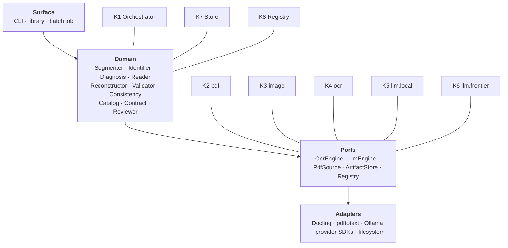
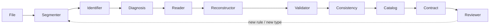

# Solution Architecture Document — `docflow` (PoC)

| Field | Value |
|---|---|
| Scope | PoC architecture for the 3-stage build model |
| Audience | Implementing team |
| Companion docs | `../idea/02-arch-components.md`, `../idea/02-components.md`, `../idea/01-pipelines.md`, `../idea/03-cli.md`, `prd.md`, `wbs.md` |
| Non-goals | Multi-tenant hosting, object storage, HA, metric dashboards (`# TODO: [RELEASE]`) |

---

## 1. Architecture overview

Four layers. The arrow only points **down**.



**The one dependency rule:** a domain component imports **ports**, never an adapter. An adapter imports a vendor SDK, never a domain component. Replacing Docling, moving from local files to object storage, or adding a provider is a change at the bottom and invisible above it.

**Only the domain layer knows the word "field".** A kernel API has no domain noun — no `invoice`, no `CUIT`, no `field`, no `verdict`. Domain knowledge arrives as **data** from K8: patterns, prompts, schemas, policies.

**K1, K7 and K8 are cross-cutting** — no component *contains* them; every component composes them.

## 2. Three-layer decomposition and two axes

| Layer | Source | Unit | Knows | Count |
|---|---|---|---|---|
| **Kernels** | `02-arch-components.md` | What it mechanizes | Nothing about documents | 8 (K1–K8) |
| **Domain components** | `02-components.md` | What it produces | Documents, fields, verdicts | 10 |
| **Pipelines** | `01-pipelines.md` | A route | Configuration only | 13 |

| Axis | Question | Values |
|---|---|---|
| **Material** | How is the text obtained? | `M0` text · `M1` text PDF · `M2` image PDF · `M3` image · `M4` pixels only |
| **Extractor** | How are values read? | `r` regex · `p` prompt · `rp` both (inside the primitive) |

## 3. Kernel inventory

| Code | Kernel | Mechanizes | Determinism | Cacheable | Cost |
|---|---|---|---|---|---|
| **K1** | `kernel.orchestrator` | Stage-graph execution over units; ledger, pause, resume, stop | deterministic | n/a — it *drives* | CPU |
| **K2** | `kernel.pdf` | Probe, classify, text extraction, render, physical split | deterministic | ✓ | CPU |
| **K3** | `kernel.image` | Rescale, deskew, crop, compress, legibility | deterministic | ✓ | CPU |
| **K4** | `kernel.ocr` | Pixels → positioned tokens | model-dependent | ✓ by engine revision | GPU/CPU heavy |
| **K5** | `kernel.llm.local` | Local generation and structured output (Ollama) | sampled | ✓ by digest + params | GPU |
| **K6** | `kernel.llm.frontier` | Hosted generation, structured output, vision, judging | sampled, external | partial — records the call | $ per token |
| **K7** | `kernel.store` | Content-addressed artifacts, per-unit ledger, run manifest | deterministic | n/a — it *is* the cache | I/O |
| **K8** | `kernel.registry` | Patterns, prompts, schemas, policies, pipelines, model catalog | deterministic | n/a | trivial |

**Two kernels are not engines.** K7 and K8 mechanize *state* and *configuration* — where an artifact lives and how it is verified, and where a corpus's tunable decisions live and how they are versioned.

**Stage 1 implements only the operations Stage 2 calls.** Kernels such as K3's `phash`, K2's `merge`/`embedded_images`/`page_facts` beyond classification, and K6's `judge`/`count_tokens`/batch roles are documented targets, not PoC scope. `# TODO: [MVP]`.

## 4. Determinism contract

Every kernel declares one of three classes. The **orchestrator reads the class** — it decides what resume can and cannot mean.

| Class | Kernels | Re-running gives | Consequence for resume |
|---|---|---|---|
| **deterministic** | K1, K2, K3, K7, K8 | The identical result | The artifact is a **cache**; it can be dropped and recomputed |
| **sampled** | K4, K5, K6 | A different result, usually | The artifact is **evidence**; it must be kept and never regenerated to check it |
| **external** | K6's remote calls | The supplier's current answer | The artifact is a **record of a moment**; a later call is a new observation, not a correction |

**Consequence for resume.** A run that silently substitutes a fresh sample for a missing artifact has changed the result while reporting success. The correct outcome is `failed`, with the reason that the evidence is missing. Retrying a sampled kernel is a **new sample**: attempts are counted, and **retrying to obtain agreement is forbidden** — it manufactures contrast where none existed.
## 5. The cache key

A stage's result is a pure function of its key; the key drives idempotency, `--force` and resume.

$$key = H(\;\text{input hash} \;\|\; \text{kernel id} \;\|\; \text{kernel version} \;\|\; \text{adapter revision} \;\|\; \text{params} \;\|\; \text{registry hash} \;\|\; \text{model revision}\; )$$

| Term | Source | Why it is in the key |
|---|---|---|
| **input hash** | K7, sha256 of the upstream artifact | The same stage on different bytes is different work |
| **kernel id / version** | The kernel itself | A bug fix must invalidate what the bug produced |
| **adapter revision** | Docling, `pdftotext`, provider SDK | Same call, different engine version, different output |
| **params** | The stage's own settings | DPI, chunk size, language, temperature |
| **registry hash** | K8 | The prompt, the pattern, the schema — a corpus tuning change is a key change |
| **model revision** | Ollama digest, provider model string | `qwen2.5` is a **moving tag**; the digest is the identity |

**The last two are the ones usually missing**, and they are the ones that produce the failure this design exists to prevent: a stage that is `done` and no longer correct. With them, an improved prompt changes the registry hash, every `extract.p` key changes, and the ledger's completion claims become *visibly stale* instead of quietly wrong — which is what gives `--force --stage extract.p` something precise to invalidate.

## 6. Kernel boundary types

| Type | Is | Produced by |
|---|---|---|
| `Bytes` / `Artifact` | An opaque buffer / a stored blob with a content hash | K2, K3, K7 |
| `RenderedPage` | A bitmap, its page number, its DPI, its source box | K2, K3 |
| `Region` | A box in **source page coordinates** | K3 |
| `Token` | Text with a page, a box, a confidence and a role | K4 |
| `Evidence` / `Reason` | What the kernel observed / why it produced no value | all |
| `CallRecord` | Provider, model revision, tokens, cost, latency, request id | K5, K6 |

The two dataclasses below are **the contract**:
```python
@dataclass(frozen=True, slots=True)
class Token:
    """One positioned token as a reader returned it.

    Attributes:
        text: The token's characters, exactly as read, before any correction.
        page: One-based page number within the source document.
        bbox: Bounding box in source page coordinates, at the render DPI.
        confidence: Reader confidence in [0, 1], or None when the reader reports none.
        role: Reader-assigned role, e.g. "text", "table_cell", "header".
    """

    text: str
    page: int
    bbox: Box
    confidence: float | None
    role: str


@dataclass(frozen=True, slots=True)
class KernelResult(Generic[T]):
    """The outcome of one kernel call, always with its evidence.

    Attributes:
        value: The result, or None when the kernel could not produce one.
        evidence: What was observed — versions, parameters, measurements.
        reason: Why value is None, or None when it is not.
    """

    value: T | None
    evidence: Evidence
    reason: Reason | None
```

**No third state.** A kernel either returns a value with evidence, or returns no value and a reason. It never returns a plausible stand-in — an empty string, a zero, an empty token list, a default model. Those are the shapes a silent error takes at a layer boundary, and each is a decision the caller must not be able to skip. Two consequences the contract forces: `confidence: float | None` — `None` is **not** `1.0`; and the box is in **source page coordinates**, so a crop's local coordinates must be mapped back before they leave K3.

## 7. Orchestrator model

| Term | Definition | In this project |
|---|---|---|
| **Unit** | What the graph iterates over; the ledger's subject | A file |
| **Stage** | A named step producing artifacts from artifacts | `acquire`, `extract.r`, `validate`, `report` |
| **Graph** | Stages plus dependencies, with barriers | The primitive: prefix → extractor → validate → report |
| **Ledger** | Per-unit durable record of stage states | `<name>.ledger.json` |
| **Manifest** | Derived whole-run summary | `run.json` |

Nothing in that definition mentions files, which is why K1 is reusable: a unit is whatever the caller iterates over.

### 7.1 The seven durable states

| State | Written when | Why it exists | Resumable |
|---|---|---|---|
| `running` | **Before** the stage's work starts | Distinguishes *never began* from *began and was cut off* | Yes — re-run |
| `done` | **After** the artifact is written and fsynced | `done` may only be written about bytes that exist | Only if the artifact verifies |
| `failed` | The stage ran and produced a Reason | Failure is a result, not an absence | Yes — escalate or review |
| `pending` | Not dispatched, or invalidated by a key change | Resumable | Yes — will run |
| `blocked` | Waiting on an upstream stage | Resumable | Yes — once unblocked |
| `stale` | Kept deliberately over changed inputs | A successor exists but is knowingly out of date | Only by choice |
| `skipped` | This pipeline does not run this stage | Records absence as a fact, not as a gap | Never |

**`running` is the whole crash-recovery design.** A scheduler that wrote state only on completion would report a killed stage as never having run — and then resume it as if nothing had happened.

**The single rule that never bends:** never write `done` about work that did not produce a durable artifact. Everything else in K1 is an optimization.

### 7.2 Scheduling

| Slot | Contended by | Default bound | Bounded by |
|---|---|---|---|
| `cpu` | K2 render, K3 ops, K4 CPU OCR | `DOCFLOW_JOBS` | Cores, memory for full-page bitmaps |
| `gpu` | K4 with a GPU backend, K5 | 1 per device | VRAM; each model is loaded once |
| `remote` | K6 | Provider rate limits | Tokens per minute, concurrency caps |

A single `--jobs 8` is wrong for this workload: eight page renders and eight Ollama generations are not eight of the same thing.

**Barriers are dependencies on a set.** Contract waits for all pages; Segmenter waits for all pages read; Consistency across extractors waits for both `extract.r` and `extract.p`. A partial set releases only when every member is terminal, so a failure does not deadlock the barrier.

**Failure is contained to the unit** — one unit failing never aborts the run. That is what makes 11k files a single command rather than 11k. **Verification** happens on every ledger read and has no flag: the run that most needs it is the one immediately after a forced kill, which is also the run whose operator is least likely to ask for it.

## 8. The EVR primitive and the 13 pipelines

$$\underbrace{4 \text{ text-available materials}}_{M0-M3} \times \underbrace{3 \text{ extractor modes}}_{r,\ p,\ rp} + \underbrace{1 \text{ pixels-only material}}_{M4} = 13$$

| | Material path | `ErVR` `r` | `EpVR` `p` | `ErpVR` `rp` |
|---|---|:---:|:---:|:---:|
| **M0** | text arrives directly | 1 | 2 | 3 |
| **M1** | text PDF → extract text | 4 | 5 | 6 |
| **M2** | image PDF → convert → OCR | 7 | 8 | 9 |
| **M3** | image → OCR | 10 | 11 | 12 |
| **M4** | image → (no text ever) | — | 13 | — |

**M4 has one variant only.** Regex needs a string, and M4 never produces one; every other material supports all three modes.

| Slot | Varies by | Applies to |
|---|---|---|
| **Material prefix** | Material | `M1`–`M4`; empty at `M0` |
| **E**xtractor | Mode (`r`, `p`, `rp`) | all thirteen |
| **V**alidate | **never** | all thirteen |
| **R**eport | **never** | all thirteen |

**No pipeline skips validation**, including the rules-only ones: a regex match proves a value was **captured**, not that it is **correct**. The guarantee this buys is what makes the pipelines substitutable rather than merely similar — a field always arrives with its four check verdicts and a trace, whatever route produced it. **Only 4 of the 13 have contrast** — exactly the `ErpVR` ones: `M0-ErpVR`, `M1-ErpVR`, `M2-ErpVR`, `M3-ErpVR`.

### 8.1 Residual blind spots — the decision surface

Read as residual risk *after* the four checks, not as coverage.

| Blind spot | Pipelines | Undetected |
|---|---|---|
| Single read, `ErVR` | 1, 4, 7, 10 | A bad anchor — a real value taken from the wrong place |
| Single read, `EpVR` | 2, 5, 8, 11, 13 | A plausible-but-false value, and a bad anchor |
| No visual evidence | 1–12 | Signatures, seals, checkboxes, logos |
| No offset | 13 (`M4-EpVR`) | Precise traceability |
| **No Segmenter** | **all 13** | A merged document — the one gap nothing closes |

The only remedies for the first two are contrast (`ErpVR`) or an external source (Catalog, which no pipeline runs yet).

## 9. Domain component chain



### 9.1 The three barriers

| Barrier | Waits for |
|---|---|
| **Segmenter** | All pages read |
| **Consistency across extractors** | Both reads over the same field |
| **Contract** | All pages resolved |

Page-level components (Diagnosis, Reader) are parallelizable. Consistency *across fields* is not a barrier: it operates inside one extractor run over already-extracted fields.
**Each component reads the previous one's artifact and writes its own** (`segmenter` → `.segments.json`, `identifier` → `.identity.json`, `diagnosis` → `.diagnosis.json`, `reader` → `.tokens.json`, `reconstructor` → `.document.json`, `validator` → `.validated.json`, `consistency` → `.consistency.json`, `catalog` → `.catalog.json`, `contract` → the result). Passing artifacts is what makes a single stage re-runnable. Under `run` they land in `out/<name>.work/`; only the Contract's output is what the consumer reads.

## 10. Escalation ladder


**The Validator governs the whole ladder.** "Could not" is defined in exactly one place, which is what makes escalation a policy rather than a habit spread across three components.

| Case | What is there | How it escalates | Cost |
|---|---|---|---|
| **Invalid field** | Value, page, offset | **Targeted**: render the region, ask about that field | Cheap and precise |
| **Missing field** | Nothing to point at | **Whole document** re-read from Diagnosis | **No saving** |

"Reprocess those 2, not the 20" applies only to the first case. Escalation also **recovers contrast**: the pipeline's existing value can be compared with the escalated read exactly as two flows are — a second opinion already paid for.

## 11. Output contract

```json
{
  "total": {
    "value": "15400.00",
    "extractor": "r",
    "trace": { "page": 3, "offset": [412, 424] },
    "verdicts": {
      "shape": "ok",
      "type": "ok",
      "content": "ok",
      "digit": null,
      "consistency": "ok",
      "catalog": "unverified"
    }
  }
}
```

| Verdict | Source | `ErVR` / `EpVR` variants | `ErpVR` variants |
|---|---|---|---|
| `shape`, `type`, `content`, `digit` | Validator (4 independent checks) | same | same |
| `consistency` | Consistency across extractors | `null` | set — both reads compared |
| `catalog` | Catalog | `unverified` | `unverified` |

**Why a single score is refused.** A field accumulates signals from five sources — cut confidence, Reader confidence, the four Validator verdicts, Consistency's reinforcement or disagreement, and the Catalog's state. Collapsing them repeats the mistake the Catalog exists to prevent: it mixes `unverified because the service was down` with `verified and matching`. With one number, a field nobody cross-checked would look identical to one that survived contrast. **The threshold is the consumer's** — the system's obligation is to make the difference visible, not to guess which difference matters.

**`consistency: null` is information**, not a gap: it tells the consumer this pipeline could not contrast that field, which is exactly what is needed to choose a pipeline per document type. **Failure is partial**: an illegible page is marked as such and the rest of the document is still emitted, with the absence declared.

## 12. Architecture Decision Records

### ADR-001 — Docling is the fixed and only OCR engine

- **Context / options:** OCR is the highest-variance step and the corpus mixes scans with photos. Considered: a pluggable engine per corpus; a fixed Docling; a fixed engine behind a port with no runtime selection.
- **Decision:** A fixed Docling behind a port that is **not** a setting. `pdftotext` handles the conversion path and Docling does not apply there.
- **Consequences:** One OCR implementation, one adapter revision in the cache key, no per-document engine matrix for the ledger to track. A different project takes the port and picks its own engine.

### ADR-002 — Validation is never skippable: no `--no-validate`

- **Context / options:** The `V` in every primitive is invariant across all thirteen pipelines. Considered: an escape hatch for rules-only pipelines; no flag at all.
- **Decision:** No flag. A regex match proves a value was **captured**, not that it is **correct**.
- **Consequences:** Never a pipeline variant without validation; never a config that removes it. The consumer can rely on the four verdicts always being present.

### ADR-003 — `ErpVR` is the primary PoC target

- **Context / options:** The matrix allows single-read and dual-read pipelines; only `ErpVR` can contrast. Considered: optimize for the cheapest selectable pipeline; make the dual-read primitive the default on text materials.
- **Decision:** `ErpVR` is the default on text materials — the only primitive whose **characteristic failure is detectable**, at a cost of one call on critical fields rather than a second acquisition.
- **Consequences:** Stage 2 closes its end-to-end flow on an `ErpVR` chain. `ErVR` and `EpVR` remain reachable, documented as accepting a named blind spot.

### ADR-004 — A kernel layer exists for reuse beyond this project

- **Context / options:** The same capability is needed by several components with different settings — rendering is needed by Diagnosis, Reader, Reconstructor and escalation — and the user requirement states the utilities are generic across a *series* of projects. Considered: utilities written per component; one engine per capability with no layer; a true kernel layer.
- **Decision:** A kernel layer with ports, adapters and no domain nouns. Four call sites, one kernel — written per component it would be four renderers that drift, and the escalation crop would eventually disagree with the diagnosis crop about what a page looks like.
- **Consequences:** A kernel API must stay free of domain nouns; domain knowledge arrives as registry data. Cost: an abstraction the PoC pays for before it has a second consumer.

### ADR-005 — Emission is a verdict vector, not a score

- **Context / options:** Per-field signals arrive from five sources. Considered: collapse to a confidence number; keep the verdicts separate.
- **Decision:** Keep them separate. A score would make a field nobody cross-checked indistinguishable from one that survived contrast, and would average "service was down" with "verified and matching".
- **Consequences:** The consumer sets the threshold. The system never says "trust this"; it says what it knows.

### ADR-006 — Verified on every ledger read, not behind `--verify`

- **Context / options:** A forced kill can land while a ledger is being written, leaving a claim about an artifact that does not exist. Considered: opt-in `--verify`; mandatory verification on every read.
- **Decision:** Mandatory on every read. The run that most needs the check is the one immediately after a forced kill, which is also the run whose operator is least likely to ask for it.
- **Consequences:** An existence check plus a hash comparison per document on every read. Cheap; being wrong about it is not.

### ADR-007 — The Segmenter over-segments when in doubt

- **Context / options:** A cut decision is the only one with no downstream escape hatch — over-splitting is detected later, over-merging is never detected. Considered: best-guess the cut; over-segment on doubt; route every doubtful cut to review.
- **Decision:** Over-segment. Splitting too much is recoverable noise; merging too much is silent corruption. Review-routing is not available, because the Segmenter must decide **before** anything else runs.
- **Consequences:** There is no flag to disable over-segmentation. The re-segmentation loop is capped at **one** pass; a second pass returning two types routes to review.

### ADR-008 — Library first, CLI as one surface

- **Context / options:** `my_prompt.md` requires both an include-able library and a CLI, with each component invocable alone. Considered: a CLI with a library underneath; a library with the CLI as one caller among others.
- **Decision:** Library first, with identical names across both surfaces — `Pipeline("M1-ErpVR", model="ollama:qwen2.5").run(path)` and `docflow run --pipeline M1-ErpVR`.
- **Consequences:** No logic lives in argument parsing. Batch, resume and the ledger are library capabilities the CLI merely exposes.
## 13. Risks

| Risk | Type | Stage | Mitigation |
|---|---|---|---|
| Docling install/portability (heavy dependency, GPU variants) | Technical | 2 | K4 port isolates it; pin the adapter revision into the cache key; test double behind the port |
| `pdftotext` is a poppler **external binary** | Dependency | 2 | Pin a version; a missing binary is a typed `Reason`, never a fallback reader |
| GPU unavailable for K5 | Technical | 2 | Typed error naming the remedy; `gpu` slot bounded to one generation per device; never a silent fallback model |
| Frontier LLM cost per token during validation | Cost | 2, 3 | Contrast scoped to critical fields; `count_tokens` before spending; circuit breaker degrades to `unverified`, never to rejection |
| 11k-file scale on the first full run — disk, memory, wall time | Operational | 3 | Stage 1 proves resume on a synthetic flow; slot and disk policy settled before the corpus run; the first run is interruptible by design |
| Unknown wording variants in the corpus | Product | 3 | `EpVR` tolerates variation; patterns are registry data, so a variant is a hash change, not a deployment |
| **Segmenter merged-document gap that no pipeline closes** | Product / accepted | 2, 3 | Declared in `README.md` and `prd.md`; over-segmentation mitigates; **not claimed solved** |
| Manifest drift (`run.json` vs ledgers) | Technical | 1 | Manifest derived and rebuildable; ledgers authoritative |
| Sampled artifact regenerated on resume, silently changing the result | Correctness | 1, 2 | Determinism class read by the orchestrator; missing evidence → `failed`; retrying to agreement forbidden |
| Cache key missing registry hash / model revision | Correctness | 1 | Both terms mandatory; registry validated at load |

## 14. Mapping the architecture onto the three build stages

| Deliverable | Stage 1 — arch-components | Stage 2 — components | Stage 3 — pipelines |
|---|:---:|:---:|:---:|
| **K1** `kernel.orchestrator` | **✓ full** (units, 7 states, slots, barriers, pause/stop) | reused | reused |
| **K2** `kernel.pdf` | **✓ thin** (`probe`, `classify`, `extract_tokens`, `render`, `split`) | reused (M1/M2 prefixes) | reused |
| **K3** `kernel.image` | **✓ thin** (`load` + EXIF, `legibility`, `rescale`, `crop` with inverse map) | reused | reused |
| **K4** `kernel.ocr` | port + Docling adapter + `capabilities`/`engine_info` | reused | reused |
| **K5** `kernel.llm.local` | port + Ollama adapter + `structured`/`vision` | reused | reused |
| **K6** `kernel.llm.frontier` | port + one provider adapter + `structured`/`vision` + `CallRecord` | escalation governor online | reused |
| **K7** `kernel.store` | **✓ full** (content-addressed, atomic write, ledger, manifest) | reused | reused |
| **K8** `kernel.registry` | **✓ full** (load + validate + hash) | assets populated (patterns, prompts, schemas, policies) | **13 pipeline descriptors** |
| **Segmenter** | — | ✓ | configuration only |
| **Identifier** | — | ✓ | configuration only |
| **Diagnosis** | — | ✓ (material selection) | selector per file with `--extractor` |
| **Reader** | — | ✓ (conversion + OCR paths, Docling) | reused |
| **Reconstructor** | — | ✓ minimal (layout + continuity) | reused |
| **Validator** | — | ✓ (4 checks + escalation policy) | reused |
| **Consistency** | — | ✓ (normalize, tolerance, arithmetic tie-break, cross-extractor) | only in the `ErpVR` codes |
| **Catalog** | — | ✓ minimal (unverified + retry queue) | described, no pipeline runs it |
| **Contract** | — | ✓ (verdict vector, trace, partial emission) | reused — shape-identical output |
| **Reviewer** | — | ✓ minimal (`queue`, `correct`, `promote`) | reused |
| **Pipelines** | — | 1 canonical `ErpVR` code exercised | **all 13 codes** |
| **Stage closing flow** | Synthetic: trivial stage through orchestrator + store + ledger, pause/resume/`stop --force` | Real document: canonical chain emitting a verdict vector + trace | **Corpus**: 13 codes reachable, 11k files, batch + resume |
