# Work Breakdown Structure — `docflow` (PoC)

| Field | Value |
|---|---|
| Lifecycle stage | **PoC** — close the end-to-end flow, happy path first |
| Effort signals | **S / M / L** — relative complexity, not calendar time (see §7) |
| Companion docs | `prd.md` (requirements), `sad.md` (architecture), `kernel-cli.md` (the Stage 1 acceptance harness) |

---

## 1. How to read this document

Work is organized in three stages that map onto the three orthogonal layers of the architecture. They are built **bottom-up**, in order:

| Stage | Layer | Source | Flow that closes it |
|---|---|---|---|
| **Stage 1 — arch-components** | Kernels + ports/adapters | `../idea/02-arch-components.md` | **Synthetic**: a trivial stage driven through orchestrator + store + ledger, with pause / resume / `stop --force` |
| **Stage 2 — components** | Domain | `../idea/02-components.md` | **Real document**: canonical chain emitting a verdict vector + trace |
| **Stage 3 — pipelines** | Routes | `../idea/01-pipelines.md` | **Corpus**: all 13 codes reachable, 11k files, batch + resume |

**The rule that governs the whole plan: a stage ends only when its end-to-end flow closes.** A stage with every task "done" but no closed flow is not finished. The closing criterion is the last task of each stage and it is non-negotiable.

**Why bottom-up.** Contracts must be fixed before they are multiplied — 10 components × 13 pipelines all call the same 8 kernels. The riskiest invariants live at the bottom (resume semantics, `running`-before-work, the cache key, sampled-vs-deterministic artifacts, never writing `done` about non-durable bytes) and must be settled once, early. The 13 pipelines are a matrix (4 materials × 3 modes + 1), not 13 designs, which is why Stages 1 and 2 must be stable first.

**Every PoC shortcut is marked** with `# TODO: [MVP]` or `# TODO: [RELEASE]` inline in the Deliverable column.

## 2. Dependency diagram

```mermaid
graph LR
    subgraph S1["Stage 1 — arch-components"]
        direction TB
        S1A["Contracts<br/>Token · KernelResult · Evidence"]
        S1B["K7 Store"]
        S1C["K1 Orchestrator"]
        S1D["K8 Registry"]
        S1E["Ports + adapters<br/>K2–K6"]
        S1G["Kernel CLI harness<br/>17-row silent-failure matrix"]
        S1F["Synthetic flow<br/>+ pause/resume/stop --force"]
    end

    subgraph S2["Stage 2 — components"]
        direction TB
        S2A["Segmenter · Identifier"]
        S2B["Diagnosis · Reader"]
        S2C["Reconstructor · Validator"]
        S2D["Consistency · Catalog"]
        S2E["Contract · Reviewer"]
        S2F["Real-document flow<br/>verdict vector + trace"]
    end

    subgraph S3["Stage 3 — pipelines"]
        direction TB
        S3A["13 pipeline descriptors"]
        S3B["Registry assets<br/>patterns · prompts · schemas · policies"]
        S3C["Batch + mirrored tree + run.json"]
        S3D["Corpus flow<br/>11k files, batch + resume"]
    end

    S1A --> S1B
    S1A --> S1C
    S1A --> S1D
    S1B --> S1C
    S1D --> S1C
    S1C --> S1E
    S1A --> S1G
    S1E --> S1G
    S1G --> S1F
    S1E --> S1F
    S1F --> S2A
    S1F --> S2B
    S2A --> S2C
    S2B --> S2C
    S2C --> S2D
    S2D -.->|"emitted, never run"| S2E
    S2E --> S2F
    S2F --> S3A
    S2F --> S3B
    S2F --> S3C
    S3A --> S3D
    S3B --> S3D
    S3C --> S3D
```

**The one dotted edge.** `Consistency → Catalog` is dotted because the Catalog is a **declared step with no runnable implementation behind it in the PoC**: no pipeline invokes it (`prd.md` §4.2), so the Contract emits `catalog: unverified` with the reason `not_run` on every field rather than leaving the verdict absent (FR-23, `sad.md` ADR-009). It is drawn because it is where the step belongs — and because a reader is otherwise entitled to think the canonical chain in `sad.md` §9 is what runs today.

**Read this diagram as build order, not as the production route.** Every solid arrow is "the head must exist before the tail closes", which is why `S2A (Segmenter · Identifier) → S2C` is solid: Stage 2's closing demo walks the canonical chain, so the Segmenter has to be built and tested to close the stage. Whether a *pipeline* invokes a component over the 11k files is a separate question, answered by the usage matrix in `01-pipelines.md` — and by that matrix, four components (`Segmenter`, `Identifier`, `Reconstructor`, `Catalog`) run in **no** pipeline. Collapsing those two questions is what produced the defect this note replaces: "no pipeline runs the Segmenter" was read as "the Segmenter does not gate Stage 2", and those are not the same claim.

## 3. Stage 1 — arch-components

**Scope: the 8 kernels (K1–K8) plus the ports/adapters layer. No domain nouns.**
**Closing criterion: a synthetic flow runs end to end through orchestrator + store + ledger, and pause / resume / `stop --force` all recover correctly.**

**Stage 1 is intentionally thin.** `02-arch-components.md` describes a target architecture, not PoC scope. Only the kernel operations Stage 2 actually calls are implemented.

| ID | Task | Depends on | Deliverable | Done when (verifiable) | Effort |
|---|---|---|---|---|---|
| **S1-T01** | Freeze kernel boundary types: `Token`, `KernelResult`, `Evidence`, `Reason`, `CallRecord`, `Bytes`, `Artifact` | — | `docflow/kernels/types.py` | Types are frozen dataclasses; `KernelResult` cannot express a value without evidence nor a `None` without a reason; a unit test asserts no third state exists | M |
| **S1-T02** | K7 store: content-addressed put/get, atomic write (flush → fsync → rename), `verify`, never-empty `get` | `S1-T01` | `docflow/kernels/store.py` | Identical bytes stored once; a killed write leaves no partial artifact visible; `get` on a miss raises; `verify` detects a truncated file | L |
| **S1-T03** | K7 ledger write path: `begin` / `commit` / `fail`, `read_ledger`, `write_ledger` | `S1-T02` | `docflow/kernels/store.py` | `commit` writes `done` only after the rename returns; a forced kill between write and rename leaves the stage `running`, not `done` | L |
| **S1-T04** | K8 registry: load, schema-validate, fail fast, compute `registry_hash` | `S1-T01` | `docflow/kernels/registry.py` | A malformed asset stops the run; a missing asset is never defaulted; changing one prompt changes the hash | M |
| **S1-T05** | Cache key: implement the 7-term formula including registry hash and model revision | `S1-T04` | `docflow/kernels/cache_key.py` | Two runs with the same 6 terms and a different registry hash produce different keys; unit-tested per term | M |
| **S1-T06** | K1 orchestrator core: unit / stage / graph / ledger / manifest, dependency dispatch | `S1-T03`, `S1-T05` | `docflow/kernels/orchestrator.py` | A 3-stage synthetic graph runs over N units; `run.json` is derived and `rebuild_index()` reproduces it from ledgers alone. `rebuild_index()` is **K1's operation and the only authority** for a manifest; K7's `rebuild_manifest()` delegates to it (`kernel-cli.md` §9) | L |
| **S1-T07** | K1 durable states: the 7 states, with `running` written **before** the work starts | `S1-T06` | `docflow/kernels/orchestrator.py` (cont.) | Kill mid-stage → ledger reads `running`; the invariant "never `done` about a non-durable artifact" holds under an injected crash | L |
| **S1-T08** | Determinism classes + resume consequence | `S1-T06` | `docflow/kernels/determinism.py` | A deterministic artifact is recomputable; a sampled artifact with a missing file reports `failed` with an evidence-missing reason and **never regenerates** | M |
| **S1-T09** | Typed slots (`cpu`/`gpu`/`remote`) + barriers (dependency on a set) + unit-contained failure | `S1-T07` | `docflow/kernels/orchestrator.py` (cont.) | One unit failing does not abort the run; a partial barrier set releases when every member is terminal | M |
| **S1-T10** | Mandatory verification on every ledger read, with **no flag** | `S1-T07` | `docflow/kernels/orchestrator.py` (cont.) | A `done` stage whose artifact was deleted is treated as incomplete; no code path exists that skips the check | S |
| **S1-T11** | Ports: `PdfSource`, `OcrEngine`, `LlmEngine`, `ArtifactStore`, `Registry` interfaces | `S1-T01` | `docflow/ports/` | No adapter is importable from a port; a fake adapter satisfies each port in tests | M |
| **S1-T12** | K2 `kernel.pdf` thin: `probe`, `classify`, `extract_tokens`, `render`, `split` | `S1-T11` | `docflow/kernels/pdf.py` | `classify` returns `text`/`image`/`mixed`/**`blank`** and detects invisible text; `render` never upscales; effective DPI measured from embedded pixels (`# TODO: [MVP]` — full `page_facts`) | L |
| **S1-T13** | K3 `kernel.image` thin: `load` (EXIF applied), `legibility` (measurement + reason, never a boolean), `rescale`, `crop` (inverse map returned) | `S1-T11` | `docflow/kernels/image.py` | A photo read sideways is impossible; an illegible bitmap carries a `Reason`; a crop's coordinates are mapped back to source page coordinates before leaving (`# TODO: [MVP]` — deskew/denoise/tile/phash) | M |
| **S1-T14** | K4 `kernel.ocr` port + Docling adapter: `capabilities`, `read`, `engine_info` | `S1-T11` | `docflow/ports/ocr.py`, `docflow/adapters/docling.py` | Returns positioned tokens with **no reading order**; Docling's layout output is dropped at the boundary; there is **no engine setting**; `engine_info` feeds the cache key (`# TODO: [MVP]` — OCR correction pass) | L |
| **S1-T15** | K5 `kernel.llm.local` port + Ollama adapter: `structured`, `vision`, `warm`, `capabilities` | `S1-T11` | `docflow/adapters/ollama.py` | Digest recorded at first use and compared for the remainder of the run; a missing model raises a typed error naming `ollama pull <model>`; truncation maps to a typed error and is **never** parsed as complete | L |
| **S1-T16** | K6 `kernel.llm.frontier` port + one provider adapter: `structured`, `vision`, `judge`, `CallRecord` | `S1-T11` | `docflow/adapters/frontier.py` | The raw completion is persisted **before** any parse; `429` honours `retry-after` verbatim; sustained unavailability degrades to `unverified`, never to rejection; secrets read from the environment only (`# TODO: [MVP]` — second provider, batch API, token counting) | L |
| **S1-T17** | Resolution by capability + fail fast on unknown provider/model | `S1-T15`, `S1-T16` | `docflow/kernels/resolution.py` | `ollama:qwen2.5` and `anthropic:…` resolve; an unknown name fails with a reason naming it; **no fallback default exists anywhere** | S |
| **S1-T18** | CLI shell: `run` (idempotent), `status`, `jobs`, `pause`, `stop [--force]` | `S1-T06` | `docflow/cli.py` | Repeating `run` skips completed work; a second `run` after a kill continues; `stop` with no arguments **discovers** and reports instead of killing | M |
| **S1-T20** | `docflow-kernel` entry point: subcommand dispatch, `--list`, the exit-code contract (`0`/`2`/`3`/`4`/`1`), the `KernelResult` JSON envelope, `--save` routed through K7 | `S1-T01` | `docflow/kernel_cli/__init__.py`, `docflow/kernel_cli/main.py` — a **package**, never a `kernel_cli.py` module beside it | All five exit codes are reachable and unit-tested; stdout is valid JSON on every path that emits a `KernelResult` (exits `0`, `2`, `3`); stderr never carries anything a script parses; `--list` reports the 8 kernels with determinism class and adapter availability | M |
| **S1-T21** | Per-kernel subcommands, 1:1 with port methods, filled in as each adapter lands | `S1-T20`, and each of `S1-T12`–`S1-T17` as it completes | `docflow/kernel_cli/{orchestrator,store,registry,pdf,image,ocr,llm}.py` | Every command in `kernel-cli.md` §9 **not marked `MVP`** dispatches, and every `MVP` command exits `4` naming the operation as unavailable; a contract test compares each dispatched command's flag set against its port signature and fails on any flag with no counterpart | L |
| **S1-T22** | Silent-failure suite: one assertion per row of the 17-row matrix, with the committed fixtures | `S1-T21` | `tests/kernel_cli/`, `fixtures/` | The **16** rows whose commands are `now` run in CI against a committed fixture and target a `reason.code`, never a message string; row 15 is declared, gated on `judge`, and asserted the moment it lands; `--repeat` proves identical hashes for the deterministic kernels and differing hashes for the sampled ones (`# TODO: [MVP]` — fixture generator instead of committed documents; split into a fast subset and a gated subset for K4–K6) | L |
| **S1-T19** | **Stage 1 closing flow (synthetic)** | `S1-T09`, `S1-T10`, `S1-T18`, **`S1-T22`** | Integration test + demo script | A trivial 3-stage graph over a synthetic unit set completes; `pause` then `run` continues from the exact stage; `stop --force` mid-stage leaves `running` in the ledger and the next `run` re-runs **at most one stage per in-flight unit**; a deleted artifact is detected without any flag; **the flow is invocable as `docflow-kernel orchestrator run descriptors/synthetic-3stage.yaml --out O` and its recovery is observable via `orchestrator ledger-read`** | L |

**The kernel CLI is the Stage 1 acceptance harness, not an add-on** — see `kernel-cli.md`. `S1-T20` sits immediately after `S1-T01` because it consumes the boundary types; `S1-T22` is a hard predecessor of `S1-T19`. The chain `S1-T20 → S1-T21 → S1-T22` is shorter than the serial kernel chain, so it runs in parallel and does **not** lengthen the critical path — but it cannot slip *past* `S1-T19`. `S1-T21`'s scope is the `now` set, not the whole of §9: the operations `02-arch-components.md` documents but Stage 2 never calls stay `MVP` and their commands exit `4` (see the status legend in `kernel-cli.md` §9).

`# TODO: [MVP]` in Stage 1: full `page_facts`/`phash`/`tile`/`merge` in K2/K3; OCR correction; a second frontier provider; every flag in the `03-cli.md` deferred list; moving `docflow-kernel` into a `[dev]` extra so it is not installed with the release package.
`# TODO: [RELEASE]` in Stage 1: object-storage or database backends behind K7; distributed orchestration.

## 4. Stage 2 — components

**Scope: the 10 domain components built on the Stage 1 kernels.**
**Closing criterion: a real document traverses the canonical chain and emits a verdict vector + trace, with an `ErpVR` chain demonstrating contrast.**

**"The canonical chain" is the closing criterion, not the production route.** `sad.md` §9 draws `File → Segmenter → Identifier → Diagnosis → …`, and Stage 2 must build that whole chain because the closing demo walks it. What the 13 pipelines do *not* do is run `Segmenter`, `Identifier`, `Reconstructor` and `Catalog` over the corpus (§5 of `01-pipelines.md`); that is the declared permanent limitation, and it is a statement about Stage 3, not about whether these tasks gate Stage 2. They do — see §6.2, branch A.

| ID | Task | Depends on | Deliverable | Done when (verifiable) | Effort |
|---|---|---|---|---|---|
| **S2-T01** | Segmenter: cut detection (restarted numbering, new header, table continuity) + confidence per cut | `S1-T19` | `docflow/components/segmenter.py` | A doubtful cut **over-segments**; there is no flag to disable it; cut decisions are recorded as evidence (`# TODO: [MVP]` — real 3-invoice corpus fixture) | L |
| **S2-T02** | Identifier: type by text / by shapes / mixed, returning type **plus evidence**; low confidence routes to review | `S2-T01` | `docflow/components/identifier.py` | Evidence exposes which words or shapes triggered the decision; an "other" route exists; a misclassified document is explainable without re-running (`# TODO: [MVP]` — document-type catalog in K8 is minimal) | L |
| **S2-T03** | Re-segmentation loop with its **single** pass and page reuse | `S2-T02` | `docflow/components/identifier.py` + `segmenter.py` | Two types in one segment → re-segment **once**, reusing pages already read; a second pass returning two types routes to review; there is no third pass | M |
| **S2-T04** | Diagnosis: quality-not-presence gate, three outcomes, adaptation | `S1-T12`, `S1-T13` | `docflow/components/diagnosis.py` | A page with a stale invisible OCR layer is **not** routed to conversion; an illegible image routes aside with a reason instead of reaching OCR; the `MIN_CHARS`/`MIN_DPI` policy values come from K8 (`registry/policies/`) with **no CLI flag and no environment variable** (ADR-009); the kernel reports the measurement and Diagnosis takes the decision — no threshold is a constant inside K3 or K4 | L |
| **S2-T05** | Reader: conversion path (`pdftotext`) and OCR path (Docling), routed **per page** | `S2-T04`, `S1-T14` | `docflow/components/reader.py` | A mixed PDF combines both paths and joins at the end; Docling is **never** used on the conversion path; output is positioned tokens, not ordered text | L |
| **S2-T06** | M2/M3 shared implementation with the rasterization switch at the front | `S2-T05` | `docflow/components/reader.py` (cont.) | `M2` and `M3` differ only by the `K2.render` step; one code path, verified by a test that asserts the switch | M |
| **S2-T07** | Reconstructor: minimal layout + cross-page continuity + reading order | `S2-T05` | `docflow/components/reconstructor.py` | A table whose header is on one page and whose rows continue on the next keeps the association; a header repeated across pages is collapsed once (`# TODO: [MVP]` — full table reconstruction) | L |
| **S2-T08** | Validator: 4 **independent** checks issuing independent verdicts; most-severe-failure governs | `S2-T07` | `docflow/components/validator.py` | A field can pass shape and type, fail content, and route to review; the check digit can reject while the rest pass; no code path skips validation (`# TODO: [MVP]` — the 6 pending business-rule categories) | L |
| **S2-T09** | Validator owns "could not": the escalation ladder and the two cases | `S2-T08`, `S1-T13` | `docflow/components/validator.py` (cont.) | An invalid field renders **only** its region and contrasts against the existing value; a missing field re-reads the whole document with **no saving** and this is visible in the ledger | M |
| **S2-T10** | Consistency: normalize before comparing; tolerance by field type | `S2-T08` | `docflow/components/consistency.py` | `1.540,00` and `1540.00` compare equal; amounts use cents tolerance while identifiers and dates are exact; the raw values are not what is compared | M |
| **S2-T11** | Consistency across extractors — **contrast**, plus arithmetic tie-break | `S2-T10` | `docflow/components/consistency.py` (cont.) | The 1540/15400 case produces a disagreement verdict; arithmetic resolves it where only one value closes with `subtotal + taxes`; an identifier disagreement with no arithmetic relation routes to review | L |
| **S2-T12** | Catalog: external identity lookup, `unverified` ≠ invalid, owned retry queue | `S2-T11` | `docflow/components/catalog.py` | A non-responding source yields `unverified`, never a rejection; the retry queue is visible in the output as a pending field, not a missing one; the verdict's **reason** (`not_run` \| `source_unavailable` \| `pending_retry`) keeps "never attempted" distinguishable from "the source was down" (FR-23). **No pipeline invokes it** in the PoC, so today every field reads `not_run` (`# TODO: [MVP]` — real external source and `--source`) | M |
| **S2-T13** | Contract: barrier, heterogeneous provenance, per-field `(page, extractor)` trace | `S2-T11` | `docflow/components/contract.py` | Emits the barrier only when all pages are resolved; a document with `r` offset-traced and `p` bbox-traced fields is emitted correctly; an illegible page is marked and the rest still emitted; **every field carries its `catalog` verdict with a reason even where the Catalog never ran** (FR-23) | L |
| **S2-T14** | Contract: the verdict vector, with `consistency` set only where both reads ran | `S2-T13` | `docflow/components/contract.py` (cont.) | Output matches the documented JSON shape; a single-read pipeline emits `consistency: null`; **no** derived single score exists in the output | M |
| **S2-T15** | Reviewer: `queue`, `correct`, `promote` (corrected datum / new rule / new type) | `S2-T13` | `docflow/components/reviewer.py` | Cases land beside their document with provenance; a promoted rule becomes registry data in K8 and invalidates the affected cache keys (`# TODO: [MVP]` — workflow UI, promotion controls) | M |
| **S2-T16** | Per-component CLI subcommands with the documented read/write artifact chain | `S2-T14` | `docflow/cli.py` (cont.) | Each of the 10 components runs standalone from the previous component's artifact to its own; re-running one stage does not repeat the ones before it | M |
| **S2-T17** | **Stage 2 closing flow (real document)** | `S2-T03`, `S2-T06`, `S2-T09`, `S2-T11`, `S2-T14` | Integration test + documented demo | A real document traverses the canonical chain through an `ErpVR` code and emits a result with a verdict vector and a trace per field; the contrast case is reproduced end to end; partial failure marks one page only | L |

`# TODO: [MVP]` in Stage 2: full Reconstructor table reconstruction; the 6 business-rule categories; a real Catalog source; the Reviewer workflow; `--format md|html`, `--schema`, `--golden`, `--keep-artifacts`, `--isolate`.

## 5. Stage 3 — pipelines

**Scope: the 13 pipeline codes as configuration and registry data over the Stage 2 components. Largely data, not new code.**
**Closing criterion: all 13 codes reachable and producing shape-identical output; a batch over the corpus runs, mirrors the tree, and resumes after an interruption.**

| ID | Task | Depends on | Deliverable | Done when (verifiable) | Effort |
|---|---|---|---|---|---|
| **S3-T01** | Pipeline descriptor schema in K8 (material prefix → extractor → validate → report) | `S2-T17` | `registry/pipelines/*.yaml` | The descriptor expresses the `EVR` primitive and the stage set; a descriptor failing its own schema stops the run | M |
| **S3-T02** | The 13 descriptors: `M0-ErVR` … `M4-EpVR` | `S3-T01` | 13 pipeline descriptors | `docflow run --pipeline <CODE>` resolves all 13; `M4-ErVR`, `M4-ErpVR`, `M0-*` at a PDF, and unknown codes are all **errors**, not silent conversions | M |
| **S3-T03** | Ledger stage set derived from the primitive (`acquire` / `extract.r` / `extract.p` / `validate` / `report`) + `not_applicable` list | `S3-T02`, `S1-T03` | Ledger schema + writer | `M1-ErpVR` records no `segmenter`/`identifier`/`reconstructor`/`catalog` stage but lists them in `not_applicable`; `M4-EpVR` has a single `extract` and no `acquire` | M |
| **S3-T04** | Registry assets: anchors/patterns, extraction prompts, field schemas, policies (critical fields, tolerances) | `S1-T04`, `S2-T11` | `registry/patterns/`, `registry/prompts/`, `registry/schemas/`, `registry/policies/` | A prompt edit changes the registry hash and therefore every `extract.p` key; a missing asset fails fast; "critical field" is defined as policy data, not code | L |
| **S3-T05** | `--extractor r\|p\|rp` with per-file material selection by Diagnosis | `S3-T02`, `S2-T04` | CLI + Diagnosis selector | One pass over a mixed-material folder routes each file correctly; passing both `--extractor` and `--pipeline` is an error | M |
| **S3-T06** | Batch input: one file, several files, one folder; mirrored output tree | `S1-T18`, `S3-T02` | `docflow/batch.py` | `documentos/2024/enero/factura-001.pdf` → `out/2024/enero/factura-001.json`; the tree is preserved exactly, including empty directories (`# TODO: [MVP]` — symlink and permission edge cases) | M |
| **S3-T07** | Output layout + `run.json` + suffix rule | `S3-T06`, `S1-T06` | Result/ledger/work layout | `<name>.json` vs `<name>.ledger.json` vs `<name>.work/` are distinguishable by suffix alone; `run.json` carries `state`, `totals`, `stages`, `outcomes`, `inflight`. The **mechanism** is `S1-T06`'s `rebuild_index()`; this task owns the manifest's **shape and location**. No `--rebuild-index` flag exists in the PoC (`prd.md` §7) — the rebuild is a library call | M |
| **S3-T08** | `--force`, `--stage`, `--only` with downstream invalidation | `S1-T05`, `S3-T07` | CLI + orchestrator invalidation | A forced `extract.p` marks `validate`/`consistency`/`report` as `pending`; a stage left `done` over new fields is impossible; `--force`, `--stage`, `--only` are never settable by environment | L |
| **S3-T09** | Resume at corpus scale: per-document granularity, stage-level granularity | `S3-T08` | Verified resume path | A run killed at 4,821 of 11,034 documents resumes from the exact stage of the in-flight document; completed documents are skipped without re-reading | M |
| **S3-T10** | `run.json` presented as derived and rebuildable, never authoritative | `S3-T07` | Docs + a `rebuild_index()` test | Deleting `run.json` and rebuilding reproduces it from the ledger tree; a hand-deleted artifact shows up as incomplete on the next read | S |
| **S3-T11** | Slot and resource policy for the corpus | `S1-T09`, `S1-T15` | `.env.example` + slot config | `DOCFLOW_JOBS` bounds CPU work; `gpu` is bounded to one in-flight generation per device; the Ollama model is loaded once across the run (`keep_alive`) | M |
| **S3-T12** | **Operational** `DOCFLOW_*` settings + precedence, and policy assets declared as **not** settings | `S3-T11`, `S1-T04` | `.env.example` + `registry/policies/` | Precedence is CLI → environment → `.env` → default, and it governs **paths, slots, model and host only**. `CUT_CONFIDENCE`, `MIN_CHARS`, `MIN_DPI`, `CORRECT`, `TOLERANCE_AMOUNTS` are registry assets with **no environment variable and no CLI flag**, per ADR-009 — `.env.example` names them only to say so. A test asserts no policy value can be set from the environment. **This settles the layer that `S2-T04` consumes** | S |
| **S3-T13** | Shape-identity verification across all 13 codes | `S3-T02`, `S2-T14` | Contract test | All 13 codes emit the same field/verdict/trace shape; `consistency` is non-null exactly on the four `ErpVR` codes (`M0-ErpVR`, `M1-ErpVR`, `M2-ErpVR`, `M3-ErpVR`) | M |
| **S3-T14** | **Stage 3 closing flow (corpus)** | `S3-T04`, `S3-T05`, `S3-T09`, `S3-T12`, `S3-T13` | First full run + report | All 13 codes are reachable; every document produces a result or a declared partial failure; the first full run over the corpus completes and is interrupted and resumed successfully; the baseline throughput is recorded (`# TODO: [MVP]` — latency and throughput targets) | L |

`# TODO: [MVP]` in Stage 3: golden-set comparison (`--golden`), latency/throughput targets, symlink edge cases, `--dry-run`.
`# TODO: [RELEASE]` in Stage 3: telemetry and dashboards, distributed execution, multi-region.

## 6. Critical path

The critical path is the chain that must be serial because each link fixes a contract the next one multiplies.

**How this section is derived.** The path is the transitive closure of the `Depends on` column, computed — not hand-picked. A task is on the path when the closing flow of its stage waits on it, directly or through another task. The rule from §1 applies without exception: a task whose dependency set is serial joins the path even when the *pipeline* never runs it, because a **stage ends only when its flow closes**, and Stage 2's flow is the demo that traverses the canonical chain.

### 6.1 The spine

| Order | Task | Title | Why it is on the path |
|---:|---|---|---|
| 1 | `S1-T01` | Freeze kernel boundary types | Every kernel and every component exchanges these types |
| 2 | `S1-T02` | K7 store: content-addressed, atomic write | Resume is not meaningful without durable, verifiable bytes |
| 3 | `S1-T03` | K7 ledger write path | `running`-before-work and `done`-after-fsync live here |
| 4 | `S1-T04` | K8 registry: load, validate, hash | The registry hash is a mandatory cache-key term |
| 5 | `S1-T05` | Cache key: the 7-term formula | Idempotency, `--force` and precise invalidation all depend on it |
| 6 | `S1-T06` | K1 orchestrator core | Drives every stage of every stage |
| 7 | `S1-T07` | K1 durable states (7) with `running` before work | The whole crash-recovery design |
| 8 | `S1-T09` | Typed slots, barriers, unit-contained failure | The corpus run is impossible without them |
| 9 | `S1-T18` | CLI shell: `run`, `pause`, `stop --force` | The surface that exercises resume |
| 10 | `S1-T19` | **Stage 1 closing flow (synthetic)** | Stage 1 does not exist as "done" without it |
| 11 | `S2-T17` | **Stage 2 closing flow (real document)** | Stage 2's closing criterion |
| 12 | `S3-T02` | The 13 pipeline descriptors | Every CLI entry point |
| 13 | `S3-T08` | `--force`/`--stage` with downstream invalidation | Prevents stale-verdict output |
| 14 | `S3-T09` | Resume at corpus scale | 11k files is not a single pass |
| 15 | `S3-T14` | **Stage 3 closing flow (corpus)** | The PoC's ultimate target |

### 6.2 The Stage 2 branches

`S2-T17` waits on **five** dependencies, and each is the head of a chain. They run in parallel, so the lead time is the **longest** chain, not the sum.

| Branch | Chain | Links | Required by `S2-T17` through |
|---|---|:---:|---|
| **A — segmentation** | `S2-T01 → S2-T02 → S2-T03` | 3 | direct |
| **B — acquisition** | `S2-T04 → S2-T05 → S2-T06` | 3 | direct |
| **C — reconstruction** | `S2-T05 → S2-T07 → S2-T08 → S2-T09` | 4 | direct |
| **D — contrast** | `S2-T08 → S2-T10 → S2-T11` | 3 | direct |
| **E — emission** | `S2-T11 → S2-T13 → S2-T14` | 3 | direct |

The longest is **B → C → D → E**, nine links from `S2-T04` to `S2-T17`. Two consequences worth planning around:

- **Branch A is mandatory but is not the schedule driver.** The Segmenter chain is three links against the longest chain's nine, so it can start later than `S2-T04` and still not delay the close. It cannot be *skipped*, and it cannot slip past `S2-T17` — the distinction that §6 previously lost.
- **`S2-T08` (Validator) is the busiest node.** Branches C, D and E all pass through it, which is why its `# TODO: [MVP]` (the 6 deferred business-rule categories) must not become a blocker: the four universal checks are the PoC surface, and they land at `S2-T08` regardless.

**The dependency this exposes:** the canonical chain in `sad.md` §9 (`File → Segmenter → Identifier → Diagnosis → …`) is the close of Stage 2 — not a description of what runs over the 11k files. Those are two different things and the artifacts previously stated the second where they meant the first.

**Not on the critical path — can slip without delaying a stage close:** `S1-T11` (ports can be introduced alongside the first adapter), `S1-T12`/`S1-T13` (K2/K3 thin ops can land after the store/orchestrator contract is fixed), `S1-T16` (K6 can be stubbed by a test double until escalation needs it), `S2-T15` (Reviewer), `S2-T16` (per-component CLI subcommands), `S3-T06`/`S3-T07`/`S3-T10` (batch and layout can land in parallel with registry work), `S3-T12` (settings).

**One task is deliberately *not* in this list and is not yet on the path: `S2-T12` (Catalog).** The dependency diagram marks it with a dotted edge because no pipeline runs it — but `FR-23` obliges the Contract to emit a `catalog` verdict with the reason `not_run` on **every field**, and that value is `S2-T12`'s to define. So either `S2-T17` gains `S2-T12` as a dependency (moving the Catalog onto the path) or the `not_run` reason is defined somewhere the Contract can reach without the Catalog existing. Recorded as an open decision in `traceability.md` §7.2 rather than resolved here, because resolving it changes the dependency table, which is the thing this section is derived from.

### The parallel harness chain

The kernel CLI harness is a **shorter chain that converges on the same stage close**. It does not extend the critical path, but it is a hard prerequisite of `S1-T19` and therefore of nothing else.

| Order | Task | Title | Chain length | Can slip past `S1-T19`? |
|---:|---|---|---|:---:|
| 1 | `S1-T20` | `docflow-kernel` entry point, exit codes, JSON envelope | 1 of 4 | No |
| 2 | `S1-T21` | Per-kernel subcommands + the flag/port contract test | 2 of 4 | No |
| 3 | `S1-T22` | Silent-failure suite: the 17-row matrix | 3 of 4 | No |
| 4 | `S1-T19` | **Stage 1 closing flow (synthetic)** | 4 of 4 | — |

| Comparison | Serial kernel chain (path above) | Harness chain |
|---|---|---|
| Links before `S1-T19` | 9 (`T01 → T02 → T03 → T04 → T05 → T06 → T07 → T09 → T18`) | 3 (`T01 → T20 → T21 → T22`) |
| Status | Critical | **Parallel, non-critical** |
| Constraint | None | Cannot slip past `S1-T19` |

The arithmetic, stated so it can be re-checked: the serial chain is 9 links and `S1-T04` is on it — `S1-T05` (the cache key) consumes the registry hash `S1-T04` produces, so a chain that skipped `T04` would not be a chain. The harness chain is 3 links. `S1-T20` consumes only `S1-T01`, so the two chains are independent until they converge on `S1-T19`, and the shorter one is the one that must not slip.

**Why it is worth the three tasks even though it is not on the path.** The 17-row matrix in `kernel-cli.md` §11 is the only place where each kernel's characteristic silent failure is asserted on its own. Without `S1-T22`, those assertions exist only as prose in `02-arch-components.md`, and the first time a kernel fails silently is inside a domain component — where the failure is attributed to the wrong layer.

**Explicitly deferred and therefore never on the path:** every flag in the `03-cli.md` deferred list, and the 6 pending Validator business-rule categories.

## 7. Effort signals

`S` / `M` / `L` are **relative complexity of implementation and verification**, not calendar estimates. No dates are given because the PoC has no committed schedule; if one is needed, sequence by the critical path above and treat any calendar figure as a placeholder.

| Signal | Meaning |
|---|---|
| **S** | Small, single concept, tests are straightforward |
| **M** | Multiple interacting concerns, needs a fixture or a fake adapter |
| **L** | A load-bearing invariant or a heavyweight external dependency; needs an integration or crash-injection test |

## 8. Definition of Ready / Definition of Done

### Task DoR

- The task names the artifact it produces, and the artifact has a single owner.
- Its dependencies are `done`, or the task states the interface it assumes from them.
- The verifiable criterion is written **before** the work starts and can be checked without reading the implementation.
- Any PoC shortcut is declared with its `# TODO: [MVP]` or `# TODO: [RELEASE]` marker at creation, not retrofitted.

### Ownership

"The artifact has a single owner" needs a name to be checkable, so ownership is by **layer**, and each task's owner follows from its deliverable path:

| Owner | Owns the artifacts under | Tasks |
|---|---|---|
| **Kernels** | `docflow/kernels/`, `docflow/ports/`, `docflow/adapters/`, `docflow/kernel_cli/`, `descriptors/`, `fixtures/` | `S1-T01`–`S1-T22` |
| **Domain** | `docflow/components/` | `S2-T01`–`S2-T15`, `S2-T17` |
| **Surface** | `docflow/cli.py`, `docflow/batch.py` | `S1-T18`, `S2-T16`, `S3-T05`–`S3-T12` |
| **Data** | `registry/`, `pyproject.toml`, `.env.example`, `.github/workflows/` | `S3-T01`–`S3-T04`, `S3-T13` |

One task can span owners only by crossing a file, and a file has one owner. A change to `prd.md`/`sad.md`/`wbs.md` belongs to the owner of the layer it describes.

### Task DoD

- The artifact exists at the documented path and is exercised by at least one automated test.
- The verifiable criterion in the table above passes.
- No domain noun leaked into a kernel API; no adapter is imported from a port; no dependency arrow points up.
- No silent stand-in was introduced: no empty string, `0`, `[]`, `None`-without-reason, and no default model, engine or threshold.
- Every shortcut taken is marked with `# TODO: [MVP]` / `# TODO: [RELEASE]`.

### Stage DoD

- **Every task in the stage is `done`.**
- **The stage's end-to-end flow closes** — synthetic (Stage 1), real document (Stage 2), corpus (Stage 3).
- The flow is reproducible from a clean checkout with a documented command.
- The riskiest invariant introduced at that stage has a test that **fails when the invariant is broken** (not merely a test that passes when it holds).
- `prd.md` and `sad.md` still agree with what was built; any divergence is resolved in the docs before the next stage starts.

## 9. Risks and dependencies register

| Risk / Dependency | L | I | Mitigation | Owner stage |
|---|:---:|:---:|---|---|
| **Docling install / portability** — heavy dependency, platform-specific backend, GPU variant differences | M | H | Keep it behind the K4 port with a test double; pin the adapter revision into the cache key; record `engine_info` in evidence | 2 |
| **`pdftotext` is a poppler external binary** | M | M | Pin a version; a missing binary is a typed `Reason`, never a fallback reader | 2 |
| **GPU availability for local models** (Ollama) | M | H | Typed error naming the remedy; `gpu` slot bounded to one generation per device; never a silent fallback model | 2 |
| **Frontier LLM cost per token during validation** | H | M | Contrast scoped to critical fields only; `count_tokens` before spending; circuit breaker degrades to `unverified`, never to rejection | 2, 3 |
| **The 11k-file scale on the first full run** — disk, memory for full-page bitmaps, wall time | H | H | Stage 1 proves resume on a synthetic flow; slot and disk policy settled at `S3-T11` before the corpus run; the first run is interruptible by design | 3 |
| **Unknown wording variants in the corpus** — at 11k files the variants cannot be enumerated up front | H | H | `EpVR` tolerates variation; patterns are registry data, so adding a variant is a hash change rather than a deployment; Reviewer promotes repeats into rules | 3 |
| **Segmenter merged-document gap that no pipeline closes** | M | H | Declared, never claimed solved. Over-segmentation mitigates; the identifier's "two types" signal feeds the cut threshold. **Residual risk accepted** | 2, 3 |
| **Sampled artifact regenerated on resume**, silently changing the result | M | H | The orchestrator reads the determinism class; missing evidence → `failed`; retrying to agreement is forbidden and attempts are counted | 1, 2 |
| **Golden set graded by the model that produced it** (circularity) | M | M | The labeller role runs offline and writes read-only artifacts; it must not share a run with the governor role | 3 |
| **Manifest drift** — `run.json` disagreeing with the ledgers | M | M | The manifest is derived and rebuildable; ledgers are authoritative; verification on every read | 1 |
| **Model resolved by capability, not name** — a silent fallback would change every downstream value | L | H | Unknown provider or model fails fast with a reason naming it; no default exists in the code | 1 |
| **The kernel CLI lab surface drifts into a second product API** | M | M | `docflow run` never invokes `docflow-kernel`; the `S1-T21` contract test fails on any flag with no port counterpart; dev-only extra so it is not installed with the release package | 1 |
| **`--repeat` used as retry-until-agreement** in the harness | L | H | Documented prohibition in `kernel-cli.md` §7; the orchestrator records an attempt count, so the pattern is visible if it happens | 1 |
| **Lab fixtures drift from the kernel behaviour they assert** | M | M | Each fixture is named for the failure it provokes; `S1-T22` asserts a `reason.code`, never a message string | 1 |

## 10. What PoC deliberately does NOT do

Each item is a declared deferral with its marker, not an oversight.

| Not done | Marker | Rationale |
|---|---|---|
| `--dry-run`, `--format`, `--schema`, `--golden`, `--isolate`, `--keep-artifacts`, `--show-evidence`, `--continuity-only`, `--source`, `--failed`, `--state`, `--retry-queue`, `--retry`, `--rebuild`, `--rule`, `--new-type`, `--value` | `# TODO: [MVP]` | All designed and documented in `03-cli.md`; none is needed to close a flow |
| `--rebuild-index` as a **flag** — `rebuild_index()` itself is `S1-T06` and is **in** Stage 1 as a library call | `# TODO: [MVP]` | The mechanism is needed to close Stage 1; only the flag is convenience |
| The 6 Validator business-rule categories: range, relations between fields, conditional, structural, domain-specific, cross-document | `# TODO: [MVP]` | Pending definition in `02-components.md`; the 4 universal checks are the PoC's validation surface |
| Full Reconstructor table reconstruction | `# TODO: [MVP]` | Minimal layout + continuity closes the canonical flow |
| Real Catalog external source and its retry queue at scale | `# TODO: [MVP]` | No pipeline runs the Catalog yet |
| Reviewer workflow and promotion controls | `# TODO: [MVP]` | `queue`/`correct`/`promote` are enough to close the loop |
| Golden-set labeller and the pipeline-vs-pipeline comparison | `# TODO: [MVP]` | Needs a golden set to exist first |
| Full kernel surface documented in `02-arch-components.md` — `phash`, `tile`, `merge`, `embedded_images`, `page_facts` beyond classification, `judge`, `count_tokens`, batch APIs | `# TODO: [MVP]` | Stage 1 implements only what Stage 2 calls |
| Latency, throughput and availability targets | `# TODO: [MVP]` | The first full run sets the baseline |
| Object-storage or database backends behind K7; distributed orchestration | `# TODO: [RELEASE]` | Filesystem is sufficient at PoC scale |
| Telemetry, metric dashboards, caching layers, HA, security compliance | `# TODO: [RELEASE]` | Lifecycle §5 final stage |
| Merged-document detection | **Never** | No pipeline closes it; declared as a permanent limitation in `README.md` and `prd.md` |
| A second OCR engine, an OCR engine setting, a `--no-validate` flag, or a single confidence score | **Never** | Forbidden by design (ADR-001, ADR-002, ADR-005) |
| A `--verify` flag or a ledger-trust `verify` subcommand in `docflow-kernel` | **Never** | Verification is an outcome of reading a ledger, not a request (`kernel-cli.md` §9) |
| A `--fallback` / `--default-model` flag in `docflow-kernel` | **Never** | The worst failure the kernel layer can have (`kernel-cli.md` §8) |
