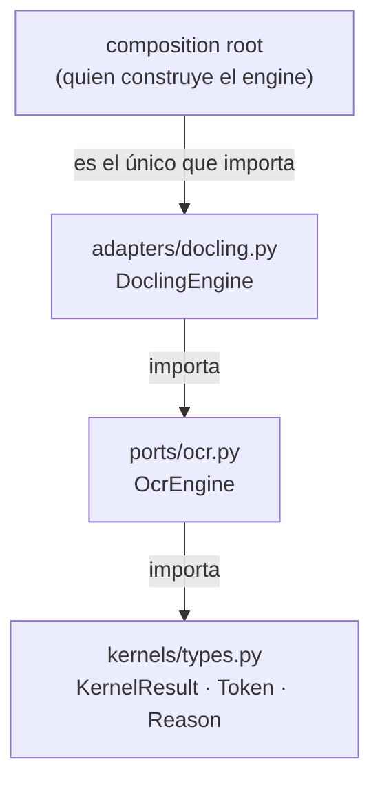

Read 

Read memory 

Searched for files matching `**/src/docflow/ports/**`, 7 matches

Searched for files matching `**/src/docflow/adapters/**`, 3 matches

Read , lines 1 to 140

Read , lines 1 to 80

Read , lines 1 to 110

Read , lines 1 to 70

Read 

Read 

Searched for regex `composition root|DoclingEngine|PdfSource|ArtifactStore` (`**/src/docflow/**`), 24 results

Read , lines 1 to 60

Searched for regex `from docflow\.(ports|adapters) import|import docflow\.(ports|adapters)`, 22 results

Read , lines 1 to 75

Searched for regex `register|adapters|ports|kernels` (`**/src/docflow/kernel_cli/**`), 43 results

Searched for regex `^from|^import` (`**/src/docflow/kernels/pdf.py`), 12 results

He leído el quickstart y el código que ese documento describe. Aquí va la explicación, anclada a los archivos reales.

## En una frase

En K4, el **kernel** es la *capacidad* (`ocr`, con clase de determinismo `sampled` y slot `gpu`), el **puerto** es el *contrato* que un llamador puede usar sin tocar Docling (`OcrEngine`), y el **adapter** es la *implementación* que traduce Docling a ese contrato (`DoclingEngine`).

## Los tres roles, con sus archivos

| Rol | Dónde vive | Qué es |
|---|---|---|
| Kernel K4 `ocr` | no tiene archivo propio | Una fila en el inventario (`sad.md` §3): capacidad + clase de determinismo + recurso. Es **qué** se puede hacer, no dónde está el código. |
| Puerto `OcrEngine` | `ocr.py` | La interfaz (`Protocol`): `capabilities`, `engine_info`, `read`. Más los tipos de apoyo `ReadResult` y `PageStatus`. |
| Adapter `DoclingEngine` | `docling.py` | La implementación concreta detrás del puerto. Aquí sí aparece Docling. |

Por eso el quickstart dice que K4 ocupa «dos archivos en lugar de `kernels/`»: la capacidad no tiene carpeta, la tiene su frontera.

## La flecha de dependencia (esto *es* la arquitectura)



Regla: **un adapter puede importar un puerto; un puerto nunca importa un adapter.** El puerto importa los tipos de frontera congelados por `E01-01`. Nada importa un adapter salvo el composition root.

Esto no es prosa: está verificado estáticamente en `_typing.py` (`is_adapter_import`) y testeado en `test_port_isolation.py`, que ni siquiera importa `docflow.ports` — carga el predicado desde el archivo para que un mutante que rompa el paquete no haga pasar el test «en verde por la razón equivocada».

## Cómo se usa — tal cual el quickstart

```python
from docflow.adapters.docling import DoclingEngine   # el adapter
from docflow.ports import OcrEngine, PageStatus      # el contrato

engine = DoclingEngine()
isinstance(engine, OcrEngine)      # True
```

Las dos importaciones juntas son el punto: **se construye el adapter, se usa a través del puerto**. El `isinstance` funciona porque `OcrEngine` es `@runtime_checkable`. A partir de ahí, todo el resto del quickstart (`capabilities`, `engine_info`, `read`) es llamada sobre el puerto, y el documento no vuelve a nombrar Docling más que para explicar diferencias de comportamiento.

La superficie completa son **tres operaciones**, todas devolviendo `KernelResult`:

| Operación | Pregunta que responde | Rol en el diseño |
|---|---|---|
| `capabilities` | ¿Qué puede hacer el engine? | Documentación (incluye `reports_confidence: False`) |
| `engine_info` | ¿Qué revisión respondió? | **Contrato**: alimenta la cache key (`sad.md` §5) |
| `read` | Dame el texto de estas páginas, con posiciones | El trabajo |

## Qué decide cada capa — y qué tiene prohibido

| | Kernel | Puerto | Adapter |
|---|---|---|---|
| Reporta mediciones | — | sí | sí |
| Elige motor | no | **no** (nunca, `ADR-001`) | implementa el único posible |
| Decide routing / umbral | no | **no** | no |
| Interpreta orden de lectura | no | **no** (lo dropea) | no — `S2-T07` lo posee |
| Traduce detalles del vendor | — | — | **sí** |

El adapter es el único lugar donde existe Docling, y por tanto el único lugar donde se resuelven: el origen *bottom-left* que hay que voltear, la escala `dpi / 72`, la granularidad `block` (no palabra), la ausencia total de `confidence` (que sale `None`, nunca `1.0`), y los fallos de librería que se convierten en `Reason` tipado (`engine_unavailable`, `unsupported_format`) en vez de un traceback.

El puerto declara `PageStatus.UNREADABLE` aunque este adapter **nunca lo produzca** — y eso también es diseño: el puerto debe poder expresar los tres estados (`read` / `blank` / `unreadable`), aunque el motor concreto sólo distinga dos. Si `read` es «leí la página y no había nada» y `blank` es «no había nada», colapsarlos es exactamente cómo una página blanca vuelve con texto inventado.

## Sobre el argumento `engine=` del constructor

El quickstart es explícito y merece repetirse: `DoclingEngine(engine=...)` **no es un ajuste**. Es una inyección de converter para que los tests ejerciten la frontera sin descargar modelos. «No hay `engine` parameter, ni variable de entorno, ni flag `--engine`» — un motor por corpus convertiría el camino OCR en una matriz de comportamientos.

## Por qué K2/K3 sí viven en `kernels/`

`kernels` contiene `pdf.py`, `image.py`, `store.py`, `registry.py`, `types.py`, `cache_key.py`. K4, K5 y K6 viven en `adapters/` porque **detrás hay un vendor**: un binario Poppler, una instalación Docling, un runtime de modelos, un SDK de proveedor.

- K2 `pdf` está en `kernels/pdf.py` aunque `PdfSource` exista como puerto: su kernel no depende de que el motor sea intercambiable.
- K3 `image` **no tiene puerto en absoluto**, y es deliberado (`ports/__init__.py` lo documenta): una librería raster no es un vendor detrás de una frontera intercambiable.
- K7 y K8 ocupan un puerto cada uno porque *son* la capacidad, no un wrapper sobre un vendor.

## Resumen operativo

- Si escribes código **arriba** de Stage 1 → importa `docflow.ports`, nunca `docflow.adapters`.
- Si escribes el **composition root** (o un test) → importas `DoclingEngine`, lo tratas como `OcrEngine`, y de ahí en adelante no vuelves a mencionarlo.
- Si escribes el adapter → resuelves la traducción del vendor, dropeas lo que el puerto no contrata, y conviertes todo fallo en un `Reason` tipado.

¿Quieres que profundice en alguno de los tres — por ejemplo el contrato completo de `read` (incluyendo los tres `ValueError` de petición mal formada) o cómo el `engine_info` entra en la cache key?