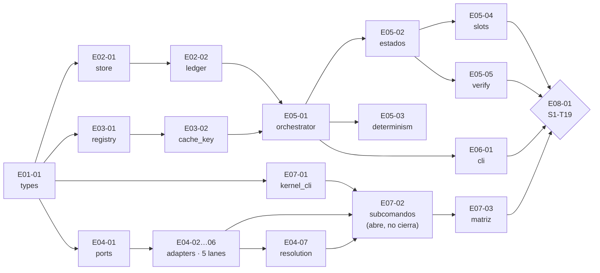

Voy a revisar el README de issues de plan-01 y las epics para analizar dependencias.

Read 

Read , lines 1 to 200

Read memory 

Read memory 

Ahora reviso las dependencias intra-epic en los archivos de epic.

Searched for text `Depends on` (`**/docs/plans/issues/plan-01-kernels/**`), 62 results

Searched for regex ``^## 2\.|^### \*\*`E0|^\| \*\*`E0`` (`**/docs/plans/issues/plan-01-kernels/**`), 1 result

Read , lines 24 to 48

Read , lines 24 to 60

Read , lines 24 to 58

Read , lines 24 to 52

Searched for regex `6\.2|Critical path|parallel harness|Serial spine|spine` (`**/docs/artifacts/wbs.md`), 10 results

Read , lines 1 to 120

## Análisis de paralelización — Plan 1 (Kernels), 22 issues / 8 epics

### Criterio usado

La **wave** dice qué issues tienen su conjunto de dependencias ya terminal (paralelizables "en grafo"), pero eso **no basta** para paralelizar de verdad. Hay dos restricciones adicionales que el README de issues no aplica explícitamente pero que están en las rutas de entregable:

1. **Conflicto de archivo** — dos issues que escriben el mismo `.py` no son paralelos aunque estén en la misma wave.
2. **Cuello de artefacto compartido** — un issue del que dependen N lanes posteriores serializa toda la wave siguiente si se retrasa.

---

### 1. Paralelismo por wave (grafo + archivos)

| Wave | Issues | Lanes paralelas reales | Conflicto de archivo detectado |
|---|---:|---:|---|
| **W1** | `E01-01` | **1** | — (nada puede empezar antes) |
| **W2** | `E02-01`, `E03-01`, `E04-01`, `E07-01` | **4** | ninguno — `store.py` · `registry.py` · `ports/` · `kernel_cli/__init__.py`+`main.py` |
| **W3** | `E02-02`, `E03-02`, `E04-02`, `E04-03`, `E04-04`, `E04-05`, `E04-06` | **7** ← **pico** | ninguno — `store.py` (T02 ya cerrado) · `cache_key.py` · `pdf.py` · `image.py` · `ports/ocr.py`+`adapters/docling.py` · `ollama.py` · `frontier.py` |
| **W4** | `E05-01`, `E04-07` | **2** | ninguno — `orchestrator.py` vs `resolution.py` |
| **W5** | `E05-02`, `E05-03`, `E06-01`, `E07-02` | **4** | ninguno — `orchestrator.py` · `determinism.py` · `cli.py` · `kernel_cli/*.py` |
| **W6** | `E05-04`, `E05-05`, `E07-03` | **2** (no 3) | ⚠ `E05-04` y `E05-05` escriben **ambos** `docflow/kernels/orchestrator.py` (cont.) → **serializados entre sí** |
| **W7** | `E08-01` | **1** | — (el gate) |

**Capacidad máxima del plan: 7 lanes simultáneas (W3).** Máximo sostenido razonable: **3–4** (el resto de waves dan 4/2/4/2).

---

### 2. La restricción real no es el grafo: es `orchestrator.py`

`docflow/kernels/orchestrator.py` es tocado por **cuatro** issues en waves distintas:

```
E05-01 (W4) → E05-02 (W5) → E05-04 (W6)
                          ↘ E05-05 (W6)   ← mismo archivo, se serializan
```

Eso es correcto por diseño (`(cont.)` en el deliverable), pero implica que **E05 es una cola de 4 escritores sobre un solo archivo**, no un epic de 5 lanes. Contribuye, junto con `store.py` (`T02→T03`), a que el epic E05 sea el más serializado del plan.

Otros archivos multi-issue, todos ya serializados por dependencia explícita (no añaden restricción nueva):
- `store.py`: `E02-01` → `E02-02`
- `ports/`: `E04-01` → `E04-04`
- `kernel_cli/`: `E07-01` → `E07-02`

---

### 3. Cuellos de botella de paralelización (dónde se rompe)

| Artefacto | Issues que desbloquea | Efecto si se retrasa |
|---|---|---|
| **`E01-01`** (`types.py`) | 4 (toda W2) | El plan entero se para — es raíz |
| **`E04-01`** (ports) | 5 (`E04-02`…`E04-06`) | Las 7 lanes de W3 se quedan en 2 |
| **`E05-01`** (`T06`, orchestrator core) | 4 (`E05-02/03`, `E06-01`, `E07-02`) | W5 no abre; toda la mitad alta del plan espera |
| **`E07-03`** (`T22`, matriz) | 1, pero **hard predecessor de `E08-01`** | El gate no cierra aunque todo lo demás esté verde |

---

### 4. Dos cadenas que corren en paralelo y convergen en el gate



- **Cadena serial (kernel spine):** `T01→T02→T03→T04→T05→T06→T07→T09→T18→T19` — 9 enlaces.
- **Cadena harness:** `T20→T21→T22` — 3 enlaces, arranca en W2 y **no alarga** el camino crítico, pero no puede cerrar antes del gate.

---

### 5. Oportunidades y riesgos de paralelizar

**Aprovechables**
- **W3 es el pico (7 lanes)** y todas cuelgan solo de `E04-01` + `E02-01` + `E03-01`. Si esos tres cierran temprano, W3 admite hasta 7 ejecutores sin tocar el mismo archivo.
- **`E07-02` (`T21`) conviene abrirlo antes de su wave.** Es un issue de *completado parcial*: **abre** cuando aterriza `E07-01` (fin de W2) y **crece** a medida que llegan `E04-02`…`E04-07`. Tratarlo como tarea de W5 desperdicia una lane larga y barata de solapar.
- `E04` (K2–K6) está **fuera del camino crítico** (`wbs.md` §6.2: `T11`, `T12`, `T13`, `T16` pueden deslizarse sin retrasar el cierre *de etapa*), pero **está incondicionalmente requerido por el brazo que sí converge al gate** (`T21→T22→T19`). Es decir: se puede posponer, pero no cancelar.

**Riesgos de paralelizar agresivamente** — el propio plan los nombra (`plan-01-kernels.md` §9, citado en `epic-07-k1...` §2):
1. Abrir `E07-02` **antes** de que los adapters de E04 sean terminales → el contract test pasa **vacuamente**.
2. Cerrar `E08-01` **antes** de `E07-03` → la matriz de 17 filas queda en prosa.

---

### 6. Conclusión operativa

- **No paralelizar:** nada dentro de `E05` (4 escritores sobre `orchestrator.py`), ni `E02-01`/`E02-02`, ni `E04-01`/`E04-04`, ni `E07-01`/`E07-02`.
- **Paralelizar siempre:** W2 (4 lanes), W3 (7 lanes), W4 (2), W5 (4). Ese es el núcleo real de concurrencia del plan.
- **W6 admite 2 lanes, no 3** — `E05-04` y `E05-05` comparten archivo.
- **Capacidad práctica recomendada: 4 ejecutores.** Con 4 se cubren todas las waves sin ocios, salvo W3 (7) que dejaría 3 en cola; con 7 se exprime W3 pero se sobre-aprovisiona el resto (W1/W4/W6/W7 dan 1–2).
- **Secuencia de arranque óptima:** `E01-01` → {`E02-01`, `E03-01`, `E04-01`, `E07-01`} → {7 de W3} y, **en cuanto cierre `E07-01`, abrir `E07-02` como lane larga** aunque su wave nominal sea W5.

¿Quieres que derive de esto un orden de asignación concreto (ej. para N desarrolladores o para agentes en paralelo), o que lo registre en `README.md` como sección de concurrencia?