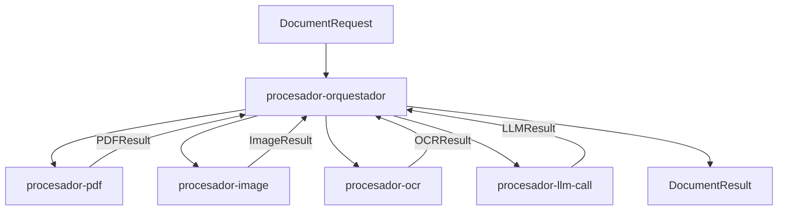
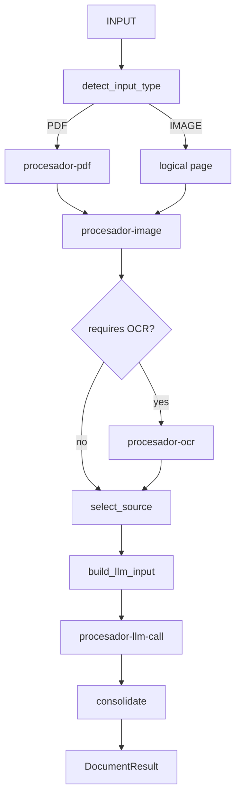

# docflow — General Implementation Plan

> Status: **proposed**. This is the *general* execution plan for the document-processing
> pipeline described in `docs/idea/`. It is deliberately high-altitude: it fixes phases,
> modules, contracts and acceptance criteria, and leaves task-level decomposition (WBS,
> per-task issues) to later plan documents.
>
> Source of truth for *what to build*: `docs/idea/readme.md` + the five
> `procesador-*.md` files. Where this plan and the idea disagree, this plan must be
> reconciled back to the idea.

## Subplans

One subplan per processor, each following the same section structure (Objective /
Context (BA) / Design (SA) / Execution plan (PM) / Acceptance criteria / Test plan /
DoR-DoD / Risks / Out of scope & resolved decisions):

| Subplan | Processor / component | Phase |
|---|---|---|
| [`subplan-procesador-pdf.md`](subplan-procesador-pdf.md) | `procesador-pdf` | 1 |
| [`subplan-procesador-image.md`](subplan-procesador-image.md) | `procesador-image` | 1 |
| [`subplan-procesador-ocr.md`](subplan-procesador-ocr.md) | `procesador-ocr` | 1 |
| [`subplan-procesador-llm-call.md`](subplan-procesador-llm-call.md) | `procesador-llm-call` | 1 |
| [`subplan-orquestador.md`](subplan-orquestador.md) | `procesador-orquestador` | 2 |

---

## 1. Objective

Implement a **modular pipeline** that processes PDF and image documents by composing five
single-responsibility processors under one orchestrator:

```
INPUT → ORCHESTRATOR → PDF/IMAGE → IMAGE PREP → OCR (when applicable)
      → SOURCE SELECTION → LLM/VLM → VALIDATION → RESULT
```

The deliverable is a working end-to-end loop with three hard properties, taken verbatim
from the idea:

1. **Each processor has a single responsibility** and returns one result.
2. **Only the orchestrator knows the whole workflow.**
3. **Valid, expensive work is never repeated needlessly.**

This plan covers the *happy path* first (PoC posture): hardcode/mock/in-memory where it
closes the loop faster, tag every shortcut with `# TODO: [MVP]` (real DB/API/validation)
or `# TODO: [RELEASE]` (telemetry/caching/HA/security).

---

## 2. Scope

### In scope (this plan)

| Component | Responsibility (from `docs/idea/`) |
|---|---|
| `procesador-pdf` | Inspect, split and extract native PDF artifacts (pages, render, native text, embedded images, metrics, classification). |
| `procesador-image` | Analyse, normalize and prepare images; produce `normalized` / `ocr_ready` / `vlm_ready` variants. |
| `procesador-ocr` | Extract structured text/layout from a prepared image (Docling as the OCR engine). |
| `procesador-llm-call` | Prepare, execute, validate and persist LLM/VLM inference (single call or an internal inference graph). |
| `procesador-orquestador` | Coordinate the workflow, persist state, decide skip/reuse/force/resume, consolidate pages and document. |

### Out of scope (first iteration)

- Multi-document corpus batching and distributed execution.
- A labelled golden set (deferred; see §8 risks).
- Real retry queues and GPU-competition policy.
- Domain-specific extraction rules (invoice fields, verdicts) — the pipeline is generic;
  the prompt/schema assets are data, not code.

---

## 3. Architecture

### 3.1 Component view



The arrows in one direction are **requests**, in the other **results**. A processor never
calls another processor; the orchestrator is the only component that composes them.

### 3.2 Document workflow



Two workflow levels exist and **must not mix**:

- **Documental** (owned by the orchestrator): `PDF → IMAGE → OCR → SOURCE SELECTION → LLM`.
- **Inference** (owned *inside* `procesador-llm-call`): `classify → extract_a/extract_b → compare → validate → consolidate`.

---

## 4. Proposed package layout

`docs/idea/readme.md` §"Estructura del proyecto" fixes the layout: a `processors/` tree
with one sub-package per processor, each holding `primitives`, `utils` and `helpers`, plus
a `workflow/` sub-package that is the orchestrator. The same document's §"Naming" fixes
the entry-point names. Both are adopted verbatim:

```
processors/
├── pdf/                 # procesador-pdf
│   ├── primitives/      # low-level PDF ops (Poppler encapsulated here)
│   ├── utils/
│   └── helpers/
├── image/               # procesador-image
│   ├── primitives/      # low-level image ops (OpenCV / Pillow encapsulated here)
│   ├── utils/
│   └── helpers/
├── ocr/                 # procesador-ocr
│   ├── primitives/      # low-level Docling ops (the only OCR engine)
│   ├── utils/
│   └── helpers/
├── llm/                 # procesador-llm-call
│   ├── primitives/      # low-level provider ops (Ollama / vLLM / API)
│   ├── utils/
│   └── helpers/
└── workflow/            # procesador-orquestador — the only workflow-aware component
    ├── process_document()
    ├── process_page()
    ├── resolve_stage()
    ├── select_source()
    ├── select_extraction_strategy()
    ├── build_llm_input()
    ├── invalidate_downstream()
    ├── resume_document()
    └── execute_document_workflow()
```

Entry-point names (from the idea, `readme.md` §"Naming"):

```text
process_document()  process_page()        → workflow/  (orchestrator; reserved global names)
process_pdf()       process_pdf_page()    → pdf/
process_image()     process_image_from_page() → image/
process_ocr_image()                       → ocr/
process_llm_request()  process_llm_node() → llm/
```

There is no separate `ports/` / `adapters/` layer in the idea: engines are replaceable
*implementations* behind each processor's public contract (`Request → Processor → Result`),
encapsulated inside that processor's `primitives/`. Swapping an engine (Poppler ↔ another
PDF reader, OpenCV ↔ Pillow, Ollama ↔ vLLM ↔ a hosted API) never changes the contract or
the workflow.

**Contract discipline** (from the idea, `readme.md` §"Contratos entre módulos"):

```text
PDFRequest → procesador-pdf → PDFResult
ImageRequest → procesador-image → ImageResult
OCRRequest → procesador-ocr → OCRResult
LLMInput → procesador-llm-call → LLMResult
DocumentRequest → procesador-orquestador → DocumentResult
```

Each processor writes only inside its own artifact namespace:

```text
PDF   → source/ render/ native_text/ embedded_images/
IMAGE → image/
OCR   → ocr/
LLM   → llm/
```

Inputs are immutable; outputs are published atomically (`.tmp` → validate → `rename`).

---

## 5. Implementation phases

Each phase has entry conditions, deliverables and an exit criterion. Phases run in order;
within a phase, independent processors may proceed in parallel.

### Phase 0 — Foundations: contracts and skeleton

**Entry:** none.

**Deliverables**

- Package skeleton under `processors/` — five sub-packages (`pdf/`, `image/`, `ocr/`,
  `llm/`, `workflow/`), each with `primitives/`, `utils/`, `helpers/`, and the entry-point
  signatures fixed by the idea's §"Naming".
- The Request/Result contract types, one per processor, as typed dataclasses with no
  defaults on required fields:

  | Request | Result |
  |---|---|
  | `PDFRequest` | `PDFResult` + `PDFPageResult` |
  | `ImageRequest` | `ImageResult` |
  | `OCRRequest` | `OCRResult` |
  | `LLMInput` | `LLMResult` + `LLMNodeResult` |
  | `DocumentRequest` | `DocumentResult` |

- The stage-state vocabulary (`NOT_STARTED`, `READY`, `RUNNING`, `SUCCESS`, `FAILED`,
  `SKIPPED`, `REUSED`, `INVALIDATED`, `PAUSED`, …) and the three identities:
  `document_id`, `workflow_run_id`, `processing_key`.
- Tooling: `pyproject.toml` as the single config home for `pytest`, `ruff`, `pylint`,
  `coverage`.

**Exit:** skeleton imports cleanly; one happy-path test per contract round-trips an
in-memory fake end to end; the four QA gates (§7) pass on the skeleton.

---

### Phase 1 — Processors, independently (parallel)

**Entry:** Phase 0 exit met.

**Deliverables** — each processor implemented in isolation behind its own contract, with
its primitives (no workflow decisions inside any of them):

- `procesador-pdf` — split pages, render, extract native text/blocks/images, per-page
  metrics and `TEXT`/`IMAGE`/`MIXED` classification. Engine: **Poppler**, encapsulated in
  `pdf/primitives/`.
- `procesador-image` — load, analyse (dimensions, blur, sharpness, orientation, skew,
  contrast, text coverage), normalize, prepare `ocr_ready`/`vlm_ready` variants.
  Engine: **OpenCV / Pillow**, encapsulated in `image/primitives/`.
- `procesador-ocr` — **Docling** (the only OCR engine), encapsulated in `ocr/primitives/`:
  text, markdown, JSON, tables, layout, reading order; stable intermediate representation;
  deterministic output ordering.
- `procesador-llm-call` — `process_llm_request` for one call: template render, prompt
  build, `request_key`, provider call, parse, schema validation; the internal graph is a
  follow-up inside this same phase.

**Exit:** each processor has a green happy-path test proving `Request → Result` with real
bytes from a small committed fixture; no processor imports another processor's module;
four QA gates pass.

---

### Phase 2 — Orchestrator: state, reuse, resume

**Entry:** Phase 1 exit met.

**Deliverables**

- `detect_input_type`, `build_execution_plan`, per-stage resolution
  (`EXECUTE` / `REUSE` / `SKIP` / `FORCE` / `WAIT` / `BLOCKED`).
- `processing_key = hash(processor + version + input hashes + normalized options)` and
  the reuse rule: same key + `SUCCESS` + valid artifacts → `REUSE`.
- Durable state: `DocumentContext`, `PageContext`, `StageExecution`; per-page units as
  the self-contained unit of parallelism/recovery.
- `skip` / `force` (with downstream invalidation) / `stop` / `resume` / dry-run.
- Ownership enforcement: each stage writes only its namespace; atomic persistence.

**Exit:** a run interrupted mid-pipeline resumes without re-running completed stages
(proved by a test that observes stage states after a resume); forcing a stage invalidates
its downstream dependents; four QA gates pass.

---

### Phase 3 — Integration: source selection and end-to-end result

**Entry:** Phase 2 exit met.

**Deliverables**

- `select_source()` across `NATIVE_TEXT`, `OCR_TEXT`, `IMAGE`, and their combinations,
  driven by the orchestrator (never by a processor).
- `build_llm_input()` composition and `consolidate_page` / `consolidate_document`.
- End-to-end run: a real PDF and a real image each produce a `DocumentResult` through the
  full flow, with the orchestrator as the only component calling processors.

**Exit:** one end-to-end happy-path test per input type (PDF with native text; scanned
image → OCR → LLM) produces a `DocumentResult`; four QA gates pass.

---

### Phase 4 — Hardening

**Entry:** Phase 3 exit met.

**Deliverables**

- Idempotency at both levels (documental + inference subgraph).
- Determinism classes per processor (deterministic / sampled / external) and resume
  decisions based on them.
- Error containment: a failed stage is reported, not propagated as an exception where a
  typed result is the contract.
- Atomic persistence everywhere an artifact is published.
- Full four-gate hygiene and a mutation-falsified invariant test for each non-obvious
  guarantee (see §7).

**Exit:** all phases' acceptance evidence re-run green; every shortcut carries an explicit
`# TODO: [MVP]` / `# TODO: [RELEASE]` tag.

---

## 6. Task dependency map (summary)


Within Phase 1 the four processors are independent and parallel; the orchestrator (Phase
2) depends on all of them only through their contracts, not their internals.

---

## 7. Quality gates and Definition of Done

### The four QA gates (all must pass before a task is `done`)

```bash
pytest                  # tests green (processors/ on the path via pyproject)
ruff check .            # linter, includes import order
ruff format --check .   # formatter
pylint src tests        # fixme disabled; the rest clean
```

### Rules carried into implementation

- Sorted imports (stdlib → third-party → local). No unused imports. Type hints on all
  signatures. Google-style docstrings. English identifiers, docstrings and comments.
- `ruff format` owns line length; `E501` is ignored.
- A test that guards an invariant **must fail when the invariant is broken** — prove it by
  mutating the source, observing the failure, then restoring green; report both
  observations.
- No silent stand-in (no empty string, `0`, `[]`, or default model/engine/threshold used
  in place of a real answer).
- No domain noun (invoice, field, verdict, pipeline code) in a processor API.
- A concrete engine/library is reached only from a processor's own `primitives/` — never
  from the orchestrator and never across processors.

---

## 8. Risks and mitigations

| Risk | Impact | Mitigation |
|---|---|---|
| Engine/library drift (Poppler, Docling, Pillow, Ollama versions) | Silent output differences | Pin versions; record engine + version in every artifact's metadata; deterministic output ordering. |
| Repeating expensive LLM/OCR work | Cost, latency | `processing_key` + reuse rule owned by the orchestrator; resume without re-running. |
| Silent failures (truncated prompt, plausible wrong value) | Wrong result reported as correct | Validation is structural and mandatory; a processor reports, never guesses; no aggregate confidence in place of per-field evidence. |
| Golden set unavailable (circular labelling) | Cannot prove extraction quality | Defer the labelled set; substitute invariant/mutation tests and independent-reader checks (e.g. arithmetic on line items). |
| Scope creep into a full ETL platform | Over-engineering in PoC | Happy path only; tag shortcuts; revisit at MVP/Release gates. |

---

## 9. Resolved decisions

Each was open; each is now **resolved from `docs/idea/`** (the source of truth).

1. **Naming / layer mapping — RESOLVED.** The layout is the idea's `readme.md`
   §"Estructura del proyecto": `processors/{pdf,image,ocr,llm,workflow}`. The orchestrator
   is `workflow/`. There is no `kernels` / `ports` / `adapters` layer.
2. **Package vs. flat modules — RESOLVED.** Each processor is a **sub-package** with
   `primitives/`, `utils/`, `helpers/`, exactly as the idea lists it.
3. **Concrete engines — RESOLVED** by the idea's §"Implementaciones reemplazables":
   PDF → **Poppler**; Image → **OpenCV / Pillow**; OCR → **Docling** (only); LLM →
   **Ollama / vLLM / API**. The first implementation uses one engine per contract; each is
   swappable behind `Request → Processor → Result` without touching the contract.
4. **Language / naming — RESOLVED.** Directories, modules and entry points use the English
   names the idea itself uses (`processors/…`, `process_document`, `process_pdf`, …). The
   Spanish `procesador-*` names remain only as titles of the `docs/idea/` documents.
