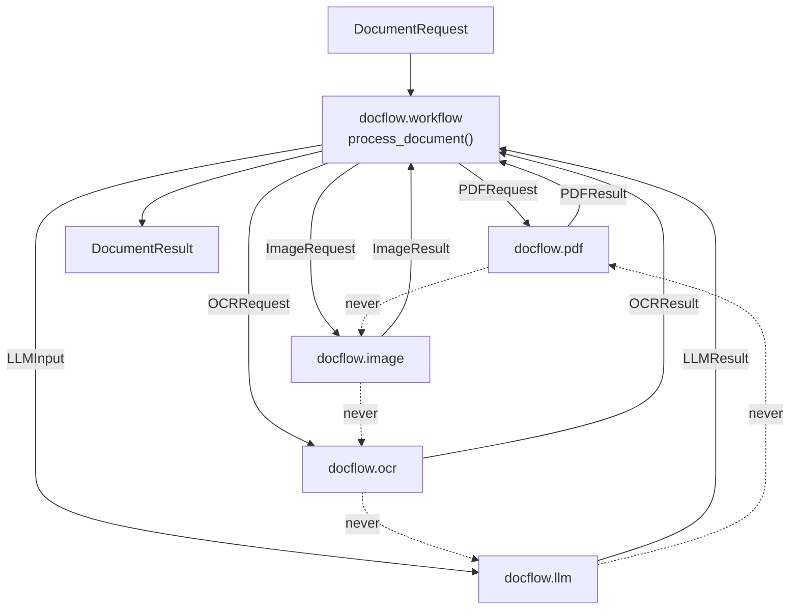

# WBS — docflow (general plan)

> Status: **proposed**. Programme-level work breakdown structure: it keeps only the
> **transversal** work (Phases 0, 3, 4 and the close-out of the whole) and delegates every
> processor-level task to the five sibling WBS files.
>
> Sources (read-only, not modified): [`../README.md`](../README.md) §1–§9, and the
> `### WBS` tables of
> [`../subplan-procesador-pdf.md`](../subplan-procesador-pdf.md),
> [`../subplan-procesador-image.md`](../subplan-procesador-image.md),
> [`../subplan-procesador-ocr.md`](../subplan-procesador-ocr.md),
> [`../subplan-procesador-llm-call.md`](../subplan-procesador-llm-call.md),
> [`../subplan-orquestador.md`](../subplan-orquestador.md),
> plus [`.github/copilot-instructions.md`](../../../.github/copilot-instructions.md) for the
> four QA gates.

---

## 1. Summary

| Phase | Name | Own IDs | Child IDs | Tasks | S / M / L | Exit criterion (verbatim, `README.md` §5) |
|---|---|---|---|---|---|---|
| 0 | Foundations: contracts and skeleton | `GEN-01`…`GEN-06` | — | 6 | 3 / 3 / 0 | skeleton imports cleanly; one happy-path test per contract round-trips an in-memory fake end to end; the four QA gates (§7) pass on the skeleton |
| 1 | Processors, independently (parallel) | — | `PDF-01`…`PDF-14`, `IMG-01`…`IMG-15`, `OCR-01`…`OCR-14`, `LLM-01`…`LLM-15` | 58 | 22 / 32 / 4 | each processor has a green happy-path test proving `Request → Result` with real bytes from a small committed fixture, with no engine installed; no processor imports another processor's module; four QA gates pass |
| 2 | Orchestrator: state, reuse, resume | — | `ORC-01`…`ORC-19` | 19 | 3 / 13 / 3 | a run interrupted mid-pipeline resumes without re-running completed stages (proved by a test that observes stage states after a resume); forcing a stage invalidates its downstream dependents; four QA gates pass |
| 3 | Integration: source selection and end-to-end result | `GEN-07`…`GEN-10` | `ORC-12`, `ORC-13`, `ORC-17` (implementation owners, already counted in Phase 2) | 4 | 0 / 3 / 1 | one end-to-end happy-path test per input type (PDF with native text; scanned image → OCR → LLM) produces a `DocumentResult`; four QA gates pass |
| 4 | Hardening + programme close-out | `GEN-11`…`GEN-22` | `PDF-11`, `PDF-12`, `PDF-14`, `IMG-13`, `IMG-14`, `IMG-15`, `OCR-12`, `OCR-13`, `OCR-14`, `LLM-13`, `ORC-19` | 12 | 6 / 4 / 2 | all phases' acceptance evidence re-run green; every shortcut carries an explicit `# TODO: [MVP]` / `# TODO: [RELEASE]` tag |
| **Total** | | **22** | **77** | **99** | **34 / 55 / 10** | |

**Scope.** This document owns the work that belongs to no single processor: the shared
skeleton and contract types (Phase 0), the cross-processor integration layer that turns four
independent processors into one `DocumentResult` (Phase 3), the programme-wide hardening
guarantees (Phase 4), and the close-out verification that the two architectural frontiers
still hold. Processor-internal decomposition is **not** repeated here: it lives in
[`wbs-procesador-pdf.md`](wbs-procesador-pdf.md),
[`wbs-procesador-image.md`](wbs-procesador-image.md),
[`wbs-procesador-ocr.md`](wbs-procesador-ocr.md),
[`wbs-procesador-llm-call.md`](wbs-procesador-llm-call.md) and
[`wbs-orquestador.md`](wbs-orquestador.md). Every `GEN-xx` traces to `README.md` §5, §7, §8
or §9; nothing is invented.

---

## 2. Program-level task index

Cross-cutting issues only. IDs are `GEN-xx`; own range is `GEN-01`…`GEN-22`.

### Phase 0 — Foundations (Wave 0.1–0.3)

#### GEN-01 — Package skeleton under `src/docflow/`

- **Type:** scaffolding
- **Effort:** M
- **Phase:** 0 · **Wave:** 0.1
- **Depends on:** — · **Blocks:** `GEN-02`…`GEN-06`, `PDF-01`, `IMG-01`, `OCR-01`, `LLM-01`, `ORC-01`
- **Objective:** Create the five sub-packages that make the import name `docflow` real, with the internal shape fixed by the idea (`primitives/`, `utils/`, `helpers/` per processor).
- **Scope / Deliverables:** `src/docflow/__init__.py`; `src/docflow/pdf/{__init__.py,primitives/,utils/,helpers/}`; `src/docflow/image/{…}`; `src/docflow/ocr/{…}`; `src/docflow/llm/{…}`; `src/docflow/workflow/`; the entry-point stubs `docflow.pdf.process_pdf`, `docflow.pdf.process_pdf_page`, `docflow.image.process_image`, `docflow.image.process_image_from_page`, `docflow.ocr.process_ocr_image`, `docflow.llm.process_llm_request`, `docflow.llm.process_llm_node`, `docflow.workflow.process_document`, `docflow.workflow.process_page`; `tests/` mirroring the same tree.
- **Out of bounds:** No processor logic, no engine import, no `ports/` / `adapters/` / `kernels/` layer (`README.md` §9.1). Never an `src.docflow` import path.
- **Evidence / DoD:** `import docflow.pdf, docflow.image, docflow.ocr, docflow.llm, docflow.workflow` succeeds from a clean interpreter; every listed entry point exists as a typed signature; `tests/` mirrors `src/docflow/`.
- **Tags:** `# TODO: [MVP]` on every stub body that returns a placeholder.

```gherkin
Scenario: Skeleton imports without side effects
  Given a clean interpreter with src/ on the path
  When the five sub-packages of docflow are imported
  Then no engine library is imported
  And each documented entry-point name is resolvable
```

#### GEN-02 — Contract types, one per processor

- **Type:** contract
- **Effort:** M
- **Phase:** 0 · **Wave:** 0.2
- **Depends on:** `GEN-01` · **Blocks:** `GEN-03`, `GEN-04`, `GEN-06`, `PDF-01`, `IMG-01`, `OCR-01`, `LLM-01`, `ORC-01`, `GEN-07`, `GEN-08`
- **Objective:** Fix the five `Request → Processor → Result` contracts as typed dataclasses so that four processors can be built in parallel against a frozen seam.
- **Scope / Deliverables:** the five contract pairs of `README.md` §5 Phase 0: `PDFRequest`/`PDFResult` (+ `PDFPageResult`), `ImageRequest`/`ImageResult`, `OCRRequest`/`OCRResult`, `LLMInput`/`LLMResult` (+ `LLMNodeResult`), `DocumentRequest`/`DocumentResult`. No defaults on required fields.
- **Out of bounds:** No per-processor detail types (`PDFPageMetrics`, `ImageOptions`, `OCRMetrics`, `LLMGraphState`, `StageExecution`) — those belong to `PDF-01`, `IMG-01`, `OCR-01`, `LLM-01`, `ORC-01`. No domain noun in any contract field name.
- **Evidence / DoD:** all ten types import; instantiating each without its required fields raises; a contract-conformance test asserts every field is type-hinted.
- **Tags:** —

```gherkin
Scenario: Required fields have no silent default
  Given the contract dataclasses of the five processors
  When a PDFRequest is constructed with a missing required field
  Then construction fails instead of substituting an empty value
```

#### GEN-03 — Stage-state vocabulary

- **Type:** contract
- **Effort:** S
- **Phase:** 0 · **Wave:** 0.2
- **Depends on:** `GEN-02` · **Blocks:** `ORC-04`, `ORC-07`, `ORC-08`, `LLM-10`, `GEN-11`
- **Objective:** Publish one shared stage-state vocabulary so orchestrator, processors and the LLM subgraph all report state with the same words.
- **Scope / Deliverables:** the enum values `NOT_STARTED`, `READY`, `RUNNING`, `SUCCESS`, `FAILED`, `SKIPPED`, `REUSED`, `INVALIDATED`, `PAUSED` in `src/docflow/workflow/`, importable by every processor without importing the orchestrator.
- **Out of bounds:** Decision logic that consumes the states (`ORC-07`); any new state not listed in `README.md` §5 Phase 0.
- **Evidence / DoD:** the vocabulary is importable from a non-workflow module; a test asserts the nine documented members exist and that no member is a silent alias of another.
- **Tags:** —

```gherkin
Scenario: Processors report the shared vocabulary
  Given a processor module that must report a stage state
  When it imports the stage-state enum
  Then it does not import docflow.workflow's decision logic
```

#### GEN-04 — The three identities

- **Type:** contract
- **Effort:** S
- **Phase:** 0 · **Wave:** 0.2
- **Depends on:** `GEN-02` · **Blocks:** `ORC-02`, `ORC-03`, `LLM-05`, `GEN-11`, `GEN-14`
- **Objective:** Fix the three identity names that make reuse, resume and idempotency expressible: `document_id`, `workflow_run_id`, `processing_key`.
- **Scope / Deliverables:** the three identity fields on `DocumentRequest`/`DocumentResult` and on the artifact `metadata.json` skeleton; the documented definition of `processing_key = hash(processor + version + input hashes + normalized options)` (`README.md` §5 Phase 2) as the single placeholder consumed by `ORC-02` and `LLM-05`.
- **Out of bounds:** The hashing implementation is `ORC-02`; the LLM-node request key is `LLM-05`. No engine version string is baked in here.
- **Evidence / DoD:** all three names appear in the contract types and in the `metadata.json` key set; a test asserts `processing_key` is never empty or defaulted.
- **Tags:** —

```gherkin
Scenario: Identity never defaults to empty
  Given a DocumentRequest that carries a document_id
  When a DocumentResult is produced
  Then it carries the same document_id
  And processing_key is a non-empty derived value
```

#### GEN-05 — `pyproject.toml` as the single tool-config home

- **Type:** tooling
- **Effort:** S
- **Phase:** 0 · **Wave:** 0.3
- **Depends on:** `GEN-01` · **Blocks:** `GEN-06`, `GEN-15`, `PDF-02`, `IMG-02`, `OCR-02`, `LLM-02`
- **Objective:** Make `pyproject.toml` the only place the four QA tools read configuration from, so no second `setup.cfg` / `tox.ini` / `pylintrc` ever appears.
- **Scope / Deliverables:** `pyproject.toml` with `[tool.ruff.*]` (import order `I` enabled, `E501` ignored), `[tool.ruff.format]`, `[tool.pylint.*]` (`fixme` disabled, `docs/` excluded), `[tool.pytest.ini_options]` putting `src` on the path without an install, `[tool.coverage.*]`; the engine pins `Poppler`, `OpenCV`/`Pillow`, `docling`, `Ollama`/`vLLM`/API as they land in Phase 1. No `engine` marker: every test of this programme runs on in-memory doubles, so there is no tier to select (`README.md` §7, §9.7).
- **Out of bounds:** Adding a second config file; disabling a rule config-wide without an inline reason; adding a dependency that is not implied by `README.md` §9.3.
- **Evidence / DoD:** `pytest`, `ruff check .`, `ruff format --check .` and `pylint src tests` all run from an unmodified checkout with no extra config file present.
- **Tags:** `# TODO: [RELEASE]` on any pin that is provisional.

```gherkin
Scenario: One config file drives all four tools
  Given a fresh checkout with no install step
  When the four QA gates are executed
  Then each tool reads its settings from pyproject.toml
  And no second configuration file exists in the repository root
```

#### GEN-06 — Round-trip happy-path test per contract

- **Type:** test
- **Effort:** M
- **Phase:** 0 · **Wave:** 0.3
- **Depends on:** `GEN-02`, `GEN-03`, `GEN-04`, `GEN-05` · **Blocks:** `GEN-10`, `GEN-15`, `PDF-13`, `IMG-13`, `OCR-12`, `LLM-03`, `ORC-19`
- **Objective:** Prove the Phase 0 exit: every contract round-trips an in-memory fake end to end before any real engine exists.
- **Scope / Deliverables:** one committed fake per contract (`PDFRequest → PDFResult`, `ImageRequest → ImageResult`, `OCRRequest → OCRResult`, `LLMInput → LLMResult`, `DocumentRequest → DocumentResult`) and one happy-path test per contract that asserts the result type, the propagated identity and the absence of a silent stand-in.
- **Out of bounds:** Real engine calls (`PDF-02`, `IMG-02`, `OCR-02`, `LLM-02`), edge cases, error paths (`GEN-13`).
- **Evidence / DoD:** five green round-trip tests; no test touches the filesystem outside `tmp_path`; all four gates pass on the skeleton.
- **Tags:** —

```gherkin
Scenario: Fake processor round-trips a contract
  Given an in-memory fake for each of the five contracts
  When the fake is invoked with a valid request
  Then it returns the matching result type
  And the request identity is preserved in the result
```

### Phase 3 — Integration (Wave 3.1–3.2)

> Implementation owners are `ORC-12` (`select_source`), `ORC-13` (`build_llm_input`) and
> `ORC-17` (consolidation). The `GEN` issues below own the **cross-processor** acceptance of
> those seams — that the orchestrator and only the orchestrator composes them.

#### GEN-07 — `select_source()` contract integration

- **Type:** integration
- **Effort:** M
- **Phase:** 3 · **Wave:** 3.1
- **Depends on:** `GEN-02`, `ORC-12`, `PDF-09`, `PDF-10`, `IMG-12`, `OCR-11` · **Blocks:** `GEN-08`, `GEN-10`
- **Objective:** Validate that source selection over `NATIVE_TEXT`, `OCR_TEXT`, `IMAGE` and their combinations is driven from `docflow.workflow` and reads only public `PDFResult` / `ImageResult` / `OCRResult` fields.
- **Scope / Deliverables:** `select_source()` in `src/docflow/workflow/`; the selection matrix test over `NATIVE_TEXT`, `OCR_TEXT`, `IMAGE`, `NATIVE_TEXT+OCR_TEXT`, `NATIVE_TEXT+IMAGE`, `OCR_TEXT+IMAGE`, `NATIVE_TEXT+OCR_TEXT+IMAGE`; a test asserting no processor module participates in the decision.
- **Out of bounds:** The per-engine extraction quality comparison; deciding whether OCR must run (owned by `ORC-11`); any processor-internal field access.
- **Evidence / DoD:** every matrix cell yields an explicit source with no default fallback; a mutation that inverts one cell turns the matrix test red.
- **Tags:** —

```gherkin
Scenario: Selection reads only contract fields
  Given a page with native text and an OCR result
  When select_source is evaluated by the orchestrator
  Then it returns a source chosen from the public result fields
  And no processor module is imported by the selection code
```

#### GEN-08 — `build_llm_input()` composition

- **Type:** integration
- **Effort:** M
- **Phase:** 3 · **Wave:** 3.1
- **Depends on:** `GEN-07`, `ORC-13`, `LLM-06` · **Blocks:** `GEN-09`, `GEN-10`
- **Objective:** Prove that the orchestrator, not a processor, assembles `LLMInput` from the selected source, the task and the schema.
- **Scope / Deliverables:** `build_llm_input()` in `src/docflow/workflow/`, producing a complete `LLMInput` (task, document, `images[]`, schema, options); a test asserting every field is populated from the contract results and that a missing source raises rather than defaulting.
- **Out of bounds:** Prompt templating and key calculation (`LLM-04`, `LLM-05`); the inference graph (`LLM-12`).
- **Evidence / DoD:** a contract-completeness test passes; removing the selected source from the fixture turns the test red.
- **Tags:** —

```gherkin
Scenario: LLM input is complete or absent
  Given a document whose source has been selected
  When build_llm_input is invoked by the orchestrator
  Then the LLMInput carries task, document, images and schema
  And no empty placeholder stands in for a missing part
```

#### GEN-09 — Page and document consolidation

- **Type:** integration
- **Effort:** M
- **Phase:** 3 · **Wave:** 3.1
- **Depends on:** `GEN-08`, `ORC-17` · **Blocks:** `GEN-10`
- **Objective:** Turn per-page results into one ordered `DocumentResult` without discarding any per-page evidence.
- **Scope / Deliverables:** `consolidate_page()` / `consolidate_document()` in `src/docflow/workflow/`; page ordering by logical index; preserved per-page result objects; the `execution_summary` of `ORC-17`; a test asserting no aggregate confidence replaces the per-field verdict vector (`README.md` §7).
- **Out of bounds:** Retry/fallback decisions (out of scope per `subplan-procesador-llm-call.md` §9); persistence of the consolidated result (owned by the orchestrator's atomic writer, `GEN-14`).
- **Evidence / DoD:** a two-page fixture yields a document whose page order and per-page payloads match the inputs; duplicating a page in the source turns the ordering test red.
- **Tags:** —

```gherkin
Scenario: Consolidation preserves every page verdict
  Given two page results with distinct field verdicts
  When consolidate_document is invoked
  Then the DocumentResult lists both pages in logical order
  And each page keeps its own verdict vector
```

#### GEN-10 — End-to-end run per input type

- **Type:** test
- **Effort:** L
- **Phase:** 3 · **Wave:** 3.2
- **Depends on:** `GEN-06`, `GEN-07`, `GEN-08`, `GEN-09`, `ORC-11`, `ORC-14`, `GEN-15` · **Blocks:** `GEN-11`, `GEN-16`
- **Objective:** Close the Phase 3 exit with one end-to-end happy path per input type, with the orchestrator as the only component that calls processors.
- **Scope / Deliverables:** an end-to-end test for a PDF with native text and an end-to-end test for a scanned image → OCR → LLM, both producing a `DocumentResult` from `process_document`; committed small fixtures under `fixtures/`; an assertion that `docflow.workflow` is the only caller of `process_pdf`, `process_image`, `process_ocr_image` and `process_llm_request`.
- **Out of bounds:** Resumed or forced runs (`ORC-15`), error paths (`GEN-13`), corpus batching (`README.md` §2).
- **Evidence / DoD:** two green end-to-end tests on real bytes; a mutation that lets a processor call another processor turns the caller assertion red.
- **Tags:** `# TODO: [MVP]` on any hardcoded fixture path.

```gherkin
Scenario: Scanned image reaches a document result
  Given a committed scanned-image fixture
  When process_document is invoked with a DocumentRequest
  Then a DocumentResult is returned with status SUCCESS
  And the calls to image, OCR and LLM processing were issued by docflow.workflow
```

### Phase 4 — Hardening and close-out (Wave 4.1–4.4)

#### GEN-11 — Idempotency at both levels

- **Type:** hardening
- **Effort:** L
- **Phase:** 4 · **Wave:** 4.1
- **Depends on:** `GEN-03`, `GEN-04`, `GEN-10`, `ORC-02`, `ORC-08`, `LLM-05` · **Blocks:** `GEN-12`, `GEN-16`
- **Objective:** Make a repeated run a no-op at the documental level and inside the LLM inference subgraph, so valid expensive work is never repeated (`README.md` §1.3).
- **Scope / Deliverables:** the `processing_key` reuse rule (same key + `SUCCESS` + valid artifacts → `REUSE`) at the documental level; the `request_key` node reuse rule at the inference level; a test that runs the same request twice and asserts the second run reports `REUSED` with zero new provider or engine calls.
- **Out of bounds:** Persisting state across process restarts (deferred behind `# TODO: [MVP]`); parallel-page races (`ORC-11`).
- **Evidence / DoD:** the second run records zero engine/provider invocations; mutating the reuse predicate to always re-execute turns the test red.
- **Tags:** `# TODO: [MVP]` for durable cross-process state.

```gherkin
Scenario: A repeated request reuses instead of re-running
  Given a successfully completed document run with a stable processing_key
  When the same document is requested again without force
  Then the documental stages are reported REUSED
  And the LLM nodes are reported REUSED with no new provider call
```

#### GEN-12 — Determinism classes per processor

- **Type:** hardening
- **Effort:** M
- **Phase:** 4 · **Wave:** 4.1
- **Depends on:** `GEN-11`, `PDF-02`, `IMG-02`, `OCR-02`, `LLM-02` · **Blocks:** `GEN-16`
- **Objective:** Classify each processor as deterministic, sampled or external, and make resume decisions depend on the class instead of on an assumption.
- **Scope / Deliverables:** a documented determinism class per processor in `src/docflow/`; the recorded `engine` + `engine_version` in every artifact `metadata.json` (`PDF-12`, `IMG-11`, `OCR-10`, `LLM-11`); deterministic ordering assertions for OCR (`OCR-05`) and PDF (`PDF-09`).
- **Out of bounds:** Stability of the engine itself; comparing raw bytes of non-deterministic engines (compare normalized structure instead).
- **Evidence / DoD:** each processor declares its class; re-running the deterministic ones yields identical normalized output; a test that omits `engine_version` from metadata is red.
- **Tags:** —

```gherkin
Scenario: Every artifact declares its engine
  Given any published artifact metadata.json
  When the metadata is inspected
  Then it records processor, processor_version, engine and engine_version
  And the determinism class of that processor is derivable
```

#### GEN-13 — Error containment across every contract

- **Type:** hardening
- **Effort:** M
- **Phase:** 4 · **Wave:** 4.2
- **Depends on:** `GEN-10`, `PDF-11`, `IMG-10`, `OCR-09`, `LLM-07`, `ORC-16` · **Blocks:** `GEN-14`, `GEN-16`
- **Objective:** Guarantee that a failed stage is reported as a typed result, never propagated as an exception across a contract that promises a result.
- **Scope / Deliverables:** a test per contract that forces a processor failure and asserts a typed `*Result` with `FAILED`/`ERROR` state, `recoverable` flag and no silent stand-in (no empty string, `0`, `[]`, or default engine); the orchestrator's decision record (`ORC-16`, `ORC-18`).
- **Out of bounds:** Retry policy and fallback routing — the orchestrator owns the decision and retries stay out of scope for the first iteration (`README.md` §2).
- **Evidence / DoD:** all five failure-path tests green; a mutation that lets an engine exception escape the processor turns the corresponding test red.
- **Tags:** —

```gherkin
Scenario: A failing engine is reported, not thrown
  Given a processor whose engine raises during processing
  When the processor is invoked through its contract
  Then it returns a typed result carrying a failure state and a recoverable flag
  And no exception crosses the contract boundary
```

#### GEN-14 — Atomic persistence for every published artifact

- **Type:** hardening
- **Effort:** M
- **Phase:** 4 · **Wave:** 4.2
- **Depends on:** `GEN-04`, `GEN-13`, `PDF-12`, `IMG-11`, `OCR-10`, `LLM-11`, `ORC-03` · **Blocks:** `GEN-16`
- **Objective:** Guarantee that a failed or interrupted run leaves no partially valid artifact anywhere in the four namespaces.
- **Scope / Deliverables:** the `.tmp` → validate → `rename` sequence applied in `source/`, `render/`, `native_text/`, `embedded_images/`, `image/`, `ocr/`, `llm/`; a failure-path test per namespace asserting the target path is absent after an induced failure; the orchestrator context save (`ORC-03`).
- **Out of bounds:** Durable cross-process storage (`# TODO: [MVP]`); crash recovery beyond the interrupted-`RUNNING` case handled by `ORC-15`.
- **Evidence / DoD:** every namespace has a red-on-mutation failure-path test; no `.tmp` residue survives a completed run.
- **Tags:** `# TODO: [MVP]` on the in-memory context store.

```gherkin
Scenario: A failed publish leaves nothing behind
  Given a stage that fails after writing its temporary artifact
  When the failure is reported
  Then the final artifact path does not exist
  And no partially written file is discoverable by reuse
```

#### GEN-15 — Four-gate hygiene across the programme

- **Type:** quality
- **Effort:** S
- **Phase:** 4 · **Wave:** 4.3
- **Depends on:** `GEN-05`, `GEN-06`, `GEN-10` · **Blocks:** `GEN-16`, `GEN-17`
- **Objective:** Make the four gates pass on the whole tree, not only per processor.
- **Scope / Deliverables:** a green run of `pytest`, `ruff check .`, `ruff format --check .` and `pylint src tests`; sorted imports (stdlib → third-party → local), no unused imports, type hints on every signature, Google-style docstrings, English identifiers; every inline suppression carrying a stated reason and every `# type: ignore[...]` naming its error code.
- **Out of bounds:** Config-wide rule disabling without a documented reason; formatter-driven rewrites of `docs/`.
- **Evidence / DoD:** the four commands exit zero on the integrated tree; the suppression audit lists only justified, reviewed entries.
- **Tags:** —

```gherkin
Scenario: The four gates pass on the integrated tree
  Given the integrated src/docflow and tests trees
  When pytest, ruff check, ruff format --check and pylint are executed
  Then all four exit with status zero
  And no rule is disabled without an inline stated reason
```

#### GEN-16 — Mutation-falsified invariant tests

- **Type:** test
- **Effort:** L
- **Phase:** 4 · **Wave:** 4.3
- **Depends on:** `GEN-11`, `GEN-12`, `GEN-13`, `GEN-14`, `GEN-15` · **Blocks:** `GEN-17`
- **Objective:** Satisfy `README.md` §7: an invariant test that only passes when the code is correct proves nothing, so each non-obvious guarantee is falsified by mutation.
- **Scope / Deliverables:** one mutation-falsified invariant test for each non-obvious programme guarantee — reuse is not existence-only, force invalidates downstream, interrupted `RUNNING` is recovered, source selection is orchestrator-owned, no exception crosses a contract, atomic publish leaves no partial artifact — each with recorded evidence: mutate → observe failure → restore → re-run green.
- **Out of bounds:** Covering an engine's own behaviour: no test of this programme invokes, imports or asserts a third-party engine, and no test asserts an engine version or the engine's determinism (`README.md` §9.7). The processor-local invariant tests are `PDF-13`, `IMG-13`, `OCR-12`, `LLM-13`, `ORC-19`.
- **Evidence / DoD:** both observations (failure and restored green) reported for every mentioned test; a test whose mutation does not turn it red is treated as a defect of the test, not of the source.
- **Tags:** —

```gherkin
Scenario: An invariant test fails when its invariant is broken
  Given a mutation that breaks one programme-level invariant
  When the guarding test is executed
  Then the test fails
  And after restoring the source the same test passes again
```

#### GEN-17 — Plan ↔ idea reconciliation

- **Type:** governance
- **Effort:** M
- **Phase:** 4 · **Wave:** 4.4
- **Depends on:** `GEN-15`, `GEN-16` · **Blocks:** —
- **Objective:** Close the loop opened by `README.md`: "Where this plan and the idea disagree, this plan must be reconciled back to the idea."
- **Scope / Deliverables:** a written reconciliation of `docs/plan/README.md` against `docs/idea/readme.md` and the five `docs/idea/procesador-*.md` files, listing every divergence and its resolution; the confirmation that the deliverable names in the code still match the idea's §"Naming"; confirmation that the consolidation naming drift is closed the way `README.md` §9.5 records it — canonical `consolidate_page_result` / `consolidate_document_result`, with `consolidate_page` / `consolidate_document` accepted as aliases of the same seam, not as a second implementation; and the **residual-risk record of `README.md` §9.7** as a resolved decision rather than a non-issue: with no test touching an engine, a hand-written engine double can drift from the real engine's shape, so a shape change on a branch the double does not model could break translation in production while the suite stays green — the trade-off is named, not presented as covered; and every Phase 1 scope trim of `docs/feedback/trim-poc-scope.md` is on the list, since each one is a deliberate divergence from the idea's primitive or state lists.
- **Out of bounds:** Editing any artifact (this issue *reports* drift, it does not rewrite the plan).
- **Evidence / DoD:** the divergence list is empty or every entry cites a resolution; the naming drift is either resolved in code or recorded as an accepted alias.
- **Tags:** —

```gherkin
Scenario: Every divergence is resolved or recorded
  Given the plan and the idea documents
  When the reconciliation is performed
  Then each divergence has a resolution or an explicit accepted-alias record
  And no unresolved naming mismatch remains between the plan and the code
```

#### GEN-18 — No processor imports another processor

- **Type:** verification
- **Effort:** S
- **Phase:** 4 · **Wave:** 4.4
- **Depends on:** `GEN-10`, `GEN-15` · **Blocks:** —
- **Objective:** Enforce forbidden frontier (a): a processor never calls another processor; only the orchestrator composes them.
- **Scope / Deliverables:** an import-graph assertion over `src/docflow/pdf`, `docflow/image`, `docflow/ocr` and `docflow/llm` that forbids any cross-processor import in either direction, and permits `docflow.workflow` as the only importer of the four.
- **Out of bounds:** Intra-processor imports among `primitives/`, `utils/`, `helpers/`.
- **Evidence / DoD:** the assertion is green and turns red when a synthetic cross-processor import is introduced.
- **Tags:** —

```gherkin
Scenario: A processor module imports no sibling processor
  Given the four processor sub-packages
  When their import graph is inspected
  Then no processor imports another processor
  And docflow.workflow is the only module that imports them
```

#### GEN-19 — No `primitives/` reached from the orchestrator

- **Type:** verification
- **Effort:** S
- **Phase:** 4 · **Wave:** 4.4
- **Depends on:** `GEN-15`, `GEN-18`, `ORC-14` · **Blocks:** —
- **Objective:** Enforce forbidden frontier (b): a concrete engine/library is reached only from its own processor's `primitives/`, never from the orchestrator and never across processors.
- **Scope / Deliverables:** an assertion that `src/docflow/workflow/` imports no `*/primitives/` module and no third-party engine library (`Poppler`, `OpenCV`, `Pillow`, `docling`, `ollama`, a provider SDK); the companion frontier assertion that **no module under `src/docflow/` imports anything under `tests/`**, so an engine double can never become a production fallback (`README.md` §9.7); a documented map of which `primitives/` module owns each engine.
- **Out of bounds:** Engine abstraction refactors — the seam stays a directory convention, not a new layer.
- **Evidence / DoD:** the assertion is green and turns red when an engine import is added to a workflow module, and when a `src/docflow/` module imports a `tests/` module.
- **Tags:** —

```gherkin
Scenario: The orchestrator reaches no engine directly
  Given the workflow package of docflow
  When its imports are inspected
  Then no primitives module and no engine library is imported
  And every engine is reached only through a processor contract
```

#### GEN-20 — Every shortcut carries an explicit TODO tag

- **Type:** governance
- **Effort:** S
- **Phase:** 4 · **Wave:** 4.4
- **Depends on:** `GEN-15`, `GEN-17` · **Blocks:** —
- **Objective:** Satisfy the Phase 4 exit criterion: every deferred shortcut is labelled, so deferred complexity stays visible rather than silent.
- **Scope / Deliverables:** an audit that every hardcode, mock, in-memory store and omitted validation carries `# TODO: [MVP]` (real DB/API/validation) or `# TODO: [RELEASE]` (telemetry/caching/HA/security), with the tag inventory grouped by processor; confirmation that no silent stand-in survives (no empty string, `0`, `[]`, `None`-without-reason, no default model/engine/threshold).
- **Out of bounds:** Implementing the deferred items.
- **Evidence / DoD:** the tag inventory covers every file that contains a shortcut; `fixme` stays disabled in `pyproject.toml` and the audit does not rely on it.
- **Tags:** —

```gherkin
Scenario: A shortcut without a tag is a defect
  Given a module that hardcodes a value or substitutes a placeholder
  When the tag audit runs
  Then the shortcut carries an MVP or RELEASE tag
  And an untagged shortcut is reported as a finding
```

#### GEN-21 — CI gate workflow

- **Type:** tooling
- **Effort:** S
- **Phase:** 4 · **Wave:** 4.4
- **Depends on:** `GEN-05` · **Blocks:** —
- **Objective:** Turn "the gate runs everything" from a habit into a mechanism: a workflow that runs all four gates on every pull request, with `pytest` unfiltered.
- **Scope / Deliverables:** `.github/workflows/gates.yml` running `ruff check .`, `ruff format --check .`, `pylint src tests` and `pytest` **unfiltered** on every pull request, in an environment that installs **no** third-party engine — the suite must pass whole without one (`README.md` §9.7).
- **Out of bounds:** No new test and no new gate rule; no change to `pyproject.toml`; no engine installed at test time and no engine-dependent job.
- **Evidence / DoD:** the repository has no pipeline today, so the first green run is the evidence; a pull request whose `pytest` was run filtered locally is blocked by the unfiltered CI suite; the job passes in an environment where `pdftotext`, `docling` and `cv2` are absent.
- **Tags:** `# TODO: [RELEASE]` on any caching of the environment.

```gherkin
Scenario: The gate blocks a filtered-only green
  Given a pull request whose changes were checked with a filtered pytest run
  When the CI workflow runs the unfiltered suite
  Then the check fails and the pull request is blocked

Scenario: The suite needs no engine
  Given a CI environment with no third-party engine installed
  When the workflow runs the four gates
  Then the whole suite passes and no job requires an engine
```

#### GEN-22 — Engine-double convention stated once, compliance verified

- **Type:** governance
- **Effort:** S
- **Phase:** 4 · **Wave:** 4.4
- **Depends on:** `PDF-14`, `IMG-15`, `OCR-14` · **Blocks:** —
- **Objective:** Verify that the three processors obey one test-double convention, so the suite cannot prove our code on a double that sits too high (or that a test secretly reaches the engine).
- **Scope / Deliverables:** the injection rule of `README.md` §9.7 applied identically by `pdf`, `image` and `ocr` (one in-memory fake per engine seam, injected at the engine call and never higher); an audit that no test under `tests/` imports, invokes or asserts a third-party engine and that no assertion states an engine version, an engine metric value or the engine's determinism; the residual-risk entry of `GEN-17` recorded as a resolved decision; and — **recorded here and executed with the code work, not in this documentation revision** — the fixture-tree change (the unreferenced ~70 MiB corpus under `tests/fixtures/` removed; the per-processor minimal fixtures named by `PDF-13` / `IMG-13` / `OCR-12` added).
- **Out of bounds:** Editing the plan artifacts; re-specifying a processor's own scenarios (those live in each processor's WBS); deleting fixtures as part of this documentation revision; declaring an engine test acceptable under a marker or a skip rule.
- **Evidence / DoD:** the audit lists each engine seam with its single in-memory double and flags every test that reaches an engine as a defect; no test module imports `docling`, `cv2`, `PIL` or a provider SDK; the `tests/fixtures/` tree drops to the three minimal fixture sets.
- **Tags:** `# TODO: [RELEASE]` for an automated third-party-import check inside `GEN-21`'s workflow.

```gherkin
Scenario: The three processors obey one injection rule
  Given the engine seams of pdf, image and ocr
  When each is inspected
  Then each has exactly one in-memory double
  And each double is injected at the engine call, never at a translation seam

Scenario: No test reaches an engine
  Given the test tree
  When it is audited
  Then no test imports, invokes or asserts a third-party engine
  And no test asserts an engine version, a metric value or the engine's determinism
```

---

## 3. Cross-processor dependency map

### 3.1 Contract flow per processor

| Processor | Phase (per `README.md` Subplans) | Consumes (input contract) | Produces (output contract) | Consumed by | Namespace written |
|---|---|---|---|---|---|
| `procesador-pdf` (`docflow.pdf`) | 1 | `PDFRequest` | `PDFResult` + `PDFPageResult` | `docflow.workflow` (`ORC-10`) | `source/`, `render/`, `native_text/`, `embedded_images/` |
| `procesador-image` (`docflow.image`) | 1 | `ImageRequest` | `ImageResult` | `docflow.workflow` (`ORC-14`) | `image/` |
| `procesador-ocr` (`docflow.ocr`) | 1 | `OCRRequest` | `OCRResult` | `docflow.workflow` (`ORC-14`) | `ocr/` |
| `procesador-llm-call` (`docflow.llm`) | 1 | `LLMInput` | `LLMResult` + `LLMNodeResult` | `docflow.workflow` (`ORC-14`) | `llm/` |
| `procesador-orquestador` (`docflow.workflow`) | 2 | `DocumentRequest` | `DocumentResult` | the caller of `process_document` | all, via the processors only |

### 3.2 Component view (one direction requests, the other results)



The dotted edges are the **forbidden** calls: a processor never invokes a sibling processor,
and no processor knows the workflow. Only `docflow.workflow` composes them
(`README.md` §3.1).

### 3.3 The two forbidden frontiers

**(a) No processor imports another processor.** `docflow.pdf`, `docflow.image`,
`docflow.ocr` and `docflow.llm` are mutually independent; every cross-processor hand-off
happens through a contract object held by the orchestrator. Guarded by `GEN-18`, evidenced
by `GEN-10`, and kept true by `ORC-14` (the only place the orchestrator invokes processors).

**(b) No concrete engine/library is reached outside its own `primitives/`.** Poppler is
reached only from `pdf/primitives/`, OpenCV/Pillow only from `image/primitives/`, Docling
only from `ocr/primitives/`, and Ollama/vLLM/API only from `llm/primitives/`. The
orchestrator reaches none of them. Guarded by `GEN-19`; the seam is what makes an engine
swappable without touching a contract or the workflow (`README.md` §4, §9.3).

Its companion assertion: **nothing under `src/docflow/` imports anything under `tests/`.**
The engine doubles of `pdf`, `image` and `ocr` live under `tests/`, and a production module
that reaches one has turned a test double into a fallback (`README.md` §9.7). Also guarded by
`GEN-19`, evidenced by `GEN-22`'s compliance audit.

### 3.4 Identifier reconciliation per frontier

| Frontier | Owning task IDs | What the task guarantees |
|---|---|---|
| Poppler encapsulation | `PDF-02` (+ `PDF-03`…`PDF-08`) | All Poppler access lives in `pdf/primitives/`; downstream reads `PDFResult` only. |
| OpenCV / Pillow encapsulation | `IMG-02` (+ `IMG-03`…`IMG-05`) | All image-ops access lives in `image/primitives/`; Pillow is the fallback of the same seam. |
| Docling encapsulation | `OCR-02` (+ `OCR-03`…`OCR-05`) | Docling is the only OCR engine and is reached only from `ocr/primitives/`; downstream reads the engine-independent `OCRDocument`. |
| Provider encapsulation | `LLM-02`, `LLM-09` | The provider interface and the Ollama/OpenAI-compatible transports live in `llm/primitives/` only. |
| No cross-processor import | `PDF-02`, `IMG-02`, `OCR-02`, `LLM-02`, `ORC-14`, `GEN-18` | Each processor is importable alone; only `docflow.workflow` imports all four. |
| No `primitives/` from the orchestrator | `ORC-10`, `ORC-11`, `ORC-12`, `ORC-13`, `ORC-14`, `GEN-19` | Every orchestrator capability routes through a contract; no engine symbol appears in `workflow/`. |
| Contract vocabulary shared, not imported | `GEN-02`, `GEN-03`, `ORC-01`, `ORC-04` | Contracts and the stage-state vocabulary are importable without pulling workflow decision logic. |

---

## 4. Phase plan and issue mapping


### 4.1 Phase 0 — Foundations: contracts and skeleton

- **Entry condition:** none.
- **Issues:** `GEN-01`, `GEN-02`, `GEN-03`, `GEN-04`, `GEN-05`, `GEN-06`.
- **Deliverables:** package skeleton under `src/docflow/` with the five sub-packages and their `primitives/` / `utils/` / `helpers/`; the five Request/Result contract pairs; the stage-state vocabulary; the three identities; `pyproject.toml` as the single tooling home, carrying the engine pins; the engine-double convention and the `tests/fakes/engines/` layout (`README.md` §9.7).
- **Exit criterion:** "skeleton imports cleanly; one happy-path test per contract round-trips an in-memory fake end to end; the four QA gates (§7) pass on the skeleton."
- **Gate:** all four gates (`pytest`, `ruff check .`, `ruff format --check .`, `pylint src tests`).

### 4.2 Phase 1 — Processors, independently (parallel)

- **Entry condition:** Phase 0 exit met.
- **Issues:** `PDF-01`…`PDF-14`; `IMG-01`…`IMG-15`; `OCR-01`…`OCR-14`; `LLM-01`…`LLM-15` (see [`wbs-procesador-pdf.md`](wbs-procesador-pdf.md), [`wbs-procesador-image.md`](wbs-procesador-image.md), [`wbs-procesador-ocr.md`](wbs-procesador-ocr.md), [`wbs-procesador-llm-call.md`](wbs-procesador-llm-call.md)). The four processors run in parallel; no `GEN` issue is needed here beyond `GEN-01`…`GEN-06` being already met.
- **Deliverables:** each processor implemented in isolation behind its own contract with engines encapsulated in its own `primitives/`; each of `pdf`, `image` and `ocr` additionally owning its in-memory engine double (`PDF-14`, `IMG-15`, `OCR-14`), so the whole suite of that processor runs with no engine installed.
- **Exit criterion:** "each processor has a green happy-path test proving `Request → Result` with real bytes from a small committed fixture, with no engine installed; no processor imports another processor's module; four QA gates pass."
- **Gate:** all four gates, run per processor sub-package.

### 4.3 Phase 2 — Orchestrator: state, reuse, resume

- **Entry condition:** Phase 1 exit met.
- **Issues:** `ORC-01`…`ORC-19` (see [`wbs-orquestador.md`](wbs-orquestador.md)).
- **Deliverables:** input-type detection and execution plan; per-stage resolution; `processing_key` and the reuse rule; durable `DocumentContext` / `PageContext` / `StageExecution`; `skip` / `force` / `stop` / `resume` / dry-run; ownership enforcement and atomic persistence.
- **Exit criterion:** "a run interrupted mid-pipeline resumes without re-running completed stages (proved by a test that observes stage states after a resume); forcing a stage invalidates its downstream dependents; four QA gates pass."
- **Gate:** all four gates.

### 4.4 Phase 3 — Integration: source selection and end-to-end result

- **Entry condition:** Phase 2 exit met.
- **Issues:** `GEN-07`, `GEN-08`, `GEN-09`, `GEN-10`; implementation owners `ORC-12` (`select_source`), `ORC-13` (`build_llm_input`), `ORC-17` (`consolidate_page_result` / `consolidate_document_result`); entry points `PDF-09`/`PDF-10`, `IMG-12`, `OCR-11`, `LLM-06`.
- **Deliverables:** `select_source()` across `NATIVE_TEXT`, `OCR_TEXT`, `IMAGE` and their combinations, driven by the orchestrator; `build_llm_input()` composition; `consolidate_page()` / `consolidate_document()`; an end-to-end run per input type producing a `DocumentResult`.
- **Exit criterion:** "one end-to-end happy-path test per input type (PDF with native text; scanned image → OCR → LLM) produces a `DocumentResult`; four QA gates pass."
- **Gate:** all four gates, plus the orchestrator-only-caller assertion.

### 4.5 Phase 4 — Hardening and close-out

- **Entry condition:** Phase 3 exit met.
- **Issues:** `GEN-11`…`GEN-16` (hardening); `GEN-17`…`GEN-22` (close-out). Child tasks whose guarantees Phase 4 re-verifies on the integrated tree — not re-owned here: `PDF-11`, `PDF-12`, `PDF-14`, `IMG-10`, `IMG-11`, `IMG-13`, `IMG-14`, `IMG-15`, `OCR-09`, `OCR-10`, `OCR-12`, `OCR-13`, `OCR-14`, `LLM-13`, `ORC-15`, `ORC-16`, `ORC-19`.
- **Deliverables:** idempotency at both levels; determinism classes per processor; error containment; atomic persistence everywhere an artifact is published; full four-gate hygiene; a mutation-falsified invariant test per non-obvious guarantee; the CI gate workflow (`GEN-21`); the engine-double compliance check (`GEN-22`); the frontier assertion that no module under `src/docflow/` imports `tests/` (`GEN-19`).
- **Exit criterion:** "all phases' acceptance evidence re-run green; every shortcut carries an explicit `# TODO: [MVP]` / `# TODO: [RELEASE]` tag."
- **Gate:** all four gates on the whole tree, plus the two frontier assertions (`GEN-18`, `GEN-19`) and the CI workflow that enforces them (`GEN-21`).

---

## 5. Program critical path

Chain from the skeleton to the Phase 4 exit. Effort is the task's own S/M/L; tasks marked
*parallel* have no ordering constraint against the step beside them.

| # | Task | Effort | Why it is on the path | Runs in parallel with |
|---|---|---|---|---|
| 1 | `GEN-01` skeleton | M | Nothing can be written before the sub-packages exist | — |
| 2 | `GEN-02` contracts | M | Every processor is built against this seam | `GEN-03`, `GEN-04`, `GEN-05` |
| 3 | `GEN-05` tooling | S | The gates cannot be run without it | `GEN-03`, `GEN-04` |
| 4 | `GEN-06` round-trip tests | M | Phase 0 exit; proves the contracts are usable | — |
| 5 | `PDF-01` → `PDF-02` | S → M | The PDF seam is the first input of the flow and the Poppler frontier | `IMG-01`…`IMG-02`, `OCR-01`…`OCR-02`, `LLM-01`…`LLM-02` |
| 6 | `PDF-09` → `PDF-10` | M → M | Pages and `PDFResult` are the orchestrator's first input | `IMG-12`, `OCR-11`, `LLM-06` |
| 7 | `LLM-12` `execute_llm_graph` | **L** | The inference chain the whole stage rides on: node order, node reuse, completion detection (the dynamic machinery is deferred — `docs/feedback/trim-poc-scope.md`) | `IMG-09`…`IMG-12`, `OCR-10`…`OCR-11` |
| 8 | `ORC-01` → `ORC-02` | M → S | Orchestrator contracts then `processing_key`, the root of every reuse decision | `GEN-03`, `GEN-04` finish here |
| 9 | `ORC-07` → `ORC-08` | M → M | Reuse decision and reuse validation gate all later integration | `ORC-09` |
| 10 | `ORC-11` `process_pages` / `process_page` | **L** | The documental flow runs through here | `ORC-10` |
| 11 | `ORC-12` `select_source` | M | Integration cannot start before source selection exists | `ORC-13` (after `GEN-07`) |
| 12 | `ORC-13` `build_llm_input` | M | Last link before the LLM contract | `ORC-14` |
| 13 | `GEN-07` → `GEN-08` → `GEN-09` | M → M → M | Cross-processor seams validated in order | `ORC-15` |
| 14 | `ORC-15` resume/recovery | **L** | Second-highest risk: interrupted `RUNNING` recovery and resume correctness | `ORC-16` |
| 15 | `GEN-10` end-to-end | **L** | Phase 3 exit; the first proof of the whole programme | — |
| 16 | `GEN-11` idempotency | **L** | Depends on `ORC-02`/`ORC-08`/`LLM-05` all being correct | `GEN-12`, `GEN-13` |
| 17 | `GEN-14` atomic persistence | M | Blocks the mutation suite | `GEN-13` |
| 18 | `GEN-16` mutation-falsified invariants | **L** | Requires every prior guarantee in place | — |
| 19 | `GEN-15` four-gate hygiene | S | Gates the close-out | `GEN-16` |
| 20 | `GEN-17`…`GEN-22` close-out | M, S, S, S, S, S | Phase 4 exit; the programme is done only when the frontiers are verified and the gates run in CI | — |

**Parallel tracks.** Phase 1 is four independent tracks (`PDF-*`, `IMG-*`, `OCR-*`,
`LLM-*`) sharing only `GEN-02`. Within Phase 2, `ORC-15` and `ORC-16` may proceed while
`GEN-07`…`GEN-09` are being validated. In Phase 4, `GEN-12`, `GEN-13` and `GEN-14` are
independent of each other; `GEN-18` and `GEN-19` may run as soon as the integration tree is
frozen. `GEN-21` (the CI workflow) depends only on `GEN-05` and may land as soon as the
skeleton does, so the gate becomes a mechanism early; `GEN-22` closes behind the three
engine doubles (`PDF-14`, `IMG-15`, `OCR-14`). The single serial spine the programme cannot
parallelise is `GEN-01 → GEN-02 →
{GEN-06} → ORC-02 → ORC-07 → ORC-08 → ORC-11 → ORC-12 → ORC-13 → GEN-10 → GEN-16 → GEN-17`.

---

## 6. Programme-level risks & mitigations

Derived from [`../README.md`](../README.md) §8 and §7, with the mitigating task IDs.

| Risk | Impact | Mitigating tasks |
|---|---|---|
| Engine/library drift (Poppler, Docling, Pillow, Ollama versions) | Silent output differences across runs | `PDF-02`, `IMG-02`, `OCR-02`, `LLM-02` (pin + record `engine`/`engine_version`), `GEN-12` (determinism classes), `GEN-05` (single pin home) |
| Repeating expensive LLM/OCR work | Cost and latency | `ORC-02` (`processing_key`), `ORC-07`/`ORC-08` (reuse rule and validation), `LLM-05` (`request_key`), `LLM-13` (graph resume), `GEN-11` (both-level idempotency) |
| Silent failures (truncated prompt, plausible wrong value) | A wrong result reported as correct | `PDF-11`, `IMG-10`, `OCR-09`, `LLM-07` (structural validation), `ORC-16` (error records), `GEN-13` (no exception across a contract), `GEN-09` (per-field verdict vector preserved) |
| File existence falsely treated as a valid result | Stale or partial output silently reused | `ORC-08` (artifact validation, never existence alone), `GEN-11` (reuse rule), `GEN-14` (no partial artifact survives) |
| Golden set unavailable (circular labelling) | Extraction quality cannot be measured | `GEN-16` (mutation-falsified invariants replace goldens), `PDF-13`, `IMG-13`, `OCR-12`, `LLM-14`, `ORC-19` (subplan-level invariant tests) |
| Docling residual non-determinism on identical input | Flaky determinism test | `OCR-05` (normalized logical structure, deterministic ordering), `GEN-12` (class recorded instead of assumed) |
| Interrupted run leaves a `RUNNING` stage forever | Resume deadlock | `ORC-15` (recover interrupted `RUNNING`), `ORC-04` (`claim`/`release` atomic), `GEN-16` |
| Orchestrator absorbs processor logic | Single-responsibility violated; monolith | `ORC-14` (only invocation point), `GEN-18` (no cross-processor import), `GEN-19` (no `primitives/` from workflow) |
| Scope creep into a full ETL platform | Over-engineering in the PoC | `GEN-20` (every shortcut tagged), `GEN-17` (plan ↔ idea reconciliation), `GEN-15` (gates, not new layers) |
| Cross-processor contract drift after Phase 1 freezes it | Integration breaks late and expensively | `GEN-02` (frozen contracts), `GEN-06` (round-trip tests), `GEN-07`/`GEN-08`/`GEN-09` (seam validation before `GEN-10`) |
| A hand-written engine double drifts from the engine's real shape | Our translation breaks in production while the suite stays green | `PDF-14` / `IMG-15` / `OCR-14` (the double is the single place a shape change is re-checked on a pin bump), `GEN-22` (compliance audit), `GEN-17` (the trade-off is recorded as accepted, not as covered) |

---

## 7. Definition of Ready (programme)

- `docs/plan/README.md` §1–§9 and the five subplans' `### WBS` tables are approved and
  frozen; a change re-opens the phase gate that froze it.
- The five child WBS documents exist and their ID ranges are unique and non-overlapping
  (`PDF-*`, `IMG-*`, `OCR-*`, `LLM-*`, `ORC-*`); no ID is reused in this document.
- For a task to be *ready to start*:
  - its **Depends on** list is fully `SUCCESS`;
  - its **Scope / Deliverables** names literal paths and symbols, not intentions;
  - its **Acceptance criteria** are written so that a failing observation is describable;
  - its **Out of bounds** states where the neighbouring responsibility lives (which sibling
    task or which subplan);
  - its **Tags** expectation is known (`# TODO: [MVP]` / `# TODO: [RELEASE]`).
- The four gates are executable from a clean checkout: `pytest` needs no install,
  `pyproject.toml` is the only config file, and no engine is required at any phase — no test
  reaches one.
- The engine-double convention (`README.md` §9.7) is stated, and the three double tasks
  (`PDF-14`, `IMG-15`, `OCR-14`) are rows in their processor WBS files before any test of
  those processors starts.
- The contract vocabulary (`GEN-02`), the stage states (`GEN-03`) and the three identities
  (`GEN-04`) are agreed and documented before any Phase 1 task starts.

---

## 8. Definition of Done (programme)

- **Functional.** `process_document` returns a `DocumentResult` for a PDF with native text
  and for a scanned image → OCR → LLM, with `docflow.workflow` as the only component that
  calls processors.
- **Architectural.** Forbidden frontier (a) holds — no processor imports another
  (`GEN-18`). Forbidden frontier (b) holds — no engine library and no `primitives/` module
  is reached from the orchestrator or across processors (`GEN-19`). Swapping any engine
  leaves the contracts and the workflow untouched.
- **Correctness of reuse.** A repeated request reports `REUSED` with zero new engine or
  provider calls; reuse requires a key match plus a valid artifact, never existence alone
  (`GEN-11`).
- **Resilience.** An interrupted run resumes without re-running completed stages; forcing a
  stage invalidates its downstream dependents; a failed stage is reported as a typed result
  and never propagated as an exception (`GEN-13`).
- **Persistence.** Every published artifact lands through `.tmp` → validate → `rename`; no
  partial artifact is discoverable after a failure (`GEN-14`).
- **Traceability.** Every artefact's `metadata.json` records `processor`,
  `processor_version`, `engine` and `engine_version`; each processor declares its
  determinism class (`GEN-12`).
- **No silent stand-in.** No empty string, `0`, `[]`, `None`-without-reason, and no default
  model, engine or threshold used in place of a real answer. No aggregate confidence score
  in place of the per-field verdict vector.
- **No domain noun** (invoice, field, verdict, pipeline code) in a kernel or processor API.
- **Debt visible.** Every shortcut carries `# TODO: [MVP]` (real DB/API/validation) or
  `# TODO: [RELEASE]` (telemetry/caching/HA/security) (`GEN-20`).
- **No test reaches a third party.** No test invokes, imports or asserts Poppler, OpenCV,
  Docling, Ollama or a provider SDK; no test asserts an engine version, an engine metric
  value or the engine's determinism. Every test of `pdf`, `image` and `ocr` runs on that
  processor's in-memory engine double injected at the engine call, and the suite passes with
  no engine installed (`README.md` §7, §9.7).
- **Gate mechanism.** Every pull request runs the four gates unfiltered through `GEN-21`'s
  workflow, in an environment with no engine installed.
- **The four QA gates pass** on the whole tree:

```bash
pytest
ruff check .
ruff format --check .
pylint src tests
```

- **Gate rules honoured:** `ruff format` owns line length and `E501` stays ignored (`docs/`
  is excluded from Ruff on purpose); `fixme` stays disabled on purpose because it would flag
  the required `# TODO` markers; every inline suppression carries a stated reason and a
  `# type: ignore[...]` always names its specific error code — never a bare `# type: ignore`.
- **Invariant evidence.** Every invariant test guarding a non-obvious guarantee has been
  mutation-falsified: mutate the source → observe the test FAIL → restore → re-run green,
  with both observations reported (`GEN-16`). A test that stays green under mutation is a
  defect of the test.
- **Reconciled.** `GEN-17` records every divergence between the plan and the idea; the
  WBS body and the plan cite each other by ID and by file name.

---

## 9. Out of scope (first iteration)

Ordered as in `README.md` §2, with the phase at which each is revisited.

| Deferred item | Why deferred | Revisited at |
|---|---|---|
| Multi-document corpus batching | Happy path is single-document; batching multiplies state and failure modes | Post-Phase 4, MVP gate (`README.md` §2, §8) |
| Distributed execution | Requires durable cross-process state, which is itself deferred | Post-Phase 4, MVP/Release gate |
| Labelled golden set | Circular labelling: no independent ground truth yet | Post-Phase 4, MVP gate — substituted meanwhile by `GEN-16` and the subplan invariant tests |
| Real retry queues and GPU-competition policy | Retries and scheduling are orchestrator policy, not PoC scope | Post-Phase 4, Release gate (`# TODO: [RELEASE]`) |
| Domain-specific extraction rules (invoice fields, verdicts) | The pipeline is generic; prompts and schemas are data, not code | Post-Phase 4, Release gate |
| Durable cross-process `DocumentContext` storage | Phase 2 uses an in-memory store tagged `# TODO: [MVP]` | Post-Phase 4, MVP gate (`ORC-03`) |
| Observability (telemetry, caching, HA, security) | Not needed to close the loop | Post-Phase 4, Release gate (`# TODO: [RELEASE]`) |
| Parallel-page execution | Sequential first; `parallel_pages` tagged `# TODO: [MVP]` | Post-Phase 4, MVP gate (`ORC-11`) |

---

## 10. Resolved decisions index

From [`../README.md`](../README.md) §9.

| Decision | Status | Impact on tasks |
|---|---|---|
| **Package layout / layer mapping** — `src/` layout, import name `docflow` (never `src.docflow`); five processors as sub-packages (`docflow.pdf`, `docflow.image`, `docflow.ocr`, `docflow.llm`, `docflow.workflow`); `tests/` mirrors `src/docflow/`; no `kernels` / `ports` / `adapters` layer | Resolved | Shapes `GEN-01` (the skeleton), `GEN-02` (where contracts live), `GEN-05` (pytest path config) and every Phase 1 task's file location. Removes any task that would build an adapter layer. |
| **Package vs. flat modules** — each processor is a sub-package with `primitives/`, `utils/`, `helpers/` | Resolved | `GEN-01` creates the three directories per processor; `GEN-18` asserts the sub-packages are independent; `GEN-19` asserts `primitives/` is reached only from its own processor. |
| **Concrete engines** — PDF → Poppler; Image → OpenCV / Pillow; OCR → Docling (only); LLM → Ollama / vLLM / API; one engine per contract, each swappable behind `Request → Processor → Result` | Resolved | Owned by `PDF-02`, `IMG-02`, `OCR-02`, `LLM-02`/`LLM-09`; enforced by `GEN-19`; recorded per artifact by `GEN-12`; pinned once in `GEN-05`. |
| **Language / naming** — English directory, module and entry-point names (`docflow.pdf`, `docflow.workflow`, `process_document`, `process_pdf`, …); the Spanish `procesador-*` names survive only as `docs/idea/` titles | Resolved | Sets the literal names in `GEN-01` and every acceptance criterion; `GEN-17` verifies the code still matches the idea's §"Naming". |
| **Consolidation naming** — canonical `consolidate_page_result` / `consolidate_document_result`; the `consolidate_page` / `consolidate_document` forms in §5 are accepted aliases of the same seam (`README.md` §9.5) | Resolved | `GEN-09` and `ORC-17` use the canonical names; `GEN-17` verifies no second implementation appears and no alias becomes a separate seam. |
| **Stage-state vocabulary** — the nine states of §5 Phase 0 are a closed set: `NOT_STARTED`, `READY`, `RUNNING`, `SUCCESS`, `FAILED`, `SKIPPED`, `REUSED`, `INVALIDATED`, `PAUSED` (`README.md` §9.6) | Resolved | `GEN-03` freezes exactly those members; `ORC-01` may extend the enum only for orchestrator-internal states, never as a silent alias of a shared one. |
| **No test crosses into a third party** — no test invokes, imports or asserts an engine; each of `pdf`, `image` and `ocr` has one in-memory engine double injected at the engine call, and the suite runs whole with no engine installed (`README.md` §9.7) | Resolved | `PDF-14` / `IMG-15` / `OCR-14` own the double for their own processor; `GEN-22` verifies one injection rule and audits that no test reaches an engine; `GEN-19` asserts nothing under `src/docflow/` imports `tests/`; `GEN-21` runs the suite in an environment with no engine; `GEN-17` records the drift trade-off. |
