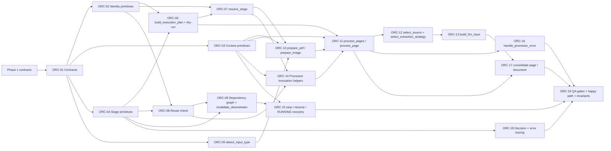

# WBS — procesador-orquestador

| Field | Value |
|---|---|
| Document | WBS / task issues — `procesador-orquestador` (`docflow.workflow`, `src/docflow/workflow/`) |
| Phase | **2 — Orchestrator: state, reuse, resume**, extending into **Phase 3 — Integration: source selection and end-to-end result** (`docs/plan/README.md` §5) |
| Derived from | `docs/plan/subplan-orquestador.md` §4 (WBS table, order/waves) |
| Source of truth | `docs/plan/subplan-orquestador.md` + `docs/plan/README.md`; task IDs and titles are preserved verbatim from the subplan table |
| ID range | `ORC-01` … `ORC-19` |
| Status | All issues `NOT_STARTED` |

This document expands — never replaces — the subplan WBS. Every issue traces back to exactly one row of `subplan-orquestador.md` §4; no new scope is introduced here. `.github/copilot-instructions.md` governs code quality for every task.

**Phase note.** The subplan declares this component as general-plan Phase 2, whose entry condition is the Phase 1 exit (the four processor contracts exist). Its last group of tasks — `select_source`, `select_extraction_strategy`, `build_llm_input`, `consolidate_page_result` / `consolidate_document_result` and the end-to-end happy path — is what the general plan places in Phase 3; the subplan keeps them inside this same WBS, and so does this document.

**Scope.** Own the whole document workflow: `DocumentRequest → DocumentResult`, with `detect_input_type`, `build_execution_plan`, per-stage resolution (`EXECUTE` / `REUSE` / `SKIP` / `FORCE` / `WAIT` / `BLOCKED`), `processing_key` + reuse rule, durable `DocumentContext` / `PageContext` / `StageExecution` state, `skip` / `force` / `stop` / `resume` / dry-run, source selection, LLM input composition and consolidation. It composes the four Phase 1 processors exclusively through their public contracts and implements none of their logic.

## 1. Summary

| Field | Value |
|---|---|
| Phase | 2 — state, reuse, resume; Phase 3 — source selection and end-to-end result (per the subplan WBS) |
| ID range | ORC-01 … ORC-19 |
| # tasks | 19 |
| Effort distribution | S ×3 (ORC-02, 05, 18) · M ×13 (ORC-01, 03, 04, 06, 07, 08, 09, 10, 12, 13, 14, 16, 17) · L ×3 (ORC-11, 15, 19) |
| Critical path | `ORC-01 → ORC-02 → ORC-06 → ORC-07 → ORC-10 → ORC-14 → ORC-11 → ORC-12 → ORC-13 → ORC-17 → ORC-19` |
| Definition of Done gate | `pytest` · `ruff check .` · `ruff format --check .` · `pylint src tests`, plus mutation-falsified invariant tests |

**Scope paragraph.** The orchestrator turns a `DocumentRequest` into a `DocumentResult` by planning the run, resolving each stage against persisted state and artifact validity, executing only what is not reusable, selecting the documentary source and the extraction strategy, composing the LLM input, and consolidating the per-page and per-document results — reporting failures instead of propagating them, and never implementing PDF, image, OCR or LLM logic.

## 2. Task issue index

| ID | Task (short) | Effort | Wave | Depends on | Deliverable artifact(s) | Issue file | Status |
|---|---|---|---|---|---|---|---|
| ORC-01 | Contract types | M | 1 — Foundation | Phase 1 contracts | `DocumentRequest`, `DocumentResult`, `DocumentContext`, `PageContext`, `StageExecution`, `ExecutionPolicy`, stage-state enum | this file §ORC-01 | NOT_STARTED |
| ORC-02 | Identity primitives | S | 1 — Foundation | ORC-01 | `input_hash`, `options_hash`, `processing_key`, `build_workflow_run_id` | this file §ORC-02 | NOT_STARTED |
| ORC-03 | Context primitives | M | 1 — Foundation | ORC-01 | create / load / save `DocumentContext`, create / get `PageContext`, atomic persistence | this file §ORC-03 | NOT_STARTED |
| ORC-04 | Stage primitives | M | 1 — Foundation | ORC-01 | `StageExecution`, `set_stage_status`, `claim_stage`, `release_stage` | this file §ORC-04 | NOT_STARTED |
| ORC-05 | `detect_input_type` | S | 1 — Foundation | ORC-01 | `detect_input_type` (PDF / IMAGE / UNSUPPORTED) | this file §ORC-05 | NOT_STARTED |
| ORC-06 | `build_execution_plan` + dry-run | M | 2 — Decision core | ORC-02, ORC-04 | `build_execution_plan`, dry-run plan | this file §ORC-06 | NOT_STARTED |
| ORC-07 | `resolve_stage` decision order | M | 2 — Decision core | ORC-02, ORC-06 | `resolve_stage` (skip → force → reusable → execute) | this file §ORC-07 | NOT_STARTED |
| ORC-08 | Reuse check | M | 2 — Decision core | ORC-02, ORC-04 | `is_stage_reusable`, `validate_stage_outputs` | this file §ORC-08 | NOT_STARTED |
| ORC-09 | Dependency graph + `invalidate_downstream` | M | 2 — Decision core | ORC-04, ORC-08 | `invalidate_downstream` (preserve artifacts, record cause) | this file §ORC-09 | NOT_STARTED |
| ORC-10 | `prepare_pdf_document` / `prepare_image_document` | M | 3 — Execution path | ORC-03, ORC-05, ORC-07 | request builders, `PageContext` creation, PDF reuse-or-execute | this file §ORC-10 | NOT_STARTED |
| ORC-11 | `process_pages` / `process_page` | L | 3 — Execution path | ORC-03, ORC-06, ORC-10, ORC-14 | per-page processing (sequential first) | this file §ORC-11 | NOT_STARTED |
| ORC-12 | `select_source` + `select_extraction_strategy` | M | 3 — Execution path | ORC-11 | `NATIVE_TEXT` / `OCR_TEXT` / `IMAGE` (+ combinations); `TEXT_ONLY` / `OCR_ONLY` / `VLM_ONLY` / `TEXT_PLUS_VLM` / `OCR_PLUS_VLM` | this file §ORC-12 | NOT_STARTED |
| ORC-13 | `build_llm_input` | M | 3 — Execution path | ORC-12 | `LLMInput` (task, document, images[], schema, options) | this file §ORC-13 | NOT_STARTED |
| ORC-14 | Processor invocation helpers | M | 3 — Execution path | ORC-03, ORC-07, ORC-08 | `run_image_processing`, `run_ocr`, `run_llm` | this file §ORC-14 | NOT_STARTED |
| ORC-15 | `resume_document` / `RUNNING` recovery (`request_stop` deferred) | L | 4 — Resilience | ORC-03, ORC-09 | `resume_document`, `RUNNING → READY` recovery | this file §ORC-15 | NOT_STARTED |
| ORC-16 | `handle_processor_error` | M | 4 — Resilience | ORC-11 | error records, the two PoC outcomes (`retry processor` / `REVIEW_REQUIRED`) | this file §ORC-16 | NOT_STARTED |
| ORC-17 | `consolidate_page_result` / `consolidate_document_result` | M | 5 — Consolidation & QA | ORC-11, ORC-13 | ordered pages, preserved results, `execution_summary` | this file §ORC-17 | NOT_STARTED |
| ORC-18 | Decision + error tracing records | S | 5 — Consolidation & QA | ORC-04 | `register_decision`, `register_error`, `append_workflow_trace` | this file §ORC-18 | NOT_STARTED |
| ORC-19 | Four QA gates + happy path + invariant tests | L | 5 — Consolidation & QA | all above | QA gate output, mutation-falsified invariant tests | this file §ORC-19 | NOT_STARTED |

> The subplan records ORC-01 and ORC-03 … ORC-04, ORC-06 … ORC-10, ORC-12 … ORC-14, ORC-16 … ORC-17 as `M`; ORC-02, ORC-05 and ORC-18 as `S`; and ORC-11, ORC-15, ORC-19 as `L`.

## 3. Detailed issues

### ORC-01 — Contract types

- **Type:** Contracts
- **Effort:** M
- **Wave:** 1 — Foundation
- **Depends on:** Phase 1 contracts
- **Blocks:** ORC-02, ORC-03, ORC-04, ORC-05
- **Objective:** Freeze the orchestrator's public and durable vocabulary: the request/result pair, the durable document and page state, the atomic stage unit, the execution policy and the stage-state enum.
- **Scope / Deliverables:** `DocumentRequest` (`input_path`, `input_type`, `workflow`, `policies`, `execution`, `options`, `metadata`); `ExecutionPolicy` (`resume`, `reuse_successful`, `retry_failed`, `skip_stages[]`, `force_stages[]`, `stop_after_stage`, `start_from_stage`, `invalidate_downstream`, `dry_run`, `parallel_pages`); `DocumentResult` (`document_id`, `workflow_run_id`, `input`, `pages[]`, `status`, `execution_summary`, `decisions[]`, `errors[]`, `metadata`, `final_result`); `DocumentContext`; `PageContext` (`page_number`, `artifacts`, `results`, `stages`, `selected_source`, `extraction_strategy`, `decisions[]`, `errors[]`, `status`); `StageExecution` (`stage_id`, `stage`, `processor`, `processor_version`, `status`, `processing_key`, `input_artifacts[]`, `output_artifacts[]`, `options_hash`, `attempts`, `started_at`, `finished_at`, `skip_reason`, `force_reason`, `error`, `metadata`); stage states `NOT_STARTED`, `READY`, `RUNNING`, `SUCCESS`, `FAILED`, `PARTIAL`, `SKIPPED`, `REUSED`, `INVALIDATED`, `PAUSED`, `REVIEW_REQUIRED` (`CANCELLED` is deliberately absent: with no per-processor cancel nothing could produce it).
- **Out of bounds:** No processor logic, no I/O; no defaults on required fields; no domain noun (invoice, field, verdict, pipeline code) in the API; the stage-state enum must keep `SKIPPED` (deliberately not run) distinct from `REUSED` (a valid result already exists).
- **Acceptance criteria:**
  - Given the contract module, when a required field is omitted, then construction fails (no silent default).
  - Then `DocumentRequest.execution` and `DocumentRequest.policies` are separate types, so operational decisions never mix with document policies.
- **Evidence / DoD:** Type hints complete; Google-style docstrings; `ruff check .` and `pylint src tests` clean.
- **Tags:** —

### ORC-02 — Identity primitives

- **Type:** Primitive
- **Effort:** S
- **Wave:** 1 — Foundation
- **Depends on:** ORC-01
- **Blocks:** ORC-06, ORC-07, ORC-08
- **Objective:** Compute the three identities the workflow depends on, with the `processing_key` formula fixed exactly as the subplan states it.
- **Scope / Deliverables:** `input_hash`, `options_hash`, `processing_key = hash(processor + processor_version + input_hashes + normalized_options)`, `build_workflow_run_id`.
- **Out of bounds:** No stage resolution or reuse decision (ORC-07 / ORC-08 consume these values); `options` must be normalized with a canonical, order-stable serialization; no run identity may leak into `processing_key`.
- **Acceptance criteria:**
  - Given the same processor, version, input hashes and normalized options, when `processing_key` is computed twice, then both values are identical regardless of `workflow_run_id`.
  - Given a changed option value, then `options_hash` and `processing_key` both change.
- **Evidence / DoD:** Unit tests for key determinism and option-change sensitivity; the reuse invariant (ORC-19, invariant 3) depends on this behaviour.
- **Tags:** —

### ORC-03 — Context primitives

- **Type:** Primitive
- **Effort:** M
- **Wave:** 1 — Foundation
- **Depends on:** ORC-01
- **Blocks:** ORC-11, ORC-15
- **Objective:** Create, load and save the durable document context and manage per-page contexts, with atomic persistence.
- **Scope / Deliverables:** create / load / save `DocumentContext`; create / get `PageContext`; JSON serialization with atomic writes (`.tmp` → validate → rename); in-memory store first.
- **Out of bounds:** No workflow decision, no stage resolution, no processor invocation; the store is transient in the PoC (`# TODO: [MVP]` for a durable backend) but the serialized shape must be real, never a placeholder.
- **Acceptance criteria:**
  - Given a `DocumentContext`, when it is saved and reloaded, then document identity, pages, stages, decisions and errors round-trip exactly.
  - Given an interrupted write, then no partial `DocumentContext` is readable and no `.tmp` residue remains.
- **Evidence / DoD:** Round-trip test plus failure-path test asserting no partial state is observable.
- **Tags:** `# TODO: [MVP]` for the real durable store.

### ORC-04 — Stage primitives

- **Type:** Primitive
- **Effort:** M
- **Wave:** 1 — Foundation
- **Depends on:** ORC-01
- **Blocks:** ORC-08, ORC-09, ORC-18
- **Objective:** Provide the atomic control unit of the workflow: create a `StageExecution`, transition its status, and claim/release it so that only one owner runs a stage.
- **Scope / Deliverables:** `StageExecution` lifecycle helpers, `set_stage_status`, `claim_stage` (atomic `READY → RUNNING`), `release_stage`.
- **Out of bounds:** No stage resolution policy, no processor call, no artifact validation; a status transition must never be applied to a stage claimed by another owner.
- **Acceptance criteria:**
  - Given a `READY` stage, when `claim_stage` is invoked twice, then only the first claim succeeds and the stage is `RUNNING`.
  - Given a `RUNNING` stage whose owner releases it, then it returns to `READY` and can be claimed again.
- **Evidence / DoD:** Unit tests for both transitions, including the double-claim rejection.
- **Tags:** `# TODO: [MVP]` for multi-worker coordination.

### ORC-05 — `detect_input_type`

- **Type:** Primitive
- **Effort:** S
- **Wave:** 1 — Foundation (its only predecessor is ORC-01)
- **Depends on:** ORC-01
- **Blocks:** ORC-10
- **Objective:** Classify the input as `PDF`, `IMAGE` or `UNSUPPORTED` before any plan is built.
- **Scope / Deliverables:** `detect_input_type` honouring an explicit `input_type` when provided and otherwise inspecting the input.
- **Out of bounds:** No page creation, no processor invocation, no PDF or image parsing logic (that belongs to the processors); an unknown input must be reported as `UNSUPPORTED`, never guessed into a supported type.
- **Acceptance criteria:**
  - Given a PDF path, when `detect_input_type` runs, then it returns `PDF`; given an image path, `IMAGE`.
  - Given an unrecognized file, then it returns `UNSUPPORTED` and the run records a decision instead of proceeding.
- **Evidence / DoD:** Unit tests with a PDF fixture, an image fixture and an unsupported file.
- **Tags:** —

### ORC-06 — `build_execution_plan` and dry-run

- **Type:** Primitive
- **Effort:** M
- **Wave:** 2 — Decision core
- **Depends on:** ORC-02, ORC-04
- **Blocks:** ORC-07, ORC-11
- **Objective:** Build the full per-page execution plan — evaluating dependencies, skips, forces and invalidations and computing each stage's resolution — without executing any processor when `dry_run` is set.
- **Scope / Deliverables:** `build_execution_plan` producing per-stage `EXECUTE` / `REUSE` / `SKIP` / `FORCE` / `BLOCKED` entries; dry-run mode.
- **Out of bounds:** No processor invocation of any kind in dry-run; no plan entry without a computed `processing_key`; a plan is never returned with an implicit default action.
- **Acceptance criteria:**
  - Given a `DocumentRequest` with `dry_run = true`, when `process_document` runs, then a plan is returned showing per-stage `EXECUTE` / `REUSE` / `SKIP` / `FORCE` / `BLOCKED` and no processor is invoked.
  - Given a stage whose input is unavailable, then its plan entry is `BLOCKED` with a recorded reason.
- **Evidence / DoD:** Dry-run scenario test; assertion that no fake-processor counter increments.
- **Tags:** `# TODO: [MVP]` for richer dependency evaluation.

### ORC-07 — `resolve_stage` decision order

- **Type:** Primitive
- **Effort:** M
- **Wave:** 2 — Decision core
- **Depends on:** ORC-02, ORC-06
- **Blocks:** ORC-10, ORC-14
- **Objective:** Decide a stage's action in a fixed, auditable order: explicit skip → force → valid reusable → execute.
- **Scope / Deliverables:** `resolve_stage` returning `EXECUTE` / `REUSE` / `SKIP` / `FORCE` / `WAIT` / `BLOCKED`, with the decision recorded and its reason captured (e.g. `explicit_skip`, `native_text_present`).
- **Out of bounds:** No execution, no artifact production; force must not stop at the forced stage — the downstream invalidation is ORC-09's responsibility, invoked from here; a reused result must never be recorded as a skip.
- **Acceptance criteria:**
  - Given a stage with a matching `processing_key`, `SUCCESS` status and valid artifacts, when `resolve_stage` runs, then it returns `REUSE`.
  - Given `force_stages` containing a stage, then it returns `FORCE`; given an explicit `skip_stages` entry, then `SKIP` wins over reuse.
- **Evidence / DoD:** Unit tests over the four branches plus the precedence cases (skip over reuse, force over reuse).
- **Tags:** —

### ORC-08 — Reuse check

- **Type:** Primitive
- **Effort:** M
- **Wave:** 2 — Decision core
- **Depends on:** ORC-02, ORC-04
- **Blocks:** ORC-09, ORC-14
- **Objective:** Decide reusability from evidence, not from the mere presence of files.
- **Scope / Deliverables:** `is_stage_reusable` implementing *`status == SUCCESS` AND `processing_key` matches AND output artifacts exist AND artifact hashes are valid*; `validate_stage_outputs`.
- **Out of bounds:** Physical file existence alone must never imply reuse; no execution, no invalidation, no error-handling decision.
- **Acceptance criteria:**
  - Given an output artifact present on disk but a `processing_key` mismatch, when `is_stage_reusable` runs, then it returns false.
  - Given a matching key with a corrupted artifact hash, then it returns false.
- **Evidence / DoD:** Unit tests for the four conditions, each violated in turn; the reuse invariant (ORC-19, invariant 3).
- **Tags:** `# TODO: [MVP]` for hash-verification performance.

### ORC-09 — Dependency graph and `invalidate_downstream`

- **Type:** Primitive
- **Effort:** M
- **Wave:** 2 — Decision core
- **Depends on:** ORC-04, ORC-08
- **Blocks:** ORC-15
- **Objective:** Know which stages depend on which, and invalidate the transitive dependents of a forced or changed stage while preserving historical artifacts.
- **Scope / Deliverables:** the stage dependency graph; `invalidate_downstream` marking dependents `INVALIDATED` with the invalidation cause recorded; preserved (but never reused) prior artifacts.
- **Out of bounds:** No deletion of historical artifacts; no execution of the invalidated stages (that is the execution path); the graph is data-driven, not a hardcoded chain.
- **Acceptance criteria:**
  - Given a completed run with `OCR = SUCCESS` and `LLM = SUCCESS`, when `force_stages` contains `OCR`, then `PDF` and `IMAGE` resolve to `REUSE`, `OCR` to `EXECUTE` and `LLM` to `INVALIDATED`.
  - Then the invalidated stage's previous artifacts still exist on disk but are not reusable.
- **Evidence / DoD:** Force-invalidation scenario test; the downstream-invalidation invariant (ORC-19, invariant 2).
- **Tags:** —

### ORC-10 — `prepare_pdf_document` / `prepare_image_document`

- **Type:** Entry point
- **Effort:** M
- **Wave:** 3 — Execution path
- **Depends on:** ORC-03, ORC-05, ORC-07
- **Blocks:** ORC-11
- **Objective:** Turn a detected input into the document skeleton: build the processor request, create the page contexts and run (or reuse) the PDF stage.
- **Scope / Deliverables:** `prepare_pdf_document` and `prepare_image_document` building `PDFRequest` / logical `PageContext` entries, resolving whether the PDF stage is reused or executed, and registering the produced artifacts.
- **Out of bounds:** No PDF or image logic (the processors own it); no source selection; a logical page created for a direct image input must not pretend a PDF stage ran.
- **Acceptance criteria:**
  - Given a PDF input, when `prepare_pdf_document` runs, then the number of `PageContext` entries equals the PDF page count and the PDF stage status is recorded.
  - Given a direct image input, then one logical `PageContext` is created and the PDF stage is not marked `SUCCESS`.
- **Evidence / DoD:** Unit tests with the fake processors, asserting page-context coverage.
- **Tags:** `# TODO: [MVP]` for multi-document inputs.

### ORC-11 — `process_pages` / `process_page`

- **Type:** Entry point
- **Effort:** L
- **Wave:** 3 — Execution path
- **Depends on:** ORC-03, ORC-06, ORC-10, ORC-14
- **Blocks:** ORC-12, ORC-16, ORC-17
- **Objective:** Process each page as a self-contained unit of parallelism, recovery and reprocessing, preserving logical order.
- **Scope / Deliverables:** `process_pages` / `process_page` resolving the IMAGE stage then the OCR stage per page, recording each `StageExecution`, isolating per-page state, and keeping only the failed page re-processable.
- **Out of bounds:** No source selection or LLM input building (ORC-12 / ORC-13); no processor internals; `parallel_pages` is declared but executed sequentially in the PoC.
- **Acceptance criteria:**
  - Given pages P1, P2, P4, P5 `SUCCESS` and P3 `FAILED`, when the document resumes, then only P3 is reprocessed and the page order in the result is preserved.
  - Given a page whose IMAGE stage is reusable, then it is recorded `REUSED` without invoking the image processor.
- **Evidence / DoD:** Per-page isolation test with fake processors and per-page call counters.
- **Tags:** `# TODO: [MVP]` for true `parallel_pages` execution.

### ORC-12 — `select_source` and `select_extraction_strategy`

- **Type:** Primitive
- **Effort:** M
- **Wave:** 3 — Execution path
- **Depends on:** ORC-11
- **Blocks:** ORC-13
- **Objective:** Choose the documentary source and the extraction strategy, and record the decision with its reason.
- **Scope / Deliverables:** `select_source` among `NATIVE_TEXT`, `OCR_TEXT`, `IMAGE`, `NATIVE_TEXT + IMAGE`, `OCR_TEXT + IMAGE`; `select_extraction_strategy` among `TEXT_ONLY`, `OCR_ONLY`, `VLM_ONLY`, `TEXT_PLUS_VLM`, `OCR_PLUS_VLM`; decision reason (e.g. `native_text_empty`). The source matrix stays a literal table with no default fallback; only the cells the Phase 3 paths actually reach carry an asserted reason in the PoC, the rest carrying `# TODO: [MVP]` for their reason refinement.
- **Out of bounds:** Never a processor decision — only the orchestrator selects the source; no content interpretation (it routes, it does not read); no comparison of native text against OCR output beyond the documented rules; no silent default source.
- **Acceptance criteria:**
  - Given a page with native text present, when selection runs, then `NATIVE_TEXT` is chosen and the reason is recorded.
  - Given a page with empty native text and a successful OCR result, then `OCR_TEXT` is chosen with reason `native_text_empty`.
- **Evidence / DoD:** Unit tests over the source and strategy matrices; the `SKIPPED` OCR stage in the happy-path scenario must record `native_text_present`.
- **Tags:** `# TODO: [MVP]` for richer selection heuristics.

### ORC-13 — `build_llm_input`

- **Type:** Primitive
- **Effort:** M
- **Wave:** 3 — Execution path
- **Depends on:** ORC-12
- **Blocks:** ORC-17
- **Objective:** Compose the `LLMInput` from the selected source and strategy: task, document, images and schema.
- **Scope / Deliverables:** `build_llm_input` producing `LLMInput` (task, document, `images[]`, schema, options), passing the strategy outcome and never the processors' internal state.
- **Out of bounds:** No prompt rendering, no provider payload, no schema validation (all inside `procesador-llm-call`); no default model, schema or task substituted when configuration is missing.
- **Acceptance criteria:**
  - Given `OCR_PLUS_VLM`, when `build_llm_input` runs, then the input carries the OCR text, the prepared `vlm_ready` image reference and the configured task.
  - Given `TEXT_ONLY`, then no image reference is attached.
- **Evidence / DoD:** Unit tests over the strategy-to-input mapping.
- **Tags:** —

### ORC-14 — Processor invocation helpers

- **Type:** Primitive
- **Effort:** M
- **Wave:** 3 — Execution path
- **Depends on:** ORC-03, ORC-07, ORC-08
- **Blocks:** ORC-11
- **Objective:** Call the four Phase 1 processors behind their contracts and register the artifacts they return, so no processor internal ever appears in the orchestrator.
- **Scope / Deliverables:** `run_image_processing`, `run_ocr`, `run_llm` (plus the PDF invocation used by ORC-10), each calling the contract, applying the resolved action, and registering input/output artifacts into the `StageExecution`.
- **Out of bounds:** No processor internals, no engine access (Poppler, OpenCV, Docling or a provider) from the orchestrator; a processor failure must be returned as a typed result, never as an exception that aborts the run.
- **Acceptance criteria:**
  - Given the fake processors, when a stage resolves to `EXECUTE`, then the corresponding helper invokes the fake once and registers its artifacts.
  - Given a stage resolved to `REUSE`, then no helper invokes the processor.
- **Evidence / DoD:** Counters-based tests per helper; review against the subplan "does NOT" list.
- **Tags:** `# TODO: [MVP]` for retry policy on a whole processor.

### ORC-15 — `resume_document` and `RUNNING` recovery

- **Type:** Entry point
- **Effort:** L
- **Wave:** 4 — Resilience
- **Depends on:** ORC-03, ORC-09
- **Blocks:** —
- **Objective:** Make a stopped run resumable without repeating completed work, including recovery of a stage left `RUNNING`. The stop side is declarative: `ExecutionPolicy.stop_after_stage` is what leaves a document `PAUSED`.
- **Scope / Deliverables:** `resume_document` (load `DocumentContext`, validate artifacts, rebuild the plan, continue); the resume mapping `SUCCESS → REUSE`, `REUSED → REUSE`, `SKIPPED → keep SKIPPED`, `INVALIDATED → EXECUTE`, `FAILED → RETRY per policy`, `NOT_STARTED → EXECUTE`, `RUNNING → recover (→ READY, then per policy)`. `request_stop` and its `stop_requested` field are deferred (`# TODO: [MVP]`): the PoC has no imperative stop, and a field nothing writes is worse than no field.
- **Out of bounds:** No per-processor cancel in the PoC; no LLM-internal retries (they belong to `procesador-llm-call`); a `SUCCESS` stage must never be mapped to `EXECUTE`.
- **Acceptance criteria:**
  - Given a prior run with `PDF`, `IMAGE`, `OCR` `SUCCESS` and `LLM` `NOT_STARTED` (document `PAUSED`), when `resume_document` runs with `reuse_successful` true, then `PDF`, `IMAGE`, `OCR` are `REUSED`, the LLM stage executes, and no fake processor counter for a completed stage increments.
  - Given a stage left `RUNNING` with no active worker, then it is recovered to `READY` and resolved per policy.
- **Evidence / DoD:** Resume scenario test with fake call counters; the resume invariant (ORC-19, invariant 1).
- **Tags:** `# TODO: [MVP]` for `request_stop`; `# TODO: [RELEASE]` for external-kill recovery and cross-process locking.

### ORC-16 — `handle_processor_error`

- **Type:** Primitive
- **Effort:** M
- **Wave:** 4 — Resilience
- **Depends on:** ORC-11
- **Blocks:** —
- **Objective:** Contain a failed stage: record it, decide according to policy and continue or pause, without propagating the failure as an untyped exception.
- **Scope / Deliverables:** `handle_processor_error`, error records on the stage and the document, and the two outcomes the PoC implements: `retry processor` / `REVIEW_REQUIRED`. `fallback` / `continue partial` / `stop page` / `pause document` are deferred (`# TODO: [MVP]`) and are not advertised in the API.
- **Out of bounds:** No processor internals, no LLM-internal retry handling; a failed stage is reported, never silently swallowed; richer fallbacks beyond `retry processor` and `REVIEW_REQUIRED` are deferred.
- **Acceptance criteria:**
  - Given a page whose OCR processor returns a typed failure, when `handle_processor_error` runs, then the stage is `FAILED` or `REVIEW_REQUIRED`, an error record is written, and the document continues or pauses per policy.
  - Then no exception escapes `process_document` where a typed result is the contract.
- **Evidence / DoD:** Unit test with a fake processor scripted to fail, asserting the resulting stage state and error record.
- **Tags:** `# TODO: [MVP]` for fallback depth (OCR fail → VLM-only).

### ORC-17 — `consolidate_page_result` / `consolidate_document_result`

- **Type:** Entry point
- **Effort:** M
- **Wave:** 5 — Consolidation & QA
- **Depends on:** ORC-11, ORC-13
- **Blocks:** ORC-19
- **Objective:** Build the per-page consolidated result and the document-level `DocumentResult`, preserving page order and every processor result, and populate the `execution_summary`.
- **Scope / Deliverables:** `consolidate_page_result` (selected source, extraction strategy, per-stage results and decisions), `consolidate_document_result` (ordered `pages[]`, `status`, `execution_summary` listing decisions and reused/skipped stages, `decisions[]`, `errors[]`, `final_result`).
- **Out of bounds:** No semantic interpretation of document content; no aggregate confidence score in place of the per-field evidence; no reordering of pages; no processor invocation.
- **Acceptance criteria:**
  - Given a completed run, when consolidation runs, then `pages[]` is in logical page order and every processor result is preserved.
  - Then `execution_summary` contains every decision and every reused or skipped stage.
- **Evidence / DoD:** Assertions inside the happy-path test (ORC-19).
- **Tags:** —

### ORC-18 — Decision and error tracing records

- **Type:** Primitive
- **Effort:** S
- **Wave:** 5 — Consolidation & QA
- **Depends on:** ORC-04
- **Blocks:** —
- **Objective:** Make every routing decision and every error inspectable after the run.
- **Scope / Deliverables:** `register_decision`, `register_error`, `append_workflow_trace` writing to `DocumentContext.decisions` / `.errors` and the page-level equivalents.
- **Out of bounds:** No telemetry, metrics export or observability stack (`# TODO: [RELEASE]`); no logging that replaces the structured record; no decision recorded without a reason.
- **Acceptance criteria:**
  - Given a run that skips OCR, when the trace is inspected, then a decision record exists naming the stage, the action and the reason.
  - Given a failed stage, then an error record exists with the stage identity and the error type.
- **Evidence / DoD:** Unit tests over the tracing helpers and their presence in the happy-path result.
- **Tags:** `# TODO: [RELEASE]` for telemetry and structured log export.

### ORC-19 — Four QA gates, happy path and invariant tests

- **Type:** QA gate
- **Effort:** L
- **Wave:** 5 — Consolidation & QA
- **Depends on:** all above
- **Blocks:** —
- **Objective:** Close the component: one end-to-end happy path through the four contracts, three mutation-falsified invariant tests and all four quality gates green.
- **Scope / Deliverables:** fake processors (`FakePdf`, `FakeImage`, `FakeOcr`, `FakeLlm`) with deterministic outputs, per-processor call counters and a temp output dir; a small committed fixture PDF (and one image); the happy-path test (`PDF → IMAGE → (OCR skipped) → SOURCE SELECTION → LLM → consolidate` producing `SUCCESS` with correct per-stage states and a populated `execution_summary`); invariant 1 (resume reuses, never re-runs), invariant 2 (force invalidates downstream), invariant 3 (reuse requires a `processing_key` match, not mere file existence); `pytest`, `ruff check .`, `ruff format --check .`, `pylint src tests` clean.
- **Out of bounds:** No edge-case matrix beyond the four scenarios; no real engines (the fakes stand in for the Phase 1 processors); no source change kept in place to satisfy a test; no config-wide rule suppression. These fakes are **contract-level** — they replace whole processors; the engine doubles inside `pdf`, `image` and `ocr` (`README.md` §9.7) are **primitives-level** — they replace only the engine call inside a real processor. Neither stands in for the other, and no test reaches an engine or a provider.
- **Acceptance criteria:**
  - Given a `DocumentRequest` on a PDF with native text, when `process_document` runs, then the result is `SUCCESS`, `PDF`/`IMAGE`/`LLM` are `SUCCESS`, `OCR` is `SKIPPED` with reason `native_text_present`, and the `execution_summary` lists the decisions and the skipped stage.
  - Given invariant 1's mutation (`resume_document` maps `SUCCESS` → `EXECUTE`), invariant 2's mutation (force marks only the forced stage, leaving `LLM = SUCCESS`), and invariant 3's mutation (`is_stage_reusable` returns true on file existence alone), then each corresponding test fails; after restore, all are green.
- **Evidence / DoD:** Happy-path output, both observations per invariant, and captured output of the four gates.
- **Tags:** —

## 4. Dependency graph

> Note: every arrow above now matches the task's declared `Depends on` column — ORC-05 feeds ORC-10 (which cannot detect an input type on its own), ORC-10 and ORC-14 both gate ORC-11 (`process_pages` must have a document skeleton and a way to invoke processors), and ORC-03 feeds ORC-10, ORC-11 and ORC-14 because all three create or consume `PageContext` / `StageExecution` state.

## 5. Execution waves

| Wave | Tasks | Entry condition | Exit condition |
|---|---|---|---|
| 1 — Foundation | ORC-01 → ORC-02 → ORC-03 → ORC-04; ORC-05 in parallel with ORC-02/03/04 | Phase 1 exit met: the four processor contracts exist as typed dataclasses with no defaults and import cleanly; fake processors available | Contracts, identities, durable state, atomic stage claims and input-type detection in place |
| 2 — Decision core | ORC-06 → ORC-07 → ORC-08 → ORC-09 | Wave 1 green | Plan (incl. dry-run), resolve/reuse and downstream invalidation behave correctly |
| 3 — Execution path | ORC-03 + ORC-05 + ORC-07 → ORC-10; ORC-03 + ORC-07 + ORC-08 → ORC-14; then ORC-10 + ORC-14 → ORC-11 → ORC-12 → ORC-13 | Wave 2 green | Document/page processing, processor invocation, source selection and LLM input composition work through the contracts |
| 4 — Resilience | ORC-15 → ORC-16 | Wave 3 green | Resume without re-execution, `RUNNING` recovery, and error containment with the two PoC outcomes |
| 5 — Consolidation & QA | ORC-17 → ORC-18 → ORC-19 | Wave 4 green | Consolidated `DocumentResult` with tracing; happy path and three invariant tests mutation-falsified; four gates clean |

## 6. Critical path

`ORC-01 → ORC-02 → ORC-06 → ORC-07 → ORC-10 → ORC-14 → ORC-11 → ORC-12 → ORC-13 → ORC-17 → ORC-19`

It is critical because the contracts (ORC-01) and identities (ORC-02) precede any decision; the plan (ORC-06) is the input to stage resolution (ORC-07), which gates the document preparation (ORC-10), which together with the processor-invocation helpers (ORC-14) gates the per-page execution (ORC-11); source selection (ORC-12) and `build_llm_input` (ORC-13) are strictly sequential on the way to consolidation (ORC-17), and nothing closes until the QA gate (ORC-19) is green. ORC-03 → ORC-15 and ORC-11 → ORC-16 are parallel resilience branches; the longest chain in the subplan is therefore the one above, since ORC-15 and ORC-16 remain shorter than ORC-12 → ORC-13 → ORC-17. ORC-14 sits on the critical path because ORC-11 cannot invoke a processor without it.

## 7. Traceability

| Acceptance scenario (subplan §5) | Implemented by | Tested by |
|---|---|---|
| Happy-path PDF with native text runs end to end | ORC-05, ORC-10, ORC-11, ORC-12, ORC-13, ORC-14, ORC-17, ORC-18 | ORC-19 happy path (per-stage states + populated `execution_summary`) |
| Resume does not re-run completed stages | ORC-03, ORC-07, ORC-08, ORC-15 | ORC-19 invariant 1 (mutation: `SUCCESS` → `EXECUTE` in `resume_document`) |
| Forcing a stage invalidates its downstream dependents | ORC-07, ORC-09 | ORC-19 invariant 2 (mutation: force marks only the forced stage) |
| Dry-run executes no processors | ORC-06 | ORC-19 dry-run assertion (no fake-processor counter increments) |
| Reuse requires a `processing_key` match, not mere file existence | ORC-02, ORC-08 | ORC-19 invariant 3 (mutation: `is_stage_reusable` returns true on file existence) |
| Failed stage is reported, not propagated | ORC-16 | ORC-19 error-containment test (typing of `FAILED` / `REVIEW_REQUIRED`, error record present) |
| Page order and per-page isolation | ORC-11, ORC-17 | ORC-19 page-order assertion; per-page resume test (only the failed page reprocessed) |

## 8. Definition of Ready (per task)

- The task appears as a row in `subplan-orquestador.md` §4 with the same ID, title, effort and dependencies, and the WBS, acceptance criteria and out-of-scope list are reviewed and approved.
- The four Phase 1 processor contracts (`PDFRequest`/`PDFResult`, `ImageRequest`/`ImageResult`, `OCRRequest`/`OCRResult`, `LLMInput`/`LLMResult`) exist as typed dataclasses with no defaults on required fields and import cleanly.
- Fake processors for all four contracts are available in test fixtures with per-processor call counters.
- The stage-state vocabulary and the three identities (`document_id`, `workflow_run_id`, `processing_key`) are agreed and documented; the reuse rule is written down.
- The two-level separation is agreed with the `procesador-llm-call` owner (documental stage vs. inference subgraph), and the `processing_key` formula is fixed.
- No open question blocks the happy path; no domain noun is introduced into the orchestrator API.

## 9. Definition of Done (per task)

- [ ] `pytest` green with the task's happy-path and/or invariant test, exercising the orchestrator only through the four contracts with the fake processors.
- [ ] `ruff check .` clean (import order included) · `ruff format --check .` clean · `pylint src tests` clean (`fixme` disabled).
- [ ] Every invariant test touched by the task has been mutation-falsified: mutate → observe failure → restore → re-run green, both observations reported.
- [ ] No silent stand-in (no empty string, `0`, `[]`, `None`-without-reason, no default model, engine or threshold); no aggregate confidence score in place of the per-field evidence.
- [ ] No domain noun (invoice, field, verdict, pipeline code) in the orchestrator API; no processor logic implemented inside the orchestrator; no engine (Poppler, OpenCV, Docling, provider) touched from `workflow/`.
- [ ] Resume reuses completed stages; force invalidates downstream dependents; a failed stage is reported, not propagated; dry-run builds a plan without executing.
- [ ] The PoC vocabulary is the one `ORC-01` fixes: no `CANCELLED`, no `stop_requested`, and only the two error outcomes of `ORC-16`.
- [ ] Artifacts published atomically; the orchestrator writes only its own state and never into another processor's namespace; every shortcut carries an inline `# TODO: [MVP]` or `# TODO: [RELEASE]` tag; output, identifiers, docstrings and comments in English.

## 10. Risks & mitigations (execution view)

| Risk (subplan §8) | Task affected | Mitigation owned by |
|---|---|---|
| Orchestrator absorbs processor logic (scope creep into PDF/image/OCR/LLM internals) | ORC-10, ORC-11, ORC-14 | ORC-14 (route every capability through the Phase 1 contracts; the "does NOT" list is the review checklist — review fails if any processor internal appears) |
| Re-running costly OCR/LLM work | ORC-08, ORC-15 | ORC-08 (`processing_key` + reuse rule) + ORC-15 (resume without re-execution) + dry-run via ORC-06 |
| File-existence falsely treated as a valid result | ORC-08 | ORC-08 (reuse requires `processing_key` match + artifact hash validation) + ORC-19 invariant 3 |
| Force not invalidating dependents | ORC-07, ORC-09 | ORC-09 (`invalidate_downstream`, invalidated artifacts preserved but never reused) + ORC-19 invariant 2 |
| Interrupted run leaves `RUNNING` forever | ORC-04, ORC-15 | ORC-15 (recover interrupted `RUNNING` → `READY` when no active worker) + ORC-04 (atomic claim/release) |
| State persistence is in-memory | ORC-03 | ORC-03 (JSON-serialized shape with atomic writes; durable backend tagged `# TODO: [MVP]`) |
| Parallel-page execution race on shared state | ORC-04, ORC-11 | ORC-11 (sequential in PoC; `parallel_pages` tagged `# TODO: [MVP]`) + ORC-04 (`claim_stage` atomic `READY → RUNNING`) |

## 11. Out of scope

- Real PDF/image/OCR/LLM engines (owned by the Phase 1 processors' `primitives/`).
- The LLM inference subgraph (`classify → extract → compare → validate`) — internal to `procesador-llm-call`.
- Multi-document corpus batching and distributed execution.
- Real retry queues and GPU-competition policy.
- A labelled golden set for extraction-quality measurement.
- Domain-specific extraction rules; the pipeline stays generic (prompt/schema assets are data, not code).
- Persistent cross-process storage and observability (telemetry/caching/HA) — deferred behind `# TODO: [RELEASE]`.
