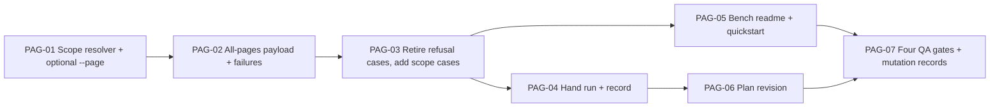

# WBS — page scope in the PDF bench (`--page` omitted = every page)

| Field | Value |
|---|---|
| Document | WBS / task issues — page scope in the PDF bench |
| Phase | **5 — Lab tools** (`docs/plan/README.md` §5), as a revision of the bench |
| Derived from | `docs/plan/subplan-paginas.md` §4 (WBS table, order/waves) |
| Source of truth | `docs/plan/subplan-paginas.md` + `docs/plan/README.md`; task IDs and titles are preserved verbatim from the subplan table |
| ID range | `PAG-01` … `PAG-07` |
| Status | all seven `DONE`, with their evidence in the `docs/plan/bitacora.md` entry for 2026-09-28 |

This document expands — never replaces — the subplan WBS. Every issue traces back to exactly one
row of `subplan-paginas.md` §4; no new scope is introduced here.
`.github/copilot-instructions.md` governs code quality for every task, with the asymmetry the
bench has always carried: `scripts/` is covered by `ruff check .` and `ruff format --check .`
and **not** by `pylint src tests`, whose scope stays the library and its tests
(`subplan-scripts.md` §9, decision 10).

**The ID range is new on purpose.** The repository gives one prefix per subplan — `PDF-*`,
`IMG-*`, `OCR-*`, `LLM-*`, `ORC-*`, `SCR-*` — so a new subplan takes a new, contiguous range.
`SCR-01`…`SCR-18` are neither renumbered nor re-scoped: this change is not a lab-tool task
appended to that range, it is a revision of one module of one tool, and a reader who greps
`SCR-11` must keep finding what `SCR-11` built.

**What this WBS does not own.** The supersession of `subplan-scripts.md` §3.3/§3.4/§5/§6/§9 is a
task here (`PAG-06`), not a precondition: until it runs, `subplan-paginas.md`'s header declares
itself the winning decision on the page-scope question and names exactly which clauses are stale.

## 1. Summary

| Field | Value |
|---|---|
| Phase | 5 — lab tools, as a revision (Phase 5 is closed; `SCR-10` is the only open row and it owns citations this change does not touch) |
| ID range | PAG-01 … PAG-07 |
| # tasks | 7 |
| Effort distribution | S ×4 (PAG-04, 05, 06, 07) · M ×3 (PAG-01, 02, 03) |
| Critical path | `PAG-01 → PAG-02 → PAG-03 → PAG-04 → PAG-06 → PAG-07` |
| Definition of Done gate | `pytest` · `ruff check .` · `ruff format --check .` · `pylint src tests`, plus the two mutation-falsified invariants of `subplan-paginas.md` §6 |

**Scope.** A page-addressed command of `pdf.py` / `batch_pdf.py` that is given no `--page`
processes every page of the document, in page order. The five commands are `render`, `text`,
`blocks`, `images` and `classify`. The change lands in **one module**, `scripts/tools/_pdf.py`:
the scope resolver, the payload that reports it, and the per-page artifact directories that keep
two pages from overwriting each other. `pdf.py`, `batch_pdf.py`, `_cli.py` and `_batch.py` are
not edited.

**Why not the library.** `PDFOptions.dpi` is required with no default, so "every page, no dpi,
no artifact tree" has no route through `process_pdf`; the alternatives are inventing a dpi
(forbidden) or calling `run` (a different question — it aggregates and publishes). The bench
therefore loops the primitives its five methods already call for one page. It duplicates the
*composition*, never the document run.

**Test framing.** Unchanged: no test executes a tool that would reach an engine. The scope is
proved with `tests/fakes/engines/fake_poppler.py`, whose recorded `calls` are the assertion that
two pages were addressed with two different directories. The real engine is exercised by hand
(`PAG-04`) over the multi-page fixtures, and recorded as an observation, never as a gate.

## 2. Task issue index

| ID | Task (short) | Effort | Wave | Depends on | Deliverable artifact(s) | Issue file | Status |
|---|---|---|---|---|---|---|---|
| PAG-01 | The scope resolver and optional `--page` | M | 1 — The rule | — | `scripts/tools/_pdf.py` | this file §PAG-01 | DONE |
| PAG-02 | The all-pages payload and failure collection | M | 1 — The rule | PAG-01 | `scripts/tools/_pdf.py` | this file §PAG-02 | DONE |
| PAG-03 | Retire the refusal cases, add the scope cases | M | 2 — Prove it | PAG-02 | `tests/test_lab_tools.py` | this file §PAG-03 | DONE |
| PAG-04 | Hand run over the multi-page fixtures | S | 2 — Prove it | PAG-03 | `docs/plan/bitacora.md` entry | this file §PAG-04 | DONE |
| PAG-05 | The bench readme and quickstart | S | 2 — Prove it | PAG-03 | `scripts/tools/readme.md`, `scripts/tools/quickstart.md` | this file §PAG-05 | DONE |
| PAG-06 | Reconcile the frozen plan and the index | S | 3 — Close | PAG-04 | `subplan-scripts.md`, `docs/plan/README.md`, `wbs-general.md`, root `README.md` | this file §PAG-06 | DONE |
| PAG-07 | The four QA gates and the mutation records | S | 3 — Close | PAG-05, PAG-06 | QA gate output, root `README.md` | this file §PAG-07 | DONE |

## 3. Detailed issues

### PAG-01 — The scope resolver and the optional `--page`

- **Type:** Tool (bench command layer)
- **Effort:** M
- **Wave:** 1 — The rule
- **Depends on:** —
- **Blocks:** PAG-02
- **Objective:** Make the page axis optional in one place: a page-addressed command with no `--page` covers `1..page_count`, and two pages never write into one directory.
- **Scope / Deliverables:** In `scripts/tools/_pdf.py`:
  - a private `page_scope(args, parser, input_path) -> tuple[list[int], str]` — `[N]`/`"page N"` when `--page` is stated (**no inspection**, so the single-page engine-call count is unchanged), `1..page_count`/`"all pages (N)"` otherwise, with `page_count` from one `inspect_pdf`;
  - `PAGE_COMMANDS` repurposed as the set of page-scoped commands, and the `--page` branch deleted from `validate_flags` (the `--dpi` branch stays, for `render` and `run`);
  - `_render`, `_text`, `_blocks`, `_images` and `_classify` each loop their scope, calling the primitives they already call;
  - `_images` and `_classify` write `root / f"page_{n:03d}" / "images"` **in the looping form** and keep `root / "images"` for a stated page;
  - `for_page` stamps a primitive failure with its page number when the failure happens inside the loop.
- **Out of bounds:** No change to `pdf.py`, `batch_pdf.py`, `_cli.py` or `_batch.py`; no new flag (`--all-pages`, `--page all` are rejected by `subplan-paginas.md` §9, decision 7); no document-level aggregation (`_aggregate_metrics` is not copied — that is `run`'s); no `--page` range validation in the tool (an out-of-range page stays the library's refusal, so the bench adds no validation); no engine binary, module or SDK named.
- **Acceptance criteria:**
  - Given a three-page document and no `--page`, when any of the five runs, then every page is addressed in order and the double's call log shows it.
  - Given `--page 2`, when the same command runs, then exactly one page is addressed and no `pdfinfo` call is made that the single-page path did not make before.
  - Given a two-page document with an embedded image on each page, when `images` runs with no `--page`, then the double's `pdfimages` calls name `page_001/images` and `page_002/images`.
  - Given `tests/fixtures/pdf/pdf_corrupt.pdf` with no `--page`, when any of the five runs, then the failure is the one `inspect_pdf` raises today, printed and exiting `1`.
- **Evidence / DoD:** Type hints and Google-style docstrings; `ruff check .` and `ruff format --check .` clean; the single-page payload is today's payload plus `scope`, and its engine-call count is unchanged; the source names no engine.
- **Tags:** —

### PAG-02 — The all-pages payload, per-page failures and `status`

- **Type:** Tool (bench command layer)
- **Effort:** M
- **Wave:** 1 — The rule
- **Depends on:** PAG-01
- **Blocks:** PAG-03
- **Objective:** Report a whole document's pages without losing the shape a single-page read already has, and without losing a page's failure.
- **Scope / Deliverables:** In `scripts/tools/_pdf.py`:
  - `scope` added to **both** payload forms (`"page N"` / `"all pages (N)"`), so an omitted flag is never silent;
  - the single-page form unchanged otherwise: `page` plus its own keys;
  - the all-pages form `{input, scope, pages: [{page, …}, …], status, errors}` — plus `artifacts` for `images` and `classify` — with the page entries in page order;
  - `status` ∈ `success` / `partial` / `failed` and `errors` holding the page-scoped typed records, in the processor's own vocabulary;
  - a failure inside the loop is collected, not raised; a failure **before** the loop (an uninspectable document) still raises, so the tool's printed record and exit code are unchanged.
- **Out of bounds:** No new contract, dataclass or enum — these are payload dict keys built from what the primitives returned; no change to the library's types or to `_batch`'s record shape; no exit-code rule of the tool's own (the mapping stays `_cli.exit_code_for`).
- **Acceptance criteria:**
  - Given a one-page document with no `--page`, then `scope` is `"all pages (1)"` and `pages` holds exactly what `--page 1` would have read.
  - Given `--page 2`, then `page` is `2`, `pages` is absent and `scope` is `"page 2"`.
  - Given a document whose second page fails, then `status` is `partial`, `errors` holds that page's typed record, the successful pages are still present, and the single-file exit code is `0`.
  - Given a batch run over the same document, then the input is printed `FAILED` and its payload is filed, because the frame's rule is that a payload-recorded error is a failure.
- **Evidence / DoD:** The payload is built from the primitives' own fields; `--json` output parses; the human summary prints `scope` without a frame change; the four-field mutation records of `subplan-paginas.md` §6 are producible from this task's code.
- **Tags:** —

### PAG-03 — Retire the five refusal cases, add the scope cases

- **Type:** Tests
- **Effort:** M
- **Wave:** 2 — Prove it
- **Depends on:** PAG-02
- **Blocks:** PAG-04, PAG-05
- **Objective:** Replace the coverage the rule removes with coverage of the rule, and keep the usage-error path falsifiable.
- **Scope / Deliverables:** In `tests/test_lab_tools.py`:
  - retire the four `("…", (), "--page")` batch cases, and swap the single-file test's `("classify", (), "--page")` case for `("run", (), "--dpi")` — keeping the `render`/`--dpi` cases in **both** tests so the pre-walk hook still has a witness;
  - add the cases of `subplan-paginas.md` §6, which landed as nine tests: scope stated (one page and N pages), the single-page form additive, no inspection on the stated-page path, two pages/two directories, one bad page/one partial run, the uninspectable document, the batch's partial-as-failed rule, and the batch reading every page of each input;
  - add the two invariants with their mutations (9: an omitted `--page` must resolve to every page; 10: two pages must never share an artifact directory) and leave their four-field records in the root `README.md`.
- **Out of bounds:** No new test tier, no engine reached, no fixture invented — `fake_poppler` drives the synthetic cases and its `calls` log is the assertion; `test_every_documented_subcommand_parses` and `test_every_tool_declares_the_subcommands_that_publish_nothing` are unaffected (the subcommand set does not change).
- **Acceptance criteria:**
  - Given the mutated `page_scope` that returns `[1]` for the absent case, then the scope cases fail and, restored, the suite is green.
  - Given `_images` pointed back at the shared `images/` directory, then the collision case fails and, restored, the suite is green.
  - Given the retained `render`/`--dpi` case, then the header is still absent and the refusal still names the flag.
- **Evidence / DoD:** `pytest` green with no engine installed; both mutations observed red and then restored green, with both observations reported; no test asserts a payload key the tool does not build.
- **Tags:** —

### PAG-04 — Hand run over the multi-page fixtures

- **Type:** Verification (bench observation)
- **Effort:** S
- **Wave:** 2 — Prove it
- **Depends on:** PAG-03
- **Blocks:** PAG-06
- **Objective:** Show what the real engine says about a real multi-page document under the new rule, and record the cost as an observation — never as a gate.
- **Scope / Deliverables:** A `docs/plan/bitacora.md` entry, newest last, with the commands and their real output:
  - `classify` with and without `--page` on `tests/fixtures/pdf/pdf_sample_text.pdf` (3 pages, no image) and `tests/fixtures/pdf/pdf_sample_mixed.pdf` (1 page, one image);
  - `images` with no `--page` on a real multi-page document with embedded images — `tests/fixtures/pdf_large/MetodoCITRA17-APL.pdf` or a file under `tests/fixtures/pdf_aptos_layout/` — with the two directories listed;
  - `render` with no `--page` on the same input, recording how many files the omitted flag produced (the cost the rule makes possible);
  - the corrupt sample through the same command, showing the typed record and exit `1`;
  - the observations the bench exists for: the `MIXED` verdict still cannot fire for a page whose image covers 1.9% of it even once placement is measured, and the page-level `run` agrees with `classify` on the same page.
- **Out of bounds:** No assertion (the real seam is not a gate), no fixture added or edited, no engine installed as part of the task.
- **Acceptance criteria:**
  - The entry names the inputs' hashes, the commands verbatim and the exit codes observed.
  - The entry records what an engine-absent bench reports, because "the engine is not installed here" is a fact the bench states rather than hides.
  - The cost observation is written down, so the rule's price is visible before anyone runs it on a corpus.
- **Evidence / DoD:** The entry exists in `docs/plan/bitacora.md`; it points at the root `README.md` for the mutation records instead of copying them; it is an observation, not a gate.
- **Tags:** —

### PAG-05 — The bench readme and the quickstart

- **Type:** Docs
- **Effort:** S
- **Wave:** 2 — Prove it
- **Depends on:** PAG-03
- **Blocks:** PAG-07
- **Objective:** Let a human read the rule without reading `_pdf.py`.
- **Scope / Deliverables:**
  - `scripts/tools/readme.md`: the five `Needs` cells of the `pdf.py` and `batch_pdf.py` tables; the per-input record section (a `pages` payload beside a `page` payload); the bullet that reads *"a missing required flag is refused once, before the walk"* — it keeps `--dpi` and loses `--page`; a worked example of the `pages`/`page` discrimination.
  - `scripts/tools/quickstart.md`: the `Needs` column of the PDF table (the five commands read `—`/`--page`), the one-file and folder examples (`batch_pdf.py tests/fixtures/pdf classify` with no `--page`, which is the case that motivated the change), and the `Reading classify` note corrected: for `pdf_sample_mixed.pdf` the missing placement is sufficient to explain `0.0` but not necessary to explain `TEXT` — the drawn image covers ~1.9% of the page, far under the 30% threshold.
- **Out of bounds:** No plan document edited here (`PAG-06` owns that); no example that does not run verbatim; no claim about the batch tool that the single-file tool does not also satisfy.
- **Acceptance criteria:**
  - Every example in both files runs as written, with `--json` before the subcommand and the subcommand's flags after it.
  - The `Needs` columns say `--page` is optional and state what its absence means.
  - The corrected `Reading classify` note states both reasons the fixture cannot read `MIXED`.
- **Evidence / DoD:** Both files agree with each other, with `--help`, and with the tree; the examples were executed, not transcribed.
- **Tags:** —

### PAG-06 — Reconcile the frozen plan and the index

- **Type:** Plan revision
- **Effort:** S
- **Wave:** 3 — Close
- **Depends on:** PAG-04
- **Blocks:** PAG-07
- **Objective:** Remove the supersession the subplan has been carrying in its header, in one pass, so no two plan documents disagree about page scope.
- **Scope / Deliverables:**
  - `docs/plan/subplan-scripts.md`: §3.3 (a missing `--page` is no longer a usage error), the five `Notes` cells of §3.4, the refusal scenarios of §5, the retired cases and invariants of §6, and §9 (the new decision, and the 2026-09-28 pre-walk validation entry scoped down to `--dpi`);
  - `docs/plan/README.md`: this subplan's row in the subplans table (Phase **5 — revision**) and §4.1's page-scope text;
  - root `README.md`: the Lab tools table's `Needs` column and the pointer to the two new invariant records;
  - `docs/plan/issues/wbs-scripts.md`: **checked and left unedited.** Its §7 traceability cites no refusal case, and its SCR-02 scope lists `--page` among the flags `render` takes — which stayed true. The claim in `subplan-paginas.md` §9's stale table that it cites the retired cases did not survive reading the file, and the table was corrected rather than the citation invented;
  - `docs/plan/issues/wbs-general.md`: §1's Phase 5 block gains this revision's own row (`PAG-01`…`PAG-07`, totals now 22 own / 102 child / 124 tasks / 42-68-14) and §4.6 names it.
  - `docs/plan/issues/wbs-general.md`: §1's Phase 5 totals gain this subplan's own row (`PAG-01`…`PAG-07`).
- **Out of bounds:** No task ID renumbered, no `SCR-*` row re-scoped, no clause of `subplan-scripts.md` edited that this change does not touch, and no new phase introduced — the subplans table lists this file under Phase 5.
- **Acceptance criteria:**
  - After the edit, no clause of `subplan-scripts.md` still states that a page-addressed command requires `--page`.
  - The subplans table lists this file; §4.1 and the root `README.md` tool table agree with the tree subcommand for subcommand.
  - The sweep was made by grep, and the greps are recorded — never by reading.
- **Evidence / DoD:** All four gates re-run after the docs pass (`docs/` is excluded from Ruff and Pylint, so the gates are a regression check, not a lint of the prose); the supersession list in `subplan-paginas.md`'s header is annotated as applied.
- **Tags:** —

### PAG-07 — The four QA gates and the mutation records

- **Type:** Verification
- **Effort:** S
- **Wave:** 3 — Close
- **Depends on:** PAG-05, PAG-06
- **Blocks:** —
- **Objective:** Close the change with the evidence `GEN-16` audits, on a tree where the plan, the docs and the code agree.
- **Scope / Deliverables:** The two four-field records (Invariant / Mutation / Observed failure / Restored green) in the root `README.md`'s invariant table — invariant 9 (an omitted `--page` resolves to every page) and invariant 10 (two pages never share an artifact directory) — and the four gate runs on the final tree.
- **Out of bounds:** No gate widened to cover `scripts/` (that is `subplan-scripts.md` §9, decision 10, and staying out of scope here); no mutation recorded whose test did not go red.
- **Acceptance criteria:**
  - `pytest`, `ruff check .`, `ruff format --check .` and `pylint src tests` are green on the final tree, and the counts are reported.
  - Each invariant's mutation was observed to turn **its own** test red, and the restore was re-run green.
  - A record whose mutation did not redden the test is treated as a defect of the test, not accepted.
- **Evidence / DoD:** The gate output and both mutation observations are reported; the records live in the root `README.md`, where the set is audited.
- **Tags:** —

## 4. Dependency graph

## 5. Execution waves

| Wave | Tasks | Entry condition | Exit condition |
|---|---|---|---|
| 1 — The rule | PAG-01 → PAG-02 | Phase 5 closed and `_pdf.py` is the module `SCR-11` produced; the `validate_flags` hook is wired into both tools | The five commands run without `--page`; the single-page path is unchanged and makes no new engine call; two pages write two directories; an omitted flag is stated back in the payload |
| 2 — Prove it | PAG-03 → (PAG-04 ∥ PAG-05) | Wave 1 green | The retired cases are replaced, both invariants are mutation-falsified with their records in the root `README.md`, and the hand run and the two human-facing docs agree with what the tool does |
| 3 — Close | PAG-06 → PAG-07 | Wave 2 green — the revision describes the tree the earlier tasks produced | No plan document disagrees about page scope; the four gates are clean on the final tree and both records are in the root `README.md` |

## 6. Critical path

`PAG-01 → PAG-02 → PAG-03 → PAG-04 → PAG-06 → PAG-07`

It is critical because the whole feature is two passes over one file: the rule (PAG-01), then the
payload that reports it (PAG-02) — there is no parallel branch to shorten either. PAG-03 must
follow both, because the coverage it retires is coverage of the behaviour PAG-01 removes. The
hand run (PAG-04) precedes the revision (PAG-06) because the revision cites what the bench
actually did, and the gate (PAG-07) is last. **PAG-05 runs parallel to PAG-04** on purpose: the
readme and the observation answer different questions, and the readme's corrected `classify`
note is worth having whether or not the engine is installed on this bench.

## 7. Traceability

| Acceptance scenario (subplan §5) | Implemented by | Tested by |
|---|---|---|
| A page command with no `--page` covers every page | PAG-01, PAG-02 | PAG-03 case 1 + invariant 9 (resolving the absent case to `[1]` must go red) |
| A one-page document needs no special case | PAG-01 | PAG-03 case 1 (the one-page fixture) |
| A stated `--page` behaves exactly as before | PAG-01, PAG-02 | PAG-03 cases 2 and 3 (payload additive; no inspection on the stated-page path) |
| Two pages do not overwrite each other's artifacts | PAG-01 | PAG-03 case 4 + invariant 10 (pointing the directory back at `images/` must go red) |
| One bad page does not end the document | PAG-02 | PAG-03 case 5 (status `partial`, page-scoped `errors`, batch prints `FAILED`) |
| A document that cannot be inspected fails as it does today | PAG-01 | PAG-03 case 6 (`pdf_corrupt.pdf` through the double's failure knob) |
| The refusal that remains is the one that is still real | PAG-01 | PAG-03's retained `render`/`--dpi` cases in both refusal tests |
| The plan and the bench agree about page scope | PAG-05, PAG-06 | PAG-06's greps, recorded; PAG-07's four gates on the final tree |
| Every shortcut and invariant is evidenced | PAG-07 | The two four-field records in the root `README.md`, both mutation-observed |

## 8. Definition of Ready (per task)

- The task appears as a row in `subplan-paginas.md` §4 with the same ID, title, effort and dependencies.
- `subplan-paginas.md`'s header supersession list is read before any edit to another plan document, so "stale" means a named clause.
- For PAG-01/PAG-02: `fake_poppler`'s `calls` log and its per-binary knobs are read, and the payload keys of today's five methods are read from `_pdf.py`, not recalled.
- For PAG-03: the exact parametrization of `test_a_batch_refuses_a_missing_required_flag_before_it_walks` and `test_pdf_refuses_a_missing_required_flag_before_its_header` is open in front of the editor, so a retired case is a named case.
- For PAG-04: the fixtures exist and are committed (`pdf_sample_text.pdf`, `pdf_sample_mixed.pdf`, `pdf_corrupt.pdf`, `pdf_large/MetodoCITRA17-APL.pdf`).
- For PAG-06: the four grep sweeps are prepared before the first edit, and the subplans table's current wording is read.
- No open question blocks the happy path; no task introduces a domain noun into the frame.

## 9. Definition of Done (per task)

- [ ] The task's files exist at the paths `subplan-paginas.md` §3–§4 fix, with type hints on every signature and Google-style docstrings.
- [ ] `_pdf.py` still contains no transformation, retry, cache, fallback or routing decision; the five methods still call only the primitives the single-page path calls.
- [ ] `pdf.py`, `batch_pdf.py`, `_cli.py` and `_batch.py` contain no new line for this feature.
- [ ] The single-page payload is today's payload plus `scope`, and the single-page engine-call count is unchanged.
- [ ] An omitted `--page` is stated back in the payload; a failure inside the loop is collected and page-scoped; a failure before the loop still raises.
- [ ] No plan document states that a page-addressed command requires `--page`.
- [ ] `ruff check .` and `ruff format --check .` are clean over `scripts/`; `pytest` and `pylint src tests` are green.
- [ ] Both invariants are mutation-falsified with their four-field records in the root `README.md`.

## 10. Risks & mitigations (execution view)

| Risk | Impact | Mitigation |
|---|---|---|
| The two passes of PAG-01/PAG-02 land as one big edit | An unrelated regression in a module both tools dispatch through | Two commits: the rule, then the payload; the single-page payload's byte-identity is checked between them |
| The retired cases are deleted with the replacement not yet written | The usage-error path loses its only coverage for a day | PAG-03's first action is to add the new cases, and the `render`/`--dpi` cases are never touched |
| The hand run is skipped because the schema is already tested | The rule ships with no observation of its cost on a real document | PAG-04 is on the critical path and is a task, not a note; the cost observation is an acceptance criterion |
| The revision is deferred, leaving two plan documents in disagreement | A reader trusts the wrong clause; the guards cite a case that no longer exists | The supersession list is in the subplan header from the first commit; PAG-06 is on the critical path and blocks the gate |
| A mutation record is written without the red observation | A test that proves nothing, counted as evidence | PAG-07's DoD states that a record whose mutation did not redden its own test is a defect of the test |

## 11. Out of scope

- **`--all-pages` and `--page all`** — a second spelling of the same rule (`subplan-paginas.md` §9, decision 7).
- **The uniform payload** — always `pages`, even for one page (decision 2).
- **`page_NNN/images/` on the single-page path** (decision 3).
- **`image.py` and `ocr.py`** — their `--page` keeps `default=1`; the cross-processor difference is documented, not removed (decision 5).
- **The single-file/batch exit-code divergence for a payload-recorded error** — a change to `run`'s behaviour too, with its own evidence owed (decision 6).
- **`run`'s semantics** — `run` with no `--page` stays the contract's document run, and `PDFOptions.dpi` stays required with no default.
- **A page *range* or *list*** (`--pages 1-3,7`) — the rule this subplan fixes is "one page or every page"; a selector is a different feature with its own argument.
- **Widening the gate to `pylint scripts/`** — `subplan-scripts.md` §9, decision 10; unchanged here.
- **A CI job that executes the bench tools** — deliberately out of scope since `SCR-09`.
