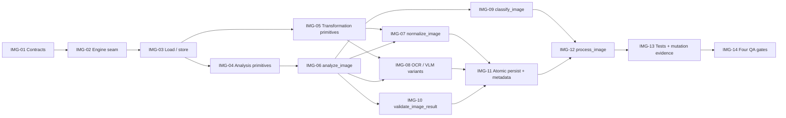

# WBS — procesador-image

| Field | Value |
|---|---|
| Document | WBS / task issues — `procesador-image` (`docflow.image`, `src/docflow/image/`) |
| Phase | **1 — Processors, independently** (`docs/plan/README.md` §5) |
| Derived from | `docs/plan/subplan-procesador-image.md` §4 (WBS table, order/waves) |
| Source of truth | `docs/plan/subplan-procesador-image.md` + `docs/plan/README.md`; task IDs and titles are preserved verbatim from the subplan table |
| ID range | `IMG-01` … `IMG-15` |
| Status | `IMG-01`…`IMG-12` **DONE** - contracts frozen, engine seam in place, images read, measured, classified, normalized, published atomically, validated and wired into one entry point; `IMG-13` … `IMG-15` `NOT_STARTED` |

This document expands — never replaces — the subplan WBS. Every issue traces back to exactly one row of `subplan-procesador-image.md` §4; no new scope is introduced here. `.github/copilot-instructions.md` governs code quality for every task.

## 1. Summary

| Field | Value |
|---|---|
| Phase | 1 — processors, independently (parallel with `pdf`, `ocr`, `llm`) |
| ID range | IMG-01 … IMG-15 |
| # tasks | 15 |
| Effort distribution | S ×7 (IMG-01, 03, 06, 09, 10, 14, 15) · M ×8 (IMG-02, 04, 05, 07, 08, 11, 12, 13) · L ×0 |
| Critical path | `IMG-01 → IMG-02 → IMG-03 → IMG-04 → IMG-06 → IMG-07 → IMG-11 → IMG-12 → IMG-13` |
| Definition of Done gate | `pytest` · `ruff check .` · `ruff format --check .` · `pylint src tests`, plus mutation-falsified invariant tests |

**Scope.** Turn one `ImageRequest` into one `ImageResult`: validate the input, compute technical metrics without mutating the source, produce `normalized.png` plus independent `ocr_ready.png` / `vlm_ready.png` variants, classify technically, validate the outputs and publish everything atomically inside the `image/` namespace with a `metadata.json`. OpenCV (Pillow as fallback) is reached only from `image/primitives/`. No OCR, no LLM, no source selection, no workflow decision.

## 2. Task issue index

| ID | Task (short) | Effort | Wave | Depends on | Deliverable artifact(s) | Issue file | Status |
|---|---|---|---|---|---|---|---|
| IMG-01 | Contract dataclasses | S | 1 - Contracts & seam | - | `ImageRequest`, `ImageResult`, `ImageMetrics`, `ImageOptions`, `ImageClassification`, `ImageValidation`, `ImageError` | this file §IMG-01 | DONE |
| IMG-02 | Image-ops primitives skeleton | M | 1 - Contracts & seam | IMG-01 | `image/primitives/` (OpenCV, Pillow fallback) | this file §IMG-02 | DONE |
| IMG-03 | Load/store primitives | S | 1 — Contracts & seam | IMG-02 | `load_image`, `save_image`, `get_image_metadata`, `get_image_dimensions` | this file §IMG-03 | DONE |
| IMG-04 | Analysis primitives | M | 2 — Analysis | IMG-03 | `calculate_*_score`, `detect_orientation`, `detect_skew_angle`, `detect_text_regions`, `calculate_text_coverage` | this file §IMG-04 | DONE |
| IMG-05 | Transformation primitives | M | 2 — Analysis | IMG-03 | `rotate_image`, `deskew_image`, `resize_image`, `convert_to_grayscale`, `binarize_image`, `denoise_image`, `sharpen_image`, `normalize_contrast`, `normalize_brightness`, `convert_image_format`, `compress_image` | this file §IMG-05 | DONE |
| IMG-06 | `analyze_image` → `ImageMetrics` | S | 2 — Analysis | IMG-04 | `analyze_image` (side-effect-free) | this file §IMG-06 | DONE |
| IMG-07 | `normalize_image` + `prepare_normalized_image` | M | 3 — Outputs | IMG-05, IMG-06 | `image/normalized.png` | this file §IMG-07 | DONE |
| IMG-08 | `prepare_image_for_ocr` / `prepare_image_for_vlm` | M | 3 — Outputs | IMG-05, IMG-06 | `image/ocr_ready.png`, `image/vlm_ready.png` (distinct pipelines) | this file §IMG-08 | DONE |
| IMG-09 | `classify_image` | S | 3 — Outputs | IMG-06 | `TEXT_IMAGE` / `VISUAL_IMAGE` / `MIXED_IMAGE` / `LOW_QUALITY` | this file §IMG-09 | DONE |
| IMG-10 | `validate_image_result` + typed error classification | S | 3 — Outputs | IMG-06 | `validate_image_result`, `ImageError` kinds | this file §IMG-10 | DONE |
| IMG-11 | Atomic persistence + `metadata.json` | M | 4 — Publish | IMG-07, IMG-08, IMG-10 | `image/.tmp/` → rename; `image/metadata.json` | this file §IMG-11 | DONE |
| IMG-12 | `process_image` entry point | M | 4 — Publish | IMG-09, IMG-11 | `process_image` | this file §IMG-12 | DONE |
| IMG-13 | Happy-path + invariant tests, mutation evidence | M | 5 — Verify | IMG-12 | `tests/`, mutation observations | this file §IMG-13 | NOT_STARTED |
| IMG-14 | Four QA gates clean | S | 5 — Verify | IMG-13 | QA gate output | this file §IMG-14 | NOT_STARTED |
| IMG-15 | Lab tool `scripts/tools/image.py` | S | 6 — Lab tool | IMG-14 | `scripts/tools/image.py` | this file §IMG-15 | NOT_STARTED |

## 3. Detailed issues

### IMG-01 — Contract dataclasses

- **Type:** Contracts
- **Effort:** S
- **Wave:** 1 — Contracts & seam
- **Depends on:** —
- **Blocks:** IMG-02
- **Objective:** Freeze the input/output vocabulary: `ImageRequest` in, `ImageResult` out, with metrics, classification, validation and typed error records. No defaults on required fields.
- **Scope / Deliverables:** `ImageRequest` (`image_path`, `output_dir`, `options`, `context`), `ImageOptions` (`normalize`, `prepare_for_ocr`, `prepare_for_vlm`, `correct_orientation`, `deskew`), `ImageContext` (`document_id`, `page_number`, `workflow_run_id`), `ImageResult` (`source`, `normalized`, `variants`, `metrics`, `classification`, `transformations`, `validation`, `artifacts`, `metadata`, `status`), `ImageSourceRef`, `ArtifactRef`, `ImageVariants`, `ImageMetrics` (`dimensions`, `resolution`, `format`, `size`, `quality{blur, sharpness, contrast, brightness, noise}`, `orientation`, `skew`, `text_regions[]`, `text_coverage`), `ImageClassification`, `ImageValidation` (`VALID` / `LOW_QUALITY` / `INVALID_OUTPUT` / `UNSUPPORTED` / `ERROR`), `ImageError` (`type`, `message`, `recoverable`, `metadata`) with kinds `INVALID_INPUT`, `UNSUPPORTED_FORMAT`, `DECODE_ERROR`, `TRANSFORMATION_ERROR`, `WRITE_ERROR`, `IO_ERROR`, `INTERNAL_ERROR`, `ImageMetadata`.
- **Out of bounds:** No engine import, no I/O, no processing logic; `context` is correlation only and must never be read as workflow state.
- **Acceptance criteria:**
  - Given the contract module, when a required field is omitted, then construction fails (no silent default).
  - Then `ImageClassification` and `ImageValidation` expose exactly the literals named in the subplan and nothing else.
- **Evidence / DoD:** Type hints complete; Google-style docstrings; `ruff check .` and `pylint src tests` clean.
- **Tags:** —

- **Status: DONE.** Evidence: `src/docflow/image/contracts.py` carries every type the scope
  names - `ImageRequest`, `ImageOptions`, `ImageContext`, `ImageResult`, `ImageSourceRef`,
  `ArtifactRef`, `ImageVariants`, `ImageMetrics`, `ImageQualityMetrics`, `ImageDimensions`,
  `TextRegion`, `ImageClassification`, `ImageValidationState`, `ImageError`, `ImageErrorType`,
  `ImageStatus`, `ImageArtifactKind`, `ImageMetadata`. Every required field rejects omission
  (`test_a_missing_required_option_is_rejected_instead_of_defaulted`), and the classification and
  validation literals are exactly the subplan's set and nothing else. The
  `ImageRequest → ImageResult` round-trip is proven with an in-memory fake
  (`tests/image/test_contracts.py`, 7 tests) before any engine exists. All four gates green.

### IMG-02 — Image-ops primitives skeleton

- **Type:** Skeleton
- **Effort:** M
- **Wave:** 1 — Contracts & seam
- **Depends on:** IMG-01
- **Blocks:** IMG-03
- **Objective:** Create the single seam that encapsulates the image engine (OpenCV first, Pillow as the documented drop-in alternative) with no engine silently substituted.
- **Scope / Deliverables:** `image/primitives/` package with the signatures of IMG-03, IMG-04 and IMG-05 declared; engine name and library version surfaced for `metadata.json`.
- **Out of bounds:** No OCR, Docling, LLM or workflow knowledge; no engine access from outside `image/primitives/`; no Pillow fallback activated implicitly when OpenCV is absent.
- **Acceptance criteria:**
  - Given the primitives package, when the engine is selected, then it is an explicit named choice recorded in metadata.
  - Given the engine is replaced by its alternative, then the contract of `ImageRequest → ImageResult` is unchanged.
- **Evidence / DoD:** Import of `image/primitives/` succeeds; engine/version retrieval exposed; four QA gates green on the skeleton.
- **Tags:** `# TODO: [MVP]` for real engine-availability probing.

- **Status: DONE.** Evidence: `src/docflow/image/primitives/engine.py` is the single module
  that names an image library. `EngineChoice` is an explicit named enum with no `AUTO` member,
  so there is no code path that picks an engine on the caller's behalf. The engine is resolved
  lazily through `engine_module`, which is why importing `image/primitives/` pulls in no engine
  at all (`test_a_clean_interpreter_imports_the_seam_without_an_engine` runs a fresh interpreter
  and asserts `cv2` and `PIL` are absent from `sys.modules`). An absent engine raises
  `ImageEngineNotAvailableError`, naming only its own library - never the other engine's - so
  the Pillow alternative is documented and reachable but never activated implicitly
  (`test_a_missing_engine_raises_instead_of_substituting_the_other`). `get_provenance` surfaces
  engine and library versions for `metadata.json`; a library reporting no version is an error,
  not a blank string. `failures.py` mirrors the contract's seven error kinds and
  `tests/image/primitives/test_failures.py` fails the moment the two lists drift. The signatures
  of IMG-03, IMG-04 and IMG-05 are declared in `load.py`, `analysis.py` and `transform.py`, each
  body raising `NotImplementedError` with a `# TODO: [MVP]` tag. Verified on this machine:
  OpenCV 5.0.0, numpy 2.3.5, Pillow present. All four gates green; `pylint src tests` 10.00/10.

- **Mutation evidence.** Six mutations applied, each detected, each restored:
  substituting the other engine when one is absent (5 tests fail), importing the engine eagerly
  at module level (3), returning a blank version instead of raising (1), adding an `AUTO`
  member (3), drifting the primitive vocabulary from the contract (2), dropping the path from a
  rendered failure (1).

### IMG-03 — Load/store primitives

- **Type:** Primitive
- **Effort:** S
- **Wave:** 1 — Contracts & seam
- **Depends on:** IMG-02
- **Blocks:** IMG-04, IMG-05
- **Objective:** Read an image and its technical facts without ever writing back to the source path.
- **Scope / Deliverables:** `load_image`, `save_image`, `get_image_metadata`, `get_image_dimensions` in `image/primitives/`.
- **Out of bounds:** No analysis scores, no transformation; `save_image` must never target `image_path`; no format guessing that silently coerces an unsupported file.
- **Acceptance criteria:**
  - Given a valid PNG, when `load_image` and `get_image_dimensions` run, then dimensions and format match the file.
  - Given `corrupt.png`, when `load_image` runs, then a typed `ImageError` (`DECODE_ERROR` or `UNSUPPORTED_FORMAT`) is produced instead of an exception escaping the contract.
- **Evidence / DoD:** Fixture-based unit test on `color_layout.png` and `corrupt.png`.
- **Tags:** —

- **Status: DONE.** Evidence: `src/docflow/image/primitives/load.py` implements
  `load_image`, `save_image`, `get_image_metadata` and `get_image_dimensions`. Both WBS acceptance
  criteria hold under **either engine**, not just OpenCV: dimensions and format match
  `color_layout.png`, and `corrupt.png` raises a typed `ImagePrimitiveError` of kind
  `DECODE_ERROR` rather than letting an engine exception escape. The four fixtures the subplan
  names are committed under `tests/fixtures/image/` and rebuilt by
  `scripts/tools/image_fixtures.py` (idempotent, `--check` reports drift).

  Three engine asymmetries were **measured rather than assumed**, and each is resolved here so
  nothing downstream knows which engine ran:
  1. OpenCV decodes to **BGR**, Pillow to **RGB**; the conversion happens once, inside
     `load_image`, and a test asserts the two engines produce byte-identical pixels.
  2. OpenCV signals a decode failure by returning **`None`** while writing the reason to file
     descriptor 2; Pillow raises. Both become the same typed error, and the descriptor noise is
     silenced because the same information travels through the contract. A test asserts the noise
     is gone — without it every corrupt-file test printed a `libpng error` line that read like a
     failure.
  3. OpenCV exposes only a yes/no header check, so identifying a format through it would mean
     falling back to the **file extension**. The format is read from the file's magic bytes
     instead, which is engine-independent and the only answer that matches the header rather than
     the name.

  The "never write to the source" rule is implemented in its **enforceable** form: `save_image`
  refuses an occupied destination. The plan states the rule as "must never target `image_path`",
  but a primitive holding an array cannot prove which file the array came from, so a guard
  comparing against a caller-supplied source path would pass while the source was destroyed.

- **Defects found and fixed during the task.** (1) A hand-copied `IMREAD_GRAYSCALE` of `-1` was
  in fact `IMREAD_UNCHANGED`, so grayscale decoding returned three channels under OpenCV and one
  under Pillow — caught by the cross-engine test, invisible to a per-engine test. (2) The first
  implementation read OpenCV's format from the extension, contradicting its own docstring and
  reporting a misnamed file as what it was called — caught by a test, then fixed by reading magic
  bytes. (3) The `libpng` stderr leak described above.

- **Mutation evidence.** Seven mutations applied, each detected, each restored: dropping the
  BGR→RGB conversion (3 tests fail), using `IMREAD_UNCHANGED` (2), allowing `save_image` to
  overwrite (3), reporting a corrupt file as `UNSUPPORTED_FORMAT` (1), reading the format from
  the extension (2), returning 0x0 instead of raising on a shapeless array (1), promoting a
  grayscale save to RGB (1).

### IMG-04 — Analysis primitives

- **Type:** Primitive
- **Effort:** M
- **Wave:** 2 — Analysis
- **Depends on:** IMG-03
- **Blocks:** IMG-06
- **Objective:** Compute every technical signal the processor needs, with no side effects on the image.
- **Scope / Deliverables:** `calculate_blur_score`, `calculate_sharpness_score`, `calculate_contrast_score`, `calculate_brightness_score`, `calculate_noise_score`, `detect_orientation`, `detect_skew_angle`, `detect_text_regions`, `calculate_text_coverage` in `image/primitives/`.
- **Out of bounds:** No mutation of the input array; no decision of OCR/VLM readiness; no threshold-driven routing.
- **Acceptance criteria:**
  - Given `skewed_text.png`, when `detect_skew_angle` runs, then a non-zero angle is reported and the input bytes are unchanged.
  - Given `color_layout.png`, when `calculate_text_coverage` runs, then the value is a fraction between 0 and 1 inclusive.
- **Evidence / DoD:** Fixture-based unit tests; repeated runs produce the same values for the same input and library version.
- **Tags:** `# TODO: [MVP]` on provisional metric thresholds.

- **Status: DONE.** Evidence: `src/docflow/image/primitives/analysis.py` implements all nine
  primitives. Both WBS acceptance criteria hold: `detect_skew_angle` reports a non-zero angle on
  `skewed_text.png` with the fixture's hash unchanged, and `calculate_text_coverage` returns a
  fraction in `[0, 1]`. The angle is not merely non-zero - it reads **+4.00** on a fixture the
  generator rotated by exactly 4.0°, and rotating by the detected angle straightens the page to
  within 0.5°, so the reading is a usable correction rather than a number of the right magnitude.

  **Metrics are measurements, not placeholders.** Each score is tested in the direction it claims
  to measure: blurring the image lowers the Laplacian variance and the Tenengrad score, adding
  grain raises the noise estimate, a flat page scores no contrast and a known grey scores its own
  value. A test asserting only that a float came back would pass on a hardcoded constant, and one
  mutation - replacing the blur score with a constant - confirms the difference.

  **Side-effect freedom is structural.** The module imports no file-writing API at all, and a test
  asserts both that a fixture's hash is unchanged and that the forbidden names are absent from the
  source, so the guarantee does not depend on a test having exercised the right path.

- **Two limits of the problem, recorded rather than hidden.**
  1. **Orientation is coarse by nature.** The ink projection of a 180-degree turn is identical to
     the upright one, so a half-turned page reads as upright. Resolving it needs a script detector
     or a classifier and this processor is forbidden both. The narrower answer is reported, and a
     test pins the ambiguity so it stays a documented property instead of being rediscovered as a
     bug.
  2. **Skew is a bounded reading.** It is the tilt of the ink rectangle, folded into `(-45, 45]`,
     so it is meaningful for the residual rotations a scanner produces rather than for arbitrary
     angles. The sign was established by experimenting with the engine rather than by reasoning:
     the reading moves *opposite* to the rotation applied, and a test now fails loudly on a sign
     flip because a flipped correction would double the tilt instead of removing it.

- **One engine boundary, made explicit.** The primitives resolve engine operations through
  `engine_operation`, so a missing operation is a typed `ImageEngineCapabilityError` naming the
  operation and the engine. This matters because the two engines are not equivalent: **OpenCV is an
  image-processing library and Pillow is a codec**, so Pillow provides none of `cvtColor`,
  `Laplacian`, `Sobel`, `filter2D`, `adaptiveThreshold`, `morphologyEx` or `minAreaRect`. Every
  metric in this module therefore requires OpenCV. The plan requires that a swap change only
  `primitives/` and never the contract; it does not require every operation to exist under every
  engine. Reimplementing filtering on raw arrays to close the gap is the "scope creep into a full
  image-processing library" the subplan lists as a risk, so the gap is reported as a type instead.

- **Defects found and fixed during the task.** (1) A stray `import cv2` at module level in
  `analysis.py` that nothing used - it would have broken the package-level laziness invariant that
  `GEN-01` guards, and it is now caught by a test that imports the primitives in a fresh
  interpreter. (2) Two of `IMG-02`'s own laziness tests asserted `loaded_engines() == []` against
  the *current* process, so they passed only while no other test loaded an engine and would have
  gone on passing for the wrong reason; they now run in a subprocess. (3) A duplicated local
  `TextRegion` in `analysis.py` with an `int` bbox, contradicting the contract's `float` bbox - the
  primitives now import the contract's type, following the precedent `pdf/primitives/text.py` set
  with `TextBlock`.

- **Mutation evidence.** Eight mutations applied, each detected, each restored: blur score replaced
  by a constant (2 tests fail), luminance replaced by a crude channel mean (29), skew pinned to
  zero (3), skew sign flipped (3), orientation pinned upright (2), coverage pinned to 0.5 (1),
  noise estimate pinned to zero (1), capability gap silenced instead of raised (2).

### IMG-05 — Transformation primitives

- **Type:** Primitive
- **Effort:** M
- **Wave:** 2 — Analysis
- **Depends on:** IMG-03
- **Blocks:** IMG-07, IMG-08
- **Objective:** Provide the raw transformation vocabulary the normalization and variant pipelines compose.
- **Scope / Deliverables:** `rotate_image`, `deskew_image`, `resize_image`, `convert_to_grayscale`, `binarize_image`, `denoise_image`, `sharpen_image`, `normalize_contrast`, `normalize_brightness`, `convert_image_format`, `compress_image` in `image/primitives/`.
- **Out of bounds:** No pipeline composition or variant naming here (that is IMG-07 / IMG-08); no in-place overwrite of the input file; no transformation applied without being requested by the caller.
- **Acceptance criteria:**
  - Given a colour input, when `convert_to_grayscale` runs, then the output image has a single channel and the source file is unchanged.
  - Given a skewed image, when `deskew_image` runs with the detected angle, then the output is written to a distinct path.
- **Evidence / DoD:** Fixture-based unit tests per transformation group; input hash unchanged assertion.
- **Tags:** —

- **Status: DONE.** Evidence: `src/docflow/image/primitives/transform.py` implements all eleven
  primitives. Both WBS acceptance criteria hold: `convert_to_grayscale` yields a single channel with
  the source file's hash unchanged, and `deskew_image` composes over a distinct output array with
  nothing written. The deskew criterion is stated as the *correction* rather than as a non-zero
  reading: feeding the detector's angle straight through takes `skewed_text.png` from `+4.00` to
  `0.00`, and inverting the sign doubles the tilt instead of removing it.

  Every transform is asserted to return a **new** array and leave its argument untouched, for all
  eleven primitives in one parametrised guard so a new primitive cannot be added without coverage.
  The module is separately asserted to contain no route to the filesystem at all, so "the source is
  never written" does not rest on a test having exercised the right branch.

- **Two defects found and fixed during the task, both by tests rather than by review.**
  1. **Channel-order asymmetry.** The seam normalises every image to RGB and OpenCV's encoders
     expect BGR, so encoding converted the channels - but `imdecode` hands back BGR and nothing
     converted it back. Every file written through `convert_image_format` or `compress_image` had
     red and blue swapped. Each operation was individually correct, which is why no per-operation
     test found it; a **lossless PNG round-trip equality** test did. Both conversions now exist
     explicitly and are named for the direction they travel.
  2. **Engine arguments wrong in three places.** A hand-copied `IMREAD_GRAYSCALE`-style guess
     produced parameters named for a bilateral filter that the non-local-means denoiser does not
     take (its second strength parameter is the colour strength and its fourth is
     `searchWindowSize`, which must be an odd integer), and `imencode` was called as
     `(image, extension)` rather than the engine's actual `(extension, image)`. All three were
     caught by running the primitives against the fixtures rather than by reading signatures.

- **The destructive operation is pinned where it is tested.** `binarize_image` drops colour for
  good, which the plan's risk table names as the reason `IMG-07` only binarizes when a metric
  justifies it. A test asserts the result is single-channel with at most two levels, so the loss is
  a documented property of the primitive rather than something discovered downstream.

- **Nothing is clamped.** A threshold outside 0-255, a compression quality outside 1-100, a
  non-positive resize dimension, a brightness target outside the luminance range and an unknown
  container are all refused as typed `TRANSFORMATION_ERROR`s. Clamping would substitute a value the
  caller never asked for, which is the "no silent stand-in" rule applied to a knob. The unknown
  container is checked before the call because the engine's own answer is a native exception, not
  something a caller can classify.

- **`BINARIZATION_THRESHOLD` moved.** It was declared in `analysis.py`, which never read it: a
  transformation's parameter sitting beside the numbers meant to justify that transformation. It now
  lives in `transform.py` with the other thresholds.

- **Mutation evidence.** Ten mutations applied, each detected, each restored: transforms mutating
  their input (1 test fails), the RGB→BGR encode conversion removed (2), the BGR→RGB decode
  conversion removed (2), inverted deskew sign (1), out-of-range threshold clamped (1), out-of-range
  quality clamped (1), brightness offset unclamped so a bright page wraps to black (1), resize
  dimension unguarded (1), unknown container passed to the engine (1), inverted skew reading (4).

### IMG-06 — `analyze_image` → `ImageMetrics`

- **Type:** Primitive
- **Effort:** S
- **Wave:** 2 — Analysis
- **Depends on:** IMG-04
- **Blocks:** IMG-07, IMG-09, IMG-10
- **Objective:** Aggregate the analysis primitives into one side-effect-free `ImageMetrics` snapshot of the input.
- **Scope / Deliverables:** `analyze_image` producing `ImageMetrics` (dimensions, resolution, format, size, quality scores, orientation, skew, text regions, text coverage).
- **Out of bounds:** No file writes, no normalization, no classification, no OCR/VLM decision; never return a placeholder where a real measurement is expected.
- **Acceptance criteria:**
  - Given a valid image, when `analyze_image` runs, then every `ImageMetrics` field carries a measured value.
  - Given the same image and library versions, when `analyze_image` runs twice, then the metrics are identical.
- **Evidence / DoD:** Unit test asserting metric equality across two runs and absence of filesystem writes.
- **Tags:** `# TODO: [MVP]` for concrete `LOW_QUALITY` threshold constants.

- **Status: DONE.** Evidence: `src/docflow/image/primitives/analyze.py` implements `analyze_image`,
  aggregating the IMG-04 primitives into one `ImageMetrics`. Both WBS acceptance criteria hold:
  every field carries a measurement, and two runs on the same image produce identical metrics -
  checked in-process, across a re-decode, and **in a fresh interpreter**, since the property is
  about a clean run rather than about one that happens to reach the same answer twice.

  "Every field carries a measured value" is the easiest criterion in this project to satisfy
  dishonestly: a snapshot of zeroes populates every field. The test therefore names the value or
  range each field must hold, and a second test asserts the quality scores **differ between
  images**, which a snapshot that hardcoded one image's numbers would fail.

  The new module sits in `image/primitives/` rather than in the processor's entry points because
  `IMG-06` is a primitive, and putting it beside `analysis.py` lets the processor import a real
  function when `IMG-12` composes one. The plan names no module for it; this is the reading of
  "in `image/primitives/`" that the WBS's sibling tasks use.

- **`ImageFileFacts` gained `resolution`.** `ImageMetrics` requires a DPI and the facts record
  carried only format and size. It is read from the **raw header**, not from the engine, because
  OpenCV exposes no way to read a resolution at all - delegating would make a recorded number depend
  on which engine ran, which is the drift the seam exists to prevent. PNG's `pHYs` and JPEG's JFIF
  segment are parsed directly; the reader was checked against Pillow's answer for every case before
  being adopted. TIFF and BMP declare a resolution too and are **not** yet read - tagged
  `# TODO: [MVP]`, since a scanner that writes TIFF currently reports `None`.

  A file declaring a **non-square** resolution also reports `None`. The contract carries one
  integer, and returning either axis would silently assert square pixels when the file says
  otherwise - the "no silent stand-in" rule applied to a measurement that has no honest single
  value.

- **A duplicated contract record was found and removed.** `ImageDimensions` was declared twice -
  once in `contracts.py` and once in `load.py` - and the two classes were not equal, so
  `analyze_image`'s `dimensions` compared unequal to the contract's own type despite printing
  identically. `load.py` now imports the contract's record, which is the precedent
  `pdf/primitives/text.py` set with `TextBlock` and the fix already applied to `TextRegion` in
  IMG-04. The defect survived IMG-03 and IMG-04 because no test had yet compared a primitive's
  return value against the contract type.

- **Mutation evidence.** Nine mutations applied; **four survived the first run and each closed a
  real gap in the guard**, which is the useful part of the result:
  1. `noise=0.0` as a placeholder survived because the assertion was `>= 0.0` and the real estimate
     is small but positive. Tightened to `> 0.0`.
  2. The centimetre-to-inch conversion survived because no writer here emits centimetres. Closed by
     building a JFIF segment by hand.
  3. The `pHYs` unit check survived for the same reason. Closed by inserting a unit-less chunk by
     hand.
  4. The non-square rejection survived because only square resolutions were exercised. Closed.

  After closing the gaps, all nine are detected: placeholder quality value (3 tests fail), dropped
  resolution (3), dropped skew (4), coverage detached from its regions (4), tuple instead of the
  contract's list (2), fabricated resolution (2), skipped unit conversion (1), skipped unit check
  (1), non-square accepted (1).

### IMG-07 — `normalize_image` + `prepare_normalized_image`

- **Type:** Primitive
- **Effort:** M
- **Wave:** 3 — Outputs
- **Depends on:** IMG-05, IMG-06
- **Blocks:** IMG-11
- **Objective:** Produce the baseline `image/normalized.png` by applying only the transformations justified by metrics plus explicit configuration, and record each applied transformation.
- **Scope / Deliverables:** `normalize_image`, `prepare_normalized_image`, population of `ImageResult.transformations`.
- **Out of bounds:** No OCR/VLM-specific preparation; no unrequested enhancement; no silent default transformation set; no write outside `image/`.
- **Acceptance criteria:**
  - Given a valid PNG and `normalize=true`, when normalization runs, then `image/normalized.png` exists and `transformations` lists every applied operation.
  - Given `normalize=false`, then no normalized artifact is produced and no error is raised.
- **Evidence / DoD:** Scenario test for the "normalize a valid color input" acceptance criterion.
- **Tags:** `# TODO: [MVP]` for the deferred transformation catalogue.

- **Status: DONE.** Evidence: `src/docflow/image/primitives/normalize.py` implements
  `normalize_image` and `prepare_normalized_image`. Both WBS acceptance criteria hold: with
  `normalize=true` the artifact exists and `transformations` lists every applied operation, and with
  `normalize=false` nothing is produced and nothing is raised. The transformation list is
  cross-checked against the pixels rather than against a second call to the pipeline - a skewed page
  reports the deskew *and* comes out measurably straighter - so the record cannot be decorative.

- **Everything applied is justified, and the tests say which way.** The plan's risk table names
  "over-eager enhancement degrades information" and prescribes "apply transformations only when
  justified by metrics + explicit options". The suite therefore exercises all four combinations of
  "flag set" and "correction needed": each correction fires only when both are true, and a page that
  is already fine is returned **unchanged**, asserted with array equality rather than by checking
  the transformation list alone.

- **A quarter turn needed a new primitive.** `rotate_image` keeps the input's dimensions, which is
  right for a small tilt but means a 90-degree correction **crops** the page to its original frame
  instead of reorienting it. `turn_quarter` was added to `transform.py` for it, and it is the one
  primitive there that takes no engine: a quarter turn is a permutation of the pixel grid, not a
  re-sampling, so routing it through a library would add a dependency to buy nothing.

- **The thresholds were calibrated by measurement, not by taste.** Brightness 100 and contrast 45.
  The committed fixtures measure 183/220/212 brightness; scaling one down gives 146, 110, 91, 73 for
  factors of 0.8 down to 0.4. Contrasts are 78-98 for the fixtures, 49 for a half-exposed page and
  39 for a washed-out one. The first draft used 50 and 25, and a page at brightness 67 was passed
  through untouched - the probe is why it does not anymore.

- **Two honest limits, each pinned by a test rather than hidden.**
  1. **The orientation direction is not decided.** A quarter-turn reading says the page is turned
     but not which way: turning it either way leaves the ink projecting along the rows, which is all
     the detector can see. Correcting the direction would take the page's content, and reading it
     means OCR or a classifier, both out of bounds. Only the magnitude is corrected, and the test
     asserts the *shape* is restored rather than claiming the page is upright.
  2. **The contrast stretch recovers almost nothing** on a genuinely washed-out page - measured,
     39.05 before and 39.70 after. It is applied because the measurement says the page needs it and
     because it costs nothing, and it is recorded as *applied* rather than as *successful*. A test
     fails if it ever becomes effective, so the claim gets revisited instead of quietly overstated.

- **Brightness is re-measured on the corrected pixels.** The contrast stretch lifts the mean a
  little, so an offset decided from the stale snapshot would be applied to a page that no longer
  needs it. That is not observable on an ordinary page - both readings agree - so a constructed one
  sits in the window where they differ: brightness 95.22 before the stretch and 103.69 after,
  against a threshold of 100.

- **Mutation evidence.** Twelve mutations applied; **one survived the first run and closing it
  required the constructed page above**, which is the useful part of the result. After closing it,
  all twelve are detected: corrections applied regardless of the options (1 test fails), the
  pipeline running when `normalize` is false (1), the deskew flag ignored (1), the orientation flag
  ignored (1), a bright page darkened (4), brightness decided on the stale snapshot (1), the
  contrast correction skipped (3), an unrequested artifact published (1), the transformation record
  dropped (2), the artifact reference built from the request instead of the file (1), a quarter turn
  made a no-op (3), the wrong way turned (3).

### IMG-08 — `prepare_image_for_ocr` and `prepare_image_for_vlm`

- **Type:** Primitive
- **Effort:** M
- **Wave:** 3 — Outputs
- **Depends on:** IMG-05, IMG-06
- **Blocks:** IMG-11
- **Objective:** Build two genuinely independent preparation pipelines, because the OCR-optimal image is not assumed to be the VLM-optimal image.
- **Scope / Deliverables:** `prepare_image_for_ocr` (may grayscale, deskew, binarize, raise contrast) writing `image/ocr_ready.png`; `prepare_image_for_vlm` (preserves colour, layout and visual context) writing `image/vlm_ready.png`.
- **Out of bounds:** The VLM pipeline must never alias or return the OCR path; no decision of which variant is used downstream; no automatic region selection (only explicitly requested crops).
- **Acceptance criteria:**
  - Given `color_layout.png` with `prepare_for_ocr=true` and `prepare_for_vlm=true`, when both run, then two distinct files exist and the VLM variant preserves colour channels while the OCR variant may be grayscale.
  - Given only `prepare_for_vlm=true`, then no `ocr_ready.png` is produced.
- **Evidence / DoD:** Scenario test for independent variants plus the OCR≠VLM invariant (IMG-13, invariant 2).
- **Tags:** `# TODO: [MVP]` on binarization thresholds.

- **Status: DONE.** Evidence: `src/docflow/image/primitives/variants.py` implements both pipelines and
  `publish_variants`; `src/docflow/image/primitives/publishing.py` holds the write both this and
  IMG-07 use. Both WBS acceptance criteria hold, and the plan's named mutation for this task -
  *"make `prepare_image_for_vlm` alias/return the `ocr_ready` path"* - is falsified by **9 tests**,
  the widest blast radius of any mutation in the project so far.

- **A real defect the smoke run found, in the same family as the named mutation.** Preparing an
  unrequested variant returned **the input image**, which is indistinguishable from a prepared one,
  so a caller doing the obvious thing - publishing whatever it was handed - wrote an
  `ocr_ready.png` nobody had asked for. It was not a missing assertion: the first draft of the test
  suite asserted the file was absent and would have passed, because the test happened not to publish.
  The fix was structural - `None` now encodes "not requested" and is the only thing
  `publish_artifact` refuses to write - so the mistake is unavailable rather than merely tested for.

- **The OCR pipeline's steps and their order were each measured.**
  1. **Grayscale first**, because every later step is a luminance operation.
  2. **Denoise conditionally, before the threshold.** At a standard deviation of 18 the raw grained
     page yields **one merged region covering 0.249 of the frame**, while the denoised one yields two
     covering 0.210 - essentially the clean page's 0.202. After binarization the difference
     disappears, so this step earns its place only ahead of the threshold. The threshold itself is
     calibrated: the fixtures measure 0.57, 1.48 and 0.21, synthetic grain crosses 3.0 from about the
     fourth step of a rising scale.
  3. **Deskew before binarization**, so the rotation interpolates eight-bit pixels rather than
     two-valued ones.
  4. **Binarize last**, because it is the one step that destroys information - measured, it doubles
     the contrast-limited signal (97.72 to 122.35) and produces more text regions, which is the whole
     point of the variant.

- **The VLM pipeline is one step, and the restraint is the point.** It deskews and does nothing else.
  No grayscale, no binarization, no denoising, no contrast stretch, no brightness shift - each
  rejected for a measured reason rather than by omission: denoising **lowers the blur score**
  (2529.8 to 2446.6), which is the sharpness a model reads edges with; the contrast stretch moves a
  washed-out page's contrast only from 39.05 to 39.70; and re-centring a page's mean would turn paper
  grey. The pipeline's *source* is asserted to contain none of those calls, because a behavioural
  test can miss the destruction on a page where it happens to be invisible.

- **A defect in IMG-03's decoder, found because the artifacts made it matter.** `load_image` read
  every file with `IMREAD_COLOR`, so an `ocr_ready.png` this processor had just written from its
  grayscale stage came back as three channels - an artifact unreadable as what it is. The OpenCV path
  now uses `IMREAD_UNCHANGED` when the caller has no preference, and the Pillow path keeps Pillow's
  own single-channel modes rather than collapsing them all to `L` (which would rescale the wider
  ones). Both were needed: fixing only OpenCV left the mutation alive, because the channel-count test
  exercised one engine; it now round-trips through **all four writer/reader engine combinations**.

- **Mutation evidence.** Ten mutations applied; **one survived the first run**, and closing it is the
  two-engine test above. After closing it, all ten are detected: the VLM pipeline aliased onto the OCR
  one (9 tests fail), colour dropped from the VLM variant (4), the VLM variant binarized (9), the
  grayscale step skipped (2), denoising applied unconditionally (1), binarization moved ahead of
  denoising (1), an unrequested variant publishing the input again (3), the VLM flag ignored (2),
  single-channel promotion on read under OpenCV (2), and the same under Pillow (1).

### IMG-09 — `classify_image`

- **Type:** Primitive
- **Effort:** S
- **Wave:** 3 — Outputs
- **Depends on:** IMG-06
- **Blocks:** IMG-12
- **Objective:** Assign the descriptive technical classification from metrics alone.
- **Scope / Deliverables:** `classify_image` returning exactly one of `TEXT_IMAGE` / `VISUAL_IMAGE` / `MIXED_IMAGE` / `LOW_QUALITY`.
- **Out of bounds:** No routing decision, no read of a workflow flag, no aggregate confidence score substituting per-measurement evidence; thresholds must be explicit named constants.
- **Acceptance criteria:**
  - Given metrics below the quality thresholds, when `classify_image` runs, then the result is `LOW_QUALITY`.
  - Given only `ImageMetrics` as input, then the returned value is always one of the four literals.
- **Evidence / DoD:** Unit test over crafted metric vectors including the `LOW_QUALITY` boundary.
- **Tags:** `# TODO: [MVP]` on the provisional threshold values.

- **Status: DONE.** Evidence: `src/docflow/image/primitives/classify.py` implements `classify_image`
  from `ImageMetrics` alone. Both WBS acceptance criteria hold: a page below any quality threshold is
  `LOW_QUALITY` (parametrised once per measurement that can reject a page, so an implementation
  checking only sharpness fails), and the result is always one of the four literals - asserted on the
  fixtures, on the corpus, and on **four hundred randomised quality vectors plus two hundred
  randomised region layouts**.

- **The discriminator was measured, and the first three candidates failed.** The classification turns
  on **region height**: lines of text produced regions 7 to 24 pixels tall across every case probed,
  while figures, logos and solid bars produced 40 to 420, with nothing in between. The plausible
  alternatives were tried first and rejected on evidence:
  1. **Ink density inside a region** does not separate them - lines of text measured 0.28 to 1.0 and
     a chart's bars measured 0.808, the same range.
  2. **Region area or span** does not either: a widely spaced line covers 0.013 of the frame, exactly
     like a small detail inside a figure.
  3. **Colour** is unavailable in principle. `ImageMetrics` has no saturation measure, so no rule may
     depend on one.

- **A calibration error this task made and its own test caught.** The contrast floor was first set to
  30 from synthetic pages alone. **Four of the twenty-six real extracted JPEGs in the corpus measure
  18 to 28** - ordinary pages, every one of them classified unusable. The floor is now 10, and
  `test_an_ordinary_real_image_is_not_written_off_as_low_quality` runs the whole corpus and fails if
  it drifts back. The sharpness floor of 1000 was checked the same way and survived: a page blurred
  beyond recognition scores 177, the lowest real image scores 1019, and the fixtures score 35233.

- **The thresholds that overlap other modules are deliberately different, and the difference is
  documented in the constants.** `MIN_LEGIBLE_CONTRAST` is 10 where
  `normalize.MIN_ACCEPTABLE_CONTRAST` is 45, because one asks whether a page is usable and the other
  asks whether a *correction* is worth applying - a page at 36 needs improvement and is not unusable.
  `MAX_UNUSABLE_NOISE` is 5.0 where `variants.MAX_ACCEPTABLE_NOISE` is 3.0, because one asks whether
  grain has replaced the content and the other whether denoising is worth a step.

- **Two limits of the measurements, both pinned as tests.** The classifier sees *markings*, not
  *characters*: a chart whose bars are 15 pixels tall has the shape of a line of text and reads as
  `TEXT_IMAGE`. And a blank page is `LOW_QUALITY` rather than `TEXT_IMAGE`, because zero contrast and
  zero edge structure is the clearest case of nothing to read. What a page *means* is the OCR
  processor's business.

- **Mutation evidence.** Ten mutations applied; **two survived the first run**, and closing each
  required a crafted case the suite had missed:
  1. Removing the dominance branch entirely survived, because the only `MIXED_IMAGE` case went
     through it and the default return produced the same answer. Closed by a page where the dominance
     rule and the area rule would agree but the precedence is observable - a short region filling 75%
     of a wide strip.
  2. Removing the per-region ink floor survived, because every crafted region was either properly
     inked or tall. Closed by a page of six short, empty slivers.

  After closing them, all ten are detected: the quality evidence collapsed into an average (9 tests
  fail), only sharpness checked (4), the contrast floor raised back to the value real images failed
  (1), the sharpness floor dropped (1), `VISUAL_IMAGE` unreachable (5), region height ignored (7),
  `MIXED_IMAGE` unreachable through the dominance branch (1), the quality test moved after the shape
  tests (9), the ink floor ignored (1), `TEXT_IMAGE` unreachable (3).

### IMG-10 — `validate_image_result` and typed error classification

- **Type:** Validation
- **Effort:** S
- **Wave:** 3 — Outputs
- **Depends on:** IMG-06
- **Blocks:** IMG-11
- **Objective:** Validate the produced result structurally and classify failures into typed `ImageError` records with a `recoverable` flag — never a silent stand-in.
- **Scope / Deliverables:** `validate_image_result`, error mapping to `INVALID_INPUT`, `UNSUPPORTED_FORMAT`, `DECODE_ERROR`, `TRANSFORMATION_ERROR`, `WRITE_ERROR`, `IO_ERROR`, `INTERNAL_ERROR`, and the descriptive states `VALID` / `LOW_QUALITY` / `INVALID_OUTPUT` / `UNSUPPORTED` / `ERROR`.
- **Out of bounds:** Validation states are descriptive only and must never be converted into workflow actions; errors are returned in the result, not thrown across the contract.
- **Acceptance criteria:**
  - Given `corrupt.png`, when `process_image` runs, then the result carries an `ImageError` of type `DECODE_ERROR` or `UNSUPPORTED_FORMAT` with `recoverable=false`.
  - Given an expected artifact is missing, then the validation state is `INVALID_OUTPUT` with a typed error naming it.
- **Evidence / DoD:** Scenario test for the "reject an invalid input with a typed error" acceptance criterion.
- **Tags:** `# TODO: [MVP]` for richer input validation.

- **Status: DONE.** Evidence: `src/docflow/image/primitives/validation.py` implements
  `validate_image_result`, `as_image_error` and `missing_artifact_error`. Both WBS acceptance
  criteria hold: a corrupt input arrives as an `ImageError` of type `DECODE_ERROR` or
  `UNSUPPORTED_FORMAT` with `recoverable=False`, and a missing expected artifact gives the state
  `INVALID_OUTPUT` with a typed error naming it. All five states are asserted **reachable**, since a
  validator that only ever returned `VALID` would satisfy most of a case-by-case suite.

- **The artifacts arrive as named parameters, not as a dictionary.** The first draft took a mapping
  keyed by capability name. That is shorter to write and it reintroduces the exact failure this module
  exists to catch: a typo in a key becomes indistinguishable from "not published". A test asserts each
  artifact field is a required parameter with no default, so an artifact cannot be omitted from
  validation by forgetting to pass it.

- **The pairing lives in one table.** `ARTIFACT_CAPABILITIES` maps each capability to the request
  option that asks for it and the result field its artifact lands in, following the lesson the PDF
  processor's validator records: deriving the missing artifacts and the unsatisfied capabilities
  separately and pairing them afterwards mispairs them as soon as the two lists differ in length,
  which happens the moment a capability was not requested. A mutation that paired every capability
  with the first field is caught by 2 tests.

- **The error vocabulary is derived, not restated.** `CONTRACT_ERROR_TYPES` reads the literal through
  `typing.get_args(ImageErrorType)`. The primitive layer spells the same seven names out for the
  opposite reason - it must not depend on the contract's shape - and a test compares the two lists. A
  *third* copy here would have been pure duplication with nothing to catch a divergence, so it was
  removed rather than suppressed when `duplicate-code` reported it.

- **A recoverable failure and a missing artifact are two findings, and both are reported.** The
  missing list is computed before the state is decided and travels in every branch. Discarding it
  because an unrecoverable failure outranks it would throw away the one piece of information a caller
  needs in order to act, and a mutation that discarded it is caught.

- **Two layers refuse an invented error kind, and the tests say which is which.** `ImagePrimitiveError`
  validates its own `error_type` at construction, so the ordinary route cannot carry a kind the
  contract does not define; the narrowing guard inside `as_image_error` is defence in depth, reachable
  only by forging an object past construction. Both are tested, and the first draft of the test
  asserted the wrong layer - which is what the failure showed.

- **Mutation evidence.** Eleven mutations applied, all detected on the first run: every run reported
  valid (9 tests fail), an unrequested artifact's absence treated as a gap (13), every capability
  paired with the first field (2), a low-quality input called valid (2), an unreadable input called
  `ERROR` instead of `UNSUPPORTED` (7), a missing artifact marked recoverable (1), a recoverable
  failure reported as valid (3), the missing list dropped when a failure outranks it (1), the
  primitive's own message replaced by a generic one (1), the path dropped from the metadata (1), the
  wrong error kind named for a missing artifact (2).

### IMG-11 — Atomic persistence and `metadata.json`

- **Type:** Validation
- **Effort:** M
- **Wave:** 4 — Publish
- **Depends on:** IMG-07, IMG-08, IMG-10
- **Blocks:** IMG-12
- **Objective:** Publish every artifact through `image/.tmp/` → validate → rename, and emit a `metadata.json` that records processor and library versions, input/output metrics and timing.
- **Scope / Deliverables:** The atomic publication helper, `image/metadata.json` generation, and the guarantee that a failed run leaves no partially valid artifact visible.
- **Out of bounds:** No final-named artifact written before validation; no writes to `source/`, `render/`, `native_text/`, `ocr/` or `llm/`; no placeholder metadata values.
- **Acceptance criteria:**
  - Given a forced failure after transformation, when `image/` is inspected, then no `.tmp` files and no final-named artifacts remain.
  - Given a successful run, then `metadata.json` is parseable and contains processor, library versions, transformations and metrics.
- **Evidence / DoD:** Failure-path test plus the namespace-ownership invariant (IMG-13, invariant 3); metadata schema assertion.
- **Tags:** `# TODO: [RELEASE]` for crash-safety guarantees at filesystem level.

- **Status: DONE.** Evidence: `src/docflow/image/primitives/atomic.py` implements the staging,
  publication, cleanup and payload helpers; `publish_artifact` in
  `src/docflow/image/primitives/publishing.py` now writes through the staging directory; tests live
  in `tests/image/primitives/test_atomic.py` (24 tests). Both WBS acceptance criteria hold: a forced
  failure leaves the namespace empty - asserted against a real encoding failure, not a simulated one
  - and a successful run's `metadata.json` parses back and carries the processor, the library
  versions, the transformations and the metrics.

- **The staging form is `image/.tmp/<name>`, and for images that is the only one that works.** The
  PDF processor stages a `page.png.tmp` sibling, and the first draft here did the same for symmetry.
  It cannot work: `save_image` infers the encoder from the destination's **extension**, so a staged
  `normalized.png.tmp` is rejected as an unsupported format before a byte is written. The directory
  is what marks a file as not-an-artifact, and keeping the final name intact is what lets the writer
  choose its codec. `temp_path` therefore changes the parent and never the name.

- **A successful run must prune the staging directory, or success and failure look identical.** The
  rename empties `.tmp` but leaves the directory behind, and the acceptance criterion is phrased as
  "inspecting the namespace finds no `.tmp` files" - an empty `.tmp/` is indistinguishable from the
  residue of a run that died. Six tests failed on this before it was fixed, which is the useful
  direction: the tests were right and the implementation was incomplete. Both the success path and
  the failure path now call `prune_staging_directory`.

- **`TEMP_SUFFIX` is kept even though nothing writes it any more.** A file staged by an interrupted
  earlier build, or by a caller staging its own write, carries that suffix; a cleanup that knew only
  about the directory would walk past it and leave it for a reader to find. `discard_staged` sweeps
  both forms, and a mutation that disables either sweep is caught.

- **The required-key guard was extracted so it could be falsified at all.** It began inline in
  `build_metadata_payload`, and the mutation battery found it *unreachable*: the literal the function
  returns carries all seven keys by construction, so no caller could trigger it and no test could
  kill a mutant that disabled it. Extracting `require_metadata_keys` makes the invariant both true
  for any caller that assembles or amends a payload and provable by a test. This is the same class of
  defect the PDF processor records - a branch no writer can produce is dead code until something
  builds the input by hand.

- **`abandon`'s reach is fixed by name, never by directory listing.** It removes the published
  artifact names and the metadata file; it must not sweep the directory, or a caller pointing at a
  shared path loses files this processor never wrote. A test leaves an unrelated file beside the
  artifacts and asserts it survives, and a mutation that replaces the name loop with an `iterdir()`
  sweep is caught by it.

- **`PUBLISHED_FILE_NAMES` is restated rather than imported, because it is used to delete.**
  Importing the pipelines' constants would make an edit in one of them silently widen a cleanup's
  reach. A test asserts the tuple matches `normalize.NORMALIZED_FILE_NAME`, `variants.OCR_FILE_NAME`
  and `variants.VLM_FILE_NAME`, so a drift is a red test rather than a quiet deletion.

- **The failure path measures before it renames.** `get_image_dimensions` runs on the still-staged
  array, so an artifact whose metadata could not be read is never published under its final name.
  Reading the dimensions after the rename would leave a file that is briefly valid-looking and has
  no dimensions to describe it.

- **The metadata payload is expanded field by field, never through `dataclasses.asdict`.** The file
  is a schema other tools read, so a record gaining a field should be a visible edit in this module
  rather than a silent addition to the output. `processing_key` is `None` and `resolution` may be
  `None`; both are the contract's "not computed" / "not determined" and not placeholders, and a test
  scans every scalar in the payload for the placeholder values the contract forbids.

- **The stale `# TODO: [MVP]` tags on the write path were removed, not deferred.** `normalize.py`,
  `variants.py` and `publishing.py` each carried a note that IMG-11 would route writes through
  `image/.tmp/` and a rename. IMG-11 is what does it, so the notes were resolved and deleted rather
  than left to misdescribe the code. No tag replaced them: the behaviour is now implemented. What
  remains outstanding is filesystem-level crash safety - surviving a power loss, not a process
  failure - and that is `# TODO: [RELEASE]` scope. It is recorded here rather than inline, since the
  WBS already carries the tag for this task.

- **Mutation evidence.** Eleven mutations applied; ten were killed on the first run and the eleventh
  is what exposed the unreachable guard above, after which all eleven were killed. The battery:
  writing straight to the final name, no longer pruning the staging directory, `discard_staged`
  skipping the `.tmp` directory, skipping the `.tmp` siblings, `abandon` skipping the metadata file,
  `abandon` sweeping the whole directory, the payload losing a provenance key, `PUBLISHED_FILE_NAMES`
  losing the VLM variant, the required-key guard disabled, the failure dropping the transformation
  context, and the dimensions never measured.

### IMG-12 — `process_image` entry point

- **Type:** Entry point
- **Effort:** M
- **Wave:** 4 — Publish
- **Depends on:** IMG-09, IMG-11
- **Blocks:** IMG-13
- **Objective:** Wire the full flow — validate input → load → analyze → normalize → classify → prepare variants → validate → persist — into the single public entry point.
- **Scope / Deliverables:** `process_image(request) -> ImageResult`; `status == "success"` on the happy path, a typed `ImageError` otherwise; the artifact tree exactly `image/normalized.png`, optional `image/ocr_ready.png`, optional `image/vlm_ready.png`, optional `image/regions/`, `image/metadata.json`.
- **Out of bounds:** No import of another processor; no workflow decision (skip/force/reuse/resume belongs to the orchestrator's `StageExecution`); no mutation of the input image; no default engine or threshold substitution.
- **Acceptance criteria:**
  - Given a valid `ImageRequest`, when `process_image` runs, then `status == "success"`, `classification` is one of the four defined values and all outputs live under `image/`.
  - Given any valid input, when its bytes are hashed before and after processing, then the hash is unchanged.
- **Evidence / DoD:** Happy-path test with real bytes from a committed fixture; scenario tests for namespace and source immutability.
- **Tags:** `# TODO: [MVP]` for the not-yet-covered option combinations.

- **Status: DONE.** Evidence: `src/docflow/image/primitives/composition.py` holds the flow,
  `src/docflow/image/primitives/provenance.py` holds the processor identity, and
  `src/docflow/image/entrypoints.py` is the published surface. Both WBS acceptance criteria hold,
  asserted in `tests/image/test_entrypoints.py` (30 tests): a valid input reaches
  `status == "success"` with every output under `image/`, and the source bytes are unchanged.
  Four QA gates green: 692 tests, `ruff` clean, 10.00/10 on `pylint src tests`.

- **The engine is a required keyword argument, and that is a deliberate departure from the Phase 0
  stub.** The stub took the request alone; there is no engine field on `ImageRequest`, so the
  question "which engine?" had no answer at all. Out of bounds for this task reads "no default
  engine", and `EngineChoice` has no `AUTO` member for the same reason - a default here would be
  this processor answering on the caller's behalf, which is the substitution the seam exists to
  prevent. The parameter is keyword-only so it cannot be omitted by accident, and a test asserts
  both properties on the signature.

- **A failed run publishes nothing, and the cleanup lives in exactly one place.** Both halves
  matter. `publish_artifact` stages and renames, so a failure before the rename leaves the artifact
  unpublished - but a *previous* run of the same bytes may already have written `normalized.png`
  here, and a reader that finds that file is entitled to believe the run succeeded. So every
  failure route calls `abandon`.

  The first draft called it on two of the eight failure paths, and the test caught it: a corrupt
  input left the previous run's `normalized.png` in the namespace. The fix was not to add six more
  calls but to funnel every failure through one method - `_Run.finish` - so no future path can
  forget. The refactor below came from the same observation.

- **Eight of the nine stages can fail, so the flow is a record with a stage per method.** The
  first draft did the bookkeeping inline, and it measured 26 locals, 61 statements and 10 return
  statements in one function; `pylint` flagged all three, and the numbers were right - the flow was
  no longer readable as the sequence the plan fixes. `_Run.attempt(stage, call)` records the stage's
  duration and contains its failure; `process_image_result` is then a tuple of nine bound methods
  with one early return. The suppressions that remain are the two the design genuinely needs (an
  attribute per stage), each with its reason stated.

- **`ImageEngineError` had to be caught too, or the contract leaked.** `ImagePrimitiveError` is the
  contract's vocabulary, but the seam raises its own: a Pillow deployment reaching a primitive that
  needs OpenCV got `ImageEngineCapabilityError` from thirty frames down, and it **escaped the entry
  point as an exception**. The subplan forbids exactly that - the caller asked for an
  `ImageResult`. Both vocabularies are now caught together and translated, keeping the engine's own
  words as the message, and a test asserts no engine error reaches the caller under either engine.

- **`output_metrics` describes the published image, and the first draft got that wrong.** It was
  aliased to `metrics`, so the record claimed the output measured identically to the input - which
  the contract contradicts ("metrics of the normalized image") and which cannot be true of an image
  that was just deskewed and contrast-stretched. The output is now measured from the pixels that
  were published. When `normalize` is false there is no output artifact and the output *is* the
  input, so the source's record is the output's, and the test says so.

- **The variants are built from the source pixels, not from the normalized image.** Each pipeline is
  independent (`IMG-13` invariant 2), and feeding one from the other's output would apply a
  normalization correction twice, inside a variant that never asked for it. A mutation that rewired
  the input is caught.

- **`metadata.json` is published last, so the file cannot disagree with the object returned.** The
  verdict is settled before it is written - the lesson `PDF-10` records, where an earlier version
  published provisional metadata while the in-memory result already said otherwise.

- **A failed decode leaves dimensions that were never measured, and the payload says which.** The
  run cannot decode the pixels, so it has no dimensions; `ImageSourceRef` declares them as `int`, so
  `None` cannot express "unknown" there the way `ImageMetrics.resolution` does. The record carries
  zeroes plus an explicit `input.dimensions_measured` flag, because "zero pixels" and "never
  measured" are different facts and a consumer that read the first as the second would compute with
  an image that does not exist. `tests/image/primitives/test_atomic.py` failed when the flag was
  added to the shared payload builder, which is that test doing its job: a field added to a schema
  other tools read must be a visible edit.

  `# TODO: [MVP]` marks the real fix - nullable dimensions on `ImageSourceRef`. That is a contract
  change and belongs to its own task, not to the entry point.

- **`crop_region` does not exist, so `image/regions/` is not published.** The subplan's tree lists
  it as optional and `IMG-04`'s primitive list does not include a crop. Publishing a directory
  nothing can fill would be a promise with no implementation behind it, so the namespace is exactly
  the three images plus `metadata.json`.

- **Mutation evidence.** Twelve mutations applied; nine were killed on the first run, and the three
  survivors were each worth having. Two were real gaps: the metadata assertion only checked that
  *some* transformation was listed, so moving the normalization stage after the variant stage
  dropped its steps silently - the test now compares against the three primitives called directly -
  and nothing drove a validation refusal to a failure, because the condition cannot arise from the
  publication path. That second one is now tested through the run's own validation step, which is
  the only place it can arise. The third survivor was an equivalent mutant of my own making (an
  aliased attribute that the next stage overwrote unconditionally), and it was replaced with one
  that changes behaviour. The battery: the variants built from the wrong pixels, the output never
  re-measured, the source dimensions reported as unknown, the run failing without cleaning the
  namespace, a refused validation reported as success, an engine error left to escape, the pipeline
  order changed, a failed run reporting artifacts it never published, the transformation list never
  assembled, the metadata never published, and a default engine added to the entry point.

### IMG-13 — Happy-path and invariant tests with mutation evidence

- **Type:** Test
- **Effort:** M
- **Wave:** 5 — Verify
- **Depends on:** IMG-12
- **Blocks:** IMG-14
- **Objective:** Prove the loop end to end and prove each invariant test fails when its invariant is broken.
- **Scope / Deliverables:** Happy-path test (`ImageRequest → ImageResult`, real bytes from a committed fixture); invariant 1 (input immutability), invariant 2 (OCR variant ≠ VLM variant), invariant 3 (namespace ownership); committed fixtures `fixtures/image/color_layout.png`, `skewed_text.png`, `embedded_logo.png`, `corrupt.png`; written mutation-falsification observations.
- **Out of bounds:** No edge-case matrix beyond the four fixtures; no golden-set quality scoring; no source change made permanent to satisfy a test.
- **Acceptance criteria:**
  - Given the happy-path fixture, when the test runs, then `normalized.png` exists, `metadata.json` parses, `status == "success"` and `classification` is one of the four values.
  - Given invariant 1's mutation (save to `image_path` in place), invariant 2's mutation (VLM aliases the OCR path) and invariant 3's mutation (`metadata.json` redirected outside `image/`), then each corresponding test fails; after restore, all are green.
- **Evidence / DoD:** Test output for the happy path plus both observations per invariant (fails under mutation, green after restore).
- **Tags:** `# TODO: [MVP]` where a fixture stands in for a real-world scan.

### IMG-14 — Four QA gates clean

- **Type:** QA gate
- **Effort:** S
- **Wave:** 5 — Verify
- **Depends on:** IMG-13
- **Blocks:** —
- **Objective:** Close the processor with all four quality gates green and the DoD checklist satisfied.
- **Scope / Deliverables:** `pytest`, `ruff check .`, `ruff format --check .`, `pylint src tests` all clean; every shortcut carrying an inline `# TODO: [MVP]` / `# TODO: [RELEASE]` tag.
- **Out of bounds:** No config-wide rule suppression to obtain a green run; any inline suppression must state why the rule does not apply.
- **Acceptance criteria:**
  - Given the four commands, when they run, then all four exit clean with no `fixme`-derived noise.
  - Then no bare `# type: ignore` exists in the new modules.
- **Evidence / DoD:** Captured output of the four gates; review of the DoD checklist in the subplan §7.
- **Tags:** —

### IMG-15 — Lab tool `scripts/tools/image.py`

- **Type:** Tooling
- **Effort:** S
- **Wave:** 6 — Lab tool
- **Depends on:** IMG-14
- **Blocks:** —
- **Objective:** Give an operator a command-line way to measure one image and produce its variants by hand, without writing throwaway Python.
- **Scope / Deliverables:** `scripts/tools/image.py` with `info`, `metrics`, `normalize`, `ocr-ready`, `vlm-ready`, `classify`, `run`, `crop` and the global flags `--out` / `--json`; default output root `var/tools/image/<stem>-<hash>/`; the surface, layout and boundaries documented in `subplan-procesador-image.md` §10.
- **Out of bounds:** No reimplementation of any measurement or transformation — every subcommand resolves to a `docflow.image` function or primitive; no import of the tool from `src/docflow/`; no workflow decision; no `--engine` flag (the engine seam is not a user knob).
- **Acceptance criteria:**
  - Given a skewed colour image, when `run page.png --ocr-ready --vlm-ready` is invoked, then `ocr_ready.png` and `vlm_ready.png` are two distinct files, the VLM variant retains colour channels, and the source is unmodified.
  - Then `ocr-ready` and `vlm-ready` are **separate subcommands**, so the tool never teaches that the OCR-optimal image equals the VLM-optimal image.
  - Given the tool source, when its imports are inspected, then every operation resolves to `docflow.image` and no module under `src/docflow/` imports it.
- **Evidence / DoD:** Both scenarios executed with output pasted; four QA gates green with the tool present; import-direction check.
- **Tags:** —

```gherkin
Scenario: Both variants, independently requested
  Given a skewed colour document image
  When the run subcommand is asked for both variants
  Then ocr_ready.png and vlm_ready.png are two distinct files
  And the source image hash is unchanged

Scenario: The two variants are never conflated
  Given the tool's command surface
  When its subcommands are inspected
  Then preparing for OCR and preparing for a VLM are separate commands
```

## 4. Dependency graph



## 5. Execution waves

| Wave | Tasks | Entry condition | Exit condition |
|---|---|---|---|
| 1 — Contracts & seam | IMG-01 → IMG-02 → IMG-03 | Phase 0 exit met; subplan §7 DoR satisfied | Contract dataclasses frozen; engine seam explicit; load/store returns real dimensions from a fixture |
| 2 — Analysis | IMG-04 ∥ IMG-05 → IMG-06 | IMG-03 green | Metrics computed without side effects; transformation primitives exercised on fixtures |
| 3 — Outputs | IMG-07, IMG-09, IMG-10 (after IMG-06) ∥ IMG-08 (after IMG-05 + IMG-06) | Wave 2 green | Normalized artifact and two independent variants produced; classification and typed errors defined |
| 4 — Publish | IMG-11 → IMG-12 (IMG-12 also consumes IMG-09) | Wave 3 green | Atomic publication under `image/` only; `process_image` round-trips the contract with real bytes |
| 5 — Verify | IMG-13 → IMG-14 | Wave 4 green | Happy-path and three invariant tests green, each invariant mutation-falsified; four QA gates clean |

## 6. Critical path

`IMG-01 → IMG-02 → IMG-03 → IMG-04 → IMG-06 → IMG-07 → IMG-11 → IMG-12 → IMG-13`

It is critical because the contracts (IMG-01) and the engine seam (IMG-02) precede any real pixel work; load/store (IMG-03) gates both the analysis and the transformation branches; `analyze_image` (IMG-06) is the sole input to classification and validation; the normalized artifact (IMG-07) is the mandatory output; and nothing can be published (IMG-11) or exposed (IMG-12) until analysis plus at least the normalized pipeline exist, with tests (IMG-13) closing the chain. IMG-05 → IMG-08 is a parallel branch of equal length that joins at IMG-11; a slip there delays the same publication gate. IMG-09 `classify_image` is a second hard predecessor of IMG-12, because `process_image` must populate `classification`.

## 7. Traceability

| Acceptance scenario (subplan §5) | Implemented by | Tested by |
|---|---|---|
| Normalize a valid color input | IMG-07, IMG-11, IMG-12 | IMG-13 happy path |
| Prepare independent OCR and VLM variants | IMG-08, IMG-12 | IMG-13 invariant 2 (OCR variant ≠ VLM variant) |
| Reject an invalid input with a typed error | IMG-03, IMG-10, IMG-11 | IMG-13 happy path / typed-error test; IMG-11 failure-path test (no partial artifact under `image/`) |
| Leave the source untouched | IMG-03, IMG-05, IMG-12 | IMG-13 invariant 1 (input immutability) |
| Invariant 3 — namespace ownership (mutation: redirect `metadata.json` outside `image/`) | IMG-11, IMG-12 | IMG-13 (must fail under mutation, then restore green) |
| LOW_QUALITY classification boundary | IMG-06, IMG-09 | IMG-13 (classification unit test) |

## 8. Definition of Ready (per task)

- The task appears as a row in `subplan-procesador-image.md` §4 with the same ID, title, effort and dependencies.
- `ImageRequest` / `ImageResult` / `ImageMetrics` / `ImageError` field lists are ratified against `docs/idea/procesador-image.md` and `docs/idea/readme.md`.
- The engine choice (OpenCV first, Pillow documented alternative) and the `image/primitives/` skeleton are recorded before IMG-02 starts.
- For IMG-06 / IMG-08: the numeric thresholds (`LOW_QUALITY`, binarization) are named constants before coding starts.
- The `image/` artifact namespace and the atomic-publication rule are agreed, and the fixtures of subplan §6 exist.
- No open question blocks the happy path; no domain noun is introduced into the processor API.

## 9. Definition of Done (per task)

- [ ] `pytest` green with the task's happy-path and/or invariant test using real bytes from a committed fixture.
- [ ] `ruff check .` clean (import order included) · `ruff format --check .` clean · `pylint src tests` clean (`fixme` disabled).
- [ ] Every invariant test touched by the task has been mutation-falsified: mutate → observe failure → restore → re-run green, both observations reported.
- [ ] No silent stand-in (no empty path, `0`, `[]`, `None`-without-reason, no default engine or threshold).
- [ ] No import of, or call to, another processor module; OpenCV/Pillow reached only from `image/primitives/`; no workflow decision, no OCR/VLM execution, no source selection.
- [ ] Input image immutable; outputs published atomically and only under `image/`; OCR and VLM variants produced independently.
- [ ] Every shortcut carries an inline `# TODO: [MVP]` or `# TODO: [RELEASE]` tag; output, identifiers, docstrings and comments in English.

## 10. Risks & mitigations (execution view)

| Risk (subplan §8) | Task affected | Mitigation owned by |
|---|---|---|
| OpenCV/Pillow version drift changes metric values | IMG-02, IMG-04, IMG-06 | IMG-02 (single seam) + IMG-11 (stamp processor/library versions; deterministic thresholds) |
| Over-eager enhancement degrades information (binarization destroying colour) | IMG-07, IMG-08 | IMG-07 (transformations only when justified by metrics + explicit options; every transformation recorded) |
| Assuming OCR image == VLM image | IMG-08, IMG-12 | IMG-08 (independent pipelines; VLM never aliases the OCR path) + IMG-13 invariant 2 |
| Partially written artifact seen as valid by the orchestrator | IMG-11 | IMG-11 (atomic `.tmp` → validate → rename) |
| Scope creep into a full image-processing library | IMG-02, IMG-05 | IMG-02 (thin primitives, engine swappable behind the contract, happy path only) |
| No labelled golden set to judge legibility | IMG-06, IMG-09, IMG-14 | IMG-06/IMG-09 (technical thresholds) + IMG-13 (mutation-falsified invariants); golden set deferred |

## 11. Out of scope

- PDF splitting, rendering and page extraction (→ `procesador-pdf`).
- OCR execution and LLM/VLM inference (→ `procesador-ocr`, `procesador-llm-call`).
- Source selection, `skip`/`force`/`reuse`/`resume`, and `processing_key` computation (→ `procesador-orquestador`).
- Automatic region selection for OCR or LLM; only explicitly requested crops are produced.
- Multi-document corpus batching and distributed execution.
- Labelled golden-set quality scoring (deferred per the general plan).
