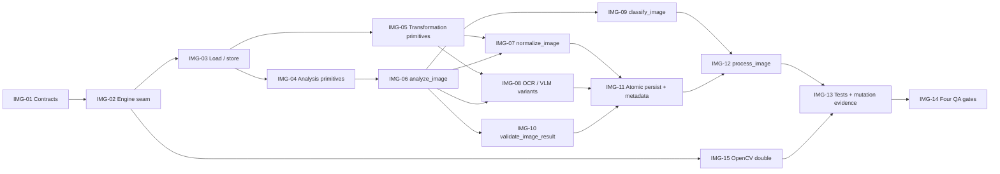

# WBS — procesador-image

| Field | Value |
|---|---|
| Document | WBS / task issues — `procesador-image` (`docflow.image`, `src/docflow/image/`) |
| Phase | **1 — Processors, independently** (`docs/plan/README.md` §5) |
| Derived from | `docs/plan/subplan-procesador-image.md` §4 (WBS table, order/waves) |
| Source of truth | `docs/plan/subplan-procesador-image.md` + `docs/plan/README.md`; task IDs and titles are preserved verbatim from the subplan table |
| ID range | `IMG-01` … `IMG-15` |
| Status | All issues `NOT_STARTED` |

This document expands — never replaces — the subplan WBS. Every issue traces back to exactly one row of `subplan-procesador-image.md` §4; no new scope is introduced here. `.github/copilot-instructions.md` governs code quality for every task.

## 1. Summary

| Field | Value |
|---|---|
| Phase | 1 — processors, independently (parallel with `pdf`, `ocr`, `llm`) |
| ID range | IMG-01 … IMG-15 |
| # tasks | 15 |
| Effort distribution | S ×7 (IMG-01, 03, 06, 09, 10, 14, 15) · M ×8 (IMG-02, 04, 05, 07, 08, 11, 12, 13) · L ×0 |
| Critical path | `IMG-01 → IMG-02 → IMG-03 → IMG-04 → IMG-06 → IMG-07 → IMG-11 → IMG-12 → IMG-13` |
| Definition of Done gate | `pytest` · `ruff check .` · `ruff format --check .` · `pylint src tests`, plus mutation-falsified invariant tests |

**Scope.** Turn one `ImageRequest` into one `ImageResult`: validate the input, compute technical metrics without mutating the source, produce `normalized.png` plus independent `ocr_ready.png` / `vlm_ready.png` variants, classify technically, validate the outputs and publish everything atomically inside the `image/` namespace with a `metadata.json`. OpenCV (Pillow as fallback) is reached only from `image/primitives/`. No OCR, no LLM, no source selection, no workflow decision.

**Test framing.** Every primitive below is exercised with the in-memory OpenCV double in place of the engine call (`IMG-15`): the assertions are about **our** translation, naming, ordering, thresholds and error mapping, never about what OpenCV computes or returns (`README.md` §9.7). A criterion that would assert an engine reading is not a criterion of this programme.

## 2. Task issue index

| ID | Task (short) | Effort | Wave | Depends on | Deliverable artifact(s) | Issue file | Status |
|---|---|---|---|---|---|---|---|
| IMG-01 | Contract dataclasses | S | 1 — Contracts & seam | — | `ImageRequest`, `ImageResult`, `ImageMetrics`, `ImageOptions`, `ImageClassification`, `ImageValidation`, `ImageError` | this file §IMG-01 | NOT_STARTED |
| IMG-02 | Image-ops primitives skeleton | M | 1 — Contracts & seam | IMG-01 | `image/primitives/` (OpenCV, Pillow fallback) | this file §IMG-02 | NOT_STARTED |
| IMG-03 | Load/store primitives | S | 1 — Contracts & seam | IMG-02 | `load_image`, `save_image`, `get_image_metadata`, `get_image_dimensions` | this file §IMG-03 | NOT_STARTED |
| IMG-04 | Analysis primitives | M | 2 — Analysis | IMG-03 | `calculate_*_score`, `detect_orientation`, `detect_skew_angle`, `detect_text_regions`, `calculate_text_coverage` | this file §IMG-04 | NOT_STARTED |
| IMG-05 | Transformation primitives | M | 2 — Analysis | IMG-03 | `rotate_image`, `deskew_image`, `resize_image`, `convert_to_grayscale`, `binarize_image`, `denoise_image`, `sharpen_image`, `normalize_contrast`, `normalize_brightness`, `convert_image_format`, `compress_image` | this file §IMG-05 | NOT_STARTED |
| IMG-06 | `analyze_image` → `ImageMetrics` | S | 2 — Analysis | IMG-04 | `analyze_image` (side-effect-free) | this file §IMG-06 | NOT_STARTED |
| IMG-07 | `normalize_image` + `prepare_normalized_image` | M | 3 — Outputs | IMG-05, IMG-06 | `image/normalized.png` | this file §IMG-07 | NOT_STARTED |
| IMG-08 | `prepare_image_for_ocr` / `prepare_image_for_vlm` | M | 3 — Outputs | IMG-05, IMG-06 | `image/ocr_ready.png`, `image/vlm_ready.png` (distinct pipelines) | this file §IMG-08 | NOT_STARTED |
| IMG-09 | `classify_image` | S | 3 — Outputs | IMG-06 | `TEXT_IMAGE` / `VISUAL_IMAGE` / `MIXED_IMAGE` / `LOW_QUALITY` | this file §IMG-09 | NOT_STARTED |
| IMG-10 | `validate_image_result` + typed error classification | S | 3 — Outputs | IMG-06 | `validate_image_result`, `ImageError` kinds | this file §IMG-10 | NOT_STARTED |
| IMG-11 | Atomic persistence + `metadata.json` | M | 4 — Publish | IMG-07, IMG-08, IMG-10 | `image/.tmp/` → rename; `image/metadata.json` | this file §IMG-11 | NOT_STARTED |
| IMG-12 | `process_image` entry point | M | 4 — Publish | IMG-09, IMG-11 | `process_image` | this file §IMG-12 | NOT_STARTED |
| IMG-13 | Happy-path + invariant tests, mutation evidence | M | 5 — Verify | IMG-12, IMG-15 | `tests/`, mutation observations | this file §IMG-13 | NOT_STARTED |
| IMG-14 | Four QA gates clean | S | 5 — Verify | IMG-13 | QA gate output | this file §IMG-14 | NOT_STARTED |
| IMG-15 | In-memory OpenCV double (primitives injection) | S | 2 — Analysis | IMG-02 | `tests/fakes/engines/fake_opencv.py` | this file §IMG-15 | NOT_STARTED |

## 3. Detailed issues

### IMG-01 — Contract dataclasses

- **Type:** Contracts
- **Effort:** S
- **Wave:** 1 — Contracts & seam
- **Depends on:** —
- **Blocks:** IMG-02
- **Objective:** Freeze the input/output vocabulary: `ImageRequest` in, `ImageResult` out, with metrics, classification, validation and typed error records. No defaults on required fields.
- **Scope / Deliverables:** `ImageRequest` (`image_path`, `output_dir`, `options`, `context`), `ImageOptions` (`normalize`, `prepare_for_ocr`, `prepare_for_vlm`, `correct_orientation`, `deskew`), `ImageContext` (`document_id`, `page_number`, `workflow_run_id`), `ImageResult` (`source`, `normalized`, `variants`, `metrics`, `classification`, `transformations`, `validation`, `artifacts`, `metadata`, `status`), `ImageSourceRef`, `ArtifactRef`, `ImageVariants`, `ImageMetrics` (`dimensions`, `resolution`, `format`, `size`, `quality{blur, sharpness, contrast, brightness, noise}`, `orientation`, `skew`, `text_regions[]`, `text_coverage`), `ImageClassification`, `ImageValidation` (`VALID` / `LOW_QUALITY` / `INVALID_OUTPUT` / `UNSUPPORTED` / `ERROR`), `ImageError` (`type`, `message`, `recoverable`, `metadata`) with kinds `INVALID_INPUT`, `UNSUPPORTED_FORMAT`, `DECODE_ERROR`, `TRANSFORMATION_ERROR`, `WRITE_ERROR`, `IO_ERROR`, `INTERNAL_ERROR`, `ImageMetadata`.
- **Out of bounds:** No engine import, no I/O, no processing logic; `context` is correlation only and must never be read as workflow state.
- **Acceptance criteria:**
  - Given the contract module, when a required field is omitted, then construction fails (no silent default).
  - Then `ImageClassification` and `ImageValidation` expose exactly the literals named in the subplan and nothing else.
- **Evidence / DoD:** Type hints complete; Google-style docstrings; `ruff check .` and `pylint src tests` clean.
- **Tags:** —

### IMG-02 — Image-ops primitives skeleton

- **Type:** Skeleton
- **Effort:** M
- **Wave:** 1 — Contracts & seam
- **Depends on:** IMG-01
- **Blocks:** IMG-03
- **Objective:** Create the single seam that encapsulates the image engine (OpenCV first, Pillow as the documented drop-in alternative) with no engine silently substituted.
- **Scope / Deliverables:** `image/primitives/` package with the signatures of IMG-03, IMG-04 and IMG-05 declared; engine name and library version surfaced for `metadata.json`.
- **Out of bounds:** No OCR, Docling, LLM or workflow knowledge; no engine access from outside `image/primitives/`; no Pillow fallback activated implicitly when OpenCV is absent.
- **Acceptance criteria:**
  - Given the primitives package, when the engine is selected, then it is an explicit named choice recorded in metadata.
  - Given the engine is replaced by its alternative, then the contract of `ImageRequest → ImageResult` is unchanged.
- **Evidence / DoD:** Import of `image/primitives/` succeeds; engine/version retrieval exposed; four QA gates green on the skeleton.
- **Tags:** `# TODO: [MVP]` for real engine-availability probing.

### IMG-03 — Load/store primitives

- **Type:** Primitive
- **Effort:** S
- **Wave:** 1 — Contracts & seam
- **Depends on:** IMG-02
- **Blocks:** IMG-04, IMG-05
- **Objective:** Read an image and its technical facts without ever writing back to the source path.
- **Scope / Deliverables:** `load_image`, `save_image`, `get_image_metadata`, `get_image_dimensions` in `image/primitives/`.
- **Out of bounds:** No analysis scores, no transformation; `save_image` must never target `image_path`; no format guessing that silently coerces an unsupported file.
- **Acceptance criteria:**
  - Given the seam returns native metadata for a valid input, when `load_image` and `get_image_dimensions` run, then our typed refs carry those values unchanged and no engine is reached.
  - Given the seam fails on `corrupt.png`, when `load_image` runs, then a typed `ImageError` (`DECODE_ERROR` or `UNSUPPORTED_FORMAT`) is produced instead of an exception escaping the contract.
- **Evidence / DoD:** Fixture-based unit test on `color_layout.png` and `corrupt.png`, with the engine call doubled; the assertions cover our refs and our error mapping — never that the engine reads the file correctly.
- **Tags:** —

### IMG-04 — Analysis primitives

- **Type:** Primitive
- **Effort:** M
- **Wave:** 2 — Analysis
- **Depends on:** IMG-03
- **Blocks:** IMG-06
- **Objective:** Compute every technical signal the processor needs, with no side effects on the image.
- **Scope / Deliverables:** `calculate_blur_score`, `calculate_sharpness_score`, `calculate_contrast_score`, `calculate_brightness_score`, `calculate_noise_score`, `detect_orientation`, `detect_skew_angle`, `detect_text_regions`, `calculate_text_coverage` in `image/primitives/`.
- **Out of bounds:** No mutation of the input array; no decision of OCR/VLM readiness; no threshold-driven routing.
- **Acceptance criteria:**
  - Given the seam returns a skew reading, when `detect_skew_angle` runs, then our primitive surfaces it and the input bytes are unchanged.
  - Given a text-coverage reading from the seam, when `calculate_text_coverage` runs, then our normalization keeps it a fraction between 0 and 1 inclusive.
- **Evidence / DoD:** Fixture-based unit tests with the engine call doubled; repeated runs surface the same values for the same doubled input. **What is not covered, deliberately:** the numeric correctness of `calculate_*_score` — that is OpenCV's arithmetic, and testing it would be testing the engine (`README.md` §9.7).
- **Tags:** `# TODO: [MVP]` on provisional metric thresholds.

### IMG-05 — Transformation primitives

- **Type:** Primitive
- **Effort:** M
- **Wave:** 2 — Analysis
- **Depends on:** IMG-03
- **Blocks:** IMG-07, IMG-08
- **Objective:** Provide the raw transformation vocabulary the normalization and variant pipelines compose.
- **Scope / Deliverables:** `rotate_image`, `deskew_image`, `resize_image`, `convert_to_grayscale`, `binarize_image`, `denoise_image`, `sharpen_image`, `normalize_contrast`, `normalize_brightness`, `convert_image_format`, `compress_image` in `image/primitives/`.
- **Out of bounds:** No pipeline composition or variant naming here (that is IMG-07 / IMG-08); no in-place overwrite of the input file; no transformation applied without being requested by the caller.
- **Acceptance criteria:**
  - Given the seam returns an image, when `convert_to_grayscale` runs, then our written artifact goes to a distinct path and the source file is unchanged.
  - Given a skew reading from the seam, when `deskew_image` runs with it, then the output is written to a distinct path and the source is untouched.
- **Evidence / DoD:** Fixture-based unit tests per transformation group, engine call doubled; the input hash unchanged assertion. **Not asserted:** that the engine's transformation preserves or drops channels — that is the engine's business (`README.md` §9.7).
- **Tags:** —

### IMG-06 — `analyze_image` → `ImageMetrics`

- **Type:** Primitive
- **Effort:** S
- **Wave:** 2 — Analysis
- **Depends on:** IMG-04
- **Blocks:** IMG-07, IMG-09, IMG-10
- **Objective:** Aggregate the analysis primitives into one side-effect-free `ImageMetrics` snapshot of the input.
- **Scope / Deliverables:** `analyze_image` producing `ImageMetrics` (dimensions, resolution, format, size, quality scores, orientation, skew, text regions, text coverage).
- **Out of bounds:** No file writes, no normalization, no classification, no OCR/VLM decision; never return a placeholder where a real measurement is expected.
- **Acceptance criteria:**
  - Given the seam returns score values, when `analyze_image` runs, then every `ImageMetrics` field carries the doubled measurement — never a placeholder.
  - Given the same doubled input, when `analyze_image` runs twice, then the aggregated metrics are identical and no file is written.
- **Evidence / DoD:** Unit test asserting metric equality across two runs and absence of filesystem writes.
- **Tags:** `# TODO: [MVP]` for concrete `LOW_QUALITY` threshold constants.

### IMG-07 — `normalize_image` + `prepare_normalized_image`

- **Type:** Primitive
- **Effort:** M
- **Wave:** 3 — Outputs
- **Depends on:** IMG-05, IMG-06
- **Blocks:** IMG-11
- **Objective:** Produce the baseline `image/normalized.png` by applying only the transformations justified by metrics plus explicit configuration, and record each applied transformation.
- **Scope / Deliverables:** `normalize_image`, `prepare_normalized_image`, population of `ImageResult.transformations`.
- **Out of bounds:** No OCR/VLM-specific preparation; no unrequested enhancement; no silent default transformation set; no write outside `image/`.
- **Acceptance criteria:**
  - Given a valid PNG and `normalize=true`, when normalization runs, then `image/normalized.png` exists and `transformations` lists every applied operation.
  - Given `normalize=false`, then no normalized artifact is produced and no error is raised.
- **Evidence / DoD:** Scenario test for the "normalize a valid color input" acceptance criterion.
- **Tags:** `# TODO: [MVP]` for the deferred transformation catalogue.

### IMG-08 — `prepare_image_for_ocr` and `prepare_image_for_vlm`

- **Type:** Primitive
- **Effort:** M
- **Wave:** 3 — Outputs
- **Depends on:** IMG-05, IMG-06
- **Blocks:** IMG-11
- **Objective:** Build two genuinely independent preparation pipelines, because the OCR-optimal image is not assumed to be the VLM-optimal image.
- **Scope / Deliverables:** `prepare_image_for_ocr` (may grayscale, deskew, binarize, raise contrast) writing `image/ocr_ready.png`; `prepare_image_for_vlm` (preserves colour, layout and visual context) writing `image/vlm_ready.png`.
- **Out of bounds:** The VLM pipeline must never alias or return the OCR path; no decision of which variant is used downstream; no automatic region selection (only explicitly requested crops).
- **Acceptance criteria:**
  - Given `color_layout.png` with `prepare_for_ocr=true` and `prepare_for_vlm=true`, when both run, then two distinct files exist and the VLM variant preserves colour channels while the OCR variant may be grayscale.
  - Given only `prepare_for_vlm=true`, then no `ocr_ready.png` is produced.
- **Evidence / DoD:** Scenario test for independent variants plus the OCR≠VLM invariant (IMG-13, invariant 2) — both assert **our** pipeline wiring and namespace, never the engine's pixel output (`README.md` §9.7).
- **Tags:** `# TODO: [MVP]` on binarization thresholds.

### IMG-09 — `classify_image`

- **Type:** Primitive
- **Effort:** S
- **Wave:** 3 — Outputs
- **Depends on:** IMG-06
- **Blocks:** IMG-12
- **Objective:** Assign the descriptive technical classification from metrics alone.
- **Scope / Deliverables:** `classify_image` returning exactly one of `TEXT_IMAGE` / `VISUAL_IMAGE` / `MIXED_IMAGE` / `LOW_QUALITY`.
- **Out of bounds:** No routing decision, no read of a workflow flag, no aggregate confidence score substituting per-measurement evidence; thresholds must be explicit named constants.
- **Acceptance criteria:**
  - Given metrics below the quality thresholds, when `classify_image` runs, then the result is `LOW_QUALITY`.
  - Given only `ImageMetrics` as input, then the returned value is always one of the four literals.
- **Evidence / DoD:** Unit test over crafted metric vectors including the `LOW_QUALITY` boundary.
- **Tags:** `# TODO: [MVP]` on the provisional threshold values.

### IMG-10 — `validate_image_result` and typed error classification

- **Type:** Validation
- **Effort:** S
- **Wave:** 3 — Outputs
- **Depends on:** IMG-06
- **Blocks:** IMG-11
- **Objective:** Validate the produced result structurally and classify failures into typed `ImageError` records with a `recoverable` flag — never a silent stand-in.
- **Scope / Deliverables:** `validate_image_result`, error mapping to `INVALID_INPUT`, `UNSUPPORTED_FORMAT`, `DECODE_ERROR`, `TRANSFORMATION_ERROR`, `WRITE_ERROR`, `IO_ERROR`, `INTERNAL_ERROR`, and the descriptive states `VALID` / `LOW_QUALITY` / `INVALID_OUTPUT` / `UNSUPPORTED` / `ERROR`.
- **Out of bounds:** Validation states are descriptive only and must never be converted into workflow actions; errors are returned in the result, not thrown across the contract.
- **Acceptance criteria:**
  - Given `corrupt.png`, when `process_image` runs, then the result carries an `ImageError` of type `DECODE_ERROR` or `UNSUPPORTED_FORMAT` with `recoverable=false`.
  - Given an expected artifact is missing, then the validation state is `INVALID_OUTPUT` with a typed error naming it.
- **Evidence / DoD:** Scenario test for the "reject an invalid input with a typed error" acceptance criterion.
- **Tags:** `# TODO: [MVP]` for richer input validation.

### IMG-11 — Atomic persistence and `metadata.json`

- **Type:** Validation
- **Effort:** M
- **Wave:** 4 — Publish
- **Depends on:** IMG-07, IMG-08, IMG-10
- **Blocks:** IMG-12
- **Objective:** Publish every artifact through `image/.tmp/` → validate → rename, and emit a `metadata.json` that records processor and library versions, input/output metrics and timing.
- **Scope / Deliverables:** The atomic publication helper, `image/metadata.json` generation, and the guarantee that a failed run leaves no partially valid artifact visible.
- **Out of bounds:** No final-named artifact written before validation; no writes to `source/`, `render/`, `native_text/`, `ocr/` or `llm/`; no placeholder metadata values.
- **Acceptance criteria:**
  - Given a forced failure after transformation, when `image/` is inspected, then no `.tmp` files and no final-named artifacts remain.
  - Given a successful run, then `metadata.json` is parseable and contains processor, library versions, transformations and metrics.
- **Evidence / DoD:** Failure-path test plus the namespace-ownership invariant (IMG-13, invariant 3); metadata schema assertion.
- **Tags:** `# TODO: [RELEASE]` for crash-safety guarantees at filesystem level.

### IMG-12 — `process_image` entry point

- **Type:** Entry point
- **Effort:** M
- **Wave:** 4 — Publish
- **Depends on:** IMG-09, IMG-11
- **Blocks:** IMG-13
- **Objective:** Wire the full flow — validate input → load → analyze → normalize → classify → prepare variants → validate → persist — into the single public entry point.
- **Scope / Deliverables:** `process_image(request) -> ImageResult`; `status == "success"` on the happy path, a typed `ImageError` otherwise; the artifact tree exactly `image/normalized.png`, optional `image/ocr_ready.png`, optional `image/vlm_ready.png`, optional `image/regions/`, `image/metadata.json`.
- **Out of bounds:** No import of another processor; no workflow decision (skip/force/reuse/resume belongs to the orchestrator's `StageExecution`); no mutation of the input image; no default engine or threshold substitution.
- **Acceptance criteria:**
  - Given a valid `ImageRequest`, when `process_image` runs, then `status == "success"`, `classification` is one of the four defined values and all outputs live under `image/`.
  - Given any valid input, when its bytes are hashed before and after processing, then the hash is unchanged.
- **Evidence / DoD:** Happy-path test with real bytes from a committed fixture; scenario tests for namespace and source immutability.
- **Tags:** `# TODO: [MVP]` for the not-yet-covered option combinations.

### IMG-13 — Happy-path and invariant tests with mutation evidence

- **Type:** Test
- **Effort:** M
- **Wave:** 5 — Verify
- **Depends on:** IMG-12, IMG-15
- **Blocks:** IMG-14
- **Objective:** Prove the loop end to end and prove each invariant test fails when its invariant is broken. No test reaches OpenCV (`README.md` §9.7).
- **Scope / Deliverables:** Happy-path test (`ImageRequest → ImageResult`, real bytes from a committed fixture, engine call doubled); invariant 1 (input immutability), invariant 2 (OCR variant ≠ VLM variant), invariant 3 (namespace ownership); committed fixtures `fixtures/image/color_layout.png`, `skewed_text.png`, `embedded_logo.png`, `corrupt.png`; a unit test over **crafted** `ImageMetrics` for the `LOW_QUALITY` boundary; written mutation-falsification observations.
- **Out of bounds:** No edge-case matrix beyond the four fixtures; no golden-set quality scoring; no test that invokes, imports or asserts OpenCV, and no assertion about the engine's metric values (`README.md` §9.7); no source change made permanent to satisfy a test.
- **Acceptance criteria:**
  - Given the happy-path fixture, when the test runs, then `normalized.png` exists, `metadata.json` parses, `status == "success"` and `classification` is one of the four values.
  - Given invariant 1's mutation (save to `image_path` in place), invariant 2's mutation (VLM aliases the OCR path) and invariant 3's mutation (`metadata.json` redirected outside `image/`), then each corresponding test fails; after restore, all are green.
- **Evidence / DoD:** Test output for the happy path plus both observations per invariant (fails under mutation, green after restore).
- **Tags:** `# TODO: [MVP]` where a fixture stands in for a real-world scan.

### IMG-14 — Four QA gates clean

- **Type:** QA gate
- **Effort:** S
- **Wave:** 5 — Verify
- **Depends on:** IMG-13
- **Blocks:** —
- **Objective:** Close the processor with all four quality gates green and the DoD checklist satisfied.
- **Scope / Deliverables:** `pytest`, `ruff check .`, `ruff format --check .`, `pylint src tests` all clean; every shortcut carrying an inline `# TODO: [MVP]` / `# TODO: [RELEASE]` tag.
- **Out of bounds:** No config-wide rule suppression to obtain a green run; any inline suppression must state why the rule does not apply.
- **Acceptance criteria:**
  - Given the four commands, when they run, then all four exit clean with no `fixme`-derived noise.
  - Then no bare `# type: ignore` exists in the new modules.
- **Evidence / DoD:** Captured output of the four gates; review of the DoD checklist in the subplan §7.
- **Tags:** —

### IMG-15 — In-memory OpenCV double

- **Type:** Test infrastructure
- **Effort:** S
- **Wave:** 2 — Analysis
- **Depends on:** IMG-02
- **Blocks:** IMG-13
- **Objective:** Give this processor a test double so that the whole suite runs with no OpenCV installed, without any test invoking, importing or asserting the engine (`README.md` §9.7).
- **Scope / Deliverables:** `tests/fakes/engines/fake_opencv.py` — an in-memory fake injected at the **`image/primitives/`** functions (`load_image`, the transformations), returning the engine's **native** output (small synthetic pixel arrays plus raw score values such as `blur`, `sharpness`, `contrast`) and able to raise `DECODE_ERROR` so the failure path of subplan §6 is reachable.
- **Out of bounds:** No faking of our translated types (`ImageResult`, the output of `analyze_image` / `normalize_image`) — the fake replaces the engine call, or the primitives lose their coverage; no `if engine is None: use_fake` fallback anywhere; nothing under `src/docflow/` imports `tests/`; no assertion about the engine's readings (no "expected blur value", no tolerance band) and no `.npy`/PNG fixture tree standing in for the engine.
- **Acceptance criteria:**
  - Given the fake in place, when the whole suite runs, then every test of this processor passes with zero OpenCV invocations, and the run needs no engine installed.
  - Given `corrupt.png`, then the double raises `DECODE_ERROR` and the typed error path is asserted with no live call.
  - Given crafted `ImageMetrics`, then the `LOW_QUALITY` boundary is tested as a rule of ours, not as an engine reading.
- **Evidence / DoD:** The suite green with OpenCV absent; no engine symbol imported by any test module of this processor; the mutation observations of IMG-13 unaffected by the double.
- **Tags:** `# TODO: [RELEASE]` for a re-check of the double against the real engine's shape on a pin bump.

```gherkin
Scenario: No test reaches OpenCV
  Given the in-memory OpenCV double
  When the whole suite runs
  Then every test of this processor passes with zero OpenCV invocations
  And no test imports or asserts the engine
```

## 4. Dependency graph



## 5. Execution waves

| Wave | Tasks | Entry condition | Exit condition |
|---|---|---|---|
| 1 — Contracts & seam | IMG-01 → IMG-02 → IMG-03 | Phase 0 exit met; subplan §7 DoR satisfied | Contract dataclasses frozen; engine seam explicit; load/store returns real dimensions from a fixture |
| 2 — Analysis | IMG-04 ∥ IMG-05 → IMG-06; IMG-15 in parallel after IMG-02 | IMG-03 green | Metrics computed without side effects; transformation primitives exercised on fixtures; the OpenCV double exists, so the whole suite runs with no engine installed |
| 3 — Outputs | IMG-07, IMG-09, IMG-10 (after IMG-06) ∥ IMG-08 (after IMG-05 + IMG-06) | Wave 2 green | Normalized artifact and two independent variants produced; classification and typed errors defined |
| 4 — Publish | IMG-11 → IMG-12 (IMG-12 also consumes IMG-09) | Wave 3 green | Atomic publication under `image/` only; `process_image` round-trips the contract with real bytes |
| 5 — Verify | IMG-13 → IMG-14 | Wave 4 green | Happy-path and three invariant tests green, each invariant mutation-falsified; the whole suite passes with OpenCV absent and no test reaches the engine; four QA gates clean |

## 6. Critical path

`IMG-01 → IMG-02 → IMG-03 → IMG-04 → IMG-06 → IMG-07 → IMG-11 → IMG-12 → IMG-13`

It is critical because the contracts (IMG-01) and the engine seam (IMG-02) precede any real pixel work; load/store (IMG-03) gates both the analysis and the transformation branches; `analyze_image` (IMG-06) is the sole input to classification and validation; the normalized artifact (IMG-07) is the mandatory output; and nothing can be published (IMG-11) or exposed (IMG-12) until analysis plus at least the normalized pipeline exist, with tests (IMG-13) closing the chain. IMG-05 → IMG-08 is a parallel branch of equal length that joins at IMG-11; a slip there delays the same publication gate. IMG-09 `classify_image` is a second hard predecessor of IMG-12, because `process_image` must populate `classification`.

## 7. Traceability

| Acceptance scenario (subplan §5) | Implemented by | Tested by |
|---|---|---|
| Normalize a valid color input | IMG-07, IMG-11, IMG-12 | IMG-13 happy path |
| Prepare independent OCR and VLM variants | IMG-08, IMG-12 | IMG-13 invariant 2 (OCR variant ≠ VLM variant) |
| Reject an invalid input with a typed error | IMG-03, IMG-10, IMG-11 | IMG-13 happy path / typed-error test; IMG-11 failure-path test (no partial artifact under `image/`) |
| Leave the source untouched | IMG-03, IMG-05, IMG-12 | IMG-13 invariant 1 (input immutability) |
| Invariant 3 — namespace ownership (mutation: redirect `metadata.json` outside `image/`) | IMG-11, IMG-12 | IMG-13 (must fail under mutation, then restore green) |
| LOW_QUALITY classification boundary | IMG-06, IMG-09 | IMG-13 (classification unit test over crafted `ImageMetrics`, never the engine's readings) |
| No test reaches OpenCV | IMG-15 | IMG-15 acceptance scenario (`pytest` green with zero OpenCV invocations and no engine installed) |

## 8. Definition of Ready (per task)

- The task appears as a row in `subplan-procesador-image.md` §4 with the same ID, title, effort and dependencies.
- `ImageRequest` / `ImageResult` / `ImageMetrics` / `ImageError` field lists are ratified against `docs/idea/procesador-image.md` and `docs/idea/readme.md`.
- The engine choice (OpenCV first, Pillow documented alternative) and the `image/primitives/` skeleton are recorded before IMG-02 starts.
- For IMG-06 / IMG-08: the numeric thresholds (`LOW_QUALITY`, binarization) are named constants before coding starts.
- The `image/` artifact namespace and the atomic-publication rule are agreed, and the fixtures of subplan §6 exist.
- For IMG-15: the fake's injection point (the `image/primitives/` functions) and its native shape (synthetic pixels plus raw score values) are agreed, and no test of this processor imports the engine.
- No open question blocks the happy path; no domain noun is introduced into the processor API.

## 9. Definition of Done (per task)

- [ ] `pytest` green with the task's happy-path and/or invariant test using real bytes from a committed fixture and the OpenCV double in place of the engine.
- [ ] No test invokes, imports or asserts OpenCV, and no test asserts an engine metric value; the suite passes with no engine installed (`README.md` §9.7), and the double is never reachable as a fallback (nothing under `src/docflow/` imports `tests/`).
- [ ] `ruff check .` clean (import order included) · `ruff format --check .` clean · `pylint src tests` clean (`fixme` disabled).
- [ ] Every invariant test touched by the task has been mutation-falsified: mutate → observe failure → restore → re-run green, both observations reported.
- [ ] No silent stand-in (no empty path, `0`, `[]`, `None`-without-reason, no default engine or threshold).
- [ ] No import of, or call to, another processor module; OpenCV/Pillow reached only from `image/primitives/`; no workflow decision, no OCR/VLM execution, no source selection.
- [ ] Input image immutable; outputs published atomically and only under `image/`; OCR and VLM variants produced independently.
- [ ] Every shortcut carries an inline `# TODO: [MVP]` or `# TODO: [RELEASE]` tag; output, identifiers, docstrings and comments in English.

## 10. Risks & mitigations (execution view)

| Risk (subplan §8) | Task affected | Mitigation owned by |
|---|---|---|
| OpenCV/Pillow version drift changes metric values | IMG-02, IMG-04, IMG-06 | IMG-02 (single seam) + IMG-11 (stamp processor/library versions; deterministic thresholds) |
| Over-eager enhancement degrades information (binarization destroying colour) | IMG-07, IMG-08 | IMG-07 (transformations only when justified by metrics + explicit options; every transformation recorded) |
| Assuming OCR image == VLM image | IMG-08, IMG-12 | IMG-08 (independent pipelines; VLM never aliases the OCR path) + IMG-13 invariant 2 |
| Partially written artifact seen as valid by the orchestrator | IMG-11 | IMG-11 (atomic `.tmp` → validate → rename) |
| Scope creep into a full image-processing library | IMG-02, IMG-05 | IMG-02 (thin primitives, engine swappable behind the contract, happy path only) |
| No labelled golden set to judge legibility | IMG-06, IMG-09, IMG-14 | IMG-06/IMG-09 (technical thresholds) + IMG-13 (mutation-falsified invariants); golden set deferred |
| A bumped OpenCV pin changes the engine's output shape | Our metric and transformation primitives break in production while the suite stays green | IMG-15 (the double is the single place a shape change has to be re-checked on the bump; `# TODO: [RELEASE]` for the scheduled re-check) — accepted PoC trade-off, recorded in `GEN-17` |

## 11. Out of scope

- PDF splitting, rendering and page extraction (→ `procesador-pdf`).
- OCR execution and LLM/VLM inference (→ `procesador-ocr`, `procesador-llm-call`).
- Source selection, `skip`/`force`/`reuse`/`resume`, and `processing_key` computation (→ `procesador-orquestador`).
- Automatic region selection for OCR or LLM; only explicitly requested crops are produced.
- Multi-document corpus batching and distributed execution.
- Labelled golden-set quality scoring (deferred per the general plan).
