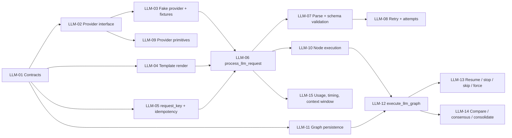

# WBS — procesador-llm-call

| Field | Value |
|---|---|
| Document | WBS / task issues — `procesador-llm-call` (`docflow.llm`, `src/docflow/llm/`) |
| Phase | **1 — Processors, independently** (`docs/plan/README.md` §5) |
| Derived from | `docs/plan/subplan-procesador-llm-call.md` §4 (WBS table, waves) |
| Source of truth | `docs/plan/subplan-procesador-llm-call.md` + `docs/plan/README.md`; task IDs and titles are preserved verbatim from the subplan table |
| ID range | `LLM-01` … `LLM-15` |
| Status | All issues `NOT_STARTED` |

This document expands — never replaces — the subplan WBS. Every issue traces back to exactly one row of `subplan-procesador-llm-call.md` §4; no new scope is introduced here. `.github/copilot-instructions.md` governs code quality for every task.

## 1. Summary

| Field | Value |
|---|---|
| Phase | 1 — processors, independently (parallel with `pdf`, `image`, `ocr`); the internal inference subgraph is a follow-up inside the same phase |
| ID range | LLM-01 … LLM-15 |
| # tasks | 15 |
| Effort distribution | S ×3 (LLM-01, 02, 03) · M ×8 (LLM-04, 05, 06, 07, 08, 10, 14, 15) · L ×4 (LLM-09, 11, 12, 13) |
| Critical path | `LLM-01 → LLM-02 → LLM-03 → LLM-06 → LLM-07 → LLM-08` (single-call chain) and `LLM-01 → LLM-06 → LLM-10 → LLM-11 → LLM-12 → LLM-13` (graph chain); the binding path ends at LLM-13 |
| Definition of Done gate | `pytest` · `ruff check .` · `ruff format --check .` · `pylint src tests`, plus mutation-falsified invariant tests |

**Scope.** Turn an already-defined `LLMInput` into a structured, validated, traceable `LLMResult`: template render, prompt build, `request_key`, provider call, parse, schema validation, retries, and — as a follow-up in the same phase — the internal inference subgraph (`classify → extract_a/extract_b → compare → validate → consolidate`) with per-node reuse, resume, stop, skip, force, comparison, consensus and consolidation. Providers live only in `llm/primitives/`; persistence lives only under `llm/`. No documental decision is taken here.

## 2. Task issue index

| ID | Task (short) | Effort | Wave | Depends on | Deliverable artifact(s) | Issue file | Status |
|---|---|---|---|---|---|---|---|
| LLM-01 | Contract dataclasses | S | 1 — Contracts & primitives | — | `LLMInput`, `LLMResult`, `LLMNodeResult`, `LLMGraphState`, `LLMAttempt`, `ComparisonResult`, `Usage`, `Timing`, stage-state enums | this file §LLM-01 | NOT_STARTED |
| LLM-02 | Provider primitive interface + result/error types | S | 1 — Contracts & primitives | LLM-01 | `llm/primitives/`, `LLMProvider` types | this file §LLM-02 | NOT_STARTED |
| LLM-03 | In-memory fake provider + fixtures | S | 1 — Contracts & primitives | LLM-02 | `fixtures/llm/template/simple_extract.md`, `fixtures/llm/schema/simple.schema.json`, fake provider | this file §LLM-03 | NOT_STARTED |
| LLM-04 | Template render & prompt build | M | 1 — Contracts & primitives | LLM-01 | variable injection, `<doc>`/`<extra>`/`<schema>` resolution, sanitize | this file §LLM-04 | NOT_STARTED |
| LLM-05 | `calculate_request_key` + idempotency helpers | M | 1 — Contracts & primitives | LLM-01 | `calculate_request_key`, `find_reusable_node_result`, `is_node_reusable`, `validate_cached_result` | this file §LLM-05 | NOT_STARTED |
| LLM-06 | `process_llm_request` single-call happy path | M | 2 — Single call | LLM-03, LLM-04, LLM-05 | `process_llm_request` | this file §LLM-06 | NOT_STARTED |
| LLM-07 | Parse + schema validation | M | 2 — Single call | LLM-06 | `load_schema`, `validate_schema`, `parse_json_response`, `validate_llm_result` | this file §LLM-07 | NOT_STARTED |
| LLM-08 | Retry + attempt history | M | 2 — Single call | LLM-07 | `retry_llm_request`, `should_retry`, `increment_attempt` | this file §LLM-08 | NOT_STARTED |
| LLM-09 | Provider primitives: Ollama + OpenAI-compatible | L | 2 — Single call | LLM-02 | `generate_text`, `generate_multimodal`, `generate_structured`, `list_models`, `check_model_available`, `get_context_window` | this file §LLM-09 | NOT_STARTED |
| LLM-10 | Node execution | M | 3 — Internal graph | LLM-06 | `process_llm_node`, node-state transitions, `claim_node` | this file §LLM-10 | NOT_STARTED |
| LLM-11 | Graph persistence in `llm/` | L | 3 — Internal graph | LLM-01 | `llm/run_001/{state.json, graph.json, final_result.json}`, atomic writes, load/save `LLMGraphState` | this file §LLM-11 | NOT_STARTED |
| LLM-12 | `execute_llm_graph` | L | 3 — Internal graph | LLM-10, LLM-11 | dependencies, routing, parallel branches, subgraph lifecycle | this file §LLM-12 | NOT_STARTED |
| LLM-13 | Resume / stop / skip / force | L | 3 — Internal graph | LLM-12 | `resume_llm_graph`, `request_graph_stop`, `invalidate_downstream_nodes` | this file §LLM-13 | NOT_STARTED |
| LLM-14 | Comparison / consensus / consolidate | M | 3 — Internal graph | LLM-12 | `compare_outputs`, `calculate_consensus` | this file §LLM-14 | NOT_STARTED |
| LLM-15 | Usage, timing and context-window control | M | 3 — Internal graph | LLM-06 | `count_tokens`, `truncate_to_token_limit`, `is_context_limit_exceeded` | this file §LLM-15 | NOT_STARTED |

> The subplan records LLM-01, LLM-02 and LLM-03 as `S`; LLM-04 … LLM-08, LLM-10, LLM-14, LLM-15 as `M`; and LLM-09, LLM-11, LLM-12, LLM-13 as `L`.

## 3. Detailed issues

### LLM-01 — Contract dataclasses

- **Type:** Contracts
- **Effort:** S
- **Wave:** 1 — Contracts & primitives
- **Depends on:** —
- **Blocks:** LLM-02, LLM-04, LLM-05, LLM-11
- **Objective:** Freeze the inference vocabulary: the input task, the aggregate result, the per-node result and the internal graph state, plus attempt, comparison, usage and timing records.
- **Scope / Deliverables:** `LLMInput` (`task`, `provider`, `model`, `template`, `document`, `images`, `extra_context`, `schema`, `options`, `graph`, `metadata`); `LLMResult` (`run_id`, `task`, `provider`, `model`, `graph_id`, `node_results`, `raw_response`, `parsed_response`, `schema_valid`, `validation_errors`, `attempts`, `comparisons`, `usage`, `timing`, `status`, `metadata`); `LLMNodeResult` (`node_id`, `request_key`, `status`, `result`, `attempts`, `validation`, `usage`, `timing`, `metadata`); `LLMGraphState` (`run_id`, `graph_id`, `graph_version`, `status`, `current_nodes`, `node_states`, `node_results`, `attempts`, `comparisons`, `errors`, `usage`, `stop_requested`, `final_result`); `LLMAttempt`, `ComparisonResult`, `Usage`, `Timing`; stage-state enums aligned with the orchestrator vocabulary (`NOT_STARTED`, `READY`, `RUNNING`, `SUCCESS`, `FAILED`, `SKIPPED`, `REUSED`, `INVALIDATED`, `PAUSED`).
- **Out of bounds:** No provider access, no persistence, no graph execution; `LLMGraphState` is internal and never replaces the orchestrator's `DocumentContext` / `PageContext` / `StageExecution`; no domain noun in the API.
- **Acceptance criteria:**
  - Given the contract module, when a required field is omitted, then construction fails (no silent default).
  - Then `LLMInput.graph` remains data (`nodes`, `depends_on`) and no executable behaviour is attached to it.
- **Evidence / DoD:** Type hints complete; Google-style docstrings; `ruff check .` and `pylint src tests` clean.
- **Tags:** —

### LLM-02 — Provider primitive interface and error types

- **Type:** Skeleton
- **Effort:** S
- **Wave:** 1 — Contracts & primitives
- **Depends on:** LLM-01
- **Blocks:** LLM-03, LLM-09
- **Objective:** Define the single seam through which any provider (Ollama, vLLM, hosted OpenAI-compatible API) is reached, with typed results and classified errors.
- **Scope / Deliverables:** `llm/primitives/` package; `LLMProvider` interface and its result/error types; error kinds `PROVIDER_ERROR`, `TIMEOUT`, `MODEL_UNAVAILABLE`, `CONTEXT_OVERFLOW`, `INVALID_RESPONSE`, `INVALID_JSON`, `SCHEMA_ERROR`, `DEPENDENCY_ERROR`, `INTERNAL_ERROR`, each marked `RETRYABLE` or `NON_RETRYABLE`; `get_model_info` for `model_version`.
- **Out of bounds:** No concrete transport yet (that is LLM-09); no provider import outside `llm/primitives/`; no silent default provider or model.
- **Acceptance criteria:**
  - Given the interface, when a provider is swapped, then `LLMInput → LLMResult` is unchanged.
  - Then every error kind carries a `RETRYABLE` / `NON_RETRYABLE` classification.
- **Evidence / DoD:** Import check; unit test over the error classification table.
- **Tags:** `# TODO: [MVP]` for the real transport in LLM-09.

### LLM-03 — In-memory fake provider and committed fixtures

- **Type:** Skeleton
- **Effort:** S
- **Wave:** 1 — Contracts & primitives
- **Depends on:** LLM-02
- **Blocks:** LLM-06
- **Objective:** Provide a deterministic, scriptable provider so the whole processor can be tested without a real model, and commit the prompt/schema fixtures the tests use verbatim.
- **Scope / Deliverables:** In-memory fake provider implementing the `llm/primitives/` interface, returning deterministic valid JSON, scriptable to return invalid JSON or raise timeouts, with a **call counter**; `fixtures/llm/template/simple_extract.md` with `<doc>`, `<extra>` and `<schema>` placeholders; `fixtures/llm/schema/simple.schema.json` exercising required fields and types.
- **Out of bounds:** No real network access; the fake must not be reachable from production code paths as a fallback.
- **Acceptance criteria:**
  - Given the fake provider scripted with a valid response, when it is called, then it returns the same JSON for the same input and the call counter increments.
  - Given the fake scripted to fail on attempt 1 and succeed on attempt 2, then both behaviours are reproducible in a test.
- **Evidence / DoD:** Fake provider is exercised by the LLM-06, LLM-08 and LLM-13 tests; fixtures are committed.
- **Tags:** `# TODO: [MVP]` where the fake stands in for a real provider.

### LLM-04 — Template render and prompt build

- **Type:** Primitive
- **Effort:** M
- **Wave:** 1 — Contracts & primitives
- **Depends on:** LLM-01
- **Blocks:** LLM-06
- **Objective:** Turn `LLMInput` plus a template into a rendered prompt with the document, extra context and schema resolved and sanitized.
- **Scope / Deliverables:** `process_template`, `process_prompt`, variable injection, `<doc>` / `<extra>` / `<schema>` resolution, sanitize; the rendered prompt is the exact value hashed into `request_key`.
- **Out of bounds:** No provider call; no schema validation; no silent truncation of the prompt (truncation belongs to LLM-15 and must be explicit); a missing placeholder must not be replaced by an empty string silently.
- **Acceptance criteria:**
  - Given the committed template and an `LLMInput` with document and schema, when rendering runs, then the prompt contains the document text and the schema and no unresolved placeholder remains.
  - Given the same inputs, when rendering runs twice, then the rendered prompt is byte-identical.
- **Evidence / DoD:** Fixture-based test asserting placeholder resolution and determinism.
- **Tags:** `# TODO: [MVP]` for richer template features.

### LLM-05 — `calculate_request_key` and idempotency helpers

- **Type:** Primitive
- **Effort:** M
- **Wave:** 1 — Contracts & primitives
- **Depends on:** LLM-01
- **Blocks:** LLM-06
- **Objective:** Make a logical inference request identifiable independently of run identity, and make the reuse decision explicit.
- **Scope / Deliverables:** `calculate_request_key` = `hash(provider + model + model_version + rendered_prompt + input_hashes + schema_hash + normalized_options)`, with `run_id`, `graph_id`, `node_id` and `attempt_id` deliberately excluded; `find_reusable_node_result`, `is_node_reusable`, `validate_cached_result`; the rule *reuse only when `request_key` matches AND `status == SUCCESS` AND the persisted result is valid*.
- **Out of bounds:** No provider call, no persistence backend of its own, no decision that a graph has finished; physical file existence alone must never imply reuse.
- **Acceptance criteria:**
  - Given two logically identical requests differing only in `run_id` / `node_id` / `attempt_id`, when `calculate_request_key` runs, then both keys are identical.
  - Given a `SUCCESS` node with a matching key and valid persisted result, when `is_node_reusable` runs, then it returns true; given a mismatched key, it returns false.
- **Evidence / DoD:** Unit tests for key determinism and the reuse predicate; the request_key invariant (see §7).
- **Tags:** —

### LLM-06 — `process_llm_request` single-call happy path

- **Type:** Entry point
- **Effort:** M
- **Wave:** 2 — Single call
- **Depends on:** LLM-03, LLM-04, LLM-05
- **Blocks:** LLM-07, LLM-10, LLM-15
- **Objective:** Wire template → prompt → key → payload → provider call → parse → validate into the single-call entry point.
- **Scope / Deliverables:** `process_llm_request(input) -> LLMResult`; build messages and the provider payload; record one `LLMAttempt` with `usage` and `timing`; `status == SUCCESS` with `schema_valid` on the happy path.
- **Out of bounds:** No documental decision (which document, whether OCR runs, which source wins); no fallback to re-running OCR/image/PDF; no graph execution (that is LLM-12); no silent default provider, model or schema.
- **Acceptance criteria:**
  - Given a valid `LLMInput` with template, schema and fake provider, when `process_llm_request` runs, then it returns `status == SUCCESS`, `schema_valid == true`, a non-empty `request_key` and exactly one recorded attempt with usage and timing.
  - Given the same input, when the call is repeated, then the `request_key` is identical.
- **Evidence / DoD:** Happy-path test with the fake provider and committed fixtures.
- **Tags:** `# TODO: [MVP]` for real provider transport integration.

### LLM-07 — Parse and schema validation

- **Type:** Validation
- **Effort:** M
- **Wave:** 2 — Single call
- **Depends on:** LLM-06
- **Blocks:** LLM-08
- **Objective:** Turn a raw provider response into a validated structured result, with an explicit verdict instead of a plausible-looking guess.
- **Scope / Deliverables:** `load_schema`, `validate_schema`, `parse_json_response`, `validate_llm_result`; `schema_valid` and `validation_errors` populated in `LLMResult`.
- **Out of bounds:** No aggregate confidence score in place of per-field evidence; an invalid response must never be reported as valid; validation never converts failure into a documental fallback.
- **Acceptance criteria:**
  - Given a response missing a required schema field, when validation runs, then `schema_valid` is false and `validation_errors` names the missing field.
  - Given valid JSON with an extra unexpected field, then the result is `INVALID_JSON` or a documented `SCHEMA_ERROR` — never silently accepted.
- **Evidence / DoD:** Unit tests over the committed schema fixture with valid, invalid and malformed payloads.
- **Tags:** `# TODO: [MVP]` for richer schema features.

### LLM-08 — Retry and attempt history

- **Type:** Primitive
- **Effort:** M
- **Wave:** 2 — Single call
- **Depends on:** LLM-07
- **Blocks:** —
- **Objective:** Retry a retryable failure while preserving every prior attempt, and never mask a non-retryable error.
- **Scope / Deliverables:** `retry_llm_request`, `should_retry`, `increment_attempt`; attempt ids distinct while `request_key` stays identical across attempts.
- **Out of bounds:** No documental retry (whole-processor retry belongs to the orchestrator); no retry of a `NON_RETRYABLE` error; attempt history must never be discarded.
- **Acceptance criteria:**
  - Given the fake provider returning invalid JSON on attempt 1 and valid JSON on attempt 2, when `process_llm_request` runs, then the result is `SUCCESS`, both attempts are present, attempt ids differ and `request_key` is unchanged.
  - Given a `NON_RETRYABLE` error, then no further attempt is made.
- **Evidence / DoD:** Scripted-fake test covering the retry scenario and the non-retryable short-circuit.
- **Tags:** `# TODO: [RELEASE]` for production retry queues and backoff policy.

### LLM-09 — Provider primitives (Ollama and OpenAI-compatible)

- **Type:** Primitive
- **Effort:** L
- **Wave:** 2 — Single call
- **Depends on:** LLM-02
- **Blocks:** —
- **Objective:** Implement the minimal provider surface for Ollama (local) and an OpenAI-compatible endpoint (vLLM / hosted API), each swappable behind the contract.
- **Scope / Deliverables:** `generate_text`, `generate_multimodal`, `generate_structured`, `list_models`, `check_model_available`, `get_context_window` in `llm/primitives/`; Ollama first, OpenAI-compatible second.
- **Out of bounds:** No provider usage outside `llm/primitives/`; no default model substitution when configuration is absent; no other processor importing a provider; no GPU-competition or production queue logic.
- **Acceptance criteria:**
  - Given an unavailable model, when `check_model_available` runs, then a typed `MODEL_UNAVAILABLE` error is returned instead of a silent fallback.
  - Given a provider swap, then the contract and the workflow are unchanged.
- **Evidence / DoD:** Interface-conformance test (fake provider and real provider share the surface); `# TODO: [MVP]` markers on the real transport.
- **Tags:** `# TODO: [MVP]` real transport; `# TODO: [RELEASE]` GPU-competition and queue policy.

### LLM-10 — Node execution

- **Type:** Primitive
- **Effort:** M
- **Wave:** 3 — Internal graph
- **Depends on:** LLM-06
- **Blocks:** LLM-12
- **Objective:** Execute one graph node as an atomic unit with explicit state transitions and a single owner.
- **Scope / Deliverables:** `process_llm_node`, node-state transitions, `claim_node` atomic `READY → RUNNING`; a failed node reported as a typed `FAILED` result with errors, never as an exception that corrupts the graph.
- **Out of bounds:** No dependency resolution or routing (that is LLM-12); no resume/force semantics (that is LLM-13); no documental decision.
- **Acceptance criteria:**
  - Given a `READY` node, when `claim_node` is invoked twice, then only the first claim succeeds and the node becomes `RUNNING`.
  - Given a node whose provider call fails, then its `LLMNodeResult.status` is `FAILED` and the graph state remains loadable.
- **Evidence / DoD:** Unit tests for the claim transition and the typed failure path.
- **Tags:** `# TODO: [MVP]` for multi-worker claims.

### LLM-11 — Graph persistence in the `llm/` namespace

- **Type:** Primitive
- **Effort:** L
- **Wave:** 3 — Internal graph
- **Depends on:** LLM-01
- **Blocks:** LLM-12
- **Objective:** Persist and reload the internal graph state and node artifacts atomically, entirely under `llm/`.
- **Scope / Deliverables:** Load/save of `LLMGraphState`; atomic writes (`*.tmp` → validate → rename); the artifact tree `llm/run_001/{state.json, graph.json, classify/{result.json, metadata.json, attempts/}, extract_a/…, extract_b/…, compare/…, final_result.json}`.
- **Out of bounds:** No writes outside `llm/`; `LLMGraphState` must never replace the orchestrator's `DocumentContext`; no DB or schema introduced in Phase 1.
- **Acceptance criteria:**
  - Given a saved graph state, when it is reloaded, then node states, node results, attempts and comparisons round-trip exactly.
  - Given an interrupted write, then no `.tmp` file and no partially written final artifact remains under `llm/`.
- **Evidence / DoD:** Round-trip test plus failure-path test asserting the namespace contains no `.tmp` residue.
- **Tags:** `# TODO: [MVP]` for a durable (file-backed) store.

### LLM-12 — `execute_llm_graph`

- **Type:** Entry point
- **Effort:** L
- **Wave:** 3 — Internal graph
- **Depends on:** LLM-10, LLM-11
- **Blocks:** LLM-13, LLM-14
- **Objective:** Run the declarative internal subgraph (`classify → extract_a/extract_b → compare → validate → consolidate`) with dependency resolution, routing, parallel branches and subgraph lifecycle, reusing valid node results.
- **Scope / Deliverables:** `execute_llm_graph`; node resolution order (reuse → execute), branch handling for `extract_a` / `extract_b`, subgraph completion detection, and the final consolidation into `LLMResult`.
- **Out of bounds:** No documental orchestration; no OCR/PDF/image re-run as a fallback; the graph shape stays data from `LLMInput.graph` (no hardcoded workflow) and `extract_a` / `extract_b` run sequentially in the PoC.
- **Acceptance criteria:**
  - Given a graph descriptor with `classify → extract_a/extract_b → compare → validate → consolidate`, when `execute_llm_graph` runs on the fake provider, then every node is `SUCCESS` and the `LLMResult` carries the consolidated `final_result.json`.
  - Given a node already `SUCCESS` with a matching `request_key`, then the fake provider's call counter does not increase for it.
- **Evidence / DoD:** Graph happy-path test plus the no-re-execution invariant (see §7).
- **Tags:** `# TODO: [MVP]` sequential branches instead of true concurrency.

### LLM-13 — Resume, stop, skip and force

- **Type:** Entry point
- **Effort:** L
- **Wave:** 3 — Internal graph
- **Depends on:** LLM-12
- **Blocks:** —
- **Objective:** Make a partially executed subgraph resumable without repeating valid, costly calls, and make force/stop/skip explicit per node.
- **Scope / Deliverables:** `resume_llm_graph`, `request_graph_stop`, `invalidate_downstream_nodes`; per-node `EXECUTE` / `REUSE` / `SKIP` / `FORCE` / `RETRY` / `INVALIDATE`; a node `FORCE` never becomes a decision about OCR, PDF or images.
- **Out of bounds:** No documental `stop`/`resume` (that is the orchestrator's `DocumentContext`); no cross-process locking beyond the atomic node claim; a forced node must invalidate all transitive dependents, not just itself.
- **Acceptance criteria:**
  - Given a partially executed graph where `classify` and `extract_a` are `SUCCESS` and `extract_b` is `FAILED`, when `resume_llm_graph` runs with the same `run_id` and inputs, then `classify` and `extract_a` are `REUSED` with no new provider calls and `extract_b`, `compare`, `validate`, `consolidate` are executed.
  - Given a completed graph, when `force` is requested on `extract_b`, then `extract_b` re-executes and `compare`, `validate` and `consolidate` transition to `INVALIDATED` and re-run.
- **Evidence / DoD:** Resume test using the fake provider's call counter plus the downstream-invalidation invariant (see §7).
- **Tags:** —

### LLM-14 — Comparison, consensus and consolidation

- **Type:** Primitive
- **Effort:** M
- **Wave:** 3 — Internal graph
- **Depends on:** LLM-12
- **Blocks:** —
- **Objective:** Compare the `extract_a` / `extract_b` outputs, compute consensus and consolidate a single result without collapsing evidence into an opaque score.
- **Scope / Deliverables:** `compare_outputs`, `calculate_consensus`; `comparisons` populated as `ComparisonResult` in `LLMResult`.
- **Out of bounds:** No aggregate confidence score substituted for the per-field comparison evidence; no documental verdict; disagreement must be reported as data, not resolved silently.
- **Acceptance criteria:**
  - Given two differing node outputs, when `compare_outputs` runs, then the differences are enumerated per field in `ComparisonResult`.
  - Given identical node outputs, then consensus is maximal and is still recorded as comparable per-field evidence.
- **Evidence / DoD:** Unit tests over crafted node outputs (agreeing and disagreeing).
- **Tags:** `# TODO: [MVP]` for the richer comparison policy.

### LLM-15 — Usage, timing and context-window control

- **Type:** Primitive
- **Effort:** M
- **Wave:** 3 — Internal graph
- **Depends on:** LLM-06
- **Blocks:** —
- **Objective:** Account for tokens, latency and cost per attempt and make context truncation explicit rather than silent.
- **Scope / Deliverables:** `count_tokens`, `truncate_to_token_limit`, `is_context_limit_exceeded`; `Usage` and `Timing` recorded per attempt and aggregated in `LLMResult`.
- **Out of bounds:** No silent truncation (any truncation must be recorded in metadata); no telemetry/observability beyond per-attempt usage and timing; no aggregate confidence score.
- **Acceptance criteria:**
  - Given a prompt exceeding the model context window, when `is_context_limit_exceeded` runs, then it reports the overflow and truncation is only applied explicitly with a recorded flag.
  - Given a successful call, then `Usage` and `Timing` are non-empty on the attempt record.
- **Evidence / DoD:** Unit tests for the overflow predicate and the truncation record.
- **Tags:** `# TODO: [RELEASE]` for telemetry and cost accounting.

## 4. Dependency graph

## 5. Execution waves

| Wave | Tasks | Entry condition | Exit condition |
|---|---|---|---|
| 1 — Contracts & primitives | LLM-01 → LLM-02 → LLM-03, LLM-04, LLM-05 | Phase 0 exit met; subplan §7 DoR satisfied | Contracts frozen, provider seam typed, deterministic fake provider and committed template/schema fixtures in place |
| 2 — Single call | LLM-06 → LLM-07 → LLM-08; LLM-09 in parallel after LLM-02 | Wave 1 green | One call round-trips `LLMInput → LLMResult` with schema validation and attempt history; provider primitives implemented |
| 3 — Internal graph | LLM-10, LLM-11 → LLM-12 → LLM-13; LLM-14, LLM-15 after LLM-12 | Wave 2 green | Subgraph executes, persists, resumes, forces with downstream invalidation, compares and consolidates |

Each wave ends with the four QA gates green and its happy-path / invariant tests passing.

## 6. Critical path

`LLM-01 → LLM-02 → LLM-03 → LLM-06 → LLM-07 → LLM-08` (the single-call spine, closing the Phase 1 exit criterion), extended by `LLM-06 → LLM-10 → LLM-11 → LLM-12 → LLM-13` (the internal-subgraph spine, the longest chain in this subplan).

It is critical because the contracts (LLM-01) and the provider seam (LLM-02) precede any call; the fake provider plus fixtures (LLM-03) are the only way the happy path can be proven without a real model; the single-call entry point (LLM-06) gates both the validation/retry spine and the entire graph branch; and the graph spine (LLM-10 → LLM-11 → LLM-12 → LLM-13) is what closes the "valid work is never repeated" property of the processor. LLM-09 (Effort L) and LLM-15 are parallel branches that do not lengthen the chain but carry the largest implementation risk.

## 7. Traceability

| Acceptance scenario (subplan §5) | Implemented by | Tested by |
|---|---|---|
| Single call produces a validated result | LLM-04, LLM-05, LLM-06, LLM-07 | Happy-path test with the fake provider and committed fixtures |
| Restart reuses valid nodes and re-runs only pending ones | LLM-05, LLM-10, LLM-11, LLM-12, LLM-13 | Resume test with the fake provider call counter; invariant 1 (no re-execution of a valid call) |
| Forcing a node invalidates its downstream dependents | LLM-13 | Force scenario; invariant 3 (downstream invalidation) |
| A retryable invalid response is retried and prior attempts are kept | LLM-07, LLM-08 | Scripted-fake retry test (both attempts present, ids differ, `request_key` unchanged); invariant 2 (`request_key` determinism and independence from run identity) |
| Invariant 1 — no re-execution of a valid call (mutation: `is_node_reusable` always false / drop the `SUCCESS` check) | LLM-05, LLM-13 | Must fail under mutation, then restore green |
| Invariant 2 — `request_key` determinism (mutation: add `run_id` / nonce to the hash) | LLM-05 | Must fail under mutation, then restore green |
| Invariant 3 — downstream invalidation on force (mutation: remove `invalidate_downstream_nodes` from the force path) | LLM-13 | Must fail under mutation, then restore green |
| Provider conformance (Ollama / OpenAI-compatible swap) | LLM-02, LLM-09 | Interface-conformance test; typed `MODEL_UNAVAILABLE` on a missing model |

## 8. Definition of Ready (per task)

- The task appears as a row in `subplan-procesador-llm-call.md` §4 with the same ID, title, effort and dependencies.
- `LLMInput`, `LLMResult`, `LLMNodeResult` and `LLMGraphState` field lists are fixed per the subplan §3, and the request/reuse rule (`request_key` + `SUCCESS` + valid persisted result → `REUSE`) is written down and agreed.
- A fake provider and at least one template + schema fixture are committed before LLM-06 starts.
- The subgraph shape (`classify → extract_a/extract_b → compare → validate → consolidate`) and the two-level separation from the orchestrator are agreed with the orchestrator owner.
- The provider choice (Ollama first; vLLM/API interchangeable) and the persistence approach (in-memory + JSON under `llm/`) are recorded; all decisions in subplan §9 are resolved.
- No open question blocks the happy path; no domain noun is introduced into the processor API.

## 9. Definition of Done (per task)

- [ ] `pytest` green with the task's happy-path and/or invariant test using the deterministic fake provider and committed fixtures.
- [ ] `ruff check .` clean (import order included) · `ruff format --check .` clean · `pylint src tests` clean (`fixme` disabled).
- [ ] Every invariant test touched by the task has been mutation-falsified: mutate → observe failure → restore → re-run green, both observations reported.
- [ ] No silent stand-in (no empty string, `0`, `[]`, `None`-without-reason, no default provider, model, engine or schema); no aggregate confidence score in place of per-field comparison evidence.
- [ ] Providers reached only through `llm/primitives/`; no import of another processor; no domain noun in any API; no documental decision (source selection, OCR/VLM routing, page consolidation) taken here.
- [ ] Artifacts persisted atomically (`*.tmp` → validate → rename) and only under `llm/`; a failed node reported as a typed `FAILED`, never propagated as a corrupting exception.
- [ ] Every shortcut carries an inline `# TODO: [MVP]` (real provider transport, real persistence) or `# TODO: [RELEASE]` (telemetry, HA, caching) tag; output, identifiers, docstrings and comments in English.

## 10. Risks & mitigations (execution view)

| Risk (subplan §8) | Task affected | Mitigation owned by |
|---|---|---|
| Repeating expensive LLM calls on restart | LLM-05, LLM-13 | LLM-05 (`request_key` + reuse rule) + LLM-13 (resume path) + invariant 1 |
| Race condition: two workers run the same node | LLM-10 | LLM-10 (atomic `claim_node` `READY → RUNNING`; one owner per `run_id`) |
| Silent invalid output reported as correct | LLM-07, LLM-08 | LLM-07 (mandatory structural/schema validation) + LLM-08 (typed `FAILED`, never swallowed) |
| Provider/model drift (Ollama, vLLM, hosted API) | LLM-02, LLM-05, LLM-09 | LLM-05 (`provider` + `model` + `model_version` in `request_key`) + LLM-15 (usage/timing per attempt) |
| Context overflow / truncated prompt | LLM-15 | LLM-15 (explicit `count_tokens` / `truncate_to_token_limit` with metadata, never silent truncation) |
| Scope creep into a full workflow engine | LLM-01, LLM-12 | LLM-01 (contracts only) + LLM-12 (happy path first; documental decisions stay with the orchestrator; `# TODO` marks the deferrals) |

## 11. Out of scope

- Documental workflow, source selection (`native_text` vs `OCR` vs `IMAGE`), OCR/VLM routing, page consolidation (→ `procesador-orquestador`).
- Multi-document batching and distributed execution.
- Real GPU-competition policy and production retry queues (`# TODO: [RELEASE]`).
- Domain-specific extraction rules; prompts and schemas are data assets, not code.
- Observability/telemetry beyond per-attempt `usage` / `timing` records.
