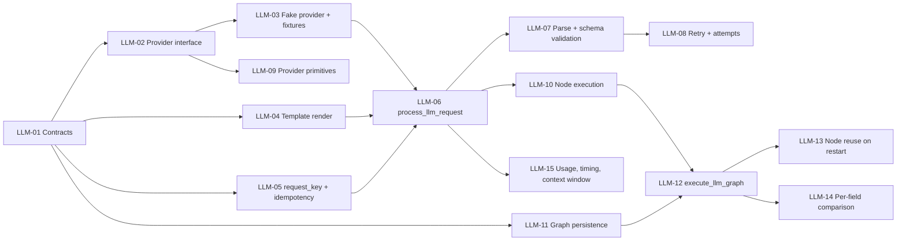

# WBS — procesador-llm-call

| Field | Value |
|---|---|
| Document | WBS / task issues — `procesador-llm-call` (`docflow.llm`, `src/docflow/llm/`) |
| Phase | **1 — Processors, independently** (`docs/plan/README.md` §5) |
| Derived from | `docs/plan/subplan-procesador-llm-call.md` §4 (WBS table, waves) |
| Source of truth | `docs/plan/subplan-procesador-llm-call.md` + `docs/plan/README.md`; task IDs and titles are preserved verbatim from the subplan table |
| ID range | `LLM-01` … `LLM-15` |
| Status | `LLM-01` … `LLM-15` **DONE** (delivered 2026-09-26); **reopened 2026-10-03** — the streaming seam, §12; **reopened 2026-10-04** — the pixel half, §13 |

This document expands — never replaces — the subplan WBS. Every issue traces back to exactly one row of `subplan-procesador-llm-call.md` §4; no new scope is introduced here. `.github/copilot-instructions.md` governs code quality for every task.

> **Reopened twice.** The header said `NOT_STARTED` for all fifteen tasks; that was the owed flip
> `docs/plan/bitacora.md` (2026-09-26) records — the tasks were delivered, and a WBS is a frozen
> artifact, so flipping one is a plan revision. The 2026-10-03 pass made that revision **and**
> reopened the document, because the seam those tasks froze was extended afterwards (§12). The
> 2026-10-04 pass reopens it again for the pixel half (§13): the same fifteen rows, re-scoped, none
> renumbered. The §2 index carries the corrected deliverable per row.

## 1. Summary

| Field | Value |
|---|---|
| Phase | 1 — processors, independently (parallel with `pdf`, `image`, `ocr`); the internal inference subgraph is a follow-up inside the same phase |
| ID range | LLM-01 … LLM-15 |
| # tasks | 15 |
| Effort distribution | S ×3 (LLM-01, 02, 03) · M ×8 (LLM-04, 05, 06, 07, 08, 10, 14, 15) · L ×4 (LLM-09, 11, 12, 13) |
| Critical path | `LLM-01 → LLM-02 → LLM-03 → LLM-06 → LLM-07 → LLM-08` (single-call chain) and `LLM-01 → LLM-06 → LLM-10 → LLM-11 → LLM-12 → LLM-13` (graph chain); the binding path ends at LLM-13 |
| Definition of Done gate | `pytest` · `ruff check .` · `ruff format --check .` · `pylint src tests`, plus mutation-falsified invariant tests |

**Scope.** Turn an already-defined `LLMInput` into a structured, validated, traceable `LLMResult`: template render, prompt build, `request_key`, provider call, parse, schema validation, retries, and — as a follow-up in the same phase — a **fixed linear inference chain** (`classify → extract_a → extract_b → compare → validate → consolidate`) with node reuse and per-field comparison. Providers live only in `llm/primitives/`; persistence lives only under `llm/`. No documental decision is taken here. The chain's dynamic machinery (node claims, parallel branches, `SKIP` / `FORCE` / `INVALIDATE`, graph stop, the per-node artifact tree, consensus scoring) is deferred to the MVP gate with `# TODO: [MVP]` inside `LLM-10`…`LLM-14`: those rows are re-scoped, never renumbered, so every range citation stays valid and effort stays as estimated.

## 2. Task issue index

| ID | Task (short) | Effort | Wave | Depends on | Deliverable artifact(s) | Issue file | Status |
|---|---|---|---|---|---|---|---|
| LLM-01 | Contract dataclasses | S | 1 — Contracts & primitives | — | `LLMInput`, `LLMResult`, `LLMNodeResult`, `LLMGraphState`, `LLMAttempt`, `ComparisonResult`, `Usage`, `Timing`, stage-state enums | this file §LLM-01 | DONE |
| LLM-02 | Provider primitive interface + result/error types | S | 1 — Contracts & primitives | LLM-01 | `llm/primitives/`, `LLMProvider` types | this file §LLM-02 | DONE |
| LLM-03 | In-memory fake provider + fixtures | S | 1 — Contracts & primitives | LLM-02 | `fixtures/llm/template/simple_extract.md`, `fixtures/llm/schema/simple.schema.json`, fake provider | this file §LLM-03 | DONE |
| LLM-04 | Template render & prompt build | M | 1 — Contracts & primitives | LLM-01 | variable injection, `<doc>`/`<extra>`/`<extra:key>`/`<schema>` resolution in a single pass, sanitize; the asset root and the two identifier→path rules; a template asking for a document no request carries is a typed failure | this file §LLM-04 | DONE |
| LLM-05 | `calculate_request_key` + idempotency helpers | M | 1 — Contracts & primitives | LLM-01 | `calculate_request_key`, `find_reusable_node_result`, `is_node_reusable`, `validate_cached_result` | this file §LLM-05 | DONE |
| LLM-06 | `process_llm_request` single-call happy path | M | 2 — Single call | LLM-03, LLM-04, LLM-05 | `process_llm_request`; the planned call carries the request's `document` and `images` | this file §LLM-06 | DONE |
| LLM-07 | Parse + schema validation | M | 2 — Single call | LLM-06 | `load_schema`, `validate_schema`, `parse_json_response`, `validate_llm_result`; the enforced keyword subset is closed and includes `minItems`, where a review's completeness is enforced | this file §LLM-07 | DONE |
| LLM-08 | Retry + attempt history | M | 2 — Single call | LLM-07 | `retry_llm_request`, `should_retry`, `increment_attempt` | this file §LLM-08 | DONE |
| LLM-09 | Provider primitives: Ollama + OpenAI-compatible | L | 2 — Single call | LLM-02 | `generate_text`, `generate_multimodal`, `generate_structured`, `list_models`, `check_model_available`, `get_context_window`; `resolve_generator` decides which one carries an image, and the transport translates the stated window where it can | this file §LLM-09 | DONE |
| LLM-10 | Node execution | M | 3 — Linear chain | LLM-06 | `process_llm_node`, node-state transitions (`claim_node` deferred) | this file §LLM-10 | DONE |
| LLM-11 | Graph persistence in `llm/` | L | 3 — Linear chain | LLM-01 | `llm/run_001/{state.json, final_result.json}`, atomic writes, load/save `LLMGraphState` | this file §LLM-11 | DONE |
| LLM-12 | `execute_llm_graph` | L | 3 — Linear chain | LLM-10, LLM-11 | fixed chain order, node reuse, completion detection | this file §LLM-12 | DONE |
| LLM-13 | Node reuse on restart | L | 3 — Linear chain | LLM-12 | resume over the saved chain state: `REUSED` nodes, pending nodes executed | this file §LLM-13 | DONE |
| LLM-14 | Per-field comparison + consolidation | M | 3 — Linear chain | LLM-12 | `compare_outputs` (`calculate_consensus` deferred); a per-field vector is compared field by field, never as one score | this file §LLM-14 | DONE |
| LLM-15 | Usage, timing and context-window control | M | 2 — Single call | LLM-06 | `count_tokens`, `truncate_to_token_limit`, `is_context_limit_exceeded`, `context_verdict`; the pre-flight counts a stated image cost and never reports a fit it cannot measure | this file §LLM-15 | DONE |

> The subplan records LLM-01, LLM-02 and LLM-03 as `S`; LLM-04 … LLM-08, LLM-10, LLM-14, LLM-15 as `M`; and LLM-09, LLM-11, LLM-12, LLM-13 as `L`.

## 3. Detailed issues

### LLM-01 — Contract dataclasses

- **Type:** Contracts
- **Effort:** S
- **Wave:** 1 — Contracts & primitives
- **Depends on:** —
- **Blocks:** LLM-02, LLM-04, LLM-05, LLM-11
- **Objective:** Freeze the inference vocabulary: the input task, the aggregate result, the per-node result and the internal graph state, plus attempt, comparison, usage and timing records.
- **Scope / Deliverables:** `LLMInput` (`task`, `provider`, `model`, `template`, `document`, `images`, `extra_context`, `schema`, `options`, `graph`, `metadata`); `LLMResult` (`run_id`, `task`, `provider`, `model`, `graph_id`, `node_results`, `raw_response`, `parsed_response`, `schema_valid`, `validation_errors`, `attempts`, `comparisons`, `usage`, `timing`, `status`, `metadata`); `LLMNodeResult` (`node_id`, `request_key`, `status`, `result`, `attempts`, `validation`, `usage`, `timing`, `metadata`); `LLMGraphState` (`run_id`, `graph_id`, `graph_version`, `status`, `current_nodes`, `node_states`, `node_results`, `attempts`, `comparisons`, `errors`, `usage`, `stop_requested`, `final_result`); `LLMAttempt`, `ComparisonResult`, `Usage`, `Timing`; stage-state enums aligned with the orchestrator vocabulary (`NOT_STARTED`, `READY`, `RUNNING`, `SUCCESS`, `FAILED`, `SKIPPED`, `REUSED`, `INVALIDATED`, `PAUSED`).
- **Out of bounds:** No provider access, no persistence, no graph execution; `LLMGraphState` is internal and never replaces the orchestrator's `DocumentContext` / `PageContext` / `StageExecution`; no domain noun in the API.
- **Acceptance criteria:**
  - Given the contract module, when a required field is omitted, then construction fails (no silent default).
  - Then `LLMInput.graph` remains data (`nodes`, `depends_on`) and no executable behaviour is attached to it.
- **Evidence / DoD:** Type hints complete; Google-style docstrings; `ruff check .` and `pylint src tests` clean.
- **Tags:** —

### LLM-02 — Provider primitive interface and error types

- **Type:** Skeleton
- **Effort:** S
- **Wave:** 1 — Contracts & primitives
- **Depends on:** LLM-01
- **Blocks:** LLM-03, LLM-09
- **Objective:** Define the single seam through which any provider (Ollama, vLLM, hosted OpenAI-compatible API) is reached, with typed results and classified errors.
- **Scope / Deliverables:** `llm/primitives/` package; `LLMProvider` interface and its result/error types; error kinds `PROVIDER_ERROR`, `TIMEOUT`, `MODEL_UNAVAILABLE`, `CONTEXT_OVERFLOW`, `INVALID_RESPONSE`, `INVALID_JSON`, `SCHEMA_ERROR`, `DEPENDENCY_ERROR`, `INTERNAL_ERROR`, each marked `RETRYABLE` or `NON_RETRYABLE`; `get_model_info` for `model_version`.
- **Out of bounds:** No concrete transport yet (that is LLM-09); no provider import outside `llm/primitives/`; no silent default provider or model.
- **Acceptance criteria:**
  - Given the interface, when a provider is swapped, then `LLMInput → LLMResult` is unchanged.
  - Then every error kind carries a `RETRYABLE` / `NON_RETRYABLE` classification.
- **Evidence / DoD:** Import check; unit test over the error classification table.
- **Tags:** `# TODO: [MVP]` for the real transport in LLM-09.

### LLM-03 — In-memory fake provider and committed fixtures

- **Type:** Skeleton
- **Effort:** S
- **Wave:** 1 — Contracts & primitives
- **Depends on:** LLM-02
- **Blocks:** LLM-06
- **Objective:** Provide a deterministic, scriptable provider so the whole processor can be tested without a real model, and commit the prompt/schema fixtures the tests use verbatim.
- **Scope / Deliverables:** `tests/fakes/engines/fake_provider.py` — an in-memory fake provider implementing the `llm/primitives/` interface, returning deterministic valid JSON, scriptable to return invalid JSON or raise timeouts, with a **call counter**; injected at the provider primitive the call resolves, with the provider SDK imported inside that primitive so importing the seam needs no provider installed; `fixtures/llm/template/simple_extract.md` with `<doc>`, `<extra>` and `<schema>` placeholders; `fixtures/llm/schema/simple.schema.json` exercising required fields and types.
- **Out of bounds:** No real network access; the fake must not be reachable from production code paths as a fallback. `LLM-03` keeps a **scripted** in-memory fake deliberately, in the shape the engine doubles of `pdf`, `image` and `ocr` use (`README.md` §9.7): LLM responses are not deterministic for a fixed input, and `LLM-08` needs a scripted sequence. No test reaches a provider — not Ollama, not vLLM, not a hosted API.
- **Acceptance criteria:**
  - Given the fake provider scripted with a valid response, when it is called, then it returns the same JSON for the same input and the call counter increments.
  - Given the fake scripted to fail on attempt 1 and succeed on attempt 2, then both behaviours are reproducible in a test.
  - Given this seam replaces a provider primitive of ours rather than an engine namespace, the attribute check of `tests/fakes/engines/convention.py` does not apply here: what this double must model is the provider's **native return shape** plus the scripted sequence, asserted by the tests that consume it.
- **Evidence / DoD:** Fake provider is exercised by the LLM-06, LLM-08 and LLM-13 tests; fixtures are committed.
- **Tags:** `# TODO: [MVP]` where the fake stands in for a real provider.

### LLM-04 — Template render and prompt build

- **Type:** Primitive
- **Effort:** M
- **Wave:** 1 — Contracts & primitives
- **Depends on:** LLM-01
- **Blocks:** LLM-06
- **Objective:** Turn `LLMInput` plus a template into a rendered prompt with the document, extra context and schema resolved and sanitized.
- **Scope / Deliverables:** `process_template`, `process_prompt`, variable injection, `<doc>` / `<extra>` / `<extra:key>` / `<schema>` resolution in a single pass, sanitize; the rendered prompt is the exact value hashed into `request_key`.
- **Out of bounds:** No provider call; no schema validation; no silent truncation of the prompt (truncation belongs to LLM-15 and must be explicit); a missing placeholder must not be replaced by an empty string silently.
- **Acceptance criteria:**
  - Given the committed template and an `LLMInput` with document and schema, when rendering runs, then the prompt contains the document text and the schema and no unresolved placeholder remains.
  - Given the same inputs, when rendering runs twice, then the rendered prompt is byte-identical.
  - Given a template naming `<extra:key>`, when the request carries that key, then only that key's value is inserted; when it does not, then rendering stops with a `DEPENDENCY_ERROR` naming the key.
- **Evidence / DoD:** Fixture-based test asserting placeholder resolution and determinism.
- **Tags:** `# TODO: [MVP]` for richer template features.

### LLM-05 — `calculate_request_key` and idempotency helpers

- **Type:** Primitive
- **Effort:** M
- **Wave:** 1 — Contracts & primitives
- **Depends on:** LLM-01
- **Blocks:** LLM-06
- **Objective:** Make a logical inference request identifiable independently of run identity, and make the reuse decision explicit.
- **Scope / Deliverables:** `calculate_request_key` = `hash(provider + model + model_version + rendered_prompt + input_hashes + schema_hash + normalized_options)`, with `run_id`, `graph_id`, `node_id` and `attempt_id` deliberately excluded; `find_reusable_node_result`, `is_node_reusable`, `validate_cached_result`; the rule *reuse only when `request_key` matches AND `status == SUCCESS` AND the persisted result is valid*.
- **Out of bounds:** No provider call, no persistence backend of its own, no decision that a graph has finished; physical file existence alone must never imply reuse.
- **Acceptance criteria:**
  - Given two logically identical requests differing only in `run_id` / `node_id` / `attempt_id`, when `calculate_request_key` runs, then both keys are identical.
  - Given a `SUCCESS` node with a matching key and valid persisted result, when `is_node_reusable` runs, then it returns true; given a mismatched key, it returns false.
- **Evidence / DoD:** Unit tests for key determinism and the reuse predicate; the request_key invariant (see §7).
- **Tags:** —

### LLM-06 — `process_llm_request` single-call happy path

- **Type:** Entry point
- **Effort:** M
- **Wave:** 2 — Single call
- **Depends on:** LLM-03, LLM-04, LLM-05
- **Blocks:** LLM-07, LLM-10, LLM-15
- **Objective:** Wire template → prompt → key → payload → provider call → parse → validate into the single-call entry point.
- **Scope / Deliverables:** `process_llm_request(input) -> LLMResult`; build messages and the provider payload; record one `LLMAttempt` with `usage` and `timing`; `status == SUCCESS` with `schema_valid` on the happy path.
- **Out of bounds:** No documental decision (which document, whether OCR runs, which source wins); no fallback to re-running OCR/image/PDF; no graph execution (that is LLM-12); no silent default provider, model or schema.
- **Acceptance criteria:**
  - Given a valid `LLMInput` with template, schema and fake provider, when `process_llm_request` runs, then it returns `status == SUCCESS`, `schema_valid == true`, a non-empty `request_key` and exactly one recorded attempt with usage and timing.
  - Given the same input, when the call is repeated, then the `request_key` is identical.
- **Evidence / DoD:** Happy-path test with the fake provider and committed fixtures.
- **Tags:** `# TODO: [MVP]` for real provider transport integration.

### LLM-07 — Parse and schema validation

- **Type:** Validation
- **Effort:** M
- **Wave:** 2 — Single call
- **Depends on:** LLM-06
- **Blocks:** LLM-08
- **Objective:** Turn a raw provider response into a validated structured result, with an explicit verdict instead of a plausible-looking guess.
- **Scope / Deliverables:** `load_schema`, `validate_schema`, `parse_json_response`, `validate_llm_result`; `schema_valid` and `validation_errors` populated in `LLMResult`.
- **Out of bounds:** No aggregate confidence score in place of per-field evidence; an invalid response must never be reported as valid; validation never converts failure into a documental fallback.
- **Acceptance criteria:**
  - Given a response missing a required schema field, when validation runs, then `schema_valid` is false and `validation_errors` names the missing field.
  - Given valid JSON with an extra unexpected field, then the result is `INVALID_JSON` or a documented `SCHEMA_ERROR` — never silently accepted.
- **Evidence / DoD:** Unit tests over the committed schema fixture with valid, invalid and malformed payloads.
- **Tags:** `# TODO: [MVP]` for richer schema features.

### LLM-08 — Retry and attempt history

- **Type:** Primitive
- **Effort:** M
- **Wave:** 2 — Single call
- **Depends on:** LLM-07
- **Blocks:** —
- **Objective:** Retry a retryable failure while preserving every prior attempt, and never mask a non-retryable error.
- **Scope / Deliverables:** `retry_llm_request`, `should_retry`, `increment_attempt`; attempt ids distinct while `request_key` stays identical across attempts.
- **Out of bounds:** No documental retry (whole-processor retry belongs to the orchestrator); no retry of a `NON_RETRYABLE` error; attempt history must never be discarded.
- **Acceptance criteria:**
  - Given the fake provider returning invalid JSON on attempt 1 and valid JSON on attempt 2, when `process_llm_request` runs, then the result is `SUCCESS`, both attempts are present, attempt ids differ and `request_key` is unchanged.
  - Given a `NON_RETRYABLE` error, then no further attempt is made.
- **Evidence / DoD:** Scripted-fake test covering the retry scenario and the non-retryable short-circuit.
- **Tags:** `# TODO: [RELEASE]` for production retry queues and backoff policy.

### LLM-09 — Provider primitives (Ollama and OpenAI-compatible)

- **Type:** Primitive
- **Effort:** L
- **Wave:** 2 — Single call
- **Depends on:** LLM-02
- **Blocks:** —
- **Objective:** Implement the minimal provider surface for Ollama (local) and an OpenAI-compatible endpoint (vLLM / hosted API), each swappable behind the contract.
- **Scope / Deliverables:** `generate_text`, `generate_multimodal`, `generate_structured`, `list_models`, `check_model_available`, `get_context_window` in `llm/primitives/`; Ollama first, OpenAI-compatible second.
- **Out of bounds:** No provider usage outside `llm/primitives/`; no default model substitution when configuration is absent; no other processor importing a provider; no GPU-competition or production queue logic.
- **Acceptance criteria:**
  - Given an unavailable model, when `check_model_available` runs, then a typed `MODEL_UNAVAILABLE` error is returned instead of a silent fallback.
  - Given a provider swap, then the contract and the workflow are unchanged.
- **Evidence / DoD:** Interface-conformance test asserting the fake and the transport classes expose the same surface **structurally**, with no provider reached (`README.md` §9.7); `# TODO: [MVP]` markers on the real transport.
- **Tags:** `# TODO: [MVP]` real transport; `# TODO: [RELEASE]` GPU-competition and queue policy.

### LLM-10 — Node execution

- **Type:** Primitive
- **Effort:** M
- **Wave:** 3 — Linear chain
- **Depends on:** LLM-06
- **Blocks:** LLM-12
- **Objective:** Execute one node of the fixed linear chain, reporting its state through the shared vocabulary and never letting a provider failure corrupt the chain state.
- **Scope / Deliverables:** `process_llm_node`; node-state transitions (`READY` → `RUNNING` → `SUCCESS` / `FAILED`); a failed node reported as a typed `FAILED` result with errors.
- **Out of bounds:** No dependency resolution or routing (that is LLM-12); no node claims, no multi-worker coordination and no resume/force semantics — `claim_node` lands with the deferred machinery (`# TODO: [MVP]`); no documental decision.
- **Acceptance criteria:**
  - Given a node with a valid request, when `process_llm_node` runs, then its `LLMNodeResult.status` moves through `RUNNING` to `SUCCESS` and the chain state stays loadable.
  - Given a node whose provider call fails, then its `LLMNodeResult.status` is `FAILED` and the graph state remains loadable.
- **Evidence / DoD:** Unit tests for the transition sequence and the typed failure path.
- **Tags:** `# TODO: [MVP]` for `claim_node` and multi-worker claims.

### LLM-11 — Graph persistence in the `llm/` namespace

- **Type:** Primitive
- **Effort:** L
- **Wave:** 3 — Linear chain
- **Depends on:** LLM-01
- **Blocks:** LLM-12
- **Objective:** Persist and reload the chain state atomically, entirely under `llm/`, with one file per concern.
- **Scope / Deliverables:** Load/save of `LLMGraphState`; atomic writes (`*.tmp` → validate → rename); the two artifacts `llm/run_001/state.json` and `llm/run_001/final_result.json`; in-memory store first.
- **Out of bounds:** No writes outside `llm/`; `LLMGraphState` must never replace the orchestrator's `DocumentContext`; no per-node artifact tree, no DB and no schema introduced in Phase 1 (`# TODO: [MVP]`).
- **Acceptance criteria:**
  - Given a saved chain state, when it is reloaded, then node states, node results, attempts and comparisons round-trip exactly.
  - Given an interrupted write, then no `.tmp` file and no partially written final artifact remains under `llm/`.
- **Evidence / DoD:** Round-trip test plus failure-path test asserting the namespace contains no `.tmp` residue.
- **Tags:** `# TODO: [MVP]` for a durable (file-backed) store and for the per-node artifact tree.

### LLM-12 — `execute_llm_graph`

- **Type:** Entry point
- **Effort:** L
- **Wave:** 3 — Linear chain
- **Depends on:** LLM-10, LLM-11
- **Blocks:** LLM-13, LLM-14
- **Objective:** Run the fixed linear chain (`classify → extract_a → extract_b → compare → validate → consolidate`) in order, reusing valid node results and consolidating them into one `LLMResult`.
- **Scope / Deliverables:** `execute_llm_graph`; node resolution order (reuse → execute), with `extract_a` / `extract_b` executed sequentially; completion detection; the final consolidation into `LLMResult`.
- **Out of bounds:** No documental orchestration; no OCR/PDF/image re-run as a fallback; the chain shape stays data from `LLMInput.graph` (no hardcoded workflow); no routing beyond the declared order, no parallel branches, no subgraph lifecycle — all deferred (`# TODO: [MVP]`).
- **Acceptance criteria:**
  - Given a graph descriptor with `classify → extract_a/extract_b → compare → validate → consolidate`, when `execute_llm_graph` runs on the fake provider, then every node is `SUCCESS` and the `LLMResult` carries the consolidated `final_result.json`.
  - Given a node already `SUCCESS` with a matching `request_key`, then the fake provider's call counter does not increase for it.
- **Evidence / DoD:** Graph happy-path test plus the no-re-execution invariant (see §7).
- **Tags:** `# TODO: [MVP]` for parallel branches and subgraph lifecycle.

### LLM-13 — Node reuse on restart

- **Type:** Entry point
- **Effort:** L
- **Wave:** 3 — Linear chain
- **Depends on:** LLM-12
- **Blocks:** —
- **Objective:** Make a partially executed chain resumable without repeating valid, costly calls.
- **Scope / Deliverables:** the resume path over the saved chain state: a `SUCCESS` node with a matching `request_key` is `REUSED` and only the pending nodes (including a previously `FAILED` one) run; node actions limited to `EXECUTE` / `REUSE` / `RETRY`.
- **Out of bounds:** No documental `stop`/`resume` (that is the orchestrator's `DocumentContext`); no `request_graph_stop`, no `resume_llm_graph`, no per-node `SKIP` / `FORCE` / `INVALIDATE` and no `invalidate_downstream_nodes` — deferred to the MVP gate (`# TODO: [MVP]`); no cross-process locking.
- **Acceptance criteria:**
  - Given a partially executed chain where `classify` and `extract_a` are `SUCCESS` and `extract_b` is `FAILED`, when the chain is resumed with the same `run_id` and inputs, then `classify` and `extract_a` are `REUSED` with no new provider calls and `extract_b`, `compare`, `validate`, `consolidate` are executed.
- **Evidence / DoD:** Resume test using the fake provider's call counter; the no-re-execution invariant (see §7).
- **Tags:** `# TODO: [MVP]` for `request_graph_stop`, `SKIP` / `FORCE` / `INVALIDATE` and downstream invalidation.

### LLM-14 — Per-field comparison and consolidation

- **Type:** Primitive
- **Effort:** M
- **Wave:** 3 — Linear chain
- **Depends on:** LLM-12
- **Blocks:** —
- **Objective:** Compare the `extract_a` / `extract_b` outputs per field and consolidate a single result without collapsing evidence into an opaque score.
- **Scope / Deliverables:** `compare_outputs`; `comparisons` populated as `ComparisonResult` in `LLMResult`.
- **Out of bounds:** No aggregate confidence score, and no consensus scoring — `calculate_consensus` is deferred (`# TODO: [MVP]`); no documental verdict; disagreement must be reported as data, not resolved silently.
- **Acceptance criteria:**
  - Given two differing node outputs, when `compare_outputs` runs, then the differences are enumerated per field in `ComparisonResult`.
  - Given identical node outputs, then every field is reported as agreeing, still as per-field evidence.
- **Evidence / DoD:** Unit tests over crafted node outputs (agreeing and disagreeing).
- **Tags:** `# TODO: [MVP]` for the richer comparison policy and consensus scoring.

### LLM-15 — Usage, timing and context-window control

- **Type:** Primitive
- **Effort:** M
- **Wave:** 2 — Single call (its only predecessor is LLM-06; it does not wait for the graph)
- **Depends on:** LLM-06
- **Blocks:** —
- **Objective:** Account for tokens, latency and cost per attempt and make context truncation explicit rather than silent.
- **Scope / Deliverables:** `count_tokens`, `truncate_to_token_limit`, `is_context_limit_exceeded`; `Usage` and `Timing` recorded per attempt and aggregated in `LLMResult`.
- **Out of bounds:** No silent truncation (any truncation must be recorded in metadata); no telemetry/observability beyond per-attempt usage and timing; no aggregate confidence score.
- **Acceptance criteria:**
  - Given a prompt exceeding the model context window, when `is_context_limit_exceeded` runs, then it reports the overflow and truncation is only applied explicitly with a recorded flag.
  - Given a successful call, then `Usage` and `Timing` are non-empty on the attempt record.
- **Evidence / DoD:** Unit tests for the overflow predicate and the truncation record.
- **Tags:** `# TODO: [RELEASE]` for telemetry and cost accounting.

## 4. Dependency graph

```mermaid
flowchart LR
    LLM01["LLM-01 Contracts"] --> LLM02["LLM-02 Provider interface"]
    LLM02 --> LLM03["LLM-03 Fake provider + fixtures"]
    LLM01 --> LLM04["LLM-04 Template render"]
    LLM01 --> LLM05["LLM-05 request_key + idempotency"]
    LLM02 --> LLM09["LLM-09 Provider primitives"]
    LLM03 --> LLM06["LLM-06 process_llm_request"]
    LLM04 --> LLM06
    LLM05 --> LLM06
    LLM06 --> LLM07["LLM-07 Parse + schema validation"]
    LLM07 --> LLM08["LLM-08 Retry + attempts"]
    LLM06 --> LLM10["LLM-10 Node execution"]
    LLM01 --> LLM11["LLM-11 Graph persistence"]
    LLM10 --> LLM12["LLM-12 execute_llm_graph"]
    LLM11 --> LLM12
    LLM12 --> LLM13["LLM-13 Node reuse on restart"]
    LLM12 --> LLM14["LLM-14 Per-field comparison"]
    LLM06 --> LLM15["LLM-15 Usage, timing, context window"]
```

## 5. Execution waves

| Wave | Tasks | Entry condition | Exit condition |
|---|---|---|---|
| 1 — Contracts & primitives | LLM-01 → LLM-02 → LLM-03, LLM-04, LLM-05 | Phase 0 exit met; subplan §7 DoR satisfied | Contracts frozen, provider seam typed, deterministic fake provider and committed template/schema fixtures in place |
| 2 — Single call | LLM-06 → LLM-07 → LLM-08; LLM-09 in parallel after LLM-02; LLM-15 in parallel after LLM-06 | Wave 1 green | One call round-trips `LLMInput → LLMResult` with schema validation, attempt history and token/context control; provider primitives implemented |
| 3 — Linear chain | LLM-10, LLM-11 → LLM-12 → LLM-13; LLM-14 after LLM-12 | Wave 2 green | The fixed chain executes, persists two files, resumes without re-calling a `REUSED` node and compares per field |

Each wave ends with the four QA gates green and its happy-path / invariant tests passing.

## 6. Critical path

`LLM-01 → LLM-02 → LLM-03 → LLM-06 → LLM-07 → LLM-08` (the single-call spine, closing the Phase 1 exit criterion), extended by `LLM-06 → LLM-10 → LLM-11 → LLM-12 → LLM-13` (the chain spine, the longest chain in this subplan).

It is critical because the contracts (LLM-01) and the provider seam (LLM-02) precede any call; the fake provider plus fixtures (LLM-03) are the only way the happy path can be proven without a real model; the single-call entry point (LLM-06) gates both the validation/retry spine and the entire graph branch; and the graph spine (LLM-10 → LLM-11 → LLM-12 → LLM-13) is what closes the "valid work is never repeated" property of the processor. LLM-09 (Effort L) and LLM-15 are parallel branches that do not lengthen the chain but carry the largest implementation risk.

## 7. Traceability

| Acceptance scenario (subplan §5) | Implemented by | Tested by |
|---|---|---|
| Single call produces a validated result | LLM-04, LLM-05, LLM-06, LLM-07 | Happy-path test with the fake provider and committed fixtures |
| Restart reuses valid nodes and re-runs only pending ones | LLM-05, LLM-10, LLM-11, LLM-12, LLM-13 | Resume test with the fake provider call counter; invariant 1 (no re-execution of a valid call) |
| Forcing a node invalidates its downstream dependents — deferred with the chain's dynamic machinery (`# TODO: [MVP]`, subplan §9.6) | LLM-13 | Not claimed in Phase 1; the documental equivalent is `ORC-09` / `ORC-19` invariant 2 |
| A retryable invalid response is retried and prior attempts are kept | LLM-07, LLM-08 | Scripted-fake retry test (both attempts present, ids differ, `request_key` unchanged); invariant 2 (`request_key` determinism and independence from run identity) |
| Invariant 1 — no re-execution of a valid call (mutation: `is_node_reusable` always false / drop the `SUCCESS` check) | LLM-05, LLM-13 | Must fail under mutation, then restore green |
| Invariant 2 — `request_key` determinism (mutation: add `run_id` / nonce to the hash) | LLM-05 | Must fail under mutation, then restore green |
| Invariant 3 — downstream invalidation on force — deferred with the chain's dynamic machinery (`# TODO: [MVP]`) | LLM-13 | Lands with the deferred machinery; not part of the Phase 1 DoD |
| Provider conformance (Ollama / OpenAI-compatible swap) | LLM-02, LLM-09 | Interface-conformance test over the interface only — never a live provider (`README.md` §9.7); typed `MODEL_UNAVAILABLE` on a missing model |

## 8. Definition of Ready (per task)

- The task appears as a row in `subplan-procesador-llm-call.md` §4 with the same ID, title, effort and dependencies.
- `LLMInput`, `LLMResult`, `LLMNodeResult` and `LLMGraphState` field lists are fixed per the subplan §3, and the request/reuse rule (`request_key` + `SUCCESS` + valid persisted result → `REUSE`) is written down and agreed.
- A fake provider and at least one template + schema fixture are committed before LLM-06 starts.
- The chain shape (`classify → extract_a → extract_b → compare → validate → consolidate`), the fixed sequential order and the two-level separation from the orchestrator are agreed with the orchestrator owner.
- The deferred machinery is named, not implied: `claim_node`, parallel branches, `SKIP` / `FORCE` / `INVALIDATE`, `request_graph_stop`, `resume_llm_graph`, `invalidate_downstream_nodes`, the per-node artifact tree and `calculate_consensus` are tagged `# TODO: [MVP]` in `LLM-10`…`LLM-14` before any of those tasks starts.
- The provider choice (Ollama first; vLLM/API interchangeable) and the persistence approach (in-memory + JSON under `llm/`) are recorded; all decisions in subplan §9 are resolved.
- No open question blocks the happy path; no domain noun is introduced into the processor API.

## 9. Definition of Done (per task)

- [ ] `pytest` green with the task's happy-path and/or invariant test using the deterministic fake provider and committed fixtures.
- [ ] `ruff check .` clean (import order included) · `ruff format --check .` clean · `pylint src tests` clean (`fixme` disabled).
- [ ] Every invariant test touched by the task has been mutation-falsified: mutate → observe failure → restore → re-run green, both observations reported.
- [ ] No silent stand-in (no empty string, `0`, `[]`, `None`-without-reason, no default provider, model, engine or schema); no aggregate confidence score in place of per-field comparison evidence.
- [ ] Providers reached only through `llm/primitives/`; no import of another processor; no domain noun in any API; no documental decision (source selection, OCR/VLM routing, page consolidation) taken here.
- [ ] Artifacts persisted atomically (`*.tmp` → validate → rename) and only under `llm/`; a failed node reported as a typed `FAILED`, never propagated as a corrupting exception.
- [ ] Every shortcut carries an inline `# TODO: [MVP]` (real provider transport, real persistence) or `# TODO: [RELEASE]` (telemetry, HA, caching) tag; output, identifiers, docstrings and comments in English.
- [ ] The phase exit is owned: `LLM-06` owns the happy path and `LLM-13` closes Wave 3 with the four QA gates and their captured output, so the exit criterion is a deliverable rather than a side effect. The "no processor imports another processor" half is checked on the integrated tree by `GEN-18`.

## 10. Risks & mitigations (execution view)

| Risk (subplan §8) | Task affected | Mitigation owned by |
|---|---|---|
| Repeating expensive LLM calls on restart | LLM-05, LLM-13 | LLM-05 (`request_key` + reuse rule) + LLM-13 (resume path) + invariant 1 |
| Race condition: two workers run the same node | LLM-10 | Not reachable in Phase 1: the chain runs sequentially under a single owner; `claim_node` `READY → RUNNING` and one owner per `run_id` land with the deferred machinery (`# TODO: [MVP]`) |
| Silent invalid output reported as correct | LLM-07, LLM-08 | LLM-07 (mandatory structural/schema validation) + LLM-08 (typed `FAILED`, never swallowed) |
| Provider/model drift (Ollama, vLLM, hosted API) | LLM-02, LLM-05, LLM-09 | LLM-05 (`provider` + `model` + `model_version` in `request_key`) + LLM-15 (usage/timing per attempt) |
| Context overflow / truncated prompt | LLM-15 | LLM-15 (explicit `count_tokens` / `truncate_to_token_limit` with metadata, never silent truncation) |
| Scope creep into a full workflow engine | LLM-01, LLM-12 | LLM-01 (contracts only) + LLM-12 (happy path first; documental decisions stay with the orchestrator; `# TODO` marks the deferrals) |

## 11. Out of scope

- Documental workflow, source selection (`native_text` vs `OCR` vs `IMAGE`), OCR/VLM routing, page consolidation (→ `procesador-orquestador`).
- Multi-document batching and distributed execution.
- Real GPU-competition policy and production retry queues (`# TODO: [RELEASE]`).
- Domain-specific extraction rules; prompts and schemas are data assets, not code.
- Observability/telemetry beyond per-attempt `usage` / `timing` records.
- The inference subgraph's dynamic machinery: `claim_node` and multi-worker claims, parallel branches, per-node `SKIP` / `FORCE` / `INVALIDATE`, `request_graph_stop`, `resume_llm_graph`, `invalidate_downstream_nodes`, the per-node artifact tree and `calculate_consensus` — deferred to the MVP gate and tagged `# TODO: [MVP]` in `LLM-10`…`LLM-14`.

## 12. Second pass — the streaming seam (`LLM-02`, `LLM-06`, `LLM-10`, `LLM-12`)

Reopened 2026-10-03, after the probes under `scripts/tmpref/` were run against live models. The
probes are scratch and not part of the deliverable; what they proved is that reading an answer as it
is written is a property of the *call*, not an eighth primitive and not a second transport — the
shape :class:`~docflow.llm.primitives.ProviderCall` already carried, and which nothing above the seam
could reach.

**What was wrong.** `ProviderCall.stream` and `ProviderCall.observer` were added to the seam, and
`process_llm_request`, `process_llm_node` and `execute_llm_graph` built their calls without them.
A caller that reached `docflow.llm.primitives` directly could watch a reasoning model think; a
caller that went through the processor — which is every caller the architecture allows — could not.

**Scope of the pass.** No task ID is added and no task is re-scoped: this is a pass over four rows
that already exist.

| Row | What the pass changed |
|---|---|
| `LLM-02` | `stream` is a *control option*: it is read out of `options` into the call, is stripped from the decoding options handed to the provider, and is **absent from `request_key`** — a streamed answer is the same answer, so a node answered over a stream stays reusable by the next run. `DeltaObserver` becomes a real alias rather than a forward reference, so a signature that names it is resolvable outside the seam |
| `LLM-06` | `process_llm_request(request, *, observer=None)` hands the observer to the call it plans |
| `LLM-10` | `process_llm_node(node_config, state, *, observer=None)`, the same way |
| `LLM-12` | `execute_llm_graph(request, *, observer=None)` passes it to every node that runs; a `REUSED` node reaches no provider and so watches nothing |

**The bench.** The lab bench is `SCR-05` / `SCR-15` in
[`wbs-scripts.md`](wbs-scripts.md), not here, and its rows are amended there. It was rebuilt in the
same pass, because a seam only a scratch probe can reach is not a seam the project has: the three
modules (`scripts/tools/_llm.py`, `llm.py`, `batch_llm.py`) were deleted and written again, so the
layer owns the flags, the `@FILE` extras, the stream switch and the naming of the two step artifacts
a `call` publishes, while the call, the answer and the wire shape stay the library's. `--name` pins
the step's stem, and the two artifacts are `<stem>.json` (the answer alone — the object a later step
reads back through `--extra KEY=@FILE`) and `<stem>_full.json` (the whole run), both published
through the library's atomic writer.

The bench also gained a ninth command, `prompt`, which is where the probes' `--print-prompt` landed:
it states the same request `call` does and stops before the provider, answering with the rendered
prompt, its token count and whether it fits the window the caller *stated* — never a probe. It is a
command rather than a switch on `call` because what a run publishes is a property of the command in
this bench (`REPORT_ONLY`), and a flag that changed it would make the run header's own statement
false.

**Evidence.** `pytest` 807 passed · `ruff check .` clean · `ruff format --check .` clean ·
`pylint src tests` 10.00/10 with the one pre-existing `docflow/pdf/entrypoints.py` `R0912`.
Three invariants were mutation-falsified (mutate → observe red → restore → observe green): the
stream switch is absent from `request_key`; the observer is fed on both the single-call and the
chain path, and a reused node is not; `--name` decides the published stem.

**Not claimed.** The bench's `call` publishes no answer file when the answer never parsed — the
library keeps an answer's text only once it has parsed, so the typed `INVALID_JSON` failure is what
`<stem>_full.json` holds. Keeping the unparsed text is a change to `LLM-07`'s attempt record and is
deliberately not made here.

*(One field's meaning moved afterwards: §13 makes the fit verdict three-valued — `fits`, `exceeds`,
`unmeasured` — and makes the stated window the one the call asks for.)*

## 13. Second pass — the pixel half (`LLM-04`, `LLM-06`, `LLM-07`, `LLM-09`, `LLM-14`, `LLM-15`)

Reopened 2026-10-04, from the probe `scripts/tmpref/image_prompt.py` and the work order
`docs/feedback/reopen-llm-call-vision-path.md`. The probe ran every vision step the registry ships
against live models and then took the path it had not taken itself — one vision call through
`process_llm_request`. It worked, and what it measured around that call is what this pass fixes and
records.

**What was wrong.** Three things the plan never stated, and one it stated in a way the code does not
implement:

| Finding | Measured |
|---|---|
| The pre-flight compared a number it knew was too small | one page image: **615** tokens estimated against **3 420** counted by the provider. `count_tokens` measures text, and nothing measured the image |
| "The window" had two spellings, and only one took effect | `context_window` guarded the pre-flight and was never sent; `num_ctx` was sent and resized the window. A live review overflowed a window its own pre-flight had blessed |
| The generator that carries images was not the one the plan named | `resolve_generator(structured=True, multimodal=True) == "generate_structured"`, and every registry vision step declares a schema, so `generate_multimodal` is unreachable from the registry |
| A review that dropped fields validated clean | 2 of 7 verdicts and 7 of 7 both returned `[]` from `validate_schema`: the registry's review schemas closed the `field` vocabulary and stated no count |

**Scope of the pass.** No task ID is added and no task is re-scoped away: this is a pass over six
rows that already exist, and the §2 index carries the corrected deliverable for each. The detailed
issues (§3, `LLM-04` … `LLM-15`) keep the text they were delivered with, as §12's pass left them —
§13 is where the second pass over a row is recorded, so a reader of a detail section is reading what
was built first, not what the row says today.

| Row | What the pass changed |
|---|---|
| `LLM-04` | The asset root (`metadata["assets_dir"]`, no default) and the two identifier→path rules are frozen in the subplan §3; a template carrying `<doc>` with a request carrying no document is a typed `DEPENDENCY_ERROR`, and `document=""` is not `document=None`. A second committed template fixture with no `<doc>` (`tests/fixtures/llm/template/simple_read_pixels.md`) is the shape a vision request has |
| `LLM-06` | The planned call carries `images=list(request.images)`; `ProviderCall.context_window` states the window the call asks for, so the value the pre-flight compares is the value the provider is given |
| `LLM-07` | `minItems` joins the closed enforced-keyword subset, and `_violations` applies it: a list shorter than the schema's count is now named by path, `$.field_verdicts: expected at least 7 items, got 2`. A schema using a keyword outside the subset is still refused at load time by name |
| `LLM-09` | The generator resolution is a stated rule (`resolve_generator`), not a menu the caller picks from; the Ollama transport translates the stated window into `num_ctx`, outranking a decoding option of the same name, and the OpenAI-compatible transport ignores it rather than inventing one |
| `LLM-14` | The subplan row says what the code does: a per-field vector is compared field by field, never as one score |
| `LLM-15` | `context_verdict(prompt_tokens, window, image_count=…, image_tokens=…)` returns `fits`, `exceeds` or `unmeasured`; a stated per-image cost (`metadata["image_tokens"]`) is added to the text estimate, and a request whose images nobody priced is never reported as fitting. Only `exceeds` stops the call |

**The registry's half.** The four step-shaped review schemas (`review/invoice`,
`review/invoice_vision`, `review/invoice_desglose`, `review/invoice_vision_desglose`) now state
`minItems` equal to the number of names their `field` enum lists (7, 7, 10, 10);
`review/general.schema.json` states none, because its `field` is unconstrained. Ollama accepts the
bounded schema — verified live, and the same call returned a complete seven-verdict answer.

**Evidence.** `pytest` 818 passed · `ruff check .` clean · `ruff format --check .` clean except the
pre-existing `registry/README.md` code block · `pylint src tests` 10.00/10 with the one pre-existing
`docflow/pdf/entrypoints.py` `R0912`. The bench's and the registry's own documentation moved with the
library, because both stated the old split: `scripts/tools/quickstart.md` gained a vision subsection
carrying the probe's eight pixel recipes, and the `prompt` paragraph, the window prose, the gate
recipe's comment and a known limitation were corrected; `scripts/tools/readme.md` and the `num_ctx`
comment in `scripts/tools/_llm.py` say the same thing now; and `registry/README.md`'s *Chaining the
steps* snippet states the two keys a vision caller carries. Every command added to the quickstart was
rendered before it was written down — eight of eight — and the snippet's documented shape was run
live against a stand-in tag: `SUCCESS`, seven fields, `context_verdict: fits`. Four mutations were
falsified (mutate → observe red → restore → observe green): the planned call dropping `images`; the
pre-flight ignoring a stated image cost; the transport not translating the stated window;
`ProviderCall.context_window` left unset. Invariants 4 and 5 are the two that were added, and each
names its mutation in its docstring.

**Live.** A vision call through `process_llm_request` on the paired receipt (`qwen2.5vl:7b`) and a
review of its answer against the now-bounded `review/invoice_vision` schema: `SUCCESS`, seven
verdicts, no violations, `context_verdict: fits` with a stated per-image cost of 2 800 against a
window of 16 384 — while the same run's provider counted 3 316 prompt tokens against the library's
527-token text estimate, which is the gap the per-image cost exists to close.

**Not claimed.** The unparsed-answer gap §12 records is unchanged. Whether `timeout` and
`max_attempts` belong to `request_key` is left open (subplan §9 decision 10): they bound an attempt
rather than shape an answer, but changing it moves which requests count as the same one. And the
bench still cannot send an image (`scripts/tools/_llm.py` states `images=[]`) — a `wbs-scripts.md`
row, named here and not moved.
