# WBS — procesador-ocr

| Field | Value |
|---|---|
| Document | WBS / task issues — `procesador-ocr` (`docflow.ocr`, `src/docflow/ocr/`) |
| Phase | **1 — Processors, independently** (`docs/plan/README.md` §5) |
| Derived from | `docs/plan/subplan-procesador-ocr.md` §4 (WBS table, order/waves) |
| Source of truth | `docs/plan/subplan-procesador-ocr.md` + `docs/plan/README.md`; task IDs and titles are preserved verbatim from the subplan table |
| ID range | `OCR-01` … `OCR-14` |
| Status | `OCR-01`…`OCR-10` **DONE** - the contract is frozen, the Docling seam is in place, the pipeline/configuration primitives are implemented, a real conversion is extracted into the engine-independent `OCRDocument`, the blocks are normalized into one coordinate frame and ordered by a rule rather than by arrival, the three canonical representations are built with no run-time data in them, the detected tables are exported in reading order under zero-padded names, the content metrics are measured from a real conversion on both a content page and a blank one, the verdict classifies a result into a typed state without ever throwing, and every artifact is published atomically with a `metadata.json` that carries the seven required keys; `OCR-11` … `OCR-14` `NOT_STARTED` |

This document expands — never replaces — the subplan WBS. Every issue traces back to exactly one row of `subplan-procesador-ocr.md` §4; no new scope is introduced here. `.github/copilot-instructions.md` governs code quality for every task.

## 1. Summary

| Field | Value |
|---|---|
| Phase | 1 — processors, independently (parallel with `pdf`, `image`, `llm`) |
| ID range | OCR-01 … OCR-14 |
| # tasks | 14 |
| Effort distribution | S ×6 (OCR-01, 02, 08, 09, 13, 14) · M ×8 (OCR-03, 04, 05, 06, 07, 10, 11, 12) · L ×0 |
| Critical path | `OCR-01 → OCR-02 → OCR-03 → OCR-04 → OCR-05 → OCR-06 → OCR-09 → OCR-10 → OCR-11 → OCR-12 → OCR-13` |
| Definition of Done gate | `pytest` · `ruff check .` · `ruff format --check .` · `pylint src tests`, plus mutation-falsified invariant tests |

**Scope.** Turn an already-prepared image into a textual and structured representation through `OCRRequest → OCRResult`: plain text, Markdown, a stable versioned `document.json`, blocks, tables, layout, reading order, metrics, technical metadata and an extraction status, published atomically inside the `ocr/` namespace. Docling is the only OCR engine and is reached only from `ocr/primitives/`; the rest of the module works on the engine-independent `OCRDocument`. No PDF work, no image normalization, no LLM, no workflow decision.

## 2. Task issue index

| ID | Task (short) | Effort | Wave | Depends on | Deliverable artifact(s) | Issue file | Status |
|---|---|---|---|---|---|---|---|
| OCR-01 | Sub-package skeleton + contract dataclasses | S | 1 — Foundations | — | `src/docflow/ocr/`, `OCRRequest`, `OCRResult`, `NormalizedOCROptions`, `OCRMetrics`, `OCRMetadata`, `OCRValidation`, `OCRError`, `ArtifactPaths` | this file §OCR-01 | DONE |
| OCR-02 | Docling seam + pin | S | 1 — Foundations | OCR-01 | `ocr/primitives/`, `docling` pinned in `pyproject.toml` | this file §OCR-02 | DONE |
| OCR-03 | Pipeline/config primitives | M | 2 — Engine + extraction | OCR-02 | `load_docling_pipeline`, `configure_image_pipeline`, `enable_*`, `normalize_docling_options` | this file §OCR-03 | DONE |
| OCR-04 | Execution + extraction primitives | M | 2 — Engine + extraction | OCR-03 | `convert_image_with_docling`, `extract_docling_*`, `OCRDocument` | this file §OCR-04 | DONE |
| OCR-05 | Deterministic normalization | M | 2 — Engine + extraction | OCR-04 | `normalize_bbox`, `normalize_layout`, `preserve_reading_order`, block ordering | this file §OCR-05 | DONE |
| OCR-06 | Output builders | M | 3 — Outputs | OCR-05 | `ocr/text.txt`, `ocr/document.md`, `ocr/document.json` | this file §OCR-06 | DONE |
| OCR-07 | Table processing | M | 3 — Outputs | OCR-06 | `process_tables`, `normalize_table`, `table_to_markdown`, `ocr/tables/table_NNN.md` | this file §OCR-07 | DONE |
| OCR-08 | Metrics | S | 3 — Outputs | OCR-05 | `analyze_ocr_result` → `OCRMetrics` | this file §OCR-08 | DONE |
| OCR-09 | Technical validation | S | 3 — Outputs | OCR-06, OCR-08 | `validate_ocr_result`, `validate_output_artifacts` | this file §OCR-09 | DONE |
| OCR-10 | Atomic persistence + `metadata.json` | M | 4 — Publish + entry points | OCR-07, OCR-09 | `ocr/.tmp/` → rename; `ocr/metadata.json` | this file §OCR-10 | DONE |
| OCR-11 | Entry points | M | 4 — Publish + entry points | OCR-10 | `process_ocr_image`; `process_ocr_from_page` **deferred to Phase 3** (`# TODO: [MVP]`) | this file §OCR-11 | NOT_STARTED |
| OCR-12 | Tests + committed image fixtures | M | 5 — Verification | OCR-11 | `tests/`, `fixtures/ocr_prepared_text_and_table.png`, `fixtures/ocr_blank.png` | this file §OCR-12 | NOT_STARTED |
| OCR-13 | Four QA gates + mutation falsification | S | 5 — Verification | OCR-12 | QA gate output, documented mutation observations | this file §OCR-13 | NOT_STARTED |
| OCR-14 | Lab tool `scripts/tools/ocr.py` | S | 6 — Lab tool | OCR-13 | `scripts/tools/ocr.py` | this file §OCR-14 | NOT_STARTED |

## 3. Detailed issues

### OCR-01 — Sub-package skeleton and contract dataclasses

- **Type:** Contracts
- **Effort:** S
- **Wave:** 1 — Foundations
- **Depends on:** —
- **Blocks:** OCR-02
- **Objective:** Create `src/docflow/ocr/` with `primitives/`, `utils/`, `helpers/` and freeze the typed contract, with type hints and no silent defaults.
- **Scope / Deliverables:** Package skeleton; `OCRRequest` (`image_path`, `output_dir`, `options`, `context`), `OCROptions` and `NormalizedOCROptions` (`ocr`, `layout`, `tables`, `reading_order`, `language`, `engine_options`), `OCRResult` (`text`, `markdown`, `structured_document`, `tables`, `blocks`, `layout`, `reading_order`, `metrics`, `artifacts`, `validation`, `metadata`, `status`), `OCRMetrics` (`characters`, `words`, `blocks`, `tables`, `paragraphs`, `text_density`, `empty`, `structure_detected`), `OCRMetadata` (`engine`, `engine_version`, `processor_version`, `options`, `input`, `metrics`, `validation`, `timing`, `transformations`, `context`), `OCRValidation` (`VALID` / `EMPTY` / `LOW_CONTENT` / `INCOMPLETE` / `PARSE_ERROR` / `ERROR`), `OCRError` (`type`, `message`, `recoverable`, `metadata`), `ArtifactPaths`; engine-independent `OCRDocument` (`text`, `paragraphs[]`, `titles[]`, `blocks[]`, `tables[]`, `layout`, `reading_order[]`, `metadata`); supporting `TableResult`, `BlockResult`, `LayoutResult`.
- **Out of bounds:** No Docling import (that is OCR-02); no I/O; `context` is correlation only and never mutates global state.
- **Acceptance criteria:**
  - Given the contract module, when a required field is omitted, then construction fails (no silent default).
  - Then `OCRValidation` and `OCRError.type` expose exactly the values named in the subplan.
- **Evidence / DoD:** Type hints complete; Google-style docstrings; `ruff check .` and `pylint src tests` clean.
- **Tags:** —

- **Status: DONE.** Evidence: `src/docflow/ocr/contracts.py` holds every type the scope names, plus
  `OCRContext`, `OCRStatus`, `OCRBlockType` and `OCRDocument`; `tests/ocr/test_contracts.py`
  (``GEN-06``) round-trips the contract against an in-memory fake. All four gates green.

- **The contract already existed — `OCR-01` was never executed.** Phase 0 (`GEN-02`) created the
  dataclasses so the five contracts could be round-tripped before any engine existed, and the file
  has been complete since. But the task was never *closed*: no status line, no evidence block, and
  the WBS still read `NOT_STARTED`. Executing it was therefore about proving the acceptance
  criteria rather than writing types, and one of them did not hold as written.

- **Defect: the subplan gives two different failure vocabularies, and the contract had picked one
  without saying so.** `subplan-procesador-ocr.md` §3.1 (the *Contract types* table) names
  `MISSING_FILE`, `UNSUPPORTED_FORMAT`, `DECODE_ERROR`, `ENGINE_ERROR`, `PARSE_ERROR`,
  `WRITE_ERROR`, `IO_ERROR`, `INTERNAL_ERROR`. §3.7 (the *error-handling posture*) names
  `INVALID_INPUT`, `UNSUPPORTED_IMAGE`, `OCR_ERROR`, `LAYOUT_ERROR`, `TABLE_EXTRACTION_ERROR`,
  `EXPORT_ERROR`, `IO_ERROR`, `INTERNAL_ERROR`. **The two share exactly two values.**

  `OCR-01`'s acceptance criterion is that the values be "exactly the values named in the subplan",
  which cannot be satisfied by both. §3.1 wins, and the reasoning is in the module rather than in
  this document: §3.1 is the section that presents a contract, §3.7 is a posture statement that
  lapses into the idea's prose, and §3.1 is the only place the subplan actually *names* contract
  values. The literal now carries that argument, so a reader who finds §3.7 first is not left
  guessing - and `GEN-17` owns the reconciliation.

- **Acceptance criterion verified, not assumed.** "Given the contract module, when a required field
  is omitted, then construction fails" is asserted by `tests/test_skeleton.py`'s
  no-undocumented-default check, which enumerates every dataclass field in every contract module
  and refuses any default that is not argued for in `ALLOWED_DEFAULTS`. `OCROptions.language` is
  `str | None` with no default, which is the correct shape: the subplan's table says "or ``None``
  to leave it to the engine", and `None` here is a *requested* value rather than a missing one.

### OCR-02 — Docling seam and dependency pin

- **Type:** Skeleton
- **Effort:** S
- **Wave:** 1 — Foundations
- **Depends on:** OCR-01
- **Blocks:** OCR-03
- **Objective:** Create the only place that knows Docling, and pin the engine so output differences are auditable.
- **Scope / Deliverables:** `ocr/primitives/` with the thin signatures of OCR-03 … OCR-10 declared; `docling` pinned in `pyproject.toml`; `get_engine_version` recorded into `metadata.json`.
- **Out of bounds:** Docling is fixed and never exposed as a user-selectable engine option; no other processor and never the orchestrator reaches Docling; no silent engine substitution.
- **Acceptance criteria:**
  - Given the primitives package, when the engine is used, then `"docling"` is recorded as `engine` in metadata and never presented as a configurable option.
  - Given `pyproject.toml`, then the Docling version is pinned.
- **Evidence / DoD:** Import check plus a test asserting non-empty `engine_version`; four QA gates green on the skeleton.
- **Tags:** `# TODO: [RELEASE]` for engine upgrade policy.

- **Status: DONE.** Evidence: `src/docflow/ocr/primitives/engine.py` is the seam and the only module
  that names Docling; `src/docflow/ocr/primitives/` declares **43 signatures** across seven
  modules, grouped exactly as `subplan-procesador-ocr.md` §3.4 groups them;
  `tests/ocr/primitives/test_engine.py` (13 tests) and `test_signatures.py` (143 tests) cover both.
  All four gates green: **903 tests**, `ruff` clean, 10.00/10 on `pylint src tests`.

- **The engine pin is a compatible-release specifier, not a bare `>=`.** `docling~=2.126.0`. The
  subplan's determinism posture is "same image + same engine version + same normalized options ⇒
  same logical output structure" (§3.6), and §8 names "Docling schema changes between versions" as
  a risk. `>=2.0` would admit 3.0, where that schema may have moved, and the recorded
  `engine_version` would then be the only clue that a re-run's structure changed for a reason other
  than its input.

- **Two facts about the Docling distribution, both measured rather than assumed.** They are worth
  recording because each one breaks a natural assumption:

  1. **The module `docling` is provided by the distribution `docling-slim`.** `docling` 2.126.0 is a
     thin meta-package whose only base requirement is `docling-slim[standard]`, and it is
     *docling-slim* that owns the files. Declaring `docling` is still correct — it is the name that
     pulls the `[standard]` extras the OCR models live in — but a naive check that the manifest's
     literal names provide the modules it loads reports the engine as uncovered.
  2. **`DocumentConverter` is not an attribute of the package.** Docling imports its submodules
     lazily, so `import docling` leaves `docling.document_converter` unreachable and
     `hasattr(docling, "document_converter")` is `False` until something imports the submodule —
     and importing it sets the attribute as a side effect of Python's import machinery. The seam
     therefore names the *submodule*, and the test that pins this runs in a fresh interpreter,
     because an in-process version of it asserts a fact about test order rather than about Docling.

- **`tests/test_packaging.py` had a hole, found by closing this task.** The guard written for
  `IMG-11` derived its module roots from the image seam alone, so `docling` was declared in the
  manifest while the test that exists to verify such declarations could not see it. It now:

  * resolves the manifest's **transitive closure**, because that is what `pip install` puts on disk
    — and the `docling` / `docling-slim` split is exactly the case where the literal name is not
    the providing distribution. Extra-gated requirements are excluded: a module that only appears
    when an optional extra is requested is not something a base install can rely on.
  * **discovers the seams from the filesystem** and asserts each is registered, so adding a
    processor seam without registering it fails rather than passing quietly.
  * **distinguishes pip-importable seams from system-binary ones.** That discovery immediately
    found the PDF seam, whose engine is Poppler — installable by no package manager `pip` drives. A
    second test asserts no binary engine has been smuggled into `dependencies`, where it would be a
    requirement a resolver cannot honour.

- **No engine choice exists, and a test says so.** Unlike the image processor, there is no
  `EngineChoice`, no `AUTO` member and no engine parameter: the plan fixes Docling as the only
  engine and puts a selectable engine out of bounds. Worth a test rather than a comment because the
  obvious refactor — copying the image seam's shape — would introduce one.

- **Every stub raises `NotImplementedError`, and the signature suite asserts that it still does.**
  `test_every_primitive_is_implemented_not_a_stub` is the *inverse* of the guard the image suite
  ended up with: there the stubs had all been filled and the test flipped to assert no stub
  remained. Here nothing is implemented yet, so the assertion is that the surface refuses rather
  than returning a plausible value — a skeleton returning `0` would put a measured-looking zero
  into every `OCRMetrics`. Each of `OCR-03` … `OCR-10` must move its primitives out of that list as
  it lands, which is the point: a task that implements a primitive without updating the guard is
  caught by the guard.

- **This module's signatures were never checked, and that was not known until `OCR-08`.** The guard
  above reads its module list from `tests/ocr/primitives/test_signatures.py`'s `ALL_GROUPS`, and
  `engine.py` was not in it — so the six functions it exports went five tasks without ever being
  inspected for a return annotation or an argument default, which is what that suite exists to do.
  Nothing failed, because nothing looked. `OCR-08` found it while chasing a mutation that survived
  for the same structural reason, and the fix is recorded there; the registration and the
  `IMPLEMENTED` entries are the correction that belongs to this task's record. **A guard whose
  subject list is maintained separately from the code can silently stop covering a module, and the
  only way to notice is to compare that list against something it does not derive from itself.**

### OCR-03 — Pipeline and configuration primitives

- **Type:** Primitive
- **Effort:** M
- **Wave:** 2 — Engine + extraction
- **Depends on:** OCR-02
- **Blocks:** OCR-04
- **Objective:** Configure the Docling pipeline from normalized options, with each enablement decided by an explicit predicate.
- **Scope / Deliverables:** `load_docling_pipeline`, `configure_image_pipeline`, `enable_ocr`, `enable_table_detection`, `enable_layout_analysis`, `normalize_docling_options`, `should_enable_ocr`, `should_enable_layout`, `should_enable_tables`, `should_enable_reading_order` in `ocr/primitives/`.
- **Out of bounds:** No extraction, no file writes, no workflow decision; a missing option must not silently enable a capability.
- **Acceptance criteria:**
  - Given raw `OCROptions`, when they are normalized, then `NormalizedOCROptions` is order-stable and identical across runs for equal input.
  - Given `tables` disabled, then the pipeline is configured without table detection and no table artifact is claimed.
- **Evidence / DoD:** Unit test asserting normalization stability and predicate branch behaviour.
- **Tags:** `# TODO: [MVP]` for full option coverage.

- **Status: DONE.** Evidence: `src/docflow/ocr/primitives/pipeline.py` implements all ten
  primitives the scope names; `tests/ocr/primitives/test_pipeline.py` (34 tests) covers both
  acceptance criteria. All four gates green: **944 tests**, `ruff` clean, 10.00/10 on
  `pylint src tests`. Ten mutations applied, all killed.

- **Defect found in `OCR-02`'s own work: three primitives the plan names were never declared.**
  `enable_ocr`, `enable_table_detection` and `enable_layout_analysis` are in §3.4 *and* in this
  task's deliverable list, but `OCR-02` declared only the predicates and the two builders. The
  signature suite did not catch it, and **could not have**: it was written from the modules rather
  than from the plan, so it asserted the names that existed instead of the names that were
  required. A test derived from what has been built can only ever confirm that what has been built
  is what was built. The list in `test_signatures.py` is now the plan's, transcribed from §3.4.

  The same review caught two primitives I had *invented* — `image_format_option` and
  `with_engine_options`, neither of which appears in the plan — and they were removed rather than
  kept. Building the converter belongs to `OCR-04`, and an unrequired public function is the
  "scope creep into a full library" the subplan's risk table names.

- **The predicate/enabler split is what makes both halves testable.** ``should_enable_*`` answers a
  question from the processor's options; ``enable_*`` sets Docling's flag from the answer. A single
  function doing both would have to construct a request *and* have Docling installed to test a
  boolean; split, the decisions are tested with no engine and the mechanism is tested with no
  request.

- **Measured: Docling has no ``do_layout``.** Layout is on when ``layout_options`` holds a value
  and off when it is ``None``. A primitive that looked for a boolean would have found nothing, set
  a stray attribute, and changed no behaviour **while appearing to work** — which is why the
  absence is asserted by `test_layout_is_not_a_boolean_flag_in_this_engine` rather than assumed.
  The field name lives in the seam-adjacent constant `DOCLING_LAYOUT_FIELD`, and turning layout on
  when it is already configured leaves the existing options alone rather than rebuilding them.

- **Measured: Docling defaults ``do_ocr`` and ``do_table_structure`` to ``True``.** That turns
  "set the flag in both directions" from a style preference into a requirement: a processor that
  only ever switched capabilities *on* would look correct on every request that asks for them and
  be silently wrong on every one that does not. The acceptance criterion's own example —
  ``tables=False`` — is exactly that case, and the sweep over all eight combinations of the three
  flags is there because the failure is asymmetric.

- **A non-boolean flag is refused, not coerced.** ``bool("false")`` is ``True``. A request that
  arrives as JSON with a string where a flag belongs would turn a capability *on* while the caller
  asked for it off, with nothing downstream able to tell — the silent stand-in arriving through the
  type system instead of through a default. The predicates then compare with ``is True`` rather
  than testing truthiness, so a value that slips past normalization fails toward *disabled*.

- **Mutation evidence.** Ten mutations applied, all killed: tables-disabled ignored (only ever
  enabling), the OCR flag never set so the engine default leaks through, layout implemented as a
  non-existent boolean, coercion instead of refusal, engine-option keys unsorted, the language left
  uncanonicalized, a predicate testing truthiness, every predicate reading the first field, an
  implemented primitive left in the stub set, and the stub check reading the module instead of the
  function.

  **One survivor earned its keep.** Deleting the engine-option sort changed nothing the test could
  see, because the "forward" input was already written in alphabetical order — a test whose input
  is already in the expected order cannot test the ordering. Both inputs are now written out of
  order, and the assertion compares serialized output rather than dict equality, because dicts
  compare equal regardless of order and it is the *serialization* that reaches the processing key.

- **The stub guard now measures the right thing, and `OCR-04` … `OCR-10` must keep it honest.**
  ``test_every_primitive_is_implemented_not_a_stub`` reads the **function's** source, not its
  module's. The first version read the module, which contains every function in the group, so
  ``"raise NotImplementedError" in source`` was true whenever *any* sibling was still a stub — it
  passed for primitives that had been implemented and measured nothing. A mutation that restores
  the module-wide read is now caught, and so is forgetting to move a name into ``IMPLEMENTED``.

### OCR-04 — Execution and extraction primitives

- **Type:** Primitive
- **Effort:** M
- **Wave:** 2 — Engine + extraction
- **Depends on:** OCR-03
- **Blocks:** OCR-05
- **Objective:** Run the Docling conversion once and translate its native structures into the engine-independent `OCRDocument`, so the rest of the system never touches Docling types.
- **Scope / Deliverables:** `convert_image_with_docling`, `extract_docling_text`, `extract_docling_markdown`, `extract_docling_tables`, `extract_docling_blocks`, `extract_docling_layout`, `extract_docling_metadata`; the `OCRDocument` builder; `export_docling_text`, `export_docling_markdown`, `export_docling_json`, `export_docling_tables`.
- **Out of bounds:** No ordering guarantees here (that is OCR-05); no validation, no persistence; Docling native structures must not leak past `ocr/primitives/`.
- **Acceptance criteria:**
  - Given `fixtures/ocr_prepared_text_and_table.png`, when extraction runs, then the `OCRDocument` contains a heading, a paragraph and one table with its cells.
  - Given an engine that raises during conversion, then the failure surfaces as a typed `OCRError` of type `ENGINE_ERROR`, never as an escaping exception.
- **Evidence / DoD:** Fixture-based test; engine-failure containment test.
- **Tags:** `# TODO: [MVP]` for richer Docling structure mapping.

- **Status: DONE.** Evidence: `ocr/primitives/execution.py` (running the engine),
  `ocr/primitives/extraction.py` (Docling's result into contract records) and
  `ocr/primitives/export.py` (the serializable artifacts);
  `tests/ocr/primitives/test_extraction.py` (31 tests). Both acceptance criteria hold against a
  **real conversion**: the fixture yields a heading, 16 paragraphs and a 5x4 table with its cell
  text, and engine failures arrive as typed seam errors. All four gates green: **995 tests**,
  `ruff` clean, 10.00/10 on `pylint src tests`.

- **The same defect as ``OCR-02``, caught the same way, one task later.** The scope names
  ``export_docling_text``, ``export_docling_markdown``, ``export_docling_json`` and
  ``export_docling_tables``; ``OCR-02`` had declared none of them. They are now in
  ``ocr/primitives/export.py`` — split from the extractors because an *exporter* turns a whole
  document into a serializable artifact while an *extractor* turns an engine item into a contract
  record, and the exporters are the boundary Docling's own ``export_to_dict`` must not cross.

  Two primitives I had invented were removed in the same pass: ``image_format_option`` and
  ``with_engine_options`` are in neither §3.4 nor this task's scope. ``build_image_converter`` was
  demoted to a private helper — the split is useful (hoisting the model load is what a batch
  wants) but it is not the plan's surface. ``serialize_document_json`` was kept **and declared**,
  because the determinism posture requires a canonical serialization and a caller handed the bare
  payload would be free to produce a different one.

- **Docling converts images offline on this machine, and that was established before designing
  against it.** Models are already in ``~/.cache/docling``; a conversion takes about five seconds.
  If they were not, every OCR-04 test would need a network fetch, which would have changed the
  whole test strategy. Measured, not assumed.

- **The fixture the criterion names did not exist, and the obvious preparation broke it.** The
  criterion says "Given ``fixtures/ocr_prepared_text_and_table.png``"; no such file was committed
  — ``OCR-12`` owns the fixture set and is not due yet. It is built by
  ``scripts/tools/ocr_fixture.py``, which takes a real invoice from the corpus and prepares it
  with the *image* processor, because "prepared" is what that pipeline produces and the documented
  flow is `PDF` → `image` → `ocr`.

  **Feeding it the image processor's own OCR-optimized variant collapses the table from 5 rows by
  4 columns to 1 by 1.** That variant ends with a binarization, and Docling's table-structure
  model needs the luminance detail a threshold discards. The normalized colour variant loses the
  table entirely. Grayscale keeps it. This is asserted by a test rather than only documented,
  because the obvious future "improvement" is to wire the OCR entry point to the artifact named
  ``ocr_ready.png`` — exactly the input that breaks it.

  The fixture is therefore **grayscale**, which is also a genuine integration finding between two
  processors: ``ocr_ready.png`` is the right input for a character-recognition engine and the
  wrong one for Docling's table model.

- **The synthetic image fixtures cannot be used here, and that was measured too.**
  `tests/fixtures/image/skewed_text.png` is drawn text-like shapes; OCR reads glyphs and returns
  **nothing** for it. The extraction is therefore proven against a real scan from the committed
  corpus. Worth stating because the image processor's own suite is built entirely on those
  synthetic files, and the difference is invisible until something tries to read them as text.

- **Four things the engine reports and how each was mapped**, all read off the installed engine
  rather than recalled:

  * **Labels.** Docling 2.126.0 defines **thirty** item labels; the contract declares **eight**
    block types. The mapping is a table, so an unmapped label lands in ``other`` rather than being
    guessed at or dropped — and a test asserts every contract type except ``other`` is reachable,
    since a category nothing can produce is a contract that lies.
  * **Identifiers.** ``block_NNN`` and ``table_NNN`` are **minted**, not taken from Docling's
    ``self_ref`` (``#/texts/0``). That reference is deterministic too, and it would be the
    engine's spelling crossing the boundary the subplan forbids crossing. Ordering them into
    *reading* order is ``OCR-05``'s work; this task records the order it was handed.
  * **Geometry.** Bounding boxes pass through as the engine reports them, coordinate origin
    included. ``normalize_bbox`` is ``OCR-05``'s, and doing it here would leave two modules
    responsible for one guarantee. An item with no provenance yields ``None``, never a zero box:
    ``None`` is "not extracted" and a zero box is a *real location*, so conflating them would make
    a missing measurement look like a point in the corner.
  * **The page size** comes from the document's own page object, and the layout keeps the
    engine's scale until ``OCR-05`` normalizes it.

- **Two of my own tests were defective and the mutation-style review found them.** The
  identifier test compared a list of strings **to itself** — true for any input — and now asserts
  the real block ids against their expected minted form. The table-shape test asserted only "more
  than one row", which a well-formed 1x1 grid could not fail; it now checks rectangularity and
  multi-row-ness together.

- **`DoclingDocument.export_to_dict` is deliberately not used for `document.json`.** It would be
  the shortest path and it would publish Docling's schema as this processor's artifact, so a
  Docling upgrade could change the meaning of a file a consumer already reads. ``OCR-05``'s
  determinism posture calls ``document.json`` "a stable, versioned schema", which means *this*
  processor's: ``DOCUMENT_SCHEMA_VERSION`` is its own constant, and the Markdown is rendered from
  the document's own blocks rather than taken from the engine's renderer for the same reason — a
  consumer diffing two runs must not see a difference produced by the renderer.

### OCR-05 — Deterministic normalization

- **Type:** Primitive
- **Effort:** M
- **Wave:** 2 — Engine + extraction
- **Depends on:** OCR-04
- **Blocks:** OCR-06, OCR-08
- **Objective:** Make the logical output structure reproducible: deterministic block ordering and normalized coordinates independent of Docling's iteration order.
- **Scope / Deliverables:** Block ordering (sort by reading order, tie-break by normalized `bbox`), `normalize_bbox` (0–1 reference), `normalize_layout`, `preserve_reading_order`; helpers `count_blocks`, `calculate_ocr_text_density`.
- **Out of bounds:** No file writing or export; no timestamp injection; no dependence on engine iteration order.
- **Acceptance criteria:**
  - Given the same image and normalized options, when normalization runs twice, then `blocks` and `reading_order` are identical in order and content.
  - Given a block set in arbitrary engine order, then the sorted output is stable for equal `bbox` tie-breaks.
- **Evidence / DoD:** Fixture-based test comparing two runs; unit test on the tie-break rule.
- **Tags:** —

- **Status: DONE.** Evidence: `src/docflow/ocr/primitives/layout.py` holds §3.4's *Layout* group
  (`count_blocks`, `calculate_ocr_text_density`, `normalize_bbox`, `normalize_layout`) plus
  `preserve_reading_order`, which §3.4 files under *Markdown* but which this task's own scope
  names; `tests/ocr/primitives/test_layout.py` (23 tests). Both criteria hold against a **real
  conversion**, and both are backed by a mutation that kills them. All four gates green:
  **1018 tests**, `ruff` clean, 10.00/10 on `pylint src tests`.

- **Where `preserve_reading_order` lives is a divergence in the plan, and it is recorded rather
  than papered over.** §3.4 groups it under *Markdown*, between `merge_ocr_blocks` and
  `count_tables`; `OCR-05`'s scope names it explicitly, and `OCR-05` is the task that owns reading
  order. It shipped in `layout.py` because the order is *defined on normalized geometry* — it
  calls `normalize_bbox` for every item, so putting it in `rendering.py` would make the module that
  owns the coordinate frame depend on the module that owns Markdown for no reason, and
  `layout.py` already holds the ordering key. The plan-surface test lists it in the *Layout* group
  for the same reason. A first draft of this evidence block said the group had "five names, name
  for name"; it has **four**, and the fifth is a declared exception. The correction is recorded as
  divergence 10 in `README.md`.

- **The engine was already deterministic, so the criterion's two-run test is the weak half.**
  Three identical conversions of the fixture produced byte-identical block order, bboxes and text.
  That makes "normalization runs twice ⇒ identical" a test that would pass even if ordering were
  nothing but the engine's iteration order — which is exactly what the second criterion forbids
  depending on. So the ordering is a **rule**: normalized top, then left, then bottom, then right,
  then the identifier. The test that carries weight shuffles the input (fixed seed) and asserts the
  output order is unchanged; the two-run test stays as the coarser claim the plan actually makes.

- **The identifier is the last key element, and that is what makes the order total.** Python's sort
  is stable, so two items with *identical* geometry would keep whichever order they arrived in —
  arrival being the engine's iteration order, the one thing that must not reach the artifact. With
  the identifier appended the key is a total order and no input permutation can survive. The
  identifiers are minted zero-padded (``block_007``), so they compare in numeric order as strings
  and a single string element is sufficient.

- **The battery caught a test of mine that did not measure what it claimed, and the fix removed a
  second invention.** The mutation "drop the identifier from the sort key" **survived**: my
  tie-break test used ``block_001`` and ``block_002``, whose numeric suffixes already broke the tie
  by themselves, so the identifier's contribution could not be observed. Following it back showed
  why — ``preserve_reading_order`` was also appending ``_number_from_identifier(identifier)`` as a
  further key element, an extra tie-break on the numeric suffix that **no task asked for**. With
  both in place the identifier's *name* was never the decider, and the mutation was equivalent for
  every input my tests built. The helper is deleted, the key is now exactly
  ``(0.0, top, left, bottom, right, identifier)``, and the test uses identifiers differing in the
  *letter* part (``block_alpha`` / ``block_beta``) so the name is the only thing that can order
  them. The mutation now dies.

- **Line-major, not column-major.** The key leads with the *top* coordinate, so a block on a lower
  line comes after both blocks on the line above whatever their horizontal positions. Ordering by
  `left` first would interleave the two columns of a two-column page — the classic reading-order
  defect, and a mutation in the battery.

- **`BOTTOMLEFT` in, `TOPLEFT` out, and the flip is measurable.** A probe of the fixture's
  extraction showed every `bbox` reported in **pixels** against a bottom-left origin, with the page
  at `840.0 × 1036.0`. The normalized frame measures from the top, so both vertical coordinates are
  subtracted from the page height; the resulting box satisfies `top <= bottom`, which an
  implementation that passed the coordinates through could not. The flip is invisible on a square
  page or a box spanning the full height, so the test that pins it uses a page taller than it is
  wide and asserts the arithmetic, not just the ordering of the pair.

- **The conversion is not parameterized, and a first draft that parameterized it was wrong.** I
  wrote `origin: str = "BOTTOMLEFT"` on the three entry points. It is a choice that does not exist:
  the plan fixes Docling as the only engine, so the convention is a *measured fact*, and a default
  made it an implied one — the same class of silent assumption as a default engine or threshold.
  The signature test that `OCR-01` wrote (no primitive carries a default argument) caught it. The
  engine's origin is now `ENGINE_COORDINATE_ORIGIN`, a named constant, and the branch that accepted
  `"TOPLEFT"` was deleted rather than kept as an untestable path. `COORDINATE_REFERENCE` publishes
  the frame the *artifact* is in, which a consumer reading `document.json` has to be able to find.

- **`origin` was not the only invention; two other surface mistakes were removed in the same
  pass.** `normalize_block` and `normalize_table` do not exist in the plan, so none was written:
  the scope's "tie-break by normalized `bbox`" is delivered by normalizing and ordering in **one
  step**, because the order is *defined* on normalized geometry — ordering pixel boxes and
  normalizing afterwards would sort by a frame the artifact does not use, and the two would
  disagree the moment a page was not square.

- **Scope boundaries kept.** `count_blocks` is under *Layout* and lands here. `normalize_table`,
  `table_to_markdown`, `table_to_json` and `count_tables` are in §3.4 but under *Tables*, so they
  stay in `rendering.py` for `OCR-07`. No file writing, no export, no timestamps — the module
  returns records and the identifiers in reading order, nothing else.

- **A correction to this block's first draft: `count_tables` is `OCR-07`'s, not `OCR-08`'s.** The
  draft said it belonged to `OCR-08` "because it feeds the metrics" — an inference from where the
  value is *read*, not from what any task says. `OCR-07`'s scope names it explicitly alongside
  `normalize_table` and `table_to_markdown`, and §3.4 files all four together under *Tables*.
  `OCR-08` consumes the count; that is not the same as owning it. The stub skeleton's docstring
  repeated the same mistake and is corrected with it. This is the third time in this processor that
  a surface claim taken from the modules rather than from the plan text was wrong.

- **An unpositioned item is kept, sorts last, and keeps `None`.** Dropping it would be silent loss;
  substituting a zero box would turn "no geometry was extracted" into "this block sits at the
  top-left corner" — the silent stand-in this project forbids. The sort prefix is `1.0` *paired
  with* `0.0` rather than `1.0` alone, because a box touching the page's bottom edge has a
  normalized top of exactly `1.0` and would otherwise tie with an unlocatable item and be ordered
  by arrival. A test builds both.

- **Normalized values are not clamped.** A box that leaves the page passes through as computed:
  clamping would silently move content to the edge, and a reader could not tell a tall block from a
  clipped one. Same posture as `image`'s `crop_region`, which refuses a degenerate box rather than
  adjusting it.

- **The gates found one more defect of mine, and it was duplication rather than logic.** `pylint`
  scored 9.99 with `R0801`: the new suite had copied `test_extraction`'s `requested_options`,
  `configured_pipeline` and cached `extracted_document` helpers verbatim, and `test_extraction`
  had itself copied the raw option literal from `tests/factories.build_ocr_options`. The cost was
  not only the repeated lines — the two suites paid for **two** conversions of one image, and they
  were free to drift into describing "everything" differently. The three helpers now live in
  `tests/ocr/primitives/engine_corpus.py`, which both suites import, and the options come from the
  shared factory via `dataclasses.replace(..., language="es")` — the language being the one option
  whose *value* the engine reads rather than a flag it honours or ignores. The `convert` variant is
  exposed uncached alongside the cached one, because the criterion about two *runs* agreeing cannot
  be tested with the same cached document twice; that would be a statement about object identity.

- **Mutation battery (11 mutations, all killed, every restore green):** no vertical flip; the sort
  key made column-major; the identifier dropped from the key; the unpositioned prefix negated so
  those items sort first; normalized values clamped; a zero-area page returning zeroes instead of
  raising; `normalize_layout` reporting the pixel page (scale applied twice); the reading order
  computed on the engine's pixel boxes; `count_blocks` answering `0`; the density on a
  dimensionless page returning the character count; `COORDINATE_REFERENCE` set to the engine's own
  origin. The harness purges `__pycache__` and sets `PYTHONDONTWRITEBYTECODE=1` after every
  mutation — without that, restoring the source inside the same filesystem-timestamp granularity
  leaves the mutated `.pyc` in place and the mutation keeps running, which is the trap `IMG-13`
  recorded. The first run was **not** clean: the identifier mutation survived, and the paragraph
  above records what it exposed.

### OCR-06 — Output builders

- **Type:** Primitive
- **Effort:** M
- **Wave:** 3 — Outputs
- **Depends on:** OCR-05
- **Blocks:** OCR-07, OCR-09
- **Objective:** Render the three canonical representations from the `OCRDocument`: plain text, Markdown and the versioned JSON schema, none of which contains run-time data.
- **Scope / Deliverables:** Build `ocr/text.txt`, `ocr/document.md`, `ocr/document.json` (stable, versioned, additive-only schema); helpers `normalize_markdown`, `merge_ocr_blocks`, `clean_ocr_text`, `normalize_ocr_text`, `is_ocr_empty`, `count_ocr_characters`, `count_ocr_words`.
- **Out of bounds:** No timestamps in functional content (timing lives only in `metadata.json`); no table export (that is OCR-07); no writes before OCR-10's atomic publish.
- **Acceptance criteria:**
  - Given a prepared image with known content, when the builders run, then `text.txt` is non-empty, `document.md` is valid Markdown and `document.json` deserialises to the documented schema.
  - Then none of the three files contains a run-time timestamp.
- **Evidence / DoD:** Fixture-based test; the no-timestamps invariant (OCR-12, invariant 2).
- **Tags:** `# TODO: [MVP]` for schema fields deferred to a later version.

- **Status: DONE.** Evidence: `ocr/primitives/text.py` (§3.4's *Text* group, five names),
  `ocr/primitives/rendering.py` (*Markdown*: `normalize_markdown`, `merge_ocr_blocks`) and the
  wiring in `ocr/primitives/export.py`, which now canonicalizes both artifacts through them.
  `tests/ocr/primitives/test_text.py` (23 tests), `test_rendering.py` (27) and
  `test_output_artifacts.py` (21, fixture-based). Both criteria hold on a real conversion. All four
  gates green: **1089 tests**, `ruff` clean, 10.00/10 on `pylint src tests`.

- **The no-timestamps criterion cannot be written as a search for a date, and the fixture is why.**
  The committed fixture is a real invoice: its extracted text genuinely contains `01/11/2016`,
  `27/02/26` and a `13:09`. An assertion of the form "no date-shaped string appears" would
  therefore **fail on correct output**, and the obvious repair — searching for the *current* date —
  passes on a file that had frozen one into it, which is the defect the invariant exists to catch.
  The test pins the clock instead: `datetime.datetime` is replaced by a subclass whose `now`,
  `utcnow` and `today` all answer with an instant no page can contain (2099-12-31T23:59:58Z),
  `time.time` and `time.monotonic` are pinned with it, and both the artifacts and the pinned values
  are then asserted absent. Two builds under the pinned clock are also compared, so a builder that
  read the clock into something *derived* — a hash, a duration, an id — is caught even though the
  raw value is unrecognizable. A further test pins the fixture's own dates, so the finding cannot
  be forgotten by whoever next edits this criterion.

- **Invariant 2 is checked structurally as well as behaviourally.** No artifact payload may hold a
  field named `generated_at`, `created_at`, `timestamp`, `processed_at`, `run_at` or `date`, and
  that is asserted over the whole schema and every block. A consumer reads field *names*, so a
  schema that grew a timestamp would be visible; asserting the absence keeps it that way rather
  than trusting it.

- **Two defects of mine, one of them found only because a mutation survived.** The trivial pair
  first: `count_ocr_words` on `"the quick brown fox jumps over"` is **6**, not the 5 I asserted, and
  `"  padded \r\n text  "` holds **2** words rather than 3 — the `\r\n` pair is one whitespace run,
  so it separates without adding a token.

  The real one came out of the mutation battery. Three mutations survived, and following them back
  showed that **`normalize_markdown` was a pure alias of `normalize_ocr_text`**: the
  trailing-whitespace regex and the blank-line collapse I had written beside it were both
  **unreachable**, because `clean_ocr_text` already strips each line's trailing padding and already
  collapses blank runs. Two guards that could never fire, reading as protection while a mutation
  that deleted them changed nothing. `normalize_markdown` now delegates, with the reason recorded
  in its docstring: one owner for one canonical form, and the second name buys locality of meaning
  rather than a second behaviour.

- **The battery's other survivors were my tests' fault, and chasing them found a real artifact
  inconsistency.** `text.txt is not canonicalized`, `document.md is not canonicalized` and
  `the json serialization is not key-sorted` all survived because every test drove the builders with
  the *engine's own output*, which is already clean, sorted and canonical — so a builder that did
  nothing passed. The tests now replace the document's content with deliberately raw text and
  blocks, which makes the builder's own step the only thing that can close the gap. Doing that
  immediately exposed a genuine defect: **`document.json` was not canonicalizing its `text`,
  `paragraphs`, `titles` or block text**, so the structured artifact disagreed with `text.txt`
  about the same extraction. Every text-bearing field now goes through one `_canonical_text` helper.

- **One survivor was an equivalent mutant, and saying so is part of the evidence.** The second run
  left two, and they needed different responses. `_render_block` returning `" "` instead of `""` for
  a block with no text survives because the document-wide canonicalization strips a whitespace-only
  fragment: measured, `merge_ocr_blocks(["before", "   ", "after"])` gives `"before\n\nafter"` either
  way, and `normalize_markdown(" ")` is `""`. The mutation was therefore **withdrawn** rather than
  answered with a test that would assert a distinction the code does not make. The other survivor was
  a real gap — nothing read a *block's* `text` field with raw content, only the payload's top-level
  one — and it now has a test asserting both fields agree on the canonical form. The distinction
  matters: an equivalent mutant is not coverage debt, and a test written to kill one would pin
  behaviour the implementation does not owe.

- **The document-wide Markdown canonicalization is a guard with a real reach, and a probe proved it
  rather than a guess.** `_render_table` joins a cell's characters straight into a pipe row, so a
  control character or a stray carriage return the engine left in a cell would land in the artifact
  unless something canonicalizes what the table rendered. Measured before it was trusted:
  `"a\x00b"` renders to `| a\x00b | c |` and only the document-wide pass removes it. Pinned by
  `test_a_table_cell_cannot_smuggle_a_control_character_into_the_markdown`, which also asserts the
  rendering is non-empty so the absence checks cannot pass vacuously.

- **`is_ocr_empty` is here although the stub skeleton gave it to `OCR-08`.** §3.4 lists it under
  *Text*; `OCR-06`'s scope names it; and `OCR-08` *reads* it while computing `OCRMetrics.empty`
  rather than owning it. The stub docstrings across `text.py` and `rendering.py` also attributed
  the text helpers to `OCR-05`, which is what the task-by-task build had left behind from the
  skeleton — corrected in both modules as they landed. **A third claim of the same kind was wrong
  and was found by `OCR-07`:** `count_tables` is `OCR-07`'s, not `OCR-08`'s. Reading where a value
  is *consumed* is not the same as reading what the plan says owns it; the plan's task scope is the
  authority, and this is the third surface claim in this processor that came from an inference
  rather than from the text.

- **The union of OCR-05's and OCR-06's primitives is what §9 decision 4 needs, and nothing composes
  it yet.** `preserve_reading_order` and `normalize_layout` deliver "normalized 0-1 coordinates",
  and `export_docling_json` currently serializes the layout **in pixels** and the blocks in
  **extraction order**, because no production module calls either primitive. `OCR-04`'s
  docstring says so explicitly ("this function does not attempt the sort") and `OCR-11` is the task
  that runs the stages. It is asserted rather than left implicit:
  `test_the_artifacts_do_not_yet_apply_ocr05_normalization_and_ocr11_must_wire_it` fails the moment
  the wiring lands, so the omission cannot survive as a plausible-looking artifact with coordinates
  no consumer can interpret. **`OCR-11` must invert that test** together with
  `test_json_layout_is_serialized_faithfully_in_the_frame_it_arrived_in`.

- **The gates found one more piece of my own duplication.** The new acceptance suite copied the
  `document.json` section list that `test_extraction` already asserted, and `pylint`'s
  `duplicate-code` flagged it. The list now lives once, in the shared
  `tests/ocr/primitives/engine_corpus.py` as `DOCUMENT_JSON_SECTIONS`, and both suites read it. Two
  copies of a schema's section list are worse than they look: the copy nobody edits keeps passing
  while the artifact quietly loses a section.

- **Mutation battery (27 mutations, all killed, every restore green):** word counting by spaces;
  character counting without whitespace; carriage returns not canonicalized; the control-character
  sweep disabled; tab and newline swept away with the other controls; line-trailing whitespace
  kept; leading indentation stripped; blank-line runs not collapsed; NFC normalization skipped;
  normalization run before cleaning; whitespace-only reported as content; a heading's level
  ignored; a heading's level not clamped; the blocks re-sorted; blocks joined by one newline; the
  block merge skipping canonicalization; `text.txt` not canonicalized; `text.txt` gaining a second
  terminator; an empty extraction writing a bare newline; `document.md` not canonicalized; the
  table rendering not folded into the document-wide canonicalization; a `generated_at` field added
  to the payload; the schema version dropped; the JSON serialization not key-sorted; the Markdown
  exporter ignoring reading order; the JSON `text` field left as the engine wrote it; a block's
  `text` field left as the engine wrote it. Five mutations from a first draft were **withdrawn as
  equivalent** rather than kept to inflate the count, each proved redundant by a probe rather than
  by argument: the two Markdown whitespace rules that became unreachable once `normalize_markdown`
  delegated, a heading-level clamp whose two spellings both evaluate to 1, and `_render_block`
  returning `" "` for an empty block, which the document-wide canonicalization strips either way.
  The battery ran three times. The first run left **seven** survivors, the second **two** — the last
  two being one equivalent mutant and one genuine gap, separated by measurement rather than by
  assumption, and the paragraphs above record what each exposed.

### OCR-07 — Table processing

- **Type:** Primitive
- **Effort:** M
- **Wave:** 3 — Outputs
- **Depends on:** OCR-06
- **Blocks:** OCR-10
- **Objective:** Export detected tables in preserved reading order under deterministic zero-padded names.
- **Scope / Deliverables:** `process_tables`, `normalize_table`, `table_to_markdown`, `count_tables`; outputs `ocr/tables/table_001.md`, `table_002.md`, … in reading order.
- **Out of bounds:** No `table_NNN.json` export in this phase (deferred); no table re-ordering; no invented structure when no table is detected (an empty table list is data, not a failure).
- **Acceptance criteria:**
  - Given a fixture with one 2×2 table, when table processing runs, then `ocr/tables/table_001.md` exists and preserves the cell values in reading order.
  - Given an image with no table, then no `tables/` artifact is required and no error is raised.
- **Evidence / DoD:** Fixture-based test on `ocr_prepared_text_and_table.png`.
- **Tags:** `# TODO: [MVP]` for the deferred `tables/table_NNN.json` export.

- **Status: DONE.** Evidence: `ocr/primitives/rendering.py` now implements §3.4's *Tables* group —
  `count_tables`, `normalize_table`, `table_to_markdown`, `table_to_json` — plus `process_tables`,
  which this task's own scope names and §3.4 does not; `ocr/primitives/export.py` delegates its
  table export to it. `tests/ocr/primitives/test_tables.py` (29 tests). Both criteria hold on the
  committed fixture: the table exports as `table_001.md` with its cells in reading order, and an
  empty table list produces no pairs and no error. All four gates green: **1119 tests**, `ruff`
  clean, 10.00/10 on `pylint src tests`.

- **`count_tables` is this task's, not `OCR-08`'s, and correcting that corrected a claim of mine.**
  `OCR-06`'s evidence block said `count_tables` belonged to `OCR-08` "because it feeds the metrics".
  That is an inference from where the value is *read*, and the plan says otherwise: `OCR-07`'s scope
  names it beside `normalize_table` and `table_to_markdown`, and §3.4 files all four under *Tables*.
  `OCR-08` consumes the count; that is not ownership. The stub docstring repeated the mistake and is
  corrected with it. **This is the third surface claim in this processor that came from an inference
  rather than from the plan text** — after the missing `enable_*` and `export_docling_*` primitives —
  so the rule is now written down in `rendering.py`: read the task's scope, not the modules.

- **A line break inside a cell corrupts the grid, and that was measured rather than assumed.** A cell
  holding `"1\\r\\n2"` rendered verbatim produced ``| 1`` on one line and ``2 | 3 |`` on the next: a
  two-row table silently became three rows with a broken column count, and every Markdown renderer
  would then disagree about what it is reading. Markdown has no way to break a line inside a cell, so
  `normalize_table` collapses an internal break — and its surrounding whitespace — to a **single
  space**. A space rather than nothing, because stripping it would join two words the page kept
  apart. The rule is pinned twice: on the cell, and on the rendering, where the test asserts every
  line has the same number of pipes.

- **`document.json`'s `cells` never passed the document-wide canonicalization, and a probe proved it.**
  `_canonical_text` repairs the payload's `text`, `paragraphs`, `titles` and block text, but `cells`
  is a list of lists that no canonicalizer touches — measured, a `\\x00` the engine left in a cell
  reached `document.json` raw. `normalize_table` is the only step that can repair it, which is why
  the rule lives on the cell rather than on the artifact. Both artifacts are now checked: the JSON
  `cells` and the Markdown row.

- **The stored Markdown is re-rendered from the cells rather than trusted.** `TableResult.markdown`
  holds the *engine's* own rendering, captured by `OCR-04` and read by no artifact — verified by
  `grep` before deciding. Keeping it would leave one record holding two representations of one table,
  free to disagree; and since the cells are the canonical content, the rendering derived from them is
  the one that cannot. The re-rendering also fixes the fixture's real table, whose engine-rendered
  header was padded for the engine's console width (`| Canti      | Descripcion   |`) rather than as
  a portable pipe table.

- **`export_docling_tables` briefly had a second renderer, and two renderers for one grid is two
  answers to one question.** The private `_render_table` in `export.py` was replaced by a call to
  `process_tables`; the copy that is not edited is the one that keeps producing a file the other
  would not. The two tests that reached `export._render_table` moved to `test_tables.py`, where the
  renderer now lives.

- **`process_tables` returns `(name, contents)` pairs and writes nothing.** Persistence is `OCR-10`'s
  atomic publication, and a function that wrote here would put a filesystem dependency in a module
  whose whole job is rendering. It also does **not** re-order its input: reading order is
  `preserve_reading_order`'s result and the caller already has it, so a sort here would be a second
  definition of the order. The names come from each table's own zero-padded identifier, which is what
  makes `table_010.md` sort after `table_002.md` on disk the way it reads in the document.

- **The deferred `tables/table_NNN.json` is not emitted, and `table_to_json` has no caller in this
  phase.** §9 decision 2 defers it, and `process_tables` carries the `# TODO: [MVP]` marker. It is
  deliberately *not* implemented by calling `table_to_json` and discarding the result: that would be
  writing a file nobody reads to avoid admitting the function is unexercised. `table_to_json` is
  implemented and tested on its own terms, because `OCR-10` and the deferred export both need a
  canonical JSON shape for a table, and the next task that touches this should not have to guess what
  it was supposed to contain.

- **Three mutations survived the first battery, and all three were gaps in my tests rather than
  equivalent mutants.** Each one is worth recording because the gap had a different shape:

  * **`count_tables` counting rows instead of tables survived**, because every grid in the test had
    exactly one row — the two formulas agree on every input the suite built. The grids are now
    multi-row, and the test also asserts the count differs from the row count.
  * **The cell `.strip()` surviving** showed the test had no *padded* cell: it asserted the
    line-break collapse but never the padding rule, so removing the strip changed nothing the suite
    could see.
  * **`table_to_markdown` rendering the raw grid survived** because every test reached it through
    ``process_tables``, which normalizes first — so the function's own normalization was never
    exercised. It now has a test that calls it directly with a raw record, and asserts the input was
    not mutated on the way.

  The third is the one worth generalizing: **a function whose preconditions are always satisfied by
  its only caller has an unmeasured path.** Testing through the caller cannot reach it, and the
  mutation is the only thing that says so.

- **Mutation battery (20 mutations, all killed, every restore green):** `count_tables` answering zero;
  `count_tables` counting rows instead of tables; cells not canonicalized; a cell's internal line
  break kept; the break collapse also eating the cell's own padding; the stored Markdown trusted
  instead of re-rendered; ragged rows not padded; the divider row dropped; an empty grid rendering a
  headerless pipe row; `table_to_markdown` rendering the raw grid; the trailing newline lost;
  `process_tables` re-ordering by identifier; a file emitted for an empty grid; a fixed file name for
  every table; no newline terminator; `table_to_json` expanding the record instead of naming its
  fields; `table_to_json` serializing the raw cells; a missing box reported as a zero box; the export
  no longer delegating; the Markdown document splicing the raw grid instead of the canonical table.
  The battery ran twice; the first run left three survivors, recorded above.

### OCR-08 — Metrics

- **Type:** Primitive
- **Effort:** S
- **Wave:** 3 — Outputs
- **Depends on:** OCR-05
- **Blocks:** OCR-09
- **Objective:** Compute `OCRMetrics` from the normalized `OCRDocument` as descriptive evidence, never as an aggregate confidence in place of it.
- **Scope / Deliverables:** `analyze_ocr_result` → `OCRMetrics` with `characters`, `words`, `blocks`, `tables`, `paragraphs`, `text_density`, `empty`, `structure_detected`.
- **Out of bounds:** No interpretation of metrics into a workflow action (e.g. `LOW_CONTENT → use VLM` is the orchestrator's call); no placeholder values.
- **Acceptance criteria:**
  - Given `fixtures/ocr_blank.png`, when `analyze_ocr_result` runs, then `empty` is true and `characters == 0` from a real measurement.
  - Given the prepared text-and-table fixture, then `structure_detected` is true and `blocks > 0`.
- **Evidence / DoD:** Unit tests over both fixtures.
- **Tags:** —

- **Status: DONE.** Evidence: `ocr/primitives/analyze.py` (new module, one function),
  `tests/ocr/primitives/test_metrics.py` (25 tests), and the `ocr_blank.png` fixture the criterion
  names. Both criteria hold against **real conversions**: the blank page reports `empty` with every
  count at zero, and the prepared fixture reports `structure_detected` with 19 blocks. All four
  gates green: **1168 tests**, `ruff` clean, 10.00/10 on `pylint src tests`.

- **`analyze_ocr_result` is not in §3.4, and it gets its own module rather than joining one.** §3.4
  lists the *measurements* — `count_ocr_characters`, `is_ocr_empty`, `count_blocks`,
  `calculate_ocr_text_density`, `count_tables` — spread across the groups that own their subjects;
  `analyze_ocr_result` appears in the plan as this task's deliverable and in §3.3's flow, not in that
  palette. That is the same shape as `process_tables` in `OCR-07`. It shipped in
  `ocr/primitives/analyze.py` for the reason the *image* processor's own `analyze.py` records: an
  aggregator composing five primitives from three modules belongs to none of them, and putting it in
  any one would make that module depend on the other two for no reason.

- **The function composes and measures nothing itself, and that is the design.** Every number comes
  from a primitive that already had a test: the counts from :mod:`~docflow.ocr.primitives.text`, the
  block count and density from :mod:`~docflow.ocr.primitives.layout`, the table count from
  :mod:`~docflow.ocr.primitives.rendering`. Re-implementing a count here would be a second answer to
  a question that already has one, so the mutation battery can attack *which field is read* and
  *which argument is passed* — the two ways a composing function goes wrong while every primitive it
  calls stays correct — without needing to re-test the primitives' arithmetic.

- **What Docling returns for a blank page was measured before anything asserted it.** A pure white
  page at the prepared fixture's own size comes back as an **empty document** — no text, no blocks,
  no tables, no regions, no exception. That is what makes ``empty`` and ``characters == 0`` a real
  measurement rather than a guard against a division: the engine ran, read the page, and found
  nothing. The criterion's phrase "from a real measurement" is why the test converts the fixture
  instead of hand-building an empty `OCRDocument`; the latter would only re-assert that
  ``is_ocr_empty("")`` is true, which is `OCR-06`'s test.

- **`ocr_blank.png` is built early, and for the same reason `OCR-04` built its fixture early.**
  `OCR-12` owns the fixture set and is not due until after `OCR-11`, but this task's criterion names
  `fixtures/ocr_blank.png` by path and the assertion cannot be made without it.
  `scripts/tools/ocr_fixture.py` now builds both files and prints what each one is for; it is
  re-runnable, because it removes its own previous output rather than asking `save_image` to relax
  the refusal that protects the source from being overwritten. The blank page is drawn at the
  prepared fixture's own size so the two density figures are comparable and a difference between
  them cannot come from the page.

- **`structure_detected` needed a definition, and the one chosen is written down with its
  exclusions.** The contract says "whether any structural element was recognized", which does not by
  itself say whether a paragraph is one. `STRUCTURAL_BLOCK_TYPES` holds `title`, `list`, `caption`,
  `figure` and `table`: a page of plain prose has no organisation to recognise, so its blocks being
  paragraphs says nothing about the *page*. `other` is excluded most deliberately of all — it is
  what the label mapping produces for a label it does not know, so treating it as structure would
  report a recognised element exactly where the processor understood *less* than usual. A detected
  table alone is enough, because a table's identifier appears in `reading_order` rather than in
  `blocks`: a function inspecting only block types would report `False` for a page with a grid on it.

- **The density's frame is recorded rather than glossed over.** `calculate_ocr_text_density` divides
  by whatever area it is given, and the layout arriving today is the engine's **pixels** —
  `normalize_layout` exists but nothing calls it yet, which is the `OCR-11` gap `OCR-06` recorded.
  So the figure is characters per square pixel, a true measurement comparable between runs of this
  pipeline and *not* comparable to a normalized one. A test asserts the frame is still pixels, so
  the number cannot be quietly read as frame-independent. `OCR-09` reads this figure and must read
  the frame first.

- **The surface test could not see a new module, and that was a real hole.** Every check in
  `test_signatures.py` is driven by `ALL_GROUPS`, and `test_the_groupings_cover_every_exported_primitive`
  iterates the modules *in that tuple* — so a module exporting a primitive and absent from the tuple
  was invisible to all of them at once. Adding `analyze.py` proved it: the suite stayed green with
  the new module unlisted. That is why `ANALYZE_PRIMITIVES` is declared and the group is registered
  here, and why a mutation that removes the registration is in the battery.

- **The surface test could not see a new module, and chasing that found a hole three tasks old.**
  Every check in `test_signatures.py` is driven by `ALL_GROUPS`, and
  `test_the_groupings_cover_every_exported_primitive` derived **both sides** of its comparison from
  that same tuple — the modules it read `__all__` from and the names it expected. So it could only
  ever compare the tuple with itself, and removing an entry removed the module from the check along
  with the expectation. Adding `analyze.py` proved it: the suite stayed green with the new module
  unlisted, and a mutation that unlisted it survived.

  The fix is a source of truth the suite does not own: `test_every_module_the_package_exports_is_grouped`
  compares `docflow.ocr.primitives.__all__` against the groups. It failed immediately, and not on
  `analyze` — on **`engine`**. `engine.py` shipped in `OCR-02`, exports six functions, and was never
  in `ALL_GROUPS`, so **not one of its signatures had ever been checked** by any of the tests that
  exist to check signatures. Everything passed because nothing looked. Its functions are now
  registered and listed in `IMPLEMENTED`, and the check compares `inspect.isfunction` rather than
  `callable` — the module also exports three exception classes, and counting those as primitives
  would have meant weakening the return-annotation and default-argument checks for forty real ones
  to accommodate them.

  **The generalizable lesson**: a coverage check that derives both what it inspects and what it
  expects from the same collection is not a check, it is a tautology that reports success.

- **Mutation battery (21 mutations, all killed, every restore green):** the character count taken
  from the words; the word count from the characters; the block count from the paragraphs; the
  paragraph count from the blocks; the table count from the blocks; `empty` derived from the
  character count instead of the text; `empty` hardcoded true; `empty` hardcoded false; the density
  dividing by the page width twice; the density computed from the word count; structure reported for
  any block at all; structure only ever reported from block types, so a lone table is missed;
  structure hardcoded true; a paragraph type added to the structural set; `other` added to it; a type
  the contract does not declare added to it; the analyze module dropped from the surface groups;
  the engine module dropped from the surface groups; the engine group declared but emptied so its
  functions go unchecked; the exported-primitive check counting exception classes as primitives;
  `analyze_ocr_result` left in the stub set. The battery ran twice; the first run left one survivor,
  recorded above, and chasing it is what exposed the `engine` hole.

### OCR-09 — Technical validation

- **Type:** Validation
- **Effort:** S
- **Wave:** 3 — Outputs
- **Depends on:** OCR-06, OCR-08
- **Blocks:** OCR-10
- **Objective:** Validate the produced result and artifacts structurally and map failures to typed statuses, including the empty-input path.
- **Scope / Deliverables:** `validate_ocr_result`, `validate_output_artifacts`, `validate_ocr_request`, `validate_ocr_input`; statuses `VALID` / `EMPTY` / `LOW_CONTENT` / `INCOMPLETE` / `PARSE_ERROR` / `ERROR`; `OCRError` types `INVALID_INPUT`, `UNSUPPORTED_IMAGE`, `ENGINE_ERROR`, `OCR_ERROR`, `LAYOUT_ERROR`, `TABLE_EXTRACTION_ERROR`, `EXPORT_ERROR`, `IO_ERROR`, `INTERNAL_ERROR`.
- **Out of bounds:** Validation states are descriptive only and never become workflow actions; no exception thrown where the typed result is the contract; no silent empty result reported as valid.
- **Acceptance criteria:**
  - Given an image that contains no text, when validation runs, then the status is `EMPTY` and no exception escapes the call.
  - Given an expected artifact is missing, then the status is `INCOMPLETE` with a typed `OCRError` naming it.
- **Evidence / DoD:** Scenario test for the empty-input path plus the typed-error containment test.
- **Tags:** `# TODO: [MVP]` for deeper structural checks.

- **Status: DONE.** Evidence: `ocr/primitives/validation.py` (the four functions, §3.4's *Validation*
  group), `tests/ocr/primitives/test_validation.py` (38 tests). Both criteria hold: the blank fixture
  through a **real conversion** yields `EMPTY` with no exception escaping, and each of the four
  promised artifacts being absent yields `INCOMPLETE` with a typed `OCRError` naming it. All four
  gates green: **1262 tests**, `ruff` clean, 10.00/10 on `pylint src tests`.

- **The error vocabulary is §3.1's, and this task's scope names §3.7's — the fourth divergence of
  that kind in this processor.** `OCR-09`'s scope lists `INVALID_INPUT`, `UNSUPPORTED_IMAGE`,
  `OCR_ERROR`, `LAYOUT_ERROR`, `TABLE_EXTRACTION_ERROR`, `EXPORT_ERROR`, `IO_ERROR`,
  `INTERNAL_ERROR`; the contract declares §3.1's set instead, and the two share only `IO_ERROR` and
  `INTERNAL_ERROR`. The contract wins, and not as a preference: `OCRError.type` is annotated with the
  contract's literal, so a §3.7 value would raise at *construction* rather than classify anything —
  the failure would surface as a `ValueError` from the record the validator exists to produce. The
  reconciliation still belongs to `GEN-17`; this task records which side it took and why.

- **`ERROR` before `INCOMPLETE` before `PARSE_ERROR`, and the order is the substance of the
  verdict.** Each state is only reachable when the ones before it do not apply. ``ERROR`` first
  because a run that failed is not "valid with a note"; ``INCOMPLETE`` before ``PARSE_ERROR``
  because an artifact that was promised and is not there is a fact about *this run*, while an
  unparseable document is a fact about the engine — and the run's own failure is the more
  actionable. The content verdicts (``LOW_CONTENT``, ``VALID``) come last because a thin result with
  a missing artifact is ``INCOMPLETE`` first. A test asserts the ``EMPTY``/``INCOMPLETE`` collision
  explicitly, since that pair is the one where the order is observable.

- **A failed run's typed failure travels in `result.error`, and the first implementation read the
  wrong field.** ``_recorded_errors`` originally read only ``result.validation.errors``, which is
  empty on a failed result — so a run that failed with a populated ``error`` validated as ``ERROR``
  carrying *no errors*, and the failure vanished exactly when it mattered. A test with a failed
  result and a real error caught it. Both sources are now merged, with ``result.error`` first, and
  neither is re-derived: the stage that failed knows more than a reader of the result does.

- **`tables/` is deliberately not required.** The plan says an image with no table needs no ``tables/``
  artifact and that this is data rather than a failure; requiring the directory would make every
  tableless page ``INCOMPLETE``, which would make the state useless for the common case. A test
  asserts a valid result with no table is ``VALID``.

- **The error and state vocabularies are derived with `typing.get_args`, never restated.** Adding a
  value to the contract cannot leave this module behind, and a mutation that replaces the derivation
  with a hand-written tuple is caught. This is the defect the image processor records — two lists
  that drift, where the one nobody edits keeps passing — and the derivation is what makes it
  unreachable here.

- **Three mutations survived the first battery, and the shape of each was different.** `len(text)`
  and `len(text.strip())` agreed on every input the suite built, because the text used was padded at
  the *end*, where stripping changes nothing that matters: the discriminating input is padding at the
  *front*, which is now a test whose raw length exceeds the floor while its stripped length does not.
  Nothing asserted that the staging path keeps the artifact's own name, so appending the ``.tmp``
  suffix to it changed no test's answer — the property a staged file's writeability depends on was
  simply unmeasured. And the engine name was hardcoded to ``"docling"`` in a mutation that survived
  because **every record the suite builds says ``"docling"``**: the mutant was *equivalent* for
  those inputs, not undetected. A test now builds a record with a different engine name, which is
  the only input that separates reading the field from assuming it — and the mutant is a real
  mutation again rather than a withdrawn one.

### OCR-10 — Atomic persistence and `metadata.json`

- **Type:** Validation
- **Effort:** M
- **Wave:** 4 — Publish + entry points
- **Depends on:** OCR-07, OCR-09
- **Blocks:** OCR-11
- **Objective:** Publish every artifact atomically and record engine, version, options, metrics, validation, timing and transformations in `metadata.json`.
- **Scope / Deliverables:** `create_ocr_directory`, `build_ocr_output_paths`, `ensure_directory`, `write_text_atomic`, `write_json_atomic`, `read_json`; `build_ocr_metadata`, `merge_ocr_metadata`, `get_processor_version`; publish via `ocr/.tmp/` → validate → rename; `ocr/metadata.json` as the only home of timing.
- **Out of bounds:** No final-named artifact before validation; no writes outside `ocr/`; no timestamp leak into functional content; no placeholder metadata.
- **Acceptance criteria:**
  - Given a failure forced after conversion, when `ocr/` is inspected, then no `.tmp` files and no final-named artifacts remain.
  - Given a successful run, then `metadata.json` records engine `"docling"`, a non-empty `engine_version` and the timing fields.
- **Evidence / DoD:** Scenario test for contained engine failure plus the atomic-publication invariant (OCR-12, invariant 3).
- **Tags:** `# TODO: [RELEASE]` for crash-safety guarantees at filesystem level.

- **Status: DONE.** Evidence: `ocr/primitives/files.py` and `ocr/primitives/metadata.py`, with
  `tests/ocr/primitives/test_persistence.py` (34 tests). Both criteria hold: a **real** write failure
  leaves the namespace with no staged file and no final-named artifact, and a successful run's
  `metadata.json` parses back carrying `engine == "docling"`, a non-empty `engine_version`, the
  timing fields and all seven keys `docflow.identities` fixes. All four gates green: **1262 tests**,
  `ruff` clean, 10.00/10 on `pylint src tests`.

- **The `OCR-02` skeleton declared two plan groups in one `persistence.py`, and this task split
  them.** §3.4 files *Validation* and *Files* separately; `OCR-09` implemented the first and `OCR-10`
  the second, so the names now live in `validation.py` and `files.py`. That is the same shape as
  `OCR-03`/`OCR-04` splitting execution from extraction and `OCR-06`/`OCR-07` splitting Markdown from
  tables. The plan-surface test's `PERSISTENCE_PRIMITIVES` became `VALIDATION_PRIMITIVES` and
  `FILES_PRIMITIVES`, because its whole purpose is to pin what the *plan* names where the plan names
  it.

- **`PUBLISHED_FILE_NAMES` is restated rather than derived, because it is used to delete.** The four
  names are written out beside the constants that hold them, and a test asserts the two agree. An
  edit in another module cannot silently widen the reach of a cleanup — the same reasoning the image
  processor's `PUBLISHED_FILE_NAMES` records.

- **`abandon` fixes its reach by name and never sweeps the directory.** A test leaves a stranger's
  file in the namespace and asserts it survives, and a mutation that turns the name loop into an
  `iterdir()` sweep is in the battery. A caller pointing at a shared directory must not lose files
  this processor never wrote.

- **The staging form is `ocr/.tmp/<final name>`, with the name unchanged.** Every artifact here
  carries its own extension (``text.txt``, ``document.json``), so a writer that inferred an encoder
  from the name would break on a ``.tmp`` suffix. Only the *parent* changes, which is what makes the
  rename a same-filesystem operation. A mutation that appends the suffix to the name is caught.

- **`processing_key` is taken from the caller and never computed here.** ``ORC-02`` owns the formula
  because it needs normalized options and input hashes — orchestrator knowledge — and a processor
  that hashed its own key would be making a workflow decision. The payload records ``None`` until a
  caller supplies one, and the builder's two keywords have **no defaults**: the signature suite
  refuses any primitive that defaults an argument, and ``processing_key=None`` in a default would
  read as "this run has no reuse key" whether or not the caller had considered it.

- **The required-key guard is a separate function so it can be falsified at all.** Inline in the
  payload builder it is *unreachable* — the literal there carries all seven keys by construction —
  so no test could kill a mutation disabling it. As its own function it is true for any caller that
  assembles or amends a payload, and two mutations that deafen it are in the battery. This is the
  same defect the image processor's ``require_metadata_keys`` records.

- **Seven publication helpers are neither in §3.4 nor in this task's scope, and they are declared as
  an exception rather than hidden.** ``staging_directory``, ``temp_path``,
  ``prune_staging_directory``, ``discard_staged``, ``abandon``, ``build_metadata_payload`` and
  ``require_metadata_keys`` exist because the acceptance criteria are *about* them: "a forced failure
  leaves no ``.tmp`` files" is a claim about ``abandon`` and ``discard_staged``, and "``metadata.json``
  carries the seven required keys" is a claim about ``require_metadata_keys``. Making them private
  would move the invariants somewhere no test could reach them — which a first attempt did, until the
  tests calling them failed and the reason was written down. The precedent is the *image* processor's
  ``atomic.py``, which declares the same machinery for the same reason.

- **Mutation battery (42 mutations, all killed, every restore green):** a failed run's typed error
  ignored; a missing artifact not detected; the `tables/` directory required; the `metadata` artifact
  not required; an `INCOMPLETE` verdict naming no error; an unparseable payload reported as `EMPTY`;
  a payload accepted without the schema marker; `EMPTY` and `VALID` swapped; the floor set to zero;
  the floor comparison inverted; the floor measured on unstripped text; the state guard accepting
  anything; the error vocabulary restated; a missing image not reported; a blank `document_id`
  accepted; a zero page number accepted; a zero-byte image called missing; a missing-artifact error
  marked recoverable; the staging directory never pruned; a `.tmp` sibling left behind; the staged
  contents not swept; `abandon` forgetting the tables subdirectory; `abandon` sweeping every file in
  the namespace; the staging path appending the suffix to the name; an artifact written straight to
  its final name; `build_ocr_output_paths` creating the namespace; JSON written unsorted; the
  published-name list omitting an artifact; the engine name hardcoded; the engine version blanked;
  the required-key guard deafened; the guard checking the wrong list; the timing dropped; the
  processing key invented rather than taken from the caller; the engine metadata spread into the top
  level; the merge retaining the caller's dict; the typed errors stringified; the verdict recorded as
  `VALID` whatever it was; the metrics dropped; the validation module dropped from the surface
  groups; the files module dropped; the publishing machinery dropped. The battery ran twice; the
  first run left three survivors and one stale anchor, and the paragraph above the OCR-10 heading
  records what each survivor exposed.

- **A first draft of this evidence block pasted the wrong mutation list.** It carried `OCR-08`'s
  mutations under `OCR-10`'s heading and deleted the `OCR-11` heading entirely — a copy-paste defect
  in the record rather than in the code, caught by reading the file back. Worth stating because the
  evidence block is the artifact this project treats as the deliverable, and a wrong one is worse
  than a missing one: it claims coverage that does not exist.

### OCR-11 — Entry points

- **Type:** Entry point
- **Effort:** M
- **Wave:** 4 — Publish + entry points
- **Depends on:** OCR-10
- **Blocks:** OCR-12
- **Objective:** Orchestrate the module's internal flow behind a single public entry point and expose the deferred thin wrapper.
- **Scope / Deliverables:** `process_ocr_image(request) -> OCRResult` chaining validate request → validate input → normalize options → configure → convert → extract → build text/markdown/json → process tables → metrics → validate → atomic persist; optional `process_ocr_from_page(...)` that only builds an `OCRRequest` and delegates (deferred to Phase 3 integration).
- **Out of bounds:** No PDF reading and no page selection in the wrapper; no workflow decision (whether OCR runs, which source wins, retries); no Docling access outside `ocr/primitives/`; no import of another processor.
- **Acceptance criteria:**
  - Given a valid `OCRRequest` on `image/normalized.png`, when `process_ocr_image` runs, then `status == "success"`, `validation.status == "VALID"` and the `ocr/` namespace holds `text.txt`, `document.md`, `document.json` and `metadata.json`.
  - Given the same input run twice into two output directories, then the functional content of `document.json` is byte-identical and `metadata.json` differs only in timing fields.
- **Evidence / DoD:** Happy-path test plus the determinism scenario; `process_ocr_from_page` may land as a stub carrying `# TODO: [MVP]`.
- **Tags:** `# TODO: [MVP]` for `process_ocr_from_page` (deferred to Phase 3).

### OCR-12 — Tests and committed image fixtures

- **Type:** Test
- **Effort:** M
- **Wave:** 5 — Verification
- **Depends on:** OCR-11
- **Blocks:** OCR-13
- **Objective:** Prove the full loop with real bytes and prove each invariant test fails when its invariant is broken.
- **Scope / Deliverables:** `test_process_ocr_image_happy_path`; fixtures `fixtures/ocr_prepared_text_and_table.png` (known heading, one paragraph, one 2×2 table) and `fixtures/ocr_blank.png`; invariant 1 (deterministic ordering + stable format), invariant 2 (no timestamps in functional content), invariant 3 (atomic publication — no partial artifacts on failure); `tests/` mirroring `src/docflow/ocr/`.
- **Out of bounds:** No edge-case matrix beyond these fixtures; no golden-set quality scoring; no permanent source change made to satisfy a test.
- **Acceptance criteria:**
  - Given the committed prepared image, when the happy-path test runs, then `status == "success"`, `validation == VALID`, `text` is non-empty and `engine == "docling"` with a concrete `engine_version`.
  - Given invariant 1's mutation (drop the stable sort key / inject a timestamp), invariant 2's mutation (`datetime.now()` in the JSON or Markdown builder) and invariant 3's mutation (write to the final path instead of `ocr/.tmp/`), then each corresponding test fails; after restore, all are green.
- **Evidence / DoD:** Test output for the happy path plus both observations per invariant.
- **Tags:** `# TODO: [MVP]` where a fixture stands in for a real scanned document.

### OCR-13 — Four QA gates and mutation falsification

- **Type:** QA gate
- **Effort:** S
- **Wave:** 5 — Verification
- **Depends on:** OCR-12
- **Blocks:** —
- **Objective:** Close the processor with the four gates green and every invariant documented as mutation-falsified.
- **Scope / Deliverables:** `pytest`, `ruff check .`, `ruff format --check .`, `pylint src tests` clean; written mutation → failure → restore → green observations for invariants 1–3; every shortcut tagged.
- **Out of bounds:** No config-wide rule suppression to obtain a green run; a `# type: ignore` must name the specific error code.
- **Acceptance criteria:**
  - Given the four commands, when they run, then all four exit clean.
  - Then each of the three invariant tests has a recorded observation of failure under mutation and a recorded green run after restore.
- **Evidence / DoD:** Captured gate output plus the mutation evidence table for invariants 1–3.
- **Tags:** —

### OCR-14 — Lab tool `scripts/tools/ocr.py`

- **Type:** Tooling
- **Effort:** S
- **Wave:** 6 — Lab tool
- **Depends on:** OCR-13
- **Blocks:** —
- **Objective:** Give an operator a command-line way to run Docling through this processor and inspect the extraction, without writing throwaway Python and without a full document run.
- **Scope / Deliverables:** `scripts/tools/ocr.py` with `run`, `text`, `md`, `json`, `tables`, `blocks`, `metrics`, `diff` and the global flags `--out` / `--json` / `--language`; default output root `var/tools/ocr/<stem>-<hash>/`; the surface, layout and boundaries documented in `subplan-procesador-ocr.md` §10.
- **Out of bounds:** No reimplementation — `md` prints `OCRResult.markdown`, it does not re-render it; no import of the tool from `src/docflow/`; no `--engine` flag (Docling is fixed, never user-selectable); no comparison of OCR against native text or a VLM (that is a documental decision).
- **Acceptance criteria:**
  - Given a prepared image fixture, when `run ocr_ready.png` is invoked, then `var/tools/ocr/ocr_ready-<hash>/` holds `text.txt`, `document.md`, `document.json` and `metadata.json`, and `metadata.json` records `engine="docling"` with a concrete `engine_version`.
  - Given the tool's option surface, when it is inspected, then no engine-selection flag exists.
  - Then `diff` compares two OCR runs of the **same** input and reports functional-content equality, never two different sources.
- **Evidence / DoD:** Both scenarios executed with output pasted; four QA gates green with the tool present; import-direction check.
- **Tags:** —

```gherkin
Scenario: Extraction from the command line
  Given a prepared image fixture with known content
  When the run subcommand is invoked
  Then the ocr namespace holds text.txt, document.md, document.json and metadata.json
  And metadata records engine="docling" and a concrete engine_version

Scenario: No engine knob is offered
  Given the tool's command surface
  When its options are inspected
  Then no engine-selection flag exists
  And every operation resolves to a docflow.ocr function or primitive
```

## 4. Dependency graph

```mermaid
flowchart LR
    OCR01["OCR-01 Skeleton + contracts"] --> OCR02["OCR-02 Docling seam + pin"]
    OCR02 --> OCR03["OCR-03 Pipeline/config primitives"]
    OCR03 --> OCR04["OCR-04 Execution + extraction"]
    OCR04 --> OCR05["OCR-05 Deterministic normalization"]
    OCR05 --> OCR06["OCR-06 Output builders"]
    OCR05 --> OCR08["OCR-08 Metrics"]
    OCR06 --> OCR07["OCR-07 Table processing"]
    OCR06 --> OCR09["OCR-09 Technical validation"]
    OCR08 --> OCR09
    OCR07 --> OCR10["OCR-10 Atomic persist + metadata"]
    OCR09 --> OCR10
    OCR10 --> OCR11["OCR-11 Entry points"]
    OCR11 --> OCR12["OCR-12 Tests + fixtures"]
    OCR12 --> OCR13["OCR-13 Four QA gates"]
```



## 5. Execution waves

| Wave | Tasks | Entry condition | Exit condition |
|---|---|---|---|
| 1 — Foundations | OCR-01, OCR-02 | Phase 0 exit met; subplan §7 DoR satisfied | Package skeleton, contract dataclasses and the Docling seam exist; Docling pinned |
| 2 — Engine + extraction | OCR-03, OCR-04, OCR-05 | Wave 1 green | All Docling access isolated in `ocr/primitives/`; `OCRDocument` produced and deterministically ordered |
| 3 — Outputs | OCR-06 ∥ OCR-08 (after OCR-05) → OCR-07 ∥ OCR-09 | Wave 2 green | text/Markdown/JSON representations, table export, metrics and validation produced from the fixture |
| 4 — Publish + entry points | OCR-10, OCR-11 | Wave 3 green | Atomic write under `ocr/` only; `process_ocr_image` round-trips the contract with real bytes |
| 5 — Verification | OCR-12, OCR-13 | Wave 4 green | Happy path and three invariant tests green, each mutation-falsified; four QA gates clean |

Waves are strictly sequential; tasks within a wave that share no dependency may proceed in parallel (Wave 3 is the only wave with genuine parallelism here: OCR-06 ∥ OCR-08, then OCR-07 ∥ OCR-09).

## 6. Critical path

`OCR-01 → OCR-02 → OCR-03 → OCR-04 → OCR-05 → OCR-06 → OCR-09 → OCR-10 → OCR-11 → OCR-12 → OCR-13`

It is critical because contracts precede the seam (OCR-01 → OCR-02), the Docling access chain (OCR-03 → OCR-04 → OCR-05) is strictly sequential and is the only source of content, the output builders (OCR-06) feed both the table branch and validation (OCR-09), and nothing can be published (OCR-10) or exposed (OCR-11) before validation exists. OCR-07 and OCR-08 are parallel branches that join at OCR-10; the longest of them (OCR-07, via OCR-06) sits on the same chain, so the path above is the binding one.

## 7. Traceability

| Acceptance scenario (subplan §5) | Implemented by | Tested by |
|---|---|---|
| Happy-path extraction from a prepared image | OCR-03, OCR-04, OCR-05, OCR-06, OCR-10, OCR-11 | OCR-12 happy path |
| Deterministic functional content | OCR-03 (option normalization), OCR-05 (ordering), OCR-10 (timing isolation) | OCR-12 invariant 1 (deterministic ordering + stable format) |
| Empty input is reported, not thrown | OCR-08, OCR-09 | OCR-12 blank-image test (status `EMPTY`, no exception, no partial artifact) |
| Engine failure is contained | OCR-02, OCR-04, OCR-09, OCR-10 | OCR-12 engine-failure test (`status == "failed"`, `error.type == "ENGINE_ERROR"`, no `.tmp` left) |
| Invariant 2 — no timestamps in functional content (mutation: `datetime.now()` in a builder) | OCR-05, OCR-06, OCR-07, OCR-10 | OCR-12 (must fail under mutation, then restore green) |
| Invariant 3 — atomic publication, no partial artifacts (mutation: write to the final path) | OCR-10, OCR-11 | OCR-12 (must fail under mutation, then restore green) |

## 8. Definition of Ready (per task)

- The task appears as a row in `subplan-procesador-ocr.md` §4.1 with the same ID, title, effort and dependencies.
- Contract types and `NormalizedOCROptions` fields are agreed with `docs/idea/procesador-ocr.md`.
- The `ocr/primitives/` skeleton and the Docling pin in `pyproject.toml` are agreed before OCR-02 starts.
- Output schemas (`text.txt`, `document.md`, `document.json`) are frozen for this phase.
- The committed image fixtures in `fixtures/` exist; the atomic-publication rule is stated.
- No unresolved dependency on any other processor (fully independent, per Phase 1).

## 9. Definition of Done (per task)

- [ ] `pytest` green with the task's happy-path and/or invariant test using real bytes from a committed fixture.
- [ ] `ruff check .` clean (import order included) · `ruff format --check .` clean · `pylint src tests` clean (`fixme` disabled).
- [ ] Every invariant test touched by the task has been mutation-falsified: mutate → observe failure → restore → re-run green, both observations reported.
- [ ] No silent stand-in (no empty string, `0`, `[]`, `None`-without-reason, no default engine or threshold); no aggregate confidence score in place of per-measurement evidence.
- [ ] Docling reached only through `ocr/primitives/`; everything downstream works on `OCRDocument`; no import of another processor; no workflow decision, no source selection, no source comparison.
- [ ] All artifacts written atomically and only inside `ocr/`; `engine` + `engine_version` recorded in `metadata.json`; no timestamps in functional content.
- [ ] Every shortcut carries an inline `# TODO: [MVP]` or `# TODO: [RELEASE]` tag; output, identifiers, docstrings and comments in English.

## 10. Risks & mitigations (execution view)

| Risk (subplan §8) | Task affected | Mitigation owned by |
|---|---|---|
| Docling version drift changes output | OCR-02, OCR-04 | OCR-02 (pin Docling) + OCR-10 (record `engine_version`) |
| Docling residual non-determinism on identical input | OCR-05, OCR-12 | OCR-05 (normalize logical structure, not raw bytes) + OCR-12 (assert functional-content equality only) |
| Docling schema changes between versions | OCR-04 | OCR-04 (all Docling access isolated; downstream uses `OCRDocument`) |
| Silent empty/partial extraction reported as correct | OCR-08, OCR-09 | OCR-09 (mandatory structural validation with `EMPTY`/`LOW_CONTENT`) + OCR-12 (blank-image fixture test) |
| Interrupted publish leaves corrupt artifacts | OCR-10 | OCR-10 (atomic `.tmp/` → validate → rename) + OCR-12 invariant 3 |
| Large images / many tables (memory) | OCR-04, OCR-07, OCR-10 | OCR-10 (PoC on small fixtures; resource caps tagged `# TODO: [RELEASE]`) |
| Over-engineering (generic abstraction layers) | OCR-01, OCR-02, OCR-04 | OCR-02 (thin primitives, single entry point, happy path only, `# TODO` markers) |

## 11. Out of scope

- PDF splitting, rendering and page selection (→ `procesador-pdf`).
- Image normalization and `ocr_ready` / `vlm_ready` preparation (→ `procesador-image`).
- Deciding whether OCR must run; source selection; comparing OCR vs. native text or VLM; `build_llm_context_from_ocr` (→ `procesador-orquestador`).
- LLM/VLM inference (→ `procesador-llm-call`).
- Workflow state, idempotency, `stop`/`resume`, `skip`/`force`, full-stage retry, concurrency control (→ orchestrator).
- Domain-specific extraction rules (invoice fields, verdicts) — the pipeline is generic.
- A second OCR engine or a user-selectable engine setting (Docling is fixed).
