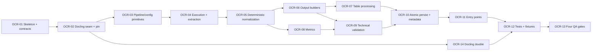

# WBS — procesador-ocr

| Field | Value |
|---|---|
| Document | WBS / task issues — `procesador-ocr` (`docflow.ocr`, `src/docflow/ocr/`) |
| Phase | **1 — Processors, independently** (`docs/plan/README.md` §5) |
| Derived from | `docs/plan/subplan-procesador-ocr.md` §4 (WBS table, order/waves) |
| Source of truth | `docs/plan/subplan-procesador-ocr.md` + `docs/plan/README.md`; task IDs and titles are preserved verbatim from the subplan table |
| ID range | `OCR-01` … `OCR-14` |
| Status | All issues `NOT_STARTED` |

This document expands — never replaces — the subplan WBS. Every issue traces back to exactly one row of `subplan-procesador-ocr.md` §4; no new scope is introduced here. `.github/copilot-instructions.md` governs code quality for every task.

## 1. Summary

| Field | Value |
|---|---|
| Phase | 1 — processors, independently (parallel with `pdf`, `image`, `llm`) |
| ID range | OCR-01 … OCR-14 |
| # tasks | 14 |
| Effort distribution | S ×6 (OCR-01, 02, 08, 09, 13, 14) · M ×8 (OCR-03, 04, 05, 06, 07, 10, 11, 12) · L ×0 |
| Critical path | `OCR-01 → OCR-02 → OCR-03 → OCR-04 → OCR-05 → OCR-06 → OCR-09 → OCR-10 → OCR-11 → OCR-12 → OCR-13` |
| Definition of Done gate | `pytest` · `ruff check .` · `ruff format --check .` · `pylint src tests`, plus mutation-falsified invariant tests |

**Scope.** Turn an already-prepared image into a textual and structured representation through `OCRRequest → OCRResult`: plain text, Markdown, a stable versioned `document.json`, blocks, tables, layout, reading order, metrics, technical metadata and an extraction status, published atomically inside the `ocr/` namespace. Docling is the only OCR engine and is reached only from `ocr/primitives/`; the rest of the module works on the engine-independent `OCRDocument`. The list in the subplan §3.4 is closed at 25 names: one engine call (`convert_image_with_docling`), one measurement (`OCRMetrics`), one producer per artifact (`OCR-06`). No PDF work, no image normalization, no LLM, no workflow decision.

**Test framing.** Every primitive below is exercised with the in-memory Docling double in place of `convert_image_with_docling` (`OCR-14`): the assertions are about **our** translation, ordering, builders, tables, metrics and error mapping, never about what Docling returns, how it iterates, or whether it is deterministic (`README.md` §9.7). Where a criterion needs engine output as *input*, the double supplies it.

## 2. Task issue index

| ID | Task (short) | Effort | Wave | Depends on | Deliverable artifact(s) | Issue file | Status |
|---|---|---|---|---|---|---|---|
| OCR-01 | Sub-package skeleton + contract dataclasses | S | 1 — Foundations | — | `src/docflow/ocr/`, `OCRRequest`, `OCRResult`, `NormalizedOCROptions`, `OCRMetrics`, `OCRMetadata`, `OCRValidation`, `OCRError`, `ArtifactPaths` | this file §OCR-01 | NOT_STARTED |
| OCR-02 | Docling seam + pin | S | 1 — Foundations | OCR-01 | `ocr/primitives/` (five named seam functions), `docling` pinned in `pyproject.toml` | this file §OCR-02 | NOT_STARTED |
| OCR-03 | Pipeline configuration | M | 2 — Engine + extraction | OCR-02 | `load_docling_pipeline` + `configure_image_pipeline` (flags folded in; no `should_enable_*`) | this file §OCR-03 | NOT_STARTED |
| OCR-04 | Execution + extraction primitives | M | 2 — Engine + extraction | OCR-03 | `convert_image_with_docling`, `extract_docling_*`, `OCRDocument` | this file §OCR-04 | NOT_STARTED |
| OCR-05 | Deterministic normalization | M | 2 — Engine + extraction | OCR-04 | `normalize_bbox`, `normalize_layout`, `preserve_reading_order`, block ordering (no `count_*`) | this file §OCR-05 | NOT_STARTED |
| OCR-06 | Output builders | M | 3 — Outputs | OCR-05 | `ocr/text.txt`, `ocr/document.md`, `ocr/document.json` | this file §OCR-06 | NOT_STARTED |
| OCR-07 | Table processing | M | 3 — Outputs | OCR-06 | `process_tables`, `normalize_table`, `table_to_markdown`, `ocr/tables/table_NNN.md` | this file §OCR-07 | NOT_STARTED |
| OCR-08 | Metrics | S | 3 — Outputs | OCR-05 | `analyze_ocr_result` → `OCRMetrics` | this file §OCR-08 | NOT_STARTED |
| OCR-09 | Technical validation | S | 3 — Outputs | OCR-06, OCR-08 | `validate_ocr_result`, `validate_output_artifacts` | this file §OCR-09 | NOT_STARTED |
| OCR-10 | Atomic persistence + `metadata.json` | M | 4 — Publish + entry points | OCR-07, OCR-09 | `ocr/.tmp/` → rename; `ocr/metadata.json` | this file §OCR-10 | NOT_STARTED |
| OCR-11 | Entry points | M | 4 — Publish + entry points | OCR-10 | `process_ocr_image`; `process_ocr_from_page` **deferred to Phase 3** (`# TODO: [MVP]`) | this file §OCR-11 | NOT_STARTED |
| OCR-12 | Tests + committed image fixtures | M | 5 — Verification | OCR-11, OCR-14 | `tests/`, `fixtures/ocr_prepared_text_and_table.png`, `fixtures/ocr_blank.png` | this file §OCR-12 | NOT_STARTED |
| OCR-13 | Four QA gates + mutation falsification | S | 5 — Verification | OCR-12 | QA gate output, documented mutation observations | this file §OCR-13 | NOT_STARTED |
| OCR-14 | In-memory Docling double | S | 2 — Engine + extraction | OCR-02 | `tests/fakes/engines/fake_docling.py` | this file §OCR-14 | NOT_STARTED |

## 3. Detailed issues

### OCR-01 — Sub-package skeleton and contract dataclasses

- **Type:** Contracts
- **Effort:** S
- **Wave:** 1 — Foundations
- **Depends on:** —
- **Blocks:** OCR-02
- **Objective:** Create `src/docflow/ocr/` with `primitives/`, `utils/`, `helpers/` and freeze the typed contract, with type hints and no silent defaults.
- **Scope / Deliverables:** Package skeleton; `OCRRequest` (`image_path`, `output_dir`, `options`, `context`), `OCROptions` and `NormalizedOCROptions` (`ocr`, `layout`, `tables`, `reading_order`, `language`, `engine_options`), `OCRResult` (`text`, `markdown`, `structured_document`, `tables`, `blocks`, `layout`, `reading_order`, `metrics`, `artifacts`, `validation`, `metadata`, `status`), `OCRMetrics` (`characters`, `words`, `blocks`, `tables`, `paragraphs`, `text_density`, `empty`, `structure_detected`), `OCRMetadata` (`engine`, `engine_version`, `processor_version`, `options`, `input`, `metrics`, `validation`, `timing`, `transformations`, `context`), `OCRValidation` (`VALID` / `EMPTY` / `LOW_CONTENT` / `INCOMPLETE` / `PARSE_ERROR` / `ERROR`), `OCRError` (`type`, `message`, `recoverable`, `metadata`), `ArtifactPaths`; engine-independent `OCRDocument` (`text`, `paragraphs[]`, `titles[]`, `blocks[]`, `tables[]`, `layout`, `reading_order[]`, `metadata`); supporting `TableResult`, `BlockResult`, `LayoutResult`.
- **Out of bounds:** No Docling import (that is OCR-02); no I/O; `context` is correlation only and never mutates global state.
- **Acceptance criteria:**
  - Given the contract module, when a required field is omitted, then construction fails (no silent default).
  - Then `OCRValidation` and `OCRError.type` expose exactly the values named in the subplan.
- **Evidence / DoD:** Type hints complete; Google-style docstrings; `ruff check .` and `pylint src tests` clean.
- **Tags:** —

### OCR-02 — Docling seam and dependency pin

- **Type:** Skeleton
- **Effort:** S
- **Wave:** 1 — Foundations
- **Depends on:** OCR-01
- **Blocks:** OCR-03, OCR-14
- **Objective:** Create the only place that knows Docling, and pin the engine so output differences are auditable.
- **Scope / Deliverables:** `ocr/primitives/` carrying exactly the seam the subplan §3.4 names (`load_docling_pipeline`, `configure_image_pipeline`, `normalize_docling_options`, `convert_image_with_docling`, `get_engine_version`); `docling` pinned in `pyproject.toml`; `get_engine_version` recorded into `metadata.json`.
- **Out of bounds:** Docling is fixed and never exposed as a user-selectable engine option; no other processor and never the orchestrator reaches Docling; no silent engine substitution.
- **Acceptance criteria:**
  - Given the primitives package, when the engine is used, then `"docling"` is recorded as `engine` in metadata and never presented as a configurable option.
  - Given `pyproject.toml`, then the Docling version is pinned.
- **Evidence / DoD:** Import check plus a test asserting non-empty `engine_version`; four QA gates green on the skeleton.
- **Tags:** `# TODO: [RELEASE]` for engine upgrade policy.

### OCR-03 — Pipeline and configuration primitives

- **Type:** Primitive
- **Effort:** M
- **Wave:** 2 — Engine + extraction
- **Depends on:** OCR-02
- **Blocks:** OCR-04
- **Objective:** Configure the Docling pipeline from normalized options, with each capability decided by the option value itself, inline.
- **Scope / Deliverables:** `load_docling_pipeline`, `configure_image_pipeline` and `normalize_docling_options` in `ocr/primitives/`; the option flags are folded into the pipeline configuration inline, so no `enable_*` / `should_enable_*` predicate layer exists.
- **Out of bounds:** No extraction, no file writes, no workflow decision; a missing option must not silently enable a capability.
- **Acceptance criteria:**
  - Given raw `OCROptions`, when they are normalized, then `NormalizedOCROptions` is order-stable and identical across runs for equal input.
  - Given `tables` disabled, then the pipeline is configured without table detection and no table artifact is claimed.
- **Evidence / DoD:** Unit test asserting normalization stability and the flag → configuration mapping.
- **Tags:** `# TODO: [MVP]` for full option coverage.

### OCR-04 — Execution and extraction primitives

- **Type:** Primitive
- **Effort:** M
- **Wave:** 2 — Engine + extraction
- **Depends on:** OCR-03
- **Blocks:** OCR-05
- **Objective:** Run the Docling conversion once and translate its native structures into the engine-independent `OCRDocument`, so the rest of the system never touches Docling types.
- **Scope / Deliverables:** `convert_image_with_docling`; `extract_docling_text`, `extract_docling_markdown`, `extract_docling_tables`, `extract_docling_blocks`, `extract_docling_layout`; the `OCRDocument` builder. The four `export_docling_*` functions are not built: `OCR-06` is the single producer of the three artifacts.
- **Out of bounds:** No ordering guarantees here (that is OCR-05); no validation, no persistence; Docling native structures must not leak past `ocr/primitives/`.
- **Acceptance criteria:**
  - Given `fixtures/ocr_prepared_text_and_table.png`, when extraction runs, then the `OCRDocument` contains a heading, a paragraph and one table with its cells.
  - Given an engine that raises during conversion, then the failure surfaces as a typed `OCRError` of type `ENGINE_ERROR`, never as an escaping exception.
- **Evidence / DoD:** Fixture-based test; engine-failure containment test.
- **Tags:** `# TODO: [MVP]` for richer Docling structure mapping.

### OCR-05 — Deterministic normalization

- **Type:** Primitive
- **Effort:** M
- **Wave:** 2 — Engine + extraction
- **Depends on:** OCR-04
- **Blocks:** OCR-06, OCR-08
- **Objective:** Make the logical output structure reproducible: deterministic block ordering and normalized coordinates independent of Docling's iteration order.
- **Scope / Deliverables:** Block ordering (sort by reading order, tie-break by normalized `bbox`), `normalize_bbox` (0–1 reference), `normalize_layout`, `preserve_reading_order`. No `count_*` helper: `OCRMetrics` (`OCR-08`) is the single measurement.
- **Out of bounds:** No file writing or export; no timestamp injection; no dependence on engine iteration order.
- **Acceptance criteria:**
  - Given the same image and normalized options, when normalization runs twice, then `blocks` and `reading_order` are identical in order and content.
  - Given a block set in arbitrary engine order, then the sorted output is stable for equal `bbox` tie-breaks.
- **Evidence / DoD:** Fixture-based test comparing two runs; unit test on the tie-break rule.
- **Tags:** —

### OCR-06 — Output builders

- **Type:** Primitive
- **Effort:** M
- **Wave:** 3 — Outputs
- **Depends on:** OCR-05
- **Blocks:** OCR-07, OCR-09
- **Objective:** Render the three canonical representations from the `OCRDocument`: plain text, Markdown and the versioned JSON schema, none of which contains run-time data.
- **Scope / Deliverables:** Build `ocr/text.txt`, `ocr/document.md`, `ocr/document.json` (stable, versioned, additive-only schema); helpers `normalize_ocr_text` (one normalizer, not two), `normalize_markdown`, `merge_ocr_blocks`. The counters are not built: `OCRMetrics` (`OCR-08`) measures, and `empty` lives there too.
- **Out of bounds:** No timestamps in functional content (timing lives only in `metadata.json`); no table export (that is OCR-07); no writes before OCR-10's atomic publish.
- **Acceptance criteria:**
  - Given a prepared image with known content, when the builders run, then `text.txt` is non-empty, `document.md` is valid Markdown and `document.json` deserialises to the documented schema.
  - Then none of the three files contains a run-time timestamp.
- **Evidence / DoD:** Fixture-based test; the no-timestamps invariant (OCR-12, invariant 2).
- **Tags:** `# TODO: [MVP]` for schema fields deferred to a later version.

### OCR-07 — Table processing

- **Type:** Primitive
- **Effort:** M
- **Wave:** 3 — Outputs
- **Depends on:** OCR-06
- **Blocks:** OCR-10
- **Objective:** Export detected tables in preserved reading order under deterministic zero-padded names.
- **Scope / Deliverables:** `process_tables`, `normalize_table`, `table_to_markdown`; outputs `ocr/tables/table_001.md`, `table_002.md`, … in reading order. `count_tables` is not built: `OCRMetrics.tables` (`OCR-08`) counts once.
- **Out of bounds:** No `table_NNN.json` export in this phase (deferred); no table re-ordering; no invented structure when no table is detected (an empty table list is data, not a failure).
- **Acceptance criteria:**
  - Given a fixture with one 2×2 table, when table processing runs, then `ocr/tables/table_001.md` exists and preserves the cell values in reading order.
  - Given an image with no table, then no `tables/` artifact is required and no error is raised.
- **Evidence / DoD:** Fixture-based test on `ocr_prepared_text_and_table.png`.
- **Tags:** `# TODO: [MVP]` for the deferred `tables/table_NNN.json` export.

### OCR-08 — Metrics

- **Type:** Primitive
- **Effort:** S
- **Wave:** 3 — Outputs
- **Depends on:** OCR-05
- **Blocks:** OCR-09
- **Objective:** Compute `OCRMetrics` from the normalized `OCRDocument` as descriptive evidence, never as an aggregate confidence in place of it.
- **Scope / Deliverables:** `analyze_ocr_result` → `OCRMetrics` with `characters`, `words`, `blocks`, `tables`, `paragraphs`, `text_density`, `empty`, `structure_detected`.
- **Out of bounds:** No interpretation of metrics into a workflow action (e.g. `LOW_CONTENT → use VLM` is the orchestrator's call); no placeholder values.
- **Acceptance criteria:**
  - Given `fixtures/ocr_blank.png`, when `analyze_ocr_result` runs, then `empty` is true and `characters == 0` from a real measurement.
  - Given the prepared text-and-table fixture, then `structure_detected` is true and `blocks > 0`.
- **Evidence / DoD:** Unit tests over both fixtures.
- **Tags:** —

### OCR-09 — Technical validation

- **Type:** Validation
- **Effort:** S
- **Wave:** 3 — Outputs
- **Depends on:** OCR-06, OCR-08
- **Blocks:** OCR-10
- **Objective:** Validate the produced result and artifacts structurally and map failures to typed statuses, including the empty-input path.
- **Scope / Deliverables:** `validate_ocr_result`, `validate_output_artifacts`, `validate_ocr_input`; statuses `VALID` / `EMPTY` / `LOW_CONTENT` / `INCOMPLETE` / `PARSE_ERROR` / `ERROR`; `OCRError` types `INVALID_INPUT`, `UNSUPPORTED_IMAGE`, `ENGINE_ERROR`, `OCR_ERROR`, `LAYOUT_ERROR`, `TABLE_EXTRACTION_ERROR`, `EXPORT_ERROR`, `IO_ERROR`, `INTERNAL_ERROR`.
- **Out of bounds:** Validation states are descriptive only and never become workflow actions; no exception thrown where the typed result is the contract; no silent empty result reported as valid.
- **Acceptance criteria:**
  - Given an image that contains no text, when validation runs, then the status is `EMPTY` and no exception escapes the call.
  - Given an expected artifact is missing, then the status is `INCOMPLETE` with a typed `OCRError` naming it.
- **Evidence / DoD:** Scenario test for the empty-input path plus the typed-error containment test.
- **Tags:** `# TODO: [MVP]` for deeper structural checks.

### OCR-10 — Atomic persistence and `metadata.json`

- **Type:** Validation
- **Effort:** M
- **Wave:** 4 — Publish + entry points
- **Depends on:** OCR-07, OCR-09
- **Blocks:** OCR-11
- **Objective:** Publish every artifact atomically and record engine, version, options, metrics, validation, timing and transformations in `metadata.json`.
- **Scope / Deliverables:** `ensure_directory`, `write_text_atomic`, `write_json_atomic`; `build_ocr_metadata`; publish via `ocr/.tmp/` → validate → rename; `ocr/metadata.json` as the only home of timing. `create_ocr_directory`, `build_ocr_output_paths`, `read_json`, `merge_ocr_metadata` and `get_processor_version` are not built: `ArtifactPaths` already names the paths, and one builder writes one metadata file.
- **Out of bounds:** No final-named artifact before validation; no writes outside `ocr/`; no timestamp leak into functional content; no placeholder metadata.
- **Acceptance criteria:**
  - Given a failure forced after conversion, when `ocr/` is inspected, then no `.tmp` files and no final-named artifacts remain.
  - Given a successful run, then `metadata.json` records engine `"docling"`, a non-empty `engine_version` and the timing fields.
- **Evidence / DoD:** Scenario test for contained engine failure plus the atomic-publication invariant (OCR-12, invariant 3).
- **Tags:** `# TODO: [RELEASE]` for crash-safety guarantees at filesystem level.

### OCR-11 — Entry points

- **Type:** Entry point
- **Effort:** M
- **Wave:** 4 — Publish + entry points
- **Depends on:** OCR-10
- **Blocks:** OCR-12
- **Objective:** Orchestrate the module's internal flow behind a single public entry point and expose the deferred thin wrapper.
- **Scope / Deliverables:** `process_ocr_image(request) -> OCRResult` chaining validate input → normalize options → configure → convert → extract → build text/markdown/json → process tables → metrics → validate → atomic persist; optional `process_ocr_from_page(...)` that only builds an `OCRRequest` and delegates (deferred to Phase 3 integration).
- **Out of bounds:** No PDF reading and no page selection in the wrapper; no workflow decision (whether OCR runs, which source wins, retries); no Docling access outside `ocr/primitives/`; no import of another processor.
- **Acceptance criteria:**
  - Given a valid `OCRRequest` on `image/normalized.png`, when `process_ocr_image` runs, then `status == "success"`, `validation.status == "VALID"` and the `ocr/` namespace holds `text.txt`, `document.md`, `document.json` and `metadata.json`.
  - Given the same input run twice into two output directories, then the functional content of `document.json` is byte-identical and `metadata.json` differs only in timing fields.
- **Evidence / DoD:** Happy-path test plus the determinism scenario; `process_ocr_from_page` may land as a stub carrying `# TODO: [MVP]`.
- **Tags:** `# TODO: [MVP]` for `process_ocr_from_page` (deferred to Phase 3).

### OCR-12 — Tests and committed image fixtures

- **Type:** Test
- **Effort:** M
- **Wave:** 5 — Verification
- **Depends on:** OCR-11, OCR-14
- **Blocks:** OCR-13
- **Objective:** Prove the full loop with real bytes and prove each invariant test fails when its invariant is broken. No test reaches Docling (`README.md` §9.7).
- **Scope / Deliverables:** `test_process_ocr_image_happy_path` (engine call doubled); fixtures `fixtures/ocr_prepared_text_and_table.png` (known heading, one paragraph, one 2×2 table) and `fixtures/ocr_blank.png`; invariant 1 (deterministic ordering + stable format), invariant 2 (no timestamps in functional content), invariant 3 (atomic publication — no partial artifacts on failure); `tests/` mirroring `src/docflow/ocr/`.
- **Out of bounds:** No edge-case matrix beyond these fixtures; no golden-set quality scoring; no test that invokes, imports or asserts Docling, and no assertion that the engine is deterministic; no permanent source change made to satisfy a test.
- **Acceptance criteria:**
  - Given the committed prepared image, when the happy-path test runs, then `status == "success"`, `validation == VALID`, `text` is non-empty and `engine == "docling"`.
  - Given invariant 1's mutation (drop the stable sort key / inject a timestamp), invariant 2's mutation (`datetime.now()` in the JSON or Markdown builder) and invariant 3's mutation (write to the final path instead of `ocr/.tmp/`), then each corresponding test fails; after restore, all are green.
- **Evidence / DoD:** Test output for the happy path plus both observations per invariant.
- **Tags:** `# TODO: [MVP]` where a fixture stands in for a real scanned document.

### OCR-13 — Four QA gates and mutation falsification

- **Type:** QA gate
- **Effort:** S
- **Wave:** 5 — Verification
- **Depends on:** OCR-12
- **Blocks:** —
- **Objective:** Close the processor with the four gates green and every invariant documented as mutation-falsified.
- **Scope / Deliverables:** `pytest`, `ruff check .`, `ruff format --check .`, `pylint src tests` clean; written mutation → failure → restore → green observations for invariants 1–3; every shortcut tagged.
- **Out of bounds:** No config-wide rule suppression to obtain a green run; a `# type: ignore` must name the specific error code.
- **Acceptance criteria:**
  - Given the four commands, when they run, then all four exit clean.
  - Then each of the three invariant tests has a recorded observation of failure under mutation and a recorded green run after restore.
- **Evidence / DoD:** Captured gate output plus the mutation evidence table for invariants 1–3.
- **Tags:** —

### OCR-14 — In-memory Docling double

- **Type:** Test infrastructure
- **Effort:** S
- **Wave:** 2 — Engine + extraction
- **Depends on:** OCR-02
- **Blocks:** OCR-12
- **Objective:** Give this processor a test double so that the whole suite runs with no Docling installed, without any test invoking, importing or asserting the engine (`README.md` §9.7).
- **Scope / Deliverables:** `tests/fakes/engines/fake_docling.py` — an in-memory fake injected at **`convert_image_with_docling`**, returning Docling's **native** values (text, markdown, tables, blocks, layout, metadata) as Python objects or plain dicts, able to return an empty document and able to raise during conversion. The fixture patches the symbol itself (`docflow.ocr.primitives.convert_image_with_docling`) and the Docling import sits inside that function, so importing the seam needs no Docling installed.
- **Out of bounds:** Never substitute at `extract_docling_*` — that is the half of the module the fake must **exercise** rather than replace; no faking of our translated `OCRDocument`/`OCRResult`; no `if engine is None: use_fake` fallback; nothing under `src/docflow/` imports `tests/`; no assertion that the engine is deterministic, correct or complete; no JSON fixture tree standing in for the engine.
- **Acceptance criteria:**
  - Given the fake in place, when the whole suite runs, then every test of this processor passes with zero Docling conversions, and the run needs no engine installed.
  - Given the fake, when blocks are handed to the invariant-1 test, then they are returned in **adversarial (unsorted) order**, so a broken sort fails the test.
  - Given the fake returns an empty document, then the `EMPTY` path is asserted with no live conversion; given the fake raises, then `ENGINE_ERROR` is contained and no `.tmp` residue remains.
- **Evidence / DoD:** The suite green with Docling absent; no engine symbol imported by any test module of this processor; any cached corpus helper's cache key includes **which engine** produced the result.
- **Tags:** `# TODO: [RELEASE]` for a re-check of the double against the real engine's shape on a pin bump.

```gherkin
Scenario: No test reaches Docling
  Given the in-memory Docling double
  When the whole suite runs
  Then every test of this processor passes with zero Docling conversions
  And no test imports or asserts the engine
```

## 4. Dependency graph



## 5. Execution waves

| Wave | Tasks | Entry condition | Exit condition |
|---|---|---|---|
| 1 — Foundations | OCR-01, OCR-02 | Phase 0 exit met; subplan §7 DoR satisfied | Package skeleton, contract dataclasses and the Docling seam exist; Docling pinned |
| 2 — Engine + extraction | OCR-03, OCR-04, OCR-05; OCR-14 in parallel after OCR-02 | Wave 1 green | All Docling access isolated in `ocr/primitives/`; `OCRDocument` produced and deterministically ordered; the Docling double exists, so the whole suite runs with no engine installed |
| 3 — Outputs | OCR-06 ∥ OCR-08 (after OCR-05) → OCR-07 ∥ OCR-09 | Wave 2 green | text/Markdown/JSON representations, table export, metrics and validation produced from the fixture |
| 4 — Publish + entry points | OCR-10, OCR-11 | Wave 3 green | Atomic write under `ocr/` only; `process_ocr_image` round-trips the contract with real bytes |
| 5 — Verification | OCR-12, OCR-13 | Wave 4 green | Happy path and three invariant tests green, each mutation-falsified; the whole suite passes with Docling absent and no test reaches the engine; four QA gates clean |

Waves are strictly sequential; tasks within a wave that share no dependency may proceed in parallel (Wave 3 is the only wave with genuine parallelism here: OCR-06 ∥ OCR-08, then OCR-07 ∥ OCR-09).

## 6. Critical path

`OCR-01 → OCR-02 → OCR-03 → OCR-04 → OCR-05 → OCR-06 → OCR-09 → OCR-10 → OCR-11 → OCR-12 → OCR-13`

It is critical because contracts precede the seam (OCR-01 → OCR-02), the Docling access chain (OCR-03 → OCR-04 → OCR-05) is strictly sequential and is the only source of content, the output builders (OCR-06) feed both the table branch and validation (OCR-09), and nothing can be published (OCR-10) or exposed (OCR-11) before validation exists. OCR-07 and OCR-08 are parallel branches that join at OCR-10; the longest of them (OCR-07, via OCR-06) sits on the same chain, so the path above is the binding one.

## 7. Traceability

| Acceptance scenario (subplan §5) | Implemented by | Tested by |
|---|---|---|
| Happy-path extraction from a prepared image | OCR-03, OCR-04, OCR-05, OCR-06, OCR-10, OCR-11 | OCR-12 happy path |
| Deterministic functional content | OCR-03 (option normalization), OCR-05 (ordering), OCR-10 (timing isolation) | OCR-12 invariant 1 (deterministic ordering + stable format) |
| Empty input is reported, not thrown | OCR-08, OCR-09 | OCR-12 blank-image test (status `EMPTY`, no exception, no partial artifact) |
| Engine failure is contained | OCR-02, OCR-04, OCR-09, OCR-10 | OCR-12 engine-failure test (`status == "failed"`, `error.type == "ENGINE_ERROR"`, no `.tmp` left) |
| Invariant 2 — no timestamps in functional content (mutation: `datetime.now()` in a builder) | OCR-05, OCR-06, OCR-07, OCR-10 | OCR-12 (must fail under mutation, then restore green) |
| Invariant 3 — atomic publication, no partial artifacts (mutation: write to the final path) | OCR-10, OCR-11 | OCR-12 (must fail under mutation, then restore green) |
| No test reaches Docling | OCR-14 | OCR-14 acceptance scenario (`pytest` green with zero Docling conversions and no engine installed) |

## 8. Definition of Ready (per task)

- The task appears as a row in `subplan-procesador-ocr.md` §4.1 with the same ID, title, effort and dependencies.
- Contract types and `NormalizedOCROptions` fields are agreed with `docs/idea/procesador-ocr.md`.
- The `ocr/primitives/` skeleton and the Docling pin in `pyproject.toml` are agreed before OCR-02 starts.
- Output schemas (`text.txt`, `document.md`, `document.json`) are frozen for this phase.
- The committed image fixtures in `fixtures/` exist; the atomic-publication rule is stated.
- For OCR-14: the fake's injection point (`convert_image_with_docling`) and its native shape (Docling's own values, adversarial order) are agreed, and no test of this processor imports the engine.
- No unresolved dependency on any other processor (fully independent, per Phase 1).

## 9. Definition of Done (per task)

- [ ] `pytest` green with the task's happy-path and/or invariant test using real bytes from a committed fixture and the Docling double in place of the engine.
- [ ] No test invokes, imports or asserts Docling, and no test asserts the engine's determinism; the suite passes with no engine installed (`README.md` §9.7), and the double is never reachable as a fallback (nothing under `src/docflow/` imports `tests/`).
- [ ] `ruff check .` clean (import order included) · `ruff format --check .` clean · `pylint src tests` clean (`fixme` disabled).
- [ ] Every invariant test touched by the task has been mutation-falsified: mutate → observe failure → restore → re-run green, both observations reported.
- [ ] No silent stand-in (no empty string, `0`, `[]`, `None`-without-reason, no default engine or threshold); no aggregate confidence score in place of per-measurement evidence.
- [ ] Docling reached only through `ocr/primitives/`; everything downstream works on `OCRDocument`; no import of another processor; no workflow decision, no source selection, no source comparison.
- [ ] All artifacts written atomically and only inside `ocr/`; `engine` + `engine_version` recorded in `metadata.json`; no timestamps in functional content.
- [ ] The surface is exactly the subplan §3.4 list: no `enable_*` / `should_enable_*` predicate, no `export_docling_*` beside the `OCR-06` builders, no `count_*` beside `OCRMetrics`.
- [ ] Every shortcut carries an inline `# TODO: [MVP]` or `# TODO: [RELEASE]` tag; output, identifiers, docstrings and comments in English.

## 10. Risks & mitigations (execution view)

| Risk (subplan §8) | Task affected | Mitigation owned by |
|---|---|---|
| Docling version drift changes output | OCR-02, OCR-04 | OCR-02 (pin Docling) + OCR-10 (record `engine_version`) |
| Docling residual non-determinism on identical input | A determinism claim we cannot keep | OCR-05 (normalize logical structure, not raw bytes) + OCR-12 invariants over the double; we never assert that the engine is deterministic — the class is recorded, not assumed |
| Docling schema changes between versions | OCR-04 | OCR-04 (all Docling access isolated; downstream uses `OCRDocument`) |
| Silent empty/partial extraction reported as correct | OCR-08, OCR-09 | OCR-09 (mandatory structural validation with `EMPTY`/`LOW_CONTENT`) + OCR-12 (blank-image fixture test) |
| Interrupted publish leaves corrupt artifacts | OCR-10 | OCR-10 (atomic `.tmp/` → validate → rename) + OCR-12 invariant 3 |
| Large images / many tables (memory) | OCR-04, OCR-07, OCR-10 | OCR-10 (PoC on small fixtures; resource caps tagged `# TODO: [RELEASE]`) |
| Over-engineering (generic abstraction layers) | OCR-01, OCR-02, OCR-04 | OCR-02 (thin primitives with a closed list; a name that is not in subplan §3.4 does not exist), single entry point, one measurement (`OCRMetrics`), one producer per artifact (`OCR-06`) |
| A bumped Docling pin changes the engine's output shape | Our extraction and translation break in production while the suite stays green | OCR-14 (the double is the single place a shape change has to be re-checked on the bump; `# TODO: [RELEASE]` for the scheduled re-check) — accepted PoC trade-off, recorded in `GEN-17` |

## 11. Out of scope

- PDF splitting, rendering and page selection (→ `procesador-pdf`).
- Image normalization and `ocr_ready` / `vlm_ready` preparation (→ `procesador-image`).
- Deciding whether OCR must run; source selection; comparing OCR vs. native text or VLM; `build_llm_context_from_ocr` (→ `procesador-orquestador`).
- LLM/VLM inference (→ `procesador-llm-call`).
- Workflow state, idempotency, `stop`/`resume`, `skip`/`force`, full-stage retry, concurrency control (→ orchestrator).
- Domain-specific extraction rules (invoice fields, verdicts) — the pipeline is generic.
- A second OCR engine or a user-selectable engine setting (Docling is fixed).
