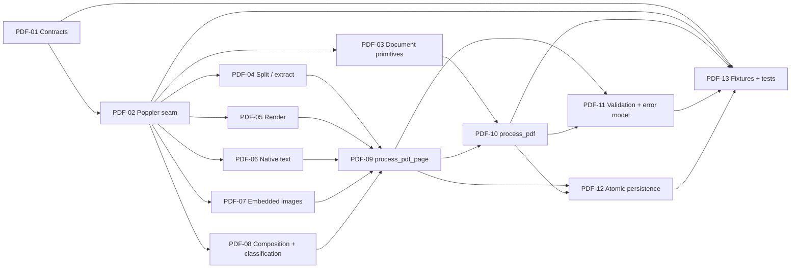

# WBS — procesador-pdf

| Field | Value |
|---|---|
| Document | WBS / task issues — `procesador-pdf` (`docflow.pdf`, `src/docflow/pdf/`) |
| Phase | **1 — Processors, independently** (`docs/plan/README.md` §5) |
| Derived from | `docs/plan/subplan-procesador-pdf.md` §4 (WBS table, order/waves) |
| Source of truth | `docs/plan/subplan-procesador-pdf.md` + `docs/plan/README.md`; task IDs and titles are preserved verbatim from the subplan table |
| ID range | `PDF-01` … `PDF-14` |
| Status | `PDF-01`…`PDF-09` **DONE** — Wave 2 closed and Wave 3 began; `PDF-10`…`PDF-14` `NOT_STARTED` |

This document expands — never replaces — the subplan WBS. Every issue traces back to exactly one row of `subplan-procesador-pdf.md` §4; no new scope is introduced here. `.github/copilot-instructions.md` governs code quality for every task.

**Status vocabulary.** `NOT_STARTED` — nothing landed. `SIGNATURE_ONLY` — the typed signatures are committed and import cleanly (Wave 1 of the subplan §5), but every body still raises `NotImplementedError`; the task's own acceptance criteria are **not** met. `DONE` — the task's Definition of Done in §9 holds, including any mutation-falsified invariant it touches. Only `DONE` means the task is closed.

## 1. Summary

| Field | Value |
|---|---|
| Phase | 1 — processors, independently (parallel with `image`, `ocr`, `llm`) |
| ID range | PDF-01 … PDF-14 |
| # tasks | 14 |
| Effort distribution | S ×6 (PDF-01, 05, 08, 11, 12, 14) · M ×8 (PDF-02, 03, 04, 06, 07, 09, 10, 13) · L ×0 |
| Critical path | `PDF-01 → PDF-02 → PDF-04 → PDF-09 → PDF-10 → PDF-11` |
| Definition of Done gate | `pytest` · `ruff check .` · `ruff format --check .` · `pylint src tests`, plus mutation-falsified invariant tests |

**Scope.** Turn a `PDFRequest` into a `PDFResult` (+ one `PDFPageResult` per page) describing only what the PDF natively contains: page split, render, native text, text blocks, embedded images, per-page composition metrics and a descriptive `TEXT`/`IMAGE`/`MIXED` classification, published atomically under the `source/`, `render/`, `native_text/`, `embedded_images/` and `metadata.json` namespaces. Poppler is reached only from `pdf/primitives/`. No workflow decision, no OCR, no LLM, no other processor import.

## 2. Task issue index

| ID | Task (short) | Effort | Wave | Depends on | Deliverable artifact(s) | Issue file | Status |
|---|---|---|---|---|---|---|---|
| PDF-01 | Contract types | S | 1 — Foundations | — | `PDFRequest`, `PDFResult`, `PDFPageResult`, `PDFPageMetrics`, `PDFError` | this file §PDF-01 | DONE |
| PDF-02 | Poppler primitives skeleton | M | 1 — Foundations | PDF-01 | `pdf/primitives/` | this file §PDF-02 | DONE |
| PDF-03 | Document primitives | M | 2 — Primitives | PDF-02 | `get_pdf_metadata`, `get_page_count`, `get_page_dimensions`, `inspect_pdf` | this file §PDF-03 | DONE |
| PDF-04 | Split/extract primitives | M | 2 — Primitives | PDF-02 | `extract_page`, `split_pdf`, `merge_pdfs` | this file §PDF-04 | DONE |
| PDF-05 | Render primitive | S | 2 — Primitives | PDF-02 | `render_page_to_image` | this file §PDF-05 | DONE |
| PDF-06 | Native text primitives | M | 2 — Primitives | PDF-02 | `extract_text_from_page`, `get_text_blocks` | this file §PDF-06 | DONE |
| PDF-07 | Embedded image primitives | M | 2 — Primitives | PDF-02 | `extract_images_from_page`, `get_image_blocks` | this file §PDF-07 | DONE |
| PDF-08 | Composition + classification | S | 2 — Primitives | PDF-02 | `analyze_pdf_page`, `classify_pdf_page` | this file §PDF-08 | DONE |
| PDF-09 | Page entry point | M | 3 — Composition | PDF-04, PDF-05, PDF-06, PDF-07, PDF-08 | `process_pdf_page`, `page_001/metadata.json` | this file §PDF-09 | DONE |
| PDF-10 | Document entry point | M | 3 — Composition | PDF-03, PDF-09 | `process_pdf`, `metadata.json` | this file §PDF-10 | NOT_STARTED |
| PDF-11 | Validation + error model | S | 4 — Hardening | PDF-09, PDF-10 | `validate_pdf_result`, `validate_pdf_page_result` | this file §PDF-11 | NOT_STARTED |
| PDF-12 | Atomic persistence | S | 4 — Hardening | PDF-09, PDF-10 | `.tmp` → validate → rename across all artifacts | this file §PDF-12 | NOT_STARTED |
| PDF-13 | Fixtures + tests | M | 4 — Hardening | PDF-01, PDF-02, PDF-10, PDF-11, PDF-12 | `fixtures/pdf_sample_*.pdf`, `tests/` | this file §PDF-13 | NOT_STARTED |
| PDF-14 | Lab tool `scripts/tools/pdf.py` | S | 5 — Lab tool | PDF-13 | `scripts/tools/pdf.py` | this file §PDF-14 | NOT_STARTED |

## 3. Detailed issues

### PDF-01 — Contract types

- **Type:** Contracts
- **Effort:** S
- **Wave:** 1 — Foundations
- **Depends on:** —
- **Blocks:** PDF-02, PDF-13
- **Objective:** Freeze the typed request/result vocabulary of the processor: `PDFRequest` in, `PDFResult` + `PDFPageResult` out, with supporting records, statuses and the error model. No behaviour, only types.
- **Scope / Deliverables:** `PDFRequest` (`pdf_path`, `output_dir`, `options`, `context`), `PDFOptions` (`extract_pages`, `render`, `extract_text`, `extract_images`, `layout`, `dpi`), `PDFContext` (`document_id`, `workflow_run_id`), `PDFResult` (`source_path`, `metadata`, `pages`, `metrics`, `artifacts`, `validation`, `status`), `PDFPageResult` (`page_number`, `page_pdf`, `page_image`, `native_text`, `text_blocks`, `embedded_images`, `metrics`, `classification`, `artifacts`, `validation`, `metadata`, `status`), `PDFPageMetrics`, `EmbeddedImage`, `TextBlock`, `PDFError` (`type`, `page_number`, `message`, `recoverable`, `metadata`), validation states `VALID` / `PARTIAL` / `INVALID` / `ERROR` and per-page additions `RENDER_ERROR` / `TEXT_EXTRACTION_ERROR` / `IMAGE_EXTRACTION_ERROR`.
- **Out of bounds:** No I/O, no Poppler, no processing logic; `context` is correlation only and must never alter behaviour; no domain noun (invoice, field, verdict, pipeline code) in the API.
- **Acceptance criteria:**
  - Given the module imports, when a `PDFRequest` is built, then every required field rejects being omitted (no defaults on required fields).
  - Then no function body in the contract module performs file or engine access.
- **Evidence / DoD:** Type hints complete; Google-style docstrings; `ruff check .` and `pylint src tests` clean on the new module.
- **Tags:** `# TODO: [MVP]` on any field kept deliberately permissive for the PoC (e.g. unvalidated option combinations).
- **Status: DONE.** Evidence: `src/docflow/pdf/contracts.py` — all thirteen types land, every required field rejects omission (`tests/pdf/test_contracts.py`, `tests/test_skeleton.py::test_no_contract_field_carries_an_undocumented_default`), no engine access in the module (`test_the_five_sub_packages_import_in_a_clean_interpreter`). All four gates green.

### PDF-02 — Poppler primitives skeleton

- **Type:** Skeleton
- **Effort:** M
- **Wave:** 1 — Foundations
- **Depends on:** PDF-01
- **Blocks:** PDF-03, PDF-04, PDF-05, PDF-06, PDF-07, PDF-08, PDF-13
- **Objective:** Create the single seam through which Poppler (`pdftotext`, `pdfimages`, `pdfseparate`) is reached, with the engine named explicitly — never a silent default.
- **Scope / Deliverables:** `pdf/primitives/` package with the low-level function signatures of PDF-03 … PDF-08 declared and mocked; one concrete engine selected (Poppler); engine name and version surfaced for metadata.
- **Out of bounds:** No OpenCV, OCR, Docling, LLM or workflow knowledge; no engine access from `pdf/utils/`, `pdf/helpers/` or outside this processor; no default engine substituted when configuration is missing.
- **Acceptance criteria:**
  - Given the primitives package, when a Poppler-backed call is made, then the engine is an explicit named dependency (no silent fallback).
  - Given a missing engine binary, then a typed failure path exists rather than an implicit substitute.
- **Evidence / DoD:** Import of `pdf/primitives/` succeeds; engine/version retrieval is exposed; four QA gates green on the skeleton.
- **Tags:** `# TODO: [MVP]` for real engine-availability probing; `# TODO: [RELEASE]` for engine licensing posture.
- **Status: DONE.** Evidence: `src/docflow/pdf/primitives/engine.py` is the single module that names Poppler; it exposes the engine name, a probed version (`poppler 25.02.0` on the development machine) and one typed entry point per binary. The signatures of `PDF-03`…`PDF-08` are declared in their own modules and raise, per Wave 1 of §5.
  - **Invariant — no silent substitute.** Mutation: `find_engine_command` returns `/usr/bin/<cmd>` instead of raising → `test_a_missing_binary_raises_instead_of_substituting_an_engine` FAILED (`DID NOT RAISE PopplerNotAvailableError`); restore → green.
  - **Invariant — one seam.** Mutation: `import subprocess` added to `split.py` → `test_no_primitive_reaches_an_engine_except_through_the_seam` FAILED (`{'split.py': ['subprocess']}`); restore → green.
  - Engine version is read from **stderr**: `pdftotext -v` writes nothing to stdout, a fact the test suite pins (`test_the_runner_returns_standard_output_and_does_not_conflate_streams`).

### PDF-03 — Document primitives

- **Type:** Primitive
- **Effort:** M
- **Wave:** 2 — Primitives
- **Depends on:** PDF-02
- **Blocks:** PDF-10
- **Objective:** Inspect a PDF before any extraction: metadata, page count, per-page dimensions and a single `inspect_pdf` entry that summarises the document.
- **Scope / Deliverables:** `get_pdf_metadata(pdf_path)`, `get_page_count(pdf_path)`, `get_page_dimensions(pdf_path, page_number)`, `inspect_pdf(pdf_path)` in `pdf/primitives/`.
- **Out of bounds:** No page extraction, rendering or text extraction; no classification; no decision about what to do with the document.
- **Acceptance criteria:**
  - Given a valid multi-page PDF, when `get_page_count` runs, then it equals the number of pages reported by `inspect_pdf`.
  - Given `pdf_corrupt.pdf`, when `inspect_pdf` runs, then a typed `PDFError` is produced (`CORRUPTED_PDF`) and no exception escapes the contract.
- **Evidence / DoD:** Unit test on the committed fixture; typed error on the corrupt fixture.
- **Tags:** `# TODO: [MVP]` for real encryption handling.
- **Status: DONE.** `src/docflow/pdf/primitives/document.py`, plus a new `primitives/failures.py` (the engine→contract error bridge); tests in `tests/pdf/primitives/test_document.py`.
  - **New committed fixtures** (the task required them and none existed): `tests/fixtures/matrix/pdf_corrupt.pdf` — a genuine truncation of `three-invoices.pdf` that **keeps its `%PDF-` header** so "corrupt" stays distinguishable from "never was a PDF" — and `tests/fixtures/matrix/pdf_encrypted.pdf`, encrypted with a real user password via `pdftk`. A test asserts the header survives, so the corrupt case cannot pass for the wrong reason.
  - `inspect_pdf` returns the count and one size per page in order; the three functions are cross-checked against each other rather than tested in isolation.
  - **Four engine facts probed, none of them in the plan:**
    1. `pdfinfo` prints page sizes **only** for an explicit range; the default invocation has a single `Page size:` line.
    2. **`-f 0 -l 0` is accepted and prints pages 1 *and* 2** — neither empty nor the whole document. Third tool in this package with the zero-bound hazard, so the shared seam guard runs here too.
    3. `-f 1 -l 99999` is accepted and silently truncated; only a range starting **past** the end exits 99. The engine is therefore the authority on the count, never the requested bound.
    4. A missing or **corrupt** file exits **1**, not 99 — as does an **encrypted** one. Status alone cannot separate the causes, so classification leans on the document (header, `/Encrypt` marker) rather than on the engine's English text.
  - Metadata excludes the per-page lines, which otherwise leak `Page size` / `Page rot` into the document's metadata.
  - **Also removed the `Encrypted:` contradiction:** the stub documented an `encrypted` field reachable without throwing, while `corrupted_pdf` was staged as the corrupt fixture — `pdf_encrypted.pdf` now exists and encrypts the "corrupt ⇒ CORRUPTED_PDF" shortcut. The field keeps its value for a readable document rather than being deleted.
  - The shell pipeline that suggested a silent-failure class was mis-measured (exit codes after a pipe are the last command's, not the engine's); the real behaviour is "exit 1, stdout empty", which still defeats a stdout-only parse and is what `classify_engine_failure` handles.
  - Mutation-verified, four mutations, each restored green: range guard removed (1 fail), metadata filter removed (1 fail), encryption check disabled (1 fail, degrading to `CORRUPTED_PDF` as predicted), page count taken from a bound (6 fail).
  - Four QA gates green.

### PDF-04 — Split/extract primitives

- **Type:** Primitive
- **Effort:** M
- **Wave:** 2 — Primitives
- **Depends on:** PDF-02
- **Blocks:** PDF-09
- **Objective:** Produce a self-contained one-page PDF per input page, under deterministic names, without ever touching the source file.
- **Scope / Deliverables:** `extract_page(pdf_path, page_number, output_path)`, `split_pdf(pdf_path, output_dir)`, `merge_pdfs(pdf_paths, output_path)` (generic utility) in `pdf/primitives/`; output `page_001/source/page.pdf`.
- **Out of bounds:** `merge_pdfs` is not on the happy path (deferred); no rendering, no text extraction; must never write to `pdf_path`.
- **Acceptance criteria:**
  - Given a 3-page fixture, when `split_pdf` runs into an output dir, then exactly three one-page PDFs exist in page order.
  - Given `extract_page` writing to `page_001/source/page.pdf`, when the run completes, then the SHA-256 of the input PDF is unchanged.
- **Evidence / DoD:** Fixture-based test plus the input-immutability invariant (PDF-13, invariant 2).
- **Tags:** `# TODO: [MVP]` for `merge_pdfs` (deferred off the happy path).
- **Status: DONE.** Fixture: `tests/fixtures/matrix/three-invoices.pdf` (3 pages, text layer, no encryption). `src/docflow/pdf/primitives/split.py`, with naming helpers in `primitives/naming.py`; tests in `tests/pdf/primitives/test_split.py`.
  - `split_pdf` → `page_001.pdf`, `page_002.pdf`, `page_003.pdf`, each verified by content to carry **its own** page, not merely to exist.
  - `extract_page` → the requested page at the caller's path, creating the parent directory (the engine does not).
  - Input immutability: SHA-256 compared before and after; mutation (writing to `pdf_path`) fails it.
  - **Defect found and fixed during this task, not pre-existing in the plan.** `pdfseparate -f 0 -l 0 doc.pdf 'page_%03d.pdf'` exits **0** and splits the *whole* document — a zero bound reads as "no range". The first implementation therefore returned **page 1 for a request for page 0**, renumbered to `page_001` and reported as success. Two independent defences now close it: a 1-based bound check, and a file output path for the single-page case (with a file, the engine refuses a zero range with status 99). Mutation-verified: removing **both** reintroduces the wrong-page result; removing either alone leaves the guard tests green.
  - `merge_pdfs` exercised off the happy path, with a content-ordered round-trip assertion.
  - Four QA gates green.

### PDF-05 — Render primitive

- **Type:** Primitive
- **Effort:** S
- **Wave:** 2 — Primitives
- **Depends on:** PDF-02
- **Blocks:** PDF-09
- **Objective:** Render one page to a faithful PNG image at an explicit DPI.
- **Scope / Deliverables:** `render_page_to_image(pdf_path, page_number, output_path, dpi=200)` in `pdf/primitives/`; output `page_001/render/page.png`; PNG is the only render format in Phase 1.
- **Out of bounds:** No image normalization, deskew, binarization or enhancement (that is `procesador-image`); no multi-page buffering; no OCR.
- **Acceptance criteria:**
  - Given a valid page, when `render_page_to_image` runs with `dpi=200`, then `render/page.png` exists and is a decodable PNG whose pixel dimensions match the page at that DPI.
  - Given `render: false` in `PDFOptions`, then no render artifact is produced and no error is raised.
- **Evidence / DoD:** Fixture-based test asserting file existence and dimensions.
- **Tags:** —
- **Status: DONE.** `src/docflow/pdf/primitives/render.py`; tests in `tests/pdf/primitives/test_render.py`. Fixture: `tests/fixtures/matrix/three-invoices.pdf` (612 × 792 pt, so the expected pixels are a real prediction: `points / 72 × dpi`, not a restatement of the output).
  - Dimensions verified at 72, 150, 200 and 300 DPI; page identity verified by rendering two pages and comparing bytes, not only sizes.
  - The published path is exactly the caller's — no engine suffix leaks (`page.png.png` is the failure this prevents) and no staged file survives.
  - Input immutability re-checked; `render: false` is the caller's decision (`PDF-09`), so no option handling lives here.
  - **Three engine hazards found by probing Poppler 25.02.0, not from the plan:**
    1. **Any page below 1 renders page 1.** `-f 0 -l 0` exits 0 and writes a file byte-identical to the page-1 render, so a forwarded zero is undetectable downstream. Unlike `PDF-04`, **the range guard is the only defence here** — `pdftoppm` accepts no `%d` template that would make it refuse the bound.
    2. **`-r 0` is accepted and silently renders at the engine's own 150 DPI.** Forwarding it would record a DPI in `metadata.json` that no image on disk has, so the resolution is bounded by `MIN_RENDER_DPI`.
    3. The tool takes a **prefix** and appends its own suffix, so the final name is staged and renamed rather than handed to the engine.
  - **Shared guard.** The page-range check moved into the seam as `require_positive_page_range`, because both `pdfseparate` and `pdftoppm` share the hazard; `split.py` now calls it instead of keeping its own copy.
  - Mutation-verified, four mutations, each restored green: guard removed (2 fail), DPI guard removed (1 fail), `-r` dropped (**4 fail — and the 150 DPI case correctly stayed green, since 150 *is* the engine default**), engine handed the published path (11 fail).
  - Four QA gates green.

### PDF-06 — Native text primitives

- **Type:** Primitive
- **Effort:** M
- **Wave:** 2 — Primitives
- **Depends on:** PDF-02
- **Blocks:** PDF-09
- **Objective:** Extract the native text layer of a page both as plain text and as ordered text blocks.
- **Scope / Deliverables:** `extract_text_from_page(pdf_path, page_number, layout=True)`, `get_text_blocks(pdf_path, page_number)` in `pdf/primitives/`; outputs `native_text/text.txt` and `native_text/blocks.json`.
- **Out of bounds:** No OCR fallback when the text layer is empty (an empty result is data, not an error to fix); no source comparison; no interpretation of content.
- **Acceptance criteria:**
  - Given `pdf_sample_text.pdf`, when text extraction runs on a text-dominant page, then `text.txt` is non-empty and `blocks.json` deserialises to `TextBlock` records.
  - Given an image-only page, then `text.txt` is empty and the processor reports it as data.
- **Evidence / DoD:** Fixture-based test on text-dominant and image-dominant fixtures.
- **Tags:** `# TODO: [MVP]` for layout-aware block reconstruction.
- **Status: DONE.** `src/docflow/pdf/primitives/text.py`; tests in `tests/pdf/primitives/test_text.py`. Two committed fixtures carry the two answers that must stay distinct: the text-dominant `three-invoices.pdf`, and `pdf_escaneados/3ac5a2ec-…pdf` — an **image-only** page with no text layer.
  - **The empty-layer trap, confirmed by measurement:** an image-only page returns ``"\\x0c"``, not ``""``. A naive implementation reports a one-character "text layer" and every downstream measurement counts a character that is not there. `strip_page_breaks` removes the framing; `engine_report` keeps the engine's own count (measured *before* the edit) so ``PDF-08`` has a real number rather than a derived one.
  - **Zero bound, fourth tool:** `pdftotext -f 0 -l 0` returns every page. Same hazard as `pdfseparate`, `pdftoppm` and `pdfinfo`; the shared seam guard runs here too.
  - **`-bbox-layout` emits XHTML in a namespace.** Querying ``"block"`` instead of ``"{namespace}block"`` silently finds nothing — the failure looks like a document with no text rather than a parser bug.
  - **Two new committed fixtures, because the guards needed real bytes.** `matrix/pdf_hyphenated.pdf` (a word split across lines) and `matrix/pdf_accents.pdf` (non-ASCII text layer).
  - **Engine fact that decides what `layout` means: `pdftotext` de-hyphenates by default.** With `-layout` a document saying ``"well-\\nknown"`` keeps the hyphen and the break; without it the engine returns ``"wellknown"``. So the engine interprets the text in its default mode and `-layout` is what stops it — which is what makes the plan's `layout` option load-bearing rather than cosmetic.
  - **No content interpretation of our own.** An earlier version of this module de-hyphenated the text itself; it was removed. It corrupts legitimate hyphens (``well-known`` → ``wellknown``) irreversibly, and `subplan-procesador-pdf.md` §2 puts interpretation out of bounds for this processor.
  - **Encoding pinned in the seam, and the pin is load-bearing.** `subprocess(text=True)` decodes with the host locale; under `en_US.ISO8859-1` the same bytes give mojibake and extracted text would depend on the machine, contradicting this processor's deterministic class. `ENGINE_ENCODING` fixes it; strict decoding, so an undecodable byte raises rather than becoming U+FFFD published as document text.
  - **An inconsistency this task found in itself:** `engine_report` omitted the `-layout` flag while `extract_text_from_page` defaulted it on, so the two returned *different* text for the same page. Caught by a test asserting they agree, now asserted at both settings.
  - Mutation-verified, five mutations, each restored green: framing not stripped (**7 fail**, incl. the empty-layer trap), namespace dropped (2 fail), de-hyphenation re-added (1 fail), encoding pin removed (1 fail — the locale test reports `MOJIBAKE`), page guard removed (guards fail).
  - Two measurement errors of mine were corrected rather than recorded as findings: a shell pipeline read `head`'s exit code instead of the engine's, and a terminal rendering artefact made the accented text look corrupted. Both were resolved by comparing inside Python and emitting ASCII verdicts.
  - Four QA gates green.

### PDF-07 — Embedded image primitives

- **Type:** Primitive
- **Effort:** M
- **Wave:** 2 — Primitives
- **Depends on:** PDF-02
- **Blocks:** PDF-09
- **Objective:** Extract the images physically embedded in a page, with stable zero-padded identifiers and their placement.
- **Scope / Deliverables:** `extract_images_from_page(pdf_path, page_number, output_dir)`, `get_image_blocks(pdf_path, page_number)` in `pdf/primitives/`; outputs `embedded_images/image_001.png` and `EmbeddedImage` records (`image_id`, `path`, `bbox`, `width`, `height`, `format`, `metadata`).
- **Out of bounds:** No image analysis or enhancement; no crop of rendered regions; a page with no embedded images is valid data, not a failure.
- **Acceptance criteria:**
  - Given a page with embedded images, when extraction runs, then files are named `image_001.png`, `image_002.png`, … in stable order with matching `EmbeddedImage` entries.
  - Given a page without embedded images, then the list is empty and the page is not marked failed.
- **Evidence / DoD:** Fixture-based test on `pdf_sample_mixed.pdf` / `pdf_sample_image.pdf`.
- **Tags:** `# TODO: [MVP]` for unusual colour-space or mask handling.
- **Status: DONE.** `src/docflow/pdf/primitives/images.py`; tests in `tests/pdf/primitives/test_images.py`. Fixture: `pdf_aptos_layout/36744cc6-…pdf` — a page with **three images and two masks**, which is the case that breaks naive extraction; plus `matrix/scan150.pdf` (a full-page scan) and `matrix/three-invoices.pdf` (no embedded image at all).
  - **Masks are not images.** `pdfimages` writes one file per ``-list`` row, so this fixture yields **5 files for 3 images**. The listing's ``type`` column is the authority; the first implementation paired files to records by position and failed on the first document tried. Pairing is now by the engine's own index.
  - **Mask files are removed, not published.** ``PDF-09`` treats every file under ``embedded_images/`` as a page artifact, so a leftover ``_staged-*`` file would be published as an extra image the records do not describe.
  - **`bbox` is always `None`, and that is an engine limitation — but the drawn area is not.** `pdfimages` reports **no rectangle**: there is no position column in ``-list`` and no flag that adds one. It does report **``x-ppi``/``y-ppi``**, and ``pixels / ppi × 72`` gives the image's size in points. Verified against an independent reader: ``pdftohtml -zoom 1`` reports ``w=63 h=14``, ``w=201 h=73``, ``w=77 h=77`` for this fixture's three images, and the arithmetic gives 63.5 × 13.6, 201.0 × 73.0, 77.0 × 77.0. That is what makes `image_coverage` measurable in `PDF-08` rather than a stand-in. The resolution is therefore kept on the contract record's ``metadata``.
  - **`pdftohtml` was rejected as a placement source.** It does report ``<image top= left= width= height=>`` in its XML, but it writes its image files **beside the input PDF** — which violates the immutable-input invariant (PDF-13, invariant 2) by modifying the caller's directory. Probing it also littered the fixtures tree with 42 side-effect files, which were removed with ``git clean`` after verifying each was untracked. Recorded so the next task does not rediscover it.
  - **Zero bound, fifth tool:** `pdfimages -f 0 -l 0` extracts the whole document. Same hazard as `pdfseparate`, `pdftoppm`, `pdftotext` and `pdfinfo`; the shared seam guard runs here too.
  - `IMAGE_EXTRACTION_ERROR` is marked recoverable, so `PDF-09` can report a page as ``PARTIAL`` rather than losing it.
  - Mutation-verified, three mutations, each restored green: mask filter removed (**4 fail**), mask cleanup removed (1 fail), positional pairing restored (**6 fail**).
  - Four QA gates green.

### PDF-08 — Composition and classification

- **Type:** Primitive
- **Effort:** S
- **Wave:** 2 — Primitives
- **Depends on:** PDF-02
- **Blocks:** PDF-09
- **Objective:** Compute the per-page composition metrics and derive the descriptive `TEXT` / `IMAGE` / `MIXED` classification from explicit named thresholds.
- **Scope / Deliverables:** `analyze_pdf_page(page_data) -> PDFPageMetrics` (`characters`, `words`, `text_blocks`, `images`, `text_coverage`, `image_coverage`, `largest_image_coverage`), `classify_pdf_page(metrics) -> "TEXT" | "IMAGE" | "MIXED"`, named constants (`TEXT_CHAR_MIN`, `IMAGE_COVERAGE_MIN`, …) fixed at task start.
- **Out of bounds:** No routing or workflow decision — the classification is data only; never read a workflow flag (e.g. `force_ocr`) from `context`; no magic numbers.
- **Acceptance criteria:**
  - Given metrics above the text thresholds and low image coverage, when `classify_pdf_page` runs, then the result is `TEXT`.
  - Given little native text and a dominant visual representation, then the result is `IMAGE`.
  - Given only `PDFPageMetrics` as input, then the returned value is always one of the three literals and depends on nothing else.
- **Evidence / DoD:** Unit test over crafted metric vectors plus the classification-vocabulary-and-purity invariant (PDF-13, invariant 3); thresholds are named constants, no defaults.
- **Tags:** `# TODO: [MVP]` on the provisional threshold values.
- **Status: DONE.** `src/docflow/pdf/primitives/composition.py`; tests in `tests/pdf/primitives/test_composition.py`. Verified against real bytes on three fixtures: a text-dominant page → `TEXT`, a full-page scan → `IMAGE` (coverage exactly `1.0000`), and an invoice carrying three images → `TEXT` with `image_coverage 0.0429`.
  - **Coverage is measured, not assumed.** Text coverage from the blocks' bounding boxes; image coverage from each image's pixel size and reported resolution. The scan computes to exactly `1.0` — 826 × 1169 px at 72 ppi on an 826 × 1169 pt page — which is the arithmetic checking itself.
  - **`image_coverage` was at risk of being a stand-in.** `PDF-07` found that `pdfimages` reports no rectangle. Without the ppi derivation, this task would have had to publish `0.0` for every page, saying "no image here" about a page that is nothing but image. The gap was closed by cross-checking the derivation against `pdftohtml -zoom 1`.
  - **A degenerate page is refused rather than zeroed.** A page reporting no area while carrying content raises: `0.0` would be a fabricated fraction and a division would be a crash. A page with nothing on it legitimately measures `0.0`.
  - **``bbox`` is optional in practice.** `PDF-07` returns `None` boxes by design and `PDF-06` returns them when the engine omits geometry, so an unplaced block counts toward `text_blocks` while contributing no area — rather than being invented a rectangle or dropped from the count.
  - **Classification is pure and its vocabulary is closed.** Asserted on the signature *and* in a fresh interpreter that never imports `docflow.workflow`, because a signature can be honest while a module-level import quietly reaches for a workflow decision.
  - Mutation-verified, four mutations, each restored green: dominant test removed (1 fail), `TEXT` as fall-through (**4 fail**), a fourth value returned (3 fail — invariant 3's documented mutation), pixel count used as area (**2 fail, after a gap was closed**).
  - **That last mutation passed all 19 tests on the first attempt.** `scan150` sits at exactly 72 ppi, where pixels and points coincide numerically, so the check that looked strongest was blind to it. Two vectors at 170/144 ppi were added; the file now records that the scan test is *not* the guard it appears to be.
  - Four QA gates green.

### PDF-09 — Page entry point

- **Type:** Entry point
- **Effort:** M
- **Wave:** 3 — Composition
- **Depends on:** PDF-04, PDF-05, PDF-06, PDF-07, PDF-08
- **Blocks:** PDF-10, PDF-11, PDF-12
- **Objective:** Compose the per-page pipeline into one `process_pdf_page` that returns a complete `PDFPageResult` with its own metadata, keeping valid artifacts when a single stage fails.
- **Scope / Deliverables:** `process_pdf_page(...)` chaining `extract_page` → `render_page_to_image` → `extract_text_from_page` → `get_text_blocks` → `extract_images_from_page` → `analyze_pdf_page` → `classify_pdf_page`; per-page `metadata.json`; `page_NNN/` directory layout; `status = PARTIAL` when one stage fails while others succeed.
- **Out of bounds:** No document-level consolidation; no workflow decision; no writes outside `source/`, `render/`, `native_text/`, `embedded_images/`, `metadata.json`; no OCR, image normalization or LLM.
- **Acceptance criteria:**
  - Given a valid page, when `process_pdf_page` runs, then `page.pdf`, `page.png`, `native_text/text.txt`, `native_text/blocks.json` and `metadata.json` exist under `page_001/`.
  - Given image extraction fails while render and text extraction succeed, then the page `status` is `PARTIAL`, the valid artifacts are preserved, and the `PDFError` records `recoverable`.
- **Evidence / DoD:** Fixture-based page test plus the partial-page scenario; namespace-ownership assertion (nothing under `image/`, `ocr/`, `llm/`).
- **Tags:** `# TODO: [MVP]` for real validation of degenerate page content.
- **Status: DONE.** `src/docflow/pdf/entrypoints.py` (the composition) plus three new primitives it needed: `provenance.py` (processor name/version), `publishing.py` (`.tmp` → validate → rename) and `validation.py` (structural verdict). Tests in `tests/pdf/test_entrypoints.py`. The artifact tree matches `subplan-procesador-pdf.md` §3 exactly, asserted as the complete file set rather than as "these exist".
  - **Two defects found by its own tests, both real:**
    1. **The verdict ignored recorded failures.** With image extraction failing, all three core artifacts were still present, so the page validated as ``VALID`` and reported ``success`` — while the ``IMAGE_EXTRACTION_ERROR`` sat in its error list. The acceptance criterion is explicit that this must be ``PARTIAL``. Validation now takes the recorded errors as well as the artifact set.
    2. **The verdict could not tell "not requested" from "failed".** ``render: false`` reported ``PARTIAL`` for a page that did exactly as it was told. Validation now reads the options.
  - A third defect was in the validator's shape rather than its logic: it derived the missing paths and the unsatisfied capabilities in two lists and zipped them, which mispaired them as soon as the lists had different lengths — a capability that was not requested appears in one and not the other. Replaced with a single ``ARTIFACT_CAPABILITIES`` table so the pairing cannot be got wrong.
  - **`processing_key` is recorded as explicit ``None``, not computed here.** ``subplan-orquestador.md`` §3.4 defines the formula and ``ORC-02`` owns its computation in Phase 2, because it needs normalized options and input hashes the orchestrator owns. A processor that hashed its own would be making a workflow decision — out of bounds for this module — and would be a second implementation of a value the reuse rule depends on being identical everywhere. The key is present so a consumer sees it was not computed, which is not the same as it being absent.
  - **The one failure that escapes rather than being recorded** is a page that does not exist: there is no partial result to keep, so ``extract_page`` raises and the caller gets a typed ``PAGE_OUT_OF_RANGE``. Every other capability is contained.
  - **Also fixed a gap this task exposed in ``PDF-04``:** ``extract_page`` propagated a raw ``PopplerExecutionError`` while ``PDF-03`` classified the identical failure for ``pdfinfo``. It now classifies too, which is what lets ``PDF-09`` distinguish "page 99" from "the document is corrupt".
  - Two Phase-0 assertions were updated rather than worked around: ``test_a_stub_raises_instead_of_returning_a_placeholder`` now points at the entry points still awaiting their task (``process_pdf``, ``process_document``), and a ``PDF-04`` test now expects the typed classification instead of a raw exit code.
  - Mutation-verified, three mutations, each restored green: recorded failures ignored (**3 fail** — the original defect), options ignored (3 fail), render failure propagated (2 fail).
  - Four QA gates green.

### PDF-10 — Document entry point

- **Type:** Entry point
- **Effort:** M
- **Wave:** 3 — Composition
- **Depends on:** PDF-03, PDF-09
- **Blocks:** PDF-11, PDF-12
- **Objective:** Run the page loop over the whole document, consolidate per-page results and emit the aggregate `PDFResult` with the document-level `metadata.json`.
- **Scope / Deliverables:** `process_pdf(request) -> PDFResult` iterating pages via `process_pdf_page`, immutable reference copy at `source/document.pdf`, aggregate `PDFMetrics`, `artifacts` list, and identity/provenance fields (`processor`, `processor_version`, `engine`, `engine_version`) in `metadata.json`.
- **Out of bounds:** No page-count shortcut that drops pages; no full-document in-memory buffering; no workflow decision (no `REUSE`/`SKIP`/`FORCE`/`RESUME`); no other processor import.
- **Acceptance criteria:**
  - Given a valid multi-page PDF, when `process_pdf` runs, then `status == SUCCESS` and `len(pages) == page_count`.
  - Given the run completes, then `metadata.json` records `processor`, `processor_version`, `engine`, `engine_version` and page order is preserved.
- **Evidence / DoD:** Happy-path test `process_pdf` over the committed fixture; page-completeness invariant (PDF-13, invariant 1).
- **Tags:** `# TODO: [MVP]` for real per-document validation; `# TODO: [RELEASE]` for resource caps on very large PDFs.

### PDF-11 — Validation and error model

- **Type:** Validation
- **Effort:** S
- **Wave:** 4 — Hardening
- **Depends on:** PDF-09, PDF-10
- **Blocks:** —
- **Objective:** Make result validation structural and mandatory, and give every failure a typed, descriptive classification rather than an exception or a guess.
- **Scope / Deliverables:** `validate_pdf_result(result)`, `validate_pdf_page_result(page_result)`, `validate_pdf` fail-fast paths for `ENCRYPTED_PDF` / `CORRUPTED_PDF` / `UNSUPPORTED_PDF`, and the state mapping `VALID` / `PARTIAL` / `INVALID` / `ERROR`.
- **Out of bounds:** Never convert a validation state into a workflow action; never substitute a silent stand-in (empty string, `0`, `[]`, default engine); never throw where a typed result is the contract.
- **Acceptance criteria:**
  - Given a page missing its required artifacts, when validation runs, then the page validation state is `INVALID` and a typed `PDFError` describes the missing artifact.
  - Given an encrypted PDF, when the document run starts, then it fails fast with `ENCRYPTED_PDF` and `recoverable = false` instead of guessing.
- **Evidence / DoD:** Unit tests on validation states, including the encrypted/corrupt fixtures; no silent-default assertion reviewed in the diff.
- **Tags:** `# TODO: [MVP]` for real encryption and password handling.

### PDF-12 — Atomic persistence

- **Type:** Validation
- **Effort:** S
- **Wave:** 4 — Hardening
- **Depends on:** PDF-09, PDF-10
- **Blocks:** —
- **Objective:** Guarantee that no partially written artifact is ever observable: every artifact is written to `.tmp`, validated, then atomically renamed into place.
- **Scope / Deliverables:** The publication helper used by every artifact write in `page_NNN/` and at document level (`.tmp` → validate → rename); partial pages retain only valid artifacts with `status = PARTIAL`.
- **Out of bounds:** No final-named artifact written before validation; no direct overwrite of the input PDF; no change to the artifact namespace layout.
- **Acceptance criteria:**
  - Given a run interrupted after a `.tmp` write, when the output tree is inspected, then no final-named artifact and no leftover `.tmp` file is present.
  - Given a partial page, then only its valid artifacts remain under `page_NNN/`.
- **Evidence / DoD:** Failure-path test asserting the absence of `.tmp` files and final-named artifacts; reviewed by the atomic-publication rule.
- **Tags:** `# TODO: [RELEASE]` for filesystem-level crash-safety guarantees.

### PDF-13 — Committed fixtures and tests

- **Type:** Test
- **Effort:** M
- **Wave:** 4 — Hardening (fixture *bytes* land in Wave 1; the tests cannot start before PDF-10 and PDF-12 are green)
- **Depends on:** PDF-01, PDF-02, PDF-10, PDF-11, PDF-12
- **Blocks:** —
- **Objective:** Land the committed fixtures and the happy-path plus invariant tests, and prove each invariant test fails under its documented mutation.
- **Scope / Deliverables:** `fixtures/pdf_sample_text.pdf` (multi-page, text-dominant), `fixtures/pdf_sample_image.pdf` (single page, image-dominant), `fixtures/pdf_sample_mixed.pdf` (text + image), `fixtures/pdf_corrupt.pdf` (truncated header); happy-path test over `process_pdf`; invariant tests 1–3 of the subplan §6; `tests/` mirroring `src/docflow/pdf/`.
- **Out of bounds:** No edge-case matrix beyond the four fixtures; no golden-set quality scoring; no modification of `src/` to make a test pass.
- **Acceptance criteria:**
  - Given the fixture set, when the happy-path test runs, then `status == SUCCESS` with one `page_NNN/` per page and the artifact tree matching the ownership namespace exactly.
  - Given each invariant test, when its documented mutation is applied to the source, then the test fails; after restoring the source, it is green again.
- **Evidence / DoD:** Test run output for the happy path; both observations (failure under mutation, green after restore) reported per invariant.
- **Tags:** `# TODO: [MVP]` where a fixture stands in for a real-world document.

### PDF-14 — Lab tool `scripts/tools/pdf.py`

- **Type:** Tooling
- **Effort:** S
- **Wave:** 5 — Lab tool
- **Depends on:** PDF-13
- **Blocks:** —
- **Objective:** Give an operator a command-line way to exercise this processor by hand, without writing throwaway Python and without going through the orchestrator.
- **Scope / Deliverables:** `scripts/tools/pdf.py` with the subcommands `inspect`, `split`, `render`, `text`, `blocks`, `images`, `classify`, `run` and the global flags `--out` / `--json`; default output root `var/tools/pdf/<stem>-<hash>/`; the command surface, layout and boundaries documented in `subplan-procesador-pdf.md` §10.
- **Out of bounds:** No reimplementation of any extraction, decoding or classification — every subcommand resolves to a `docflow.pdf` function or primitive; no import of the tool from `src/docflow/`; no workflow decision (`REUSE` / `SKIP` / `FORCE` / `RESUME`) in the tool; no new contract, options type or library behaviour.
- **Acceptance criteria:**
  - Given a valid multi-page PDF, when `python scripts/tools/pdf.py split mi.pdf` runs, then `var/tools/pdf/mi-<hash>/page_NNN/source/page.pdf` exists for every page and the input PDF is byte-identical to before.
  - Given the tool source, when its imports and calls are inspected, then every operation resolves to a `docflow.pdf` function or primitive and no module under `src/docflow/` imports it.
- **Evidence / DoD:** The two scenarios above executed and their output pasted; the four QA gates still green with the tool present; an import-direction check proving `src/docflow/` does not import `scripts/`.
- **Tags:** `# TODO: [MVP]` on `--json` if its serialization is kept permissive for the PoC.

```gherkin
Scenario: Split from the command line leaves the input untouched
  Given a valid multi-page PDF at the given path
  When the split subcommand runs
  Then one page_NNN/source/page.pdf exists per page under var/tools/pdf/
  And the SHA-256 of the input PDF is unchanged

Scenario: The tool is a caller, not a component
  Given the tool source under scripts/tools/
  When its imports are inspected
  Then it imports docflow.pdf but nothing under src/docflow/ imports it
  And it re-implements no logic the library already provides
```

## 4. Dependency graph



## 5. Execution waves

| Wave | Tasks | Entry condition | Exit condition |
|---|---|---|---|
| 1 — Foundations | PDF-01, PDF-02; the fixture *bytes* for PDF-13 | Phase 0 exit met; subplan §7 DoR satisfied | Contracts and primitives seam import cleanly; no silent engine default; fixtures committed |
| 2 — Primitives (parallel) | PDF-03, PDF-04, PDF-05, PDF-06, PDF-07, PDF-08 | PDF-02 landed | Each primitive returns real data from a committed fixture |
| 3 — Composition | PDF-09 → PDF-10 | Wave 2 primitives green | `Request → Result` round-trip works with real bytes; page order and namespace ownership hold |
| 4 — Hardening | PDF-11, PDF-12 → PDF-13 (its predecessors must be green) → four QA gates | Wave 3 green | Typed error model and atomic publication in place; invariant tests mutation-falsified; all four gates pass |

## 6. Critical path

`PDF-01 → PDF-02 → PDF-04 → PDF-09 → PDF-10 → PDF-11`

It is critical because nothing can be extracted before the contracts exist (PDF-01) and the Poppler seam is fixed (PDF-02); a page cannot be assembled without the page-split primitive (PDF-04); the page entry point (PDF-09) gates the document entry point (PDF-10); and the DoD cannot close until validation (PDF-11) is in place. PDF-05, PDF-06, PDF-07, PDF-08 are also hard predecessors of PDF-09, so any of them slipping delays the same chain; PDF-03 gates PDF-10.

## 7. Traceability

| Acceptance scenario (subplan §5) | Implemented by | Tested by |
|---|---|---|
| Full extraction on a valid PDF | PDF-03, PDF-04, PDF-05, PDF-06, PDF-07, PDF-09, PDF-10 | PDF-13 happy path; invariant 1 (page completeness); invariant 2 (immutable input) |
| Text-dominant page is classified TEXT | PDF-06, PDF-08 | PDF-13 invariant 3 (classification vocabulary & purity) |
| Image-dominant page is classified IMAGE | PDF-07, PDF-08 | PDF-13 invariant 3 (classification vocabulary & purity) |
| One failing stage yields a partial page | PDF-09, PDF-11 (, PDF-12 for the publication guarantee) | PDF-13 partial-page test; PDF-12 failure-path test (no `.tmp`, no final-named artifact) |
| Invariant 1 — page completeness (mutation: drop the last page) | PDF-03, PDF-09, PDF-10 | PDF-13 (must fail under mutation, then restore green) |
| Invariant 2 — immutable input (mutation: `extract_page` writes to `pdf_path`) | PDF-04, PDF-10 | PDF-13 (must fail under mutation, then restore green) |
| Invariant 3 — classification vocabulary & purity (mutation: return `"OCR"` / read a `force_ocr` flag) | PDF-08 | PDF-13 (must fail under mutation, then restore green) |

## 8. Definition of Ready (per task)

- The task appears as a row in `subplan-procesador-pdf.md` §4 with the same ID, title, effort and dependencies.
- Its predecessors are `SUCCESS` (or the task is Wave 1 and Phase 0 has exited).
- For PDF-11/PDF-12: the artifact ownership rule and the atomic-publication rule are agreed; for PDF-08: the threshold constants are named before coding starts.
- For PDF-13: the four fixtures of subplan §6 exist and are named for the failure they provoke; PDF-10, PDF-11 and PDF-12 are green, since the happy-path and atomic-publication tests cannot be written against a non-existent `process_pdf`.
- No open question blocks the happy path; no domain noun is introduced into the processor API.

## 9. Definition of Done (per task)

- [ ] `pytest` green with the task's happy-path and/or invariant test using real bytes from a committed fixture.
- [ ] `ruff check .` clean (import order included) · `ruff format --check .` clean · `pylint src tests` clean (`fixme` disabled).
- [ ] Every invariant test touched by the task has been mutation-falsified: mutate → observe failure → restore → re-run green, both observations reported.
- [ ] No silent stand-in (no empty string, `0`, `[]`, `None`-without-reason, no default engine/threshold) and no domain noun in the processor API.
- [ ] No import of, or call to, another processor; Poppler reached only from `pdf/primitives/`; no workflow decision, OCR, LLM/VLM or source selection inside the module.
- [ ] Artifacts published atomically; the input PDF is never modified; writes stay inside `source/`, `render/`, `native_text/`, `embedded_images/`, `metadata.json`.
- [ ] Every shortcut carries an inline `# TODO: [MVP]` or `# TODO: [RELEASE]` tag; output, identifiers, docstrings and comments in English.

## 10. Risks & mitigations (execution view)

| Risk (subplan §8) | Task affected | Mitigation owned by |
|---|---|---|
| Engine/library drift (Poppler versions) changes output or classification | PDF-02, PDF-03 … PDF-10 | PDF-02 (single seam) + PDF-10 (record `engine`, `engine_version` in `metadata.json`; deterministic ordering) |
| Engine licensing (Poppler GPL) | PDF-02 | PDF-02 (engine behind the contract so it can be swapped in `pdf/primitives/` without touching the processor) |
| Encrypted / unsupported / corrupt PDFs | PDF-03, PDF-11 | PDF-11 (`validate_pdf` fail-fast, typed `PDFError`, never guess) |
| Large PDFs exhausting memory | PDF-09, PDF-10 | PDF-09 (page-by-page processing, one render at a time, no full-document buffer) |
| Arbitrary classification thresholds | PDF-08 | PDF-08 (explicit named constants; classification is descriptive and never drives routing) |
| Partially written artifacts observed downstream | PDF-09, PDF-12 | PDF-12 (`.tmp` → validate → rename) + PDF-09 (`status = PARTIAL` keeps only valid artifacts) |

## 11. Out of scope

- Image normalization and `ocr_ready` / `vlm_ready` preparation (→ `procesador-image`).
- OCR and OCR-result consolidation (→ `procesador-ocr`).
- LLM/VLM inference and its internal graph (→ `procesador-llm-call`).
- Final source selection, workflow routing, global idempotency (`processing_key`, `REUSE`/`SKIP`/`FORCE`), `stop`/`resume` state (→ `procesador-orquestador`).
- Multi-document batching, distributed execution, retry queues.
- Telemetry, caching, HA and security hardening (`# TODO: [RELEASE]`).
- Any write outside `source/`, `render/`, `native_text/`, `embedded_images/`, `metadata.json`.
