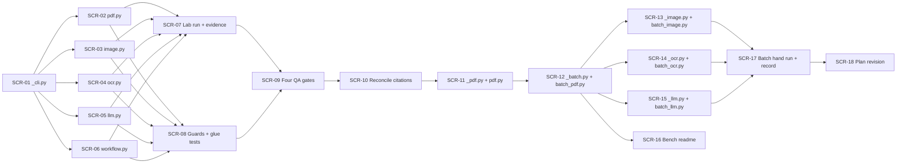

# WBS — lab tools (`scripts/tools/`)

| Field | Value |
|---|---|
| Document | WBS / task issues — lab tools (`scripts/tools/`) |
| Phase | **5 — Lab tools, one operator CLI per processor** (`docs/plan/README.md` §5) |
| Derived from | `docs/plan/subplan-scripts.md` §4 (WBS table, order/waves) |
| Source of truth | `docs/plan/subplan-scripts.md` + `docs/plan/README.md`; task IDs and titles are preserved verbatim from the subplan table |
| ID range | `SCR-01` … `SCR-18` |
| Status | `SCR-01`…`SCR-09` and `SCR-11`…`SCR-18` are `DONE`, with their evidence in `docs/plan/bitacora.md`; `SCR-10` is `NOT_STARTED`, and what it still owns is named in `subplan-scripts.md` §9 |

This document expands — never replaces — the subplan WBS. Every issue traces back to exactly
one row of `subplan-scripts.md` §4; no new scope is introduced here.
`.github/copilot-instructions.md` governs code quality for every task — with one recorded
exception: `scripts/` is covered by `ruff check .` and `ruff format --check .` and **not** by
`pylint src tests`, whose scope stays the library and its tests (subplan §9, decision 10).

## 1. Summary

| Field | Value |
|---|---|
| Phase | 5 — lab tools (after Phases 1–3 are closed; the four processors and the orchestrator are green) |
| ID range | SCR-01 … SCR-18 |
| # tasks | 18 |
| Effort distribution | S ×4 (SCR-09, 10, 16, 18) · M ×10 (SCR-01, 02, 03, 04, 07, 08, 11, 13, 14, 17) · L ×4 (SCR-05, 06, 12, 15) |
| Critical path | `SCR-01 → SCR-06 → SCR-07 → SCR-09 → SCR-10 → SCR-11 → SCR-12 → SCR-15 → SCR-17 → SCR-18` |
| Definition of Done gate | `pytest` · `ruff check .` · `ruff format --check .` · `pylint src tests`, plus the four mutation-falsified tool invariants |

**Scope.** Five thin operator CLIs — one per processor plus the orchestrator — that parse
arguments, build a real contract object, call the library and print the result, with output
under `var/tools/<tool>/<stem>-<hash8>/` and inputs drawn from `tests/fixtures/` and
`tests/fixtures-txt/`. A tool calls and never reimplements; the library never imports a tool;
no tool adds a contract, an option type or a default. `pdf.py`, `image.py` and `ocr.py` may
drive one named primitive of their own processor (the lab-bench exception); `workflow.py` may
not, because it carries the orchestrator's frontier.

**Scope added by wave 5 (`SCR-11`…`SCR-18`).** Each processor's tool gains a folder twin
(`batch_pdf.py`, `batch_image.py`, `batch_ocr.py`, `batch_llm.py`) that runs the same methods over
every matching file below a folder and mirrors the tree under `var/batch_<processor>/<folder>/`.
The methods themselves move into a shared `_`-prefixed layer per processor (`_pdf.py`,
`_image.py`, `_ocr.py`, `_llm.py`), so the two callers never grow two copies, and the folder frame
is `_batch.py` once for all four. This is the reversal recorded in `subplan-scripts.md` §9: batch
corpus runs were out of scope while the bench served one file at a time.

**Test framing.** The suite never executes a tool that would reach an engine: the guards are
static (AST over `scripts/` and `src/`) and the glue is exercised through the doubles the
processors already ship — `tests/fakes/processors/` at the contract level, the engine doubles
at the primitive level, `fake_provider.py` at the provider seam. The real seam is exercised by
hand (`SCR-07`) and recorded as an observation, never as a gate.

## 2. Task issue index

| ID | Task (short) | Effort | Wave | Depends on | Deliverable artifact(s) | Issue file | Status |
|---|---|---|---|---|---|---|---|
| SCR-01 | Convention + shared plumbing | M | 1 — Bench plumbing | — | `scripts/tools/_cli.py` | this file §SCR-01 | DONE |
| SCR-02 | `pdf.py` tool | M | 2 — Five tools | SCR-01 | `scripts/tools/pdf.py` | this file §SCR-02 | DONE |
| SCR-03 | `image.py` tool | M | 2 — Five tools | SCR-01 | `scripts/tools/image.py` | this file §SCR-03 | DONE |
| SCR-04 | `ocr.py` tool | M | 2 — Five tools | SCR-01 | `scripts/tools/ocr.py` | this file §SCR-04 | DONE |
| SCR-05 | `llm.py` tool | L | 2 — Five tools | SCR-01 | `scripts/tools/llm.py` | this file §SCR-05 | DONE |
| SCR-06 | `workflow.py` tool | L | 2 — Five tools | SCR-01 | `scripts/tools/workflow.py` | this file §SCR-06 | DONE |
| SCR-07 | Committed lab run + recorded evidence | M | 3 — Verify | SCR-02, SCR-03, SCR-04, SCR-05, SCR-06 | `docs/plan/bitacora.md` entry | this file §SCR-07 | DONE |
| SCR-08 | Structural guards + tool-glue tests | M | 3 — Verify | SCR-02, SCR-03, SCR-04, SCR-05, SCR-06 | `tests/test_lab_tools.py` | this file §SCR-08 | DONE |
| SCR-09 | Four QA gates clean | S | 4 — Close | SCR-07, SCR-08 | QA gate output | this file §SCR-09 | DONE |
| SCR-10 | Reconcile the stale lab-tool citations | S | 4 — Close | SCR-09 | root `README.md`, `docs/plan/README.md`, `wbs-general.md` | this file §SCR-10 | NOT_STARTED |
| SCR-11 | `_pdf.py` + `pdf.py` onto it | M | 5 — Batch mode | SCR-09 | `scripts/tools/_pdf.py` | this file §SCR-11 | DONE |
| SCR-12 | `_batch.py` + `batch_pdf.py` | L | 5 — Batch mode | SCR-11 | `scripts/tools/_batch.py`, `scripts/tools/batch_pdf.py` | this file §SCR-12 | DONE |
| SCR-13 | `_image.py` + `batch_image.py` | M | 5 — Batch mode | SCR-12 | `scripts/tools/_image.py`, `scripts/tools/batch_image.py` | this file §SCR-13 | DONE |
| SCR-14 | `_ocr.py` + `batch_ocr.py` | M | 5 — Batch mode | SCR-12 | `scripts/tools/_ocr.py`, `scripts/tools/batch_ocr.py` | this file §SCR-14 | DONE |
| SCR-15 | `_llm.py` + `batch_llm.py` | L | 5 — Batch mode | SCR-12 | `scripts/tools/_llm.py`, `scripts/tools/batch_llm.py` | this file §SCR-15 | DONE |
| SCR-16 | The batch sections of the bench readme | S | 5 — Batch mode | SCR-12 | `scripts/tools/readme.md` | this file §SCR-16 | DONE |
| SCR-17 | Hand run of the four batch tools + its record | M | 5 — Batch mode | SCR-13, SCR-14, SCR-15 | `docs/plan/bitacora.md` entry | this file §SCR-17 | DONE |
| SCR-18 | The batch revision of the subplan and the WBS | S | 5 — Batch mode | SCR-17 | `subplan-scripts.md` §3/§4/§5/§6/§9, this file, root `README.md` | this file §SCR-18 | DONE |

## 3. Detailed issues

### SCR-01 — Tool convention and shared plumbing

- **Type:** Contracts / tooling
- **Effort:** M
- **Wave:** 1 — Bench plumbing
- **Depends on:** —
- **Blocks:** SCR-02, SCR-03, SCR-04, SCR-05, SCR-06
- **Objective:** Fix the convention once — output root, fixture resolution, printers, exit codes — so five tools are not five copies of the same plumbing, and land its executable half in `scripts/tools/_cli.py`.
- **Scope / Deliverables:** `_cli.py` with: `output_root(tool, input_path, *, out=None)` → `var/tools/<tool>/<stem>-<hash8>/` (SHA-256 prefix from the input's bytes); `resolve_fixture(name, *, fixtures_root=..., text=False)` over `tests/fixtures/` and `tests/fixtures-txt/`, printing the resolved path; `print_result(result, *, as_json)` and `print_error(records)`; `exit_code_for(result)` → `0 | 1`; the `2` usage path left to `argparse`. The convention itself is written into `docs/plan/README.md` §4.1 in this same pass.
- **Out of bounds:** No contract import, no engine, no provider, no `argparse` subparser for a specific tool; no default engine/provider/model/DPI; nothing under `src/` may import this module.
- **Acceptance criteria:**
  - Given the same input twice, when `output_root` is called, then the directory is identical; given a different input, then it differs.
  - Given a bare fixture name, when it resolves, then the returned path exists under a fixture root and the caller has the absolute path to print.
  - Given a result whose `status` is not a success, when the exit code is computed, then it is `1` and no exception is raised.
- **Evidence / DoD:** Type hints on all signatures; Google-style docstrings; `ruff check .` and `ruff format --check .` clean; `_cli.py` imports neither a contract nor an engine (guard 3 of §SCR-08 covers it).
- **Tags:** —

### SCR-02 — `scripts/tools/pdf.py`

- **Type:** Tool
- **Effort:** M
- **Wave:** 2 — Five tools
- **Depends on:** SCR-01
- **Blocks:** SCR-07, SCR-08
- **Objective:** Expose the PDF processor's primitives and its contract from the command line, so a page can be rendered, read or classified by hand without a document run.
- **Scope / Deliverables:** `pdf.py` with `inspect`, `split`, `render` (`--page`, `--dpi`), `text`, `blocks`, `images`, `classify`, `run` (`--page` for `process_pdf_page`) — mapping exactly the rows of `subplan-scripts.md` §3.4. `--fixture` / `--fixtures-root`; `--json`; `--out`.
- **Out of bounds:** No Poppler binary named in the source; no re-implementation of a read, a render or a classification; no workflow decision (`REUSE`/`SKIP`/`FORCE`/`RESUME` are the orchestrator's); no default DPI when `render` is asked for one.
- **Acceptance criteria:**
  - Given `tests/fixtures/pdf/pdf_sample_mixed.pdf`, when `inspect` runs, then it prints the page count and geometry the primitive returned.
  - Given `--page 2 --dpi 300`, when `render` runs, then the PNG exists under `var/tools/pdf/…` and the tool prints its path.
  - Given `tests/fixtures/pdf/pdf_corrupt.pdf`, when `inspect` runs, then the typed error is printed and the exit code is `1`.
- **Evidence / DoD:** The glue test drives `run` through `tests/fakes/processors/` and the primitive subcommands through `fake_poppler`; the source names no engine binary.
- **Tags:** —

### SCR-03 — `scripts/tools/image.py`

- **Type:** Tool
- **Effort:** M
- **Wave:** 2 — Five tools
- **Depends on:** SCR-01
- **Blocks:** SCR-07, SCR-08
- **Objective:** Expose the image processor's analysis and preparation pipelines, so a scan's metrics and its two prepared variants can be inspected by hand.
- **Scope / Deliverables:** `image.py` with `info`, `metrics`, `normalize`, `ocr-ready`, `vlm-ready`, `classify`, `run` (`--from-page` for `process_image_from_page`) — mapping the rows of `subplan-scripts.md` §3.4. `--fixture`, `--json`, `--out`.
- **Out of bounds:** No `crop` subcommand — the library has no `crop_region` (`subplan-procesador-image.md` §9.6) and a tool may not invent one; no OpenCV/Pillow name in the source; no threshold literal of the tool's own; never aliasing `ocr-ready` to `vlm-ready`.
- **Acceptance criteria:**
  - Given `tests/fixtures/image/skewed_text.png`, when `metrics` runs, then the analysis is printed and the input's hash is unchanged.
  - Given both `ocr-ready` and `vlm-ready` in one invocation, then two distinct files are produced and each pipeline's transformations are reported.
  - Given `tests/fixtures/image/corrupt.png`, when `metrics` runs, then the typed `DECODE_ERROR` is printed and the exit code is `1`.
- **Evidence / DoD:** The glue test drives `run` through `tests/fakes/processors/` and the primitive subcommands through `fake_opencv`; the source names no engine module.
- **Tags:** —

### SCR-04 — `scripts/tools/ocr.py`

- **Type:** Tool
- **Effort:** M
- **Wave:** 2 — Five tools
- **Depends on:** SCR-01
- **Blocks:** SCR-07, SCR-08
- **Objective:** Expose the OCR processor's representations one at a time, so an operator can look at text, the reading carrying its tables, Markdown, the structured document, tables, blocks and metrics from a single prepared page.
- **Scope / Deliverables:** `ocr.py` with `run`, `text`, `mixed`, `md`, `json`, `tables`, `blocks`, `metrics` — mapping the rows of `subplan-scripts.md` §3.4. `--fixture`, `--json`, `--out`.
- **Out of bounds:** No `--engine` flag — Docling is the only OCR engine and is never user-selectable; no `diff` subcommand — comparing two extractions would be a second implementation of the thing under test; no `docling` name in the source; no option the library does not model.
- **Acceptance criteria:**
  - Given `tests/fixtures/ocr/ocr_prepared_text_and_table.png`, when `run` executes, then text, Markdown and the structured document are published under `ocr/` and their paths are printed.
  - Given `tests/fixtures/ocr/ocr_prepared_text_and_table.png`, when `text` executes, then `text.txt` is published in the run root holding exactly the text the payload states — the normalized reading a `run` of the same image writes under that name.
  - Given `tests/fixtures/ocr/ocr_blank.png`, when `text` runs, then an empty text with the `EMPTY` status is printed, an empty `text.txt` is published and the exit code is `0` — a blank page is data, not a failure.
  - Given a page carrying a table, when `mixed` runs with no flag stated, then `text.txt` holds the reading with that table as Markdown where it was read — the same method as `text`, claiming the detection the command's answer needs.
  - Given `--engine docling`, then the command exits with a usage error, because the flag does not exist.
- **Evidence / DoD:** The glue test drives `run` through `tests/fakes/processors/` and the representation subcommands through `fake_docling`; the `text` publication is guarded by the one-name-one-reading test; the source names no engine module.
- **Tags:** —

### SCR-05 — `scripts/tools/llm.py`

- **Type:** Tool
- **Effort:** L
- **Wave:** 2 — Five tools
- **Depends on:** SCR-01
- **Blocks:** SCR-07, SCR-08
- **Objective:** Expose one inference, one graph node, the linear chain, the resume path, the inventory and the token count — and make the whole surface demonstrable with **no model and no spent token** through the scripted provider.
- **Scope / Deliverables:** `llm.py` with `call`, `node`, `graph`, `resume` (re-invocation with a pinned `--run-id` and `--out`; there is no `resume_llm_graph` symbol), `status` (`load_graph_state` / `load_result`), `models` (`list_models` / `get_model_info` / `check_model_available`), `tokens` (`count_tokens` / `get_context_window`), `fake` (installs `tests/fakes/engines/fake_provider.py` at `docflow.llm.primitives`) — mapping the rows of `subplan-scripts.md` §3.4. `--provider` and `--model` required on every inference subcommand; `--assets-dir` defaults to `tests/fixtures/llm/` and is printed.
- **Out of bounds:** No default provider, model, template or schema; no retry of its own — the processor owns the only retry layer; no direct HTTP; no provider SDK name in the source; no prompt rendered by the tool.
- **Acceptance criteria:**
  - Given `call` with no `--provider` or no `--model`, then the command exits with a usage error and no request is built.
  - Given `--fixture casos/<uuid>.txt --template simple_extract --schema simple` and a provider, then the rendered prompt's call reaches the seam and the parsed, validated result is printed.
  - Given `fake`, when `graph` runs twice with the same `--run-id` and `--out`, then the second run reports the nodes reused, and `status` reads `state.json` and `final_result.json`.
  - Given `tokens` on a text input, then the count is printed and no provider is contacted.
- **Evidence / DoD:** The glue test drives every inference subcommand against `fake_provider`; guard 3 forbids an SDK name; the `fake` subcommand is exercised in `pytest` because it reaches no provider.
- **Tags:** —

### SCR-06 — `scripts/tools/workflow.py`

- **Type:** Tool
- **Effort:** L
- **Wave:** 2 — Five tools
- **Depends on:** SCR-01
- **Blocks:** SCR-07, SCR-08
- **Objective:** Drive the orchestrator from the command line — plan, run, force, skip, stop, resume — and read the durable context back.
- **Scope / Deliverables:** `workflow.py` with `run`, `plan` (`dry_run=True`, invokes no processor), `status` (`load_resumable_context`), `context` (`persistence.read_json` on `configuration.state_path`), `resume` (`resume_document`), `force` (`--stages`), `skip` (`--stages`), `stop` (`--after`), plus `--fake-llm` (installs the scripted provider at `docflow.llm.primitives`, below the orchestrator's frontier) — mapping the rows of `subplan-scripts.md` §3.4. The tool builds a complete `DocumentRequest`: `options["output_dir"|"pdf"|"image"|"ocr"|"llm"]` and `policies["allow_ocr"|"allow_vlm"]` all supplied from flags.
- **Out of bounds:** No `docflow.*.primitives` import anywhere in the file; no default document policy, provider, model or output directory; no consolidation or routing logic in the tool; no `stop_requested`/`CANCELLED` surface (resolved out of the orchestrator's PoC set).
- **Acceptance criteria:**
  - Given `plan` on `tests/fixtures/pdf/pdf_sample_text.pdf`, then the per-stage plan is printed and no processor is invoked.
  - Given `run` with `allow_ocr` false, then the OCR stage is reported `SKIPPED` with its reason, and the run's stage states are printed.
  - Given a missing required option, then the library's named `CONFIGURATION_ERROR` is printed and the exit code is `1`.
  - Given the source, when its imports are read, then no `docflow.*.primitives` module appears.
- **Evidence / DoD:** The glue test drives `run`/`plan`/`resume` through `tests/fakes/processors/`; guard 4 asserts the frontier.
- **Tags:** —

### SCR-07 — Committed lab run over the fixture roots, with the evidence recorded

- **Type:** Evidence
- **Effort:** M
- **Wave:** 3 — Verify
- **Depends on:** SCR-02, SCR-03, SCR-04, SCR-05, SCR-06
- **Blocks:** SCR-09
- **Objective:** Run the five tools by hand against `tests/fixtures/**` and `tests/fixtures-txt/**`, on the real seam, and record what happened — including where an engine is absent.
- **Scope / Deliverables:** One entry appended to `docs/plan/bitacora.md` with the exact commands and their real output: `pdf.py` on the three classification samples plus `pdf_corrupt.pdf`; `image.py` on the committed samples plus `corrupt.png`; `ocr.py` on both OCR pages; `llm.py` on a `fixtures-txt` case, with and without `fake`; `workflow.py plan` (no engine) and `workflow.py run --stop --after PDF` where an engine exists.
- **Out of bounds:** Not a gate — this is an observation, and a run that fails because Poppler is not installed is a *recorded fact*, not a defect to fix here; no fixture may be regenerated or edited by this task; no new test.
- **Acceptance criteria:**
  - Given the recorded commands, when a reader re-runs them, then each output matches what the log states, or the log's caveat explains the difference (engine absent, provider absent).
  - Given the log, then for each of the five tools at least one success path and at least one typed-failure path is recorded.
  - Given the log, then the input files' hashes are recorded before and after, proving the bench did not mutate a fixture.
- **Evidence / DoD:** The four-field mutation record lives in the root `README.md` (where `GEN-16` audits it); this entry points at it and does not restate it.
- **Tags:** —

### SCR-08 — Structural guards + tool-glue tests

- **Type:** Tests
- **Effort:** M
- **Wave:** 3 — Verify
- **Depends on:** SCR-02, SCR-03, SCR-04, SCR-05, SCR-06
- **Blocks:** SCR-09
- **Objective:** Make the tool conventions falsifiable: the tool set, the frontier in both directions, the "calls, never reimplements" boundary, the orchestrator's frontier, and the parse surface — plus one glue test per `run` path over the doubles that already exist.
- **Scope / Deliverables:** `tests/test_lab_tools.py` with the six structural guards of `subplan-scripts.md` §6 (AST over `scripts/` and `src/`, no execution), the parser/`--help` tests, and the glue tests: `tests/fakes/processors/` for the `run` paths, the engine doubles for the primitive subcommands, `fake_provider` for the inference subcommands.
- **Out of bounds:** No test executes a tool subcommand that would reach a real engine; no new fake is created for the tools — they consume the doubles the processors ship; no assertion about an engine's values.
- **Acceptance criteria:**
  - Given the tool set, when the guard reads `scripts/tools/`, then it is exactly `_cli.py` plus the five tools.
  - Given `src/docflow/`, then no module mentions `scripts` or `var` and none imports `tests/`.
  - Given a glue test with a double installed, then the tool built the request its flags describe and the double was called exactly once.
  - Given each invariant of `subplan-scripts.md` §6, when its documented mutation is applied, then the guard goes red, and it is restored green afterwards.
- **Evidence / DoD:** Four invariant records in the root `README.md` table, in the four-field shape of `docs/plan/README.md` §7.
- **Tags:** —

### SCR-09 — The four QA gates clean

- **Type:** Verification
- **Effort:** S
- **Wave:** 4 — Close
- **Depends on:** SCR-07, SCR-08
- **Blocks:** SCR-10
- **Objective:** Run the four gates on the whole tree and record their real counts, with the tool tree included where the gate reaches it.
- **Scope / Deliverables:** `pytest`, `ruff check .`, `ruff format --check .`, `pylint src tests`, recorded verbatim with their counts in the `SCR-07` bitácora entry's session.
- **Out of bounds:** No config change to make a gate pass (`pyproject.toml` stays as it is); no gate added or removed — the tools' Pylint bound is decision 10 of `subplan-scripts.md` §9 and is stated, not silently widened.
- **Acceptance criteria:**
  - Given the four commands, when they run from the repository root, then all four are clean.
  - Given `ruff check .` and `ruff format --check .`, then they report files under `scripts/tools/` as covered.
  - Given `pylint src tests`, then it reports the same scope as before this phase, and the bitácora states that `scripts/` is outside it.
- **Evidence / DoD:** The command output, copied with its counts.
- **Tags:** —

### SCR-10 — Reconcile the stale lab-tool citations

- **Type:** Documentation
- **Effort:** S
- **Wave:** 4 — Close
- **Depends on:** SCR-09
- **Blocks:** —
- **Objective:** Close the two stale citations the subplan §9 table still registers — `wbs-general.md`'s missing Phase 5 range and `.github/copilot-instructions.md`'s kernel-era lab surface — so no document disagrees with the tools that now exist, and do it in one pass, because a half-updated list is worse than a stale one.
- **Scope / Deliverables:** `docs/plan/issues/wbs-general.md` — §1 and §4 gain the Phase 5 range as one row each; `.github/copilot-instructions.md` — the `docflow-kernel` / `kernel_cli/` description points at `scripts/tools/` and the resolved layout. The root `README.md` (tool table, phase table, divergence note) and `docs/plan/README.md` (§4.1, subplans index, Phase 5, §6, §7) were already reconciled by the planning pass that produced this subplan: verify them, do not re-edit them.
- **Out of bounds:** No task ID is renumbered, and no frozen row is deleted: the borrowed ids are *re-described*, not reassigned. `docs/idea/` is read-only. No new decision is taken here — every statement already exists in `subplan-scripts.md`.
- **Acceptance criteria:**
  - Given a sweep for the six borrowed ids near the words "lab tool"/"script", then no document claims a lab tool owns an id that belongs to the CI gate or an engine double.
  - Given the root `README.md`, then its tool table lists exactly the subcommands of `subplan-scripts.md` §3.4, and the Phase 5 row cites `SCR-01`…`SCR-18`.
  - Given the four gates after the edits, then they are clean (docs are excluded from Ruff and Pylint, so this is a regression check).
- **Evidence / DoD:** The sweep command and its output, appended to the `SCR-07` bitácora entry.
- **Tags:** —

### SCR-11 — `scripts/tools/_pdf.py`, and `pdf.py` rewritten onto it

- **Type:** Tooling / refactor
- **Effort:** M
- **Wave:** 5 — Batch mode
- **Depends on:** SCR-09
- **Blocks:** SCR-12
- **Objective:** Lift the PDF bench's eight methods, their payloads and their flags out of `pdf.py` into a shared layer, so the folder twin about to be written has something to call instead of a second copy.
- **Scope / Deliverables:** `_pdf.py` with `SUBCOMMANDS`, `build_subcommands(subparsers, *, input_argument)`, the eight methods (`inspect`, `split`, `render`, `text`, `blocks`, `images`, `classify`, `run`) each returning a payload, and `COMMANDS`; `pdf.py` reduced to a parser, one handler factory and `main`.
- **Out of bounds:** No behaviour change — the refactor is proved by `pdf.py`'s existing hand run being byte-for-byte what it was. No second payload, no flag declared twice, no method that prints (`_cli`'s printers belong to the tool).
- **Acceptance criteria:**
  - Given the same input and flags, when `pdf.py` runs before and after, then the printed summary is identical.
  - Given `_pdf.py`, when its source is read, then it has no `main`, prints nothing and names no engine binary.
- **Evidence / DoD:** The pre-existing lab-tool tests unchanged and green; the hand run recorded in the bitácora.
- **Tags:** —

### SCR-12 — `scripts/tools/_batch.py` and `batch_pdf.py`

- **Type:** Feature / tooling
- **Effort:** L
- **Wave:** 5 — Batch mode
- **Depends on:** SCR-11
- **Blocks:** SCR-13, SCR-14, SCR-15, SCR-16
- **Objective:** Run an operator command over every input below a folder and mirror the tree, with the frame written once because three more batch tools are coming.
- **Scope / Deliverables:** `_batch.py` — `build_parser(tool, description, *, subcommand_required)`, `resolve_command(parser, argv, default)`, `folder`, `default_root`, `inputs_under`, `mirror_dir`, `run_one`, `run_batch(..., suffixes=, default=, header_extra=, validate=)`; `batch_pdf.py` — the `.pdf` suffix set, `inspect` as the default, the layer and the error type it catches.
- **Out of bounds:** No walk, mirror, summary or exit-code computation inside the tool; no parallel execution; no default output root outside `var/`; no `--dry-run`.
- **Acceptance criteria:**
  - Given a corpus with nested folders, when the batch runs, then each input has `<root>/<relative folders>/<stem>/<command>.json`.
  - Given a corpus holding one bad file, then the run reports it, counts it, keeps going and exits `1`.
  - Given no subcommand, then the header says `command: <default> (default, none stated)` and the command's own flags are parsed.
  - Given a file where the folder belongs, then exit `2`.
- **Evidence / DoD:** Four glue tests over `fake_poppler` (`mirror`, `default`, `failure count`, folder refusal) plus the hand run; guard 7's pin.
- **Tags:** —

### SCR-13 — `scripts/tools/_image.py` and `batch_image.py`

- **Type:** Tooling
- **Effort:** M
- **Wave:** 5 — Batch mode
- **Depends on:** SCR-12
- **Blocks:** SCR-17
- **Objective:** The image bench's seven methods in a shared layer, and the folder twin over the image suffix set.
- **Scope / Deliverables:** `_image.py` (`SUBCOMMANDS`, `SUFFIXES`, the seven methods, `COMMANDS`); `batch_image.py` (`info` default, the image suffixes, the layer); `image.py` reduced to a parser, one handler and `main`.
- **Out of bounds:** No `crop`; no threshold of the tool's own; `ocr-ready` and `vlm-ready` never aliased; no OpenCV name in either file.
- **Acceptance criteria:**
  - Given `tests/fixtures/image`, when `batch_image.py` runs with no subcommand, then `command: info (default, none stated)` and `files: 4 · succeeded: 3 · failed: 1`, with `DECODE_ERROR` for `corrupt.png`.
  - Given `image.py info`, when it runs, then it prints through the same layer the batch tool drives.
- **Evidence / DoD:** The two glue tests plus the hand run.
- **Tags:** —

### SCR-14 — `scripts/tools/_ocr.py` and `batch_ocr.py`

- **Type:** Tooling
- **Effort:** M
- **Wave:** 5 — Batch mode
- **Depends on:** SCR-12
- **Blocks:** SCR-17
- **Objective:** The OCR bench's eight methods in a shared layer, and the folder twin — where the input *is* an image, so the suffix set is the image one.
- **Scope / Deliverables:** `_ocr.py` (`SUFFIXES`, `TEXT_NAME`, `TABLES_COMMANDS`, the eight methods, `COMMANDS`); `batch_ocr.py` (`text` default, the layer); `ocr.py` reduced to a parser, one handler and `main`.
- **Out of bounds:** No `--engine`; no `diff`; no Docling name in either file; no second copy of the reading-order composition; no artifact beyond the reading — `text` and `mixed` each publish one file, the reading the run reports, and the two names share one method rather than one of them owning a second copy.
- **Acceptance criteria:**
  - Given `tests/fixtures/ocr`, when `batch_ocr.py` runs with no subcommand, then `files: 2 · succeeded: 2 · failed: 0`, two mirrored records, and each mirror holding the `text.txt` its own record states.
  - Given `text` and `run` over one image, then both `text.txt` files hold the same bytes — one name means one reading.
  - Given `mixed` with no flag stated, then the tables are claimed by the command, and a page with a table publishes a reading carrying it.
  - Given an input the engine refuses, then that input fails its own record, the typed failure is printed and the rest of the corpus still runs.
  - Given an input whose contract *returned* `FAILED`, then it is printed as `FAILED`, its own record is shown and it is not reported as `ok`.
- **Evidence / DoD:** Three glue tests (mirror, engine throw, returned failure) plus the hand run against the real engine.
- **Tags:** —

### SCR-15 — `scripts/tools/_llm.py` and `batch_llm.py`

- **Type:** Tooling
- **Effort:** L
- **Wave:** 5 — Batch mode
- **Depends on:** SCR-12
- **Blocks:** SCR-17
- **Objective:** The LLM bench's eight methods in a shared layer, and a folder twin that offers only the four commands a corpus can answer — with no default command, because there is no flag-free one to make.
- **Scope / Deliverables:** `_llm.py` (`SUBCOMMANDS`, `SUFFIXES`, `DEFAULT_ASSETS_DIR`, the eight methods, `install_fake`, `COMMANDS`); `batch_llm.py` (a **required** subcommand, `SUBCOMMANDS = call | graph | node | tokens`, `--assets-dir`, `--fake`); `llm.py` reduced to a parser, one handler and `main`.
- **Out of bounds:** No default provider or model on any command; `status`, `models`, `fake` and `resume` not registered on the batch tool at all; no provider SDK named in either file; the scripted provider installed at the seam and nowhere else (`subplan-scripts.md` §9, decision 9).
- **Acceptance criteria:**
  - Given no subcommand, when `batch_llm.py` runs, then exit `2` and the usage error names the missing `SUBCOMMAND`.
  - Given `status`, then exit `2` — the command is not registered rather than silently ignored.
  - Given `--fake` and the asset root, when a corpus of texts runs `call`, then every input succeeds with no model served and no token spent.
  - Given no model served and no `--fake`, then every input returns a typed `MODEL_UNAVAILABLE`, each is printed as `FAILED` with its record, and the exit code is `1`.
- **Evidence / DoD:** Six glue tests, including one that patches the fake installer **by name** because a by-path tool and a test import the same layer as two module objects.
- **Tags:** —

### SCR-16 — The batch sections of the bench readme

- **Type:** Documentation
- **Effort:** S
- **Wave:** 5 — Batch mode
- **Depends on:** SCR-12
- **Blocks:** —
- **Objective:** A human who has not read the code can run a batch and predict what lands where.
- **Scope / Deliverables:** `scripts/tools/readme.md` — a section per batch tool (pairing block, mirror, suffix set, default command, the `<command>.json` rule, exit codes) and the updated layout table; the ``SCR-11``…``SCR-18`` revision cited where the module set is asserted.
- **Out of bounds:** No claim the tools do not keep: every line in the examples is a command that runs as written against a committed fixture.
- **Acceptance criteria:** Each documented example runs as written; the section names the default each tool makes and what it publishes.
- **Evidence / DoD:** The readme's own examples, run during `SCR-17`.
- **Tags:** —

### SCR-17 — Hand run of the four batch tools, with the evidence recorded

- **Type:** Verification
- **Effort:** M
- **Wave:** 5 — Batch mode
- **Depends on:** SCR-13, SCR-14, SCR-15
- **Blocks:** SCR-18
- **Objective:** Exercise the real seam by hand, on real folders, and record what came back — counts, exit codes and the typed records — because a corpus's behaviour under a bad file is an observation, not an assertion.
- **Scope / Deliverables:** A `docs/plan/bitacora.md` entry with the four commands and their real output, including the runs where the engine or the model is absent.
- **Out of bounds:** No engine install, no model download, no network call beyond the loopback the LLM tools already make; no claim recorded without the line that shows it.
- **Acceptance criteria:** Every recorded line is reproducible with the command beside it; the exit codes are measured outside a pipeline (`echo $?` after the tool, never after `tail`).
- **Evidence / DoD:** The bitácora entries for the four phases of wave 5.
- **Tags:** —

### SCR-18 — The batch revision of the subplan, the WBS and the root README

- **Type:** Documentation
- **Effort:** S
- **Wave:** 5 — Batch mode
- **Depends on:** SCR-17
- **Blocks:** —
- **Objective:** Make `docs/plan/` and the root `README.md` agree with `scripts/tools/` after wave 5, in **one pass**, because a half-updated plan is worse than a stale one.
- **Scope / Deliverables:** `subplan-scripts.md` §3.1 (the module set), §3.2 (the exception moved to the layers), §3.3 (the batch output root and exit code), §3.4 (the four batch tools and their rules), §3.5 (the demonstration folders), §4 (this range), §5 (three batch scenarios), §6 (guards 1, 3, 6, 7 and four new invariants), §7 (the DoD's module set) and §9 (the reversal, the four new decisions, the stale table); this file — the range, the index, the issues, the graph, the waves, the critical path, the traceability rows and §11; `docs/plan/README.md` §5's Phase 5 row and `wbs-general.md` §1/§4.6.
- **Out of bounds:** No renumbered ID (`SCR-11`…`SCR-18` are appended; nothing existing moves), and no edit to a frozen artifact's *decision* — only to what it says the bench contains.
- **Acceptance criteria:** Every `SCR-` citation in the three documents resolves to a row that exists; the module set in §3.1 equals the set guard 1 asserts; §9's out-of-scope list no longer contradicts the tools.
- **Evidence / DoD:** The revision itself, in the same commit as the code it describes; the reversal recorded in the bitácora with `docs/feedback/batch-mode-across-processors.md` as the winning decision.
- **Tags:** —

## 4. Dependency graph

## 5. Execution waves

| Wave | Tasks | Entry condition | Exit condition |
|---|---|---|---|
| 1 — Bench plumbing | SCR-01 | Phases 1–3 closed; subplan §7 DoR satisfied | `_cli.py` exists; output root, fixture resolution, printers and exit codes are exercised by their own unit tests; `docs/plan/README.md` §4.1 states the convention |
| 2 — Five tools | SCR-02 ∥ SCR-03 ∥ SCR-04 ∥ SCR-05 ∥ SCR-06 | SCR-01 green | Each tool parses its documented subcommands, calls the symbol `subplan-scripts.md` §3.4 names, and writes only under `var/tools/<tool>/`; no tool imports another |
| 3 — Verify | SCR-07 ∥ SCR-08 | Wave 2 green | The hand run is recorded with real output and real hashes; the six guards and the glue tests are green with no engine, and the four invariants are mutation-falsified |
| 4 — Close | SCR-09 → SCR-10 | Wave 3 green | The four gates are clean; the two remaining stale citations are reconciled in one pass and the sweep is recorded |
| 5 — Batch mode | SCR-11 → SCR-12 → (SCR-13 ∥ SCR-14 ∥ SCR-15) → (SCR-16 ∥ SCR-17) → SCR-18 | Wave 4 green, so the tools and the convention are settled — a layer extracted before SCR-09 would be a layer over moving code | Each processor's two tools call one layer; the four batch tools share `_batch.py` and contain no walk, mirror, summary or exit code of their own; the hand run is recorded; the plan and the root `README.md` agree with the tree |

## 6. Critical path

`SCR-01 → SCR-06 → SCR-07 → SCR-09 → SCR-10 → SCR-11 → SCR-12 → SCR-15 → SCR-17 → SCR-18`

It is critical because the shared plumbing (SCR-01) precedes every tool; `workflow.py`
(SCR-06) is the longest of the five tools — it composes all four processors through their
contracts and builds the widest request — and it is the tool the hand run depends on most;
the hand run (SCR-07) must precede the gate (SCR-09) and the reconciliation (SCR-10) closes
the phase. `SCR-02`…`SCR-05` are parallel branches of equal or shorter length that join at
SCR-07 and SCR-08; a slip in any one of them delays the same two gates. `SCR-08` runs in
parallel with `SCR-07` on purpose: the machine guard and the human observation answer
different questions, and neither substitutes for the other.

**Wave 5's leg of the path.** `SCR-11` is first because the PDF bench has the widest surface, so
the layer split is proved where a mistake would show; `SCR-12`'s frame follows it, because a frame
extracted from one tool is a guess and a frame extracted from the second is a fact — and every later
batch tool is a suffix set, a layer and a command on top of it. `SCR-15` is the longest of the three
parallel pairs (eight methods, two shapes of failure, a scripted provider), so it closes the pair;
`SCR-17` must see all three, because a corpus behaviour recorded from two of the four would be a
half-answer; and `SCR-18` — the revision — is last by definition: it describes the tree the earlier
tasks produced.

## 7. Traceability

| Acceptance scenario (subplan §5) | Implemented by | Tested by |
|---|---|---|
| A tool calls the library instead of reimplementing it | SCR-01 … SCR-06 | SCR-08 guard 3 (no engine binary, engine module or SDK named) + SCR-08 glue tests (the double is called) |
| The library never reaches back into the tools | SCR-01 … SCR-06 (by omission) | SCR-08 guard 2 (no `scripts`/`var` mention under `src/`; no `tests/` import) |
| Output lands on the bench | SCR-01 | SCR-01 unit tests + SCR-08 glue test; SCR-07 records input hashes before and after |
| No inference without a stated provider and model | SCR-05, SCR-06 | SCR-08 parser test + invariant 4 (`--model` given a default must go red) |
| A typed failure is reported, not raised | SCR-01, SCR-02, SCR-03 | SCR-08 glue tests on `pdf_corrupt.pdf` and `corrupt.png`; SCR-07 records the same by hand |
| The fixture name is resolved out loud | SCR-01 | SCR-08 parser/`--help` tests + SCR-07's recorded header line |
| `workflow.py` is bound by the orchestrator's frontier | SCR-06 | SCR-08 guard 4 + invariant 3 (calling a `primitives` symbol must go red) |
| Invariant 1 — a tool adds no behaviour | SCR-02 | SCR-08 invariant 1 (shelling out to `pdftoppm` must go red) |
| Invariant 2 — the library never imports a tool | SCR-01 … SCR-06 | SCR-08 invariant 2 (`src/` importing `scripts.tools._cli` must go red) |
| The five tools match the documented map | SCR-02 … SCR-06 | SCR-08 guard 1 (the tool set) + guard 6 (every documented subcommand parses) |
| A batch runs a whole folder and does not stop at the first bad file | SCR-12 … SCR-15 | SCR-12/13/14's glue tests (mirror, failure count, exit `1`) + SCR-17's recorded runs |
| A batch states the command it made instead of assuming one | SCR-12 … SCR-15 | The batch glue tests' header assertions + invariant 6 (`default=False` must go red) |
| The batch frame is one implementation, not four | SCR-12 … SCR-15 | Guard 1 (the module set) + guard 3 over the layers + SCR-08's glue tests driving all four tools through `_batch.run_batch` |
| The fifteen modules match the documented set | SCR-11 … SCR-15 | SCR-08 guard 1, whose set is the one `subplan-scripts.md` §3.1 now fixes |

## 8. Definition of Ready (per task)

- The task appears as a row in `subplan-scripts.md` §4 with the same ID, title, effort and dependencies.
- Phases 1–3 are closed, so every symbol `subplan-scripts.md` §3.4 names exists; no tool is written against a stub entry point.
- `docs/plan/README.md` §4.1 states the convention, and the root `README.md` tool table agrees with it subcommand for subcommand.
- The fixture map of `subplan-scripts.md` §3.5 names only committed files, and each exists in the tree.
- For SCR-05: the emission shape of `fake_provider.py` and the seam it patches (`docflow.llm.primitives`) are read, not assumed.
- For SCR-06: the required `DocumentRequest` keys (`options["output_dir"|"pdf"|"image"|"ocr"|"llm"]`, `policies["allow_ocr"|"allow_vlm"]`) are read out of `workflow/configuration.py`, not guessed.
- For SCR-08: the guards are drafted before the first tool lands, so the boundary is checked from the first commit.
- No open question blocks the happy path; no tool introduces a domain noun.

## 9. Definition of Done (per task)

- [ ] The task's files exist at the paths `subplan-scripts.md` §3.1 fixes, with type hints on every signature and Google-style docstrings.
- [ ] Every subcommand calls the symbol `subplan-scripts.md` §3.4 names; the tool contains no transformation, retry, cache, fallback, prompt render or routing decision.
- [ ] No default engine, provider, model, DPI or threshold; `--provider`/`--model` are required on every inference subcommand.
- [ ] Output is written only under `var/tools/<tool>/<stem>-<hash8>/` (or `--out`); the input is untouched; nothing lands in `out/`.
- [ ] Typed failures print and exit `1`; usage errors exit `2`; a failure the library already typed never surfaces as a traceback.
- [ ] `pytest` green with no engine installed; no test invokes, imports or asserts an engine or a provider; the tools' glue is exercised through the doubles the processors ship.
- [ ] `ruff check .` clean (import order included) · `ruff format --check .` clean · `pylint src tests` clean (`fixme` disabled); `scripts/` is outside Pylint's scope by decision 10, and that bound is stated rather than hidden.
- [ ] Every invariant touched by the task has been mutation-falsified: mutate → observe failure → restore → re-run green, both observations reported, in the four-field shape of `docs/plan/README.md` §7, recorded in the root `README.md`.
- [ ] Nothing under `src/docflow/` mentions `scripts` or `var`, and nothing under `src/docflow/` imports `tests/`.
- [ ] Every shortcut carries an inline `# TODO: [MVP]` or `# TODO: [RELEASE]` tag; output, identifiers, docstrings and comments in English.

## 10. Risks & mitigations (execution view)

| Risk (subplan §8) | Task affected | Mitigation owned by |
|---|---|---|
| A tool drifts into a second implementation of its processor | SCR-02 … SCR-06 | SCR-08 guard 3 (no engine binary/module/SDK name in a tool) + the glue tests; the exception in subplan §3.2 is bounded to the tool's own `primitives/` |
| A tool becomes a de-facto API and something under `src/` imports it | SCR-01 … SCR-06 | SCR-08 guard 2 (the frontier, both directions) + invariant 2 |
| A default sneaks in (`--model`, `--dpi`, `--engine`) | SCR-05, SCR-06 | SCR-05/SCR-06 require the flags; SCR-08 invariant 4 mutates a default into place and must go red |
| The tools bit-rot because no CI job runs them | SCR-02 … SCR-06 | SCR-08's guards run in `pytest` and therefore in `GEN-21`'s gate; SCR-07 re-records the hand run on every engine pin bump. Executing the tools in CI is out of scope (decision 13) |
| A tool's output tree is committed by accident | SCR-01 | SCR-01 owns the path helper; `/var/` is already in `.gitignore`; SCR-07 records `git status` clean after a run |
| The engine is not installed on the bench | SCR-07 | SCR-07 records what each tool does with the engine absent as a first-class observation; SCR-02/03/04 print the typed error and exit `1` |
| Six files of argparse nobody re-reads | SCR-02 … SCR-06 | SCR-08 guard 6 parses every documented subcommand; `subplan-scripts.md` §3.4 is the mapping the runbook and the guards both cite |
| A stale citation survives the phase | SCR-10, SCR-18 | SCR-10's sweep command and its output, recorded in the bitácora; SCR-18 re-derives the module set and the `SCR-` ranges from the tree and the WBS, one pass, no renumbering |
| A default command fills a batch tree nobody asked to fill | SCR-12 … SCR-15 | The default is a flag-free method that publishes at most the reading it reports — `batch_ocr.py`'s `text` writes one `text.txt` per input, and `inspect`/`info` write nothing; `batch_llm.py` has none at all; the header states the default whenever one is made, and invariant 6 mutates the statement away and must go red |
| Four batch tools drift into four frames | SCR-12 … SCR-15 | `_batch.py` owns the walk, the mirror, the record, the summary and the exit code; a batch tool is a suffix set, a layer and a command — asserted by the frame's tests and by the tools' size |

## 11. Out of scope

- The product CLI (`docflow`) and any `[project.scripts]` entry point: the tools are invoked by path and the library imports nothing under `scripts/` (`subplan-scripts.md` §9, decisions 2 and 11).
- The `docflow-kernel` console entry point and `src/docflow/kernel_cli/` named in `.github/copilot-instructions.md` — superseded by `docs/plan/README.md` §9.1.
- `image.py crop` and `ocr.py diff`: the first has no `crop_region` to call and the second would be a second implementation of the extraction under test (decision 8).
- A `batch_workflow.py`: the orchestrator's input is a document request, not a folder, so a corpus of documental runs is a different feature with its own cost model (`subplan-scripts.md` §9).
- Parallelism inside a batch: the four batch tools walk and run serially, in sorted order, so two runs over one tree print the same lines in the same sequence.
- Executing the tools inside `GEN-21`'s CI workflow; interactive/watch modes; shell completion; any tool-local cache.

**Reversed by wave 5.** *"Batch corpus runs over `documentos/` and mirrored output trees"* was out
of scope while the bench served one file at a time. It is now in scope for the four processors'
own folders — the committed fixture roots and any folder a caller names — and it does **not**
reintroduce `documentos/`: the corpus stays out of the repository and a batch run writes to
`var/batch_<processor>/<folder>/`, which is ignored too. The decision is
`docs/feedback/batch-mode-across-processors.md`; the reversal is recorded in
`subplan-scripts.md` §9 and in the bitácora by `SCR-18`.
