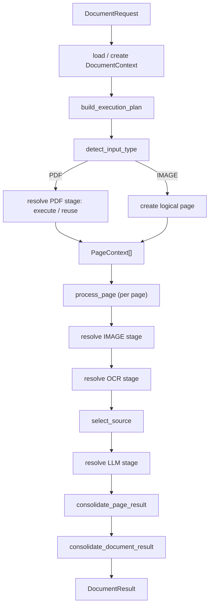

# Subplan — procesador-orquestador

## 1. Objective

The `orchestrator` component (`src/docflow/workflow/`, import name `docflow.workflow`) owns the complete document workflow. It is the single component that decides what processor runs, in what order, with what artifacts, whether OCR or vision runs, which document source is selected, when to reuse / skip / force / resume, how to handle errors and fallbacks, and how to consolidate pages and the document. It receives a `DocumentRequest` and returns a `DocumentResult`, persisting and controlling all execution state in between, and it never implements any PDF, image, OCR, or LLM logic itself.

## 2. Context (BA)

**Responsibility.** The orchestrator is the only component that knows the whole document workflow (general plan, Phase 2). It owns, end to end: state, idempotency, stop/resume, skip/force, dependencies, invalidation, concurrency, and reprocessing. It composes the four processors from Phase 1 exclusively through their public contracts — `PDFRequest → PDFResult`, `ImageRequest → ImageResult`, `OCRRequest → OCRResult`, `LLMInput → LLMResult` — and is the only caller of those processors.

**Principle line.** *Processors transform; the orchestrator decides, coordinates, manages state, and controls execution.*

**Explicit "does NOT" list.** The orchestrator does not:

- extract text, render pages, or extract embedded images from a PDF (`procesador-pdf`);
- analyze, normalize, deskew, or prepare images (`procesador-image`);
- run OCR / Docling directly (`procesador-ocr`);
- render prompts, build provider payloads, invoke providers, validate schemas, retry inferences, or execute the LLM inference subgraph (`procesador-llm-call`);
- write to another processor's artifact namespace (`source/`, `render/`, `native_text/`, `image/`, `ocr/`, `llm/` ownership stays with its producer);
- interpret document content semantically — it routes, it does not read;
- propagate a processor failure as an exception where a typed result is the contract.

## 3. Design (SA)

### 3.1 Contract types

**`DocumentRequest`** (input) — fields:

```text
input_path
input_type          # PDF | IMAGE | auto
workflow            # workflow identifier (data, not code)
policies            # allow_ocr, allow_vlm, ...
execution           # ExecutionPolicy
options
metadata
```

**`ExecutionPolicy`** (operational decisions, kept separate from document policies):

```text
resume
reuse_successful
retry_failed
skip_stages[]
force_stages[]
stop_after_stage
start_from_stage
invalidate_downstream
dry_run
parallel_pages
```

**`DocumentResult`** (output) — fields:

```text
document_id
workflow_run_id
input
pages[]
status
execution_summary
decisions[]
errors[]
metadata
final_result
```

**`DocumentContext`** (durable document state, owned only by the orchestrator) — fields:

```text
document_id
workflow_run_id
input
input_hash
input_type
workflow
policies
execution_policy
pages[]
stages[]
decisions[]
errors[]
status
stop_requested
final_result
```

**`PageContext`** (per-page state) — fields:

```text
page_number
artifacts          # page_pdf, page_image, native_text, normalized_image, ocr_text, ocr_markdown
results            # pdf_result, image_result, ocr_result, llm_result
stages             # image, ocr, llm
selected_source
extraction_strategy
decisions[]
errors[]
status
```

**`StageExecution`** (the atomic control unit) — fields:

```text
stage_id
stage
processor
processor_version
status
processing_key
input_artifacts[]
output_artifacts[]
options_hash
attempts
started_at
finished_at
skip_reason
force_reason
error
metadata
```

**Stage states:** `NOT_STARTED`, `READY`, `RUNNING`, `SUCCESS`, `FAILED`, `PARTIAL`, `SKIPPED`, `REUSED`, `INVALIDATED`, `PAUSED`, `CANCELLED`, `REVIEW_REQUIRED`. The distinction matters: `SKIPPED` = deliberately not run; `REUSED` = a valid result already exists.

### 3.2 Document workflow



### 3.3 Per-page unit

Each page is a self-contained unit of parallelism, recovery, and reprocessing. A `PageContext` owns its own `StageExecution` records and artifacts. If pages P1, P2, P4, P5 are `SUCCESS` and P3 is `FAILED`, only P3 is reprocessed on resume. Page processing preserves logical order regardless of parallel execution, and each page's state is isolated from the others.

### 3.4 `processing_key` formula and the reuse rule

```text
processing_key = hash(processor + processor_version + input_hashes + normalized_options)
```

**Reuse rule.** A stage is `REUSED` only when all of the following hold:

```text
status == SUCCESS
AND processing_key == current_processing_key
AND output artifacts exist
AND output artifact hashes are valid
```

Physical file existence alone never implies reuse: `ocr/document.json` on disk is not a reason to reuse unless its `processing_key` matches and its artifacts validate.

### 3.5 skip / force / stop / resume semantics

- **Skip** — explicit and persistent; the stage is recorded `SKIPPED` with a `skip_reason` (`explicit_skip` / `skipped_by_policy`). A reused result is never recorded as a skip.
- **Force** — executes the stage even if a valid result exists, and **invalidates downstream dependents**. Force levels: `force_document`, `force_page`, `force_stage`.
- **Stop** — sets `stop_requested = true`, does not start new stages, lets the in-flight atomic stage finish, persists state, and leaves the document `PAUSED`. Stop never destroys the workflow; it leaves it resumable.
- **Resume** — loads `DocumentContext`, inspects stages, validates artifacts, rebuilds the plan, and continues from where it stopped, mapping prior states to new actions.

Example state table after `force OCR`:

| Stage | State |
|---|---|
| PDF | REUSE |
| IMAGE | REUSE |
| OCR | EXECUTE |
| LLM | INVALIDATED |

Resume state mapping:

| Prior state | Action on resume |
|---|---|
| SUCCESS | REUSE |
| REUSED | REUSE |
| SKIPPED | keep SKIPPED |
| INVALIDATED | EXECUTE |
| FAILED | RETRY per policy |
| NOT_STARTED | EXECUTE |
| RUNNING | recover (→ READY, then per policy) |

### 3.6 Dry-run

With `dry_run = true` the orchestrator loads context, inspects artifacts, computes `processing_key`s, evaluates dependencies, skips, and forces, computes invalidations, and builds the full per-page execution plan (`EXECUTE` / `REUSE` / `SKIP` / `FORCE` / `BLOCKED`) — but executes **no** processors. The plan is returned for inspection before any costly work runs.

### 3.7 Source selection stage

`select_source()` chooses among `NATIVE_TEXT`, `OCR_TEXT`, `IMAGE`, `NATIVE_TEXT + IMAGE`, `OCR_TEXT + IMAGE`, and the decision is recorded with a `reason` (e.g. `native_text_empty`). `select_extraction_strategy()` then chooses `TEXT_ONLY`, `OCR_ONLY`, `VLM_ONLY`, `TEXT_PLUS_VLM`, `OCR_PLUS_VLM`. Both are orchestrator decisions, never processor decisions; `build_llm_input()` turns them into an `LLMInput` the LLM processor executes.

### 3.8 Error-handling posture

A failed stage is **reported, not propagated**: the orchestrator records the stage as `FAILED` / `PARTIAL` / `REVIEW_REQUIRED`, writes an error record, and continues or pauses according to policy (`retry processor` / `fallback` / `continue partial` / `stop page` / `pause document` / `review required`). LLM-internal retries belong to `procesador-llm-call`; orchestrator-level retries are of a whole processor, and the two levels never mix.

## 4. Execution plan (PM)

**Work Breakdown Structure.** All tasks depend on the four processors' **contracts from Phase 1** (types and fakes, not internals); where a task additionally depends on another ORC task, it is named in `Depends on`.

| ID | Task | Effort | Depends on |
|---|---|---|---|
| ORC-01 | Contract types: `DocumentRequest`, `DocumentResult`, `DocumentContext`, `PageContext`, `StageExecution`, `ExecutionPolicy`, stage-state enum (no defaults on required fields) | M | Phase 1 contracts |
| ORC-02 | Identity primitives: `input_hash`, `options_hash`, `processing_key`, `build_workflow_run_id` | S | ORC-01 |
| ORC-03 | Context primitives: create / load / save `DocumentContext`; create / get `PageContext`; atomic persistence (in-memory first, `# TODO: [MVP]` real store) | M | ORC-01 |
| ORC-04 | Stage primitives: `StageExecution`, `set_stage_status`, `claim_stage`, `release_stage` | M | ORC-01 |
| ORC-05 | `detect_input_type` (PDF / IMAGE / UNSUPPORTED) | S | ORC-01 |
| ORC-06 | `build_execution_plan` + dry-run | M | ORC-02, ORC-04 |
| ORC-07 | `resolve_stage` decision order: explicit skip → force → valid reusable → execute | M | ORC-02, ORC-06 |
| ORC-08 | Reuse check: `is_stage_reusable`, `validate_stage_outputs` | M | ORC-02, ORC-04 |
| ORC-09 | Dependency graph + `invalidate_downstream` (preserve historical artifacts, record cause) | M | ORC-04, ORC-08 |
| ORC-10 | `prepare_pdf_document` / `prepare_image_document` (build requests, create `PageContext`, reuse or execute PDF) | M | ORC-03, ORC-05, ORC-07 |
| ORC-11 | `process_pages` / `process_page` (sequential first; `parallel_pages` flagged `# TODO: [MVP]`) | L | ORC-03, ORC-06, ORC-10, ORC-14 |
| ORC-12 | `select_source` + `select_extraction_strategy` | M | ORC-11 |
| ORC-13 | `build_llm_input` (task, document, images[], schema, options) | M | ORC-12 |
| ORC-14 | Processor invocation helpers: `run_image_processing`, `run_ocr`, `run_llm` (call fakes behind contracts, register artifacts) | M | ORC-03, ORC-07, ORC-08 |
| ORC-15 | `request_stop` / `resume_document` / recover interrupted `RUNNING` stage | L | ORC-03, ORC-09 |
| ORC-16 | `handle_processor_error`, error records, `REVIEW_REQUIRED` / fallback decisions | M | ORC-11 |
| ORC-17 | `consolidate_page_result` / `consolidate_document_result` (order pages, preserve results, build `execution_summary`) | M | ORC-11, ORC-13 |
| ORC-18 | Decision + error tracing records (`register_decision`, `register_error`, `append_workflow_trace`) | S | ORC-04 |
| ORC-19 | Four QA gates + happy-path test + mutation-falsified invariant tests (see §6) | L | all above |

**Order / waves:**

1. **Wave 1 — Foundation:** ORC-01 → ORC-02 → ORC-03 → ORC-04; ORC-05 in parallel (its only predecessor is ORC-01) — contracts, identities, durable state, stage claims, input-type detection.
2. **Wave 2 — Decision core:** ORC-06 → ORC-07 → ORC-08 → ORC-09 (plan, resolve/reuse, invalidation).
3. **Wave 3 — Execution path:** ORC-03 + ORC-07 → ORC-10 → ORC-11 (document preparation, then per-page execution); ORC-14 completes before ORC-11 consumes it; then ORC-12 → ORC-13.
4. **Wave 4 — Resilience:** ORC-15 → ORC-16 (stop/resume, error containment).
5. **Wave 5 — Consolidation & QA:** ORC-17 → ORC-18 → ORC-19 (consolidate, trace, gates).

## 5. Acceptance criteria

```gherkin
Scenario: Happy-path PDF with native text runs end to end
  Given a DocumentRequest pointing at a PDF with native text and policies allowing OCR and LLM
  When process_document is called
  Then a DocumentResult is returned with status SUCCESS
  And the PDF, IMAGE, and LLM stages are recorded SUCCESS
  And the OCR stage is recorded SKIPPED with reason native_text_present
  And every decision and reused/skipped stage is present in execution_summary

Scenario: Resume does not re-run completed stages
  Given a prior run left PDF, IMAGE, and OCR SUCCESS and LLM NOT_STARTED (document PAUSED)
  When resume_document is called with reuse_successful true
  Then PDF, IMAGE, and OCR are recorded REUSED
  And the LLM stage is executed
  And no fake processor for an already-completed stage is invoked

Scenario: Forcing a stage invalidates its downstream dependents
  Given a completed run with OCR SUCCESS and LLM SUCCESS
  When process_document is called with force_stages [OCR]
  Then the OCR stage is recorded EXECUTE
  And the LLM stage is recorded INVALIDATED
  And the LLM stage is re-executed in the same run

Scenario: Dry-run executes no processors
  Given a DocumentRequest with dry_run true
  When process_document is called
  Then an execution plan is returned showing per-stage EXECUTE / REUSE / SKIP / FORCE / BLOCKED
  And no processor is invoked
```

## 6. Test plan

**Fixtures.** Fake processors implementing the four Phase 1 contracts (`FakePdf`, `FakeImage`, `FakeOcr`, `FakeLlm`) with deterministic outputs, per-processor call counters, and artifact paths under a temporary output dir; a small committed fixture PDF (and one image) with known content; a temp working directory per test. The orchestrator is exercised only through the contracts — the fakes stand in for the real processors. These are **contract-level** fakes: they replace whole processors. The engine doubles inside `pdf`, `image` and `ocr` (`README.md` §9.7) are **primitives-level**: they replace only the engine call inside a real processor. Neither can stand in for the other, and no test reaches an engine or a provider.

**Happy-path test.** One end-to-end test: a `DocumentRequest` on a PDF with native text flows `PDF → IMAGE → (OCR skipped) → SOURCE SELECTION → LLM → consolidate` and produces a `DocumentResult` with `SUCCESS`, correct per-stage states, and a populated `execution_summary` (no edge cases).

**Invariant tests (each must fail when its invariant is broken):**

1. **Resume reuses, never re-runs, a completed stage.**
   - *Mutation that breaks it:* change `resume_document` to map `SUCCESS` → `EXECUTE` instead of `REUSE`.
   - *Expected failure:* the `FakePdf`/`FakeImage`/`FakeOcr` call counters increment on resume and the asserted stage state is `EXECUTE`, not `REUSED`.

2. **Force invalidates downstream dependents.**
   - *Mutation that breaks it:* change `resolve_stage` so forcing `OCR` marks only `OCR = EXECUTE` and leaves `LLM = SUCCESS/REUSED` untouched.
   - *Expected failure:* the test asserting `LLM == INVALIDATED` and that LLM is re-executed fails.

3. **Reuse requires a `processing_key` match, not mere file existence.**
   - *Mutation that breaks it:* change `is_stage_reusable` to return `True` whenever the output artifact file exists (dropping the `processing_key` / hash checks).
   - *Expected failure:* the test that changes `options` (so `options_hash` differs) and asserts `EXECUTE` instead observes `REUSED`.

## 7. Definition of Ready / Definition of Done

**Definition of Ready**

- The four Phase 1 processor contracts (`PDFRequest/Result`, `ImageRequest/Result`, `OCRRequest/Result`, `LLMInput/Result`) exist as typed dataclasses with no defaults on required fields and import cleanly.
- Fake processors for all four contracts are available in test fixtures.
- The stage-state vocabulary and the three identities (`document_id`, `workflow_run_id`, `processing_key`) are agreed and documented.
- This subplan's WBS, acceptance criteria, and out-of-scope list are reviewed and approved.

**Definition of Done**

- `process_document` returns a `DocumentResult` for a happy-path PDF input via the four contracts; no processor logic is implemented inside the orchestrator.
- Resume reuses completed stages; force invalidates downstream dependents; dry-run builds a plan without executing; a failed stage is reported, not propagated.
- Every shortcut carries an inline `# TODO: [MVP]` or `# TODO: [RELEASE]` tag; no silent stand-in (no empty string / `0` / `[]` / `None`-without-reason, no default model or engine).
- No domain noun (invoice, field, verdict, pipeline code) appears in the orchestrator API.
- All four QA gates pass:

```bash
pytest
ruff check .
ruff format --check .
pylint src tests
```

- Each invariant test in §6 has been mutation-falsified (mutate → observe failure → restore → re-run green) and both observations are reported.

## 8. Risks & mitigations

| Risk | Impact | Mitigation |
|---|---|---|
| Orchestrator absorbs processor logic (scope creep into PDF/image/OCR/LLM internals) | Violates single-responsibility principle; becomes a monolith | Keep the "does NOT" list as a review checklist; route every capability through the Phase 1 contracts; fail review if any processor internal appears in `orchestrator.py` |
| Re-running costly OCR/LLM work | Cost and latency | `processing_key` + reuse rule; resume without re-execution; dry-run before costly runs |
| File-existence falsely treated as a valid result | Wrong reuse of stale/partial output | Reuse requires `processing_key` match + artifact hash validation, never existence alone |
| Force not invalidating dependents | Downstream uses stale input silently | `invalidate_downstream` + invariant test #2; invalidated artifacts are preserved but never reused |
| Interrupted run leaves `RUNNING` forever | Resume deadlock | Recover interrupted `RUNNING` → `READY` when no active worker; claim/release transitions are atomic |
| State persistence is in-memory (`# TODO: [MVP]`) | State lost across process restarts | Tag explicitly; file-backed `DocumentContext` JSON in a later phase; atomic `.tmp` → validate → rename for all published artifacts |
| Parallel-page execution race on shared state | Duplicate or lost stage executions | Sequential first in PoC; `claim_stage` atomic `READY → RUNNING`; `parallel_pages` flagged `# TODO: [MVP]` |

## 9. Out of scope & resolved decisions

**Out of scope (this subplan)**

- Real PDF/image/OCR/LLM engines (owned by the Phase 1 processors' `primitives/`).
- The LLM inference subgraph (`classify → extract → compare → validate`) — internal to `procesador-llm-call`.
- Multi-document corpus batching and distributed execution.
- Real retry queues and GPU-competition policy.
- A labelled golden set for extraction-quality measurement.
- Domain-specific extraction rules; the pipeline stays generic (prompt/schema assets are data, not code).
- Persistent cross-process storage and observability (telemetry/caching/HA) — deferred behind `# TODO: [RELEASE]`.

**Resolved decisions**

1. **Layer mapping — RESOLVED.** The five components are sub-packages of `docflow`, with the
   orchestrator at `docflow/workflow/` (physical path `src/docflow/workflow/`), exactly as
   the idea's §"Estructura del proyecto" fixes. There is no `kernels/` layer.
2. **Durable state backend — RESOLVED for PoC.** In-memory `DocumentContext` first;
   `save`/`load` serialise to JSON with atomic writes, so the shape is real even if the
   store is transient (`# TODO: [MVP]` for a durable backend).
3. **Parallelism now vs. later — RESOLVED.** `parallel_pages` is implemented sequentially
   but declared, tagged `# TODO: [MVP]`; true parallelism is deferred to Phase 4.
4. **Fallback depth — RESOLVED.** PoC happy path keeps only `retry processor` and
   `REVIEW_REQUIRED`; richer fallbacks (OCR fail → VLM-only) are deferred (`# TODO: [MVP]`).
5. **Stop/claim coordination — RESOLVED.** A running stage finishes gracefully (no
   per-processor cancel in PoC); the interrupted `RUNNING → READY` recovery is handled on
   resume. External kill is deferred.
6. **Consolidation naming — RESOLVED.** The canonical names are the ones this subplan and
   ORC-17 use: `consolidate_page_result` / `consolidate_document_result`.
   `docs/plan/README.md` §5 names them `consolidate_page` / `consolidate_document`; those
   are accepted **aliases of the same seam**, not a second implementation, and `README.md`
   §5 has been reconciled to the canonical names.
