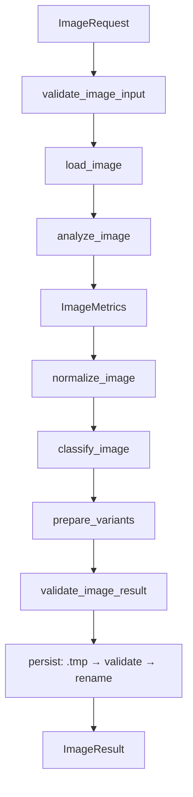

# Subplan — procesador-image

## 1. Objective

Implement `procesador-image` (module `docflow.image`, physical path `src/docflow/image/`) as a single-responsibility processor whose only job is to **analyze, normalize and technically prepare images** for downstream processors. It turns one `ImageRequest` into one `ImageResult` by validating the input, computing technical metrics without mutating the source, producing a `normalized.png` plus optional `ocr_ready.png` and `vlm_ready.png` variants, classifying the image technically, validating the outputs, and atomically publishing everything inside the `image/` artifact namespace together with a `metadata.json`. The image engine (OpenCV or Pillow) is encapsulated in `image/primitives/`. This processor is built standalone in Phase 1: it imports no other processor and makes no workflow decisions.

## 2. Context (BA)

**Responsibility.** `procesador-image` receives an image that has already been handed to it (a direct image, a PDF-rendered page, a previously extracted embedded image, or an explicit crop) and returns its technical analysis plus prepared variants. Its scope begins at `ImageRequest` and ends at `ImageResult`.

**Does NOT:**
- process PDFs (no splitting, no rendering, no page extraction);
- run OCR;
- call any LLM/VLM;
- select the document source (`NATIVE_TEXT` / `OCR_TEXT` / `IMAGE`);
- decide whether OCR or VLM is needed;
- decide which variant is used downstream;
- coordinate the workflow, or manage `skip`/`force`/`reuse`/`resume` (that belongs to the orchestrator's `StageExecution`);
- modify the input image in place — the input is immutable.

**Principle line.** It answers **“Given this image and this technical configuration, how can I analyze it and prepare it for later processing?”** — **not** “What should I do next with this image?” and **not** “Should I run OCR or VLM?”. Crucially, it never assumes the OCR-optimal image equals the VLM-optimal image: OCR may benefit from grayscale, deskew, binarization and high contrast, while a VLM must preserve color, layout and visual context.

## 3. Design (SA)

### Contract types

**Input — `ImageRequest`**

| Field | Type | Notes |
|---|---|---|
| `image_path` | `Path` | Existing source image; treated as immutable |
| `output_dir` | `Path` | Root for the `image/` namespace |
| `options` | `ImageOptions` | Normalized flags, e.g. `normalize`, `prepare_for_ocr`, `prepare_for_vlm`, `correct_orientation`, `deskew` |
| `context` | `ImageContext` | `document_id`, `page_number`, `workflow_run_id` — for correlation/tracing only, never workflow state |

**Output — `ImageResult`**

| Field | Type | Notes |
|---|---|---|
| `source` | `ImageSourceRef` | Reference to the original input |
| `normalized` | `ArtifactRef` | `image/normalized.png` |
| `variants` | `ImageVariants` | Optional `ocr_ready`, `vlm_ready` refs |
| `metrics` | `ImageMetrics` | Input + output metrics |
| `classification` | `ImageClassification` | `TEXT_IMAGE` / `VISUAL_IMAGE` / `MIXED_IMAGE` / `LOW_QUALITY` |
| `transformations` | `list[str]` | Every transformation actually applied |
| `validation` | `ImageValidation` | `VALID` / `LOW_QUALITY` / `INVALID_OUTPUT` / `UNSUPPORTED` / `ERROR` |
| `artifacts` | `list[ArtifactRef]` | All files produced |
| `metadata` | `ImageMetadata` | Version, libraries, input/output metrics, timing, context |
| `status` | `str` | `"success"` on the happy path; a typed `ImageError` otherwise |

**Supporting types.** `ImageMetrics` (`dimensions`, `resolution`, `format`, `size`, `quality{blur, sharpness, contrast, brightness, noise}`, `orientation`, `skew`, `text_regions[]`, `text_coverage`); `ImageError` (`type`, `message`, `recoverable`, `metadata`) with error kinds `INVALID_INPUT`, `UNSUPPORTED_FORMAT`, `DECODE_ERROR`, `TRANSFORMATION_ERROR`, `WRITE_ERROR`, `IO_ERROR`, `INTERNAL_ERROR`.

### Artifact namespace

The processor writes **only** inside `image/` and never touches `source/`, `render/`, `native_text/`, `ocr/`, or `llm/`:

```
image/
├── normalized.png
├── ocr_ready.png      # optional
├── vlm_ready.png      # optional
├── regions/           # optional, explicit crops only
└── metadata.json
```

Publication is atomic: write to `image/.tmp/`, validate, then rename into place — a partially written artifact is never visible as valid.

### Internal flow



### Primitives

Low-level functions that encapsulate the image library; none knows the document workflow and none decides OCR/VLM:

- **Load/store:** `load_image`, `save_image`, `get_image_metadata`, `get_image_dimensions`
- **Convert:** `convert_image_format`, `resize_image`, `compress_image`, `convert_to_grayscale`
- **Enhance:** `normalize_contrast`, `normalize_brightness`, `denoise_image`, `sharpen_image`, `binarize_image`
- **Quality:** `calculate_blur_score`, `calculate_sharpness_score`, `calculate_contrast_score`, `calculate_brightness_score`, `calculate_noise_score`
- **Orientation:** `detect_orientation`, `detect_skew_angle`, `rotate_image`, `deskew_image`
- **Visual analysis:** `detect_text_regions`, `calculate_text_coverage`, `crop_region`

### Engine encapsulation

The image engine is **OpenCV** (Pillow as the documented alternative), as the idea's
§"Implementaciones reemplazables" fixes. All engine access lives inside
`image/primitives/`; no other processor, and never the orchestrator, touches the engine
directly. The processor's public contract (`ImageRequest → procesador-image →
ImageResult`) is engine-agnostic: replacing OpenCV with Pillow changes only `primitives/`,
never the contract or the workflow. No engine is silently substituted.

### Determinism class

**Deterministic** — a pure function of (input bytes + normalized options + processor version + library versions): the same image, configuration and versions yield the same logical transformations. The processor normalizes options, applies only transformations justified by metrics + explicit configuration, records every transformation, keeps stable file names/formats, and stamps processor and library versions into `metadata.json`. It favors reproducibility but does not own global idempotency (that is the orchestrator's `processing_key`).

### Error-handling posture

Errors are classified technically into a typed `ImageError` with a `recoverable` flag and returned in the result — the processor never throws across the contract where a typed result is expected, and it never substitutes a silent stand-in (empty path, `0`, `[]`, default engine). Validation reports `VALID` / `LOW_QUALITY` / `INVALID_OUTPUT` / `UNSUPPORTED` / `ERROR` as *descriptive* states only; it never converts them into workflow actions. Atomic persistence guarantees a failed run leaves no partially valid artifact.

## 4. Execution plan (PM)

### WBS

| ID | Task | Effort | Depends on |
|---|---|---|---|
| IMG-01 | Define contract dataclasses: `ImageRequest`, `ImageResult`, `ImageMetrics`, `ImageOptions`, `ImageClassification`, `ImageValidation`, `ImageError` (no defaults on required fields) | S | — |
| IMG-02 | Implement the image-ops primitives skeleton in `image/primitives/` (OpenCV, Pillow fallback) | M | IMG-01 |
| IMG-03 | Implement load/store primitives (`load_image`, `save_image`, `get_image_metadata`, `get_image_dimensions`) | S | IMG-02 |
| IMG-04 | Implement analysis primitives (blur, sharpness, contrast, brightness, noise, orientation, skew, text regions/coverage) | M | IMG-03 |
| IMG-05 | Implement transformation primitives (rotate, deskew, resize, grayscale, binarize, denoise, sharpen, contrast/brightness, format conversion/compression) | M | IMG-03 |
| IMG-06 | Implement `analyze_image` → `ImageMetrics` (side-effect-free) | S | IMG-04 |
| IMG-07 | Implement `normalize_image` + `prepare_normalized_image` | M | IMG-05, IMG-06 |
| IMG-08 | Implement `prepare_image_for_ocr` and `prepare_image_for_vlm` (distinct pipelines) | M | IMG-05 |
| IMG-09 | Implement `classify_image` (`TEXT_IMAGE` / `VISUAL_IMAGE` / `MIXED_IMAGE` / `LOW_QUALITY`) | S | IMG-06 |
| IMG-10 | Implement `validate_image_result` + typed `ImageError` classification | S | IMG-06 |
| IMG-11 | Implement atomic persistence (`.tmp` → validate → rename) and `metadata.json` generation | M | IMG-07, IMG-08, IMG-10 |
| IMG-12 | Implement `process_image` entry point wiring the full flow | M | IMG-11 |
| IMG-13 | Write happy-path + invariant tests; record mutation-falsification evidence | M | IMG-12 |
| IMG-14 | Run the four QA gates clean | S | IMG-13 |

### Order / waves

- **Wave 1 — Contracts & seam:** IMG-01 → IMG-02 → IMG-03.
- **Wave 2 — Analysis:** IMG-04 ∥ IMG-05 (parallel after IMG-03) → IMG-06.
- **Wave 3 — Outputs:** IMG-07, IMG-08 (parallel) and IMG-09, IMG-10 (parallel after IMG-06).
- **Wave 4 — Publish:** IMG-11 → IMG-12.
- **Wave 5 — Verify:** IMG-13 → IMG-14.

## 5. Acceptance criteria

```gherkin
Scenario: Normalize a valid color input
  Given a valid PNG at "render/page.png" and an ImageRequest with normalize=true
  When process_image runs
  Then "image/normalized.png" exists, "image/metadata.json" is valid,
    status is "success", and transformations list every applied operation

Scenario: Prepare independent OCR and VLM variants
  Given a skewed color document image and an ImageRequest with
    prepare_for_ocr=true and prepare_for_vlm=true
  When process_image runs
  Then "image/ocr_ready.png" and "image/vlm_ready.png" are two distinct files,
    the OCR variant may be grayscale/deskewed/binarized, and
    the VLM variant preserves color channels and layout

Scenario: Reject an invalid input with a typed error
  Given a corrupt or unsupported file at "image_path"
  When process_image runs
  Then the result carries an ImageError with type DECODE_ERROR or UNSUPPORTED_FORMAT
    and recoverable=false, and no partial artifact is published under "image/"

Scenario: Leave the source untouched
  Given any valid input whose bytes are hashed before processing
  When process_image runs
  Then the input file hash is unchanged and all outputs live under "image/"
```

## 6. Test plan

**Happy-path test.** One test proves `ImageRequest → ImageResult` end-to-end using **real bytes from a small committed fixture**: `normalized.png` exists, `metadata.json` is parseable and contains processor/library versions and the recorded transformations, `status == "success"`, and `classification` is one of the four defined values.

**Invariant tests (each with the mutation that must break it):**

1. **Input immutability** — the source file hash is identical before and after processing. *Mutation that breaks it:* make `save_image` write to `image_path` itself (overwrite in place); the test then observes a changed input hash/mtime.
2. **OCR variant ≠ VLM variant** — `ocr_ready` and `vlm_ready` are independent files, and the VLM variant preserves color channels while the OCR variant may be grayscale/deskewed. *Mutation that breaks it:* make `prepare_image_for_vlm` alias/return the `ocr_ready` path; the test then observes identical paths or lost color.
3. **Namespace ownership** — every produced artifact (including `metadata.json`) resolves under the `image/` namespace and nothing is written to `source/`, `render/`, `native_text/`, `ocr/` or `llm/`. *Mutation that breaks it:* redirect `metadata.json` to the parent page directory; the test then finds a file outside `image/`.

**Fixtures needed** (committed under `fixtures/image/`, named for the failure they provoke): `color_layout.png` (VLM variant keeps color), `skewed_text.png` (deskew/OCR pipeline), `embedded_logo.png` (embedded-image input), `corrupt.png` (decode error path).

## 7. Definition of Ready / Definition of Done

**Definition of Ready**
- `ImageRequest` / `ImageResult` / `ImageMetrics` / `ImageError` fields are ratified against `docs/idea/procesador-image.md` and `docs/idea/readme.md`.
- The image-ops primitives skeleton and the OpenCV-vs-Pillow choice are recorded (decision below).
- The artifact namespace `image/` and atomic-publication rule are agreed.
- Fixtures for the happy path and the three invariants exist.

**Definition of Done**
- `process_image` maps `ImageRequest → ImageResult` with no import of any other processor module and no workflow decision inside the processor.
- Input image is immutable; outputs are published atomically under `image/` only.
- OCR and VLM variants are produced independently (never assumed equal).
- All shortcuts carry explicit `# TODO: [MVP]` or `# TODO: [RELEASE]` tags.
- Each invariant test is proven to fail under its documented mutation, then restored green.
- The four QA gates all pass:
  - `pytest`
  - `ruff check .`
  - `ruff format --check .`
  - `pylint src tests`

## 8. Risks & mitigations

| Risk | Impact | Mitigation |
|---|---|---|
| OpenCV/Pillow version drift changes metric values (blur, sharpness, noise) | Silent output differences downstream | Pin versions; stamp processor + library versions in `metadata.json`; deterministic thresholds |
| Over-eager enhancement degrades information (e.g. binarization destroying color) | Wrong OCR/VLM inputs | Apply transformations only when justified by metrics + explicit options; record every transformation |
| Assuming OCR image == VLM image | VLM loses color/layout context | Enforce independent `prepare_image_for_ocr` / `prepare_image_for_vlm` pipelines; invariant test guards it |
| Partially written artifact seen as valid by the orchestrator | Reused corrupt outputs | Atomic publish (`.tmp` → validate → rename) |
| Scope creep into a full image-processing library | Over-engineering in PoC | Happy path only; tag shortcuts; primitives keep OpenCV/Pillow swappable |
| No labelled golden set to judge "legibility" | Cannot prove quality objectively | Use technical thresholds + mutation-falsified invariants; defer golden set per general plan |

## 9. Out of scope & resolved decisions

**Out of scope (this subplan / Phase 1)**
- PDF splitting, rendering and page extraction (owned by `procesador-pdf`).
- OCR execution and LLM/VLM inference.
- Source selection, skip/force/reuse/resume, and `processing_key` computation (owned by the orchestrator).
- Automatic region selection for OCR or LLM; only *explicitly requested* crops are produced.
- Multi-document corpus batching and distributed execution.
- Labelled golden-set quality scoring (deferred per the general plan).

**Resolved decisions**
1. **Image-ops engine — RESOLVED: OpenCV** (Pillow as fallback), per the idea's
   §"Implementaciones reemplazables"; encapsulated in `image/primitives/`.
2. **Primary engine — RESOLVED:** OpenCV first, Pillow as the drop-in alternative behind
   the same contract.
3. **Module vs. sub-package — RESOLVED:** sub-package `image/` with
   `primitives/` / `utils/` / `helpers/`, per the idea's §"Estructura del proyecto".
4. **Metric thresholds — RESOLVED for PoC.** Concrete numeric thresholds for
   `LOW_QUALITY` classification and OCR binarization are explicit constants marked
   `# TODO: [MVP]`; their exact values are fixed when IMG-06/IMG-08 start.
5. **Naming mapping — RESOLVED:** code uses `docflow.image` (path `src/docflow/image/`) with the entry points the
   idea names (`process_image`, `process_image_from_page`); the Spanish `procesador-image`
   remains only as the idea document's title.
