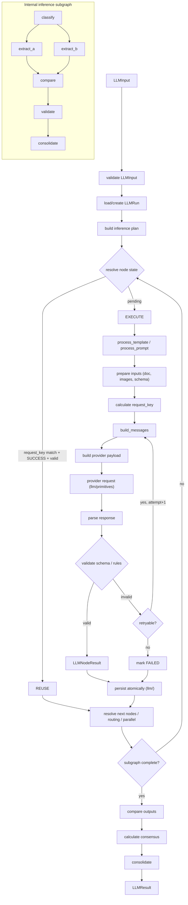

# Subplan — procesador-llm-call

## 1. Objective

Implement `procesador-llm-call` (module `docflow.llm`, physical path `src/docflow/llm/`) as an independently
usable processor whose single responsibility is to **prepare, execute, validate, persist
and coordinate calls to LLM/VLM models**. It consumes an already-defined inference task
(`LLMInput`) and returns a structured, validated, traceable result (`LLMResult`), running
either one call, multiple sequential or parallel calls, or an internal inference subgraph
(`classify → extract_a/extract_b → compare → validate → consolidate`) with retries,
comparison, consensus, consolidation, and resume of a partially-executed subgraph without
repeating valid, costly calls.

## 2. Context (BA)

### Responsibility

`procesador-llm-call` owns everything that happens **inside** a single LLM stage that the
documental orchestrator has already decided to run. It receives a fully-resolved inference
task and is accountable for how that inference is executed internally: templates, prompts,
provider calls, parsing, schema validation, internal retries, the internal inference graph,
per-node idempotency, resume/stop/skip/force of LLM nodes, comparison, consensus, usage and
inference traceability.

### Does NOT

- decide which document to process;
- decide whether OCR runs;
- decide which documental source is used (`native_text` vs `OCR` vs `IMAGE` vs combinations);
- decide whether a page needs vision, or whether an image should be attached;
- decide the documental workflow order, or skip/force another processor;
- consolidate pages or the document;
- re-run OCR, image processing, or PDF extraction as a fallback.

### Principle line

It answers **"Given an already-defined LLM task, how do I run its inference in a
structured, validated, traceable and resumable way?"** — not **"what should I do with this
document or page?"**.

## 3. Design (SA)

### Contract types

```text
LLMInput
├── task: str
├── provider: str
├── model: str
├── template: str
├── document: str | None
├── images: list[str]
├── extra_context: dict[str, Any]
├── schema: str | None
├── options: dict[str, Any]
├── graph: dict[str, Any] | None
└── metadata: dict[str, Any]
```

```text
LLMResult
├── run_id: str
├── task: str
├── provider: str
├── model: str
├── graph_id: str | None
├── node_results: dict[str, LLMNodeResult]
├── raw_response: str | None
├── parsed_response: Any
├── schema_valid: bool
├── validation_errors: list[str]
├── attempts: list[LLMAttempt]
├── comparisons: dict[str, ComparisonResult]
├── usage: Usage
├── timing: Timing
├── status: str
└── metadata: dict[str, Any]
```

```text
LLMNodeResult
├── node_id: str
├── request_key: str
├── status: str
├── result: Any
├── attempts: list[LLMAttempt]
├── validation: dict[str, Any]
├── usage: Usage
├── timing: Timing
└── metadata: dict[str, Any]
```

```text
LLMGraphState
├── run_id: str
├── graph_id: str
├── graph_version: str
├── status: str
├── current_nodes: list[str]
├── node_states: dict[str, str]
├── node_results: dict[str, LLMNodeResult]
├── attempts: dict[str, list[LLMAttempt]]
├── comparisons: dict[str, ComparisonResult]
├── errors: list[str]
├── usage: Usage
├── stop_requested: bool
└── final_result: LLMResult | None
```

### Artifact namespace

All persistence lives under the processor-owned namespace **`llm/`**, e.g.:

```text
llm/
└── run_001/
    ├── state.json
    ├── graph.json
    ├── classify/{result.json, metadata.json, attempts/}
    ├── extract_a/{...}
    ├── extract_b/{...}
    ├── compare/{...}
    └── final_result.json
```

Outputs are published atomically: write to `*.tmp`, validate, then rename to the final
name. `LLMGraphState` is internal to this module and never replaces the orchestrator's
`DocumentContext` / `PageContext` / `StageExecution`.

### Internal flow (including the inference subgraph)



### Two-level orchestration separation

| Level | Owner | Decides |
|---|---|---|
| Documental stage | `procesador-orquestador` | whether the LLM stage runs at all: `EXECUTE` / `REUSE` / `SKIP` / `FORCE` / `INVALIDATE` |
| Inference subgraph | `procesador-llm-call` | how the stage's internals run: `classify → extract_a/extract_b → compare → validate → consolidate`, per-node `EXECUTE` / `REUSE` / `SKIP` / `FORCE` / `RETRY` / `INVALIDATE` |

The orchestrator owns the LLM stage as a whole; this processor owns only what happens
inside that stage. The interface is `LLMInput → LLMResult` and remains explicit: a node
`FORCE` never becomes a decision about OCR, PDF or images.

### request_key formula

```text
request_key =
    hash(
        provider
        + model
        + model_version
        + rendered_prompt
        + input_hashes            # document text + image bytes, hashed
        + schema_hash
        + normalized_options      # canonical, order-stable serialization of options
    )
```

The same logical request always yields the same `request_key`; `run_id`, `graph_id`,
`node_id` and `attempt_id` are deliberately **excluded** so that a retry or a restart does
not change the key.

### Internal idempotency rule

> **A valid LLM call is not re-run just because the graph was restarted.**

A node result is reused when, and only when:

```text
request_key matches
AND status == SUCCESS
AND the persisted result is valid (schema + artifact present)
```

A node is re-executed only when there is no result, the result is invalid, inputs changed,
the prompt changed, the schema changed, the model changed, the options changed, the node
was invalidated downstream, or an explicit `FORCE` was requested. In every other case:
`REUSE`.

### Provider encapsulation

Provider engines live inside `llm/primitives/`, with primitive wrappers for:

- **Ollama** (local);
- **vLLM** (OpenAI-compatible local);
- **hosted OpenAI-compatible API**.

No other processor, and never the orchestrator, reaches a provider directly, and the
processor never imports another processor's module. The primitives expose the minimal
surface needed: `generate_text`, `generate_multimodal`, `generate_structured`,
`list_models`, `check_model_available`, `get_context_window`. Providers are swappable
behind the `LLMInput → LLMResult` contract — a different provider changes only
`llm/primitives/`, never the contract or the workflow.

### Error-handling posture

Errors are classified, never swallowed: `PROVIDER_ERROR`, `TIMEOUT`, `MODEL_UNAVAILABLE`,
`CONTEXT_OVERFLOW`, `INVALID_RESPONSE`, `INVALID_JSON`, `SCHEMA_ERROR`, `DEPENDENCY_ERROR`,
`INTERNAL_ERROR`. Each is marked `RETRYABLE` or `NON_RETRYABLE`. A failed node is reported
as a typed result (`FAILED` + errors), not propagated as an exception that corrupts the
graph; a retry always preserves prior attempts (`LLMAttempt` history). Documental fallbacks
(e.g. "LLM failed → run OCR") are out of scope — the orchestrator owns that decision.

## 4. Execution plan (PM)

### WBS

| ID | Task | Effort | Depends on |
|---|---|---|---|
| LLM-01 | Contract dataclasses: `LLMInput`, `LLMResult`, `LLMNodeResult`, `LLMGraphState`, `LLMAttempt`, `ComparisonResult`, `Usage`, `Timing`, stage-state enums | S | — |
| LLM-02 | Provider primitive interface + `LLMProvider` result/error types (in `llm/primitives/`) | S | LLM-01 |
| LLM-03 | In-memory fake provider implementing the primitive interface + committed template/schema fixtures | S | LLM-02 |
| LLM-04 | Template render & prompt build: variable injection, `<doc>`/`<extra>`/`<schema>` resolution, sanitize | M | LLM-01 |
| LLM-05 | `calculate_request_key` + idempotency helpers (`find_reusable_node_result`, `is_node_reusable`, `validate_cached_result`) | M | LLM-01 |
| LLM-06 | `process_llm_request` single-call happy path (template → prompt → key → payload → call → parse → validate) | M | LLM-03, LLM-04, LLM-05 |
| LLM-07 | Parse + schema validation (`load_schema`, `validate_schema`, `parse_json_response`, `validate_llm_result`) | M | LLM-06 |
| LLM-08 | Retry + attempt history (`retry_llm_request`, `should_retry`, `increment_attempt`) | M | LLM-07 |
| LLM-09 | Provider primitives: Ollama local + OpenAI-compatible (`# TODO: [MVP]` real transport) | L | LLM-02 |
| LLM-10 | Node execution: `process_llm_node`, node-state transitions, `claim_node` atomic `READY→RUNNING` | M | LLM-06 |
| LLM-11 | Graph persistence in `llm/` namespace, atomic writes, load/save of `LLMGraphState` | L | LLM-01 |
| LLM-12 | `execute_llm_graph`: dependencies, routing, parallel branches, subgraph lifecycle | L | LLM-10, LLM-11 |
| LLM-13 | Resume / stop / skip / force: `resume_llm_graph`, `request_graph_stop`, `invalidate_downstream_nodes` | L | LLM-12 |
| LLM-14 | Comparison / consensus / consolidate: `compare_outputs`, `calculate_consensus` | M | LLM-12 |
| LLM-15 | Usage, timing and context-window control (`count_tokens`, `truncate_to_token_limit`, `is_context_limit_exceeded`) | M | LLM-06 |

### Waves

- **Wave 1 (contracts & primitives):** LLM-01 → LLM-02 → LLM-03; LLM-04 and LLM-05 depend only on LLM-01 and run in parallel with the provider seam (LLM-02/LLM-03).
- **Wave 2 (single call):** LLM-06 → LLM-07 → LLM-08; LLM-09 in parallel after LLM-02; LLM-15 also starts here (its only predecessor is LLM-06).
- **Wave 3 (internal graph):** LLM-10, LLM-11 → LLM-12 → LLM-13; LLM-14 after LLM-12. LLM-15 is completed in Wave 2 by its declared dependency.

Each wave ends with the four QA gates green and its happy-path/invariant tests passing.

## 5. Acceptance criteria

```gherkin
Scenario: Single call produces a validated result
  Given a valid LLMInput with a template, schema and fake provider
  When process_llm_request is invoked
  Then it returns an LLMResult with status SUCCESS, schema_valid true,
    a non-empty request_key, and one attempt recorded with usage and timing

Scenario: Restart reuses valid nodes and re-runs only pending ones
  Given a partially-executed graph state where classify and extract_a are SUCCESS
    and extract_b is FAILED
  When resume_llm_graph is invoked with the same run_id and inputs
  Then classify and extract_a are marked REUSED without new provider calls,
    and extract_b, compare, validate, consolidate are EXECUTED

Scenario: Forcing a node invalidates its downstream dependents
  Given a completed graph where all nodes are SUCCESS
  When force is requested on extract_b
  Then extract_b is re-executed and compare, validate and consolidate
    transition to INVALIDATED and re-run

Scenario: A retryable invalid response is retried and prior attempts are kept
  Given the fake provider returns invalid JSON on attempt 1 and valid JSON on attempt 2
  When process_llm_request is invoked
  Then the result is SUCCESS, the attempt history contains both attempts,
    and the attempt ids differ while the request_key stays identical
```

## 6. Test plan

### Happy-path test

`LLMInput → process_llm_request → LLMResult` round-trip using the fake provider and the
committed template/schema fixtures: the prompt is rendered, `request_key` is stable, the
fake provider is called once, JSON is parsed, schema validation passes, and the result
reports `status == "SUCCESS"`, `schema_valid == true`, non-empty `usage` and `timing`.

### Invariant tests (each must fail when the invariant is broken)

1. **No re-execution of a valid call on restart.**
   *Invariant:* a `SUCCESS` node with a matching `request_key` and a valid persisted result
   is reused, never re-called.
   *Mutation that breaks it:* make `is_node_reusable` always return `False` (or drop the
   `status == SUCCESS` check), so the resume path re-invokes the provider for already-succeeded
   nodes — the test then observes the fake provider called again for `classify`.

2. **`request_key` determinism and independence from run identity.**
   *Invariant:* identical logical inputs (same provider/model/prompt/inputs/schema/options)
   produce the same `request_key` regardless of `run_id` / `node_id` / `attempt_id`.
   *Mutation that breaks it:* add `run_id` (or a nonce/timestamp) to the hash input — the
   test then gets different keys for two calls that differ only in `run_id`.

3. **Downstream invalidation on force.**
   *Invariant:* forcing an upstream node invalidates all its transitive dependents
   (`extract_b → compare → validate → consolidate`).
   *Mutation that breaks it:* remove the `invalidate_downstream_nodes` call from the force
   path — after forcing `extract_b`, `compare`/`validate`/`consolidate` remain `SUCCESS` and
   the test fails.

### Fixtures needed

- A prompt template fixture (`fixtures/llm/template/simple_extract.md`) with `<doc>`,
  `<extra>` and `<schema>` placeholders, used verbatim by the happy-path and invariant tests.
- A JSON schema fixture (`fixtures/llm/schema/simple.schema.json`) exercising required
  fields and types.
- A fake provider (in-memory) that returns deterministic valid JSON and can be
  scripted to return invalid JSON / raise timeouts for retry tests, with a call counter to
  prove reuse (invariant 1) and attempt tracking (invariant 2 / retry scenario).

### Why this processor keeps a scripted fake — deliberately

`LLM-03` stays a **scripted fake** and does **not** migrate to record/replay: LLM responses
are not deterministic for a fixed input, and `LLM-08` needs a scripted *sequence* (invalid
JSON on attempt 1, valid on attempt 2), which a recording of one real call cannot express.
Record/replay applies to `pdf`, `image` and `ocr` only (`README.md` §9.7). Unifying the two
patterns later would be a mistake; this line exists so nobody tries.

## 7. Definition of Ready / Definition of Done

### Definition of Ready

- `LLMInput`, `LLMResult`, `LLMNodeResult` and `LLMGraphState` field lists are fixed per §3.
- The `request_key` formula and the reuse rule (`request_key + SUCCESS + valid persisted
  result → REUSE`) are written down and agreed.
- A fake provider fixture and at least one template + schema fixture are committed.
- The subgraph shape (`classify → extract_a/extract_b → compare → validate → consolidate`)
  and the two-level separation are agreed with the orchestrator owner.
- All decisions in §9 are resolved.

### Definition of Done

- `docflow.llm` implements the single call and the internal subgraph with providers
  reached only through `llm/primitives/`; no import of another processor; no domain noun in any API.
- Every shortcut carries an explicit `# TODO: [MVP]` (real provider transport, real
  persistence) or `# TODO: [RELEASE]` (telemetry, HA, caching).
- The happy-path test and the three invariant tests in §6 pass, and each invariant test has
  been proven to fail under its documented mutation, then restored green.
- Artifacts are persisted atomically (`*.tmp` → validate → rename) under `llm/`.
- The four QA gates all pass:

```bash
pytest
ruff check .
ruff format --check .
pylint src tests
```

## 8. Risks & mitigations

| Risk | Impact | Mitigation |
|---|---|---|
| Repeating expensive LLM calls on restart | Cost, latency | `request_key` + reuse rule; invariant test 1 proves no re-call; persisted `SUCCESS` artifacts |
| Race condition: two workers run the same node | Double cost, conflicting results | Atomic `claim_node` `READY→RUNNING` transition; only one owner per `run_id` |
| Silent invalid output reported as correct | Wrong result marked valid | Mandatory structural/schema validation; failed nodes reported as typed `FAILED`, never swallowed |
| Provider/model drift (Ollama, vLLM, hosted API) | Silent output differences | Provider + model + model_version in `request_key`; usage/timing recorded per attempt |
| Context overflow / truncated prompt | Degraded extraction | Explicit `count_tokens` / `truncate_to_token_limit` with metadata, never silent truncation |
| Scope creep into a full workflow engine | Over-engineering in PoC | Happy path first; orchestrator owns documental decisions; `# TODO` tags mark deferrals |

## 9. Out of scope & resolved decisions

### Out of scope

- Documental workflow, source selection (`native_text` vs `OCR` vs `IMAGE`), OCR/VLM
  routing, page consolidation — owned by `procesador-orquestador`.
- Multi-document batching and distributed execution.
- Real GPU-competition policy and production retry queues (`# TODO: [RELEASE]`).
- Domain-specific extraction rules; prompts and schemas are data assets, not code.
- Observability/telemetry beyond per-attempt `usage`/`timing` records.

### Resolved decisions

1. **Graph language — RESOLVED:** a small declarative descriptor (`graph: {nodes,
   depends_on}` in `LLMInput`), per the idea's §"Grafo LLM" (the subgraph shape is data,
   not code).
2. **Parallelism mechanism — RESOLVED for PoC:** run `extract_a`/`extract_b` sequentially
   first, tagged `# TODO: [MVP]`; true concurrency is deferred.
3. **Concrete first provider — RESOLVED:** Ollama (local, zero external cost) first, with
   a scripted fake for tests; the idea's §"Implementaciones reemplazables" lists Ollama /
   vLLM / API as interchangeable behind the contract.
4. **Persistence backend — RESOLVED for PoC:** in-memory dict + JSON files under `llm/`
   (`# TODO: [MVP]`); no schema/DB introduced in Phase 1.
5. **`model_version` source — RESOLVED:** from the provider's `get_model_info` when
   available, else `LLMInput.metadata`; it is part of `request_key` either way.
