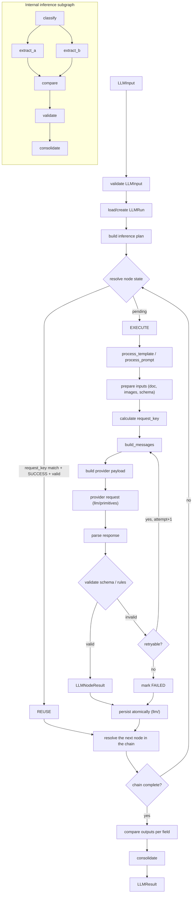

# Subplan — procesador-llm-call

## 1. Objective

Implement `procesador-llm-call` (module `docflow.llm`, physical path `src/docflow/llm/`) as an independently
usable processor whose single responsibility is to **prepare, execute, validate, persist
and coordinate calls to LLM/VLM models**. It consumes an already-defined inference task
(`LLMInput`) and returns a structured, validated, traceable result (`LLMResult`), running
either one call, multiple sequential or parallel calls, or an internal inference subgraph
(`classify → extract_a/extract_b → compare → validate → consolidate`) with retries,
comparison, consensus, consolidation, and resume of a partially-executed subgraph without
repeating valid, costly calls.

## 2. Context (BA)

### Responsibility

`procesador-llm-call` owns everything that happens **inside** a single LLM stage that the
documental orchestrator has already decided to run. It receives a fully-resolved inference
task and is accountable for how that inference is executed internally: templates, prompts,
provider calls, parsing, schema validation, internal retries, the internal inference graph,
per-node idempotency, resume/stop/skip/force of LLM nodes, comparison, consensus, usage and
inference traceability.

### Does NOT

- decide which document to process;
- decide whether OCR runs;
- decide which documental source is used (`native_text` vs `OCR` vs `IMAGE` vs combinations);
- decide whether a page needs vision, or whether an image should be attached;
- decide the documental workflow order, or skip/force another processor;
- consolidate pages or the document;
- re-run OCR, image processing, or PDF extraction as a fallback.

### Principle line

It answers **"Given an already-defined LLM task, how do I run its inference in a
structured, validated, traceable and resumable way?"** — not **"what should I do with this
document or page?"**.

## 3. Design (SA)

### Contract types

```text
LLMInput
├── task: str
├── provider: str
├── model: str
├── template: str
├── document: str | None
├── images: list[str]
├── extra_context: dict[str, Any]
├── schema: str | None
├── options: dict[str, Any]
├── graph: dict[str, Any] | None
└── metadata: dict[str, Any]
```

`document` and `images` are a **resolved payload, not a choice**: the caller states which it sent,
and the four shapes are text alone, pixels alone, both, and neither. The code answers each one
honestly, and that is what this contract freezes: a template that carries `<doc>` with a request
that carries no document fails with a typed `DEPENDENCY_ERROR` ("the template asks for a document
and the request carries none"); an absent document is not an empty one (`document=""` renders the
placeholder empty, `None` does not render it at all); and a template that reads pixels carries no
`<doc>`, so it renders with no document because the placeholder is not there to fill. An image is a
*path*, read once and base64-encoded at the seam, and its **bytes** — not its name — are what
`input_hashes` hashes. Deciding the shape is `ORC-13`'s (`src/docflow/workflow/llm_input.py`, the
`ExtractionStrategy` vocabulary); this processor never widens or narrows it.

Three `metadata` keys are part of the request rather than correlation, and none of them has a
default: `assets_dir` (the root `template` and `schema` resolve against — a template that silently
resolved against a working directory would make one request mean two things), `output_dir` (`None`
writes nothing) and `run_id` (pinned, or minted). `image_tokens` is a fourth, added by the second
pass of 2026-10-04: the token cost of *one* image, as the caller measured it, used by the
pre-flight below and never invented here.

**The option classes.** `options` is not one kind of thing, and which kind a key belongs to decides
whether it reaches the provider and whether it belongs to `request_key` (the canonical serialization
in the formula below):

| Class | Keys | Reaches the provider | In `request_key` |
|---|---|---|---|
| Transport | `api_key` | no | no — a credential |
| | `timeout`, `max_attempts` | no | yes (open: §9 decision 10) |
| Request-level | `think`, `keep_alive` | only to Ollama, lifted to the top of its body; dropped for a hosted dialect | yes — `think` changes the answer |
| Decoding | everything else (`temperature`, `min_p`, `num_ctx`, …) | yes, inside the body's own options; a hosted dialect drops `num_ctx` and keeps the sampling parameters | yes |
| Read here, also sent | `context_window` | yes, translated by the transport (§9 decision 7) | yes |
| Read here, never sent | `max_prompt_tokens` | no | yes — it changes the prompt |
| Read here, excluded | `stream` | yes, as the call's own field | no — a streamed answer is the same answer |

```text
LLMResult
├── run_id: str
├── task: str
├── provider: str
├── model: str
├── graph_id: str | None
├── node_results: dict[str, LLMNodeResult]
├── raw_response: str | None
├── parsed_response: Any
├── schema_valid: bool
├── validation_errors: list[str]
├── attempts: list[LLMAttempt]
├── comparisons: dict[str, ComparisonResult]
├── usage: Usage
├── timing: Timing
├── status: str
└── metadata: dict[str, Any]
```

```text
LLMNodeResult
├── node_id: str
├── request_key: str
├── status: str
├── result: Any
├── attempts: list[LLMAttempt]
├── validation: dict[str, Any]
├── usage: Usage
├── timing: Timing
└── metadata: dict[str, Any]
```

```text
LLMGraphState
├── run_id: str
├── graph_id: str
├── graph_version: str
├── status: str
├── current_nodes: list[str]
├── node_states: dict[str, str]
├── node_results: dict[str, LLMNodeResult]
├── attempts: dict[str, list[LLMAttempt]]
├── comparisons: dict[str, ComparisonResult]
├── errors: list[str]
├── usage: Usage
├── stop_requested: bool
└── final_result: LLMResult | None
```

### Artifact namespace

All persistence lives under the processor-owned namespace **`llm/`**, e.g.:

```text
llm/
└── run_001/
    ├── state.json            # the graph state, one file
    └── final_result.json
```

Outputs are published atomically: write to `*.tmp`, validate, then rename to the final
name. `LLMGraphState` is internal to this module and never replaces the orchestrator's
`DocumentContext` / `PageContext` / `StageExecution`.

The per-node artifact tree (`classify/{result.json, metadata.json, attempts/}`, …) is
deferred with the rest of the dynamic machinery (§9.6): Phase 1 keeps the state in memory
first and persists the two files above, so a run is inspectable without inventing a
directory schema nothing reads yet. `LLMGraphState` keeps the fields that machinery needs
(`current_nodes`, `stop_requested`, per-node `INVALIDATE`); each deferred field is named in
§9.6 rather than left silently empty.

### Internal flow (including the inference subgraph)


```mermaid
flowchart TB
    IN["LLMInput"] --> VAL["validate LLMInput"]
    VAL --> LOAD["load/create LLMRun"]
    LOAD --> PLAN["build inference plan"]
    PLAN --> RESOLVE{"resolve node state"}
    RESOLVE -->|request_key match + SUCCESS + valid| REUSE["REUSE"]
    RESOLVE -->|pending| EXEC["EXECUTE"]
    EXEC --> RENDER["process_template / process_prompt"]
    RENDER --> PREP["prepare inputs (doc, images, schema)"]
    PREP --> KEY["calculate request_key"]
    KEY --> MSG["build_messages"]
    MSG --> PAY["build provider payload"]
    PAY --> CALL["provider request (llm/primitives)"]
    CALL --> PARSE["parse response"]
    PARSE --> CHK{"validate schema / rules"}
    CHK -->|invalid| RETRY{"retryable?"}
    RETRY -->|yes, attempt+1| MSG
    RETRY -->|no| FAIL["mark FAILED"]
    CHK -->|valid| OK["LLMNodeResult"]
    REUSE --> NEXT
    OK --> PERSIST["persist atomically (llm/)"]
    FAIL --> PERSIST
    PERSIST --> NEXT["resolve the next node in the chain"]
    NEXT --> GRAPH{"chain complete?"}
    GRAPH -->|no| RESOLVE
    GRAPH -->|yes| COMPARE["compare outputs per field"]
    COMPARE --> CONSOL["consolidate"]
    CONSOL --> OUT["LLMResult"]

    subgraph SG["Internal inference subgraph"]
        direction TB
        C["classify"] --> EA["extract_a"]
        C --> EB["extract_b"]
        EA --> CM["compare"]
        EB --> CM
        CM --> V["validate"]
        V --> CN["consolidate"]
    end
```

### Two-level orchestration separation

| Level | Owner | Decides |
|---|---|---|
| Documental stage | `procesador-orquestador` | whether the LLM stage runs at all: `EXECUTE` / `REUSE` / `SKIP` / `FORCE` / `INVALIDATE` |
| Inference subgraph | `procesador-llm-call` | how the stage's internals run: `classify → extract_a/extract_b → compare → validate → consolidate`, per-node `EXECUTE` / `REUSE` / `RETRY` |

The orchestrator owns the LLM stage as a whole; this processor owns only what happens
inside that stage. The interface is `LLMInput → LLMResult` and remains explicit: a node
action never becomes a decision about OCR, PDF or images. The other node actions
(`SKIP` / `FORCE` / `INVALIDATE`) belong to the deferred machinery of §9.6 — Phase 1 ships
the three the linear chain needs.

### request_key formula

```text
request_key =
    hash(
        provider
        + model
        + model_version
        + rendered_prompt
        + input_hashes            # document text + image bytes, hashed
        + schema_hash
        + normalized_options      # canonical, order-stable serialization of options
    )
```

The same logical request always yields the same `request_key`; `run_id`, `graph_id`,
`node_id` and `attempt_id` are deliberately **excluded** so that a retry or a restart does
not change the key.

### Internal idempotency rule

> **A valid LLM call is not re-run just because the graph was restarted.**

A node result is reused when, and only when:

```text
request_key matches
AND status == SUCCESS
AND the persisted result is valid (schema + artifact present)
```

A node is re-executed only when there is no result, the result is invalid, inputs changed,
the prompt changed, the schema changed, the model changed or the options changed. In every
other case: `REUSE`. The two remaining reasons — downstream invalidation and an explicit
`FORCE` — arrive with the deferred machinery of §9.6, not before it.

The rule is deliberately the same three lines as the orchestrator's reuse rule
(`subplan-orquestador.md` §3.4) instead of a shared abstraction: at stage level the artifact
validator is a hash check, at node level it is a schema-and-artifact check, and a helper
that unified the two would couple the documental level to the inference level for the sake
of a comparison. Three lines twice is cheaper than that coupling.

### Provider encapsulation

Provider engines live inside `llm/primitives/`, with primitive wrappers for:

- **Ollama** (local);
- **vLLM** (OpenAI-compatible local);
- **hosted OpenAI-compatible API**, named per product — `deepseek` is the first such kind,
  reached at its own documented endpoint (`https://api.deepseek.com`) and needing no `base_url`
  from the caller.

No other processor, and never the orchestrator, reaches a provider directly, and the
processor never imports another processor's module. The primitives expose the minimal
surface needed: `generate_text`, `generate_multimodal`, `generate_structured`,
`list_models`, `check_model_available`, `get_context_window`. Providers are swappable
behind the `LLMInput → LLMResult` contract — a different provider changes only
`llm/primitives/`, never the contract or the workflow.

**Structured output is per dialect, and stated in one place.** A provider that documents no
schema is asked for a bare `{"type": "json_object"}` and the schema travels in the prompt instead:
`process_prompt` inlines it (`inline_schema_block`), so it enters `request_key` through the
existing `rendered_prompt` term — no new key term — and offline `validate_schema` still runs
against the same loaded schema. Every other provider keeps the provider-native `json_schema`
body. `structured_mode(provider)` states which, so a new dialect is one table row and no branch
anywhere else.

**Which of the three carries an image is resolved, not chosen.** A caller does not pick a
generator: `resolve_generator(structured=…, multimodal=…)` states the rule, and a schema outranks
images, so the registry's pixel path — every one of its vision steps declares a schema — runs on
`generate_structured`, which attaches the images whenever the call carries any.
`generate_multimodal` is therefore the text-free, schema-free generator, not "the vision one"; it
exists because the surface would otherwise have a hole, not because a caller selects it.

The provider SDK is imported **inside** the primitive that needs it, never at module import
time: importing `docflow.llm.primitives` must succeed on a machine with no provider
installed (`tests/test_skeleton.py` guards it). The scripted fake of `LLM-03` is injected at
the same seam — the provider primitive the call resolves, replaced with
`monkeypatch.setattr("docflow.llm.primitives.<primitive>", fake_provider)` — and lives at
`tests/fakes/engines/fake_provider.py`, the same home as the engine doubles of `pdf`,
`image` and `ocr`.

### Error-handling posture

Errors are classified, never swallowed: `PROVIDER_ERROR`, `TIMEOUT`, `MODEL_UNAVAILABLE`,
`CONTEXT_OVERFLOW`, `INVALID_RESPONSE`, `INVALID_JSON`, `SCHEMA_ERROR`, `DEPENDENCY_ERROR`,
`INTERNAL_ERROR`. Each is marked `RETRYABLE` or `NON_RETRYABLE`. A failed node is reported
as a typed result (`FAILED` + errors), not propagated as an exception that corrupts the
graph; a retry always preserves prior attempts (`LLMAttempt` history). Documental fallbacks
(e.g. "LLM failed → run OCR") are out of scope — the orchestrator owns that decision.

## 4. Execution plan (PM)

### WBS

| ID | Task | Effort | Depends on |
|---|---|---|---|
| LLM-01 | Contract dataclasses: `LLMInput`, `LLMResult`, `LLMNodeResult`, `LLMGraphState`, `LLMAttempt`, `ComparisonResult`, `Usage`, `Timing`, stage-state enums | S | — |
| LLM-02 | Provider primitive interface + `LLMProvider` result/error types (in `llm/primitives/`) | S | LLM-01 |
| LLM-03 | In-memory fake provider implementing the primitive interface + committed template/schema fixtures | S | LLM-02 |
| LLM-04 | Template render & prompt build: variable injection, `<doc>`/`<extra>`/`<extra:key>`/`<schema>` resolution in a single pass, sanitize; the asset root and the two identifier→path rules (`template/<id>.md`, `schema/<id>.schema.json`); a template that asks for a document no request carries is a typed failure | M | LLM-01 |
| LLM-05 | `calculate_request_key` + idempotency helpers (`find_reusable_node_result`, `is_node_reusable`, `validate_cached_result`) | M | LLM-01 |
| LLM-06 | `process_llm_request` single-call happy path (template → prompt → key → payload → call → parse → validate); the planned call carries the request's `document` and `images` | M | LLM-03, LLM-04, LLM-05 |
| LLM-07 | Parse + schema validation (`load_schema`, `validate_schema`, `parse_json_response`, `validate_llm_result`); the enforced keyword subset is closed and includes `minItems`, which is where a review's completeness is enforced | M | LLM-06 |
| LLM-08 | Retry + attempt history (`retry_llm_request`, `should_retry`, `increment_attempt`) | M | LLM-07 |
| LLM-09 | Provider primitives: Ollama local + OpenAI-compatible (`# TODO: [MVP]` real transport); `resolve_generator` decides which primitive carries an image, and the transport translates the stated window where it can | L | LLM-02 |
| LLM-10 | Node execution: `process_llm_node` + node-state transitions, one node at a time (`claim_node` and multi-worker claims deferred, `# TODO: [MVP]`) | M | LLM-06 |
| LLM-11 | Graph persistence in `llm/`: one `state.json` + `final_result.json`, atomic writes, load/save of `LLMGraphState` (per-node artifact tree deferred, `# TODO: [MVP]`) | L | LLM-01 |
| LLM-12 | `execute_llm_graph` over the fixed linear chain: node order, node reuse, completion detection (routing, parallel branches, subgraph lifecycle deferred, `# TODO: [MVP]`) | L | LLM-10, LLM-11 |
| LLM-13 | Node reuse on restart: a `SUCCESS` node with a matching `request_key` is reused and only the pending nodes run (`request_graph_stop`, `SKIP` / `FORCE` / `INVALIDATE`, `invalidate_downstream_nodes` deferred, `# TODO: [MVP]`) | L | LLM-12 |
| LLM-14 | Per-field comparison and consolidation: `compare_outputs` (`calculate_consensus` deferred, `# TODO: [MVP]`); a per-field vector is compared field by field, never as one score | M | LLM-12 |
| LLM-15 | Usage, timing and context-window control (`count_tokens`, `truncate_to_token_limit`, `is_context_limit_exceeded`, `context_verdict`): the pre-flight counts a stated image cost, never reports a fit it cannot measure, and compares against the window the call asks for | M | LLM-06 |
| LLM-16 | Provider kind `deepseek`: a `PROVIDER_KINDS` row + `DEEPSEEK_BASE_URL` + a per-provider default endpoint, so a hosted call needs no `base_url` | S | LLM-09 |
| LLM-17 | Structured mode per dialect: `STRUCTURED_MODES` + `structured_mode()`; the OpenAI-compatible transport emits `{"type": "json_object"}` for that kind and the provider-native `json_schema` otherwise | S | LLM-16 |
| LLM-18 | Inline the schema for the `json_object` dialect (`inline_schema_block`, applied in `process_prompt`): the schema enters `request_key` through `rendered_prompt`, and offline `validate_schema` still runs | S | LLM-17, LLM-04 |
| LLM-19 | Hosted-body option hygiene: the local dialect's own keys (`think`, `keep_alive`, `num_ctx`) are dropped from the OpenAI-compatible body | S | LLM-09 |

### Waves

- **Wave 1 (contracts & primitives):** LLM-01 → LLM-02 → LLM-03; LLM-04 and LLM-05 depend only on LLM-01 and run in parallel with the provider seam (LLM-02/LLM-03).
- **Wave 2 (single call):** LLM-06 → LLM-07 → LLM-08; LLM-09 in parallel after LLM-02; LLM-15 also starts here (its only predecessor is LLM-06).
- **Wave 3 (linear inference chain):** LLM-10, LLM-11 → LLM-12 → LLM-13; LLM-14 after LLM-12. LLM-15 is completed in Wave 2 by its declared dependency. The chain is fixed and sequential; the dynamic machinery is deferred (§9.6).
- **Wave 4 (a named hosted provider — third pass, 2026-10-06):** LLM-16 and LLM-19 are independent
  after LLM-09; LLM-17 after LLM-16; LLM-18 after LLM-17. The bench (`scripts/tools/`) changes
  nothing — the rows are all inside `llm/primitives/` and `llm/entrypoints.py`.

*(The pixel half — what `document`/`images` mean, the generator resolution, the option classes, the
window the pre-flight checks, and a review's completeness — was reopened in the second pass of
2026-10-04: `docs/plan/issues/wbs-procesador-llm-call.md` §13.)*

Each wave ends with the four QA gates green and its happy-path/invariant tests passing.

## 5. Acceptance criteria

```gherkin
Scenario: Single call produces a validated result
  Given a valid LLMInput with a template, schema and fake provider
  When process_llm_request is invoked
  Then it returns an LLMResult with status SUCCESS, schema_valid true,
    a non-empty request_key, and one attempt recorded with usage and timing

Scenario: Restart reuses valid nodes and re-runs only pending ones
  Given a partially-executed chain state where classify and extract_a are SUCCESS
    and extract_b is FAILED
  When the chain is resumed with the same run_id and inputs
  Then classify and extract_a are marked REUSED without new provider calls,
    and extract_b, compare, validate, consolidate are EXECUTED

Scenario: A retryable invalid response is retried and prior attempts are kept
  Given the fake provider returns invalid JSON on attempt 1 and valid JSON on attempt 2
  When process_llm_request is invoked
  Then the result is SUCCESS, the attempt history contains both attempts,
    and the attempt ids differ while the request_key stays identical

Scenario: A vision call sends the image, and the answer is validated against the schema
  Given an LLMInput with document=None, one image, a template that carries no <doc> and a schema
  When process_llm_request is invoked against the fake provider
  Then the call the fake receives carries that image,
    the resolved generator is generate_structured,
    the image's bytes are part of the request_key, and
    the result is SUCCESS with schema_valid true

Scenario: The pre-flight counts what it was told and claims no fit it cannot measure
  Given an LLMInput carrying one image, a stated window and a stated per-image cost that
    together exceed the window
  When process_llm_request is invoked
  Then it reports CONTEXT_OVERFLOW with the cost it used, and reaches no provider
  And with the per-image cost unstated the same request reports context_verdict "unmeasured",
    never "fits", and is not refused on a number nobody measured
```

Node-level `FORCE` / `SKIP` / `STOP` and the downstream invalidation they imply are deferred
with the machinery of §9.6; the documental level keeps its own force semantics, which do not
depend on this processor (`ORC-09`).

## 6. Test plan

### Happy-path test

`LLMInput → process_llm_request → LLMResult` round-trip using the fake provider and the
committed template/schema fixtures: the prompt is rendered, `request_key` is stable, the
fake provider is called once, JSON is parsed, schema validation passes, and the result
reports `status == "SUCCESS"`, `schema_valid == true`, non-empty `usage` and `timing`.

### Invariant tests (each must fail when the invariant is broken)

1. **No re-execution of a valid call on restart.**
   *Invariant:* a `SUCCESS` node with a matching `request_key` and a valid persisted result
   is reused, never re-called.
   *Mutation that breaks it:* make `is_node_reusable` always return `False` (or drop the
   `status == SUCCESS` check), so the resume path re-invokes the provider for already-succeeded
   nodes — the test then observes the fake provider called again for `classify`.

2. **`request_key` determinism and independence from run identity.**
   *Invariant:* identical logical inputs (same provider/model/prompt/inputs/schema/options)
   produce the same `request_key` regardless of `run_id` / `node_id` / `attempt_id`.
   *Mutation that breaks it:* add `run_id` (or a nonce/timestamp) to the hash input — the
   test then gets different keys for two calls that differ only in `run_id`.

3. **Downstream invalidation on force — deferred with §9.6 (`# TODO: [MVP]`).**
   *Invariant:* forcing an upstream node invalidates all its transitive dependents
   (`extract_b → compare → validate → consolidate`).
   *Mutation that breaks it:* remove the `invalidate_downstream_nodes` call from the force
   path — after forcing `extract_b`, `compare`/`validate`/`consolidate` remain `SUCCESS` and
   the test fails.
   Kept here, numbered, so the citations that already point at invariant 3 stay resolvable.
   The documental-level equivalent is live (`ORC-09`, `ORC-19` invariant 2).

4. **The image a request names reaches the call.**
   *Invariant:* every entry point that plans a call carries the request's `images` into the
   `ProviderCall`, and the image's bytes — not its path — are part of the `request_key`.
   *Mutation that breaks it:* plan the call with `images=[]` — the call is made, the provider
   answers, and the page the request paid for never leaves the process. The second half fails
   too, because a page re-exported under the same name would reuse the first page's answer.

5. **The pre-flight counts what it was told, and never reports a fit it cannot measure.**
   *Invariant:* a stated per-image cost is added to the text estimate before the comparison, and
   a request carrying images whose cost nobody stated is reported as `unmeasured` rather than
   `fits`.
   *Mutation that breaks it:* compare the text estimate alone — the text fits the stated window
   comfortably, so a call whose real cost is over budget is made, and an unpriced image reads as
   a fit.

### Fixtures needed

- A prompt template fixture (`fixtures/llm/template/simple_extract.md`) with `<doc>`,
  `<extra>` and `<schema>` placeholders, used verbatim by the happy-path and invariant tests.
- A second template fixture (`fixtures/llm/template/simple_read_pixels.md`) that carries no
  `<doc>`: the shape a vision step's request has, and the one that proves a template without a
  document placeholder renders rather than failing.
- A JSON schema fixture (`fixtures/llm/schema/simple.schema.json`) exercising required
  fields and types.
- A fake provider (in-memory) that returns deterministic valid JSON and can be
  scripted to return invalid JSON / raise timeouts for retry tests, with a call counter to
  prove reuse (invariant 1) and attempt tracking (invariant 2 / retry scenario). It also records
  the `ProviderCall` it was handed, which is what invariant 4 reads.
- No image fixture: a test writes the bytes it needs into `tmp_path`, so the file it hashes is the
  file the call would read.

### Why this processor keeps a scripted fake — deliberately

`LLM-03` keeps a **scripted in-memory fake**, the same shape as the engine doubles of `pdf`,
`image` and `ocr` (`README.md` §9.7), with one difference that is deliberate: it is
**scripted**, because LLM responses are not deterministic for a fixed input and `LLM-08`
needs a scripted *sequence* (invalid JSON on attempt 1, valid on attempt 2), which a single
canned response cannot express. No test reaches a provider: not Ollama, not vLLM, not a
hosted API. Unifying the scripted fake with the single-response doubles later would be a
mistake; this line exists so nobody tries.

## 7. Definition of Ready / Definition of Done

### Definition of Ready

- `LLMInput`, `LLMResult`, `LLMNodeResult` and `LLMGraphState` field lists are fixed per §3.
- The `request_key` formula and the reuse rule (`request_key + SUCCESS + valid persisted
  result → REUSE`) are written down and agreed.
- A fake provider fixture and at least one template + schema fixture are committed.
- The subgraph shape (`classify → extract_a/extract_b → compare → validate → consolidate`)
  and the two-level separation are agreed with the orchestrator owner.
- All decisions in §9 are resolved.

### Definition of Done

- `docflow.llm` implements the single call and the fixed linear inference chain, with
  providers reached only through `llm/primitives/`; no import of another processor; no domain
  noun in any API. The deferred machinery is absent, not stubbed.
- Every shortcut carries an explicit `# TODO: [MVP]` (real provider transport, real
  persistence) or `# TODO: [RELEASE]` (telemetry, HA, caching).
- The happy-path test and invariants 1 and 2 in §6 pass, and each has been proven to fail
  under its documented mutation, then restored green. Invariant 3 lands with the deferred
  machinery (§9.6) and is not claimed here.
- Artifacts are persisted atomically (`*.tmp` → validate → rename) under `llm/`.
- The four QA gates all pass:

```bash
pytest
ruff check .
ruff format --check .
pylint src tests
```

## 8. Risks & mitigations

| Risk | Impact | Mitigation |
|---|---|---|
| Repeating expensive LLM calls on restart | Cost, latency | `request_key` + reuse rule; invariant test 1 proves no re-call; persisted `SUCCESS` artifacts |
| Race condition: two workers run the same node | Double cost, conflicting results | Phase 1 runs the chain sequentially under a single owner, so the race cannot arise; `claim_node` `READY→RUNNING` lands with the deferred machinery (§9.6, `# TODO: [MVP]`) |
| Silent invalid output reported as correct | Wrong result marked valid | Mandatory structural/schema validation; failed nodes reported as typed `FAILED`, never swallowed |
| Provider/model drift (Ollama, vLLM, hosted API) | Silent output differences | Provider + model + model_version in `request_key`; usage/timing recorded per attempt |
| Context overflow / truncated prompt | Degraded extraction | Explicit `count_tokens` / `truncate_to_token_limit` with metadata, never silent truncation |
| Scope creep into a full workflow engine | Over-engineering in PoC | Happy path first; orchestrator owns documental decisions; `# TODO` tags mark deferrals |

## 9. Out of scope & resolved decisions

### Out of scope

- Documental workflow, source selection (`native_text` vs `OCR` vs `IMAGE`), OCR/VLM
  routing, page consolidation — owned by `procesador-orquestador`.
- Multi-document batching and distributed execution.
- Real GPU-competition policy and production retry queues (`# TODO: [RELEASE]`).
- Domain-specific extraction rules; prompts and schemas are data assets, not code.
- Observability/telemetry beyond per-attempt `usage`/`timing` records.
- The inference subgraph's dynamic machinery: `claim_node` and multi-worker claims, parallel
  branches, per-node `SKIP` / `FORCE` / `INVALIDATE`, `request_graph_stop`,
  `resume_llm_graph`, `invalidate_downstream_nodes`, the per-node artifact tree and
  `calculate_consensus`. Phase 1 executes a fixed linear chain with node reuse; the rest is
  deferred to the MVP gate, tagged `# TODO: [MVP]` in `LLM-10`…`LLM-14` (`# TODO: [RELEASE]`
  where the item is production hardening rather than workflow).

### Resolved decisions

1. **Graph language — RESOLVED:** a small declarative descriptor (`graph: {nodes,
   depends_on}` in `LLMInput`), per the idea's §"Grafo LLM" (the subgraph shape is data,
   not code).
2. **Parallelism mechanism — RESOLVED for PoC:** run `extract_a`/`extract_b` sequentially
   first, tagged `# TODO: [MVP]`; true concurrency is deferred.
3. **Concrete first provider — RESOLVED:** Ollama (local, zero external cost) first, with
   a scripted fake for tests; the idea's §"Implementaciones reemplazables" lists Ollama /
   vLLM / API as interchangeable behind the contract.
4. **Persistence backend — RESOLVED for PoC:** in-memory dict + JSON files under `llm/`
   (`# TODO: [MVP]`); no schema/DB introduced in Phase 1.
5. **`model_version` source — RESOLVED:** from the provider's `get_model_info` when
   available, else `LLMInput.metadata`; it is part of `request_key` either way.
6. **Subgraph machinery — RESOLVED for PoC:** Phase 1 executes the inference graph as a
   **fixed linear chain** (`classify → extract_a → extract_b → compare → validate →
   consolidate`) with node reuse by `request_key`. The dynamic machinery — `claim_node`,
   parallel branches, per-node `SKIP` / `FORCE` / `INVALIDATE`, `request_graph_stop`,
   `resume_llm_graph`, `invalidate_downstream_nodes`, the per-node artifact tree and
   `calculate_consensus` — is deferred to the MVP gate and tagged `# TODO: [MVP]` inside the
   tasks that carried it (`LLM-10`…`LLM-14`). The rows are re-scoped, never renumbered: no ID
   changes and every range citation stays valid. Effort is left as estimated; a re-estimation
   is a separate pass.
7. **The context window — RESOLVED (second pass, 2026-10-04):** one spelling of it. The caller
   states `options["context_window"]`, that statement is what the pre-flight compares against,
   and the transport translates it into the provider's own field where the provider can honour
   one (Ollama: `num_ctx`, inside the body's options, outranking a decoding option of the same
   name). A transport that cannot resize its window per request ignores it rather than inventing
   one. Two spellings — one that guards the call and one that takes effect — is how a live review
   overflowed a window its own pre-flight had blessed.
8. **A prompt's cost — RESOLVED (second pass, 2026-10-04):** the pre-flight compares a total it
   can name: the text estimate a tokenizer-free approximation produces, plus a per-image cost the
   caller states in `metadata["image_tokens"]`. With images present and no cost stated the verdict
   is `unmeasured`, never `fits` — an image costs a model thousands of tokens no text measurement
   sees (measured on a real receipt: 615 estimated against 3 420 counted for one page), and a
   number invented here would be the default threshold the project forbids. Only `exceeds` stops a
   call; `unmeasured` proceeds, and says so.
9. **A review's completeness — RESOLVED (second pass, 2026-10-04):** enforced by the schema's own
   bound, not by a check in the processor. A review enumerates the field names it adjudicates
   *and* how many verdicts it owes; the registry states that count as `minItems` on the four
   step-shaped review schemas, and `LLM-07` enforces `minItems` as part of its closed keyword
   subset. A kernel check would have to name a field and a verdict, which the no-domain-noun rule
   forbids; a review that dropped five of seven verdicts and validated clean is what this closes.
10. **Whether a bound belongs to the request's identity — OPEN.** `timeout` and `max_attempts`
    are the processor's own options and today enter `request_key`, so an answer earned under one
    timeout is not reusable under another. They bound an attempt and cannot change an answer,
    which argues they should not key it. Left open on purpose: changing it moves which requests
    count as the same request, and that is a re-use decision rather than a validation one.
11. **A named hosted provider — RESOLVED (third pass, 2026-10-06):** `deepseek` is a provider kind
    of the OpenAI-compatible transport (`PROVIDER_KINDS`), reached at its own documented endpoint
    without a stated `base_url`; it asks for its structure as a bare `{"type": "json_object"}` and
    the schema is inlined into the prompt (`LLM-16`…`LLM-18`), which keeps `openai`/`vllm` on the
    provider-native `json_schema` body and keeps every template unchanged. The local dialect's own
    options are dropped from a hosted body (`LLM-19`). The bench carries the kind through
    `process_llm_request` with no provider-specific line; the one thing it gained is a
    provider-*scoped credential* fallback (`PROVIDER_CREDENTIAL_ENV`, read by `_llm._options`), which
    names no provider in the tool.
