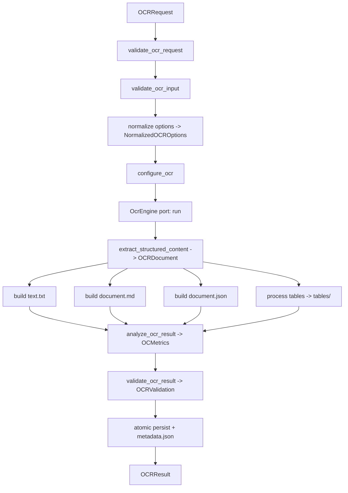

# Subplan — procesador-ocr

> Phase: **1 (processors, independently)** of the general plan (`docs/plan/README.md`).
> Module: `ocr` → `src/docflow/kernels/ocr.py` (import `docflow.kernels.ocr`).
> Source of truth: `docs/idea/procesador-ocr.md` + `docs/idea/readme.md`. Where they
> disagree, reconcile back to the idea. All output and identifiers in English.

## 1. Objective

Implement the `ocr` processor as a single-responsibility kernel that receives a prepared
image and returns a textual and structured representation of it, using **Docling as the
only OCR/document-analysis engine** (Docling is fixed — never a configurable setting). The
processor produces plain text, structured Markdown, JSON, blocks, tables, layout, reading
order, metrics, technical metadata, and an extraction status, through the
`OCRRequest → OCRResult` contract, and writes artifacts only inside its own `ocr/`
namespace. It is Phase 1 of the general plan and must be implementable in isolation: it
never imports another processor and never makes a workflow decision.

## 2. Context (BA)

### Responsibility

`ocr` answers a single question about an already-prepared image:

> **"Given this prepared image and this configuration, what textual and structural
> content can I extract from it?"**

It answers **that**, not any of the workflow questions around it:

> "Should OCR run on this page?" · "Should I use this OCR or the native text?" · "Should
> I send this to an LLM/VLM?"

### Explicit "does NOT" list

The module **does NOT**:

- process PDFs, render pages, or select pages (that is `pdf`);
- normalize, deskew, binarize, or prepare images (that is `image`);
- decide whether OCR must run, or select the final document source (that is the orchestrator);
- call an LLM/VLM or build an LLM context;
- compare OCR output against native text, VLM output, or any other source;
- own workflow state, idempotency, `REUSE`/`SKIP`/`FORCE`/`RESUME`, stop/resume, or full-stage retry (all orchestrator);
- write outside its `ocr/` namespace (`source/`, `native_text/`, `image/`, `llm/` are untouchable);
- interpret metrics or validation results (e.g. `LOW_CONTENT → use VLM`). It reports; the orchestrator decides.

### Principle line

> The `ocr` processor **produces information**; the **orchestrator decides what to do with
> it**. It answers "what content is in this image", not "what should happen next".

## 3. Design (SA)

### 3.1 Contract types

**Input — `OCRRequest`**

| Field | Type | Meaning |
|---|---|---|
| `image_path` | `str` | Path to the prepared image (already normalized/`ocr_ready`). |
| `output_dir` | `str` | Exclusive output directory (the `ocr/` namespace root). |
| `options` | `OCROptions` | Raw OCR/engine options; normalized internally. |
| `context` | `Context` | Correlation metadata only (`document_id`, `page_number`, `workflow_run_id`). Never used to mutate global state. |

`OCROptions` is normalized into a stable `NormalizedOCROptions`:

```
NormalizedOCROptions
├── ocr: bool
├── layout: bool
├── tables: bool
├── reading_order: bool
├── language: str | None
└── engine_options: dict
```

**Output — `OCRResult`**

| Field | Type | Meaning |
|---|---|---|
| `text` | `str` | Plain text (logical reading order). |
| `markdown` | `str` | Structured Markdown. |
| `structured_document` | `dict` | Engine-independent `OCRDocument` representation. |
| `tables` | `list[TableResult]` | Detected tables in preserved order. |
| `blocks` | `list[BlockResult]` | Deterministically ordered blocks. |
| `layout` | `LayoutResult` | Normalized bounding boxes, page dimensions, regions. |
| `reading_order` | `list[str]` | Ordered block/table identifiers. |
| `metrics` | `OCRMetrics` | `characters, words, blocks, tables, paragraphs, text_density, empty, structure_detected`. |
| `artifacts` | `ArtifactPaths` | Paths to `text.txt`, `document.md`, `document.json`, `tables/*`, `metadata.json`. |
| `validation` | `OCRValidation` | Status: `VALID | EMPTY | LOW_CONTENT | INCOMPLETE | PARSE_ERROR | ERROR`. |
| `metadata` | `OCRMetadata` | `engine, engine_version, processor_version, options, input, metrics, validation, timing, transformations, context`. |
| `status` | `str` | `success` or `failed` (typed failure is preferred over an exception). |

`OCRMetadata` always records `engine: "docling"` and a concrete `engine_version` (e.g.
`"x.y.z"`). The orchestrator can later derive a `processing_key` from this metadata.

**Intermediate representation — `OCRDocument`** (engine-independent; the rest of the
system never touches Docling's native structures):

```
OCRDocument
├── text
├── paragraphs[]
├── titles[]
├── blocks[]
├── tables[]
├── layout
├── reading_order[]
└── metadata
```

### 3.2 Artifact namespace

The processor writes **only** inside its assigned `output_dir` (the `ocr/` namespace):

```text
ocr/
├── text.txt
├── document.md
├── document.json
├── tables/
│   ├── table_001.md      # zero-padded, in reading order
│   └── table_002.md
└── metadata.json
```

`table_NNN.json` is optional in this phase (see §9 open decisions). Every artifact is
published atomically: write to `ocr/.tmp/`, validate, then rename into place, so no
partial artifact is ever visible as valid.

### 3.3 Internal flow



### 3.4 Primitives

Thin, low-McCabe functions that are the **only** place that knows Docling; the rest of the
module works on the engine-independent `OCRDocument`.

- **Pipeline/config:** `load_docling_pipeline`, `configure_image_pipeline`, `enable_ocr`,
  `enable_table_detection`, `enable_layout_analysis`, `normalize_docling_options`,
  `should_enable_ocr`, `should_enable_layout`, `should_enable_tables`,
  `should_enable_reading_order`.
- **Execution:** `convert_image_with_docling`.
- **Extraction:** `extract_docling_text`, `extract_docling_markdown`, `extract_docling_tables`,
  `extract_docling_blocks`, `extract_docling_layout`, `extract_docling_metadata`.
- **Export:** `export_docling_text`, `export_docling_markdown`, `export_docling_json`,
  `export_docling_tables`.
- **Text:** `count_ocr_characters`, `count_ocr_words`, `clean_ocr_text`, `normalize_ocr_text`,
  `is_ocr_empty`.
- **Markdown:** `normalize_markdown`, `merge_ocr_blocks`, `preserve_reading_order`.
- **Tables:** `count_tables`, `normalize_table`, `table_to_markdown`, `table_to_json`.
- **Layout:** `count_blocks`, `calculate_ocr_text_density`, `normalize_bbox`, `normalize_layout`.
- **Metadata:** `build_ocr_metadata`, `merge_ocr_metadata`, `get_engine_version`,
  `get_processor_version`.
- **Validation:** `validate_ocr_request`, `validate_ocr_input`, `validate_ocr_result`,
  `validate_output_artifacts`.
- **Files:** `create_ocr_directory`, `build_ocr_output_paths`, `ensure_directory`,
  `write_text_atomic`, `write_json_atomic`, `read_json`.

Entry points: `process_ocr_image(request) -> OCRResult` (the main function), and an optional
thin `process_ocr_from_page(...)` wrapper that only builds an `OCRRequest` and delegates to
`process_ocr_image` — it never reads a PDF or selects a page image itself.

### 3.5 Docling behind an adapter/port

Docling is hidden behind the `OcrEngine` port (`src/docflow/ports/`), with a thin
`DoclingOcrAdapter` implementation. The kernel depends only on the port; the adapter is
the single seam where Docling is imported. Docling is the **only** engine: the value
`"docling"` is recorded in metadata, not exposed as a user-selectable engine option. No
adapter is ever imported from a port.

### 3.6 Determinism posture

Same image + same engine version + same normalized options ⇒ same **logical output
structure**. Achieved by:

- normalizing options to a fixed, ordered `NormalizedOCROptions`;
- a stable, versioned `document.json` schema;
- deterministic block ordering (sort by reading order, tie-break by normalized `bbox`);
- preserving table order (`table_NNN`, zero-padded, in reading order);
- excluding timestamps from functional content (`text.txt`, `document.md`, `document.json`,
  `tables/*`) — timing lives only in `metadata.json`;
- recording `engine` + `engine_version` in `metadata.json` so reproducibility is auditable.

### 3.7 Error-handling posture

Errors are **classified, not swallowed, and not thrown as bare exceptions** where a typed
result is the contract:

- `OCRError { type, message, recoverable, metadata }` with types `INVALID_INPUT`,
  `UNSUPPORTED_IMAGE`, `ENGINE_ERROR`, `OCR_ERROR`, `LAYOUT_ERROR`,
  `TABLE_EXTRACTION_ERROR`, `EXPORT_ERROR`, `IO_ERROR`, `INTERNAL_ERROR`.
- Failure surfaces as `OCRResult(status="failed", error=…)`; the orchestrator owns the
  document-level retry/fallback decision.
- Only transparent, engine-level operations may retry internally; the processor never
  builds a second OCR workflow on its own.
- Atomic publication (`.tmp/` → validate → rename) guarantees no partially written artifact
  is ever considered valid.

## 4. Execution plan (PM)

### 4.1 WBS

| ID | Task | Effort | Depends on |
|---|---|---|---|
| OCR-01 | Skeleton module `kernels/ocr.py` + contract dataclasses (`OCRRequest`, `OCRResult`, `NormalizedOCROptions`, `OCRMetrics`, `OCRMetadata`, `OCRValidation`, `OCRError`, `ArtifactPaths`) with type hints and no silent defaults. | S | — |
| OCR-02 | `OcrEngine` port interface + `DoclingOcrAdapter`; pin `docling` in `pyproject.toml`; record `engine`/`engine_version`. | S | OCR-01 |
| OCR-03 | Pipeline/config primitives: `load_docling_pipeline`, `configure_image_pipeline`, `enable_*`, `normalize_docling_options`. | M | OCR-02 |
| OCR-04 | Execution + extraction primitives: `convert_image_with_docling`, `extract_docling_*`, building the engine-independent `OCRDocument`. | M | OCR-03 |
| OCR-05 | Deterministic normalization: block ordering, `normalize_bbox`, `normalize_layout`, `preserve_reading_order`. | M | OCR-04 |
| OCR-06 | Output builders: `build text.txt`, `build document.md`, `build document.json` (versioned schema). | M | OCR-05 |
| OCR-07 | Table processing: `process_tables`, `normalize_table`, `table_to_markdown`, export `tables/table_NNN.md` in order. | M | OCR-06 |
| OCR-08 | Metrics: `analyze_ocr_result` → `OCRMetrics`. | S | OCR-05 |
| OCR-09 | Technical validation: `validate_ocr_result` + `validate_output_artifacts`, statuses `VALID/EMPTY/LOW_CONTENT/…`. | S | OCR-06, OCR-08 |
| OCR-10 | Atomic persistence + `metadata.json` + publish (`ocr/.tmp/` → rename). | M | OCR-07, OCR-09 |
| OCR-11 | Entry points: `process_ocr_image` orchestration + optional `process_ocr_from_page` wrapper. | M | OCR-10 |
| OCR-12 | Tests: happy path + invariant tests + committed image fixtures. | M | OCR-11 |
| OCR-13 | Four QA gates green; mutation-falsify each invariant test and document observations. | S | OCR-12 |

### 4.2 Order / waves

- **Wave 1 — Foundations:** OCR-01, OCR-02 (contracts and the Docling seam first).
- **Wave 2 — Engine + extraction:** OCR-03, OCR-04, OCR-05 (all Docling access isolated here).
- **Wave 3 — Outputs:** OCR-06, OCR-07, OCR-08, OCR-09 (representations, tables, metrics, validation).
- **Wave 4 — Publish + entry points:** OCR-10, OCR-11 (atomic write, `process_ocr_image`).
- **Wave 5 — Verification:** OCR-12, OCR-13 (tests, fixtures, QA gates).

Waves are strictly sequential; tasks within a wave that share no dependency may proceed in
parallel.

## 5. Acceptance criteria

**Scenario: happy-path extraction from a prepared image**

```gherkin
Given a prepared image at "image/normalized.png"
  And options enabling OCR, layout, tables, and reading order
When process_ocr_image is called with a valid OCRRequest
Then OCRResult.status is "success"
  And OCRResult.validation.status is "VALID"
  And the ocr/ namespace contains text.txt, document.md, document.json, and metadata.json
  And metadata.json records engine "docling" and a non-empty engine_version
```

**Scenario: deterministic functional content**

```gherkin
Given the same prepared image, the same engine version, and the same normalized options
When process_ocr_image runs twice into two different output directories
Then the functional content of document.json is identical across both runs
  And metadata.json differs only in timing fields
```

**Scenario: empty input is reported, not thrown**

```gherkin
Given a prepared image that contains no text
When process_ocr_image is called
Then OCRResult.validation.status is "EMPTY"
  And no exception escapes the call
  And no partial artifact is published under ocr/
```

**Scenario: engine failure is contained**

```gherkin
Given a prepared image and a Docling engine that raises during conversion
When process_ocr_image is called
Then OCRResult.status is "failed"
  And OCRResult.error.type is "ENGINE_ERROR"
  And no .tmp files remain in the ocr/ directory
```

## 6. Test plan

**Happy-path test** — `test_process_ocr_image_happy_path`: feed a small committed prepared
image through `process_ocr_image`, assert `status == "success"`, validation `VALID`,
non-empty `text`, and that `text.txt`, `document.md`, `document.json`, `metadata.json` exist
with `engine == "docling"` and a concrete `engine_version`. Proves the full `Request →
Result` loop with real bytes from a fixture.

**Invariant tests** (each must fail when the invariant is broken — mutation listed):

1. **Deterministic ordering + stable format.** Assert two runs produce byte-identical
   functional content of `document.json`.
   *Mutation that breaks it:* dropping the stable sort key (e.g. changing
   `sorted(blocks, key=reading_order_key)` to `list(blocks)` in engine iteration order), or
   adding a timestamp into `document.json`.
2. **No timestamps in functional content.** Assert `text.txt`/`document.md`/`document.json`/
   `tables/*` contain no run-time timestamps.
   *Mutation that breaks it:* injecting `datetime.now().isoformat()` into the JSON or Markdown
   builder.
3. **Atomic publication — no partial artifacts on failure.** Force a failure after
   conversion, assert `ocr/` contains no `.tmp` files and no final-named artifacts.
   *Mutation that breaks it:* writing directly to the final path instead of to
   `ocr/.tmp/` followed by rename (publish-before-validate).

**Fixtures needed:**

- `fixtures/ocr_prepared_text_and_table.png` — a prepared image with a known heading, one
  paragraph, and a 2×2 table (provokes real structure extraction, ordering, and table export).
- `fixtures/ocr_blank.png` — an image with no text (provokes the `EMPTY` validation path).

## 7. Definition of Ready / Definition of Done

### Definition of Ready

- Contract types and `NormalizedOCROptions` fields agreed with `docs/idea/procesador-ocr.md`.
- `OcrEngine` port + `DoclingOcrAdapter` seam agreed; Docling pinned in `pyproject.toml`.
- Output schemas (`text.txt`, `document.md`, `document.json`) frozen for this phase.
- Committed image fixtures in `fixtures/`.
- No unresolved dependency on any other processor (fully independent, per Phase 1).

### Definition of Done

- `process_ocr_image` (and optional `process_ocr_from_page`) implemented behind the `OcrEngine` port.
- Happy-path test green using real bytes from a committed fixture.
- Every invariant test passes **and** has been mutation-falsified (mutation applied → test
  fails → mutation reverted → test green), with both observations reported.
- All artifacts written atomically and only inside the `ocr/` namespace.
- `engine` + `engine_version` recorded in `metadata.json`.
- Every shortcut tagged inline with `# TODO: [MVP]` or `# TODO: [RELEASE]`.
- The four QA gates pass:

```bash
pytest                                    # tests green
ruff check .                              # linter, includes import order (rule `I`)
ruff format --check .                     # formatter
pylint src tests                          # fixme disabled; the rest clean
```

## 8. Risks & mitigations

| Risk | Impact | Mitigation |
|---|---|---|
| Docling version drift changes output | Silent output differences across runs | Pin Docling; record `engine_version`; deterministic-ordering tests catch regressions. |
| Docling residual non-determinism on identical input | Flaky determinism test | Compare normalized logical structure, not raw bytes; record the determinism class; assert functional-content equality only. |
| Docling schema changes between versions | Extraction primitives break | Isolate all Docling access in the adapter + primitives; everything downstream uses `OCRDocument`. |
| Silent empty/partial extraction | Empty result reported as correct | Mandatory structural validation with `EMPTY`/`LOW_CONTENT` statuses; blank-image fixture test. |
| Interrupted publish leaves corrupt artifacts | Downstream reads invalid files | Atomic `.tmp/` → validate → rename; invariant test on failure paths. |
| Large images / many tables (2 MB item, memory) | Slow or memory-heavy runs | PoC on small fixture; tag resource caps with `# TODO: [RELEASE]`. |
| Over-engineering (generic abstraction layers) | PoC bloat, slow delivery | Thin primitives, single entry point, happy path only, `# TODO` markers for deferred complexity. |

## 9. Out of scope & open decisions

### Out of scope (owned by other processors / the orchestrator)

- PDF splitting, rendering, page selection (`procesador-pdf`).
- Image normalization and `ocr_ready`/`vlm_ready` preparation (`procesador-image`).
- Deciding whether OCR must run; source selection; comparing OCR vs. native text or VLM;
  `build_llm_context_from_ocr` (`procesador-orquestador`).
- LLM/VLM inference (`procesador-llm-call`).
- Workflow state, idempotency, `stop/resume`, `skip/force`, full-stage retry, concurrency
  control (orchestrator).
- Domain-specific extraction rules (invoice fields, verdicts) — the pipeline is generic.
- A second OCR engine or a user-selectable engine setting (Docling is fixed).

### Open decisions

1. `document.json` schema versioning policy: which fields are frozen vs. additive-only.
2. Whether `tables/table_NNN.json` is produced in this phase (spec marks it optional).
3. Determinism assertion strength: byte-identical functional content vs. logical-structure equivalence.
4. `bbox` normalization reference: absolute pixels vs. normalized 0–1 coordinates (engine-independent target).
5. Whether the `process_ocr_from_page` wrapper lands in Phase 1 or is deferred to Phase 3 integration.
6. Physical layout: single module `src/docflow/kernels/ocr.py` vs. a sub-package (carries general plan open decision #2).
