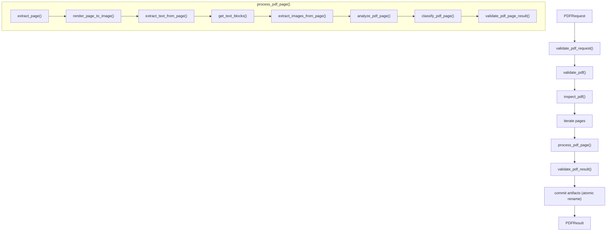

# Subplan — procesador-pdf

## 1. Objective

Implement `procesador-pdf` (module `pdf`) as a single-responsibility processor that **inspects, splits and extracts the native artifacts of a PDF**: one self-contained per-page unit containing `page.pdf`, a faithful render (`page.png`), the native text (`text.txt`, `blocks.json`), the embedded images, per-page composition metrics, a descriptive `TEXT` / `IMAGE` / `MIXED` classification, and technical metadata. It receives a `PDFRequest` and returns a `PDFResult` (+ `PDFPageResult` per page). It describes *what is natively in the PDF*; it never decides *what to do next*.

## 2. Context (BA)

### Responsibility
`procesador-pdf` extracts the physical, native structure of a PDF document: pages, renders, native text, text blocks, embedded images, composition metrics and a descriptive classification, published as artifacts under its own namespace.

### Does NOT
- Does **not** normalize images (deskew, sharpen, denoise, contrast).
- Does **not** run OCR.
- Does **not** call an LLM/VLM.
- Does **not** select the final documentary source (`NATIVE_TEXT` vs `OCR_TEXT` vs `IMAGE`).
- Does **not** decide whether OCR or vision is needed.
- Does **not** compare sources.
- Does **not** control the document workflow, idempotency (`REUSE`/`SKIP`/`FORCE`/`RESUME`) or state.
- Does **not** import or call another processor.

### Principle
`procesador-pdf` answers:

> **“What does this PDF natively contain, and what artifacts can I extract from each page?”**

It does **not** answer:

> **“What should be done later with those artifacts?”**

The classification is descriptive, not routing: a `TEXT`/`IMAGE`/`MIXED` value is data in the `PDFPageResult`; the orchestrator is the only component that turns it into a decision.

## 3. Design (SA)

### Contract types

**Input — `PDFRequest`**

```
PDFRequest
├── pdf_path       : Path    (required, no default)
├── output_dir     : Path    (required, no default)
├── options        : PDFOptions (required, no default)
│   ├── extract_pages : bool
│   ├── render        : bool
│   ├── extract_text  : bool
│   ├── extract_images: bool
│   ├── layout        : bool
│   └── dpi           : int
└── context        : PDFContext (required, no default)
    ├── document_id     : str
    └── workflow_run_id : str
```

`context` is used only for correlation/tracing/metadata and is never used to alter behavior.

**Output — `PDFResult`**

```
PDFResult
├── source_path : Path
├── metadata    : PDFMetadata
├── pages       : list[PDFPageResult]
├── metrics     : PDFMetrics (aggregate)
├── artifacts   : list[Path]
├── validation  : PDFValidation
└── status      : Status
```

**Per page — `PDFPageResult`**

```
PDFPageResult
├── page_number      : int
├── page_pdf         : Path
├── page_image       : Path
├── native_text      : Path
├── text_blocks      : list[TextBlock]
├── embedded_images  : list[EmbeddedImage]
├── metrics          : PDFPageMetrics
├── classification   : Literal["TEXT", "IMAGE", "MIXED"]
├── artifacts        : list[Path]
├── validation       : PDFPageValidation
├── metadata         : PDFPageMetadata
└── status           : Status
```

Supporting records: `PDFPageMetrics` (`characters`, `words`, `text_blocks`, `images`, `text_coverage`, `image_coverage`, `largest_image_coverage`), `EmbeddedImage` (`image_id`, `path`, `bbox`, `width`, `height`, `format`, `metadata`), `PDFError` (`type`, `page_number`, `message`, `recoverable`, `metadata`).

### Artifact namespace
The processor owns only these namespaces and must not write into `image/`, `ocr/` or `llm/`:

```
document/
├── source/document.pdf        (immutable reference copy)
├── metadata.json
└── page_001/
    ├── source/page.pdf
    ├── render/page.png
    ├── native_text/text.txt
    ├── native_text/blocks.json
    ├── embedded_images/image_001.png
    └── metadata.json
```

### Internal flow



### Primitives (low-level, PDF-aware only)
Document inspection: `get_pdf_metadata(pdf_path)`, `get_page_count(pdf_path)`, `get_page_dimensions(pdf_path, page_number)`, `inspect_pdf(pdf_path)`.
Split/merge: `extract_page(pdf_path, page_number, output_path)`, `split_pdf(pdf_path, output_dir)`, `merge_pdfs(pdf_paths, output_path)` (generic utility).
Render: `render_page_to_image(pdf_path, page_number, output_path, dpi=200)`.
Native text: `extract_text_from_page(pdf_path, page_number, layout=True)`, `get_text_blocks(pdf_path, page_number)`.
Embedded images: `extract_images_from_page(pdf_path, page_number, output_dir)`, `get_image_blocks(pdf_path, page_number)`.
Composition: `analyze_pdf_page(page_data) -> PDFPageMetrics`, `classify_pdf_page(metrics) -> "TEXT" | "IMAGE" | "MIXED"`.
Entry points: `process_pdf(request) -> PDFResult`, `process_pdf_page(...) -> PDFPageResult`.
Validation: `validate_pdf_result(result)`, `validate_pdf_page_result(page_result)`.

The primitives know PDF libraries; they do **not** know OpenCV, OCR, Docling, LLM or the workflow.

### Engine encapsulation

The PDF engine is **Poppler** (`pdftotext` / `pdfimages` / `pdfseparate`), as the idea's
§"Implementaciones reemplazables" fixes. All engine access lives inside `pdf/primitives/`;
no other processor, and never the orchestrator, touches Poppler directly. The processor's
public contract (`PDFRequest → procesador-pdf → PDFResult`) is engine-agnostic: replacing
Poppler with another PDF reader changes only `primitives/`, never the contract or the
workflow. The engine is always explicit — never a silent default.

### Determinism class
**Deterministic.** Same PDF + same normalized options + same processor/engine versions → same logical artifacts and same classification. Enforced by: normalized option ordering, preserved page order, deterministic artifact names (`page_001/…`, `image_001.png`), stable formats, and recording `processor`, `processor_version`, `engine`, `engine_version` in `metadata.json`. Volatile metadata (timing) is kept out of functional content.

### Error-handling posture
Typed results, not thrown exceptions, where a result is the contract. Failures are described, not decided upon:

- `PDFError` with `type` (`INVALID_INPUT`, `UNSUPPORTED_PDF`, `ENCRYPTED_PDF`, `CORRUPTED_PDF`, `PAGE_EXTRACTION_ERROR`, `RENDER_ERROR`, `TEXT_EXTRACTION_ERROR`, `IMAGE_EXTRACTION_ERROR`, `IO_ERROR`, `INTERNAL_ERROR`), `page_number`, `message`, `recoverable` (bool), `metadata`.
- Per-page **partial success**: a page with one failing stage keeps its valid artifacts and returns `status = PARTIAL`; the processor never decides whether the workflow may continue.
- **Atomic publication**: artifacts are written to `.tmp`, validated, then atomically renamed — never exposed incomplete.
- Validation states: `VALID` / `PARTIAL` / `INVALID` / `ERROR` (per-page additions: `RENDER_ERROR`, `TEXT_EXTRACTION_ERROR`, `IMAGE_EXTRACTION_ERROR`).
- Shortcuts deferred for later are tagged inline: `# TODO: [MVP]` (real validation/encryption handling) and `# TODO: [RELEASE]` (telemetry/caching/HA/security).

## 4. Execution plan (PM)

### WBS

| ID | Task | Effort | Depends on |
|---|---|---|---|
| PDF-01 | Contract types: `PDFRequest`, `PDFResult`, `PDFPageResult`, `PDFPageMetrics`, `PDFError`, statuses | S | — |
| PDF-02 | Poppler primitives skeleton in `pdf/primitives/` (encapsulation, no silent default) | M | PDF-01 |
| PDF-03 | Document primitives: `get_pdf_metadata`, `get_page_count`, `get_page_dimensions`, `inspect_pdf` | M | PDF-02 |
| PDF-04 | Split/extract primitives: `extract_page`, `split_pdf`, `merge_pdfs` (`# TODO: [MVP]` — `merge_pdfs` is a generic utility, not on the happy path) | M | PDF-02 |
| PDF-05 | Render primitive: `render_page_to_image` | S | PDF-02 |
| PDF-06 | Native text primitives: `extract_text_from_page`, `get_text_blocks` | M | PDF-02 |
| PDF-07 | Embedded image primitives: `extract_images_from_page`, `get_image_blocks` | M | PDF-02 |
| PDF-08 | Composition: `analyze_pdf_page`, `classify_pdf_page` (explicit named thresholds) | S | PDF-02 |
| PDF-09 | Page entry point: `process_pdf_page` + per-page metadata | M | PDF-04, PDF-05, PDF-06, PDF-07, PDF-08 |
| PDF-10 | Document entry point: `process_pdf` + consolidation + `PDFResult` | M | PDF-03, PDF-09 |
| PDF-11 | Validation + error model: `validate_pdf_result`, `validate_pdf_page_result` | S | PDF-09, PDF-10 |
| PDF-12 | Atomic persistence (`.tmp` → validate → rename) across all artifacts | S | PDF-09, PDF-10 |
| PDF-13 | Committed fixtures + happy-path and invariant tests | M | PDF-01, PDF-02, PDF-10, PDF-11, PDF-12 |

### Order / waves
- **Wave 1 (foundations):** PDF-01, PDF-02, and the fixture *bytes* for PDF-13 (contracts and primitives land first; everything imports from them). The fixtures are committed here; the tests that consume them belong to Wave 4.
- **Wave 2 (primitives, parallel):** PDF-03, PDF-04, PDF-05, PDF-06, PDF-07, PDF-08 — independent once the primitives skeleton exists.
- **Wave 3 (composition):** PDF-09 (page entry point), then PDF-10 (document entry point).
- **Wave 4 (hardening):** PDF-11, PDF-12, then PDF-13 (the tests need `process_pdf` and the atomic-publication guarantee to exist), and run the four QA gates.

## 5. Acceptance criteria

```gherkin
Scenario: Full extraction on a valid PDF
  Given a valid multi-page PDF at pdf_path and default options
  When process_pdf(request) runs
  Then a PDFResult is returned with status SUCCESS
  And every page has page.pdf, page.png, native_text/text.txt and metadata.json
  And metadata.json records processor, processor_version, engine and engine_version

Scenario: Text-dominant page is classified TEXT
  Given a page whose text_coverage exceeds the TEXT threshold and whose image_coverage is low
  When process_pdf_page runs
  Then the page classification is TEXT
  And the classification is recorded as data only (no routing decision is taken)

Scenario: Image-dominant page is classified IMAGE
  Given a page with little native text and dominant visual representation
  When process_pdf_page runs
  Then the page classification is IMAGE

Scenario: One failing stage yields a partial page
  Given a page where image extraction fails but render and text extraction succeed
  When process_pdf_page runs
  Then the page status is PARTIAL
  And the valid artifacts (page.pdf, page.png, text.txt) are preserved
  And the failure is recorded in PDFError with recoverable set
```

## 6. Test plan

### Happy-path test
`process_pdf` over a small committed multi-page fixture returns a `PDFResult` with `status == SUCCESS`, `len(pages) == page_count`, every page carrying non-empty `page.pdf`, `page.png`, `text.txt`, `blocks.json`, `embedded_images/` (where present), `metrics` and `classification`, and the artifact tree matching the ownership namespace exactly (no files under `image/`, `ocr/`, `llm/`).

### Invariant tests (must-fail rule)
Each invariant test must FAIL when the invariant is broken — proven by mutating the source, observing the failure, then restoring green.

1. **Page completeness.** Every input page yields exactly one `PDFPageResult` and one `page_NNN/` directory, and `PDFResult.metadata.page_count == len(PDFResult.pages) == get_page_count(pdf_path)`.
   *Mutation that breaks it:* in `process_pdf`, iterate `range(page_count - 1)` (drop the last page) or return `pages[:1]`. The test fails on the count/coverage mismatch.
2. **Immutable input.** The SHA-256 of the input PDF is identical before and after `process_pdf`.
   *Mutation that breaks it:* make `extract_page` write its output to `request.pdf_path` (overwriting the source) instead of `page_001/source/page.pdf`. The before/after hash comparison fails.
3. **Classification vocabulary & purity.** `classify_pdf_page(metrics)` returns exactly one of `TEXT`, `IMAGE`, `MIXED`, depending only on `PDFPageMetrics` — never on a workflow flag in `context`.
   *Mutation that breaks it:* change `classify_pdf_page` to return `"OCR"` or to read a `force_ocr` flag from `context`. The membership/enum assertion fails.

### Fixtures needed
- `fixtures/pdf_sample_text.pdf` — multi-page, text-dominant (2–3 pages).
- `fixtures/pdf_sample_image.pdf` — single page, image-dominant.
- `fixtures/pdf_sample_mixed.pdf` — single page, text + image.
- `fixtures/pdf_corrupt.pdf` — truncated header, for the error path.

## 7. Definition of Ready / Definition of Done

### Definition of Ready
- Contract types (`PDFRequest`, `PDFResult`, `PDFPageResult`) match `docs/idea/procesador-pdf.md` and the general plan Phase 0 — field lists ratified.
- The Poppler primitives skeleton under `pdf/primitives/` is defined; one concrete engine (Poppler) is chosen; no silent engine default.
- Classification thresholds are explicit named constants (not magic numbers, not implicit defaults).
- Artifact ownership (`source/`, `render/`, `native_text/`, `embedded_images/`, `metadata.json`) and the atomic-publication rule are stated.
- The committed fixtures listed in §6 exist and are named for the failure they provoke.
- No open question blocks the happy path.

### Definition of Done
- All WBS tasks PDF-01 … PDF-13 are complete; `process_pdf` and `process_pdf_page` round-trip `Request → Result` with real bytes from a committed fixture.
- No import of, or call to, any other processor; no workflow decision, OCR, LLM/VLM or source selection inside the module.
- No domain noun (invoice, field, verdict, pipeline code) in the processor API; all identifiers/docstrings/comments in English.
- Artifacts are published atomically (`.tmp` → validate → rename); the input PDF is never modified.
- Metadata records `processor`, `processor_version`, `engine`, `engine_version`; options are normalized; page order preserved.
- Every shortcut carries an explicit `# TODO: [MVP]` or `# TODO: [RELEASE]` tag.
- Each invariant test has been proven to fail under its stated mutation, then restored green.
- The four QA gates pass:

```bash
pytest
ruff check .
ruff format --check .
pylint src tests
```

## 8. Risks & mitigations

| Risk | Impact | Mitigation |
|---|---|---|
| Engine/library drift (Poppler versions) | Silent output or classification differences | Pin versions; record `engine` + `engine_version` in every artifact's `metadata.json`; deterministic ordering. |
| Engine licensing (Poppler GPL) | Distribution/legal constraint | Keep the engine behind the `Request → Processor → Result` contract; swap the engine in `pdf/primitives/` without touching the processor or the workflow; decide license posture before Release. |
| Encrypted / unsupported / corrupt PDFs | Unexpected failure or crash | `validate_pdf` fail-fast with typed `PDFError` (`ENCRYPTED_PDF`, `CORRUPTED_PDF`, `UNSUPPORTED_PDF`); never guess. |
| Large PDFs exhausting memory | OOM during full-document processing | Process page-by-page via `process_pdf_page`; render/extract one page at a time; no full-document buffer. |
| Arbitrary classification thresholds | Inconsistent/unsupported classification | Explicit named constants; classification is descriptive and never drives routing (orchestrator owns decisions). |
| Partially written artifacts observed downstream | Downstream reads incomplete data | Atomic publication (`.tmp` → validate → rename); partial pages keep only valid artifacts with `status = PARTIAL`. |

## 9. Out of scope & resolved decisions

### Out of scope
- Image normalization / `ocr_ready` / `vlm_ready` preparation (→ `procesador-image`).
- OCR and OCR-result consolidation (→ `procesador-ocr`).
- LLM/VLM inference and its internal graph (→ `procesador-llm-call`).
- Final source selection, workflow routing, global idempotency (`processing_key`, `REUSE`/`SKIP`/`FORCE`), `stop`/`resume` state (→ `procesador-orquestador`).
- Multi-document batching, distributed execution, retry queues.
- Telemetry, caching, HA, security hardening (`# TODO: [RELEASE]`).
- Any writing outside `source/`, `render/`, `native_text/`, `embedded_images/`, `metadata.json`.

### Resolved decisions
1. **Final engine — RESOLVED: Poppler** (the idea's §"Implementaciones reemplazables").
   It is encapsulated in `pdf/primitives/`; license posture is reviewed at the Release gate.
2. **Classification thresholds — RESOLVED for PoC.** Explicit named constants
   (`TEXT_CHAR_MIN`, `IMAGE_COVERAGE_MIN`, …) with values to be fixed at PDF-08 start;
   the classification stays descriptive and never drives routing.
3. **Render defaults — RESOLVED:** `dpi = 200`, PNG as the only render format for Phase 1.
4. **`merge_pdfs` scope — RESOLVED:** defer to a later phase (not on the happy path).
5. **Layout — RESOLVED:** sub-package `pdf/` with `primitives/`, `utils/`, `helpers/`,
   matching the idea's §"Estructura del proyecto".
6. **Naming mapping — RESOLVED:** code and modules use the English names the idea itself
   uses (`docflow.pdf`, `process_pdf`, `process_pdf_page`); the Spanish
   `procesador-pdf` remains only as the title of the idea document.
