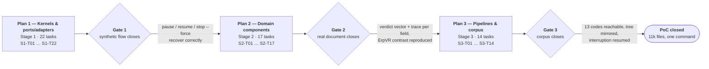
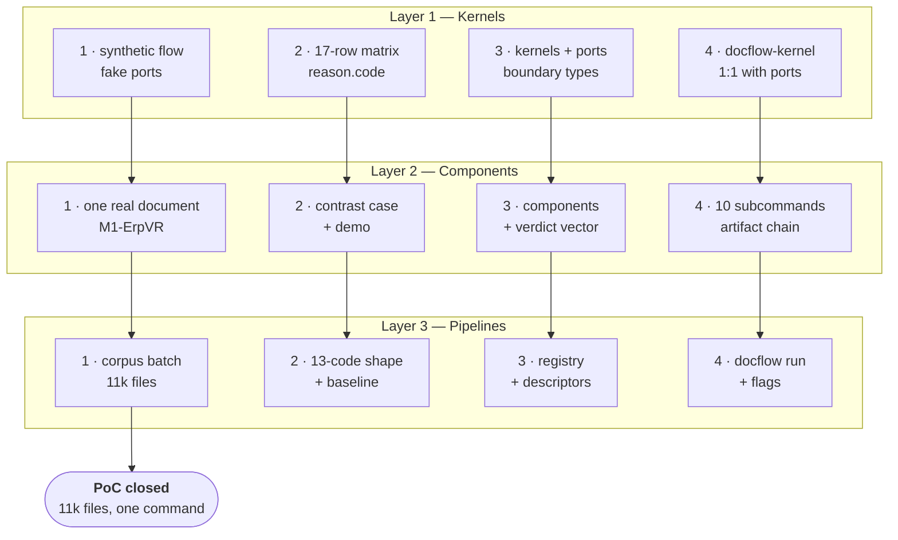

# `docflow` — Execution Plans (PoC)

| Field | Value |
|---|---|
| Scope | The three stage-by-stage execution plans for the `docflow` PoC |
| Lifecycle stage | **PoC** — close the end-to-end flow, happy path first (`.github/copilot-instructions.md` §5) |
| Source of the work | [`../artifacts/wbs.md`](../artifacts/wbs.md) — 53 tasks across 3 stages |
| Companion artifacts | [`../artifacts/prd.md`](../artifacts/prd.md) · [`../artifacts/sad.md`](../artifacts/sad.md) · [`../artifacts/traceability.md`](../artifacts/traceability.md) · [`../artifacts/kernel-cli.md`](../artifacts/kernel-cli.md) |
| Origin specification | [`../../my_prompt.md`](../../my_prompt.md) |
| Effort signal | `S` / `M` / `L` — relative complexity, not calendar time (`wbs.md` §7). No dates, no story points, no velocity |

---

## 1. What these three plans are

`wbs.md` is the **work breakdown**: 53 tasks, their `Depends on` sets, their deliverables and their verifiable criteria. These three plans are the **executable route through that breakdown** — one plan per build stage — supplying the four things a table cannot carry: the entry condition, the wave order derived from the dependency graph, the operator runbook that closes the stage, and the exit checklist that lets the next plan start.

They add no work. Every task here is a task in `wbs.md`, with its **ID, dependency set and effort signal reused verbatim**. Where a plan needs a decision the artifacts already fixed, it cites the artifact rather than restating it: `wbs.md` §3/§4/§5 for the tasks, `sad.md` §12 for the ADRs, `kernel-cli.md` §9/§11 for the Stage 1 harness, `prd.md` §8 for the acceptance scenarios, `traceability.md` §4 for the requirement mapping.

| Plan | Stage | Layer | Tasks | Closing flow | Blocked by |
|---|---|---|---|---|---|
| [`plan-01-kernels.md`](plan-01-kernels.md) | **Stage 1** — arch-components | Kernels + ports/adapters (K1–K8) | **22** · `S1-T01`–`S1-T22` | **Synthetic**: a 3-stage graph through orchestrator + store + ledger, with pause / resume / `stop --force` | Nothing. Entry condition is the frozen decisions and the absence of code |
| [`plan-02-components.md`](plan-02-components.md) | **Stage 2** — components | Domain (10 components) | **17** · `S2-T01`–`S2-T17` | **Real document**: canonical chain emitting a verdict vector + trace, with an `ErpVR` contrast case | Plan 1 exit checklist complete — `S1-T19` closed |
| [`plan-03-pipelines.md`](plan-03-pipelines.md) | **Stage 3** — pipelines | Routes (configuration + registry data) | **14** · `S3-T01`–`S3-T14` | **Corpus**: all 13 codes reachable, 11k files, batch + mirrored tree + interrupt + resume | Plan 2 exit checklist complete — `S2-T17` closed |

## 2. The gate model

**A stage is `done` only when its flow closes.** A stage with every task ticked and no closed flow is not finished. `wbs.md` §1 states this as the rule that governs the whole plan set, and each plan's §3 restates its own closing criterion with the exact command and the observable evidence that proves it.

**A plan cannot start before the previous plan's exit checklist is complete.** The exit checklist is the only artefact that authorises the next plan; a task can be `done` inside a plan whose checklist is not ticked, and it stays `done` — what it cannot do is authorise work above it.

**The three non-negotiables that carry across all three plans:**

1. **Never write `done` about non-durable bytes.** The write order is write → flush → fsync → rename → `done` (`prd.md` FR-04, `sad.md` §7.1). Everything else in K1 is an optimisation; this is the invariant that makes resume mean anything.
2. **Verification is an outcome of every ledger read and there is no flag for it.** A stage is trusted only if it is `done` **and** its artifact verifies against the store (`prd.md` FR-05, ADR-006, `kernel-cli.md` §9). There is no `--verify` and no ledger-trust `verify` subcommand — in any stage, on any surface.
3. **A sampled artifact is evidence and is never regenerated.** A missing sampled artifact produces `failed` with an evidence-missing reason, never a fresh sample (`prd.md` FR-09, `sad.md` §4). Retrying to obtain agreement is forbidden; the attempt count is recorded so the pattern is visible.

**Fixed decisions true across all three plans** (cite, do not restate):

| Decision | Source |
|---|---|
| The OCR engine is Docling, only, and is **never** a setting | ADR-001, `prd.md` FR-16 |
| Validation is never skippable — no `--no-validate` | ADR-002, `prd.md` FR-18 |
| Emission is a per-field verdict vector (`shape`/`type`/`content`/`digit`/`consistency`/`catalog`) plus a trace, **never** a single confidence score | ADR-005, `prd.md` FR-23, `sad.md` §11 |
| The Segmenter over-segments when in doubt | ADR-007, `prd.md` FR-13 |
| No default or fallback model, engine or threshold exists anywhere | `sad.md` §12 ADR-001/009, `kernel-cli.md` §8 |
| Corpus policy lives in the registry (K8) with **no CLI flag and no environment variable**; operational settings use CLI → env → `.env` → default | ADR-009, `prd.md` NFR-06/NFR-06a |
| The manifest (`run.json`) is derived, rebuildable and never authoritative — the ledgers are | `prd.md` FR-11, `sad.md` §7.2 |
| There is no `--verify` flag and no `--no-validate` flag, in any stage, on either surface | ADR-002, ADR-006, `kernel-cli.md` §9/§14 |

## 3. Cross-plan contract table

Each plan **freezes** a set of artefacts. The next plan consumes them and may not change them; a change to a frozen artefact re-opens the gate that froze it.

| Plan | Freezes at its gate | Consumed by |
|---|---|---|
| **Plan 1** | `Token` · `KernelResult` · `Evidence` · `Reason` · `CallRecord` · `Bytes`/`Artifact` (`docflow/kernels/types.py`); the port interfaces `PdfSource`/`OcrEngine`/`LlmEngine`/`ArtifactStore`/`Registry`; the 7-term cache key; the 7 durable ledger states; the determinism classes; the `KernelResult` JSON envelope and the 5 exit codes; the closed set of `reason.code` values; the descriptor shape (`descriptors/synthetic-3stage.yaml`) | Plan 2 builds every component against these types and ports, and adds no new kernel-boundary type |
| **Plan 2** | The verdict-vector shape and the per-field trace shape (`sad.md` §11, `prd.md` FR-23); the `catalog` reason vocabulary (`not_run` \| `source_unavailable` \| `pending_retry`); the component artifact chain `.<step>.json` (`sad.md` §9.1); the escalation policy's single ownership (Validator); the `not_applicable` list emitted by the ledger writer | Plan 3 wires the 13 codes onto this chain and emits this shape unchanged for all 13 (`FR-33`, `S3-T13`) |
| **Plan 3** | The 13 descriptors and their stage sets; the registry assets (patterns, prompts, schemas, policies); `.env.example` and the policy/setting split; the mirrored-tree and the three-artifact layout; `run.json`'s shape and location | Nothing follows in the PoC. A shape change here is a shape change for the consuming system |

### Epic/issue decompositions

Each plan can be decomposed into **capability epics** whose issues are one-per-`wbs.md`-task. The cut is orthogonal to the waves: the epic is *what an issue is part of*, the wave is *when it runs*. An epic/issue set adds acceptance criteria, test evidence and out-of-scope lists — it never adds work.

| Plan | Decomposition | Epics | Issues |
|---|---|---:|---:|
| **Plan 1 — Kernels** | [`issues/plan-01-kernels/README.md`](issues/plan-01-kernels/README.md) | 8 | 22 |
| **Plan 2 — Components** | [`issues/plan-02-components/README.md`](issues/plan-02-components/README.md) | 9 | 17 |
| **Plan 3 — Pipelines** | [`issues/plan-03-pipelines/README.md`](issues/plan-03-pipelines/README.md) | 8 | 14 |

**Plan 3 adds configuration and data only.** No new kernel, no new component, no new type: `wbs.md` §5 states Stage 3 is "largely data, not new code".

## 4. Ordering note — what can slip and what cannot

From `wbs.md` §6.2, reused rather than recomputed:

| Can slip without delaying a stage close | Cannot slip |
|---|---|
| `S1-T11` (ports can be introduced alongside the first adapter) · `S1-T12` / `S1-T13` (K2/K3 thin ops) · `S1-T16` (K6 can be stubbed by a test double until escalation needs it) · `S2-T15` (Reviewer) · `S2-T16` (per-component CLI) · `S3-T06` / `S3-T07` / `S3-T10` (batch and layout) · `S3-T12` (settings) | The Stage 1 spine `S1-T01 → T02 → T03 → T04 → T05 → T06 → T07 → T09 → T18 → T19` (9 links) · the harness chain `S1-T20 → T21 → T22`, which cannot slip **past** `S1-T19` · `S2-T17` and all five of its dependency branches (`wbs.md` §6.2) · `S3-T02`, `S3-T08`, `S3-T09`, `S3-T14` |

Both chains converge on `S1-T19`. The harness chain is shorter (3 links) and therefore the one that must not slip: without `S1-T22`, the 17-row silent-failure matrix exists only as prose, and the first time a kernel fails silently is inside a domain component — where the failure is attributed to the wrong layer (`kernel-cli.md` §1).

## 5. Reading order and status legend

Read `plan-01-kernels.md` first: Plans 2 and 3 cite its frozen types by name and its entry conditions are Plan 1's exit checklist. Within each plan, §5 is the ordered work; §6 is the runbook to run when the work is nominally complete; §11 is what an operator ticks to declare the plan closed; **§13 instantiates the four tracks of that layer** (§6 of this document).

| Marker | Meaning |
|---|---|
| `# TODO: [MVP]` | A PoC shortcut that a real MVP must replace — validation, real sources, robust error handling |
| `# TODO: [RELEASE]` | Telemetry, caching layers, HA, security compliance — lifecycle §5 final stage |
| **Never** | Forbidden by design; appears in an *Out of scope* list, never as a deferred plan |
| `now` / `MVP` | `kernel-cli.md` §9 per-command status: `now` dispatches in Stage 1, `MVP` exits `4` naming the operation as unavailable |
| `S` / `M` / `L` | Effort signal from `wbs.md` §7 — relative complexity of implementation **and verification**, not duration |

**Unresolved decisions are not resolved here.** Every plan carries its own §12. A decision that belongs to a later stage is listed in the earlier plan only as a hand-off, and the plan that must act on it carries it in its own §12.

**Reading order, and where the issue trees sit.** Read `plan-01-kernels.md` first, then `plan-02-components.md`, then `plan-03-pipelines.md` — each plan's §4 entry condition is the previous plan's §11 checklist. Each plan's §5 ends with a pointer to its own decomposition under `issues/`, and this document's §6 is the four-track model all three instantiate in their §13. The three decompositions are peers of the plans, not summaries of them: the plan remains the authority on sequence and the gate, and the issue set is the tracker-facing view.

---

## 6. The four tracks per layer

Every layer is worked along **four tracks at the same time**. They are not phases to be finished in order: Track 1 is what *closes* the stage, Track 4 is how you *operate* it, Track 2 is what *proves* the result, Track 3 is what you *keep*. The project is **library first, CLI as one caller** (`sad.md` ADR-008), so Track 3 is the deliverable and Tracks 1, 2 and 4 are how it is reached and exercised.

| Track | The question it answers | What it produces | How you know it is done |
|---|---|---|---|
| **1 — Fast flow** | Does the end-to-end journey close? | The stage's closing flow (each plan's §3) | The gate task itself: `S1-T19` · `S2-T17` · `S3-T14` |
| **2 — Golden set / tests** | Is the result *right*, and would a regression stay caught? | Per-layer golden evidence (see the table below) | The invariant tests that **fail when the invariant is broken** (each plan's §7b), not merely tests that pass |
| **3 — Code (for reuse)** | Can another program consume this layer without the CLI? | The frozen contract its gate publishes (§3 of this document) | A consumer imports it and adds **no new type** |
| **4 — CLI (to probe)** | Can one piece be run and inspected in isolation? | `docflow-kernel` (P1) · the 10 per-component subcommands (P2) · `docflow run` (P3) | Every command is 1:1 with an operation behind it — **no flag without a counterpart** |

### The instance of each track, per layer

| Layer | 1 — Fast flow | 2 — Golden set / tests | 3 — Code (for reuse) | 4 — CLI (to probe) |
|---|---|---|---|---|
| **Plan 1 — Kernels** | The synthetic 3-stage descriptor over faked ports | The 17-row silent-failure matrix, one committed fixture per row | `docflow/kernels/` + `docflow/ports/`: the frozen boundary types | `docflow-kernel`, one subcommand per port method |
| **Plan 2 — Components** | One real document through `M1-ErpVR` | The contrast case (`1540` vs `15400`) + the documented demo | `docflow/components/` + the frozen verdict-vector shape | The 10 per-component subcommands forming the artifact chain |
| **Plan 3 — Pipelines** | The corpus batch: one command, 11k files | Shape identity across all 13 codes + the first run's recorded baseline | Registry assets and the 13 descriptors — **no new code** | `docflow run --pipeline <CODE>`, `--extractor`, `--force` |

Read it as **four parallel lanes, three layers deep** — not as sixteen sequential steps. A lane can be at a different depth than its neighbours: Plan 3's Track 2 can start while Plan 2's Track 4 is still filling in, because the surfaces are independent. What cannot move is the **layer**: no lane crosses a gate ahead of its own layer's Track 1.

### The golden set proper is deferred — and that is deliberate

Not for budget. A golden set graded by the model that produced it is **circular**, and the risk is already in the register (`wbs.md` §9); the origin sentence that asked for it is incomplete (`my_prompt.md`, recorded as deviation D4 in `traceability.md` §3.4). `--golden`, the labeller role and the comparator stay `# TODO: [MVP]`.

What each layer has **instead** is golden evidence that cannot be self-graded:

| Layer | The golden evidence | Why it cannot be self-graded |
|---|---|---|
| Plan 1 | The committed fixtures of the silent-failure matrix — `kernel-cli.md` §12's table names **14** committed fixtures across its 16 rows (two rows are marked `(no fixture)`, being procedures), each named for the failure it provokes and each asserting a **`reason.code`**, never a message string | The assertion is on a closed vocabulary, not on a model's opinion |
| Plan 2 | The contrast case and the documented demo — a `15400` that was really `1540` | Caught by **two independent readers disagreeing**, which no single reader can manufacture for itself |
| Plan 3 | The shape-identity contract test over all 13 codes, plus the first full run's recorded baseline | A shape is compared against a documented shape, not scored by a model |

When the golden set does land, the labeller role runs **offline**, writes read-only artefacts, and must not share a run with the governor role (`wbs.md` §9).

### How the four tracks interleave with the waves

- **Track 1 walks the longest chain, not the whole plan.** In Plan 1 that chain is the 9-link spine to `S1-T19`; the real K2–K6 adapters land in parallel and are *not* on it. In Plan 2 it is `B → C → D → E` (nine links from `S2-T04` to `S2-T17`). In Plan 3 it is descriptors → one code over a small folder → the corpus.
- **The fakes that license Track 1 are exactly what Track 2 evicts.** A stage may close its flow over faked ports; it may not call itself *verified* over them. Every `now` row of the matrix runs against a real adapter, so Track 2 is what forces the adapters that Track 1 was allowed to defer.
- **Track 4 opens in the same wave as the operation it exposes**, never later. A command surface added after the fact is a surface with no contract test, and `S1-T21`'s flag/port test only means something while the port signature is still in hand.
- **Track 3 is judged at the gate, not during the wave.** A layer is reusable when its consumer can be written against the frozen contract — which is why §3 of this document is the thing each gate actually publishes.
