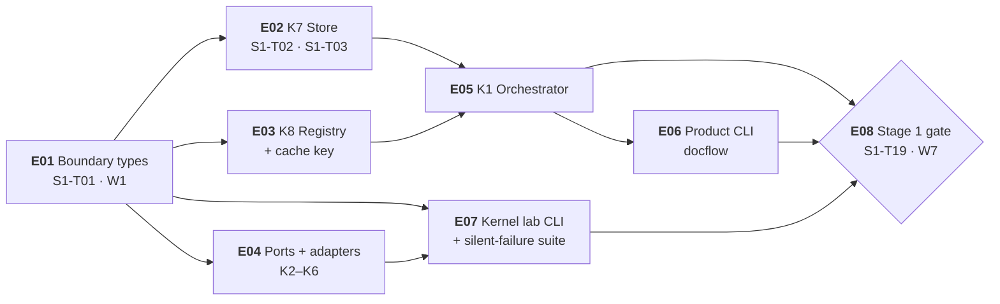

# Plan 1 — Kernels: epics & issues

| Field | Value |
|---|---|
| Scope | The epic/issue breakdown of **Plan 1 — Kernels & ports/adapters** (Stage 1) |
| Source plan | [`../../plan-01-kernels.md`](../../plan-01-kernels.md) — 22 tasks, `S1-T01` … `S1-T22` |
| Issues | **22** — one per `wbs.md` §3 task; **8** epics, cut by capability |
| Task count check | 1 + 2 + 2 + 7 + 5 + 1 + 3 + 1 = **22** |
| Lifecycle stage | **PoC** — close the end-to-end flow, happy path first (`.github/copilot-instructions.md` §5); every shortcut carries `# TODO: [MVP]` or `# TODO: [RELEASE]` |
| Companion links | [Plan 1](../../plan-01-kernels.md) · [Plans index](../../README.md) · [`wbs.md`](../../../artifacts/wbs.md) · [`kernel-cli.md`](../../../artifacts/kernel-cli.md) · [`traceability.md`](../../../artifacts/traceability.md) · [`prd.md`](../../../artifacts/prd.md) · [`sad.md`](../../../artifacts/sad.md) |

---

## 1. What an epic and an issue are here

An **epic** is a *capability* — a coherent slice of the Stage 1 deliverable that can be described, tested and declared done without reference to when it was scheduled. Epics are **not** waves: the wave is when an issue runs, the epic is what it is part of, and the two cuts are orthogonal (§6). An **issue** is exactly one task from `wbs.md` §3 — its title, its `Depends on` set, its deliverable path and its effort signal are reused verbatim, and its immutable identifier is that task ID. **An issue is not new work.** No task is invented, split, merged, renumbered or dropped: the 22 issues are the 22 tasks, and if a count anywhere in this directory disagrees with 22, this directory is wrong.

What the decomposition *adds* is only what a task table cannot carry: an epic boundary with an owner layer and a close condition, acceptance criteria expanded into individually checkable boxes, the test and evidence that proves each one, and the explicit out-of-scope list that stops an issue growing. Where the plan or an artifact already fixed something, this directory **cites** it — `plan-01-kernels.md` §7b, `kernel-cli.md` §11 row 4, `wbs.md` §6.2 — rather than restating it loosely.

---

## 2. Epic map

| Epic | Capability | Task IDs | Issues | Objective (one line) | Four-track lane (`plans/README.md` §6) |
|---|---|---|---|:---:|---|
| **E01** | Boundary types & contracts | `S1-T01` | 1 | Freeze the one interface every kernel, port and component exchanges, such that no third state is expressible. | **3 — Code (for reuse)** |
| **E02** | K7 Store — artifacts & ledger | `S1-T02`, `S1-T03` | 2 | Make bytes durable and content-addressed, and make the ledger's `done` a claim only ever written about durable bytes. | **3 — Code (for reuse)** |
| **E03** | K8 Registry & the cache key | `S1-T04`, `S1-T05` | 2 | Make registry data versioned and fail-fast, and carry it into the cache key as a mandatory term. | **3 — Code (for reuse)** |
| **E04** | Ports & the acquisition/generation adapters (K2–K6) | `S1-T11` … `S1-T17` | 7 | Fix the five port interfaces and land the thin adapters behind them, with no fallback anywhere. | **3 — Code (for reuse)** |
| **E05** | K1 Orchestrator — dispatch, durability, scheduling | `S1-T06` … `S1-T10` | 5 | Drive a graph of stages over units, with durable states, determinism classes, slots, barriers and mandatory verification. | **3 — Code (for reuse)** · **1 — Fast flow** |
| **E06** | Product CLI shell (`docflow`) | `S1-T18` | 1 | Give the product surface the five verbs that make resume observable: `run`, `status`, `jobs`, `pause`, `stop [--force]`. | **1 — Fast flow** |
| **E07** | Kernel lab CLI (`docflow-kernel`) & the silent-failure suite | `S1-T20`, `S1-T21`, `S1-T22` | 3 | Make each kernel's characteristic silent failure an invocable, CI-asserted command before any domain layer exists. | **2 — Golden set / tests** · **4 — CLI (to probe)** |
| **E08** | The Stage 1 gate | `S1-T19` | 1 | Close Stage 1: a synthetic flow that runs, is killed, resumes and is inspected from a shell. | **1 — Fast flow** |

The two single-issue epics are deliberate. `S1-T18` owns `docflow/cli.py`, the **Surface** owner layer (`wbs.md` §8) — a different deliverable surface from the kernel package, so it is its own epic rather than a task inside E05. `S1-T19` is the **gate**: a distinct deliverable class, whose close is the stage's closing criterion and not a capability inside it.

---

## 3. Inter-epic dependency graph

Derived from each issue's `Depends on`, collapsed to epic level. An edge is drawn **only** when an issue in one epic depends on an issue in a *different* epic; intra-epic dependencies are excluded by construction (they are the epic's own internal order, shown in each epic file's §2).

**11 inter-epic edges.** The derivation, so the count can be re-checked:

| # | Edge | Caused by | Kind |
|---:|---|---|---|
| 1 | E01 → E02 | `S1-T02` depends on `S1-T01` | direct |
| 2 | E01 → E03 | `S1-T04` depends on `S1-T01` | direct |
| 3 | E01 → E04 | `S1-T11` depends on `S1-T01` | direct |
| 4 | E01 → E07 | `S1-T20` depends on `S1-T01` | direct |
| 5 | E02 → E05 | `S1-T06` depends on `S1-T03` | direct |
| 6 | E03 → E05 | `S1-T06` depends on `S1-T05` | direct |
| 7 | E04 → E07 | `S1-T21` depends on each of `S1-T12` … `S1-T17` | direct |
| 8 | E05 → E06 | `S1-T18` depends on `S1-T06` | direct |
| 9 | E05 → E08 | `S1-T19` depends on `S1-T09`, `S1-T10` | direct |
| 10 | E06 → E08 | `S1-T19` depends on `S1-T18` | direct |
| 11 | E07 → E08 | `S1-T19` depends on `S1-T22` (hard predecessor) | direct |

Excluded as **intra-epic** and therefore not drawn — **15 task-level edges**, enumerated so the exclusion is checkable:

| Epic | Intra-epic edges excluded | Count |
|---|---|:---:|
| E02 | `S1-T03` ← `S1-T02` | 1 |
| E03 | `S1-T05` ← `S1-T04` | 1 |
| E04 | `S1-T12`…`S1-T17` ← `S1-T11` (the port fan-out), plus `S1-T17` ← `S1-T15` and `S1-T17` ← `S1-T16` | 8 |
| E05 | `S1-T07` ← `S1-T06`, `S1-T08` ← `S1-T06`, `S1-T09` ← `S1-T07`, `S1-T10` ← `S1-T07` | 4 |
| E07 | `S1-T21` ← `S1-T20`, `S1-T22` ← `S1-T21` | 2 |
| **Total** | | **15** |

**11 + 15 = 26 task-level dependency edges in Stage 1**, which is every edge in `wbs.md` §3's `Depends on` column for `S1-T01`–`S1-T22`. The 11 inter-epic edges above are the complete collapsed set — re-derivable from that column, and **drawing fewer would drop a real edge** (`E04 → E07` alone is the dependency the plan's execution risk 1 turns on).

E01, E06 and E08 have no intra-epic edges: they are single-issue epics.

**Read the graph as the plan's two chains.** E01→E02→E05→E06→E08 is the **serial kernel spine** (9 links at task level: `T01→T02→T03→T04→T05→T06→T07→T09→T18→T19`, `wbs.md` §6.2). E01→E07→E08 is the **parallel harness chain** (3 links: `T20→T21→T22`). Both converge on E08, and the shorter chain is the one that cannot slip past it.

---

## 4. Issues

Master table — issue → epic → wave → effort. This doubles as the tracker-export table.

| Issue | Epic | `wbs.md` task | Title | Wave | Effort | Owner layer (`wbs.md` §8) |
|---|---|---|---|:---:|:---:|---|
| `E01-01` | E01 | `S1-T01` | Freeze kernel boundary types | W1 | M | Kernels |
| `E02-01` | E02 | `S1-T02` | K7 store: content-addressed put/get, atomic write, `verify`, never-empty `get` | W2 | L | Kernels |
| `E02-02` | E02 | `S1-T03` | K7 ledger write path: `begin`/`commit`/`fail`, `read_ledger`, `write_ledger` | W3 | L | Kernels |
| `E03-01` | E03 | `S1-T04` | K8 registry: load, schema-validate, fail fast, `registry_hash` | W2 | M | Kernels |
| `E03-02` | E03 | `S1-T05` | Cache key: the 7-term formula including registry hash and model revision | W3 | M | Kernels |
| `E04-01` | E04 | `S1-T11` | Ports: `PdfSource`, `OcrEngine`, `LlmEngine`, `ArtifactStore`, `Registry` | W2 | M | Kernels |
| `E04-02` | E04 | `S1-T12` | K2 `kernel.pdf` thin: `probe`, `classify`, `extract_tokens`, `render`, `split` | W3 | L | Kernels |
| `E04-03` | E04 | `S1-T13` | K3 `kernel.image` thin: `load`, `legibility`, `rescale`, `crop` | W3 | M | Kernels |
| `E04-04` | E04 | `S1-T14` | K4 `kernel.ocr` port + Docling adapter | W3 | L | Kernels |
| `E04-05` | E04 | `S1-T15` | K5 `kernel.llm.local` port + Ollama adapter | W3 | L | Kernels |
| `E04-06` | E04 | `S1-T16` | K6 `kernel.llm.frontier` port + one provider adapter | W3 | L | Kernels |
| `E04-07` | E04 | `S1-T17` | Resolution by capability + fail fast on unknown provider/model | W4 | S | Kernels |
| `E05-01` | E05 | `S1-T06` | K1 orchestrator core: unit / stage / graph / ledger / manifest, dependency dispatch | W4 | L | Kernels |
| `E05-02` | E05 | `S1-T07` | K1 durable states: the 7 states, `running` written **before** the work starts | W5 | L | Kernels |
| `E05-03` | E05 | `S1-T08` | Determinism classes + resume consequence | W5 | M | Kernels |
| `E05-04` | E05 | `S1-T09` | Typed slots + barriers + unit-contained failure | W6 | M | Kernels |
| `E05-05` | E05 | `S1-T10` | Mandatory verification on every ledger read, with **no flag** | W6 | S | Kernels |
| `E06-01` | E06 | `S1-T18` | CLI shell: `run` (idempotent), `status`, `jobs`, `pause`, `stop [--force]` | W5 | M | **Surface** |
| `E07-01` | E07 | `S1-T20` | `docflow-kernel` entry point: dispatch, `--list`, exit codes, JSON envelope, `--save` | W2 | M | Kernels |
| `E07-02` | E07 | `S1-T21` | Per-kernel subcommands, 1:1 with port methods | W5 (opens) · completes only when W3 is terminal | L | Kernels |
| `E07-03` | E07 | `S1-T22` | Silent-failure suite: one assertion per row of the 17-row matrix | W6 | L | Kernels |
| `E08-01` | E08 | `S1-T19` | **Stage 1 closing flow (synthetic)** | W7 | L | Kernels |

Effort totals: **11 × L · 9 × M · 2 × S = 22**. `S`/`M`/`L` are the relative-complexity signal of `wbs.md` §7 — implementation *and* verification — never calendar time, story points or velocity.

---

## 5. Wave cross-cut — the orthogonal view

Waves are derived from the `Depends on` column (`plan-01-kernels.md` §5); epics are cut by capability. The two cuts partition the **same 22 tasks**, and the table below shows that crossing them never produces an overlap or a gap.

| Wave | Issues | Epics spanned | Epic span | Why this wave |
|---|---|---:|---|---|
| **W1** | `E01-01` | 1 | E01 | The boundary types have no dependency; nothing else can start. |
| **W2** | `E02-01`, `E03-01`, `E04-01`, `E07-01` | 4 | E02 · E03 · E04 · E07 | All four depend only on `S1-T01`. The harness chain opens here in parallel with the kernel chain. |
| **W3** | `E02-02`, `E03-02`, `E04-02`, `E04-03`, `E04-04`, `E04-05`, `E04-06` | 3 | E02 · E03 · E04 | Each depends only on W2 results — the store's atomic write, the registry hash, the port interfaces. |
| **W4** | `E05-01`, `E04-07` | 2 | E05 · E04 | `S1-T06` needs `S1-T03` **and** `S1-T05`; `S1-T17` needs `S1-T15` and `S1-T16`. Both first-satisfied here. |
| **W5** | `E05-02`, `E05-03`, `E06-01`, `E07-02` | 3 | E05 · E06 · E07 | All depend on `S1-T06` and nothing else unfinished. `S1-T21` **opens** here; it does not complete here. |
| **W6** | `E05-04`, `E05-05`, `E07-03` | 2 | E05 · E07 | `S1-T09`/`S1-T10` need `S1-T07`; `S1-T22` needs `S1-T21`. The two chains are one wave from the gate. |
| **W7** | `E08-01` | 1 | E08 | The join of both chains: `S1-T09`, `S1-T10`, `S1-T18`, `S1-T22`. The gate itself. |

| Epic | Waves its issues occupy | Issues |
|---|---|---|
| E01 | W1 | 1 |
| E02 | W2, W3 | 2 |
| E03 | W2, W3 | 2 |
| E04 | W2, W3, W4 | 7 |
| E05 | W4, W5, W6 | 5 |
| E06 | W5 | 1 |
| E07 | W2, W5, W6 | 3 |
| E08 | W7 | 1 |

**The cuts are orthogonal, not nested.** E04 spans three waves (its adapters land in W3, its resolution step waits for W4); E07 spans three non-adjacent waves (W2 → W5 → W6); W2 spans four epics. No epic is a wave and no wave is an epic. What the wave order buys is stated in `plan-01-kernels.md` §9 ("Plan-specific execution risk") and is not repeated here.

---

## 6. Coverage check

| Epic | Issues expected | Issues present | Sum check |
|---|---:|---:|---|
| E01 | 1 | `S1-T01` | 1 |
| E02 | 2 | `S1-T02`, `S1-T03` | 3 |
| E03 | 2 | `S1-T04`, `S1-T05` | 5 |
| E04 | 7 | `S1-T11` … `S1-T17` | 12 |
| E05 | 5 | `S1-T06` … `S1-T10` | 17 |
| E06 | 1 | `S1-T18` | 18 |
| E07 | 3 | `S1-T20`, `S1-T21`, `S1-T22` | 21 |
| E08 | 1 | `S1-T19` | **22** |

**Every one of `S1-T01` … `S1-T22` appears exactly once.** The arithmetic is re-checkable against the master table in §4: 1 + 2 + 2 + 7 + 5 + 1 + 3 + 1 = 22, and the "Sum check" column is a running total ending at 22. No task ID appears under two epics; no ID in the range 01–22 is absent; no ID outside the range exists. There is no `S1-T23`.

**`S1-T19` is last by wave despite being numbered 19.** It is numbered 19 because it was appended to `wbs.md` after `S1-T18` as the closing criterion, but it sits in **Wave 7** — the last wave — because its dependency set (`S1-T09`, `S1-T10`, `S1-T18`, `S1-T22`) is the largest in the plan. Ordering by ID would place the gate between `S1-T18` and `S1-T20` and would be wrong. **Every ordering in this directory is by wave; the ID is an identifier, never a position.**

---

## 7. The three non-negotiables

Carried verbatim from [`plans/README.md` §2](../../README.md) and not restated here. Each is cited so that an issue's acceptance criteria can point at the artifact rather than paraphrase it:

| # | Non-negotiable | Cited at |
|---:|---|---|
| 1 | **Never write `done` about non-durable bytes** | `prd.md` FR-04 · `sad.md` §7.1 · issues `E02-02`, `E05-02` |
| 2 | **Verification is an outcome of every ledger read and there is no flag for it** | `prd.md` FR-05 · ADR-006 · `kernel-cli.md` §9 · issue `E05-05` |
| 3 | **A sampled artifact is evidence and is never regenerated** | `prd.md` FR-09 · `sad.md` §4 · issues `E05-03`, `E07-03` |

The fixed decisions that hold across all three plans are tabulated in `plans/README.md` §2; the frozen contract this plan publishes at its gate is `plans/README.md` §3. Where an issue "touches a frozen contract", it names the row in §3 and nothing more.

---

## 8. Reading order and status legend

**Reading order.** This file first. Then `epic-01…epic-08` in numeric order — E01 publishes the type every later epic consumes, E08 consumes everything. Within an epic file: the header table gives the span and the totals, §2 the issue list, §3 the detail in wave order, §4 the close condition, §5 traceability, §6 risks.

| Field / marker | Meaning |
|---|---|
| `E0n-0m` | Epic-scoped sequential issue key, stable across edits. The `wbs.md` task ID beside it is the authoritative link. |
| `S1-Txx` | Immutable identifier from `wbs.md` §3. Never renumbered, never reused. |
| `W1` … `W7` | Wave, derived from the `Depends on` column (`plan-01-kernels.md` §5). Ordering key. |
| `S` / `M` / `L` | Effort signal from `wbs.md` §7 — relative complexity of implementation **and verification**. |
| Owner layer | `Kernels` / `Domain` / `Surface` / `Data`, by artifact path (`wbs.md` §8). Never a person. |
| `# TODO: [MVP]` | A PoC shortcut a real MVP must replace. |
| `# TODO: [RELEASE]` | Telemetry, caching, HA, security — lifecycle §5 final stage. |
| **Never** | Forbidden by design. Appears in an *Out of scope* list, never as a deferred plan. |
| `now` / `MVP` | `kernel-cli.md` §9 per-command status: `now` dispatches in Stage 1, `MVP` exits `4` naming the operation as unavailable. |
| Status | `todo` while nothing exists; `in progress` once work starts; `done` when the issue's own criteria are met and its evidence re-run. The status lives in the epic header's `Issues` cell and in that issue's §3 block — **those two are the tracker, and this line is only the legend.** A stale status is worse than no status: the header of `epic-02` said `todo` for two `done` issues until `E05-01` corrected it. |

**A stage is `done` only when its flow closes, and this directory does not restate that — it inherits it.** Ticking all 22 issues does **not** close Stage 1: `E08-01` (`S1-T19`) is the gate, and it closes when the synthetic flow is **observed** — run, killed, resumed and inspected from a shell (`plans/README.md` §2, `wbs.md` §1, `plan-01-kernels.md` §11). An issue can be `done` inside a plan whose gate is not, and it stays `done`; what it cannot do is authorise Plan 2. The three non-negotiables in §7 are the ones that make `done` mean something, and Track 3 in particular is judged at the gate rather than during the wave: reusability is a claim about a **consumer**, and no amount of green boxes here proves it.

**Open decisions are not resolved in this directory.** Each belongs to the issue that touches it and is referenced by number from `plan-01-kernels.md` §12 — never silently closed.
