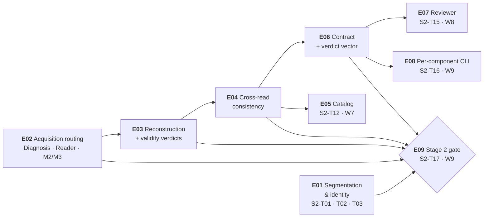

# Plan 2 — Components: epics & issues

| Field | Value |
|---|---|
| Scope | The epic/issue breakdown of **Plan 2 — Domain components** (Stage 2) |
| Source plan | [`../../plan-02-components.md`](../../plan-02-components.md) — 17 tasks, `S2-T01` … `S2-T17` |
| Issues | **17** — one per `wbs.md` §4 task; **9** epics, cut by capability |
| Task count check | 3 + 3 + 3 + 2 + 1 + 2 + 1 + 1 + 1 = **17** |
| Lifecycle stage | **PoC** — close the end-to-end flow, happy path first (`.github/copilot-instructions.md` §5); every shortcut carries `# TODO: [MVP]` or `# TODO: [RELEASE]` |
| Companion links | [Plan 2](../../plan-02-components.md) · [Plan 1 decomposition](../plan-01-kernels/README.md) · [Plans index](../../README.md) · [`wbs.md`](../../../artifacts/wbs.md) · [`traceability.md`](../../../artifacts/traceability.md) · [`prd.md`](../../../artifacts/prd.md) · [`sad.md`](../../../artifacts/sad.md) · [`kernel-cli.md`](../../../artifacts/kernel-cli.md) |

---

## 1. What an epic and an issue are here

An **epic** is a *capability* — a coherent slice of the Stage 2 deliverable that can be described, tested and declared done without reference to when it was scheduled. Epics are **not** waves: the wave is when an issue runs, the epic is what it is part of, and the two cuts are orthogonal (§5). An **issue** is exactly one task from `wbs.md` §4 — its title, its `Depends on` set, its deliverable path and its effort signal are reused verbatim, and its immutable identifier is that task ID. **An issue is not new work.** No task is invented, split, merged, renumbered or dropped: the 17 issues are the 17 tasks, and if a count anywhere in this directory disagrees with 17, this directory is wrong.

What the decomposition *adds* is only what a task table cannot carry: an epic boundary with an owner layer and a close condition, acceptance criteria expanded into individually checkable boxes, the test and evidence that proves each one, and the explicit out-of-scope list that stops an issue growing. Where the plan or an artifact already fixed something, this directory **cites** it — `plan-02-components.md` §7b, `plans/README.md` §3, `wbs.md` §6.2 — rather than restating it loosely.

Three properties specific to Stage 2 are load-bearing here:

1. **A component imports ports only, never adapters** (`sad.md` §1, `plan-02-components.md` §4 entry condition 6). Every issue's `Owner` and `Frozen contract touched` fields state this where it applies, and the import-isolation check `S1-T11` established is the test.
2. **No threshold is a constant inside a component** (ADR-009, `prd.md` NFR-06a). Thresholds are registry data with no CLI flag and no environment variable; the issues that touch a threshold say so explicitly.
3. **The canonical chain is the closing criterion, not the production route** (`plan-02-components.md` §3, `wbs.md` §6.2). `E01`, `E03`'s head and `E05` are on the path because the *demo* walks the chain — not because a pipeline runs them over the corpus. `traceability.md` §7.3 defect 16 exists because those two claims were once collapsed into one.

---

## 2. Epic map

| Epic | Capability | Task IDs | Issues | Objective (one line) | Four-track lane (`plans/README.md` §6) |
|---|---|---|---|:---:|---|
| **E01** | Segmentation & document identity | `S2-T01`, `S2-T02`, `S2-T03` | 3 | Cut the file into documents that never merge across a real boundary, and give every cut and every type a reason. | **1 — Fast flow** · **2 — Golden set / tests** |
| **E02** | Acquisition routing — Diagnosis & Reader | `S2-T04`, `S2-T05`, `S2-T06` | 3 | Route each **page** to conversion or OCR on **quality**, never on presence, and hand forward positioned tokens with no order resolved. | **1 — Fast flow** · **2 — Golden set / tests** |
| **E03** | Reconstruction & the validity verdicts | `S2-T07`, `S2-T08`, `S2-T09` | 3 | Turn tokens into a document with a reading order, then judge it with four independent checks whose "could not" has exactly one owner. | **1 — Fast flow** · **2 — Golden set / tests** |
| **E04** | Cross-read consistency — normalization & contrast | `S2-T10`, `S2-T11` | 2 | Compare values rather than spellings, and let a second, differently-failing read contradict the first — with arithmetic breaking the tie. | **1 — Fast flow** · **2 — Golden set / tests** |
| **E05** | External identity — the Catalog | `S2-T12` | 1 | Make `unverified` a fact with a reason, distinguishable from a rejection and from never having been attempted. | **1 — Fast flow** · **2 — Golden set / tests** |
| **E06** | Emission — the Contract & the verdict vector | `S2-T13`, `S2-T14` | 2 | Emit only when every page is resolved, and emit six independent verdicts plus a per-field trace — never a score. | **1 — Fast flow** · **2 — Golden set / tests** · **3 — Code (for reuse)** |
| **E07** | Reviewer — the return loop | `S2-T15` | 1 | Land cases beside their document with provenance, and promote a correction into registry data that invalidates the right cache keys. | *(none — see §2's note)* |
| **E08** | Per-component CLI — the probe surface (`docflow`) | `S2-T16` | 1 | Run any one of the 10 components from the previous component's artifact to its own, without repeating the ones before it. | **4 — CLI (to probe)** |
| **E09** | The Stage 2 gate (real document) | `S2-T17` | 1 | Close Stage 2: a real document traverses the canonical chain through an `ErpVR` code and the contrast case reproduces end to end. | **1 — Fast flow** |

**Why 9 epics and not 8.** A first candidate cut merged `S2-T15` (Reviewer) and `S2-T16` (per-component CLI) into one epic, on the grounds that both are Domain-adjacent and neither gates `S2-T17`. **It was rejected on Plan 1's own stated rule.** Plan 1's README §2 and its `epic-06` §1 both justify `S1-T18`'s single-issue epic by owner layer: `S1-T18` owns `docflow/cli.py`, the **Surface** layer (`wbs.md` §8), and folding it into a Kernels epic "would put two different owner layers inside one epic". `S2-T16` is the exact structural analogue: it is the **only** Stage 2 task whose owner layer is **Surface** (`wbs.md` §8 assigns `S2-T16` to `docflow/cli.py`), while `S2-T15` is **Domain** (`docflow/components/reviewer.py`). The three arguments against merging:

- **The two issues are not one capability.** "Cases land beside their document and a promoted rule becomes K8 data" and "each of the 10 components runs standalone from the previous artifact" are independently describable, independently testable, and have no shared acceptance criterion. The only thing they share is a wave — which is precisely the cut this directory is required to keep orthogonal to.
- **The merged epic's close condition would be a conjunction of two unrelated clauses**, i.e. exactly the shape §4 of each epic file exists to avoid.
- **Precedent is explicit, not inferred.** Plan 1 cut the Surface task out *and said why*. Mirroring that reasoning is the point of this directory being a sibling rather than a different document style.

The alternative arithmetic, recorded so the choice is auditable: **8 epics → 3+3+3+2+1+2+2+1 = 17**, with `E07` = `S2-T15` + `S2-T16` and the gate as `E08`. The task count is identical either way; only the boundary moves. **9 epics is the cut taken here, and every count in this directory is stated for 9.**

**A second single-issue epic is deliberate.** `E05` (`S2-T12`, Catalog) is one issue because the Catalog is a **leaf**: `plan-02-components.md` §5 draws its edge dotted — *"emitted, never run — its only output today is reason `not_run`"* — and no pipeline invokes it in the PoC. Its capability is a verdict *vocabulary* rather than a stage of the chain, and it is the epic that carries the plan's load-bearing open decision #1 (§6).

**`E07` is named by no track, and that is worth stating rather than hiding.** `plan-02-components.md` §13's four tracks name `S2-T17` (Track 1), `S2-T11`/`S2-T14` (Track 2), `S2-T13`/`S2-T14` (Track 3) and `S2-T16` (Track 4). The Reviewer appears in none of them — the same shape as its FR gap in `plan-02-components.md` §8. The lane column says *(none)* rather than inventing an assignment.

---

## 3. Inter-epic dependency graph

Derived from each issue's `Depends on`, collapsed to epic level. An edge is drawn **only** when an issue in one epic depends on an issue in a *different* epic; intra-epic dependencies are excluded by construction (they are the epic's own internal order, shown in each epic file's §2).

**11 inter-epic edges.** The derivation, so the count can be re-checked:

| # | Edge | Caused by | Kind |
|---:|---|---|---|
| 1 | E02 → E03 | `S2-T07` depends on `S2-T05` | direct |
| 2 | E03 → E04 | `S2-T10` depends on `S2-T08` | direct |
| 3 | E04 → E05 | `S2-T12` depends on `S2-T11` | direct |
| 4 | E04 → E06 | `S2-T13` depends on `S2-T11` | direct |
| 5 | E06 → E07 | `S2-T15` depends on `S2-T13` | direct |
| 6 | E06 → E08 | `S2-T16` depends on `S2-T14` | direct |
| 7 | E01 → E09 | `S2-T17` depends on `S2-T03` | direct — branch join |
| 8 | E02 → E09 | `S2-T17` depends on `S2-T06` | direct — branch join |
| 9 | E03 → E09 | `S2-T17` depends on `S2-T09` | direct — branch join |
| 10 | E04 → E09 | `S2-T17` depends on `S2-T11` | direct — branch join |
| 11 | E06 → E09 | `S2-T17` depends on `S2-T14` | direct — branch join |

**No epic pair appears twice**, so the collapse from 11 task-level edges to 11 epic-level edges is **lossless**: nothing is merged away and no edge is drawn that is not caused by a named task dependency.

Excluded as **intra-epic** and therefore not drawn — **8 task-level edges**, enumerated so the exclusion is checkable:

| Epic | Intra-epic edges excluded | Count |
|---|---|:---:|
| E01 | `S2-T02` ← `S2-T01`, `S2-T03` ← `S2-T02` | 2 |
| E02 | `S2-T05` ← `S2-T04`, `S2-T06` ← `S2-T05` | 2 |
| E03 | `S2-T08` ← `S2-T07`, `S2-T09` ← `S2-T08` | 2 |
| E04 | `S2-T11` ← `S2-T10` | 1 |
| E06 | `S2-T14` ← `S2-T13` | 1 |
| **Total** | | **8** |

E05, E07, E08 and E09 have no intra-epic edges: they are single-issue epics.

**11 + 8 = 19 task-level dependency edges in Stage 2**, which is every edge in `wbs.md` §4's `Depends on` column whose head is a Stage 2 task. Re-derivable in one line: 14 edges whose head is `S2-T01`…`S2-T14`, plus the **5** edges that terminate on `S2-T17` (`T03`, `T06`, `T09`, `T11`, `T14`). The 11 inter-epic edges above are the complete collapsed set.

**Edges that cross the Stage 1 gate are excluded by construction, and there are 5 of them** — counted separately so they are neither lost nor double-counted: `S2-T01` ← `S1-T19`; `S2-T04` ← `S1-T12`, `S1-T13`; `S2-T05` ← `S1-T14`; `S2-T09` ← `S1-T13`. All five enter from Plan 1's frozen row (`plans/README.md` §3); **none leaves Stage 2 for an earlier stage.** They are the reason `E01` and `E02` are roots with no Stage 2 predecessor.

**Read the graph as the plan's two chains.** `E02 → E03 → E04 → E06 → E09` is the **nine-link working chain** (`S2-T04 → T05 → T07 → T08 → T10 → T11 → T13 → T14 → T17`, `wbs.md` §6.2) and it is the schedule driver. `E01 → E09` is the **three-link segmentation chain** (`S2-T01 → T02 → T03`) — *mandatory but not the driver* (`plan-02-components.md` §5, §9 risk 1). Both converge on `E09`, and the shorter chain is the one that must not be started late, because it was available since W1 and `S2-T17` still waits on it.

**Note what is *not* in the graph.** There is no edge `E01 → E03`, no edge `E05 → E09`, and no edge from `E05` to anything except through `E04`. The first is the canonical chain's own ordering (the Segmenter feeds Diagnosis through the *file*, not through a task dependency — `S2-T04` depends only on `S1-T12`/`S1-T13`); the second is the Catalog's dotted edge (`plan-02-components.md` §5), which is open decision #1 and is **carried, not resolved**, in `E05`'s §6.

---

## 4. Issues

Master table — issue → epic → wave → effort. This doubles as the tracker-export table.

| Issue | Epic | `wbs.md` task | Title | Wave | Effort | Owner layer (`wbs.md` §8) |
|---|---|---|---|:---:|:---:|---|
| `E01-01` | E01 | `S2-T01` | Segmenter: cut detection + confidence per cut, over-segmenting on doubt | W1 | L | Domain |
| `E01-02` | E01 | `S2-T02` | Identifier: type by text / by shapes / mixed, type **plus evidence**, `other` route | W2 | L | Domain |
| `E01-03` | E01 | `S2-T03` | Re-segmentation loop: **one** pass, page reuse, second pass with two types → review | W3 | M | Domain |
| `E02-01` | E02 | `S2-T04` | Diagnosis: quality-not-presence gate, three outcomes, policy from K8 with **no flag** | W1 | L | Domain |
| `E02-02` | E02 | `S2-T05` | Reader: conversion and OCR paths routed **per page**, positioned tokens, no order | W2 | L | Domain |
| `E02-03` | E02 | `S2-T06` | M2/M3 shared implementation with the rasterization switch at the front | W3 | M | Domain |
| `E03-01` | E03 | `S2-T07` | Reconstructor: minimal layout + cross-page continuity + reading order | W3 | L | Domain |
| `E03-02` | E03 | `S2-T08` | Validator: 4 **independent** checks, most-severe-failure governs, no path skips it | W4 | L | Domain |
| `E03-03` | E03 | `S2-T09` | Validator owns "could not": the escalation ladder and its two cases | W5 | M | Domain |
| `E04-01` | E04 | `S2-T10` | Consistency: normalize before comparing, tolerance by field type | W5 | M | Domain |
| `E04-02` | E04 | `S2-T11` | Consistency across extractors — **contrast** — plus arithmetic tie-break | W6 | L | Domain |
| `E05-01` | E05 | `S2-T12` | Catalog: external identity lookup, `unverified` ≠ invalid, owned retry queue | W7 | M | Domain |
| `E06-01` | E06 | `S2-T13` | Contract: barrier, heterogeneous provenance, per-field `(page, extractor)` trace | W7 | L | Domain |
| `E06-02` | E06 | `S2-T14` | Contract: the verdict vector, `consistency` set only where both reads ran | W8 | M | Domain |
| `E07-01` | E07 | `S2-T15` | Reviewer: `queue`, `correct`, `promote` (corrected datum / new rule / new type) | W8 | M | Domain |
| `E08-01` | E08 | `S2-T16` | Per-component CLI subcommands with the documented read/write artifact chain | W9 | M | **Surface** |
| `E09-01` | E09 | `S2-T17` | **Stage 2 closing flow (real document)** | W9 | L | Domain |

Effort totals: **9 × L · 8 × M · 0 × S = 17**. `S`/`M`/`L` are the relative-complexity signal of `wbs.md` §7 — implementation *and* verification — never calendar time, story points or velocity. Stage 2 has **no `S`**: every task here either carries an invariant whose test must fail when broken, needs a fixture, or spans two artifacts.

**The L/M split, re-counted from `wbs.md` §4's Effort column** so it can be checked without trusting this table: **L** = `S2-T01`, `T02`, `T04`, `T05`, `T07`, `T08`, `T11`, `T13`, `T17` (9) · **M** = `S2-T03`, `T06`, `T09`, `T10`, `T12`, `T14`, `T15`, `T16` (8) · **S** = *(none)*. 9 + 8 + 0 = **17**.

---

## 5. Wave cross-cut — the orthogonal view

Waves are derived from the `Depends on` column (`plan-02-components.md` §5); epics are cut by capability. The two cuts partition the **same 17 tasks**, and the table below shows that crossing them never produces an overlap or a gap.

| Wave | Issues | Epics spanned | Epic span | Why this wave |
|---|---|---|---:|---|
| **W1** | `E01-01`, `E02-01` | 2 | E01 · E02 | `S2-T01` depends on `S1-T19`, `S2-T04` on `S1-T12`/`S1-T13` — all terminal when Plan 2 starts. The two branch heads that can begin immediately. |
| **W2** | `E01-02`, `E02-02` | 2 | E01 · E02 | `S2-T02` needs `S2-T01`; `S2-T05` needs `S2-T04` **and** `S1-T14`. The acquisition and segmentation branches advance in parallel. |
| **W3** | `E01-03`, `E02-03`, `E03-01` | 3 | E01 · E02 · E03 | `S2-T03` needs `S2-T02`; `S2-T06` and `S2-T07` both need `S2-T05`. Branch A closes its third link; branch B closes and branch C opens. |
| **W4** | `E03-02` | 1 | E03 | `S2-T08` needs `S2-T07` and nothing else. The busiest node is **alone in its wave** — the honest picture: three branches wait on it. |
| **W5** | `E03-03`, `E04-01` | 2 | E03 · E04 | `S2-T09` and `S2-T10` both need `S2-T08`. Branch C's fourth link and branch D's first link open together. |
| **W6** | `E04-02` | 1 | E04 | `S2-T11` needs `S2-T10`. This is the contrast task — the one the whole architecture exists for — and it gates branches D and E simultaneously. |
| **W7** | `E05-01`, `E06-01` | 2 | E05 · E06 | `S2-T12` and `S2-T13` both need `S2-T11`. The Catalog (a leaf, emitted but never run) and the Contract's barrier open together. |
| **W8** | `E06-02`, `E07-01` | 2 | E06 · E07 | `S2-T14` and `S2-T15` both need `S2-T13`. Branch E closes its second link; the Reviewer opens. Neither is a dependency of the gate. |
| **W9** | `E08-01`, `E09-01` | 2 | E08 · E09 | `S2-T17` is the join of `S2-T03`, `S2-T06`, `S2-T09`, `S2-T11`, `S2-T14`; `S2-T16` needs `S2-T14` only. **The gate wave.** |

| Epic | Waves its issues occupy | Issues |
|---|---|---|
| E01 | W1, W2, W3 | 3 |
| E02 | W1, W2, W3 | 3 |
| E03 | W3, W4, W5 | 3 |
| E04 | W5, W6 | 2 |
| E05 | W7 | 1 |
| E06 | W7, W8 | 2 |
| E07 | W8 | 1 |
| E08 | W9 | 1 |
| E09 | W9 | 1 |

**The cuts are orthogonal, not nested.** E01 and E02 each span three waves and are **entirely parallel** — they share no epic edge at all (§3), which is the sharpest evidence that the wave map is not the epic cut in disguise: two epics running side by side across the same three waves. E03 spans three waves (its Reconstructor lands in W3, its Validator is alone in W4, its ladder in W5); E06 spans two (the barrier in W7, the vector in W8). W3 spans **three** epics; W9 spans two — and one of W9's two issues, `E08-01`, is explicitly **not** a gate dependency, so the gate wave contains a task the gate does not wait on. No epic is a wave and no wave is an epic.

**Two waves are one-issue waves** (W4, W6), and both are on the nine-link chain. That is not an artefact of the cut: `S2-T08` and `S2-T11` are the two nodes the plan's own analysis singles out — the busiest node, and the task that gates branches D and E at once. What the wave order buys is stated in `plan-02-components.md` §9's four execution risks and is not repeated here.

---

## 6. Coverage check

| Epic | Issues expected | Issues present | Sum check |
|---|---:|---:|---|
| E01 | 3 | `S2-T01`, `S2-T02`, `S2-T03` | 3 |
| E02 | 3 | `S2-T04`, `S2-T05`, `S2-T06` | 6 |
| E03 | 3 | `S2-T07`, `S2-T08`, `S2-T09` | 9 |
| E04 | 2 | `S2-T10`, `S2-T11` | 11 |
| E05 | 1 | `S2-T12` | 12 |
| E06 | 2 | `S2-T13`, `S2-T14` | 14 |
| E07 | 1 | `S2-T15` | 15 |
| E08 | 1 | `S2-T16` | 16 |
| E09 | 1 | `S2-T17` | **17** |

**Every one of `S2-T01` … `S2-T17` appears exactly once.** The arithmetic is re-checkable against the master table in §4: 3 + 3 + 3 + 2 + 1 + 2 + 1 + 1 + 1 = 17, and the "Sum check" column is a running total ending at 17. No task ID appears under two epics; no ID in the range 01–17 is absent; no ID outside the range exists. There is no `S2-T18`.

**The stage total is 53 − 22 − 14 = 17**, checked against the two sibling plans: `S1-T01`…`S1-T22` (22, Plan 1) and `S3-T01`…`S3-T14` (14, Plan 3) account for the remaining 36 of `wbs.md`'s 53 tasks. Stage 2's 17 are a contiguous block of the numbering, and `wbs.md` §4's table is the authority for it.

**`S2-T16` and `S2-T17` share Wave 9, and `S2-T17` is last by *role*, not by number.** `S2-T16` is the per-component CLI — it depends only on `S2-T14`, so it is first-satisfied at W8 and lands in W9 (`plan-02-components.md` §5). `S2-T17` is the gate: it cannot be satisfied before W9 because its dependency set is the largest in the plan (five tasks across five epics). **Every ordering in this directory is by wave; the ID is an identifier, never a position.**

---

## 7. The three non-negotiables

Carried verbatim from [`plans/README.md` §2](../../README.md) and not restated here. Each is cited so that an issue's acceptance criteria can point at the artifact rather than paraphrase it — **and each is mapped to the Stage 2 issues that actually carry it, which are not Plan 1's:**

| # | Non-negotiable | Cited at | Stage 2 carriers | Why these |
|---:|---|---|---|---|
| 1 | **Never write `done` about non-durable bytes** | `prd.md` FR-04 · `sad.md` §7.1 · Plan 1's `E02-02`, `E05-02` | `E02-02` (`S2-T05`), `E06-01` (`S2-T13`), `E09-01` (`S2-T17`) | The writer is Plan 1's; Stage 2's obligation is not to *read* or *emit over* a non-durable artifact. `E02-02` is the component whose outputs are written through K7 (its `r` path is deterministic, its `p` path sampled); `E06-01` is the barrier — emission waits until every page is resolved; `E09-01` is `plan-02-components.md` §6 step 10, which *"exercises [the invariant] through a domain component"* |
| 2 | **Verification is an outcome of every ledger read and there is no flag for it** | `prd.md` FR-05 · ADR-006 · Plan 1's `E05-05` | `E03-02` (`S2-T08`), `E08-01` (`S2-T16`), `E09-01` (`S2-T17`) | `E03-02` is where the analogue lives inside a component: §7b's row *"No code path skips validation"* targets `S2-T08` (`FR-18`, ADR-002) — validation, like ledger verification, is an outcome and never a request; `E08-01` is the Surface where the absence is assertable (*"No shortcut around validation — no `--no-validate` on any surface"*, §13 Track 4); `E09-01` reads every ledger in §6 steps 5 and 10 |
| 3 | **A sampled artifact is evidence and is never regenerated** | `prd.md` FR-09 · `sad.md` §4 | `E03-03` (`S2-T09`), `E06-01` (`S2-T13`), `E09-01` (`S2-T17`) | `E03-03` is the escalation ladder, the one place a component is *tempted* to re-read in order to fill a gap — so the ladder must escalate against the **existing** value (invalid → region only), never by re-sampling; `E06-01` is the barrier that refuses to emit over a page whose sampled artifact is missing; `E09-01` is §6 step 10's assertion that a missing sampled `extract.p` artifact reports `failed` rather than being re-sampled |

**Read non-negotiable 3 with `plan-02-components.md` §9** — the row *"Sampled artifact regenerated on resume"* (M/H) is carried in Stage 2 by `E03-03` and `E09-01`, and the plan states where it is exercised: *"exercised through a component in §6 step 10"*.

The fixed decisions that hold across all three plans are tabulated in `plans/README.md` §2; the frozen contract this plan publishes at its gate is `plans/README.md` §3, Plan 2 row. Where an issue "touches a frozen contract", it names the item in that row and nothing more.

---

## 8. Reading order and status legend

**Reading order.** This file first. Then `epic-01` … `epic-09` in numeric order — E01 publishes the segmentation capability the demo's first branch needs, E09 consumes everything and is the gate. Within an epic file: the header table gives the span and the totals, §2 the issue list, §3 the detail in wave order, §4 the close condition, §5 traceability, §6 risks.

**Orientation — the three keys for a Stage 2 task.**

| `S2-Txx` | → `E0n-0m` | Wave | Branch (`plan-02-components.md` §5) |
|---|---|---|
| `S2-T01` | `E01-01` | W1 | A — segmentation |
| `S2-T02` | `E01-02` | W2 | A |
| `S2-T03` | `E01-03` | W3 | A |
| `S2-T04` | `E02-01` | W1 | B — acquisition |
| `S2-T05` | `E02-02` | W2 | B, C |
| `S2-T06` | `E02-03` | W3 | B |
| `S2-T07` | `E03-01` | W3 | C — reconstruction |
| `S2-T08` | `E03-02` | W4 | C, D, E — **the busiest node** |
| `S2-T09` | `E03-03` | W5 | C |
| `S2-T10` | `E04-01` | W5 | D — contrast |
| `S2-T11` | `E04-02` | W6 | D, E |
| `S2-T12` | `E05-01` | W7 | E — emission (dotted; not a gate dependency) |
| `S2-T13` | `E06-01` | W7 | E |
| `S2-T14` | `E06-02` | W8 | E |
| `S2-T15` | `E07-01` | W8 | *not on a branch* |
| `S2-T16` | `E08-01` | W9 | *not on a branch* |
| `S2-T17` | `E09-01` | W9 | **the join of all five** |

| Field / marker | Meaning |
|---|---|
| `E0n-0m` | Epic-scoped sequential issue key, stable across edits. The `wbs.md` task ID beside it is the authoritative link. |
| `S2-Txx` | Immutable identifier from `wbs.md` §4. Never renumbered, never reused. |
| `W1` … `W9` | Wave, derived from the `Depends on` column (`plan-02-components.md` §5). Ordering key. |
| `S` / `M` / `L` | Effort signal from `wbs.md` §7 — relative complexity of implementation **and verification**. |
| Owner layer | `Domain` (`docflow/components/`) / `Surface` (`docflow/cli.py`), by artifact path (`wbs.md` §8). Never a person. |
| `# TODO: [MVP]` | A PoC shortcut a real MVP must replace. |
| `# TODO: [RELEASE]` | Telemetry, caching, HA, security — lifecycle §5 final stage. |
| **Never** | Forbidden by design. Appears in an *Out of scope* list, never as a deferred plan. |
| `r` / `p` / `rp` | The extractor positions of the `EVR` primitive — offset-traced, bbox-traced, both. |
| `ErVR` / `ErpVR` / `EpVR` | The primitives `M1-ErVR`, `M1-ErpVR`, `M1-EpVR`; only the `rp` forms set `consistency` (ADR-003). |
| Status | `todo` for every issue here — no Stage 2 code exists (`plan-02-components.md` §4, entry condition 1). The placeholder is `todo`; update it in place as work lands. |

**A stage is `done` only when its flow closes, and this directory does not restate that — it inherits it.** Ticking all 17 issues does **not** close Stage 2: `E09-01` (`S2-T17`) is the gate, and it closes when a **real** document traverses the canonical chain on **real** adapters and the contrast case reproduces end to end (`plans/README.md` §2, §9 of this file). Plan 1 was allowed to close over faked ports; **this stage is not** (`plan-02-components.md` §13, Track 1). One boundary worth stating where a reader will meet it: **Track 2's claims are asserted here, but one of them is only *complete* at Stage 3.** *"Verdicts stay separate"* and *"failure is partial"* are asserted in this stage (`E06-02`'s absence assertion over the emitted bytes; `E06-01`'s ten-page, one-illegible fixture), and the gate re-asserts the shape on the closing run. What Stage 2 cannot finish is **shape identity across all 13 codes** — ten of those codes are Stage 3 data, so that claim's contract test is `S3-T13`, and a green Stage 2 means the shape holds for the codes this stage exercises, not yet for all thirteen.

**Open decisions are not resolved in this directory.** Each belongs to the issue that touches it and is referenced by number from `plan-02-components.md` §12 — never silently closed. Open decisions **#1, #2 and #3** are marked **load-bearing** by the plan and are reviewed **before `S2-T11` starts**, not at the gate; the issues that carry them state that in their §6.

---

## 9. The Plan 2 gate's closing criterion

`E09` (`S2-T17`) is the gate. Its capability is the stage's closing criterion (`plan-02-components.md` §3): **a real document traverses the canonical chain and emits a verdict vector + trace, with an `ErpVR` chain demonstrating contrast.**

**The gate is a five-branch join.** `S2-T17` waits on five dependencies, each the head of a chain (`wbs.md` §6.2), so the lead time is the **longest** chain and not the sum:

| Branch | Chain | Links | Head issue that closes it | Epic |
|---|---|:---:|---|---|
| **A — segmentation** | `S2-T01 → T02 → T03` | 3 | `E01-03` (`S2-T03`) | E01 |
| **B — acquisition** | `S2-T04 → T05 → T06` | 3 | `E02-03` (`S2-T06`) | E02 |
| **C — reconstruction** | `S2-T05 → T07 → T08 → T09` | 4 | `E03-03` (`S2-T09`) | E03 |
| **D — contrast** | `S2-T08 → T10 → T11` | 3 | `E04-02` (`S2-T11`) | E04 |
| **E — emission** | `S2-T11 → T13 → T14` | 3 | `E06-02` (`S2-T14`) | E06 |

**The longest chain is 9 links** — `S2-T04 → T05 → T07 → T08 → T10 → T11 → T13 → T14 → S2-T17` — and it spans `E02 → E03 → E04 → E06 → E09`. **`S2-T08` is the busiest node**: branches C, D and E all pass through it (`plan-02-components.md` §5, §9 risk 2).

**What may slip, and what may not** (`plans/README.md` §4, `wbs.md` §6.2):

| May slip without delaying the stage close | May not slip |
|---|---|
| `E07-01` (`S2-T15`, Reviewer) and `E08-01` (`S2-T16`, per-component CLI). Both are named in `wbs.md` §6.2's slip list, **and neither appears in `S2-T17`'s dependency set** — the graph confirms it: there is no edge `E07 → E09` and none `E08 → E09` (§3). `E06 → E07` and `E06 → E08` exist, but they are edges *into* the two, not out of them | **`E09-01` (`S2-T17`) and all five branches.** `S2-T17` and its five heads are the stage close; the plan adds the consequence in §9 risk 4 — closing on a single-read primitive (`M1-ErVR`/`M1-EpVR`) would pass the gate with `consistency: null` everywhere while the one claim Stage 2 exists to prove was never exercised, which is why ADR-003 fixes `ErpVR` |
| **`E05-01` (`S2-T12`, Catalog) is a special case**, not a plain slip: it is not in `S2-T17`'s dependency set (the dotted edge, `plan-02-components.md` §5), **but** `FR-23` obliges the Contract (`E06-01`) to emit a `catalog` verdict with the reason `not_run` on every field, and that value is the Catalog's to define. This is open decision #1, and the plan reviews it **before `S2-T11` starts** — either `S2-T17` gains the dependency (moving the Catalog onto the path) or `not_run` is defined where the Contract can reach it. Carried in `E05`'s §6 and `E06`'s §6; **not resolved here** |

**The gate's own evidence is `plan-02-components.md` §3's table** — `consistency` **set** on the `ErpVR` run and `null` on a single-read run; `catalog` present with a reason on **every** field; two of the six Gherkin scenarios closed here or asserted here (`traceability.md` §6): *The 15400 vs 1540 contrast case* (`S2-T11`, asserted by `S2-T17`) and *Partial failure marks one page* (`S2-T13`, asserted by `S2-T17`).

**E09 is not deferrable.** It carries no `# TODO` marker, and its close *is* the stage close: Plan 3's §4 entry condition is `plan-02-components.md` §11's checklist and nothing else (`plans/README.md` §2).
