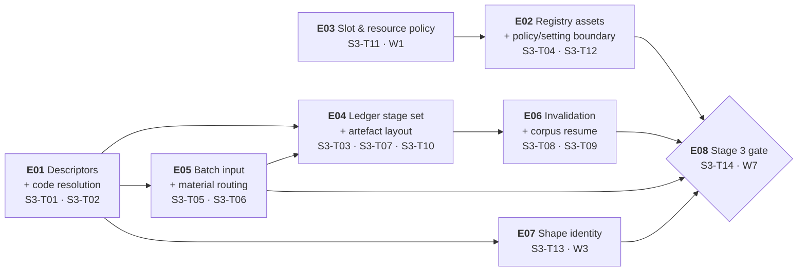

# Plan 3 — Pipelines & corpus: epics & issues

| Field | Value |
|---|---|
| Scope | The epic/issue breakdown of **Plan 3 — Pipelines & corpus** (Stage 3) |
| Source plan | [`../../plan-03-pipelines.md`](../../plan-03-pipelines.md) — 14 tasks, `S3-T01` … `S3-T14` |
| Issues | **14** — one per `wbs.md` §5 task; **8** epics, cut by capability |
| Task count check | 2 + 2 + 1 + 3 + 2 + 2 + 1 + 1 = **14** |
| Lifecycle stage | **PoC** — this plan closes the PoC. Happy path first, flow before edge cases (`.github/copilot-instructions.md` §5); every shortcut carries `# TODO: [MVP]` or `# TODO: [RELEASE]` |
| Companion links | [Plan 3](../../plan-03-pipelines.md) · [Plans index](../../README.md) · [Plan 1 decomposition](../plan-01-kernels/README.md) · [`wbs.md`](../../../artifacts/wbs.md) · [`traceability.md`](../../../artifacts/traceability.md) · [`prd.md`](../../../artifacts/prd.md) · [`sad.md`](../../../artifacts/sad.md) · [`kernel-cli.md`](../../../artifacts/kernel-cli.md) · [Origin spec](../../../../my_prompt.md) |

---

## 1. What an epic and an issue are here

An **epic** is a *capability* — a coherent slice of the Stage 3 deliverable that can be described, tested and declared done without reference to when it was scheduled. Epics are **not** waves: the wave is when an issue runs, the epic is what it is part of, and the two cuts are orthogonal (§5). An **issue** is exactly one task from `wbs.md` §5 — its title, its `Depends on` set, its deliverable path and its effort signal are reused **verbatim**, and its immutable identifier is that task ID. **An issue is not new work.** No task is invented, split, merged, renumbered or dropped: the 14 issues are the 14 tasks, and if a count anywhere in this directory disagrees with 14, this directory is wrong.

What the decomposition *adds* is only what a task table cannot carry: an epic boundary with an owner layer and a close condition, acceptance criteria expanded into individually checkable boxes, the test and evidence that proves each one, and the explicit out-of-scope list that stops an issue growing. Where the plan or an artifact already fixed something, this directory **cites** it — `plan-03-pipelines.md` §7b, `wbs.md` §6.2, `sad.md` §5.1 ADR-009 — rather than restating it loosely.

**The Plan 3-specific twist: this layer adds configuration and data, not code.** `wbs.md` §5 states Stage 3 is *"largely data, not new code"*, and `plan-03-pipelines.md` §10 repeats it as a DoD item: *no new kernel, no new component, no new kernel-boundary type*. So the "capability" of each epic in this directory is a **data/contract capability** — a set of descriptors, assets, settings boundaries, layouts, invalidations, or a shape guarantee — and never a new module. The corollary is the diagnostic rule the whole directory turns on: **an issue in this plan that needed a new type would mean a gate was closed early**, and the correct response is to reopen Plan 1 or Plan 2, not to add the type here.

---

## 2. Epic map

| Epic | Capability | Task IDs | Issues | Objective (one line) | Four-track lane (`plans/README.md` §6) |
|---|---|---|---|:---:|---|
| **E01** | Pipeline descriptors & code resolution | `S3-T01`, `S3-T02` | 2 | Make a pipeline code resolve to a declared descriptor, and make an invalid code an error rather than a silent conversion. | **2 — Golden set / tests** (`S3-T02`) · **3 — Code (for reuse)** (`S3-T01`, `S3-T02`) |
| **E02** | Registry assets & the policy/setting boundary | `S3-T04`, `S3-T12` | 2 | Populate the registry as the sole source of corpus policy, and split policy (no override) from operational settings (CLI → env → `.env` → default). | **3 — Code (for reuse)** (`S3-T04`) · **4 — CLI (to probe)** (`S3-T12`) |
| **E03** | Slot & resource policy for the corpus | `S3-T11` | 1 | Bound the corpus run's CPU and GPU work before the run exists, so per-stage timings stay meaningful. | **4 — CLI (to probe)** — the slot surface behind `--jobs`/`DOCFLOW_JOBS` (`plan-03-pipelines.md` §13) |
| **E04** | Ledger stage set & the artefact layout | `S3-T03`, `S3-T07`, `S3-T10` | 3 | Make the ledger record the stages the primitive implies and the artefacts distinguishable by suffix, with the manifest derived and rebuildable. | **3 — Code (for reuse)** (`S3-T03`) · **4 — CLI (to probe)** (`S3-T07`) |
| **E05** | Batch input & material routing | `S3-T05`, `S3-T06` | 2 | Accept one file, several files or a folder, route each file by material, and mirror the input tree exactly. | **4 — CLI (to probe)** (`S3-T05`, `S3-T06`) |
| **E06** | Invalidation & corpus-scale resume | `S3-T08`, `S3-T09` | 2 | Make a forced reprocess invalidate everything downstream, and make an 11k-file run resumable at the exact stage of the in-flight document. | **4 — CLI (to probe)** (`S3-T08`) |
| **E07** | Shape identity across the 13 codes | `S3-T13` | 1 | Prove that all 13 codes emit one field/verdict/trace shape, so the consumer writes one integration. | **2 — Golden set / tests** (`S3-T13`) |
| **E08** | The Stage 3 gate (corpus) | `S3-T14` | 1 | Close Stage 3 and the PoC: 11k files, one command, interrupted and resumed, with the baseline recorded. | **1 — Fast flow** (`S3-T14`) |

The three single-issue epics are deliberate, and each is a different reason:

- **E03 (`S3-T11`) is slot and resource policy** — a different deliverable from registry *data*. It produces `.env.example` plus slot configuration, and its subject is the machine (cores, VRAM, one in-flight generation per device), not the corpus's semantics. Folding it into E02 would put "how many jobs run" and "what counts as a critical field" in one epic, which are exactly the two surfaces `sad.md` §5.1 requires to stay apart.
- **E07 (`S3-T13`) is the contract test** — a different deliverable *class* from the configuration it verifies. `S3-T02` declares the 13 codes; `S3-T13` asserts they are substitutable. A test that lived inside the epic it tests could be relaxed to match whatever the epic produced, which is the failure `FR-33` exists to prevent (`plan-03-pipelines.md` §13, Track 2).
- **E08 (`S3-T14`) is the gate** — the stage's closing criterion rather than a capability inside it. `plan-03-pipelines.md` §11's exit checklist is what an operator ticks to declare the PoC closed, and E08 is the issue that makes the checklist checkable.

Lane coverage note, stated rather than papered over: `plan-03-pipelines.md` §13 names tracks per task and does **not** name `S3-T09`, `S3-T10` or `S3-T11` in any of its four track rows. The lane column above records the tracks of the tasks §13 does name; the three unenumerated issues are carried by the epics that own them (E03, E04, E06) and no lane is invented for them here.

---

## 3. Inter-epic dependency graph

Derived from each issue's `Depends on`, collapsed to epic level. An edge is drawn **only** when an issue in one epic depends on an issue in a *different* epic; intra-epic dependencies are excluded by construction (they are the epic's own internal order, shown in each epic file's §2).

**10 inter-epic edges**, carried by **12 task-level edges**. The derivation, so the count can be re-checked:

| # | Edge | Caused by | Kind |
|---:|---|---|---|
| 1 | E01 → E04 | `S3-T03` depends on `S3-T02` | direct |
| 2 | E01 → E05 | `S3-T05` depends on `S3-T02` | direct |
| 3 | E01 → E05 | `S3-T06` depends on `S3-T02` | direct |
| 4 | E01 → E07 | `S3-T13` depends on `S3-T02` | direct |
| 5 | E03 → E02 | `S3-T12` depends on `S3-T11` | direct |
| 6 | E05 → E04 | `S3-T07` depends on `S3-T06` | direct |
| 7 | E04 → E06 | `S3-T08` depends on `S3-T07` | direct |
| 8 | E02 → E08 | `S3-T14` depends on `S3-T04` | gate |
| 9 | E02 → E08 | `S3-T14` depends on `S3-T12` | gate |
| 10 | E05 → E08 | `S3-T14` depends on `S3-T05` | gate |
| 11 | E06 → E08 | `S3-T14` depends on `S3-T09` | gate |
| 12 | E07 → E08 | `S3-T14` depends on `S3-T13` | gate |

Twelve task-level edges collapse onto ten distinct epic pairs because **E01 → E05** and **E02 → E08** are each carried twice (rows 2–3 and rows 8–9). Both repeats are real: `S3-T05` and `S3-T06` are two different tasks that each need the resolved codes, and `S3-T04` and `S3-T12` are two different tasks that each gate the corpus run. Collapsing the pairs is what makes the graph readable; it is not a claim that one of the four edges is redundant.

**Intra-epic edges excluded — exactly 3**, enumerated so the exclusion is checkable:

| Epic | Intra-epic edges excluded | Count |
|---|---|:---:|
| E01 | `S3-T02` ← `S3-T01` | 1 |
| E04 | `S3-T10` ← `S3-T07` | 1 |
| E06 | `S3-T09` ← `S3-T08` | 1 |
| **Total** | | **3** |

E02, E03, E05, E07 and E08 have **no** intra-epic edges. E02's two issues are independent at the epic level (`S3-T04` opens in W1 from Plan 1/Plan 2 interfaces; `S3-T12` opens in W2 from `S3-T11`), E05's two issues both wait on `S3-T02` rather than on each other, and E03, E07 and E08 are single-issue epics.

**12 + 3 = 15 in-plan task-level edges** — every `Depends on` entry of the form `S3-Txx` in `wbs.md` §5's Stage 3 table, and no others.

**External entry edges** — a task whose `Depends on` names a Stage 1 or Stage 2 task. These are edges *into* the plan rather than epic edges, and they are why several waves open immediately at the gate:

| Task | External entry edge(s) | Epic it enters | Stage 2 / Stage 1 exit consumed |
|---|---|---|---|
| `S3-T01` | ← `S2-T17` | E01 | Plan 2's closing flow (`plan-02-components.md` §3) |
| `S3-T03` | ← `S1-T03` | E04 | K7 ledger write path (`S1-T03`) |
| `S3-T04` | ← `S1-T04`, `S2-T11` | E02 | K8 registry (`S1-T04`); the validator's escalation ladder (`S2-T11`) |
| `S3-T05` | ← `S2-T04` | E05 | Diagnosis, the quality gate (`S2-T04`) |
| `S3-T06` | ← `S1-T18` | E05 | The product CLI shell (`S1-T18`) |
| `S3-T07` | ← `S1-T06` | E04 | K1 orchestrator core and `rebuild_index()` (`S1-T06`, `kernel-cli.md` §9 `D7`) |
| `S3-T08` | ← `S1-T05` | E06 | The 7-term cache key (`S1-T05`) |
| `S3-T11` | ← `S1-T09`, `S1-T15` | E03 | Typed slots (`S1-T09`); the Ollama adapter's `keep_alive` behaviour (`S1-T15`) |
| `S3-T12` | ← `S1-T04` | E02 | K8 registry, the asset that receives the policy (`S1-T04`) |
| `S3-T13` | ← `S2-T14` | E07 | The Contract: the verdict-vector shape this issue checks (`S2-T14`) |

**10 of the 14 tasks carry an external entry edge** (12 task-level edges: `S3-T04` and `S3-T11` carry two each). **`S3-T02`, `S3-T09`, `S3-T10` and `S3-T14` do not.** That is why several waves open immediately at the gate: `S3-T02` needs only `S3-T01`, `S3-T10` needs only `S3-T07`, `S3-T09` needs only `S3-T08`, and the gate itself depends on nothing outside this plan — every one of its five predecessors is a Stage 3 task. Stage 3 is therefore the one stage whose closing flow is reachable entirely from inside the stage, once Plan 1 and Plan 2 have closed.

`plan-03-pipelines.md` §5 states *"nine of the fourteen tasks depend on Plan 1 or Plan 2 tasks as well as on their Stage 3 peers"*. Recomputed from the `Depends on` column of `wbs.md` §5 (`plan-03-pipelines.md` §5, the ordered task table), the count is **ten**; `S3-T12`'s `S3-T11`, `S1-T04` pair is the one the prose sentence omits. The ten-task figure is the one used here. The plan's own conclusion — *"which is why several waves open immediately at the gate"* — is unaffected and is reproduced above.

**E08 is the join.** Its five predecessors — `S3-T04`, `S3-T05`, `S3-T09`, `S3-T12`, `S3-T13` — span **five** task-level edges into E08 from **four distinct epics**: E02 twice (`S3-T04`, `S3-T12`), E05 (`S3-T05`), E06 (`S3-T09`), E07 (`S3-T13`). E01 and E03 reach the gate only transitively. That asymmetry is the plan's execution risk in graph form: the two branches that reach the gate *directly* through the wider graph are `S3-T13` (shape identity) and `S3-T12` (the policy/setting split), both of which are `M`/`S` effort and both of which the plan names as the expensive ones to skip (`plan-03-pipelines.md` §9).

---

## 4. Issues

Master table — issue → epic → wave → effort → owner. This doubles as the tracker-export table.

| Issue | Epic | `wbs.md` task | Title | Wave | Effort | Owner layer (`wbs.md` §8) |
|---|---|---|---|:---:|:---:|---|
| `E01-01` | E01 | `S3-T01` | Pipeline descriptor schema in K8 (material prefix → extractor → validate → report) | W1 | M | **Data** |
| `E01-02` | E01 | `S3-T02` | The 13 descriptors: `M0-ErVR` … `M4-EpVR` | W2 | M | **Data** |
| `E02-01` | E02 | `S3-T04` | Registry assets: anchors/patterns, extraction prompts, field schemas, policies (critical fields, tolerances) | W1 | **L** | **Data** |
| `E02-02` | E02 | `S3-T12` | **Operational** `DOCFLOW_*` settings + precedence, and policy assets declared as **not** settings | W2 | **S** | **Data** |
| `E03-01` | E03 | `S3-T11` | Slot and resource policy for the corpus | W1 | M | **Data** |
| `E04-01` | E04 | `S3-T03` | Ledger stage set derived from the primitive (`acquire` / `extract.r` / `extract.p` / `validate` / `report`) + `not_applicable` list | W3 | M | **Data** |
| `E04-02` | E04 | `S3-T07` | Output layout + `run.json` + suffix rule | W4 | M | **Surface** |
| `E04-03` | E04 | `S3-T10` | `run.json` presented as derived and rebuildable, never authoritative | W5 | **S** | **Surface** |
| `E05-01` | E05 | `S3-T05` | `--extractor r\|p\|rp` with per-file material selection by Diagnosis | W3 | M | **Surface** |
| `E05-02` | E05 | `S3-T06` | Batch input: one file, several files, one folder; mirrored output tree | W3 | M | **Surface** |
| `E06-01` | E06 | `S3-T08` | `--force`, `--stage`, `--only` with downstream invalidation | W5 | **L** | **Surface** |
| `E06-02` | E06 | `S3-T09` | Resume at corpus scale: per-document granularity, stage-level granularity | W6 | M | **Surface** |
| `E07-01` | E07 | `S3-T13` | Shape-identity verification across all 13 codes | W3 | M | **Data** |
| `E08-01` | E08 | `S3-T14` | **Stage 3 closing flow (corpus)** | W7 | **L** | **Data** + **Surface** |

Effort totals: **3 × L · 9 × M · 2 × S = 14**. The `L` issues are `S3-T04`, `S3-T08` and `S3-T14`; the `S` issues are `S3-T10` and `S3-T12`; the other nine are `M`. `S`/`M`/`L` are the relative-complexity signal of `wbs.md` §7 — implementation **and** verification — and are **never** calendar time, story points or velocity.

Owner layer is by artifact path (`wbs.md` §8): **Data** owns `registry/`, `pyproject.toml`, `.env.example`, `.github/workflows/`; **Surface** owns `docflow/cli.py` and `docflow/batch.py`. Two issues need the column read carefully and both are stated where they occur rather than smoothed over: `E04-01` (`S3-T03`) is **Data** while `E04-02`/`E04-03` are **Surface**, so epic E04 spans both layers; and `S3-T14` is not enumerated in `wbs.md` §8's owner column at all, so `E08`'s owner is recorded as **Data + Surface** — the gate is an integration test plus a baseline report over both layers' artefacts.

---

## 5. Wave cross-cut — the orthogonal view

Waves are derived from the `Depends on` column (`plan-03-pipelines.md` §5); epics are cut by capability. The two cuts partition the **same 14 tasks**, and the table below shows that crossing them never produces an overlap or a gap.

| Wave | Issues | Epics spanned | Epic span | Why this wave |
|---|---|---:|---|---|
| **W1** | `E01-01`, `E02-01`, `E03-01` | 3 | E01 · E02 · E03 | `S3-T01` needs `S2-T17`; `S3-T04` needs `S1-T04` and `S2-T11`; `S3-T11` needs `S1-T09` and `S1-T15`. All three dependencies are satisfied by the two prior gates, so these are the three independent heads — descriptor schema, registry assets, and resource policy. |
| **W2** | `E01-02`, `E02-02` | 2 | E01 · E02 | `S3-T02` needs the descriptor schema; `S3-T12` needs the slot policy **and** K8. Both are first-satisfied here. |
| **W3** | `E04-01`, `E05-01`, `E05-02`, `E07-01` | 3 | E04 · E05 · E07 | All four depend on `S3-T02` and on nothing unfinished. `S3-T03` also needs `S1-T03` (terminal); `S3-T05` also needs `S2-T04`; `S3-T06` also needs `S1-T18`; `S3-T13` also needs `S2-T14`. This is the widest wave in the plan: the ledger stage set, the material selector, batch input, and the shape-identity contract test. |
| **W4** | `E04-02` | 1 | E04 | `S3-T07` needs `S3-T06` and `S1-T06`. The output layout cannot be defined before batch knows what tree it walks. |
| **W5** | `E06-01`, `E04-03` | 2 | E06 · E04 | `S3-T08` needs `S1-T05` and `S3-T07`; `S3-T10` needs `S3-T07`. Both are first-satisfied at Wave 4. |
| **W6** | `E06-02` | 1 | E06 | `S3-T09` needs `S3-T08` — resume at corpus scale cannot be verified before downstream invalidation exists, because the two share the same ledger claims. |
| **W7** | `E08-01` | 1 | E08 | `S3-T14` is the join of `S3-T04`, `S3-T05`, `S3-T09`, `S3-T12`, `S3-T13` and is the gate itself. |

| Epic | Waves its issues occupy | Issues |
|---|---|---|
| E01 | W1, W2 | 2 |
| E02 | W1, W2 | 2 |
| E03 | W1 | 1 |
| E04 | W3, W4, W5 | 3 |
| E05 | W3 | 2 |
| E06 | W5, W6 | 2 |
| E07 | W3 | 1 |
| E08 | W7 | 1 |

**The cuts are orthogonal, not nested.** Four epics span more than one wave — E01 W1→W2, E02 W1→W2, E04 W3→W4→W5, E06 W5→W6 — and no epic's wave span is contiguous-by-construction: E06's two issues straddle the boundary between invalidation and resume because the second cannot be verified before the first exists, while E04's three issues are separated by the batch work of E05 that sits *between* them in the wave order. In the other direction, W3 spans three epics (E01's `S3-T02` output is consumed by E04, E05 and E07), W2 spans two (E01 and E02) and W5 spans two (E06 and E04). **No epic is a wave and no wave is an epic.** Ordering by epic would put `S3-T10` before `S3-T07` and would be wrong; ordering by wave would split E04 into three unrelated pieces and would lose that the manifest's shape is owned by the same capability as the suffix rule.

The wave order's *reason* — what it buys and what skipping it costs — is stated in `plan-03-pipelines.md` §9 ("Plan-specific execution risk") and is carried into the epic files that own each risk, not repeated here.

---

## 6. Coverage check

| Epic | Issues expected | Issues present | Sum check |
|---|---:|---|---:|
| E01 | 2 | `S3-T01`, `S3-T02` | 2 |
| E02 | 2 | `S3-T04`, `S3-T12` | 4 |
| E03 | 1 | `S3-T11` | 5 |
| E04 | 3 | `S3-T03`, `S3-T07`, `S3-T10` | 8 |
| E05 | 2 | `S3-T05`, `S3-T06` | 10 |
| E06 | 2 | `S3-T08`, `S3-T09` | 12 |
| E07 | 1 | `S3-T13` | 13 |
| E08 | 1 | `S3-T14` | **14** |

**Every one of `S3-T01` … `S3-T14` appears exactly once.** The arithmetic is re-checkable against the master table in §4: 2 + 2 + 1 + 3 + 2 + 2 + 1 + 1 = 14, and the "Sum check" column is a running total ending at 14. No task ID appears under two epics; no ID in the range 01–14 is absent; no ID outside the range exists. **There is no `S3-T15`.**

**The cut is not the ID order.** E04 holds `S3-T03`, `S3-T07` and `S3-T10` — three tasks that are not adjacent in the numbering — because they are one capability: the ledger's stage set, the artefacts it sits beside, and the manifest derived from it are the same question asked three times. Conversely `S3-T12` sits in E02 next to `S3-T04` rather than next to `S3-T11`, because the policy/setting boundary is a property of the registry assets, not of the slot policy it is settled on top of. **Every ordering in this directory is by wave; the ID is an identifier, never a position.**

**No gap, and no orphan task — stated as a Plan 3-specific fact rather than a general assumption.** Unlike Plan 1 (`S1-T11`, `S1-T20`–`S1-T22`) and Plan 2 (`S2-T02`, `S2-T15`), this stage's task set is **fully covered** by numbered requirements: every one of the 14 tasks maps to at least one numbered FR/NFR (`plan-03-pipelines.md` §8; `traceability.md` §4.1/§4.2), and the reverse check (`traceability.md` §5) places `S3-T01`–`S3-T13` under `FR-25`…`FR-33` and `S3-T14` under `NFR-01`/`NFR-11`. The one item that is *deliberately* uncovered is **`NFR-12` (deployment)**, which `traceability.md` §7.1 records as having **no task by design** — `# TODO: [RELEASE]`. Nothing in this directory fills that gap, and no issue invents a requirement number to make a row look complete.

---

## 7. The three non-negotiables

Carried verbatim from [`plans/README.md` §2](../../README.md) and not restated here. Each is cited to the artifacts **and** to the issues in *this* decomposition that assert it:

| # | Non-negotiable | Cited at (`plans/README.md` §2) | Asserted here by |
|---:|---|---|---|
| 1 | **Never write `done` about non-durable bytes.** The write order is write → flush → fsync → rename → `done`. | `prd.md` FR-04 · `sad.md` §7.1 | `E06-02` (`S3-T09`), `E04-02` (`S3-T07`), `E08-01` (`S3-T14`) |
| 2 | **Verification is an outcome of every ledger read and there is no flag for it.** No `--verify` and no ledger-trust `verify` subcommand — in any stage, on any surface. | `prd.md` FR-05 · ADR-006 · `kernel-cli.md` §9 | `E04-03` (`S3-T10`), `E04-02` (`S3-T07`), `E08-01` (`S3-T14`) |
| 3 | **A sampled artifact is evidence and is never regenerated.** Missing evidence → `failed`; retrying to agreement is forbidden. | `prd.md` FR-09 · `sad.md` §4 | `E06-02` (`S3-T09`), `E08-01` (`S3-T14`) |

**The Plan 3 instance of each.** The three are not restated at this layer; they are *charged* here at a scale the earlier stages never reached:

1. **"Never write `done` about non-durable bytes" is charged at 11k-file scale by `S3-T09`.** At Stage 1 a wrong `done` costs one unit; here, one regeneration policy applied across the corpus changes results across the whole run, and the resume path is where the claim is either kept or lost — a run killed at 4,821 of 11,034 is exactly the situation in which a `done` written over bytes that did not survive produces an output that looks complete (`plan-03-pipelines.md` §3, §11).
2. **"Verification is an outcome of every ledger read, no flag" is asserted through `S3-T10` and `S3-T07`.** `S3-T07` owns the artefact layout and the manifest's shape and location; `S3-T10` owns the claim that the manifest is derived and rebuildable and that a hand-deleted artifact shows up as incomplete on the next read — with no flag. There is **no `--verify`** anywhere in this plan, and the `--rebuild-index` **flag** stays `# TODO: [MVP]`: the rebuild is a library call (`traceability.md` §3.4 D6/D7).
3. **"A sampled artifact is evidence and is never regenerated" has its largest blast radius here.** `plan-03-pipelines.md` §9 names it: *"At 11k documents this is the risk with the largest blast radius, because a single regeneration policy applied at scale changes results across the whole corpus."* `S3-T09` carries it into the resume path and `S3-T14` into the gate; `plan-03-pipelines.md` §12 #5 keeps the upstream question — whether a sampled artefact may ever be regenerated *with the new observation recorded* — **open**, and the PoC answer stays `never regenerate`.

The fixed decisions that hold across all three plans are tabulated in `plans/README.md` §2; the frozen contract this plan publishes at its gate is `plans/README.md` §3, Plan 3 row. Where an issue "touches a frozen contract", it names the row in §3 and nothing more.

---

## 8. Reading order and status legend

**Reading order.** This file first. Then `epic-01` … `epic-08` in numeric order — E01 publishes the descriptors every later epic resolves against, E08 consumes everything. Within an epic file: the header table gives the span and the totals, §2 the issue list, §3 the detail in wave order, §4 the close condition, §5 traceability, §6 risks.

| Field / marker | Meaning |
|---|---|
| `E0n-0m` | Epic-scoped sequential issue key, stable across edits. The `wbs.md` task ID beside it is the authoritative link. |
| `S3-Txx` | Immutable identifier from `wbs.md` §5. Never renumbered, never reused. |
| `W1` … `W7` | Wave, derived from the `Depends on` column (`plan-03-pipelines.md` §5). Ordering key. |
| `S` / `M` / `L` | Effort signal from `wbs.md` §7 — relative complexity of implementation **and verification**. |
| Owner layer | `Kernels` / `Domain` / `Surface` / `Data`, by artifact path (`wbs.md` §8). Never a person. |
| `# TODO: [MVP]` | A PoC shortcut a real MVP must replace. |
| `# TODO: [RELEASE]` | Telemetry, caching, HA, multi-region, security — lifecycle §5 final stage. |
| **Never** | Forbidden by design. Appears in an *Out of scope* list, never as a deferred plan. |
| `now` / `MVP` | `kernel-cli.md` §9 per-command status: `now` dispatches in Stage 1, `MVP` exits `4` naming the operation as unavailable. |
| Status | `todo` for every issue here. Stage 3 has not started: `plan-03-pipelines.md` §4 makes Plan 2's exit checklist its entry condition. The placeholder is `todo`; update it in place as work lands. |

**Open decisions are not resolved in this directory.** Each belongs to the issue that touches it and is referenced by number from `plan-03-pipelines.md` §12 — never silently closed.
