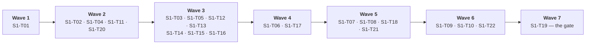

# Plan 1 — Kernels & ports/adapters (Stage 1)

| Field | Value |
|---|---|
| Plan | **Plan 1 — Kernels & ports/adapters** |
| Stage | **Stage 1 — arch-components** (first of three) |
| Layer | **Kernels** (K1–K8) + **ports/adapters** — no domain layer, no document nouns |
| Owner(s) | **Kernels** — `docflow/kernels/`, `docflow/ports/`, `docflow/adapters/`, `docflow/kernel_cli/`, `descriptors/`, `fixtures/` → `S1-T01`–`S1-T17`, `S1-T19`–`S1-T22` · **Surface** — `docflow/cli.py` → `S1-T18` (`wbs.md` §8) |
| Source docs | `wbs.md` §3, §6.1, §6.2, §7, §8, §9 · `../idea/02-arch-components.md` · `kernel-cli.md` §5, §9, §11, §12 · `prd.md` FR-01…FR-11, NFR-02…NFR-10 · `sad.md` §3, §4, §5, §6, §7, ADR-004/006/009 |
| Companion plans | [`README.md`](README.md) (gate model) · [`plan-02-components.md`](plan-02-components.md) (consumes this plan's frozen types) · [`plan-03-pipelines.md`](plan-03-pipelines.md) (indirect) |
| Lifecycle stage | **PoC** — happy path and flow closure first; pragmatic shortcuts allowed and marked inline |
| Effort signal | `S` / `M` / `L` = relative complexity of implementation **and verification**; **not** calendar time, not story points (`wbs.md` §7). Sequence and dependency are what this plan sets, not duration |

---

## §1 Objective

Stage 1 exists to make the four claims that everything above it will rest on **provable before anything is multiplied on top of them**: that a killed stage is distinguishable from one that never ran, that `done` is only ever written about bytes that are durable, that a ledger is verified against the filesystem every time it is read, and that a value the system cannot produce is reported as a reason rather than as a plausible stand-in. Eleven thousand documents and thirteen routes are unsafe to build if a stage can be `done` and wrong, or if a missing model silently becomes a default one — and those two failures produce output that looks correct. Stage 1 builds the kernels, the ports and the ledger substrate, and closes with a synthetic three-stage flow that can be killed, resumed and inspected from a shell. No domain word appears anywhere in it: not `invoice`, not `field`, not `verdict`.

---

## §2 Scope

### In scope

| In scope | Tasks |
|---|---|
| Kernel boundary types, frozen (`Token`, `KernelResult`, `Evidence`, `Reason`, `CallRecord`, `Bytes`, `Artifact`) | `S1-T01` |
| K7 store: content-addressed, atomic, verifiable, plus the ledger write path and `read_ledger`/`write_ledger` | `S1-T02`, `S1-T03` |
| K8 registry: load, schema-validate, fail fast, `registry_hash` | `S1-T04` |
| The 7-term cache key, including registry hash and model revision | `S1-T05` |
| K1 orchestrator: units, stages, graph, ledger, manifest, `rebuild_index()`, 7 durable states, determinism classes, typed slots, barriers, contained failure, mandatory verification | `S1-T06`, `S1-T07`, `S1-T08`, `S1-T09`, `S1-T10` |
| Ports (`PdfSource`, `OcrEngine`, `LlmEngine`, `ArtifactStore`, `Registry`) and the K2/K3/K4/K5/K6 adapters, thin | `S1-T11`, `S1-T12`, `S1-T13`, `S1-T14`, `S1-T15`, `S1-T16` |
| Resolution by capability, fail fast, no fallback | `S1-T17` |
| Product CLI shell: `run`, `status`, `jobs`, `pause`, `stop [--force]` | `S1-T18` |
| `docflow-kernel` lab surface: entry point, exit-code contract, JSON envelope, per-kernel subcommands, flag/port contract test | `S1-T20`, `S1-T21` |
| Silent-failure suite: one assertion per row of the 17-row matrix | `S1-T22` |
| The synthetic closing flow | `S1-T19` |

**Only the kernel operations Stage 2 actually calls are implemented.** `02-arch-components.md` describes a target architecture; `sad.md` §3 and `prd.md` §4.1 state the thinness explicitly, and `kernel-cli.md` §9 carries the per-command `now`/`MVP` status. Stage 1 scope is the `now` set.

### Out of scope (deferred)

| Out of scope | Marker |
|---|---|
| Full `page_facts` beyond classification, `phash`, `tile`, `merge`, `embedded_images` (K2/K3) | `# TODO: [MVP]` (`wbs.md` §3, §10) |
| OCR correction pass; deskew / denoise / binarize / auto-contrast | `# TODO: [MVP]` |
| A second frontier provider; batch API; `count_tokens`; `judge` | `# TODO: [MVP]` |
| Every flag in the `03-cli.md` deferred list (`--dry-run`, `--format`, `--schema`, `--golden`, `--isolate`, `--keep-artifacts`, `--show-evidence`, `--continuity-only`, `--source`, `--failed`, `--state`, `--retry-queue`, `--retry`, `--rebuild`, `--rule`, `--new-type`, `--value`) | `# TODO: [MVP]` (`prd.md` §7) |
| `--rebuild-index` as a **flag** — `rebuild_index()` itself is in scope as a library call (`S1-T06`) | `# TODO: [MVP]` |
| Moving `docflow-kernel` into a `[dev]` extra so it is not installed with the release package | `# TODO: [MVP]` |
| A fixture generator to replace committed fixtures | `# TODO: [MVP]` |
| Object-storage or database backends behind K7; distributed orchestration | `# TODO: [RELEASE]` |
| Telemetry, metric dashboards, caching layers, HA, security compliance | `# TODO: [RELEASE]` |
| A second OCR engine, an OCR engine setting (`--engine`), a `--no-validate` flag, a single confidence score, a `--fallback`/`--default-model` flag, a `--verify` flag or a ledger-trust `verify` subcommand | **Never** (`prd.md` §10, ADR-001, ADR-002, ADR-005, ADR-006, `kernel-cli.md` §14) |
| Merged-document detection | **Never** — no pipeline closes it |

---

## §3 Closing criterion (the stage gate)

**The flow that closes Stage 1: a synthetic flow runs end to end through orchestrator + store + ledger, and pause / resume / `stop --force` all recover correctly** (`wbs.md` §1, §3).

The flow is trivial on purpose: a three-stage graph over a synthetic unit set, no domain nouns, no model in the happy path. It closes when a person can kill it mid-stage and prove, from the outside, that the ledger told the truth about what had been written.

### Acceptance commands

```bash
# the Stage 1 closing flow, invocable from a shell before any domain component exists
docflow-kernel orchestrator run descriptors/synthetic-3stage.yaml --out O

# recovery is observable through the ledger, not through logs. `ledger-read` takes a
# **unit directory** (`kernel-cli.md` §9), not the output root: one ledger per unit.
docflow-kernel orchestrator ledger-read O/U-0001
```

Supporting, from the product surface (`S1-T18`) and the lab surface (`S1-T20`, `S1-T22`):

| Command | Proves |
|---|---|
| `docflow-kernel --list` | The 8 kernels with determinism class and adapter availability; an unavailable adapter is reported `no`, never silently replaced (`kernel-cli.md` §4) |
| `docflow pause <job>` then `docflow run …` again | Continues from the exact stage; no separate `resume` verb (`FR-01`, `FR-02`) |
| `docflow stop --force` then `docflow-kernel orchestrator ledger-read O/U-0001` | The interrupted stage reads `running`, not `pending` and not `done` |
| `docflow-kernel orchestrator manifest-rebuild O` after `rm O/run.json` | The manifest is reconstructed from ledgers alone (`kernel-cli.md` §11 row 16) |
| `docflow-kernel store ledger-read O/U-0001 --root O` | K7's read path reports the same verification outcome as K1's (`kernel-cli.md` §9) |
| `pytest tests/kernel_cli/` | 16 of the 17 matrix rows assert against a committed fixture and target a `reason.code` |

### Observable evidence that the gate closed

| Evidence | Correct | The wrong result it guards against |
|---|---|---|
| Per-stage ledger states after the happy path | every stage of every unit terminal, `done` + verification passed | a `done` stage whose artifact is absent (`kernel-cli.md` §11 row 2) |
| `O/run.json` after a clean run | `state`, `totals`, `stages`, `outcomes`, `inflight` present and consistent with the ledgers | counters that disagree with the ledger tree |
| Ledger after `stop --force` mid-`transform` | interrupted stage `running` | `pending` (reads as *never began*) or `done` (a claim about bytes that do not exist) |
| Second `run` after the kill | re-runs **at most one stage per in-flight unit** (`NFR-02`) | re-running from acquisition — a restart cost that is unbounded |
| `run.json` deleted then rebuilt | byte-for-byte reproducible from the ledgers | a manifest that is authoritative and therefore drifts |
| A `done` stage whose artifact was deleted by hand | treated as incomplete on the next read, **with no flag passed** | skipped as complete (`ADR-006`, AC *Verification is not optional*) |
| Exit codes across the harness | `0`, `2`, `3`, `4`, `1` all reachable and unit-tested; stdout is valid JSON on every path that emits a `KernelResult` (exits `0`, `2`, `3`) | a script that cannot distinguish *the document's answer* from *the call's precondition* from *a bug* |
| A sampled kernel's artifact deleted | the stage reports `failed` with an evidence-missing reason | a fresh sample silently substituted (`FR-09`, AC *A sampled artifact is evidence, not a cache*) |

---

## §4 Entry conditions

| # | Condition | Source |
|---|---|---|
| 1 | The decisions in `prd.md`, `sad.md` and `kernel-cli.md` are frozen; `sad.md` §12's ADRs are decisions, not options | `README.md`, `sad.md` §12 |
| 2 | **No product code exists.** The artifacts are analysis; the first commit is `S1-T01` | `traceability.md` header |
| 3 | Skeleton and flow declared first: empty types, ports and stage graph sketched with type hints and mocks before any implementation, with every shortcut marked inline | `.github/copilot-instructions.md` §6 |
| 4 | The kernel boundary types are the only interface assumed by everything downstream — a change to them after this plan re-opens the gate | `wbs.md` §1 ("contracts must be fixed before they are multiplied") |
| 5 | `docflow` and `docflow-kernel` are two entry points with two audiences; `docflow run` never invokes `docflow-kernel` | `kernel-cli.md` §2, §15 |
| 6 | The 17-row matrix and its fixture list are available as the acceptance suite of record | `kernel-cli.md` §11, §12 |
| 7 | The open decisions in §12 are accepted as open. None of them blocks `S1-T01` | this plan §12 |

---

## §5 Work sequence

Waves are **derived from the `Depends on` column** of `wbs.md` §3, not hand-picked: a wave is the set of tasks whose entire dependency set is already terminal when the wave starts, so the tasks inside one wave may proceed in parallel.



**Wave 1 — 1 task.** *Why a wave:* the boundary types have no dependency and everything else consumes them. Nothing else can start.

**Wave 2 — 4 tasks.** *Why a wave:* all four depend only on `S1-T01`. `S1-T02` (store), `S1-T04` (registry) and `S1-T11` (ports) are independent substrates; `S1-T20` opens in parallel because it consumes `S1-T01` alone — the harness chain is independent of the kernel chain until both converge on `S1-T19` (`wbs.md` §6.2).

**Wave 3 — 7 tasks.** *Why a wave:* each depends only on Wave 2 results. `S1-T03` needs the store's atomic write; `S1-T05` needs the registry hash; `S1-T12`–`S1-T16` each need only the port interfaces.

**Wave 4 — 2 tasks.** *Why a wave:* `S1-T06` needs both `S1-T03` and `S1-T05` — the ledger write path and the cache key — and `S1-T17` needs `S1-T15` and `S1-T16`. Both are first-satisfied here.

**Wave 5 — 4 tasks.** *Why a wave:* all four depend on `S1-T06` and nothing else unfinished. `S1-T21` opens here too: it needs `S1-T20` **and** each of `S1-T12`–`S1-T17`, so it *opens* when `S1-T20` lands and *completes* only when Wave 3's adapters are terminal and `S1-T17` has resolved them.

**Wave 6 — 3 tasks.** *Why a wave:* `S1-T09` and `S1-T10` need `S1-T07`; `S1-T22` needs `S1-T21`. The two chains (serial kernel chain and harness chain) are now one wave apart from the gate.

**Wave 7 — 1 task.** *Why a wave:* `S1-T19` is the join of both chains (`S1-T09`, `S1-T10`, `S1-T18`, `S1-T22`) and is the gate itself.

### The ordered task table

| Order | Task ID | Title | Deliverable (path) | Depends on | Verifiable "done when" | Effort | PoC markers |
|---:|---|---|---|---|---|---|---|
| 1 | `S1-T01` | Freeze kernel boundary types | `docflow/kernels/types.py` | — | Frozen dataclasses; `KernelResult` cannot express a value without evidence nor a `None` without a reason; a unit test asserts no third state exists | M | — |
| 2 | `S1-T02` | K7 store: content-addressed put/get, atomic write, `verify`, never-empty `get` | `docflow/kernels/store.py` | `S1-T01` | Identical bytes stored once; a killed write leaves no partial artifact visible; `get` on a miss raises; `verify` detects a truncated file | L | — |
| 3 | `S1-T04` | K8 registry: load, schema-validate, fail fast, `registry_hash` | `docflow/kernels/registry.py` | `S1-T01` | A malformed asset stops the run; a missing asset is never defaulted; changing one prompt changes the hash | M | `# TODO: [MVP]`: per-asset registry hashing (§12) |
| 4 | `S1-T11` | Ports: `PdfSource`, `OcrEngine`, `LlmEngine`, `ArtifactStore`, `Registry` | `docflow/ports/` | `S1-T01` | No adapter importable from a port; a fake adapter satisfies each port in tests | M | — |
| 5 | `S1-T20` | `docflow-kernel` entry point: dispatch, `--list`, exit codes, JSON envelope, `--save` via K7 | `docflow/kernel_cli/__init__.py`, `docflow/kernel_cli/main.py` (**package**, never a module beside it) | `S1-T01` | All five exit codes reachable and unit-tested; stdout valid JSON on exits `0`/`2`/`3`; stderr carries nothing a script parses; `--list` reports the 8 kernels with determinism class and adapter availability | M | `# TODO: [MVP]`: `[dev]` extra; `--format yaml` |
| 6 | `S1-T03` | K7 ledger write path: `begin`/`commit`/`fail`, `read_ledger`, `write_ledger` | `docflow/kernels/store.py` | `S1-T02` | `commit` writes `done` only after the rename returns; a forced kill between write and rename leaves the stage `running`, not `done` | L | — |
| 7 | `S1-T05` | Cache key: the 7-term formula including registry hash and model revision | `docflow/kernels/cache_key.py` | `S1-T04` | Two runs with the same 6 terms and a different registry hash produce different keys; unit-tested per term | M | — |
| 8 | `S1-T12` | K2 `kernel.pdf` thin: `probe`, `classify`, `extract_tokens`, `render`, `split` | `docflow/kernels/pdf.py` | `S1-T11` | `classify` returns `text`/`image`/`mixed`/**`blank`** and detects invisible text; `render` never upscales; effective DPI measured from embedded pixels | L | `# TODO: [MVP]`: full `page_facts`, `images`, `merge` |
| 9 | `S1-T13` | K3 `kernel.image` thin: `load` (EXIF applied), `legibility`, `rescale`, `crop` (inverse map returned) | `docflow/kernels/image.py` | `S1-T11` | A photo read sideways is impossible; an illegible bitmap carries a `Reason`; a crop's coordinates map back to source page coordinates before leaving | M | `# TODO: [MVP]`: deskew, denoise, tile, phash |
| 10 | `S1-T14` | K4 `kernel.ocr` port + Docling adapter: `capabilities`, `read`, `engine_info` | `docflow/ports/ocr.py`, `docflow/adapters/docling.py` | `S1-T11` | Positioned tokens with **no reading order**; Docling's layout output dropped at the boundary; **no engine setting**; `engine_info` feeds the cache key | L | `# TODO: [MVP]`: OCR correction pass |
| 11 | `S1-T15` | K5 `kernel.llm.local` port + Ollama adapter: `structured`, `vision`, `warm`, `capabilities` | `docflow/adapters/ollama.py` | `S1-T11` | Digest recorded at first use and compared for the remainder of the run; a missing model raises a typed error naming `ollama pull <model>`; truncation maps to a typed error and is **never** parsed as complete | L | `# TODO: [MVP]`: `ps`, `pull`, `generate` |
| 12 | `S1-T16` | K6 `kernel.llm.frontier` port + one provider adapter: `structured`, `vision`, `judge`, `CallRecord` | `docflow/adapters/frontier.py` | `S1-T11` | Raw completion persisted **before** any parse; `429` honours `retry-after` verbatim; sustained unavailability degrades to `unverified`, never to rejection; secrets from the environment only | L | `# TODO: [MVP]`: second provider, batch API, token counting |
| 13 | `S1-T06` | K1 orchestrator core: unit / stage / graph / ledger / manifest, dependency dispatch | `docflow/kernels/orchestrator.py` | `S1-T03`, `S1-T05` | A 3-stage synthetic graph runs over N units; `run.json` is derived and `rebuild_index()` reproduces it from ledgers alone. `rebuild_index()` is K1's operation and the **only** authority; K7's `rebuild_manifest()` delegates to it | L | No `--rebuild-index` flag: `# TODO: [MVP]` |
| 14 | `S1-T17` | Resolution by capability + fail fast on unknown provider/model | `docflow/kernels/resolution.py` | `S1-T15`, `S1-T16` | `ollama:qwen2.5` and `anthropic:…` resolve; an unknown name fails with a reason naming it; **no fallback default exists anywhere** | S | — |
| 15 | `S1-T07` | K1 durable states: the 7 states, `running` written **before** the work starts | `docflow/kernels/orchestrator.py` (cont.) | `S1-T06` | Kill mid-stage → ledger reads `running`; the invariant "never `done` about a non-durable artifact" holds under an injected crash | L | — |
| 16 | `S1-T08` | Determinism classes + resume consequence | `docflow/kernels/determinism.py` | `S1-T06` | A deterministic artifact is recomputable; a sampled artifact with a missing file reports `failed` with an evidence-missing reason and **never regenerates** | M | — |
| 17 | `S1-T18` | CLI shell: `run` (idempotent), `status`, `jobs`, `pause`, `stop [--force]` | `docflow/cli.py` | `S1-T06` | Repeating `run` skips completed work; a second `run` after a kill continues; `stop` with no arguments **discovers** and reports instead of killing | M | `# TODO: [MVP]`: `--failed`, `--state`, `--dry-run` |
| 18 | `S1-T21` | Per-kernel subcommands, 1:1 with port methods, filled in as each adapter lands | `docflow/kernel_cli/{orchestrator,store,registry,pdf,image,ocr,llm}.py` | `S1-T20`, and each of `S1-T12`–`S1-T17` as it completes | Every `now` command in `kernel-cli.md` §9 dispatches; every `MVP` command exits `4` naming the operation as unavailable; a contract test compares each dispatched command's flag set against its port signature and fails on any flag with no counterpart | L | `# TODO: [MVP]`: cover newly landed `MVP` commands as they arrive |
| 19 | `S1-T09` | Typed slots (`cpu`/`gpu`/`remote`) + barriers (dependency on a set) + unit-contained failure | `docflow/kernels/orchestrator.py` (cont.) | `S1-T07` | One unit failing does not abort the run; a partial barrier set releases when every member is terminal | M | `# TODO: [MVP]`: per-device slot policy beyond `gpu=1` |
| 20 | `S1-T10` | Mandatory verification on every ledger read, with **no flag** | `docflow/kernels/orchestrator.py` (cont.) | `S1-T07` | A `done` stage whose artifact was deleted is treated as incomplete; no code path exists that skips the check | S | — |
| 21 | `S1-T22` | Silent-failure suite: one assertion per row of the 17-row matrix, with the committed fixtures | `tests/kernel_cli/`, `fixtures/` | `S1-T21` | The **16** rows whose commands are `now` run in CI against a committed fixture and target a `reason.code`, never a message string; row 15 is declared, gated on `judge`, and asserted the moment it lands; `--repeat` proves identical hashes for the deterministic kernels and differing hashes for the sampled ones | L | `# TODO: [MVP]`: fixture generator; fast subset vs gated subset for K4–K6 |
| 22 | `S1-T19` | **Stage 1 closing flow (synthetic)** | Integration test + demo script | `S1-T09`, `S1-T10`, `S1-T18`, **`S1-T22`** | A trivial 3-stage graph over a synthetic unit set completes; `pause` then `run` continues from the exact stage; `stop --force` mid-stage leaves `running` in the ledger and the next `run` re-runs **at most one stage per in-flight unit**; a deleted artifact is detected without any flag; the flow is invocable as `docflow-kernel orchestrator run descriptors/synthetic-3stage.yaml --out O` and its recovery is observable via `orchestrator ledger-read` | L | — (**the gate; not deferrable**) |

**No task dropped, none renumbered, none added.** Total: **22**.

> **Epics and issues.** This plan is decomposed into 8 capability epics and the same 22 issues under [`issues/plan-01-kernels/`](issues/plan-01-kernels/README.md) — one issue per task, with acceptance criteria expanded into checkable boxes, the test and evidence for each, and an explicit out-of-scope list. The epic cut is **by capability**, so it is **orthogonal to the waves above**, not a restatement of them. This file remains the authority on sequence and the gate; the issue set is the tracker-facing view of it.

---

## §6 Flow-closing procedure

The operator runbook for closing Stage 1, in the order a person executes it. Preparatory steps 1–5 are the happy path; 6–10 are the interruptions the criterion requires.

| # | Action | What to look at | A correct result | The wrong result this step guards against |
|---:|---|---|---|---|
| 1 | **Prepare the fixture.** Commit `descriptors/synthetic-3stage.yaml` — three stages (`acquire` / `transform` / `persist`), no domain noun — and a synthetic unit set. *Why synthetic:* the descriptor executes kernel ops only, which is what keeps the lab surface domain-free (`kernel-cli.md` §9) | `descriptors/synthetic-3stage.yaml`, `fixtures/` | a descriptor whose stages reference `store put` and `pdf probe`, with no field, no document type, no pipeline code | a descriptor that names a pipeline code or a document concept — the surface has drifted into the domain layer |
| 2 | **Confirm the inventory.** `docflow-kernel --list` | The 8 kernels, determinism class, adapter availability | all 8 rows; `available` reflects reality; K4/K5 read `sampled`, K6 `external`, K1/K2/K3/K7/K8 `deterministic` | an unavailable adapter reported `yes` — a silent fallback in the one place it is most expensive |
| 3 | **Validate without executing.** `docflow-kernel orchestrator plan descriptors/synthetic-3stage.yaml --out O` | exit code; nothing on disk yet | exit `0`, no artifact written, no stage dispatched | a `plan` that already ran work; a malformed descriptor that starts a run instead of stopping |
| 4 | **Run the happy path.** `docflow-kernel orchestrator run descriptors/synthetic-3stage.yaml --out O` | exit code; `O/run.json` | exit `0`; every stage of every unit terminal; `run.json` carries `state`, `totals`, `stages`, `outcomes`, `inflight` | a run that completes with a stage silently absent from `stages` |
| 5 | **Read the ledger.** `docflow-kernel orchestrator ledger-read O/U-0001` | per-unit, per-stage state **and** the verification outcome | every stage `done` **and** verifying; the read reports the verification outcome alongside the ledger | a ledger returned without a verification result — the check became a request |
| 6 | **Interrupt #1 — pause.** `docflow pause <job>` while units are in flight, then run step 4's command again | ledger before and after; which stages re-run | in-flight work finishes; the resumed run continues from the exact stage; nothing already `done` re-runs | a pause that leaves the ledger inconsistent, or a resume that restarts acquisition |
| 7 | **Interrupt #2 — kill mid-stage.** `docflow stop --force` while a unit is in `transform`; then `orchestrator ledger-read O/U-0001` | the interrupted stage's state | `running` — written when the stage started, so the ledger never has to guess | `pending` (reads as *never began*, the failure the whole crash-recovery design exists to prevent) or `done` (a claim about bytes that may be partial) |
| 8 | **Resume after the kill.** Run step 4 again; then read every ledger | which stages re-run per unit | at most **one stage per in-flight unit** re-runs (`NFR-02`); everything before it is preserved; nothing after it had started | a resume that re-runs the whole unit — the restart cost the ledger exists to bound (`NFR-03`) |
| 9 | **Interrupt #3 — delete a done artifact.** Remove one `done` stage's artifact by hand and read the ledger again | that stage's state, with **no flag passed** | treated as incomplete and re-run | skipped as complete — AC *Verification is not optional* fails silently if this passes |
| 10 | **Crash between write and rename.** Inject the crash at the atomic-write boundary (row 2's procedure), then read the ledger | the two states of the affected stage | `done` is **absent** and `running` is **present** | a `done` written before the rename returned — the ordering that makes resume a lie |
| 11 | **Prove the manifest is derived.** `rm O/run.json`, then `docflow-kernel orchestrator manifest-rebuild O`; repeat through K7's door | the rebuilt file; `store manifest-rebuild` vs `orchestrator manifest-rebuild` | byte-identical to the deleted one, reconstructed from the ledgers alone; both doors return what `rebuild_index()` returned | a manifest that cannot be rebuilt, i.e. one that is authoritative and therefore drifts (`kernel-cli.md` §11 row 16, `D7`) |
| 12 | **Exercise the exit contract.** Reach `0`, `2`, `3`, `4` and `1` deliberately; validate stdout with `jq` on each of `0`/`2`/`3` | exit code, stdout, stderr | the envelope is the same JSON on all three emitting exits, differing only in the code; `4` and `1` emit no `KernelResult`; stderr never carries anything a script parses | `2` used for a genuine error, or an exit that emits nothing a caller can read |
| 13 | **Run the suite.** `pytest tests/kernel_cli/` and `pytest tests/` | 16 rows green; row 15 declared; the Stage 1 integration test green | every assertion targets a `reason.code`; `--repeat` shows identical hashes for the deterministic kernels and differing hashes for the sampled ones | a green suite asserting on message strings or on values a sampled kernel cannot promise |
| 14 | **Tick the exit checklist** (§11) and record the frozen artefacts for Plan 2 | §11, §8 | all boxes ticked, including doc-sync | a stage declared closed with its own criterion unmet |

---

## §7 Verification & test plan

### (a) Happy-path test that must pass to close the flow

`S1-T19`'s integration test: build the 3-stage synthetic graph over N units, run it to completion, assert every stage terminal with a verifying artifact, assert `rebuild_index()` reproduces `run.json` from the ledgers alone, and assert the same flow is invocable as `docflow-kernel orchestrator run descriptors/synthetic-3stage.yaml --out O`. This is the **only** test whose passing is the gate; every other test in this plan exists to make a failure of this one attributable.

### (b) Invariant tests that must FAIL when the invariant is broken

| Invariant | Test | What breaking it looks like | Task |
|---|---|---|---|
| No third state at a kernel boundary | Unit test asserting `KernelResult` cannot express a value without evidence or a `None` without a reason | someone returns `""`, `0`, `[]` or a default model as a stand-in and the test still passes | `S1-T01` |
| Never `done` about non-durable bytes | Crash injected between write and rename | `done` is written before the rename returns; the ordering is moved "for convenience" | `S1-T03`, `S1-T07` |
| `running` is written **before** the work starts | Kill mid-stage, then read | the scheduler writes state only on completion and a killed stage reports as never having run | `S1-T07` |
| Verification on every ledger read, no flag | Delete a `done` stage's artifact, read again | a code path returns a ledger without verifying it; a `--verify`-shaped escape appears | `S1-T10` |
| A sampled artifact is never regenerated | Delete a sampled artifact, read the ledger | the stage re-runs and reports `done` with a fresh sample, changing the result while reporting success | `S1-T08` |
| The cache key carries all 7 terms | Unit test per term; registry-hash term test | the registry hash or the model revision is dropped as "always the same" | `S1-T05` |
| No fallback model, engine or threshold | Resolution test on an unknown name | an unknown model resolves to something instead of failing, or a default appears in the code | `S1-T17` |
| Adapter isolation | Import check + a fake adapter satisfying each port | an adapter is imported from a port; the arrow stops pointing down | `S1-T11` |
| `render` never upscales | `pdf render` at 300 on a 150 DPI fixture | a larger file is produced and the resolution gate reported satisfied | `S1-T12` (row 4) |
| Coordinates leave a kernel in source page coordinates | Crop inverse-map test | a crop's local coordinates are reported as a page region; both boxes are valid JSON, so nothing else notices | `S1-T13` (row 8) |
| Truncation is never parsed as complete | Oversized prompt against `num_ctx` | a cut completion parses cleanly because the cut landed after the last complete field | `S1-T15` (row 12) |
| Exit `2` is reserved for a typed `Reason` | Exit-code unit tests | an unexpected exception is reported as `2`, collapsing *expected negative* into *broken* | `S1-T20` |
| One command = one port method | The `S1-T21` flag/port contract test | a convenience flag appears with no port counterpart and the CLI becomes a second API | `S1-T21` |
| No flag names a document concept | Same contract test, forbidden vocabulary | `--field`, `--invoice`, `--pipeline`, `--validator` or `--extractor` appears on the lab surface | `S1-T21` |
| `--repeat` is not retry-until-agreement | Documented prohibition plus the recorded attempt count | a test loops `--repeat` until two hashes agree — manufacturing contrast | `S1-T22` |

### (c) Acceptance scenarios that belong to this stage

Three of the six Gherkin scenarios close at Stage 1 (`traceability.md` §6). If they slip to Stage 2, the invariants they assert are tested inside a domain component — the misattribution `kernel-cli.md` §1 exists to prevent.

| Scenario | Where | Closes at |
|---|---|---|
| *Resume after a forced kill* | `prd.md` §8 | `S1-T19` (+ `S1-T18`, `S1-T07`) |
| *A sampled artifact is evidence, not a cache* | `prd.md` §8 | `S1-T08`, asserted through `S1-T22` |
| *Verification is not optional* | `prd.md` §8 | `S1-T10`, asserted through `S1-T19` step 9 |

The 17-row silent-failure matrix (`kernel-cli.md` §11), by row and by status at this stage:

| Row | Kernel | Failure | Status in Plan 1 |
|---:|---|---|---|
| 1 | K1 | A killed stage reported as never started, then resumed | `now` — Stage 1 gate |
| 2 | K1 | A stage marked `done` whose artifact is partial | `now` — Stage 1 gate |
| 3 | K2 | A stale invisible OCR layer read as a text PDF | `now` — Stage 1 gate |
| 4 | K2 | A 150 DPI scan rendered at 300 and reported as 300 | `now` — Stage 1 gate |
| 5 | K2 | A split that separates a document from its pages | `now` — Stage 1 gate |
| 6 | K3 | A photo read sideways | `now` — Stage 1 gate |
| 7 | K3 | A blurred image passed to OCR | `now` — Stage 1 gate |
| 8 | K3 | A crop's local coordinates reported as a page region | `now` — Stage 1 gate |
| 9 | K4 | A blank page returning invented text | `now` — Stage 1 gate |
| 10 | K4 | Missing confidence read as perfect | `now` — Stage 1 gate |
| 11 | K4 | A truncated page read as a page with no text | `now` — Stage 1 gate |
| 12 | K5 | Output cut by `num_ctx`, parsed as complete | `now` — Stage 1 gate |
| 13 | K5 | A model swapped under a moving tag mid-run | `now` — Stage 1 gate |
| 14 | K6 | The model's absence, `null` and a default collapsed into one | `now` — Stage 1 gate |
| 15 | K6 | A golden set graded by the model that produced it | **Declared and gated**: its command `llm.frontier judge` is `MVP` in `kernel-cli.md` §9, so the row asserts on `role_conflict` the moment `judge` lands. Not a Stage 1 gate and not silently dropped |
| 16 | K7 | A manifest reporting a finished run that is not finished | `now` — Stage 1 gate |
| 17 | K8 | A missing asset defaulted, producing a run that extracts nothing | `now` — Stage 1 gate |

**Sixteen of seventeen rows are the Stage 1 CI gate.** `--repeat` on rows 3–10 and 13 doubles as the determinism-class proof for K2/K3 and the non-reproducibility demonstration for K4/K5.

### (d) What is explicitly NOT tested at this stage

| Not tested | Why | Marker |
|---|---|---|
| Any field, verdict, document type or pipeline route | No domain noun exists in Stage 1 by construction | — |
| The 13 pipeline codes | `S3-T02`; a descriptor is not a pipeline code (`kernel-cli.md` §9) | — |
| The 6 Validator business-rule categories | Pending definition | `# TODO: [MVP]` |
| Real corpus behaviour, throughput and latency | The first full run sets the baseline | `# TODO: [MVP]` (`NFR-11`) |
| Golden-set comparison and its labeller/separation | Needs a golden set to exist first | `# TODO: [MVP]` |
| The `MVP` commands of `kernel-cli.md` §9 | Their command exits `4`; only that is asserted | `# TODO: [MVP]` |
| Object storage, distributed execution, HA, telemetry | Not PoC | `# TODO: [RELEASE]` |
| Merged-document detection | No pipeline closes it | **Never** |

---

## §8 Traceability

Requirement IDs are taken from `traceability.md` §4 (`FR` from §4.1, `NFR` from §4.2). "Test / proof" names the artefact that proves the mapping in this plan.

| Task ID | FR / NFR satisfied | Test / proof |
|---|---|---|
| `S1-T01` | **FR-06** | Unit test asserting no third state exists in `KernelResult` |
| `S1-T02` | **FR-11** | Store unit tests; atomic-write test; `get`-raises test; `verify` on a truncated file |
| `S1-T03` | **FR-04**, **NFR-03** | Row 2 procedure; `commit`-after-rename test |
| `S1-T04` | **FR-10** | Row 17; malformed-asset test; hash-change test |
| `S1-T05` | **FR-08**, **NFR-03** | Per-term unit tests; registry-hash term test |
| `S1-T06` | **FR-11**, **NFR-09** | `rebuild_index()` reproduces `run.json` from ledgers; row 16; `jq`-readable output |
| `S1-T07` | **FR-03**, **FR-04**, **NFR-02** | Row 1; injected-crash invariant test; `S1-T19`'s at-most-one-stage assertion |
| `S1-T08` | **FR-09** | AC *A sampled artifact is evidence, not a cache* |
| `S1-T09` | **FR-07**, **NFR-04** | Synthetic graph test; partial-barrier release test; unit-contained-failure test |
| `S1-T10` | **FR-05** | AC *Verification is not optional*; AC *Resume after a forced kill* |
| `S1-T11` | *(no FR — see the gap note below)* | Import-isolation test; fake adapter satisfies each port |
| `S1-T12` | **FR-15** (the measurements the Diagnosis gate consumes) | Rows 3, 4, 5 |
| `S1-T13` | **NFR-07**, **FR-15** (legibility measurement) | Rows 6, 7, 8 — the inverse-map assertion is `NFR-07` |
| `S1-T14` | **FR-16**, **FR-17** | Rows 9, 10, 11; contract test asserts no `--engine` flag exists |
| `S1-T15` | **FR-27**, **NFR-08**, **NFR-10** | Rows 12, 13; unknown-model exit `3` with `model_unknown`; typed-error test on a missing model |
| `S1-T16` | **FR-27**, **NFR-05**, **NFR-08**, **NFR-10** | Row 14; `call_record` populated; contract test asserts no `--api-key` flag exists |
| `S1-T17` | **FR-27** | Resolution test on a known and an unknown name; the absence of any default is asserted, not asserted-about |
| `S1-T18` | **FR-01**, **FR-02**, **NFR-06** | AC *Resume after a forced kill*; `stop` discovery test; precedence test; `--force` not settable by environment |
| `S1-T19` | **FR-01**, **FR-02**, **FR-05**, **FR-09**, **NFR-02**, **NFR-01** (the synthetic half) | The Stage 1 integration test itself |
| `S1-T20` | **FR-06** (process-level encoding of no-third-state), *(no FR — see the gap note)* | Five exit codes unit-tested; envelope validity on `0`/`2`/`3` |
| `S1-T21` | *(no FR — see the gap note)*; guards **FR-16** (no engine setting), **FR-18** (no `--no-validate`), **NFR-05** (no key flag) | The flag/port contract test |
| `S1-T22` | *(no FR — see the gap note)*; carries **NFR-02**/**NFR-03** evidence through rows 1, 2 and 16 | 16 rows assert in CI; row 15 declared and gated |

**Gap note — four tasks with no FR.** `S1-T11` (ports), `S1-T20`/`S1-T21`/`S1-T22` (the kernel CLI harness) have **no functional requirement**, and this is recorded rather than papered over. `traceability.md` §5 traces them to a **stated user requirement**, not to an FR: the ports exist because `ADR-004` requires a kernel layer reusable beyond this project, and the harness exists because the user required that *the kernels be a cornerstone of the project, so they must be tested independently before the domain layer is built on top of them* (`kernel-cli.md` §1). The gap is accepted because it is a **requirement gap, not an orphan task**: a requirement exists, it is simply not numbered in §4.1. Closing it would mean adding an FR for "the kernel layer is reusable and independently testable", which changes `prd.md` — an artifact change, out of scope for a plan.

---

## §9 Risks specific to this plan

From `wbs.md` §9 and `sad.md` §13, keeping only rows whose **Owner stage is 1**:

| Risk | L | I | Mitigation in this plan |
|---|:---:|:---:|---|
| **Sampled artifact regenerated on resume**, silently changing the result | M | H | `S1-T08` reads the determinism class; missing evidence → `failed`; retrying to agreement is forbidden and attempts are counted. Proven by AC *A sampled artifact is evidence, not a cache* |
| **Manifest drift** — `run.json` disagreeing with the ledgers | M | M | The manifest is derived and rebuildable; ledgers authoritative; verification on every read. `S1-T06` owns the mechanism, `S3-T07` (Plan 3) owns the shape and location (`D7`) |
| **Model resolved by capability, not name** — a silent fallback changes every downstream value | L | H | `S1-T17` fails fast with a reason naming the model; **no default exists in the code**. Proven by the resolution test and row 13 |
| **The kernel CLI lab surface drifts into a second product API** | M | M | `docflow run` never invokes `docflow-kernel`; the `S1-T21` contract test fails on any flag with no port counterpart; `# TODO: [MVP]` a `[dev]` extra |
| **`--repeat` used as retry-until-agreement** in the harness | L | H | Documented prohibition (`kernel-cli.md` §7); the orchestrator records an attempt count, so the pattern is visible if it happens |
| **Lab fixtures drift from the kernel behaviour they assert** | M | M | Each fixture is named for the failure it provokes; `S1-T22` asserts a `reason.code`, never a message string |

**Plan-specific execution risk — the one that bites if the wave order is violated.** Two ways to violate it, and both produce a stage that *looks* closed:

1. **Opening `S1-T21` before `S1-T12`–`S1-T17` are terminal.** The contract test compares a command's flag set against its port signature. With no adapter landed there is no signature to compare against, so the test passes **vacuously** — a green suite that proves nothing, and the first flag drift appears later, at the kernels' real consumer. Mitigation: `S1-T21`'s done-when is scoped to the `now` set and re-checked as each adapter lands.
2. **Closing `S1-T19` before `S1-T22`.** `S1-T19` is the gate, and `S1-T22` is a **hard predecessor** of it (`wbs.md` §3). Closing the gate without the silent-failure rows means the three scenarios Stage 1 owns (resume, sampled-as-evidence, verification) are proven only through the integration path, and rows 1–2 of the matrix stay prose — so the first time a kernel fails silently it is inside a domain component, attributed to the wrong layer.

The wave map is therefore not a preference: Waves 5 and 6 exist so that the harness chain and the serial kernel chain converge on `S1-T19` with both chains complete.

---

## §10 Definition of Ready / Definition of Done

### Task DoR

- The task names the artifact it produces, and the artifact has a single owner — `wbs.md` §8's ownership table, by layer.
- Its dependencies are `done`, or the task states the interface it assumes from them.
- The verifiable criterion is written **before** the work starts and can be checked without reading the implementation.
- Any PoC shortcut is declared with its `# TODO: [MVP]` / `# TODO: [RELEASE]` marker **at creation**, not retrofitted.
- For `S1-T21`/`S1-T22` additionally: the task's row in `traceability.md` §4 exists (its FR mapping is the gap note in §8, recorded rather than implied).

### Task DoD

- The artifact exists at the documented path and is exercised by at least one automated test.
- The verifiable criterion in §5 passes.
- **No domain noun** leaked into a kernel API; **no adapter is imported from a port**; no dependency arrow points up.
- **No silent stand-in** was introduced: no empty string, no `0`, no `[]`, no `None`-without-reason, and no default model, engine or threshold.
- Every shortcut taken is marked with `# TODO: [MVP]` / `# TODO: [RELEASE]`.

### Stage DoD (Plan 1)

- Every one of the 22 tasks is `done`.
- **The synthetic flow closes** — §3's criterion, run from a clean checkout with the documented command.
- The riskiest invariant introduced at this stage has a test that **fails when the invariant is broken**, not merely one that passes when it holds (§7b).
- `prd.md`, `sad.md`, `kernel-cli.md` and `wbs.md` still agree with what was built; divergences resolved before Plan 2 starts.

---

## §11 Exit checklist

An operator ticks this to declare Plan 1 closed. **Plan 2's §4 entry condition is this list and nothing else.**

- [ ] All 22 tasks `S1-T01`–`S1-T22` are `done`, each with its verifiable criterion passing.
- [ ] `docflow-kernel orchestrator run descriptors/synthetic-3stage.yaml --out O` exits `0` from a clean checkout.
- [ ] `docflow-kernel orchestrator ledger-read O/U-0001` reports every stage `done` **and** verifying.
- [ ] `docflow pause <job>` followed by a plain `run` continues from the exact stage — no `resume` verb exists.
- [ ] `docflow stop --force` mid-stage leaves `running` in the ledger; the next `run` re-runs **at most one stage per in-flight unit**.
- [ ] Deleting a `done` stage's artifact marks the stage incomplete **without any flag** being passed.
- [ ] Deleting a **sampled** artifact's evidence reports `failed` with an evidence-missing reason; no fresh sample is produced.
- [ ] `rm O/run.json` followed by `orchestrator manifest-rebuild O` reproduces it from the ledgers alone; `store manifest-rebuild` returns the same.
- [ ] All five exit codes are reachable; exits `0`, `2`, `3` all emit a valid `KernelResult` envelope; stderr carries nothing a script parses.
- [ ] 16 of the 17 matrix rows assert in CI against committed fixtures and target a `reason.code`; **row 15 is declared and gated** on `judge` landing.
- [ ] `docflow-kernel --list` reports the 8 kernels with determinism class and adapter availability; no unavailable adapter is reported `yes`.
- [ ] No kernel API contains a domain noun; no adapter is imported from a port; no default model, engine or threshold exists anywhere in the code.
- [ ] The boundary artefact set in §3 of `README.md` (Cross-plan contract table) is frozen and named in Plan 2's §4.
- [ ] **Doc-sync:** `prd.md`, `sad.md`, `wbs.md`, `kernel-cli.md` and `traceability.md` still agree with what was built. Every divergence is resolved in the docs **before Plan 2 starts**, and `traceability.md` §5 is re-checked so the stage close produces no orphan task.

### The four tracks, ticked separately (§13)

| Track | Tick when |
|---|---|
| **1 — Fast flow** | The synthetic flow closes: run, pause, resume, `stop --force`, deleted artifact, crash at the rename boundary — all six steps of §6 observed |
| **2 — Golden set / tests** | The 17-row matrix's `now` rows assert in CI against committed fixtures and target a `reason.code`; row 15 is **declared and gated**, not dropped; `--repeat` demonstrates the determinism classes |
| **3 — Code (for reuse)** | Plan 2 can build its first component against the frozen types and ports **without adding a new kernel-boundary type**, and without importing an adapter from a port |
| **4 — CLI (to probe)** | `docflow-kernel --list` is honest; every `now` command dispatches; every `MVP` command exits `4`; the flag/port contract test passes with no orphan flag |

---

## §12 Open decisions carried into this plan

Only the decisions that touch Stage 1. Each is unresolved **in the artifacts by design**; none blocks `S1-T01`, and each names what it would change if resolved differently.

| # | Open decision | Where it originates | What it touches in this plan | Impact if deferred past Stage 1 |
|---:|---|---|---|---|
| 1 | **Whether the kernel CLI may execute a descriptor whose stages are domain components** | `kernel-cli.md` §17 | `S1-T20`, `S1-T21`, and `S1-T19`'s descriptor shape | Stage 1's flow stays **synthetic by construction** — which is the intent — but the same command cannot debug a real pipeline graph. Resolving it "yes" would let a domain noun into the lab surface, which `kernel-cli.md` §10's forbidden vocabulary refuses |
| 2 | **Whether `--save` needs an explicit `--root`** | `kernel-cli.md` §17 | `S1-T20` (`--save` routed through K7), `S1-T22`'s fixture assertions | A default temp root makes a hash real but the artifact disposable, so a test can pass over bytes already gone — a green assertion with nothing behind it |
| 3 | **Whether the 17-row matrix runs in CI at all stages, or only at Stage 1** | `kernel-cli.md` §17 | `S1-T22`'s suite structure | Rows for K4–K6 need GPU, tokens and provider availability. Unsplit, the suite becomes flaky and then ignored — which is how an acceptance harness dies. `# TODO: [MVP]`: fast subset vs gated subset |
| 4 | **Whether `registry hash` is per-asset** | `kernel-cli.md` §17, `02-arch-components.md` | `S1-T04` (one hash today), `S1-T05` (the hash is a cache-key term) | One hash means a prompt tweak invalidates a schema version: coarse but **never wrong**. Per-asset hashing would make `--force --stage extract.p` more precise and would change the cache-key formula, i.e. re-open this plan's gate |
| 5 | **What Docling's determinism class actually is** | `02-arch-components.md` (open questions) | `S1-T14` (reports `sampled`, mapped by `sad.md` §4), `S1-T08` | Treated as `sampled`, so an OCR artifact is non-reproducible and a lost one makes a document permanently unreproducible. If a pinned Docling + pinned backend + pinned language pack is in fact deterministic on identical bytes, the OCR cache becomes a deterministic cache and the design gets simpler — but `S1-T08`'s consequence is already built either way |
| 6 | **Whether a sampled artifact may ever be regenerated, with the new observation recorded** | `02-arch-components.md` (open questions) | `S1-T08`, the gate's AC *A sampled artifact is evidence, not a cache* | Stage 1 fixes "never regenerate". Relaxing it later is a **policy** decision that would change `S1-T08`'s done-when and therefore re-open this gate — it cannot be done from Plan 2 |
| 7 | **How many GPU slots exist, and whether the slot model is enough** | `02-arch-components.md` (open questions) | `S1-T09` (`gpu` bounded to 1 per device) | `gpu = 1` is a declared simplification: concurrent OCR and generation compete for VRAM on one device and the competition policy is undefined. It becomes load-bearing at Plan 3's corpus run, so the answer is needed before `S3-T11`, not before `S1-T19` |

**Handed forward, not resolved here** (they belong to later plans and are carried there): whether `S2-T12` (Catalog) becomes a dependency of `S2-T17`, and the M0 escalation question — both in Plan 2 §12; the corpus-scale policy questions — Plan 3 §12.

---

## §13 The four tracks of this layer

Every layer is worked along four tracks at once (`plans/README.md` §6). They are not phases: **Track 1 closes the stage, Track 4 operates it, Track 2 proves it, Track 3 is what survives it.**

| Track | This layer's instance | Task |
|---|---|---|
| **1 — Fast flow** | `descriptors/synthetic-3stage.yaml`, three stages over a synthetic unit set, driven through orchestrator + store + ledger — with `S1-T11`'s **faked ports**, not Docling, not Ollama, not a provider | `S1-T19` (the gate) |
| **2 — Golden set / tests** | The matrix's committed fixtures (the `kernel-cli.md` §12 table's 16 rows name **14** committed fixtures; two rows are marked `(no fixture)` because they are **procedures**), each named for the failure it provokes and each asserting a **`reason.code`** — never a message string. §12's own note: *"Four rows need no committed document (13, 14, 16 and row 1–2's generator)"* | `S1-T22` |
| **3 — Code (for reuse)** | `docflow/kernels/` + `docflow/ports/` — the boundary types and the five port interfaces. Reusability is *tested*, not asserted: the import-isolation check plus a fake adapter satisfying each port | `S1-T01`–`S1-T17` |
| **4 — CLI (to probe)** | `docflow-kernel`, a **package**, with one subcommand per port method and the 5-exit-code contract | `S1-T20`, `S1-T21` |

**The flow is synthetic by decision.** The descriptor executes kernel ops only, so no domain noun reaches the lab surface (`kernel-cli.md` §9, open decision §12 #1). That is what makes Track 1 cheap enough to close early — and what makes Track 2 load-bearing, because the fakes it closes over are exactly what the matrix has to evict.

### Track 1 — the fast flow, and what it deliberately fakes

| Faked | By | Why acceptable at this stage | Paid back at |
|---|---|---|---|
| Docling (K4) | A test double behind `OcrEngine` | The port, not the engine, is what Stage 1 fixes (`wbs.md` §9) | `S1-T14` + matrix rows 9–11 |
| Ollama (K5) | A test double behind `LlmEngine` | Same: the digest discipline, not the model, is the contract | `S1-T15` + rows 12–13 |
| The frontier provider (K6) | A test double behind `LlmEngine` | `S1-T16` is explicitly stubbable until escalation needs it (`wbs.md` §6.2) | `S2-T09`, `S2-T11` — the escalation ladder |
| `pdftotext`, real PDFs | A synthetic unit set | The graph, the ledger and resume do not depend on the bytes being a real invoice | Plan 2's Track 1 |

**No fake is allowed to soften an invariant.** A faked adapter must still return a typed `Reason` on failure and still honour the determinism class, or the crash-recovery tests prove nothing. That is what the row-1/row-2 crash injections assert against.

### Track 2 — golden evidence, per kind of claim

| Kind of claim | Golden artifact | Where | Must fail when broken | Rows / AC |
|---|---|---|---|---|
| Crash recovery | The kill-injection fixture | `fixtures/` | `running` is absent and `done` present after a kill mid-stage | Rows 1, 2 |
| Acquisition correctness | A stale-invisible-layer PDF; a 150 DPI scan | `fixtures/` | The stale layer reads as text; the scan reports a DPI it does not have | Rows 3, 4 |
| Coordinate honesty | A crop fixture with a known source box | `fixtures/` | A crop's local box is reported as a page region | Row 8 |
| Sampling discipline | `--repeat` over the same input | `tests/kernel_cli/` | Sequential hashes **differ** for a deterministic kernel, or are **identical** for a sampled one | Rows 3–10, 13 |
| Manifest honesty | A run whose `run.json` is deleted | `tests/` | The rebuild does not reproduce it from the ledgers alone | Row 16 |
| Resume cost | The forced-kill integration test | `S1-T19` | More than one stage re-runs per in-flight unit | AC *Resume after a forced kill* |
| Mandatory verification | A deleted `done` artifact | `tests/` | The stage is skipped as complete with no flag passed | AC *Verification is not optional* |
| Sampled-is-evidence | A deleted sampled artifact | `tests/` | A fresh sample is produced and reported `done` | AC *A sampled artifact is evidence, not a cache* |

**The golden set proper is deferred here deliberately** (deviation D4 — the origin sentence is incomplete). What Stage 1 has instead is stronger for its purpose: an assertion per row that targets a **machine-checkable** `reason.code`, so it cannot be self-graded. Row 15 is the declared exception and is gated on `judge` landing — declared, not dropped.

### Track 3 — the code that gets reused

This is the layer whose entire justification is reuse: `ADR-004` requires kernels usable beyond this project, and 10 components × 13 pipelines all call the same 8 kernels. Reuse is verified by the **consumer test** — Plan 2 builds every component against these types and adds **no new kernel-boundary type** (`plans/README.md` §3).

| Frozen | Path | Consumer test |
|---|---|---|
| `Token` · `KernelResult` · `Evidence` · `Reason` · `CallRecord` · `Bytes`/`Artifact` | `docflow/kernels/types.py` | A component constructs these without redefining them |
| `PdfSource` · `OcrEngine` · `LlmEngine` · `ArtifactStore` · `Registry` | `docflow/ports/` | A component satisfies a port with a fake in its own tests, without importing an adapter |
| The 7-term cache key, the 7 durable states, the determinism classes | `docflow/kernels/` | Plan 2's escalation ladder is expressed entirely in these terms |

**Because the CLI is not the only surface, the code is the deliverable.** `my_prompt.md` asks for a library consumed as includes *and* as a CLI; `sad.md` ADR-008 settles the priority as **library first, CLI as one caller**, with the same names on both surfaces (`FR-12`).

### Track 4 — the CLI, to probe one kernel at a time

`docflow-kernel` exists because a kernel must be testable **before** the domain layer is built on it: the first time a kernel fails silently inside a component, the failure is attributed to the wrong layer (`kernel-cli.md` §1).

| Property | Requirement | Guarded by |
|---|---|---|
| 1:1 with the ports | One command per port method; a flag with no counterpart fails the suite | `S1-T21`'s flag/port contract test |
| No domain noun | No `--field`, `--invoice`, `--pipeline`, `--validator`, `--extractor` | Same test, forbidden vocabulary |
| Exit contract | `0` ok · `2` typed `Reason` · `3` usage/unknown · `4` not implemented · `1` bug | `S1-T20`; stdout is valid JSON on `0`/`2`/`3` |
| `MVP` commands | Exit `4` naming the operation unavailable — never a silent partial run | `S1-T21`, `kernel-cli.md` §9 status legend |
| Not a product surface | `docflow run` never invokes `docflow-kernel`; `# TODO: [MVP]` a `[dev]` extra | `S1-T21`; the drift risk in §9 |

**Track 4 opens in the wave of the operation it exposes** — `S1-T20` sits immediately after `S1-T01` because it consumes the boundary types, and `S1-T21` fills in as each adapter lands. A command surface added later has no port signature left to test against.
