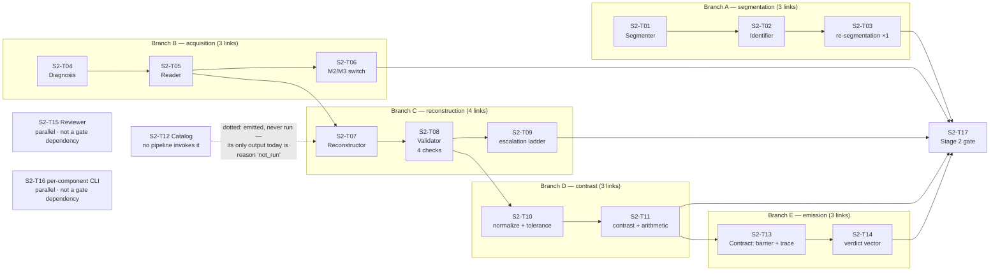
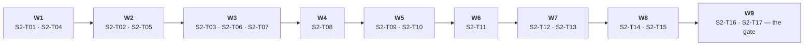

# Plan 2 — Domain components (Stage 2)

| Field | Value |
|---|---|
| Plan | **Plan 2 — Domain components** |
| Stage | **Stage 2 — components** (second of three) |
| Layer | **Domain** — the 10 components that know about documents, fields and verdicts; built on the Stage 1 kernels and ports, importing **ports only, never adapters** |
| Owner(s) | **Domain** — `docflow/components/` → `S2-T01`–`S2-T15`, `S2-T17` · **Surface** — `docflow/cli.py` → `S2-T16` (`wbs.md` §8) |
| Source docs | `wbs.md` §4, §6.2, §7, §8, §9 · `../idea/02-components.md` · `../idea/01-pipelines.md` (component-usage table, escalation) · `prd.md` FR-12…FR-24, NFR-06a/NFR-07 · `sad.md` §8, §9, §10, §11, ADR-003/005/007/009 · `traceability.md` §4, §7.2 |
| Companion plans | [`README.md`](README.md) (gate model) · [`plan-01-kernels.md`](plan-01-kernels.md) (frozen types and ports; its exit checklist is this plan's entry) · [`plan-03-pipelines.md`](plan-03-pipelines.md) (wires the 13 codes onto this plan's chain) |
| Lifecycle stage | **PoC** — happy path first; pragmatic shortcuts allowed and marked inline |
| Effort signal | `S` / `M` / `L` = relative complexity of implementation **and verification**, not calendar time (`wbs.md` §7) |

---

## §1 Objective

Stage 2 exists to make the system's answer to *"can this extracted value be trusted?"* exist as a thing a consumer can read, per field, and to prove it on a document that is real rather than synthetic. It builds the chain that turns a file into documents, pages, tokens, fields and finally a per-field verdict vector with a trace — and it closes only when a real document walks that chain and an `ErpVR` code reproduces the contrast case that no internal check can see: a total of `15400.00` that was really `1540.00` passes shape, type and content, has no check digit, and is caught **only** because a second, differently-failing reader contradicts it. Everything Stage 2 builds is in service of that: the Segmenter over-segments because a merged document is the one failure nothing downstream detects; the Validator owns the single definition of "could not"; Consistency normalizes before comparing and lets arithmetic break a tie before a human is involved; and the Contract refuses to collapse five independent signals into one number.

---

## §2 Scope

### In scope

| In scope | Tasks |
|---|---|
| Segmenter: cut detection, confidence per cut, over-segmentation on doubt, cuts recorded as evidence | `S2-T01` |
| Identifier: type by text / by shapes / mixed, type **plus evidence**, `other` route, low confidence → review | `S2-T02` |
| Re-segmentation loop: **one** pass, page reuse, second pass returning two types → review | `S2-T03` |
| Diagnosis: quality-not-presence gate, three outcomes, adaptation; policy from K8 with **no flag and no environment variable** | `S2-T04` |
| Reader: conversion (`pdftotext`) and OCR (Docling) paths routed **per page**; positioned tokens, no reading order | `S2-T05` |
| M2/M3 shared implementation with the rasterization switch at the front | `S2-T06` |
| Reconstructor: minimal layout + cross-page continuity + reading order | `S2-T07` |
| Validator: 4 **independent** checks, most-severe-failure governs, no code path skips validation | `S2-T08` |
| Validator owns "could not": the escalation ladder and its two cases | `S2-T09` |
| Consistency: normalize before comparing, tolerance by field type | `S2-T10` |
| Consistency across extractors — **contrast** — plus arithmetic tie-break | `S2-T11` |
| Catalog: external identity lookup, `unverified` ≠ invalid, owned retry queue, reason vocabulary | `S2-T12` |
| Contract: barrier, heterogeneous provenance, per-field `(page, extractor)` trace, partial emission | `S2-T13` |
| Contract: the verdict vector, `consistency` set only where both reads ran | `S2-T14` |
| Reviewer: `queue`, `correct`, `promote` (corrected datum / new rule / new type) | `S2-T15` |
| Per-component CLI subcommands with the documented read/write artifact chain | `S2-T16` |
| The real-document closing flow | `S2-T17` |

### Out of scope (deferred)

| Out of scope | Marker |
|---|---|
| Full Reconstructor table reconstruction (minimal layout + continuity is the PoC surface) | `# TODO: [MVP]` (`wbs.md` §4, `prd.md` §4.2) |
| The 6 pending Validator business-rule categories: range, relations between fields, conditional, structural, domain-specific, cross-document | `# TODO: [MVP]` |
| A real Catalog external source and its `--source` flag; the retry queue at scale | `# TODO: [MVP]` |
| Reviewer workflow UI and promotion controls (`queue`/`correct`/`promote` are enough to close the loop) | `# TODO: [MVP]` |
| `--format md\|html`, `--schema`, `--golden`, `--keep-artifacts`, `--isolate` | `# TODO: [MVP]` |
| A minimal document-type catalog in K8 (the Identifier ships with a minimal one) | `# TODO: [MVP]` |
| A real 3-invoice corpus fixture for the Segmenter (a synthetic one closes the flow) | `# TODO: [MVP]` |
| Telemetry, caching layers, HA, security compliance | `# TODO: [RELEASE]` |
| A `--no-validate` flag; any pipeline variant without `V`; a single confidence score; an OCR engine setting; merged-document detection; a `--verify` flag | **Never** (`prd.md` §10, ADR-001, ADR-002, ADR-005, ADR-006) |

---

## §3 Closing criterion (the stage gate)

**The flow that closes Stage 2: a real document traverses the canonical chain and emits a verdict vector + trace, with an `ErpVR` chain demonstrating contrast** (`wbs.md` §4, ADR-003).

"The canonical chain" is the closing criterion, **not the production route.** `sad.md` §9 draws `File → Segmenter → Identifier → Diagnosis → Reader → Reconstructor → Validator → Consistency → Catalog → Contract`, and Stage 2 must build that whole chain because the closing demo walks it. What the 13 pipelines do *not* do is run `Segmenter`, `Identifier`, `Reconstructor` and `Catalog` over the corpus (`01-pipelines.md`, component-usage table) — that is a statement about Stage 3, not about whether these tasks gate Stage 2 (`wbs.md` §6.2).

### Acceptance commands

```bash
# 1. standalone chain, one component at a time — the read/write artifact chain of sad.md §9.1
docflow segmenter     documentos/escaneo.pdf            --out work/
docflow identifier    work/escaneo.segments.json        --out work/
docflow diagnosis     work/escaneo.identity.json        --out work/
docflow reader        work/escaneo.diagnosis.json       --out work/
docflow reconstructor work/escaneo.tokens.json          --out work/
docflow validator     work/escaneo.document.json        --out work/
docflow consistency   work/escaneo.validated.json       --out work/
docflow catalog       work/escaneo.consistency.json     --out work/
docflow contract      work/escaneo.catalog.json         --out out/
docflow reviewer queue --out work/

# 2. the closing flow proper: a real document through an ErpVR code
docflow run --pipeline M1-ErpVR documentos/factura.pdf \
  --model ollama:qwen2.5 --out out/
```

### Observable evidence that the gate closed

| Evidence | Correct | The wrong result it guards against |
|---|---|---|
| `out/<name>.json` shape | each field carries `value`, `extractor`, `trace`, and `verdicts` with `shape`/`type`/`content`/`digit`/`consistency`/`catalog` **kept separate** | a single score, or a verdict vector missing a member (`FR-23`, ADR-005) |
| `consistency` on the `ErpVR` run | set, because both reads ran over the same text | `null` on an `ErpVR` chain — contrast silently absent where it was paid for |
| `consistency` on a single-read run | `null` — and `null` is information, not a gap | `ok` invented for a field nobody cross-checked |
| `catalog` on **every** field | present, `unverified`, with a reason (`not_run` \| `source_unavailable` \| `pending_retry`) | absent, or `unverified` with no reason — collapsing *never attempted* with *the source was down* (`FR-23`, `sad.md` §11) |
| `trace.page` and `trace.extractor` **per field** | a document with `r` offset-traced fields beside `p` bbox-traced fields emits both correctly | a single assumed origin — with per-field escalation, provenance stops being single |
| The `ErpVR` contrast case (AC below) | `consistency: disagreement` on `total`; arithmetic resolves it if exactly one value closes with `subtotal + taxes`; otherwise review with all verdicts intact | the `15400` value emitted as `ok` because every internal check passed it |
| A document with one illegible page of ten | that page marked, the other nine emitted with verdicts and traces, the absence declared | the whole document discarded ("failure is partial", `FR-24`) |
| `work/` intermediates | the documented chain: `.segments.json` → `.identity.json` → `.diagnosis.json` → `.tokens.json` → `.document.json` → `.validated.json` → `.consistency.json` → `.catalog.json` → result | a component that re-runs its predecessors, or an intermediate that is not the previous component's artefact |
| Ledger `not_applicable` | the stages this pipeline does not run, listed as absent **facts** | absent stages left ambiguous between "did not run" and "has not run yet" |

---

## §4 Entry conditions

**This is Plan 1's exit checklist (`plan-01-kernels.md` §11), plus the plan-specific additions.** Plan 2 does not start until every item below holds.

| # | Condition | Source |
|---|---|---|
| 1 | **Plan 1 is closed** — its §11 checklist is entirely ticked, including the doc-sync item | `plan-01-kernels.md` §11 |
| 2 | The frozen Stage 1 artefacts are available and unchanged: `Token`, `KernelResult`, `Evidence`, `Reason`, `CallRecord`, `Bytes`/`Artifact`; the five port interfaces; the 7-term cache key; the 7 durable ledger states; the determinism classes; the `KernelResult` envelope and the 5 exit codes; the closed `reason.code` set | `README.md` §3 |
| 3 | `S1-T19` closed: the synthetic flow runs, pauses, resumes and recovers from `stop --force`, invocable as `docflow-kernel orchestrator run descriptors/synthetic-3stage.yaml --out O` | `plan-01-kernels.md` §3 |
| 4 | K2, K3, K4, K5, K6 adapters are landed and, for the closing flow, **available**: `pdftotext` pinned; Docling installed; at least one Ollama model pulled (digest recorded); a frontier provider key in the environment | Plan 1 Wave 3; `sad.md` §3 |
| 5 | The registry contains the Stage 2 policy assets `S2-T04` consumes — `CUT_CONFIDENCE`, `MIN_CHARS`, `MIN_DPI` in `registry/policies/` — and **no CLI flag and no environment variable exists for any of them** | ADR-009, `prd.md` NFR-06a |
| 6 | The components import **ports only**; no adapter is importable from a component. Checked by the same import-isolation test `S1-T11` established | `sad.md` §1 |
| 7 | A document corpus to close on is chosen: one text PDF and one image PDF at minimum, so a single `ErpVR` chain exercises both reader paths. `# TODO: [MVP]` replace with the real 3-invoice fixture | `wbs.md` §4 |
| 8 | The open decisions in §12 are accepted as open. **#1 and #2 touch this plan's gate and are reviewed before `S2-T11` starts**, not before `S2-T01` | this plan §12 |

---

## §5 Work sequence

Waves are **derived from the `Depends on` column** of `wbs.md` §4: a wave is the set of tasks whose entire dependency set is terminal when the wave starts.

### The five branches of `S2-T17`

`S2-T17` waits on **five** dependencies, each the head of a chain (`wbs.md` §6.2). They run in parallel, so the lead time is the **longest** chain, not the sum.



`S2-T15` and `S2-T16` are **not** dependencies of `S2-T17` (`wbs.md` §4), and `wbs.md` §6.2 lists both as tasks that can slip past a stage close. They are drawn because they are terminal before the gate in the wave map, not because the gate waits on them.

**The longest chain is B → C → D → E: nine links from `S2-T04` to `S2-T17`** — `S2-T04 → S2-T05 → S2-T07 → S2-T08 → S2-T10 → S2-T11 → S2-T13 → S2-T14 → S2-T17`.

| Branch | Chain | Links | Required by `S2-T17` through |
|---|---|:---:|---|
| **A — segmentation** | `S2-T01 → S2-T02 → S2-T03` | 3 | direct |
| **B — acquisition** | `S2-T04 → S2-T05 → S2-T06` | 3 | direct |
| **C — reconstruction** | `S2-T05 → S2-T07 → S2-T08 → S2-T09` | 4 | direct |
| **D — contrast** | `S2-T08 → S2-T10 → S2-T11` | 3 | direct |
| **E — emission** | `S2-T11 → S2-T13 → S2-T14` | 3 | direct |

**`S2-T08` (Validator) is the busiest node.** Branches C, D and E all pass through it, which is why its `# TODO: [MVP]` (the 6 deferred business-rule categories) must not become a blocker: the four universal checks are the PoC surface and they land at `S2-T08` regardless.

**Branch A is mandatory but is not the schedule driver.** Three links against the longest chain's nine, so it can start later than `S2-T04` and still not delay the close. It cannot be *skipped*, and it cannot slip past `S2-T17`.

### Wave map



**Wave 1 — 2 tasks.** *Why a wave:* `S2-T01` depends on `S1-T19`, and `S2-T04` depends on `S1-T12`/`S1-T13` — all three terminal when Plan 2 starts. These are the two branch heads that can begin immediately.

**Wave 2 — 2 tasks.** *Why a wave:* `S2-T02` needs `S2-T01`; `S2-T05` needs `S2-T04` **and** `S1-T14`, all terminal now. The acquisition and segmentation branches advance in parallel.

**Wave 3 — 3 tasks.** *Why a wave:* `S2-T03` needs `S2-T02`; `S2-T06` and `S2-T07` both need `S2-T05`. Branch A closes its third link here; branch B closes and branch C opens.

**Wave 4 — 1 task.** *Why a wave:* `S2-T08` needs `S2-T07` and nothing else. The busiest node is alone in its wave, which is the honest picture: three branches are waiting on it.

**Wave 5 — 2 tasks.** *Why a wave:* `S2-T09` and `S2-T10` both need `S2-T08`. Branch C's fourth link and branch D's first link open together.

**Wave 6 — 1 task.** *Why a wave:* `S2-T11` needs `S2-T10`. This is the contrast task — the one the whole architecture exists for — and it gates branches D and E simultaneously.

**Wave 7 — 2 tasks.** *Why a wave:* `S2-T12` and `S2-T13` both need `S2-T11`. The Catalog (a leaf, emitted but never run) and the Contract's barrier open together.

**Wave 8 — 2 tasks.** *Why a wave:* `S2-T14` and `S2-T15` both need `S2-T13`. Branch E closes its second link; the Reviewer opens. Neither is a dependency of the gate; both can slip (`wbs.md` §6.2).

**Wave 9 — 2 tasks.** *Why a wave:* `S2-T17` is the join of `S2-T03`, `S2-T06`, `S2-T09`, `S2-T11`, `S2-T14`, all terminal once Wave 8 lands. `S2-T16` needs `S2-T14` only, so it is first-satisfied at Wave 8 and lands here. This is the gate wave.

### The ordered task table

| Order | Task ID | Title | Deliverable (path) | Depends on | Verifiable "done when" | Effort | PoC markers |
|---:|---|---|---|---|---|---|---|
| 1 | `S2-T01` | Segmenter: cut detection (restarted numbering, new header, table continuity) + confidence per cut | `docflow/components/segmenter.py` | `S1-T19` | A doubtful cut **over-segments**; there is no flag to disable it; cut decisions are recorded as evidence | L | `# TODO: [MVP]`: real 3-invoice corpus fixture |
| 2 | `S2-T04` | Diagnosis: quality-not-presence gate, three outcomes, adaptation | `docflow/components/diagnosis.py` | `S1-T12`, `S1-T13` | A page with a stale invisible OCR layer is **not** routed to conversion; an illegible image routes aside with a reason instead of reaching OCR; `MIN_CHARS`/`MIN_DPI` come from K8 (`registry/policies/`) with **no CLI flag and no environment variable**; the kernel reports the measurement and Diagnosis takes the decision — no threshold is a constant inside K3 or K4 | L | `# TODO: [MVP]`: policy tuning UI; real legibility fixtures |
| 3 | `S2-T02` | Identifier: type by text / by shapes / mixed, returning type **plus evidence**; low confidence routes to review | `docflow/components/identifier.py` | `S2-T01` | Evidence exposes which words or shapes triggered the decision; an "other" route exists; a misclassified document is explainable without re-running | L | `# TODO: [MVP]`: document-type catalog in K8 is minimal |
| 4 | `S2-T05` | Reader: conversion path (`pdftotext`) and OCR path (Docling), routed **per page** | `docflow/components/reader.py` | `S2-T04`, `S1-T14` | A mixed PDF combines both paths and joins at the end; Docling is **never** used on the conversion path; output is positioned tokens, not ordered text | L | `# TODO: [MVP]`: OCR correction policy surface |
| 5 | `S2-T03` | Re-segmentation loop with its **single** pass and page reuse | `docflow/components/identifier.py` + `segmenter.py` | `S2-T02` | Two types in one segment → re-segment **once**, reusing pages already read; a second pass returning two types routes to review; there is no third pass | M | — |
| 6 | `S2-T06` | M2/M3 shared implementation with the rasterization switch at the front | `docflow/components/reader.py` (cont.) | `S2-T05` | `M2` and `M3` differ **only** by the `K2.render` step; one code path, verified by a test that asserts the switch | M | — |
| 7 | `S2-T07` | Reconstructor: minimal layout + cross-page continuity + reading order | `docflow/components/reconstructor.py` | `S2-T05` | A table whose header is on one page and whose rows continue on the next keeps the association; a header repeated across pages is collapsed once | L | `# TODO: [MVP]`: full table reconstruction; `--continuity-only` |
| 8 | `S2-T08` | Validator: 4 **independent** checks issuing independent verdicts; most-severe-failure governs | `docflow/components/validator.py` | `S2-T07` | A field can pass shape and type, fail content, and route to review; the check digit can reject while the rest pass; no code path skips validation | L | `# TODO: [MVP]`: the 6 pending business-rule categories |
| 9 | `S2-T09` | Validator owns "could not": the escalation ladder and the two cases | `docflow/components/validator.py` (cont.) | `S2-T08`, `S1-T13` | An invalid field renders **only** its region and contrasts against the existing value; a missing field re-reads the whole document with **no saving**, and this is visible in the ledger | M | `# TODO: [MVP]`: escalation budget/ceiling |
| 10 | `S2-T10` | Consistency: normalize before comparing; tolerance by field type | `docflow/components/consistency.py` | `S2-T08` | `1.540,00` and `1540.00` compare equal; amounts use cents tolerance while identifiers and dates are exact; the raw values are **not** what is compared | M | `# TODO: [MVP]`: more field-type tolerances as types are defined |
| 11 | `S2-T11` | Consistency across extractors — **contrast** — plus arithmetic tie-break | `docflow/components/consistency.py` (cont.) | `S2-T10` | The 1540/15400 case produces a disagreement verdict; arithmetic resolves it where only one value closes with `subtotal + taxes`; an identifier disagreement with no arithmetic relation routes to review | L | `# TODO: [MVP]`: contrast scope beyond critical fields |
| 12 | `S2-T12` | Catalog: external identity lookup, `unverified` ≠ invalid, owned retry queue | `docflow/components/catalog.py` | `S2-T11` | A non-responding source yields `unverified`, never a rejection; the retry queue is visible in the output as a pending field, not a missing one; the verdict's **reason** (`not_run` \| `source_unavailable` \| `pending_retry`) keeps "never attempted" distinguishable from "the source was down". **No pipeline invokes it** in the PoC, so today every field reads `not_run` | M | `# TODO: [MVP]`: real external source and `--source` |
| 13 | `S2-T13` | Contract: barrier, heterogeneous provenance, per-field `(page, extractor)` trace | `docflow/components/contract.py` | `S2-T11` | Emits the barrier only when all pages are resolved; a document with `r` offset-traced and `p` bbox-traced fields is emitted correctly; an illegible page is marked and the rest still emitted; **every field carries its `catalog` verdict with a reason even where the Catalog never ran** | L | `# TODO: [MVP]`: `--format md\|html` |
| 14 | `S2-T14` | Contract: the verdict vector, with `consistency` set only where both reads ran | `docflow/components/contract.py` (cont.) | `S2-T13` | Output matches the documented JSON shape; a single-read pipeline emits `consistency: null`; **no** derived single score exists in the output | M | — |
| 15 | `S2-T15` | Reviewer: `queue`, `correct`, `promote` (corrected datum / new rule / new type) | `docflow/components/reviewer.py` | `S2-T13` | Cases land beside their document with provenance; a promoted rule becomes registry data in K8 and invalidates the affected cache keys | M | `# TODO: [MVP]`: workflow UI, promotion controls |
| 16 | `S2-T16` | Per-component CLI subcommands with the documented read/write artifact chain | `docflow/cli.py` (cont.) | `S2-T14` | Each of the 10 components runs standalone from the previous component's artifact to its own; re-running one stage does not repeat the ones before it | M | `# TODO: [MVP]`: `--show-evidence`, `--schema` |
| 17 | `S2-T17` | **Stage 2 closing flow (real document)** | Integration test + documented demo | `S2-T03`, `S2-T06`, `S2-T09`, `S2-T11`, `S2-T14` | A real document traverses the canonical chain through an `ErpVR` code and emits a result with a verdict vector and a trace per field; the contrast case is reproduced end to end; partial failure marks one page only | L | — (**the gate; not deferrable**) |

**No task dropped, none renumbered, none added.** Total: **17**.

---

## §6 Flow-closing procedure

The runbook for closing Stage 2, in the order a person executes it. Steps 1–3 establish the input; 4–6 walk the chain; 7–9 are the specific claims the gate must prove; 10–11 are recovery and the tick.

| # | Action | What to look at | A correct result | The wrong result this step guards against |
|---:|---|---|---|---|
| 1 | **Prepare the fixture.** Choose a real text PDF (`documentos/factura.pdf`, a text layer with a usable but *not* trivially clean layout) and a real image PDF or image. Nothing synthetic is accepted for the gate — Stage 1 already proved the synthetic path | the two files; their material | a text PDF whose `pdf classify` is `text`; an image whose `pdf classify` / `image info` says pixels | a PDF with a stale invisible OCR layer used as the "text" case — it would route to conversion and drag the old OCR errors along |
| 2 | **Confirm the material the chain will choose.** `docflow diagnosis`'s predecessor is `identifier`; but first confirm the kernels agree. `docflow-kernel pdf classify documentos/factura.pdf --page 1` | `value`, `evidence`, exit code | `text`, with `invisible_text: false` and producer metadata consistent | `text` because a text layer *exists* rather than because it is *usable* — the gate is quality, not presence (`FR-15`) |
| 3 | **Confirm the mode is contrast-capable.** The closing chain is `M1-ErpVR` (ADR-003): `rp`, not `r` and not `p` | the chosen code, and the ledger's stage set | `extract.r` **and** `extract.p` both present; `consistency` will therefore be set | closing on `M1-ErVR` or `M1-EpVR`, where `consistency` is `null` by construction and the contrast case cannot be reproduced |
| 4 | **Walk the chain standalone** (the ten commands in §3). Run each component against the previous one's artefact | `work/*.json` at each step | each artefact is the documented one (`.segments.json`, `.identity.json`, `.diagnosis.json`, `.tokens.json`, `.document.json`, `.validated.json`, `.consistency.json`, `.catalog.json`), and each step reads the previous one | a component that silently re-runs its predecessors, or an artefact named differently in the docs than on disk |
| 5 | **Run the flow as one command.** `docflow run --pipeline M1-ErpVR documentos/factura.pdf --model ollama:qwen2.5 --out out/` | exit code; `out/<name>.json`; `out/<name>.ledger.json`; `out/<name>.work/` | one result, one ledger beside it, one `work/` of intermediates; the ledger lists the stages this pipeline runs and puts `segmenter`/`identifier`/`reconstructor`/`catalog` in `not_applicable` | a ledger that lists stages this pipeline never ran as if they were stages |
| 6 | **Read the emitted field shape.** | `out/<name>.json` | every field: `value`, `extractor`, `trace` (`page` + `offset` or bbox), `verdicts` with all six members separate | a collapsed score; a missing `catalog`; a trace without a page or without an extractor |
| 7 | **Reproduce the contrast case end to end.** Use a document whose `total` is `1540` and arrange the extraction to read `15400` (the fixture is the document plus the read) | `verdicts.consistency` on `total`; then the arithmetic resolution | `consistency: disagreement`; arithmetic checked **first**; if exactly one value closes with `subtotal + taxes`, resolved without a human; if neither closes, routed to review with its verdicts intact | `content: ok` and everything `ok` because no internal check can see it — the failure the whole architecture exists to catch (AC below, `FR-21`) |
| 8 | **Prove partial failure.** Take one document with one illegible page and nine readable ones | the emitted result; the ledger; the routing decision | the illegible page is marked as such, the remaining fields are emitted with verdicts and traces, and the absence is declared | the whole document discarded. Also: the illegible page reaching OCR and returning invented text indistinguishable from a real read — the outcome `FR-15` calls invalid |
| 9 | **Prove the Catalog's absence is a fact, not a gap.** | `verdicts.catalog` and its reason on every field | `unverified` with reason `not_run` on every field, because no pipeline runs the Catalog | `catalog` absent, or `unverified` with no reason — which makes *never attempted* and *the source was down* the same word (`FR-23`) |
| 10 | **Interrupt and re-run one stage.** Kill the run mid-`extract.p`, then re-run step 5 | the ledger; which stages re-run | `extract.r`'s artefact is reused (it is still there and verifies); at most one stage per in-flight document re-runs; a **sampled** `extract.p` artefact that is *missing* reports `failed` rather than being re-sampled | `extract.p` silently re-sampled, changing the result while reporting success — Plan 1's invariant, now exercised through a domain component |
| 11 | **Tick the exit checklist** (§11) and record the frozen artefacts for Plan 3 | §11, §8 | all boxes ticked, including doc-sync | a stage declared closed with its own criterion unmet |

---

## §7 Verification & test plan

### (a) Happy-path test that must pass to close the flow

`S2-T17`'s integration test, driving a real document through the canonical chain on an `ErpVR` code and asserting: the result matches the documented JSON shape; every field carries all six verdicts and a `(page, extractor)` trace; `consistency` is set (both reads ran); the contrast case reproduces end to end; partial failure marks one page and emits the rest. This is the gate; the other tests exist to make a failure of this one attributable.

### (b) Invariant tests that must FAIL when the invariant is broken

| Invariant | Test | What breaking it looks like | Task |
|---|---|---|---|
| The Segmenter over-segments when in doubt | Doubtful-cut fixture; assert a split, not a merge | a doubtful cut is merged; a `--no-oversegment`-shaped flag appears | `S2-T01` (ADR-007) |
| Re-segmentation runs **once only** | Second pass still returning two types | a third pass exists; or the loop re-reads pages it already had | `S2-T03` (`FR-14`) |
| Diagnosis gates on **quality**, not presence | A stale invisible OCR layer fixture | the page routes to conversion and the old OCR errors are dragged along **uncorrected** | `S2-T04` (`FR-15`) |
| No threshold is a constant inside K3 or K4 | Grep + a test that changes the registry policy and observes the route change | `MIN_CHARS`/`MIN_DPI` hardcoded in a kernel; or settable from the environment (ADR-009) | `S2-T04` (`NFR-06a`) |
| The Reader never uses Docling on the conversion path | Assert the engine called per page on a mixed PDF | a page with a usable text layer is re-read through OCR, degrading clean text | `S2-T05` (`FR-16`) |
| The Reader returns tokens, not ordered text | Assert no reading order is resolved at the reader boundary | ordered text, which would absorb part of the Reconstructor and remove its reason to exist | `S2-T05`, `S2-T07` (`FR-17`) |
| M2 and M3 share one implementation | Assert `K2.render` is the only difference | two code paths drift, making six of the thirteen "three designs with a prefix" an accident | `S2-T06` (`FR-32`) |
| The four Validator checks are independent | A field passing shape and type, failing content | a chained implementation where a shape failure suppresses the content verdict | `S2-T08` (`FR-18`) |
| No code path skips validation | Contract test asserting no `--no-validate` exists, on either surface | an escape hatch for rules-only pipelines appears | `S2-T08` (`FR-18`, ADR-002) |
| "Could not" is defined in exactly one place | Assert the Identifier and Diagnosis contain no escalation decision | the policy spreads back across three components, none aware of the others | `S2-T09` (`FR-19`) |
| Normalize **before** comparing | `1.540,00` vs `1540.00`; a spaced vs unspaced identifier | the raw values are compared, so the review queue fills with spelling differences | `S2-T10` (`FR-20`) |
| Tolerance by field type | Amounts within cents; identifiers and dates exact | cents tolerance applied to an identifier, hiding a genuinely different digit | `S2-T10` (`FR-20`) |
| Contrast exists and is the only detector of the class | The 1540/15400 case | the disagreement verdict is not produced; or `consistency` is emitted `ok` when only one read ran | `S2-T11` (`FR-21`) |
| An outage is not a rejection | A non-responding Catalog source | `unverified` collapses into a rejection, turning an incident into a queue of bad documents | `S2-T12` (`FR-22`) |
| `unverified` always carries its reason | Assert a reason on every `catalog` verdict | `not_run` and `source_unavailable` collapse into one word | `S2-T12`, `S2-T13` (`FR-23`) |
| Emission is a verdict vector, never a score | Assert no derived single number exists in the output | a `confidence` field appears and a field nobody cross-checked becomes indistinguishable from one that survived contrast | `S2-T14` (ADR-005, `FR-23`) |
| `consistency: null` on single reads | Run an `ErVR` and an `EpVR` code | `consistency` invented as `ok` for a field with no second read | `S2-T14` (`FR-23`) |
| Failure is partial | Ten pages, one illegible | the document is discarded instead of emitted with the absence declared | `S2-T13` (`FR-24`, AC below) |
| The trace points at the right pixels | Escalation crop traced back to the source page | a crop's local coordinates reach the Contract; both boxes are valid JSON so nothing else notices | `S2-T09`, `S2-T13` (`NFR-07`) |
| Per-component invocation does not repeat predecessors | Re-run `validator` alone | upstream stages re-execute, defeating the point of a per-component surface | `S2-T16` (`FR-12`) |

### (c) Acceptance scenarios that belong to this stage

Two of the six Gherkin scenarios close at Stage 2 (`traceability.md` §6):

| Scenario | Where | Closes at |
|---|---|---|
| *The 15400 vs 1540 contrast case* | `prd.md` §8 | `S2-T11`, asserted end to end by `S2-T17` |
| *Partial failure marks one page* | `prd.md` §8 | `S2-T13`, asserted by `S2-T17` |

The stage's own matrix rows — the parts of `kernel-cli.md` §11 that Stage 2 makes *reachable through a component* rather than only through the lab surface. These rows still assert at the kernel layer (`S1-T22`); what Stage 2 adds is the proof that the component wiring preserves them:

| Matrix rows the components must not break | Exercised through |
|---|---|
| Row 3 — a stale invisible layer read as a text PDF | `S2-T04` routing decision |
| Row 7 — a blurred image passed to OCR | `S2-T04` route-aside decision |
| Row 8 — a crop's local coordinates as a page region | `S2-T09` → `S2-T13` trace |
| Row 10 — missing confidence read as perfect | `S2-T08`/`S2-T14` verdict emission |
| Row 11 — a truncated page read as a page with no text | `S2-T05` reader path, partial-failure emission |
| Row 12 — a truncated generation parsed as complete | `S2-T05`/`S2-T08` on the `p` path; contrast must not rescue a truncated read |

### (d) What is explicitly NOT tested at this stage

| Not tested | Why | Marker |
|---|---|---|
| The 13 pipeline codes, `--extractor`, batch, mirrored tree, `run.json` shape | Stage 3 owns the routes; Stage 2 exercises **one** canonical `ErpVR` code | — |
| Corpus scale, throughput, latency, resume over 11k files | The first full run sets the baseline | `# TODO: [MVP]` (`NFR-11`) |
| Full table reconstruction; the 6 business-rule categories | Deferred with markers | `# TODO: [MVP]` |
| A live external Catalog source and its retry queue at scale | No pipeline runs the Catalog; only `not_run` and the non-responding path are asserted | `# TODO: [MVP]` |
| The Reviewer workflow beyond `queue`/`correct`/`promote` | Deferred | `# TODO: [MVP]` |
| Merged-document detection | No pipeline closes it | **Never** |
| Golden-set comparison | Needs a golden set to exist | `# TODO: [MVP]` |

---

## §8 Traceability

Requirement IDs from `traceability.md` §4 (`FR` §4.1, `NFR` §4.2). "Test / proof" names the artefact that proves it in this plan.

| Task ID | FR / NFR satisfied | Test / proof |
|---|---|---|
| `S2-T01` | **FR-13** | ADR-007 test: a doubtful cut is not merged; over-segmentation flag-absence test |
| `S2-T02` | *(no FR — see the gap note)*; **FR-23** in part (type evidence recorded) | Evidence-exposes-trigger test; `other`-route test; explain-without-re-running test |
| `S2-T03` | **FR-14** | Second pass returning two types routes to review; page-reuse test |
| `S2-T04` | **FR-15**, **NFR-06a** | Stale-invisible-layer not routed to conversion; illegible → route aside with a reason; the "no policy value settable from the environment" test |
| `S2-T05` | **FR-16**, **FR-17** | Mixed PDF joins two paths; Docling never on the conversion path; tokens carry boxes; contract test for the absent `--engine` |
| `S2-T06` | **FR-32** | A test asserting the rasterization switch is the only difference between M2 and M3 |
| `S2-T07` | *Stage 2's criterion requires the reading order it produces (`traceability.md` §7.3 defect 16)*; contributes to **FR-24** | Cross-page header/rows association test; repeated-header collapse test |
| `S2-T08` | **FR-18** | A field passes shape + type, fails content, routes to review; check digit rejects while the rest pass |
| `S2-T09` | **FR-19**, **NFR-07** | Invalid → region only; missing → whole document with no saving, visible in the ledger |
| `S2-T10` | **FR-20** | `1.540,00` == `1540.00`; identifiers exact; raw values are not what is compared |
| `S2-T11` | **FR-21** | AC *The 15400 vs 1540 contrast case* |
| `S2-T12` | **FR-22**, **FR-23** | Non-responding source → `unverified`, never rejected; retry queue visible as a pending field; the three reasons stay distinguishable |
| `S2-T13` | **FR-23**, **FR-24**, **NFR-07** | AC *Partial failure marks one page*; the barrier release test; heterogeneous-provenance test; `catalog` present with a reason on every field |
| `S2-T14` | **FR-23** | Output matches the documented shape; `consistency: null` on single-read runs; no derived score exists |
| `S2-T15` | *(no FR — see the gap note)* | A promoted rule becomes K8 data and invalidates the affected cache keys |
| `S2-T16` | **FR-12** | Each component runs from the previous artefact; re-running one stage does not repeat the earlier ones |
| `S2-T17` | **FR-21**, **FR-24**, **FR-12** (the demo walks the standalone chain) | The Stage 2 integration test itself |

**Gap note — `S2-T02` and `S2-T15` have no FR of their own.** `traceability.md` §4.1 has no row naming the Identifier's *evidence* or the Reviewer's promotion path: the FRs that touch them (FR-12, FR-23) cover their surface, not their behaviour. Two observations, recorded rather than papered over:

- **`S2-T15` (Reviewer) is a genuine gap of the same shape `README.md` calls out** — *"without a return loop, the system does not improve"* is an invariant, not an FR. The task is justified by `wbs.md` §4 and `02-components.md`, and by `traceability.md` §5's "no orphan task" check, which traces it to `FR-12…FR-24` as a group. Closing the gap properly means adding an FR for "corrections return into the pipeline as registry data", which changes `prd.md` — an artifact change, out of scope for a plan.
- **`S2-T02`** does trace: its evidence requirement is what makes FR-23's verdict vector explicable, and it is the guard for `wbs.md` §9's "unknown wording variants" reachable at Stage 3. The mapping is indirect, and indirect is recorded here rather than upgraded to direct.

---

## §9 Risks specific to this plan

From `wbs.md` §9 and `sad.md` §13, keeping only rows whose **Owner stage includes 2**:

| Risk | L | I | Mitigation in this plan |
|---|:---:|:---:|---|
| **Docling install / portability** — heavy dependency, platform-specific backend, GPU variant differences | M | H | Kept behind the K4 port with a test double (`S1-T14`); the adapter revision is pinned into the cache key; `engine_info` is recorded in evidence |
| **`pdftotext` is a poppler external binary** | M | M | Pin a version; a missing binary is a typed `Reason`, never a fallback reader (`S2-T05` must not invent a reader) |
| **GPU availability for local models** (Ollama) | M | H | Typed error naming the remedy; `gpu` slot bounded to one generation per device; **never** a silent fallback model |
| **Frontier LLM cost per token during validation** | H | M | Contrast scoped to critical fields only (registry policy, ADR-009); `count_tokens` before spending (`# TODO: [MVP]`); the circuit breaker degrades to `unverified`, never to rejection |
| **Segmenter merged-document gap that no pipeline closes** | M | H | Declared, never claimed solved: over-segmentation mitigates; the Identifier's "two types" signal feeds the cut threshold. **Residual risk accepted** (`wbs.md` §9) |
| **Sampled artifact regenerated on resume**, silently changing the result | M | H | The orchestrator reads the determinism class; missing evidence → `failed`; retrying to agreement is forbidden and attempts are counted — exercised through a component in §6 step 10 |

**Plan-specific execution risk — the one that bites if the wave order is violated.** Four ways, and each produces a green suite over an unproven claim:

1. **Building branch A late.** `S2-T03` is a direct dependency of `S2-T17`. Starting the Segmenter in Wave 7 because branch A "is not the schedule driver" leaves the gate waiting on a three-link chain that was available since Wave 1. `wbs.md` §6.2 is explicit that *not the driver* is not *not required*.
2. **Treating `S2-T08` as a place to defer.** It is the busiest node — branches C, D and E pass through it. Deferring its `# TODO: [MVP]` (the 6 business-rule categories) is correct; deferring **the four universal checks** to unblock branch D blocks three branches at once and removes the only thing that makes escalation meaningful.
3. **Slipping `S2-T12` into the gate without deciding it.** The `catalog` reason vocabulary (`not_run`) is defined by `S2-T12`, yet `FR-23` obliges the **Contract** (`S2-T13`) to emit a `catalog` verdict with that reason on every field. Building `S2-T13` before the `not_run` value is pinned produces either a missing verdict or an invented one. This is §12 #1 and it is why it is reviewed **before `S2-T11` starts**, not at the gate.
4. **Closing the gate on a single-read primitive.** `M1-ErVR`/`M1-EpVR` traverse the chain and emit a defensible shape — with `consistency: null` everywhere. The gate would pass while the one claim Stage 2 exists to prove (contrast detects the plausible-but-false value) was never exercised. ADR-003 fixes `ErpVR` as the closing primitive for exactly this reason.

---

## §10 Definition of Ready / Definition of Done

### Task DoR

- The task names the artifact it produces, and the artifact has a single owner — `wbs.md` §8's ownership table: Domain for `docflow/components/`, Surface for `docflow/cli.py`.
- Its dependencies are `done`, or the task states the interface it assumes from them. For every task here that interface is a **port**, never an adapter.
- The verifiable criterion is written **before** the work starts and can be checked without reading the implementation.
- Any PoC shortcut is declared with its `# TODO: [MVP]` / `# TODO: [RELEASE]` marker **at creation**.
- Additional, from `traceability.md` §8: the task's row in `traceability.md` §4 exists, or its absence is recorded as a gap with a reason (§8 above).

### Task DoD

- The artifact exists at the documented path and is exercised by at least one automated test.
- The verifiable criterion in §5 passes.
- **No domain noun entered a kernel API**; **no adapter is imported from a component**; the abstraction arrow still points only down.
- **No silent stand-in**: no empty string, `0`, `[]`, `None`-without-reason, and no default model, engine or threshold.
- **No threshold lives in a component**: every threshold is registry data with no CLI flag and no environment variable (ADR-009).
- Every shortcut taken is marked with `# TODO: [MVP]` / `# TODO: [RELEASE]`.

### Stage DoD (Plan 2)

- Every one of the 17 tasks is `done`.
- **The real-document flow closes** — §3's criterion, run from a clean checkout with the documented command, on an `ErpVR` code.
- The riskiest invariant introduced at this stage has a test that **fails when the invariant is broken** (§7b) — for Stage 2 that invariant is **contrast is the only detector of the plausible-but-false value, and its absence is visible as `consistency: null` rather than invented as `ok`**.
- `prd.md`, `sad.md`, `wbs.md` and `traceability.md` still agree with what was built; divergences resolved before Plan 3 starts. In particular `sad.md` §9's chain and §11's output shape must match the emitted bytes.

---

## §11 Exit checklist

Plan 3's §4 entry condition is this list and nothing else.

- [ ] All 17 tasks `S2-T01`–`S2-T17` are `done`, each with its verifiable criterion passing.
- [ ] A real document traverses the canonical chain through an `ErpVR` code and emits a result with a verdict vector and a per-field trace.
- [ ] Every field in the output carries `value`, `extractor`, `trace`, and **all six** verdicts kept separate: `shape`, `type`, `content`, `digit`, `consistency`, `catalog`.
- [ ] **No** derived single score exists anywhere in the output.
- [ ] `consistency` is **set** on the `ErpVR` closing run and `null` on a single-read run; the contrast case (1540 vs 15400) is reproduced end to end and arithmetic breaks the tie where it can.
- [ ] Every field carries a `catalog` verdict of `unverified` **with a reason**, and the three reasons (`not_run` \| `source_unavailable` \| `pending_retry`) remain distinguishable.
- [ ] A document with one illegible page and nine readable ones emits the nine with verdicts and traces and marks the illegible one — the document is not discarded.
- [ ] The Segmenter over-segments a doubtful cut; no flag exists to disable it; the re-segmentation loop runs exactly once and reuses pages already read.
- [ ] A page with a stale invisible OCR layer is **not** routed to conversion; an illegible image routes aside with a reason and does not reach OCR.
- [ ] Docling is used **only** on the OCR path; the conversion path uses `pdftotext`; no engine setting exists on either surface.
- [ ] The four Validator checks issue independent verdicts and the most severe failure governs; no code path anywhere skips validation.
- [ ] The escalation ladder's two cases behave differently and the difference is visible in the ledger: invalid → region only; missing → whole document, no saving.
- [ ] Consistency normalizes before comparing; amounts tolerate cents, identifiers and dates are exact.
- [ ] The 10 components each run standalone from the previous component's artefact, and re-running one does not repeat the ones before it.
- [ ] The per-document ledger lists the stages this pipeline runs and records the rest in `not_applicable` as **facts**, not as gaps.
- [ ] No component imports an adapter; no threshold is a constant inside a component or a kernel.
- [ ] The frozen Plan 2 artefacts are named in Plan 3's §4: the verdict-vector shape, the trace shape, the `catalog` reason vocabulary, the component artifact chain, and the escalation policy's single ownership.
- [ ] **Doc-sync:** `prd.md`, `sad.md`, `wbs.md`, `traceability.md` still agree with what was built. Every divergence is resolved in the docs **before Plan 3 starts**, and `traceability.md` §5 is re-checked so the stage close produces no orphan task.

### The four tracks, ticked separately (§13)

| Track | Tick when |
|---|---|
| **1 — Fast flow** | A real document closes the chain through `M1-ErpVR` — **on real adapters, nothing stubbed** — and the contrast case is reproduced end to end |
| **2 — Golden set / tests** | Each golden claim of §13 Track 2 has a test that **fails when the claim is broken**, starting with `15400`/`1540` reading `consistency: disagreement` and not `ok` |
| **3 — Code (for reuse)** | Plan 3 can wire the 13 codes onto this chain and emit the **frozen** verdict-vector and trace shapes unchanged for all 13 (`FR-33`) |
| **4 — CLI (to probe)** | All 10 components run standalone from the previous component's artifact to their own; re-running one does not repeat the ones before it; no policy flag and no `--no-validate` exists |

---

## §12 Open decisions carried into this plan

Only the decisions that touch Stage 2. The first three are **load-bearing** and are reviewed before the wave that depends on them, not at the gate.

| # | Open decision | Where it originates | What it touches in this plan | Impact if deferred past Stage 2 |
|---:|---|---|---|---|
| 1 | **Whether `S2-T12` (Catalog) becomes a dependency of `S2-T17`.** `FR-23` obliges the Contract (`S2-T13`) to emit a `catalog` verdict with the reason `not_run` on **every** field, and that value is the Catalog's to define — yet the dependency diagram marks the Catalog unreachable (`wbs.md` §6.2, dotted edge). Either `S2-T17` gains the dependency, **moving the Catalog onto the critical path**, or `not_run` is defined somewhere the Contract can reach without the Catalog existing | `traceability.md` §7.2; `wbs.md` §6.2 | `S2-T12`, `S2-T13`, `S2-T14`, `S2-T17` | **Live in this plan.** Building `S2-T13` before pinning `not_run` produces either a missing verdict or an invented one. The choice also changes the dependency table, which is the thing `wbs.md` §6.2 is derived from. **Recommendation to settle at Wave 7, not at the gate** — but recorded as open, not resolved |
| 2 | **What M0's targeted escalation means.** With no page and no image, "render the region" is meaningless. Either it becomes "re-read a span of the supplied string", or M0 escalates only to the cascade | `01-pipelines.md` (open questions, escalation); `traceability.md` §7.2 | `S2-T09` (builds the ladder), `S2-T11` (contrast scope) | `S2-T09` builds the escalation ladder and `M0-*` is three of the thirteen codes. Discovering at `S3-T13` that M0 breaks an assumption the other ten materials share would invalidate the shape-identity test (`FR-33`) rather than one pipeline. `traceability.md` §7.2 names this the one item that **should be settled before Stage 2** |
| 3 | **What defines a "critical field".** Both the contrast policy and the target of escalation depend on it; today it exists as an expression in `02-components.md` and nowhere as data | `01-pipelines.md` (open questions) | `S2-T11` (contrast is scoped to critical fields), `S2-T13`, and `S3-T04` (where the policy asset lands) | Contrast cost is the reason for the scoping, so an undefined critical-field set means either contrast over everything (expensive) or over a guess (unreliable). It also decides what `S3-T04` must ship. Carried forward to Plan 3 §12 if unresolved here |
| 4 | **Whether OCR correction is inside the OCR step.** `02-components.md` has the Reader correcting OCR output (characters and spacing, never digits, raw retained); the M2/M3 prefixes are written as a single `OCR` step, so correction is either inside it or absent | `01-pipelines.md` (open questions) | `S2-T05`, `S2-T06` | The PoC answer is "correction is deferred" (`S1-T14` marks the OCR correction pass `# TODO: [MVP]`), which is consistent and closes the flow. Resolving it the other way would add a stage to the M2/M3 prefix, i.e. a ledger stage that `S3-T03` would have to derive |
| 5 | **What decides `r` vs `p` inside `ErpVR` when both run and disagree.** Arithmetic can break the tie only for fields with an arithmetic relation; for an identifier there is no tie-breaker | `01-pipelines.md` (open questions) | `S2-T11` | Handled for the PoC by the documented rule — disagreement with no arithmetic relation routes to **review**, which is a correct terminal state, not a gap. Carried as open because the Consistency-arbiter *role* named in `02-arch-components.md` has no definition yet |
| 6 | **Whether the Reviewer's cases are aggregated after the run.** `03-cli.md` puts them in the per-document ledger; whether anything aggregates them into something the Reviewer can work from is undefined | `02-arch-components.md` (open questions) | `S2-T15` | `S2-T15` closes the loop at the per-document level, which is enough for the gate. Aggregation is a workflow feature, not a PoC requirement |
| 7 | **Whether `pdftotext`'s dependency needs a stated fallback.** Today a missing binary is a typed `Reason` and never a fallback reader — which is the correct PoC answer | `01-pipelines.md` (open questions); `wbs.md` §9 | `S2-T05` | Resolved *by refusal* for the PoC: a fallback reader would reintroduce exactly the silent substitution the architecture forbids. Listed as open because the question of an operator-facing remedy message is not settled |

**Handed to Plan 3, not resolved here:** the corpus-scale policy questions (slot and disk policy, throughput baseline, wording-variant strategy) are Plan 3 §12.

---

## §13 The four tracks of this layer

Every layer is worked along four tracks at once (`plans/README.md` §6). **Track 1 closes the stage, Track 4 operates it, Track 2 proves it, Track 3 is what survives it.** This is the layer where the four diverge most, because the closing flow walks a chain that no pipeline runs over the corpus.

| Track | This layer's instance | Task |
|---|---|---|
| **1 — Fast flow** | One **real** document through `M1-ErpVR`, walking the canonical chain to a verdict vector + trace — and reproducing the contrast case end to end | `S2-T17` (the gate) |
| **2 — Golden set / tests** | The **contrast case** (`15400` that was really `1540`), the normalization case, the partial-failure case, the stale-invisible-layer case — each asserting a *verdict*, not a value | `S2-T11`, `S2-T14` |
| **3 — Code (for reuse)** | `docflow/components/` + the **frozen verdict-vector shape**: the thing a consumer integrates against | `S2-T13`, `S2-T14` |
| **4 — CLI (to probe)** | The 10 per-component subcommands forming the read/write artifact chain of `sad.md` §9.1 | `S2-T16` |

### Track 1 — the fast flow, on real adapters this time

Plan 1 was allowed to close over faked ports. **This one is not**: the gate says a real document, and `wbs.md` §4 requires the contrast case reproduced end to end. Nothing here is stubbed.

| Runs for real | Requires | Consequence if it is not real |
|---|---|---|
| `pdftotext` | A pinned binary | A typed `Reason`, never a fallback reader (§12 #7) |
| Docling (K4) | The adapter installed | The M2/M3 paths and OCR tokens are unproven |
| Ollama (K5) | A model pulled, digest recorded | `EpVR` reads do not exist, so **no contrast** — and `ErpVR` is the gate |
| A frontier provider (K6) | A key in the environment | The Validator has no governor |

The chain is `M1-ErpVR` because **contrast is what the stage exists to prove**, and `M1` because a text PDF makes the acquisition path the cheap one — so the run fails for field reasons, not material reasons. `ErpVR` buys the disagreement signal that no first-order check reproduces.

**Which components the closing flow walks, against which the pipelines run, are different questions** (`wbs.md` §6.2). Branch A (`S2-T01`–`S2-T03`) and `S2-T07`/`S2-T12` are on the path because the *demo* walks the canonical chain — not because a pipeline runs them over the 11k files. Collapsing those two produced defect #16 in `traceability.md` §7.3.

### Track 2 — golden evidence, per kind of claim

| Kind of claim | Golden artifact | Must fail when broken | Task |
|---|---|---|---|
| **Contrast catches what internal checks cannot** | A document whose `total` is `15400.00` and whose true value is `1540.00` | `consistency: ok` is emitted because shape, type and content all passed | `S2-T11` (**the gate's own case**) |
| Normalize before comparing | `1.540,00` vs `1540.00` for the same field | They compare **unequal**, i.e. format is measured instead of value | `S2-T10` |
| Arithmetic breaks the tie | A document where only one value closes `subtotal + taxes` | The ambiguity reaches the Reviewer when arithmetic could have resolved it | `S2-T11` |
| Failure is partial | One illegible page inside a ten-page document | The whole document is discarded, or the page is omitted silently | `S2-T13` |
| Quality, not presence | A PDF with a stale invisible OCR layer | It routes to conversion and drags the old OCR errors along | `S2-T04` |
| Over-segment on doubt | A file holding more than one document | One merged document, whose fields contaminate each other — **silent, and no downstream check sees it** | `S2-T01` |
| One pass of re-segmentation | A segment containing two document types | A third pass runs, or a loop without a cap | `S2-T03` |
| Validator owns "could not" | An invalid field and a missing field | Escalation is decided in two places, so the ladder becomes a habit | `S2-T09` |
| `unverified` ≠ invalid | A non-responding Catalog source | A rejection is emitted where `unverified` belongs | `S2-T12` |
| Verdicts stay separate | Any emitted field | A single derived score appears — the shape a consumer would threshold on and be wrong | `S2-T14`, ADR-005 |

**The golden set proper is deferred, and this is the layer where the reason is sharpest:** a golden set for *fields* would be graded by the same model that read them, which is circular (`wbs.md` §9). Contrast is the PoC's substitute — two independent reads disagreeing is gold that neither reader can issue alone. When the real golden set lands, the labeller runs **offline** and never shares a run with the governor.

### Track 3 — the code that gets reused

Stage 2 freezes the shape the consuming system integrates against — the one thing Plan 3 **may not change** (`plans/README.md` §3).

| Frozen | What it looks like | Who consumes it |
|---|---|---|
| The verdict vector | Per field: `value`, `extractor`, `trace`, and `verdicts` with `shape`/`type`/`content`/`digit`/`consistency`/`catalog` — kept separate | The other system (`FR-33`), and Plan 3's 13 codes |
| The trace | `(page, extractor)` **per field** — because with per-field escalation, provenance stops being single | The Reviewer, and an auditor |
| The `catalog` reason vocabulary | `not_run` \| `source_unavailable` \| `pending_retry` | `S2-T13` — on every field, even where the Catalog never ran (`FR-23`, open decision §12 #1) |
| The artifact chain | `.<step>.json` per component (`sad.md` §9.1) | `S2-T16`'s subcommands; Plan 3's ledger |

The threshold that decides *what to do about* a verdict belongs to the consumer, who knows their use case — which is why no score is emitted (`ADR-005`).

### Track 4 — the CLI, to probe one component at a time

This surface is what `my_prompt.md` asked for **by name**: *"`docflow segmentador`", "`docflow identificador`"* — each component invocable on its own (`FR-12`, `S2-T16`). It is also the only practical way to debug a verdict: re-run `docflow consistency` alone over an existing artifact instead of re-walking the chain.

| Property | Requirement | Why it matters here |
|---|---|---|
| One component, one step | Each of the 10 runs from the **previous component's artifact** to its own | Re-running one stage must not repeat the ones before it |
| Standalone debugging | `docflow consistency work/<name>.validated.json` | Isolates a contrast failure from its acquisition |
| No shortcut around validation | No `--no-validate` on any surface | A validation-free variant would emit fields with no verdicts, needing two shapes downstream (`FR-18`, ADR-002) |
| No policy flag | No `--min-dpi`, `--cut-confidence`, `--min-chars`, `--tolerance-amounts` | Policy is registry data; a flag would change output without entering the cache key (ADR-009, `NFR-06a`) |
| The pipeline surface stays separate | `docflow run --pipeline` belongs to Plan 3; these 10 belong to the components | Two surfaces, one operation layer beneath both |

**Track 4 opens with the wave that builds the operation**, per `S2-T16`'s dependency on `S2-T14`. The chain of artifacts is the contract — which is why the subcommands and the code share a freeze, not just a release.
