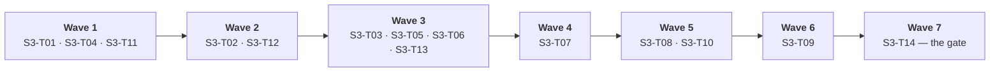

# Plan 3 — Pipelines & corpus (Stage 3)

| Field | Value |
|---|---|
| Plan | **Plan 3 — Pipelines & corpus** |
| Stage | **Stage 3 — pipelines** (third and final of the PoC) |
| Layer | **Routes** — the 13 pipeline codes as configuration and registry data over the Stage 2 components. **Largely data, not new code** (`wbs.md` §5) |
| Owner(s) | **Data** — `registry/`, `pyproject.toml`, `.env.example`, `.github/workflows/` → `S3-T01`–`S3-T04`, `S3-T13` · **Surface** — `docflow/cli.py`, `docflow/batch.py` → `S3-T05`–`S3-T12` (`wbs.md` §8) |
| Source docs | `wbs.md` §5, §6.1, §7, §8, §9, §10 · `../idea/01-pipelines.md` · `../idea/03-cli.md` (batch, output layout, forced reprocess, control) · `prd.md` FR-25…FR-33, NFR-01, NFR-04, NFR-06/NFR-06a, NFR-11 · `sad.md` §8, §5.1, ADR-009, §14 · `traceability.md` §3, §4, §7.2 |
| Companion plans | [`README.md`](README.md) (gate model) · [`plan-01-kernels.md`](plan-01-kernels.md) · [`plan-02-components.md`](plan-02-components.md) (both frozen; their exit checklists are this plan's entry) |
| Lifecycle stage | **PoC** — this plan closes the PoC. The first full run sets the baseline; nothing is claimed about latency or throughput before it |
| Effort signal | `S` / `M` / `L` = relative complexity of implementation **and verification**, not calendar time (`wbs.md` §7) |

---

## §1 Objective

Stage 3 exists to turn one working route into thirteen interchangeable ones and to prove it at the scale the problem actually has: eleven thousand documents, in one command, resumable after an interruption. The problem it answers is the consumer's, not the engineer's — the system's obligation is to make the *difference* between "verified and matching" and "nobody cross-checked this" visible in the output rather than to guess which difference matters, so every one of the 13 codes must emit the same shape and the consumer must write one integration. And it answers the operational half of the trust problem: a run over 11k files that dies at document 4,821 must resume at the exact stage of the in-flight document rather than restart, because a batch that cannot be interrupted safely is a batch nobody will run over the real corpus.

---

## §2 Scope

### In scope

| In scope | Tasks |
|---|---|
| Pipeline descriptor schema in K8 (material prefix → extractor → validate → report) | `S3-T01` |
| The 13 descriptors: `M0-ErVR` … `M4-EpVR` | `S3-T02` |
| Ledger stage set derived from the primitive + the `not_applicable` list | `S3-T03` |
| Registry assets: anchors/patterns, extraction prompts, field schemas, policies (critical fields, tolerances) | `S3-T04` |
| `--extractor r\|p\|rp` with per-file material selection by Diagnosis | `S3-T05` |
| Batch input: one file, several files, one folder; mirrored output tree | `S3-T06` |
| Output layout + `run.json` + the suffix rule | `S3-T07` |
| `--force`, `--stage`, `--only` with downstream invalidation | `S3-T08` |
| Resume at corpus scale: per-document and stage-level granularity | `S3-T09` |
| `run.json` presented as derived and rebuildable, never authoritative | `S3-T10` |
| Slot and resource policy for the corpus | `S3-T11` |
| Operational `DOCFLOW_*` settings + precedence, with policy assets declared as **not** settings | `S3-T12` |
| Shape-identity verification across all 13 codes | `S3-T13` |
| The corpus closing flow | `S3-T14` |

### Out of scope (deferred)

| Out of scope | Marker |
|---|---|
| Golden-set comparison (`--golden`) and the labeller role | `# TODO: [MVP]` |
| Latency, throughput and availability **targets** — the first full run sets the baseline | `# TODO: [MVP]` (`NFR-11`) |
| Symlink and permission edge cases in the mirrored tree | `# TODO: [MVP]` |
| `--dry-run`, `--isolate`, `--keep-artifacts`, `--format`, `--schema`, `--failed`, `--state`, `--retry-queue`, `--retry`, `--rebuild`, `--rule`, `--new-type`, `--value` | `# TODO: [MVP]` |
| `--rebuild-index` as a **flag** — `rebuild_index()` is a library call from Plan 1; `S3-T07` owns the manifest's shape and location only | `# TODO: [MVP]` |
| Object-storage or database backends behind K7; distributed orchestration | `# TODO: [RELEASE]` |
| Telemetry, metric dashboards, caching layers, HA, multi-region, security compliance | `# TODO: [RELEASE]` |
| A per-corpus OCR engine choice; a `--no-validate` flag; a `--verify` flag; a single confidence score; any fallback or default model/engine/threshold; corpus policy as a flag or an environment variable | **Never** (`prd.md` §10, ADR-001, ADR-002, ADR-006, ADR-009) |
| Merged-document detection | **Never** — declared as a permanent limitation, evidenced by an acceptance scenario below |

---

## §3 Closing criterion (the stage gate)

**The flow that closes Stage 3: all 13 codes are reachable and produce shape-identical output; a batch over the corpus runs, mirrors the tree, and resumes after an interruption** (`wbs.md` §5).

### Acceptance commands

```bash
# 1. the batch shape the problem actually has — one command, 11k files
docflow run --pipeline M1-ErpVR documentos/ --out out/ --jobs 8

# 2. every code reachable, and the two that must error
docflow run --pipeline M0-ErVR  cuerpo.txt              --out out/
docflow run --pipeline M0-EpVR  cuerpo.txt              --out out/ --model ollama:qwen2.5
docflow run --pipeline M0-ErpVR cuerpo.txt              --out out/ --model ollama:qwen2.5
docflow run --pipeline M1-ErVR  documentos/factura.pdf  --out out/
docflow run --pipeline M1-EpVR  documentos/factura.pdf  --out out/ --model ollama:qwen2.5
docflow run --pipeline M1-ErpVR documentos/factura.pdf  --out out/ --model ollama:qwen2.5
docflow run --pipeline M2-ErVR  documentos/escaneo.pdf  --out out/
docflow run --pipeline M2-EpVR  documentos/escaneo.pdf  --out out/ --model ollama:qwen2.5
docflow run --pipeline M2-ErpVR documentos/escaneo.pdf  --out out/ --model ollama:qwen2.5
docflow run --pipeline M3-ErVR  documentos/foto.jpg     --out out/
docflow run --pipeline M3-EpVR  documentos/foto.jpg     --out out/ --model ollama:qwen2.5
docflow run --pipeline M3-ErpVR documentos/foto.jpg     --out out/ --model ollama:qwen2.5
docflow run --pipeline M4-EpVR  documentos/foto.jpg     --out out/ --model ollama:llava

# 3. the alternative naming form, and the error when both are passed
docflow run --extractor rp documentos/ --model ollama:qwen2.5 --out out/
docflow run --extractor rp --pipeline M1-ErpVR documentos/ --out out/   # must be an error

# 4. the errors that must NOT be silent conversions
docflow run --pipeline M0-ErVR documentos/factura.pdf --out out/        # error: M0 at a PDF
docflow run --pipeline M4-ErVR documentos/foto.jpg    --out out/        # error: no such code
docflow run --pipeline M1-ErpVRX documentos/          --out out/        # error: unknown code

# 5. interrupt the corpus run, then resume with the same command
docflow stop --force
docflow run --pipeline M1-ErpVR documentos/ --out out/ --jobs 8         # no separate resume verb
```

### Observable evidence that the gate closed

| Evidence | Correct | The wrong result it guards against |
|---|---|---|
| The 13 codes | all 13 resolve and produce output | `M4-ErVR`, `M4-ErpVR`, `M0-*` at a PDF, or an unknown code **silently converting** instead of erroring (`FR-25`, `FR-31`, `S3-T02`) |
| Output shape across the 13 | identical field/verdict/trace shape for all 13 (`FR-33`) | a per-pipeline shape, forcing the consumer to write 13 integrations |
| `consistency` across the 13 | non-null **exactly** on the four `ErpVR` codes: `M0-ErpVR`, `M1-ErpVR`, `M2-ErpVR`, `M3-ErpVR` | `consistency: ok` on a single-read code, or `null` on an `ErpVR` one |
| `catalog` across the 13 | `unverified` **with a reason** on every field of every code | a missing member, or `unverified` whose reason is lost |
| Mirrored tree | `documentos/2024/enero/factura-001.pdf` → `out/2024/enero/factura-001.json`; **empty directories preserved** | a flattened output tree, or a dropped directory |
| The three artefacts by suffix | `<name>.json` / `<name>.ledger.json` / `<name>.work/`, distinguishable by suffix alone (`FR-29`) | a result a consumer cannot tell from bookkeeping by name |
| `run.json` | carries `state`, `totals`, `stages`, `outcomes`, `inflight`; rebuilt from the ledgers alone reproduces it | a manifest that is authoritative and therefore drifts |
| Ledger after interruption at ~4,821 of 11,034 | the interrupted stage reads `running`; the next `run` resumes from **the exact stage of the in-flight document**; completed documents are skipped without re-reading | restarting the batch, or re-reading documents already done (`NFR-01`, `NFR-02`, `NFR-03`) |
| A forced `extract.p` | `validate`/`consistency`/`report` marked `pending`; a stage left `done` over new fields is impossible | stale verdicts describing the previous values, with every stage `done` and every artifact verifying (`FR-30`) |
| Ledger stage set per code | `M1-ErpVR` records no `segmenter`/`identifier`/`reconstructor`/`catalog` stage but lists them in `not_applicable`; `M4-EpVR` has a single `extract` and no `acquire` | stages recorded for work that never happened, or absence left ambiguous |
| `.env.example` | names the five policy values **only to say they cannot be set**; operational settings carry the CLI → env → `.env` → default chain | a policy value settable from the environment, which changes output without entering the cache key (ADR-009, `NFR-06a`) |
| Baseline throughput | recorded from the first full run | a throughput claim made before the run existed (`NFR-11`) |

**The merged-document limitation is declared, not hidden** — `prd.md` §8's scenario belongs to this stage, because it is a statement about what a *pipeline* run over the corpus does and does not close (`01-pipelines.md`, "What the pipelines give up").

---

## §4 Entry conditions

**This is Plan 2's exit checklist (`plan-02-components.md` §11), plus the plan-specific additions.**

| # | Condition | Source |
|---|---|---|
| 1 | **Plan 2 is closed** — its §11 checklist is entirely ticked, including the doc-sync item | `plan-02-components.md` §11 |
| 2 | **Plan 1 is frozen:** `Token`, `KernelResult`, `Evidence`, `Reason`, `CallRecord`; the five ports; the 7-term cache key; the 7 durable states; the determinism classes; the exit-code contract | `README.md` §3 |
| 3 | **Plan 2 is frozen:** the verdict-vector shape and the per-field `(page, extractor)` trace; the `catalog` reason vocabulary (`not_run` \| `source_unavailable` \| `pending_retry`); the component artifact chain; the escalation policy's single ownership | `README.md` §3 |
| 4 | `S2-T17` closed: a real document traverses the canonical chain through an `ErpVR` code and emits a verdict vector + trace, with the contrast case reproduced end to end | `plan-02-components.md` §3 |
| 5 | One canonical `ErpVR` code is exercised end to end (`sad.md` §14, Stage 2 column) — the 13 codes are added here, not before | `sad.md` §14 |
| 6 | `rebuild_index()` exists as a library call and is the **only** authority for a manifest; K7's `rebuild_manifest()` delegates to it | `S1-T06`, `kernel-cli.md` §9 (`D7`) |
| 7 | Slot and disk policy can be settled before the corpus run, not during it | `wbs.md` §9; `S3-T11` |
| 8 | The corpus is reachable and its material mix is known well enough to choose `--pipeline` or `--extractor` for the first full run | `FR-26` |
| 9 | The open decisions in §12 are accepted as open. **#1 (the critical-field definition) and #2 (the M0 escalation question) touch `S3-T04` and `S3-T13` respectively** and are reviewed before those tasks start | this plan §12 |

---

## §5 Work sequence

Waves are **derived from the `Depends on` column** of `wbs.md` §5. Note that nine of the fourteen tasks depend on **Plan 1 or Plan 2 tasks** as well as on their Stage 3 peers, which is why several waves open immediately at the gate.



**Wave 1 — 3 tasks.** *Why a wave:* `S3-T01` needs `S2-T17`; `S3-T04` needs `S1-T04` and `S2-T11`; `S3-T11` needs `S1-T09` and `S1-T15`. All three dependencies are satisfied by the two prior gates, so these are the three independent heads — descriptor schema, registry assets, and resource policy.

**Wave 2 — 2 tasks.** *Why a wave:* `S3-T02` needs the descriptor schema; `S3-T12` needs the slot policy **and** K8. Both are first-satisfied here.

**Wave 3 — 4 tasks.** *Why a wave:* all four depend on `S3-T02` and on nothing unfinished. `S3-T03` also needs `S1-T03` (terminal); `S3-T05` also needs `S2-T04`; `S3-T06` also needs `S1-T18`; `S3-T13` also needs `S2-T14`. This is the widest wave in the plan: the ledger stage set, the material selector, batch input, and the shape-identity contract test.

**Wave 4 — 1 task.** *Why a wave:* `S3-T07` needs `S3-T06` and `S1-T06`. The output layout cannot be defined before batch knows what tree it walks.

**Wave 5 — 2 tasks.** *Why a wave:* `S3-T08` needs `S1-T05` and `S3-T07`; `S3-T10` needs `S3-T07`. Both are first-satisfied at Wave 4.

**Wave 6 — 1 task.** *Why a wave:* `S3-T09` needs `S3-T08` — resume at corpus scale cannot be verified before downstream invalidation exists, because the two share the same ledger claims.

**Wave 7 — 1 task.** *Why a wave:* `S3-T14` is the join of `S3-T04`, `S3-T05`, `S3-T09`, `S3-T12`, `S3-T13` and is the gate itself.

### The ordered task table

| Order | Task ID | Title | Deliverable (path) | Depends on | Verifiable "done when" | Effort | PoC markers |
|---:|---|---|---|---|---|---|---|
| 1 | `S3-T01` | Pipeline descriptor schema in K8 (material prefix → extractor → validate → report) | `registry/pipelines/*.yaml` | `S2-T17` | The descriptor expresses the `EVR` primitive and the stage set; a descriptor failing its own schema stops the run | M | `# TODO: [MVP]`: descriptor authoring aids |
| 2 | `S3-T04` | Registry assets: anchors/patterns, extraction prompts, field schemas, policies (critical fields, tolerances) | `registry/patterns/`, `registry/prompts/`, `registry/schemas/`, `registry/policies/` | `S1-T04`, `S2-T11` | A prompt edit changes the registry hash and therefore every `extract.p` key; a missing asset fails fast; "critical field" is defined as **policy data**, not code | L | `# TODO: [MVP]`: real corpus patterns; prompt versioning |
| 3 | `S3-T11` | Slot and resource policy for the corpus | `.env.example` + slot config | `S1-T09`, `S1-T15` | `DOCFLOW_JOBS` bounds CPU work; `gpu` is bounded to one in-flight generation per device; the Ollama model is loaded once across the run (`keep_alive`) | M | `# TODO: [RELEASE]`: per-device VRAM scheduling beyond `gpu=1` |
| 4 | `S3-T02` | The 13 descriptors: `M0-ErVR` … `M4-EpVR` | 13 pipeline descriptors | `S3-T01` | `docflow run --pipeline <CODE>` resolves all 13; `M4-ErVR`, `M4-ErpVR`, `M0-*` at a PDF, and unknown codes are all **errors**, not silent conversions | M | — |
| 5 | `S3-T12` | **Operational** `DOCFLOW_*` settings + precedence, and policy assets declared as **not** settings | `.env.example` + `registry/policies/` | `S3-T11`, `S1-T04` | Precedence is CLI → env → `.env` → default and governs **paths, slots, model and host only**; `CUT_CONFIDENCE`, `MIN_CHARS`, `MIN_DPI`, `CORRECT`, `TOLERANCE_AMOUNTS` are registry assets with **no environment variable and no CLI flag**; `.env.example` names them only to say so; a test asserts no policy value can be set from the environment. This settles the layer `S2-T04` consumes | S | — |
| 6 | `S3-T03` | Ledger stage set derived from the primitive (`acquire` / `extract.r` / `extract.p` / `validate` / `report`) + `not_applicable` list | Ledger schema + writer | `S3-T02`, `S1-T03` | `M1-ErpVR` records no `segmenter`/`identifier`/`reconstructor`/`catalog` stage but lists them in `not_applicable`; `M4-EpVR` has a single `extract` and no `acquire` | M | — |
| 7 | `S3-T05` | `--extractor r\|p\|rp` with per-file material selection by Diagnosis | CLI + Diagnosis selector | `S3-T02`, `S2-T04` | One pass over a mixed-material folder routes each file correctly; passing both `--extractor` and `--pipeline` is an error | M | `# TODO: [MVP]`: `--dry-run` to inspect the selection without running |
| 8 | `S3-T06` | Batch input: one file, several files, one folder; mirrored output tree | `docflow/batch.py` | `S1-T18`, `S3-T02` | `documentos/2024/enero/factura-001.pdf` → `out/2024/enero/factura-001.json`; the tree is preserved exactly, **including empty directories** | M | `# TODO: [MVP]`: symlink and permission edge cases |
| 9 | `S3-T13` | Shape-identity verification across all 13 codes | Contract test | `S3-T02`, `S2-T14` | All 13 codes emit the same field/verdict/trace shape; `consistency` is non-null **exactly** on the four `ErpVR` codes | M | — |
| 10 | `S3-T07` | Output layout + `run.json` + suffix rule | Result/ledger/work layout | `S3-T06`, `S1-T06` | `<name>.json` vs `<name>.ledger.json` vs `<name>.work/` are distinguishable by suffix alone; `run.json` carries `state`, `totals`, `stages`, `outcomes`, `inflight`. The **mechanism** is `S1-T06`'s `rebuild_index()`; this task owns the manifest's **shape and location**. No `--rebuild-index` flag exists in the PoC — the rebuild is a library call | M | `# TODO: [MVP]`: `--rebuild-index` as a flag |
| 11 | `S3-T08` | `--force`, `--stage`, `--only` with downstream invalidation | CLI + orchestrator invalidation | `S1-T05`, `S3-T07` | A forced `extract.p` marks `validate`/`consistency`/`report` as `pending`; a stage left `done` over new fields is impossible; `--force`, `--stage` and `--only` are never settable by environment | L | `# TODO: [MVP]`: `--isolate`; `--keep-artifacts` |
| 12 | `S3-T10` | `run.json` presented as derived and rebuildable, never authoritative | Docs + a `rebuild_index()` test | `S3-T07` | Deleting `run.json` and rebuilding reproduces it from the ledger tree; a hand-deleted artifact shows up as incomplete on the next read | S | — |
| 13 | `S3-T09` | Resume at corpus scale: per-document granularity, stage-level granularity | Verified resume path | `S3-T08` | A run killed at 4,821 of 11,034 documents resumes from the exact stage of the in-flight document; completed documents are skipped without re-reading | M | `# TODO: [MVP]`: resume telemetry; `--state` reporting |
| 14 | `S3-T14` | **Stage 3 closing flow (corpus)** | First full run + report | `S3-T04`, `S3-T05`, `S3-T09`, `S3-T12`, `S3-T13` | All 13 codes are reachable; every document produces a result or a declared partial failure; the first full run over the corpus completes and is interrupted and resumed successfully; the baseline throughput is recorded | L | `# TODO: [MVP]`: latency and throughput targets |

**No task dropped, none renumbered, none added.** Total: **14**.

---

## §6 Flow-closing procedure

The runbook for closing Stage 3, in the order a person executes it. The corpus run is the point of no return for the plan, so steps 1–5 are all checks that must hold *before* it starts.

| # | Action | What to look at | A correct result | The wrong result this step guards against |
|---:|---|---|---|---|
| 1 | **Prepare inputs.** The corpus folder, plus the M0 text fixtures (`cuerpo.txt`), plus a known image and a known image PDF | the folder; its material mix | a folder whose materials are known well enough to pick `--pipeline` or `--extractor` | choosing `--pipeline` for a folder with mixed materials and silently mis-routing every file whose material differs |
| 2 | **Confirm every code resolves before spending a corpus run.** Walk the 13 commands from §3 step 2 against single files | exit code per code; the emitted shape | all 13 exit `0`; `M4-ErVR`, `M4-ErpVR`, `M0-*` at a PDF and an unknown code all **error** | a code that resolves but silently converts, i.e. `M0-*` at a PDF read as M1 (`FR-31`) |
| 3 | **Confirm the registry is the sole source of policy.** `docflow-kernel registry validate`, then `registry hash`; then attempt to set a policy value from the environment and from a flag | exit code; the hash; the two failures | assets validate; the hash prints; `MIN_DPI` cannot be set from the environment and no `--min-dpi`-shaped flag exists | a policy value arriving out of band, changing output **without entering the cache key** — a `done` stage produced under a setting nothing recorded (ADR-009, `sad.md` §5.1) |
| 4 | **Settle slots and disk before the run.** `DOCFLOW_JOBS` set to the machine; confirm `gpu` is bounded to 1; confirm the model is warmed once (`keep_alive`) | `.env`; the first generation's timing; memory during a render | CPU work bounded by `DOCFLOW_JOBS`; one in-flight generation per GPU; the model loaded once | eight concurrent generations queueing behind each other so the ledger's per-stage timings become meaningless |
| 5 | **Measure the tree before the tree is walked.** Count the documents and the directories, including empty ones | a count from the input tree | a documented count; the numbers `run.json` will be checked against | an unbounded run whose completion cannot be distinguished from a truncated one |
| 6 | **Start the first full run.** `docflow run --pipeline M1-ErpVR documentos/ --out out/ --jobs 8` | the job id; `out/run.json` appearing | a job id reported; `run.json` present with `state: running`, `totals.discovered` matching step 5, `stages` counters advancing, `inflight` populated | a `run.json` that is written once at the end — then a crash loses the whole run's progress record |
| 7 | **Poll without the tool installed.** `jq '.totals' out/run.json` and `jq '.stages' out/run.json` | the counters, the stage counters, `inflight` | readable with `jq` alone; `stages` shows **where** the run is, not just how many files | a manifest that answers "how many" but not "at which stage" (`NFR-09`) |
| 8 | **Interrupt mid-corpus.** `docflow stop --force` while documents are in flight | the stop report; then every ledger of an in-flight document | the report names the runs, distinguishes a finishing run from an active one, and reports how many documents were left in flight; each interrupted stage reads `running` | a kill that leaves no record of what was in flight, so the next run cannot tell interrupted from never-started |
| 9 | **Resume with the same command.** Re-run step 6 verbatim | which documents are skipped and which continue; the ledger of the previously in-flight document | completed documents skipped **without re-reading**; the in-flight document resumes at its exact stage, re-running at most that one stage | re-reading documents that were `done`; or restarting the in-flight document from acquisition (`NFR-01`, `NFR-03`) |
| 10 | **Verify the mirrored tree.** Diff the input tree's directory structure against `out/` | relative paths | `documentos/2024/enero/factura-001.pdf` → `out/2024/enero/factura-001.json`, structure identical, **empty directories present** | a flattened tree — the one thing `my_prompt.md` asks for by name |
| 11 | **Check the suffix rule from the consumer's side.** `find out -name '*.json' ! -name '*.ledger.json'` | the result set | every result matched, no ledger matched, every `<name>.work/` excluded | a consumer that cannot separate results from bookkeeping by name (`FR-29`) |
| 12 | **Force one stage and watch downstream re-pend.** `docflow run --pipeline M1-ErpVR documentos/ --out out/ --force --stage extract.p --only failed` | the ledger before and after; the `--force` report | the report states what is skipped and what re-runs; `validate`/`consistency`/`report` become `pending` | fields re-extracted with verdicts describing the **previous** values — every stage `done`, every artifact verifying, the output inconsistent and nothing flagging it |
| 13 | **Prove the manifest is derived.** `rm out/run.json`, then rebuild through the library call; then delete one `done` artifact and read again | the rebuilt manifest; the affected stage's state | reproduced from the ledger tree alone; the deleted artifact's stage treated as incomplete with no flag | a manifest that cannot be rebuilt, i.e. one that is authoritative and therefore drifts |
| 14 | **Check the 13 shapes side by side.** Compare the emitted JSON of one document per code | field set, verdict set, trace shape | one shape for all 13; `consistency` non-null exactly on the four `ErpVR` codes; `catalog` present with a reason on every field | a per-code shape difference that forces the consumer to write 13 integrations (`FR-33`) |
| 15 | **Let the run finish and record the baseline.** Re-run step 6 to completion | `run.json` `state: finished`, `totals`, `outcomes` | every document produces a result or a declared partial failure; `to_review`, `escalated` and `partial` counts are recorded; the **wall time and per-stage timings** are recorded as the baseline | throughput, latency or availability claims made before the run existed (`NFR-11`) |
| 16 | **Tick the exit checklist** (§11) | §11, §8 | all boxes ticked, including the doc-sync and the declared-limitation items | the PoC declared closed with its own criterion unmet |

---

## §7 Verification & test plan

### (a) Happy-path test that must pass to close the flow

`S3-T14`'s first full run: all 13 codes reachable; every document in the corpus produces a result or a declared partial failure; the run is interrupted and resumed successfully; the baseline throughput is recorded. The batch is the test — the corpus is the fixture, and a green `S3-T13` shape-identity contract test is a precondition of it, not a substitute.

### (b) Invariant tests that must FAIL when the invariant is broken

| Invariant | Test | What breaking it looks like | Task |
|---|---|---|---|
| The 13 codes are the only codes, and invalid ones error | Resolution test over all 13 plus `M4-ErVR`, `M4-ErpVR`, `M0-*` at a PDF, and an unknown code | an invalid code silently converting — the substitution the whole design forbids | `S3-T02` (`FR-25`, `FR-31`) |
| `--extractor` and `--pipeline` are mutually exclusive | Pass both | the flag wins silently, so the caller thinks they declared a pipeline and got a diagnosis | `S3-T05` (`FR-26`) |
| The mirrored tree is exact | Structural diff of input vs output, including empty directories | a flattened tree, or empty directories dropped | `S3-T06` (`FR-28`) |
| Results, ledgers and work directories are distinguishable by suffix | Glob test from the consumer's perspective | a ledger a consumer parses as a result | `S3-T07` (`FR-29`) |
| `run.json` is derived, never authoritative | Delete it and rebuild; delete an artifact and read | a manifest that cannot be rebuilt from the ledgers alone | `S3-T07`, `S3-T10` (`FR-11`, `NFR-09`) |
| Reprocessing a stage invalidates everything downstream | Forced `extract.p`; inspect `validate`/`consistency`/`report` | downstream stages stay `done` over new fields — a silent inconsistency where every artifact verifies | `S3-T08` (`FR-30`) |
| `--force`, `--stage`, `--only` are never settable by environment | Set `DOCFLOW_FORCE=1`, `DOCFLOW_STAGE=validate`, `DOCFLOW_ONLY=failed` and observe | a persisted default reprocesses done work on every run, or silently narrows every later run (`NFR-06`) | `S3-T08` (`NFR-06`) |
| Resume skips completed work and re-runs at most one stage per in-flight document | Kill at ~4,821 of 11,034 and resume | documents already `done` are re-read, or the in-flight document restarts from acquisition (`NFR-02`, `NFR-03`) | `S3-T09` |
| No policy value can be set from the environment or a flag | Set each of the five names; search for a corresponding flag | a threshold arrives out of band, changing output **without entering the registry hash** — the `done`-and-no-longer-correct failure `sad.md` §5.1 describes | `S3-T12` (`NFR-06a`, ADR-009) |
| Operational settings follow CLI → env → `.env` → default | Precedence test over `DOCFLOW_JOBS`, paths, model, host | a precedence reversal that makes a documented knob inert | `S3-T12` (`NFR-06`) |
| All 13 codes emit one shape | The `S3-T13` contract test | a member present on one code and absent on another | `S3-T13` (`FR-33`) |
| `consistency` is non-null exactly on the four `ErpVR` codes | The same contract test | `null` invented on an `ErpVR` code, or `ok` invented on a single-read one | `S3-T13` (`FR-23`) |
| GPU work is serialized and the model is loaded once | Slot test; `keep_alive` check across a run | two concurrent generations queueing, making per-stage timings meaningless | `S3-T11` (`NFR-04`) |
| The ledger stage set follows the primitive | `M1-ErpVR` and `M4-EpVR` ledger inspection | stages recorded for work that never happened; `not_applicable` empty or absent | `S3-T03` |

### (c) Acceptance scenarios that belong to this stage

One of the six Gherkin scenarios closes at Stage 3 (`traceability.md` §6):

| Scenario | Where | Closes at |
|---|---|---|
| *The merged-document limitation is declared, not hidden* — a file holding three logical documents, a pipeline that runs no Segmenter, output that is shape-valid with every field carrying its verdicts, and the limitation still declared and unsolved | `prd.md` §8 | `S3-T13` (shape-valid across the 13) and `S3-T14` (the corpus run); the declaration itself is `wbs.md` §10 and `prd.md` §10 |

Rows of `kernel-cli.md` §11 that Stage 3 must not break **at corpus scale** — they still assert at the kernel layer (`S1-T22`), and here they are additionally exercised through the batch path:

| Matrix row | Exercised through |
|---:|---|
| Row 1 — a killed stage reported as never started, then resumed | §6 steps 8–9, over 11k documents rather than a synthetic unit set |
| Row 4 — a 150 DPI scan rendered at 300 and reported as 300 | the M2/M3 codes over real scans |
| Row 11 — a truncated page read as a page with no text | `M2`/`M3` over a large scan; the document's partial failure must be declared, not dropped |
| Row 16 — a manifest reporting a finished run that is not finished | §6 step 13, at corpus scale where the drift would be invisible in a count |

### (d) What is explicitly NOT tested at this stage

| Not tested | Why | Marker |
|---|---|---|
| Golden-set comparison and pipeline-vs-pipeline scoring | Needs a golden set to exist first; `--golden` is deferred | `# TODO: [MVP]` |
| Latency, throughput and availability **targets** | The first full run sets the baseline; no target is asserted against a baseline that does not exist yet | `# TODO: [MVP]` (`NFR-11`) |
| Symlink, permission and exotic-path edge cases in the mirrored tree | Declared PoC limitation | `# TODO: [MVP]` |
| Merged-document detection | No pipeline closes it | **Never** — asserted as *declared*, not as solved |
| Distributed execution, object storage, HA, multi-region, telemetry | Not PoC | `# TODO: [RELEASE]` |
| The 6 Validator business-rule categories | Deferred from Plan 2 | `# TODO: [MVP]` |
| A live Catalog source at corpus scale | No pipeline runs the Catalog; every field reads `not_run` | `# TODO: [MVP]` |

---

## §8 Traceability

Requirement IDs from `traceability.md` §4 (`FR` §4.1, `NFR` §4.2).

| Task ID | FR / NFR satisfied | Test / proof |
|---|---|---|
| `S3-T01` | **FR-25** (the descriptor is what a code resolves to) | Descriptor-schema failure stops the run |
| `S3-T02` | **FR-25**, **FR-31** | All 13 resolve; `M4-ErVR`/`M4-ErpVR`/`M0-*` at a PDF/unknown codes all error |
| `S3-T03` | **FR-29** (the ledger is one of the three artefacts), **FR-33** indirectly | `M1-ErpVR` lists `segmenter`/`identifier`/`reconstructor`/`catalog` in `not_applicable`; `M4-EpVR` has one `extract` and no `acquire` |
| `S3-T04` | **FR-10** (K8 as versioned data at corpus scale), **FR-20** (tolerances), **FR-21** (critical fields scope contrast) | A prompt edit changes the registry hash and every `extract.p` key; missing asset fails fast; critical field is policy data |
| `S3-T05` | **FR-26** | One pass over a mixed-material folder routes per file; both flags together is an error |
| `S3-T06` | **FR-28** | The tree is preserved exactly, empty directories included |
| `S3-T07` | **FR-29**, **NFR-09** | Suffix rule unambiguous; `run.json` carries `state`/`totals`/`stages`/`outcomes`/`inflight`; `jq`-readable |
| `S3-T08` | **FR-30**, **NFR-06** | Forced `extract.p` re-pends downstream; `--force`/`--stage`/`--only` not settable by environment |
| `S3-T09` | **NFR-01**, **NFR-02**, **NFR-03** | The kill-and-resume at corpus scale; completed documents skipped without re-reading |
| `S3-T10` | **FR-11**, **NFR-09** | Delete `run.json` and rebuild from the ledger tree; a hand-deleted artifact shows as incomplete |
| `S3-T11` | **NFR-04** | `DOCFLOW_JOBS` bounds CPU; `gpu` bounded to one generation per device; `keep_alive` across the run |
| `S3-T12` | **NFR-06**, **NFR-06a** | Precedence test over operational settings; the "no policy value is settable from the environment" test |
| `S3-T13` | **FR-33**, **FR-23** | The contract test across 13 codes; `consistency` non-null exactly on the four `ErpVR` codes |
| `S3-T14` | **NFR-01**, **NFR-11**, **FR-24** (declared partial failures at corpus scale) | The first full run: all 13 reachable, every document a result or a declared partial failure, interrupt + resume, baseline recorded |

**Gap check.** Every task in this plan maps to at least one FR or NFR, and `traceability.md` §5 traces `S3-T01`–`S3-T13` to `FR-25…FR-33` and `S3-T14` to `NFR-01`/`NFR-11`. **No gap, and no orphan task** — unlike Plan 1 (`S1-T11`, `S1-T20`–`S1-T22`) and Plan 2 (`S2-T02`, `S2-T15`), this stage's task set is fully covered by numbered requirements. The one item that is *deliberately* uncovered is `NFR-12` (deployment), which `traceability.md` §7.1 records as having no task by design — `# TODO: [RELEASE]`.

---

## §9 Risks specific to this plan

From `wbs.md` §9 and `sad.md` §13, keeping only rows whose **Owner stage includes 3**:

| Risk | L | I | Mitigation in this plan |
|---|:---:|:---:|---|
| **The 11k-file scale on the first full run** — disk, memory for full-page bitmaps, wall time | H | H | Stage 1 proved resume on a synthetic flow; slot and disk policy settled at `S3-T11` **before** the corpus run; the first run is interruptible by design |
| **Unknown wording variants in the corpus** — at 11k files the variants cannot be enumerated up front | H | H | `EpVR` tolerates variation; patterns are registry data, so adding a variant is a **hash change rather than a deployment**; the Reviewer promotes repeats into rules |
| **Frontier LLM cost per token during validation** | H | M | Contrast scoped to critical fields only (registry policy); the circuit breaker degrades to `unverified`, never to rejection; `# TODO: [MVP]` a per-document cost ceiling |
| **Golden set graded by the model that produced it** (circularity) | M | M | The labeller role runs offline and writes read-only artefacts; it must not share a run with the governor role. Not exercised in this plan, kept because the corpus run is what would expose it |
| **Segmenter merged-document gap that no pipeline closes** | M | H | Declared, never claimed solved; over-segmentation mitigates. **Residual risk accepted**, and asserted as *declared* by the Stage 3 acceptance scenario |
| **Sampled artefact regenerated on resume**, silently changing the result | M | H | The orchestrator reads the determinism class; missing evidence → `failed`; retrying to agreement is forbidden and attempts are counted. At 11k documents this is the risk with the largest blast radius, because a single regeneration policy applied at scale changes results across the whole corpus |

**Plan-specific execution risk — the one that bites if the wave order is violated.** Three ways, and each is a corpus run that has to be thrown away or, worse, kept:

1. **Starting the corpus run before `S3-T12` settles the policy/setting split.** If `MIN_DPI` or `TOLERANCE_AMOUNTS` can arrive from the environment, the run's output was produced under settings that never entered the registry hash — so every ledger's `done` is a claim nobody can check, and the corpus run's results are neither reproducible nor invalidatable precisely. `S3-T12` is `S` effort and it gates `S3-T14`. It is the cheapest task in the plan and the most expensive to skip.
2. **Running the corpus before `S3-T08`'s invalidation is proven.** A forced `extract.p` that does not re-pend `validate`/`consistency`/`report` produces fields that are new with verdicts that describe the old ones. At one document this is a bug; at 11k it is a corpus of output that looks complete and is inconsistent, with every stage `done` and every artifact verifying.
3. **Close the gate on the 13 codes without `S3-T13`.** All 13 can be reachable while emitting subtly different shapes — that is precisely the failure `FR-33` exists to prevent, and it is invisible until a consumer writes their second integration. `S3-T13` is a precondition of `S3-T14`, not a sibling of it.

---

## §10 Definition of Ready / Definition of Done

### Task DoR

- The task names the artifact it produces, and the artifact has a single owner — `wbs.md` §8: Data for `registry/`, `.env.example`, workflows; Surface for `docflow/cli.py`, `docflow/batch.py`.
- Its dependencies are `done`, or the task states the interface it assumes from them. For every task here those interfaces are frozen by Plan 1 or Plan 2 and may not be changed by this plan.
- The verifiable criterion is written **before** the work starts and can be checked without reading the implementation.
- Any PoC shortcut is declared with its `# TODO: [MVP]` / `# TODO: [RELEASE]` marker **at creation**.
- Additional, from `traceability.md` §8: the task's row in `traceability.md` §4 exists. In this plan it does for all 14 (§8).

### Task DoD

- The artifact exists at the documented path and is exercised by at least one automated test.
- The verifiable criterion in §5 passes.
- No new kernel, no new component, no new kernel-boundary type: **this stage adds configuration and data** (`wbs.md` §5). A task in this plan that needed a new type would mean a gate was closed early.
- No silent stand-in: no empty string, `0`, `[]`, `None`-without-reason, and **no default model, engine or threshold**.
- No policy value is reachable from a CLI flag or an environment variable (ADR-009).
- Every shortcut taken is marked with `# TODO: [MVP]` / `# TODO: [RELEASE]`.

### Stage DoD (Plan 3)

- Every one of the 14 tasks is `done`.
- **The corpus flow closes** — §3's criterion, run from a clean checkout with the documented command.
- The riskiest invariant introduced at this stage has a test that **fails when the invariant is broken** (§7b) — for Stage 3 that invariant is **reprocessing a stage invalidates everything downstream, and completed work is never repeated on resume**.
- `prd.md`, `sad.md`, `wbs.md` and `traceability.md` still agree with what was built; any divergence is resolved in the docs before the PoC is declared closed. In particular `sad.md` §8's 13-code matrix and `§11`'s output shape must match what the 13 codes emit, and `wbs.md` §6.2's dependency table must match the dependencies that actually gated the close.

---

## §11 Exit checklist

This checklist closes not only Plan 3 but the PoC. It is the last gate in the set.

- [ ] All 14 tasks `S3-T01`–`S3-T14` are `done`, each with its verifiable criterion passing.
- [ ] All 13 codes resolve: `M0-ErVR`, `M0-EpVR`, `M0-ErpVR`, `M1-ErVR`, `M1-EpVR`, `M1-ErpVR`, `M2-ErVR`, `M2-EpVR`, `M2-ErpVR`, `M3-ErVR`, `M3-EpVR`, `M3-ErpVR`, `M4-EpVR`.
- [ ] `M4-ErVR`, `M4-ErpVR`, `M0-*` at a PDF, and an unknown code are all **errors**, never silent conversions.
- [ ] Passing `--extractor` and `--pipeline` together is an error.
- [ ] All 13 codes emit the **same** field/verdict/trace shape; `consistency` is non-null **exactly** on the four `ErpVR` codes; `catalog` is present with a reason on every field of every code.
- [ ] A batch accepts one file, several files, or a folder, and a folder input mirrors its tree in the output including empty directories.
- [ ] `<name>.json`, `<name>.ledger.json` and `<name>.work/` are distinguishable by suffix alone.
- [ ] `run.json` carries `state`, `totals`, `stages`, `outcomes`, `inflight`, is readable with `jq` without the tool installed, and is **reproducible from the ledger tree alone** after deletion.
- [ ] The first full run over the corpus completes; every document produces a result or a **declared** partial failure.
- [ ] The run was interrupted mid-corpus and resumed successfully: completed documents skipped without re-reading, the in-flight document resumed at its exact stage, at most one stage re-run for it.
- [ ] A forced `extract.p` marks `validate`/`consistency`/`report` `pending`; no stage can remain `done` over new fields.
- [ ] `--force`, `--stage` and `--only` are never settable by an environment variable.
- [ ] **No** corpus policy value (`CUT_CONFIDENCE`, `MIN_CHARS`, `MIN_DPI`, `CORRECT`, `TOLERANCE_AMOUNTS`) is settable by a CLI flag or an environment variable; a test asserts it; `.env.example` names them only to say so.
- [ ] Operational settings follow CLI → environment → `.env` → default for paths, slots, model and host only.
- [ ] `DOCFLOW_JOBS` bounds CPU work; `gpu` is bounded to one in-flight generation per device; the Ollama model is loaded once across the run.
- [ ] The ledger for each code records the stages the primitive implies and lists the rest in `not_applicable` as facts.
- [ ] The baseline throughput and per-stage timings from the first full run are **recorded**, with no target asserted against them yet.
- [ ] The merged-document limitation is still declared in `README.md`, `prd.md` and `wbs.md` §10 — **never claimed solved**.
- [ ] **Doc-sync:** `prd.md`, `sad.md`, `wbs.md`, `traceability.md` and `kernel-cli.md` still agree with what was built. Every divergence is resolved in the docs, and `traceability.md` §5 is re-checked so the PoC close produces no orphan task and no requirement with no task beyond the ones `§7.1` already declares.

### The four tracks, ticked separately (§13)

| Track | Tick when |
|---|---|
| **1 — Fast flow** | All three rungs of §13 Track 1 pass: 13 codes on single files, then a nested folder with empty directories, then the corpus interrupted and resumed |
| **2 — Golden set / tests** | Shape identity holds across all 13 codes; invalid codes error rather than convert; the baseline is **recorded with no target asserted** against it; the golden-set deferral is still declared with its marker |
| **3 — Code (for reuse)** | The layer added **no code** — registry assets and descriptors only — and the output layout the consuming system integrates against is frozen |
| **4 — CLI (to probe)** | `docflow run` resolves all 13 codes and all three batch forms; there is **no `resume` verb** (resume is the same `run`); `--force`/`--stage`/`--only` work and are never settable by environment |

---

## §12 Open decisions carried into this plan

The final set: what remains unresolved when the PoC closes. Items 1–3 touch this plan's tasks directly and are reviewed before those tasks start.

| # | Open decision | Where it originates | What it touches in this plan | Impact |
|---:|---|---|---|---|
| 1 | **What defines a "critical field".** Both the contrast policy and the target of escalation depend on it, and today it exists as an expression in `02-components.md` rather than as data | `01-pipelines.md` (open questions); carried from `plan-02-components.md` §12 #3 | `S3-T04` (**where the policy asset must land**), `S3-T13` (the shape is unaffected, but which fields carry contrast is) | If unresolved, `S3-T04` ships a critical-field policy by convention rather than by definition, and contrast is either paid everywhere or scoped by a guess. This is the last stage at which the definition can be data rather than a code convention |
| 2 | **What M0's targeted escalation means.** With no page and no image, "render the region" is meaningless. Either it becomes "re-read a span of the supplied string", or M0 escalates only to the cascade | `01-pipelines.md` (open questions); `traceability.md` §7.2 | `S3-T02` (the `M0-*` descriptors), `S3-T13` (shape identity across all 13) | `M0-*` is three of thirteen codes. Discovering here that M0 breaks an assumption the other ten materials share would invalidate the shape-identity test (`FR-33`) rather than one pipeline — which is why `traceability.md` §7.2 recommends settling it **before Stage 2**. Carried forward unresolved |
| 3 | **Whether `S2-T12` (Catalog) is a dependency of `S2-T17`.** Carried from Plan 2 unresolved | `wbs.md` §6.2; `traceability.md` §7.2 | `S3-T03` (the `not_applicable` list, where `catalog` sits), `S3-T13` (`catalog` present with reason `not_run` on all 13) | At corpus scale the consequence is the same in kind but larger: if `not_run` was defined as a literal rather than as the Catalog's value, then the reason vocabulary is a constant in the Contract and the first real `source_unavailable` will need a change in the wrong layer |
| 4 | **Whether the registry is one asset store or several, and whether `registry hash` is per-asset** | `02-arch-components.md` (open questions); `kernel-cli.md` §17 | `S3-T04` (assets), `S3-T12` (policy assets as data) | A single hash means a prompt tweak invalidates a schema version: **coarse but never wrong**, which is why it is acceptable for the PoC. At 11k files the cost is a broader `--force` than strictly needed, not an incorrect result |
| 5 | **Whether a sampled artefact may ever be regenerated, with the new observation recorded** | `02-arch-components.md` (open questions); `plan-01-kernels.md` §12 #6 | `S3-T09` (resume at corpus scale), `S3-T14` | The PoC answer is **never regenerate** — missing evidence → `failed`. At corpus scale the consequence is concrete: a lost OCR or model artefact makes that document permanently unreproducible within the run, and the operator's remedy is a re-run with a new observation, which the PoC does not express as a first-class outcome |
| 6 | **What is in the per-document cost ceiling.** K6 needs a budget to spend against, and no flag or policy carries one | `02-arch-components.md` (open questions); `prd.md` `NFR-10` ("recorded, not yet budgeted") | `S3-T04` (would be a policy asset), `S3-T11` (would interact with slots/budgets) | Without a ceiling, escalation decides how much a document may cost, and `--only failed` re-runs are unbounded in the same way. The `CallRecord` records what was spent, so the data to set a ceiling exists after the first run — which is the honest PoC position |
| 7 | **How many GPU slots exist, and whether the slot model is enough** | `02-arch-components.md` (open questions); `plan-01-kernels.md` §12 #7 | `S3-T11` (`gpu` bounded to 1 per device) | `gpu = 1` is a declared simplification: concurrent OCR and generation compete for VRAM on one device and the competition policy is undefined. This is the plan where it stops being theoretical, because the corpus run mixes both |
| 8 | **Whether the 17-row silent-failure suite runs at all stages or only at Stage 1, and whether it is split** | `kernel-cli.md` §17; `plan-01-kernels.md` §12 #3 | indirectly `S3-T14` (an unsplit suite makes CI flaky, and a flaky gate is ignored) | Rows for K4–K6 need GPU, tokens and provider availability. The corpus run is where a flaky suite costs most, because it is the stage where a red CI would be blamed on scale rather than on the kernel |
| 9 | **Where the Reviewer's cases live once the run is over**, and whether anything aggregates them | `02-arch-components.md` (open questions); `plan-02-components.md` §12 #6 | `S3-T07` (the ledger's shape and location) | At 11k documents the per-document ledger is the only home, and a Reviewer working from 11k ledgers has no queue. The PoC declares this; it is the first thing an MVP has to answer, because the return loop is what makes the system improve |
| 10 | **Whether the mirrored tree survives the move to object storage.** Content addressing does; colocation of ledger and result is a filesystem property, and object storage has no equivalent of "beside" | `02-arch-components.md` (open questions); `sad.md` §13 | `S3-T06`, `S3-T07` | The PoC is filesystem-only and explicitly so. Recorded because `S3-T06`/`S3-T07` are the two tasks that would change shape, not merely backend, if this is ever revisited — the suffix rule and the mirrored tree are both filesystem affordances |

---

## §13 The four tracks of this layer

Every layer is worked along four tracks at once (`plans/README.md` §6). **Track 1 closes the stage, Track 4 operates it, Track 2 proves it, Track 3 is what survives it.** Here the four converge on one command — which is the point of the layer.

| Track | This layer's instance | Task |
|---|---|---|
| **1 — Fast flow** | The corpus batch: `docflow run --pipeline M1-ErpVR documentos/ --out out/ --jobs 8` — one command, 11k files, mirrored tree, interrupted and resumed | `S3-T14` (the gate) |
| **2 — Golden set / tests** | **Shape identity across all 13 codes** + the error cases + the first run's recorded baseline | `S3-T13`, `S3-T02` |
| **3 — Code (for reuse)** | Registry assets and the 13 descriptors — **configuration and data, no new code** (`wbs.md` §5) | `S3-T01`–`S3-T04` |
| **4 — CLI (to probe)** | `docflow run` with `--pipeline`, `--extractor`, `--force`/`--stage`, `--only`, and the three batch forms | `S3-T02`, `S3-T05`–`S3-T08`, `S3-T12` |

### Track 1 — the fast flow, at the scale the problem actually has

**Sequence it in three rungs, and only the last one is the gate.** Each rung is cheap enough to fail fast, and the corpus is not what teaches you the pipeline is wrong — a small folder is.

| Rung | Input | What it validates | Fails fast on |
|---|---|---|---|
| 1 | One file per code (13 commands, `§3` step 2) | Every code resolves; invalid codes error; the emitted shape | `S3-T02`, `S3-T13` |
| 2 | A small folder with **nested and empty** subdirectories | The mirrored tree, the suffix rule, `run.json` | `S3-T06`, `S3-T07` |
| 3 | The corpus, interrupted mid-run and resumed | Scale: slots, disk, per-document resume | `S3-T09`, `S3-T11`, `S3-T14` |

**Rung 3 is where the deferrals get charged.** Faking is not available at this layer: `--jobs 8` over 11k files is the only thing that exercises the slot model, and the first full run is the only thing that produces a baseline (`NFR-11` — recorded, **no target asserted**).

### Track 2 — golden evidence, per kind of claim

| Kind of claim | Golden artifact | Must fail when broken | Task |
|---|---|---|---|
| One shape across all 13 codes | The contract test over every code | Two codes emit subtly different shapes — invisible until a consumer writes their second integration | `S3-T13` (**`FR-33`'s whole purpose**) |
| `consistency` exactly where both reads ran | The 13 emitted results | `consistency` is non-null on a single-read code, or `null` on an `ErpVR` code | `S3-T13` |
| `catalog` present with a reason on every field | Any emitted field | The verdict is absent, or `unverified` with no reason — collapsing *never attempted* with *the source was down* | `S3-T13`, `S2-T12` |
| Invalid codes are errors | `M4-ErVR`, `M4-ErpVR`, `M0-*` at a PDF, unknown codes | A code **silently converts** — e.g. `M0-*` at a PDF read as `M1` | `S3-T02` |
| The tree mirrors the input | A nested folder with empty directories | A flattened tree, or a dropped directory — the one thing `my_prompt.md` asks for by name | `S3-T06` |
| Suffixes are unambiguous | `<name>.json` / `<name>.ledger.json` / `<name>.work/` | The result and the ledger are tellable apart only by opening them | `S3-T07` |
| The manifest is derived | A deleted `run.json` | The rebuild does not reproduce it from the ledger tree alone | `S3-T10` |
| Resume skips completed work | A kill at ~4,821 of ~11,034 documents | A completed document is re-read, or the in-flight one restarts at acquisition | `S3-T09` |
| Forced stages re-pend downstream | A forced `extract.p` | `validate`/`consistency`/`report` stay `done` over **new** fields — every stage done, every artifact verifying, the output inconsistent | `S3-T08` |
| Policy cannot come from the environment | A test setting `MIN_DPI` in the environment | A policy value changes output without entering the registry hash, so `done` is a claim nobody can check | `S3-T12` |
| The baseline is recorded, not targeted | `run.json` totals and per-stage timings | A latency target is asserted against the first run (`NFR-11` forbids it) | `S3-T14` |

**The golden set proper is deferred — and at this layer it is the most expensive deferral, so it is also the one most worth naming.** No pipeline runs the Catalog, so there is no external identity to check a value against, and 11k files is where a plausible-but-wrong value compounds at scale. The PoC's answer is contrast (Plan 2) plus shape identity (here), and the honest position is that field-level gold needs the labeller role that deviation D4 defers. The labeller runs **offline**, writes read-only artefacts, and must not share a run with the governor (`wbs.md` §9).

### Track 3 — the code that gets reused (here: configuration, not code)

**This layer adds no code.** `wbs.md` §5: *"largely data, not new code."* What it produces is the structure that makes the layer re-runnable — which is what a consuming system actually depends on being stable.

| Reusable artifact | Path | Why it is the reusable part |
|---|---|---|
| Registry assets | `registry/patterns/`, `registry/prompts/`, `registry/schemas/`, `registry/policies/` | A wording variant is a **hash change, not a deployment** — and the registry hash is a cache-key term, so an improved prompt makes stale `done` claims *visibly* stale |
| The 13 descriptors | `registry/pipelines/*.yaml` | A pipeline is configuration over one component chain, not a new design |
| The policy/setting split | `.env.example` + `registry/policies/` | The boundary that keeps the cache key sound (`ADR-009`) |
| The output layout | The mirrored tree + suffix rule + `run.json` | The shape the other system integrates against — the last thing frozen in the PoC |

**The consumer test is the gate's own:** `S3-T14` is the first run whose output the consuming system can actually be built against.

### Track 4 — the CLI, to probe a route

Two surface forms over one operation layer, and the errors between them are part of the contract:

| Command | Form | Constraint |
|---|---|---|
| `docflow run --pipeline <CODE> <input> --out <dir>` | The canonical route | All 13 codes resolve; invalid ones **error** (`S3-T02`) |
| `docflow run --extractor r\|p\|rp <input> --out <dir>` | Material chosen per file by Diagnosis | Passing both `--extractor` and `--pipeline` is an **error**, never a precedence rule (`S3-T05`, `FR-26`) |
| One file · several files · a folder | Batch | A folder mirrors its tree, **including empty directories** (`S3-T06`) |
| `--force` / `--stage` / `--only` | Precise invalidation | Never settable by environment (`S3-T08`, `NFR-06`) |
| `--jobs`, `DOCFLOW_*` | Operational settings | CLI → env → `.env` → default, and it governs **paths, slots, model and host only** (`S3-T12`) |

The probe surface is also the recovery surface: **there is no `resume` verb** — resume is the same `run` again (`FR-01`), which is why Track 4 and Track 1 here are the same command. That is the sign the layer closed properly: operating it and closing it are not two different things.
