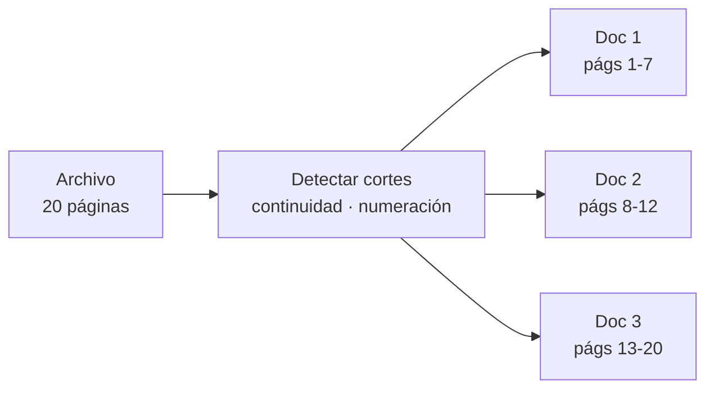
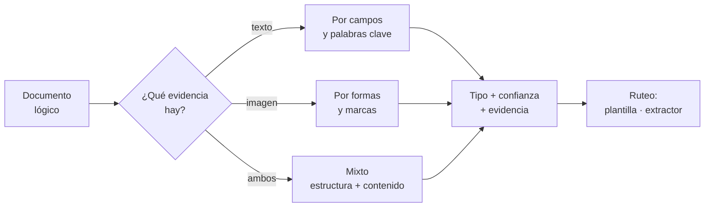
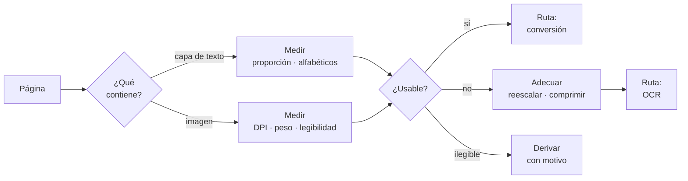
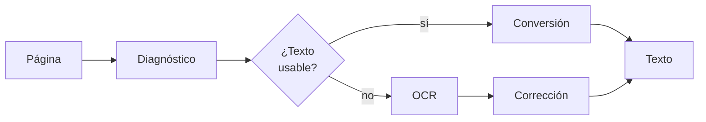
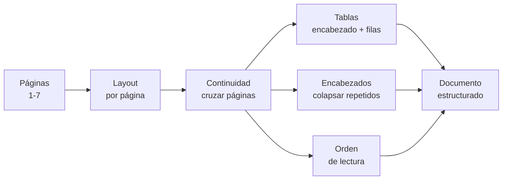
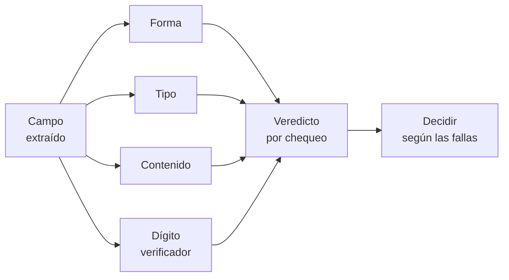
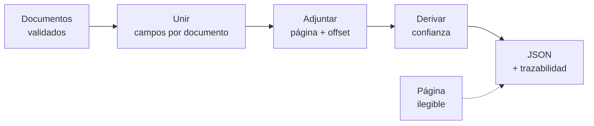
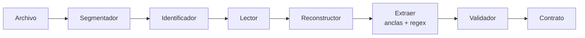
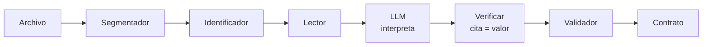
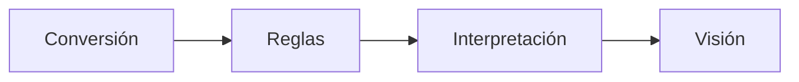

# Extracción de documentos

Versión resumida. El detalle está en `README.md`.

Los **flujos** se nombran por qué recibe el extractor. Los **componentes**, por qué producen.

| Flujo | Recibe | | Componente | Produce |
|---|---|---:|---|---|
| **Reglas** | Nada | | **Segmentador** | Documentos lógicos |
| **Interpretación** | Texto | | **Identificador** | Tipo de documento |
| **Visión** | Píxeles | | **Diagnóstico** | Ruta y advertencias |
| | | | **Lector** | Texto + coordenadas + confianza |
| | | | **Reconstructor** | Documento estructurado |
| | | | **Validador** | Veredicto por campo |
| | | | **Contrato** | Forma de la salida |

## Niveles

Un archivo no es un documento. Un PDF de 20 páginas puede contener una factura, o tres.

| Nivel | Qué es |
|---|---|
| **Archivo** | Lo que entra al sistema |
| **Documento** | Una unidad con sentido propio dentro del archivo |
| **Página** | La unidad física de procesamiento |

## Componentes

Corren dentro de los flujos, no en paralelo. La columna **Nivel** dice qué recibe cada uno.

| Componente | Nivel | Qué hace | Reglas | Interp. | Visión |
|---|---|---|:---:|:---:|:---:|
| **Segmentador** | Archivo | Agrupa páginas en documentos lógicos | ✓ | ✓ | ✓ |
| **Identificador** | Documento | Determina el tipo y el ruteo | ✓ | ✓ | ✓ |
| **Diagnóstico** | Página | Detecta contenido, mide calidad, adecúa | ✓ | ✓ | — |
| **Lector** | Página | Extrae texto por conversión u OCR | ✓ | ✓ | — |
| **Reconstructor** | Páginas | Layout, tablas, orden de lectura | ✓ | — | — |
| **Validador** | Campo | Forma, tipo, contenido, dígito verificador | ✓ | ✓ | ✓ |
| **Contrato** | Documento | Forma canónica de la salida | ✓ | ✓ | ✓ |

Visión no usa Diagnóstico ni Lector: le pasa píxeles al modelo, que lee y extrae en un paso.

Los de nivel página son **paralelizables**. El Segmentador y el Contrato son **barreras**: el Contrato no emite hasta que estén todas las páginas.

### Segmentador

Agrupa las páginas en documentos lógicos antes del Identificador. Sin él, un PDF con tres facturas se procesa como una sola y los campos se mezclan entre comprobantes.

Las señales de corte son la numeración de página reiniciada, un encabezado de documento nuevo, o la ausencia de continuidad en tablas abiertas.

### Identificador

Tres variantes según qué evidencia esté disponible: solo texto, solo imagen, o ambos. La diferencia no es de precisión sino de qué se puede observar.

Devuelve la **evidencia** junto al tipo: qué palabras o formas dispararon la decisión. Sin eso, un documento mal clasificado es invisible y el error aparece recién al final, como un campo mal extraído.

Confianza baja deriva a revisión en vez de elegir el tipo más probable. Y hace falta una categoría "otro" con ruta propia: de ahí salen los tipos nuevos.

### Diagnóstico

Corre antes de leer y hace tres cosas: **detecta** qué hay, **mide** si es procesable, y **adecúa** la entrada.

No alcanza con preguntar si hay texto: hay que ver si es usable. Un PDF puede traer una capa de OCR vieja y mala; el ruteo por presencia lo manda a conversión y arrastra esos errores sin que nadie los revise. El chequeo es de proporción y calidad — una capa con 40 caracteres en una A4 es basura.

Legibilidad es distinto de resolución: una imagen puede tener DPI suficiente y estar desenfocada. Si no pasa, hay dos salidas válidas (preprocesar o derivar) y una inválida: pasarla al OCR igual y dejar que devuelva texto inventado indistinguible de una lectura real.

### Lector

| Camino | Entrada | Corrección | Confianza |
|---|---|:---:|---|
| Conversión | Capa de texto existente | No | 1.0 |
| OCR | Imagen | Sí | Estimada |

La corrección existe solo en OCR: un conversor no lee mal, transcribe lo que hay. Aplicarle un modelo de lenguaje "por las dudas" solo puede introducir daño.

El ruteo es **por página**: un PDF mixto combina ambos caminos y los une al final.

### Reconstructor

Recibe **varias páginas**, no una: el layout es local, pero la continuidad lo cruza.

- Una tabla con encabezado en una página y filas que siguen en la siguiente pierde la asociación si cada página se procesa aislada.
- Un encabezado repetido en las 5 páginas se captura 5 veces sin control de continuidad.

### Validador

Cuatro chequeos **independientes**: cada uno mira el mismo campo y emite su propio veredicto. No están encadenados — que la forma sea correcta no habilita al de tipo, ni al revés.

| Chequeo | Pregunta | Qué ve que los otros no | Falla → |
|---|---|---|---|
| **Forma** | ¿Tiene la forma esperada? | Que *algo* con la apariencia correcta está ahí | Reintentar con otra ancla |
| **Tipo** | ¿Es del tipo que dice ser? | Que el valor es usable | Reintentar, si no revisión |
| **Contenido** | ¿Es admisible en el dominio? | Que corresponde al negocio: único que conoce las reglas | Revisión |
| **Dígito verificador** | ¿Es válido en sí mismo? | Garantía matemática: único sin falsos positivos | Rechazar |

El orden de la tabla va de más débil a más fuerte, y **ese orden no describe ejecución**: los cuatro corren sobre el mismo campo y ninguno necesita el resultado de otro.

Lo que sí cambia entre ellos es la fuerza de la evidencia:

- **Forma** no dice si el valor es cierto. Un importe que matchea el patrón puede ser cualquier número.
- **Tipo** confirma que es usable, no que sea correcto.
- **Contenido** es el único que conoce el negocio: un IVA de 17% pasa forma y tipo, y sigue siendo error.
- **Dígito verificador** es el único con garantía: un número inventado no pasa salvo azar de 1 en 10.

La decisión final combina los veredictos, y la **falla más grave manda**: un campo puede pasar forma y tipo, fallar contenido, y derivar a revisión; o fallar dígito verificador y rechazarse aunque los otros tres pasen.

Se reutiliza en cinco puntos: dentro del Lector, al corregir OCR, por campo, entre campos, y contra catálogos externos.

El de consistencia es el único que necesita **varios campos** —subtotal + impuestos = total— y puede cruzar páginas.

Ningún chequeo detecta un valor **plausible pero falso**: un total de 15400 que era 1540 pasa los cuatro. Eso requiere comparar contra algo externo, y es una decisión aparte.

### Contrato

Emitir es una **barrera**: espera a que todas las páginas estén resueltas antes de producir la salida del documento.

Une los campos que vinieron de páginas distintas, adjunta la traza `(página, offset)` por campo, y deriva la confianza de señales verificables — no del score que declare el modelo.

El fallo es **parcial**: una página ilegible se marca como tal y el resto del documento se emite igual, con esa ausencia declarada.

## Los tres flujos

### Reglas

### Interpretación

### Visión

## Diferencias

| | Reglas | Interpretación | Visión |
|---|---|---|---|
| Recibe | Nada | Texto | Píxeles |
| Ve firmas, sellos | Si se modeló | No | Sí |
| Costo | Bajo | Medio | Alto |
| Determinista | Sí | No | No |
| Trazabilidad | Offset o bbox exacto | Cita + offset | bbox aproximado |
| No alucina | Sí | No | No |

## Orden de ejecución

El híbrido es la arquitectura de producción: cada etapa resuelve lo más barato y pasa al siguiente lo que no pudo.

## Invariantes

Aplican a los tres flujos:

- **El modelo nunca reemplaza al Validador.** La aritmética atrapa la alucinación en importes.
- **La cita prueba procedencia, no acierto.** Verificar el literal y el valor por separado.
- **La estructura se valida aparte.** Una columna desplazada tiene importes reales y pasa cualquier chequeo de valores.
- **La confianza se deriva, no se pide.** Señales verificables, no el score autodeclarado del modelo.
- **La traza es `(página, offset)`.** Un offset suelto no identifica nada en un documento de 20 páginas.
- **El fallo es parcial.** Una página ilegible marca esa página; no descarta el documento entero.
- **Auditar no es normalizar.** Ver `d.md`.

## Documentos

| Archivo | Contenido |
|---|---|
| `README.md` | Versión extendida |
| `d.md` | Nota técnica: validación con Pydantic |
| `a.md` | Flujo de texto |
| `b.md` | Flujo visual |
| `c.md` | Flujo multimodal |
