# Extracción de documentos

Versión resumida. El detalle está en `README.md`.

Los **flujos** se nombran por qué recibe el extractor. Los **componentes**, por qué producen.

| Flujo | Recibe |
|---|---|
| **Reglas** | Nada |
| **Interpretación** | Texto |
| **Visión** | Píxeles |

| Componente | Produce |
|---|---|
| **Segmentador** | Documentos lógicos + confianza de corte |
| **Identificador** | Tipo de documento + evidencia |
| **Diagnóstico** | Ruta y advertencias de entrada |
| **Lector** | Tokens posicionados + confianza |
| **Reconstructor** | Documento estructurado |
| **Validador** | Veredicto por campo |
| **Consistencia** | Veredicto entre campos y entre flujos |
| **Catálogo** | Veredicto contra fuente externa |
| **Contrato** | Forma de la salida |
| **Revisor** | Correcciones + casos nuevos |

## Niveles

Un archivo no es un documento. Un PDF de 20 páginas puede contener una factura, o tres.

| Nivel | Qué es |
|---|---|
| **Archivo** | Lo que entra al sistema |
| **Documento** | Una unidad con sentido propio dentro del archivo |
| **Página** | La unidad física de procesamiento |

## Componentes

Corren dentro de los flujos, no en paralelo. La columna **Nivel** dice qué recibe cada uno.

| Componente | Nivel | Qué hace | Reglas | Interp. | Visión |
|---|---|---|:---:|:---:|:---:|
| **Segmentador** | Archivo | Agrupa páginas en documentos lógicos | ✓ | ✓ | ✓ |
| **Identificador** | Documento | Determina el tipo y el ruteo | ✓ | ✓ | ✓ |
| **Diagnóstico** | Página | Detecta contenido, mide calidad, adecúa | ✓ | ✓ | — |
| **Lector** | Página | Extrae tokens por conversión u OCR | ✓ | ✓ | — |
| **Reconstructor** | Páginas | Layout, tablas, orden de lectura | ✓ | ✓ | ◐ |
| **Validador** | Campo | Forma, tipo, contenido, dígito verificador | ✓ | ✓ | ✓ |
| **Consistencia** | Documento | Cruza campos y compara flujos | ✓ | ✓ | ✓ |
| **Catálogo** | Documento | Valida contra fuentes externas | ✓ | ✓ | ✓ |
| **Contrato** | Documento | Forma canónica de la salida | ✓ | ✓ | ✓ |
| **Revisor** | Todos | Cierra el bucle con correcciones humanas | ✓ | ✓ | ✓ |

Visón no usa Diagnóstico ni Lector: le pasa píxeles al modelo, que lee y extrae en un paso. El ◐ del Reconstructor en Visión es por lo mismo: el VLM absorbe el layout de una página, pero la continuidad entre páginas sigue haciendo falta.

Los de nivel página son **paralelizables**. El Segmentador y el Contrato son **barreras**: el Contrato no emite hasta que estén todas las páginas.

### Segmentador

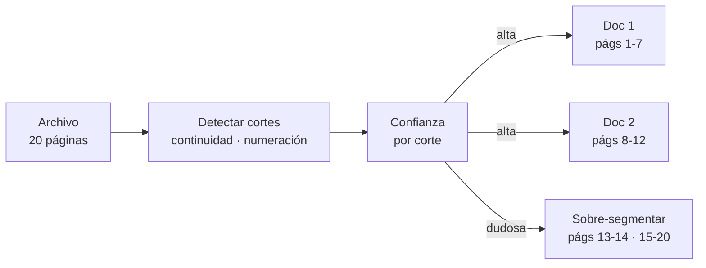

Agrupa las páginas en documentos lógicos antes del Identificador. Sin él, un PDF con tres facturas se procesa como una sola y los campos se mezclan entre comprobantes.

Las señales de corte son la numeración de página reiniciada, un encabezado de documento nuevo, o la ausencia de continuidad en tablas abiertas.

**Es el único componente sin escape.** Todos los demás tienen salida ante la duda: el Identificador deriva, el Diagnóstico deriva con motivo, el Contrato emite parcial. El Segmentador decide primero y su error es **irrecuperable aguas abajo**: si une dos documentos, los campos del segundo pisan los del primero y no hay chequeo posterior que lo note.

De ahí la asimetría que gobierna su política:

| Error | Consecuencia | Se detecta después |
|---|---|---|
| **Partir de más** | Dos documentos donde había uno | Sí: el Identificador da el mismo tipo dos veces y el Contrato ve campos faltantes en ambos |
| **Unir de más** | Un documento donde había dos | **No**: los campos se mezclan en silencio |

Ante corte dudoso, **sobre-segmentar**. Un documento de más es ruido recuperable; un documento de menos es corrupción silenciosa.

### Identificador

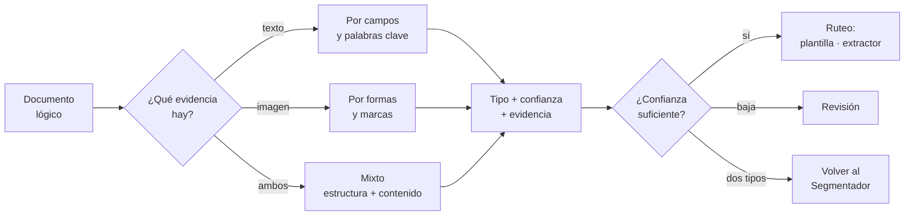

Tres variantes según qué evidencia esté disponible: solo texto, solo imagen, o ambos. La diferencia no es de precisión sino de qué se puede observar.

Devuelve la **evidencia** junto al tipo: qué palabras o formas dispararon la decisión. Sin eso, un documento mal clasificado es invisible y el error aparece recién al final, como un campo mal extraído.

Confianza baja deriva a revisión en vez de elegir el tipo más probable. Y hace falta una categoría "otro" con ruta propia: de ahí salen los tipos nuevos.

**Tiene una arista de vuelta al Segmentador.** Segmentar bien a veces requiere saber el tipo, e identificar requiere el segmento: es circular, y el sistema era estrictamente hacia adelante. Cuando la evidencia muestra **dos tipos distintos** en el mismo segmento, el Identificador no elige uno: devuelve el corte y fuerza re-segmentación. Sin esa salida, el caso no tenía respuesta.

### Diagnóstico

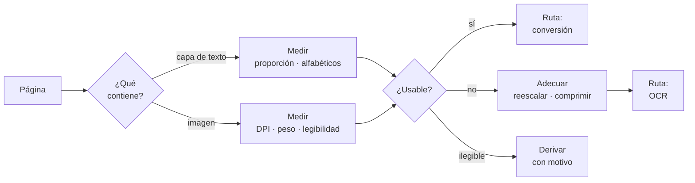

Corre antes de leer y hace tres cosas: **detecta** qué hay, **mide** si es procesable, y **adecúa** la entrada.

No alcanza con preguntar si hay texto: hay que ver si es usable. Un PDF puede traer una capa de OCR vieja y mala; el ruteo por presencia lo manda a conversión y arrastra esos errores sin que nadie los revise. El chequeo es de proporción y calidad — una capa con 40 caracteres en una A4 es basura.

Legibilidad es distinto de resolución: una imagen puede tener DPI suficiente y estar desenfocada. Si no pasa, hay dos salidas válidas (preprocesar o derivar) y una inválida: pasarla al OCR igual y dejar que devuelva texto inventado indistinguible de una lectura real.

### Lector

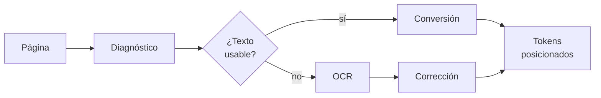

| Camino | Entrada | Corrección | Confianza |
|---|---|:---:|---|
| Conversión | Capa de texto existente | No | 1.0 |
| OCR | Imagen | Sí | Estimada |

La corrección existe solo en OCR: un conversor no lee mal, transcribe lo que hay. Aplicarle un modelo de lenguaje "por las dudas" solo puede introducir daño.

El ruteo es **por página**: un PDF mixto combina ambos caminos y los une al final.

**Devuelve tokens, no texto.** La distinción importa y resuelve un problema del diseño anterior: si el Lector entregara texto ya ordenado, absorbería parte del Reconstructor y no haría falta ese componente. Entrega **tokens con coordenadas**, sin orden de lectura resuelto — así el Reconstructor tiene razón de existir y los dos flujos de texto lo necesitan por igual.

### Reconstructor

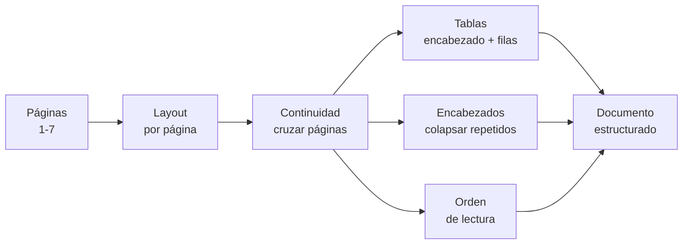

Recibe **varias páginas**, no una: el layout es local, pero la continuidad lo cruza.

- Una tabla con encabezado en una página y filas que siguen en la siguiente pierde la asociación si cada página se procesa aislada.
- Un encabezado repetido en las 5 páginas se captura 5 veces sin control de continuidad.

**Corre en Reglas e Interpretación; en Visión solo la continuidad.** El diseño anterior lo dejaba únicamente en Reglas, lo cual era inconsistente: un documento multipágina aplanado a texto pierde orden de lectura y continuidad igual, y el LLM **rellena esa estructura inventándola**, que es su peor modo de falla. En Visión el ◐ se explica porque el VLM absorbe el layout de cada página, pero la continuidad entre páginas sigue haciendo falta.

### Validador

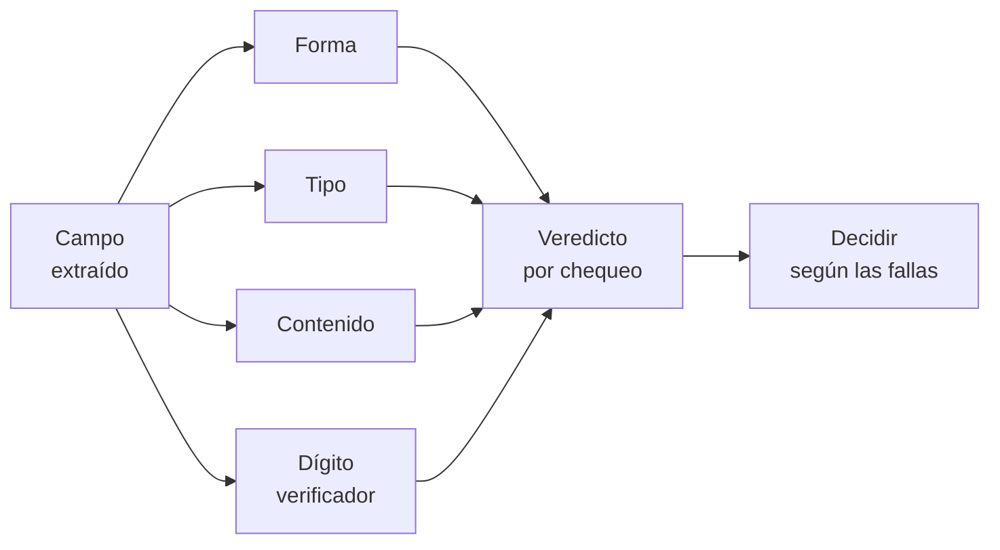

Cuatro chequeos **independientes**: cada uno mira el mismo campo y emite su propio veredicto. No están encadenados — que la forma sea correcta no habilita al de tipo, ni al revés.

| Chequeo | Pregunta | Qué ve que los otros no | Falla → |
|---|---|---|---|
| **Forma** | ¿Tiene la forma esperada? | Que *algo* con la apariencia correcta está ahí | Reintentar con otra ancla |
| **Tipo** | ¿Es del tipo que dice ser? | Que el valor es usable | Reintentar, si no revisión |
| **Contenido** | ¿Es admisible en el dominio? | Que corresponde al negocio: único que conoce las reglas | Revisión |
| **Dígito verificador** | ¿Es válido en sí mismo? | Garantía matemática: único sin falsos positivos | Rechazar |

El orden de la tabla va de más débil a más fuerte, y **ese orden no describe ejecución**: los cuatro corren sobre el mismo campo y ninguno necesita el resultado de otro.

Lo que sí cambia entre ellos es la fuerza de la evidencia:

- **Forma** no dice si el valor es cierto. Un importe que matchea el patrón puede ser cualquier número.
- **Tipo** confirma que es usable, no que sea correcto.
- **Contenido** es el único que conoce el negocio: un IVA de 17% pasa forma y tipo, y sigue siendo error.
- **Dígito verificador** es el único con garantía: un número inventado no pasa salvo azar de 1 en 10.

La decisión final combina los veredictos, y la **falla más grave manda**: un campo puede pasar forma y tipo, fallar contenido, y derivar a revisión; o fallar dígito verificador y rechazarse aunque los otros tres pasen.

**También es el que gobierna el escalamiento.** "No pudo" se define acá y en ningún otro lado: un campo que falla forma o tipo es candidato a reintento, y si el reintento no mejora, a escalar al flujo siguiente. La política vivía dispersa en tres componentes —Identificador, Diagnóstico y Validador— sin que ninguno supiera de los otros; centralizarla acá es lo que la vuelve aplicable.

**Se escala por campo, no por documento.** Si Reglas resuelve 18 de 20 campos, Visión reprocesa esos 2, no los 20. Eso baja el costo del escalamiento de un orden de magnitud, y a cambio obliga al Contrato a emitir **procedencia heterogénea**: en la misma salida conviven campos con `offset exacto` y campos con `bbox aproximado`, cada uno declarando de qué flujo salió.

### Consistencia

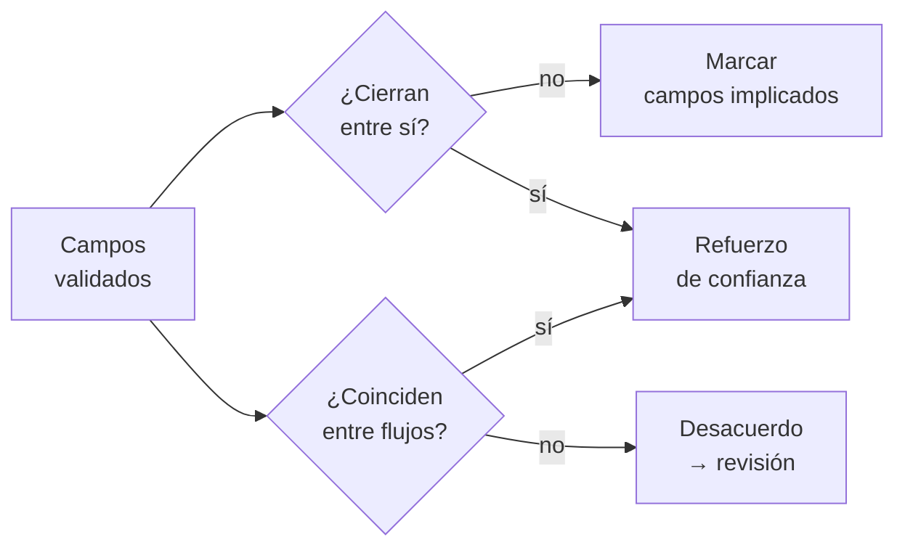

Compara valores entre sí. Opera en dos niveles con el mismo mecanismo:

| Nivel | Qué compara | Ejemplo |
|---|---|---|
| **Entre campos** | Aritmética y orden dentro del documento | subtotal + impuestos = total; emisión ≤ vencimiento |
| **Entre flujos** | El mismo campo extraído por dos caminos | total según Reglas vs. total según Visión |

**El segundo nivel es la respuesta al hueco de plausible-pero-falso.** Un total de 15400 que era 1540 pasa forma, tipo, contenido y no tiene dígito verificador: ningún chequeo interno lo ve. Pero si Reglas lee 1540 y Visión lee 15400 sobre el mismo documento, el desacuerdo aparece — y es la señal más fuerte disponible en todo el sistema.

Sin esto, el híbrido es solo fallback: cada flujo hace su parte y la arquitectura descarta la capacidad de contraste, que es justamente lo que la validación interna no puede dar.

**Costo.** Correr dos flujos sobre todo es caro, así que el contraste se reserva: por campo crítico (importes, identificadores) y no por documento entero. La política de cuándo contrastar es una decisión explícita, no un efecto lateral.

El de consistencia aritmética también es el único chequeo que **agarra errores de dígito del OCR**: si dos cifras leídas mal no suman, el error se detecta sin comparar contra nada externo.

### Catálogo

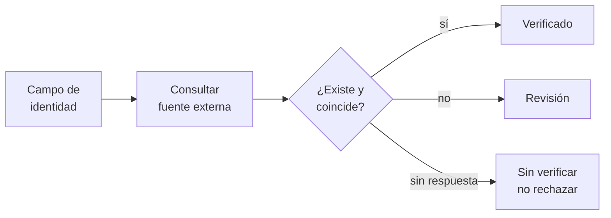

Valida contra algo que existe fuera del documento: un padrón de proveedores, el servicio del ente emisor, el registro de un identificador.

**Es el único que cierra el hueco para campos de identidad.** Un CUIT puede tener dígito verificador correcto y pertenecer a una empresa que no emitió el documento. Ningún chequeo interno lo distingue; consultarlo contra la fuente, sí.

Distinto de Consistencia: aquel compara el documento contra sí mismo, este contra la realidad externa. Y distinto del Validador en que **no es determinista** — depende de disponibilidad y latencia de un tercero.

Por eso la falla por indisponibilidad no es un rechazo: si la fuente externa no responde, el campo queda **sin verificar**, no inválido. Confundir las dos cosas convierte una caída del servicio en una cola de rechazos.

### Contrato

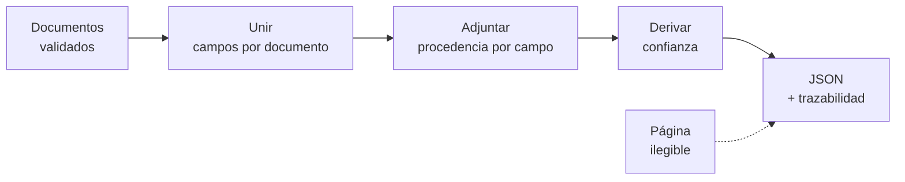

Emitir es una **barrera**: espera a que todas las páginas estén resueltas antes de producir la salida del documento.

Une los campos que vinieron de páginas distintas, adjunta la traza `(página, offset)` por campo, y deriva la confianza de señales verificables — no del score que declare el modelo.

**Maneja procedencia heterogénea.** Como el escalamiento es por campo, en un mismo documento conviven campos resueltos por Reglas con `offset exacto` y campos resueltos por Visión con `bbox aproximado`. El Contrato no puede asumir un origen único: cada campo declara su flujo y su tipo de traza, y eso es información de salida, no un detalle interno.

El fallo es **parcial**: una página ilegible se marca como tal y el resto del documento se emite igual, con esa ausencia declarada.

### Revisor

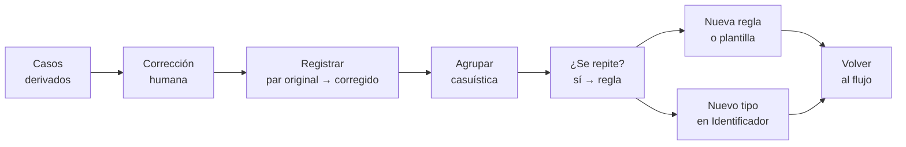

Cierra el bucle. Sin él, la arquitectura termina en "revisión" y todo lo que la revisión produce se pierde.

Recibe lo que derivaron los demás: confianza baja del Identificador, ilegibles del Diagnóstico, fallas de contenido del Validador, desacuerdos de Consistencia, y la categoría "otro".

Y tiene tres salidas, no una:

| Salida | Cuándo |
|---|---|
| **Dato corregido** | El caso era puntual: se arregla y sigue |
| **Regla nueva** | El caso se repite: pasa a Reglas y deja de llegar a revisión |
| **Tipo nuevo** | La categoría "otro" acumula casos: se define un tipo y su ruta |

Es también el que cierra el bucle del Segmentador: cuando el Identificador devuelve dos tipos en un segmento, el caso vuelve acá y la re-segmentación se vuelve una regla si se repite.

**Sin el Revisor, el sistema no mejora.** Las correcciones humanas se acumulan en logs que nadie lee y los mismos errores vuelven en cada lote: el mismo modo de falla que la revisión existía para resolver.

## Los tres flujos

Cada uno resuelve lo que puede y pasa al siguiente lo que no. El escalamiento lo gobierna el Validador.

### Reglas

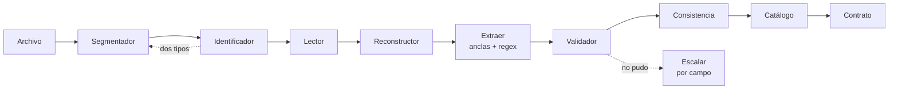

### Interpretación

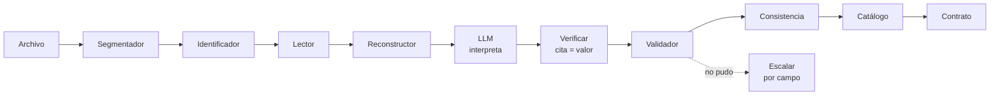

### Visión

Los tres terminan en **Revisor**: lo que se deriva por cualquier motivo vuelve, se corrige, y se convierte en regla o en tipo nuevo.

## Diferencias

| | Reglas | Interpretación | Visión |
|---|---|---|---|
| Recibe | Nada | Texto | Píxeles |
| Ve firmas, sellos | Si se modeló | No | Sí |
| Costo | Bajo | Medio | Alto |
| **Inventa valores** | No | Sí | Sí |
| **Ancla mal** | **Sí**: puede tomar el valor de un bloque equivocado | No: interpreta por significado | No: lee la región que ve |
| Determinista | Sí | No | No |
| Trazabilidad | Offset exacto | Cita + offset | bbox aproximado |

"No inventa valores" no es lo mismo que "no se equivoca". Reglas no fabrica un importe que no existe, pero **puede anclarlo mal**: un regex atado a `TOTAL` que captura el total del bloque resumen en vez del comprobante devuelve un número real del lugar equivocado. Determinista ≠ correcto.

Por eso la fila de anclaje es la que importa para elegir flujo: el error de Reglas es **silencioso y plausible** — un total válido, del lugar equivocado — y ninguno de los cuatro chequeos del Validador lo distingue, porque el valor existe, tiene forma correcta y es del tipo correcto.

## Orden de ejecución

El híbrido resuelve dos cosas distintas, y conviene no confundirlas.

**Cascada** — cada etapa hace lo más barato y pasa al siguiente lo que no pudo. Define el costo.

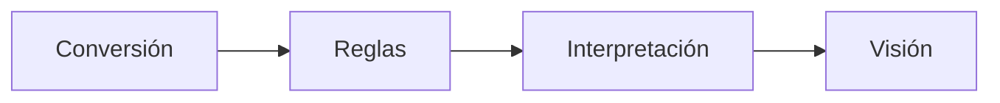

**Contraste** — dos flujos sobre el mismo campo, comparados. Define la confianza, y es lo único que agarra el error plausible-pero-falso.

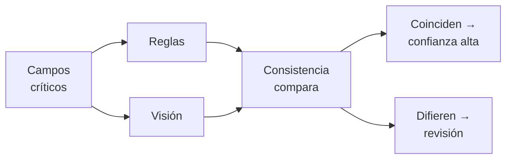

Sin contraste, el híbrido es solo fallback y la arquitectura descarta la única señal que la validación interna no puede dar. El costo se acota contrastando **por campo crítico** —importes, identificadores— y no el documento entero.

## Invariantes

Aplican a los tres flujos:

- **Ante duda en el Segmentador, sobre-segmentar.** Partir de más se detecta después; unir de más es silencioso y contamina campos de documentos ajenos.
- **El modelo nunca reemplaza al Validador.** La aritmética atrapa la alucinación en importes.
- **La cita prueba procedencia, no acierto.** Verificar el literal y el valor por separado.
- **La estructura se valida aparte.** Una columna desplazada tiene importes reales y pasa cualquier chequeo de valores.
- **La confianza se deriva, no se pide.** Señales verificables, no el score autodeclarado del modelo.
- **La traza es `(página, traza)` y declara el flujo.** Con escalamiento por campo, la procedencia deja de ser única: conviven `offset exacto` y `bbox aproximado` en la misma salida.
- **El fallo es parcial.** Una página ilegible marca esa página; no descarta el documento entero.
- **Sin bucle de retorno, el sistema no mejora.** Las correcciones que no vuelven al flujo son las que hacen que el mismo error se repita.
- **Auditar no es normalizar.** Ver `d.md`.

## Limitaciones conocidas

Se declaran en lugar de suponerlas cubiertas:

| Limitación | Por qué no se resuelve adentro |
|---|---|
| Valor plausible pero falso | Necesita contraste entre flujos o fuente externa; ningún chequeo interno lo ve |
| Deriva de ancla en Reglas | El valor es real y del tipo correcto; solo el contraste lo detecta |
| Corte de segmentación dudoso | La sobre-segmentación mitiga, no elimina |
| Fuente externa caída | No se puede distinguir de dato inválido sin reintentar |

## Documentos

| Archivo | Contenido |
|---|---|
| `README.md` | Versión extendida |
| `d.md` | Nota técnica: validación con Pydantic |
| `a.md` | Flujo de texto |
| `b.md` | Flujo visual |
| `c.md` | Flujo multimodal |
