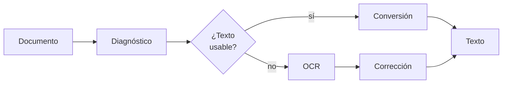
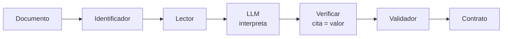
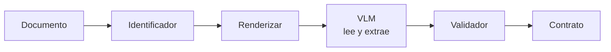
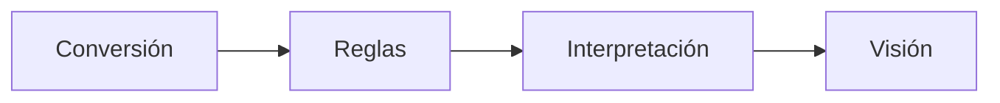

# Extracción de documentos

Versión resumida. El detalle está en `README.md`.

Los **flujos** se nombran por qué recibe el extractor. Los **componentes**, por qué producen.

| Flujo | Recibe | | Componente | Produce |
|---|---|---:|---|---|
| **Reglas** | Nada | | **Identificador** | Tipo de documento |
| **Interpretación** | Texto | | **Diagnóstico** | Ruta y advertencias |
| **Visión** | Píxeles | | **Lector** | Texto + coordenadas + confianza |
| | | | **Reconstructor** | Documento estructurado |
| | | | **Validador** | Veredicto por campo |
| | | | **Contrato** | Forma de la salida |

## Componentes

Corren dentro de los flujos, no en paralelo.

| Componente | Qué hace | Reglas | Interpretación | Visión |
|---|---|:---:|:---:|:---:|
| **Identificador** | Determina el tipo y el ruteo | ✓ | ✓ | ✓ |
| **Diagnóstico** | Detecta contenido, mide calidad, adecúa | ✓ | ✓ | — |
| **Lector** | Extrae texto por conversión u OCR | ✓ | ✓ | — |
| **Reconstructor** | Layout, tablas, orden de lectura | ✓ | — | — |
| **Validador** | Forma, tipo, contenido, dígito verificador | ✓ | ✓ | ✓ |
| **Contrato** | Forma canónica de la salida | ✓ | ✓ | ✓ |

Visión no usa Lector ni Diagnóstico: le pasa píxeles al modelo, que lee y extrae en un paso.

### Lector

| Camino | Entrada | Corrección | Confianza |
|---|---|:---:|---|
| Conversión | Capa de texto existente | No | 1.0 |
| OCR | Imagen | Sí | Estimada |

La corrección existe solo en OCR: un conversor no lee mal, transcribe lo que hay.

El ruteo es **por página**: un PDF mixto combina ambos caminos y los une al final.

### Validador

Cuatro chequeos, de más débil a más fuerte:

| Chequeo | Pregunta | Falla → |
|---|---|---|
| **Forma** | ¿Tiene la forma esperada? | Reintentar con otra ancla |
| **Tipo** | ¿Es del tipo que dice ser? | Reintentar, si no revisión |
| **Contenido** | ¿Es admisible en el dominio? | Revisión |
| **Dígito verificador** | ¿Es válido en sí mismo? | Rechazar |

Se reutiliza en cinco puntos: dentro del Lector, al corregir OCR, por campo, entre campos, y contra catálogos externos.

## Los tres flujos

### Reglas

### Interpretación

### Visión

## Diferencias

| | Reglas | Interpretación | Visión |
|---|---|---|---|
| Recibe | Nada | Texto | Píxeles |
| Ve firmas, sellos | Si se modeló | No | Sí |
| Costo | Bajo | Medio | Alto |
| Determinista | Sí | No | No |
| Trazabilidad | Offset o bbox exacto | Cita + offset | bbox aproximado |
| No alucina | Sí | No | No |

## Orden de ejecución

El híbrido es la arquitectura de producción: cada etapa resuelve lo más barato y pasa al siguiente lo que no pudo.

## Invariantes

Aplican a los tres flujos:

- **El modelo nunca reemplaza al Validador.** La aritmética atrapa la alucinación en importes.
- **La cita prueba procedencia, no acierto.** Verificar el literal y el valor por separado.
- **La estructura se valida aparte.** Una columna desplazada tiene importes reales y pasa cualquier chequeo de valores.
- **La confianza se deriva, no se pide.** Señales verificables, no el score autodeclarado del modelo.
- **Auditar no es normalizar.** Ver `d.md`.

## Documentos

| Archivo | Contenido |
|---|---|
| `README.md` | Versión extendida |
| `d.md` | Nota técnica: validación con Pydantic |
| `a.md` | Flujo de texto |
| `b.md` | Flujo visual |
| `c.md` | Flujo multimodal |
