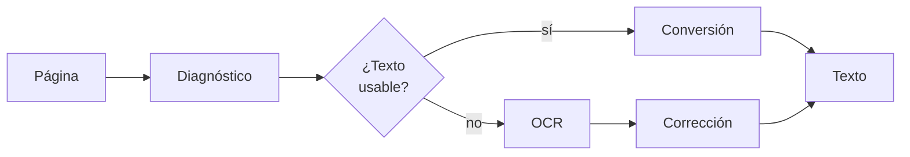
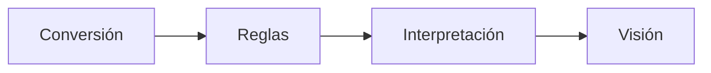

# Extracción de documentos

Versión resumida. El detalle está en `README.md`.

Los **flujos** se nombran por qué recibe el extractor. Los **componentes**, por qué producen.

| Flujo | Recibe | | Componente | Produce |
|---|---|---:|---|---|
| **Reglas** | Nada | | **Segmentador** | Documentos lógicos |
| **Interpretación** | Texto | | **Identificador** | Tipo de documento |
| **Visión** | Píxeles | | **Diagnóstico** | Ruta y advertencias |
| | | | **Lector** | Texto + coordenadas + confianza |
| | | | **Reconstructor** | Documento estructurado |
| | | | **Validador** | Veredicto por campo |
| | | | **Contrato** | Forma de la salida |

## Niveles

Un archivo no es un documento. Un PDF de 20 páginas puede contener una factura, o tres.

| Nivel | Qué es |
|---|---|
| **Archivo** | Lo que entra al sistema |
| **Documento** | Una unidad con sentido propio dentro del archivo |
| **Página** | La unidad física de procesamiento |

## Componentes

Corren dentro de los flujos, no en paralelo. La columna **Nivel** dice qué recibe cada uno.

| Componente | Nivel | Qué hace | Reglas | Interp. | Visión |
|---|---|---|:---:|:---:|:---:|
| **Segmentador** | Archivo | Agrupa páginas en documentos lógicos | ✓ | ✓ | ✓ |
| **Identificador** | Documento | Determina el tipo y el ruteo | ✓ | ✓ | ✓ |
| **Diagnóstico** | Página | Detecta contenido, mide calidad, adecúa | ✓ | ✓ | — |
| **Lector** | Página | Extrae texto por conversión u OCR | ✓ | ✓ | — |
| **Reconstructor** | Páginas | Layout, tablas, orden de lectura | ✓ | — | — |
| **Validador** | Campo | Forma, tipo, contenido, dígito verificador | ✓ | ✓ | ✓ |
| **Contrato** | Documento | Forma canónica de la salida | ✓ | ✓ | ✓ |

Visión no usa Diagnóstico ni Lector: le pasa píxeles al modelo, que lee y extrae en un paso.

Los de nivel página son **paralelizables**. El Segmentador y el Contrato son **barreras**: el Contrato no emite hasta que estén todas las páginas.

### Segmentador

Agrupa las páginas en documentos lógicos antes del Identificador. Sin él, un PDF con tres facturas se procesa como una sola y los campos se mezclan entre comprobantes.

### Lector

| Camino | Entrada | Corrección | Confianza |
|---|---|:---:|---|
| Conversión | Capa de texto existente | No | 1.0 |
| OCR | Imagen | Sí | Estimada |

La corrección existe solo en OCR: un conversor no lee mal, transcribe lo que hay.

El ruteo es **por página**: un PDF mixto combina ambos caminos y los une al final.

### Reconstructor

Recibe **varias páginas**, no una: el layout es local, pero la continuidad lo cruza.

- Una tabla con encabezado en una página y filas que siguen en la siguiente pierde la asociación si cada página se procesa aislada.
- Un encabezado repetido en las 5 páginas se captura 5 veces sin control de continuidad.

### Validador

Cuatro chequeos, de más débil a más fuerte:

| Chequeo | Pregunta | Falla → |
|---|---|---|
| **Forma** | ¿Tiene la forma esperada? | Reintentar con otra ancla |
| **Tipo** | ¿Es del tipo que dice ser? | Reintentar, si no revisión |
| **Contenido** | ¿Es admisible en el dominio? | Revisión |
| **Dígito verificador** | ¿Es válido en sí mismo? | Rechazar |

Se reutiliza en cinco puntos: dentro del Lector, al corregir OCR, por campo, entre campos, y contra catálogos externos.

La consistencia entre campos puede cruzar páginas: subtotal en una y total en otra.

## Los tres flujos

### Reglas

### Interpretación

### Visión

## Diferencias

| | Reglas | Interpretación | Visión |
|---|---|---|---|
| Recibe | Nada | Texto | Píxeles |
| Ve firmas, sellos | Si se modeló | No | Sí |
| Costo | Bajo | Medio | Alto |
| Determinista | Sí | No | No |
| Trazabilidad | Offset o bbox exacto | Cita + offset | bbox aproximado |
| No alucina | Sí | No | No |

## Orden de ejecución

El híbrido es la arquitectura de producción: cada etapa resuelve lo más barato y pasa al siguiente lo que no pudo.

## Invariantes

Aplican a los tres flujos:

- **El modelo nunca reemplaza al Validador.** La aritmética atrapa la alucinación en importes.
- **La cita prueba procedencia, no acierto.** Verificar el literal y el valor por separado.
- **La estructura se valida aparte.** Una columna desplazada tiene importes reales y pasa cualquier chequeo de valores.
- **La confianza se deriva, no se pide.** Señales verificables, no el score autodeclarado del modelo.
- **La traza es `(página, offset)`.** Un offset suelto no identifica nada en un documento de 20 páginas.
- **El fallo es parcial.** Una página ilegible marca esa página; no descarta el documento entero.
- **Auditar no es normalizar.** Ver `d.md`.

## Documentos

| Archivo | Contenido |
|---|---|
| `README.md` | Versión extendida |
| `d.md` | Nota técnica: validación con Pydantic |
| `a.md` | Flujo de texto |
| `b.md` | Flujo visual |
| `c.md` | Flujo multimodal |
