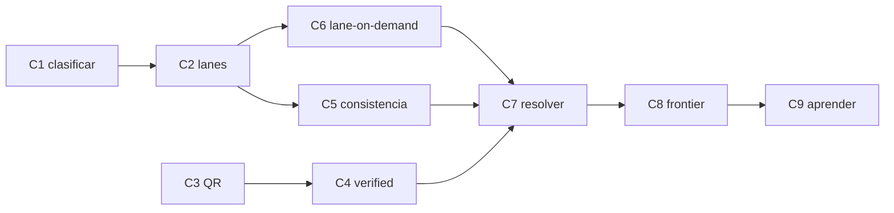

# Plan de cierre de circuitos — `scripts/poc-flow-v2`

| Campo | Valor |
|---|---|
| Alcance | Completar los flujos de `my_flow.md` que la migración dejó abiertos, **como diseño** y no como nota |
| Fuente | `my_flow.md` §3–§9 · `scripts/poc-flow-v2/` (estado actual) · el plan de migración (`README.md` en este mismo directorio) |
| Estado | **Ejecutado** — C1–C9 cerrados; los cuatro defectos de **cableado** de §«Hallazgos» corregidos el 2026-09-20 |
| Prerrequisito | Migración A/B/C cerrada (proceso `run`, motor, gates) |

---

## Visión

La migración cerró el **proceso** y el **motor de decisión**. Lo que falta son los
**circuitos**: los caminos de `my_flow.md` que hoy no se ejecutan — clasificar,
las lanes completas, el QR, el resolver, el frontier y el aprendizaje. Cada uno
se cierra con un **test que falla si el circuito no cierra** (B.16), igual que las
gates ya hechas.

**Regla del plan:** un circuito está cerrado cuando un documento real puede
recorrerlo y un test lo demuestra. No se cierra "en el código": se cierra con
evidencia.

## Inventario de circuitos abiertos

| # | Circuito | § | Qué falta hoy | Qué lo cierra |
|---|---|---|---|---|
| C1 | Clasificar (fast-fail) | §3 | no existe; todo documento va a extraer | un gate antes de `extract` que descarte no-comprobantes con razón |
| C2 | Lanes completas (A/B × texto/vision) | §4.1 | solo lane A de texto; `CROSS_MODAL` y `SAME_MATERIAL` nunca se producen | las 4 lanes + split de prompts en el registry |
| C3 | QR | §4.2 | no hay decodificación | candidato determinístico por QR + `conflicto_qr` |
| C4 | `verified` real | §4.2 | stand-in por dígitos en el texto | verificación mecánica del contenido en la ubicación declarada |
| C5 | Grupos de consistencia | §6.4 | asume neto+IVA; sin `required_components` | componentes por tipo + evaluación de combinaciones |
| C6 | Lane-on-demand | §6.5 | la escalera del Anexo A no corre | correr vision cuando el gate no cierra |
| C7 | Resolver (loop → motor) | §7 | decide una vez y termina | re-entrada con `max_loops=2` y códigos `ESC_NO_NEW_EVIDENCE`/`ESC_LOOP_LIMIT` |
| C8 | Frontier + HITL | §8 | `suggest` no está | sugerencia del frontier (`--resolve`) + backtest de reglas candidatas |
| C9 | Aprender | §9 | nada implementado | dos canales, templates, `LAYOUT_HISTORY`, auditoría por riesgo |

## Orden de ejecución

El orden es por **desbloqueo**, no por número: cada circuito habilita al siguiente.



- **C1 primero**: sin clasificar, los circuitos siguientes corren sobre basura.
- **C2 habilita C5 y C6**: sin vision y review no hay `CROSS_MODAL`/`SAME_MATERIAL`
  que alimenten la escalera, y la consistencia necesita las lecturas completas.
- **C7 necesita C4, C5 y C6**: el resolver re-entra solo con evidencia o candidatos
  nuevos, que son exactamente los que estos tres producen.
- **C8 y C9 al final**: el frontier sugiere sobre lo que el resolver no cerró, y el
  aprendizaje solo se activa desde `HUMAN_CONFIRMED` (I7) — sin C8 no hay
  confirmación humana que aprender.

---

## Fase 1 — Clasificar y leer completo (C1, C2, C3, C4)

### Ola 1.1 — C1: clasificar (fast-fail)

- [x] Definir el gate de clasificación: `texto_nativo`/`escaneado_ocr` → reglas
      sobre el texto (§3); un documento que no es comprobante se **descarta con
      razón**, no se extrae
- [x] Nuevo módulo `flow/classify.py` (reglas puras, sin adapter); se invoca en
      `extract_stage` antes de pagar el modelo
- [x] Test: un documento no-comprobante termina `descartado` con razón, sin pagar
      el modelo (`test_c1_*`)
- [x] El descarte deja un **código estable** (`CLASSIFY_NOT_A_RECEIPT`) además de la
      prosa: un camino que no deja código no se puede contar (§6.5) — ver H4 abajo

**Aceptación**: el fast-fail corre antes del modelo; un no-comprobante no llega a
`extract`.

### Ola 1.2 — C2: lanes completas

- [x] Split de prompts en el registry: `extract_texto` (invoice.txt), `extract_vision`
      (vision.txt), `review_texto` (review/texto.txt), `review_vision`
      (review/vision.txt) + `schemas/review/review.json`, declarados en el manifest
- [x] `extract.py`: lane A texto + lane B texto (framing adversarial, I5); lane A
      vision + lane B vision sobre `material.images`
- [x] `CROSS_MODAL` (+2) cuando texto y vision coinciden en `normalized_value`;
      `SAME_MATERIAL` (+1) con `agree` (tope por familia, I4)
- [x] Test: `test_c2_*` — cross-modal por cruce, tope por familia, disagree→candidato nuevo
- [x] Persistencia de imágenes: el `read` escribe `images/` y las recarga al reusar
      (la vision lane no quedaba sin material en un resume)

**Aceptación**: un documento con ambas lanes puede confirmar total/IVA por cruce.
Verificado sobre `pdf_escaneados/9b7a423c…pdf`: producers `regexp + extractor_llm_texto
+ vision`, `CROSS_MODAL` en fecha/IVA/moneda. Nota: `granite-vision:2b` (lane B vision)
no está pulled — la lane se niega con nota, no se finge.

### Ola 1.3 — C3: QR

- [x] Decodificación determinística del QR de ARCA (fecha, CUIT emisor, punto de
      venta, tipo/nro, importe, moneda, receptor, CAE) — `flow/qr.py` con `cv2`
- [x] Coincidencia QR ↔ impreso → señal `DETERMINISTIC`; desacuerdo → flag
      `conflicto_qr` (nunca se resuelve por puntaje, §4.2)
- [x] Test: un QR válido produce candidatos por extracción determinística; un QR
      que discrepa del impreso activa `REV_QR_CONFLICT` (`test_c3_*`)

**Aceptación**: el QR es una fuente determinística, no la verdad del comprobante.

### Ola 1.4 — C4: `verified` real

- [x] `_present_at_location` verifica el contenido con **fronteras de dígito**:
      un valor numérico solo se da por presente si es un número completo, no la
      cola de uno más largo (el falso positivo del stand-in por subcadena)
- [x] `DOCUMENT_CONTENT` usa el check por fronteras; un valor que no está en su
      lugar puntúa `UNKNOWN`, nunca `PASS` (B.10)
- [x] Test: `test_c4_*` — ubicación, valor dentro de un número más largo, texto
      libre por ocurrencia; con prueba de mutación (quitar la frontera → rojo)
- [ ] La verificación por **bbox declarado** (releer el recorte) sigue pendiente:
      el extractor no declara un box hoy; `PdfEngine.tokens` provee `Token.bbox`
      para el texto nativo → `# TODO: [MVP]`

**Aceptación**: un ancla no verificada es `UNKNOWN`, nunca `PASS` (B.10).

---

## Fase 2 — El motor completo (C5, C6, C7)

### Ola 2.1 — C5: grupos de consistencia

- [x] `required_components` por `tipo_comprobante` (Factura C no discrimina IVA):
      `validators.required_components_for` — `C` → sin componentes, default neto+IVA
- [x] Evaluar **combinaciones** `{subtotal, IVA, total}`: `engine._resolve_arithmetic`
      resuelve una vez antes de decidir — exactamente una consistente → +3; cero o
      más de una → `ESC_NO_UNIQUE_ARITHMETIC_COMBINATION`
- [x] Test: `test_c5_*` — Factura C sin componentes, combinación única suma +3,
      combinación no única escala

**Aceptación**: el validador aritmético no veta lo que no puede evaluar (§6.4).

### Ola 2.2 — C6: lane-on-demand

- [x] Detección pura (`flow/lane.py::needs_vision_lane`): qué campos críticos con
      gate no satisfecho necesitan la vision lane, y qué familias fuertes faltan
- [x] Cableada en `decide_stage` dentro del resolver loop: los gates sin cerrar se
      reportan con nota honesta
- [x] La escalera vive en `flow/run.py::ladder_step` (función de módulo, no closure):
      una closure se alcanza **solo** por un `decide_stage` completo, y eso es lo que
      dejó el cableado sin guarda — ver H1 abajo
- [ ] El **render a demanda** sigue pendiente: un texto nativo no tiene páginas
      renderizadas hasta pedirlas, y ese adapter call no está → `# TODO: [MVP]`
- [x] Test: `test_c6_*` — gate no satisfecho necesita lane, gate cerrado no

**Aceptación parcial**: la escalera detecta y reporta; el render real queda
diferido, no silencioso.

### Ola 2.3 — C7: resolver (loop → motor)

- [x] `flow/resolve.py::resolver_loop`: re-entra al motor solo con evidencia
      nueva; `same_decision_set` compara decisión/valor/razones, no el score
- [x] `ESC_NO_NEW_EVIDENCE` cuando el resolver **corre** y no aporta; `ESC_LOOP_LIMIT`
      al agotar `max_loops=2`. Un resolver que **no aplica** responde `None` y no deja
      código: un non-event no es un motivo — ver H1 abajo
- [x] Cableado en `decide_stage` (el resolver actual es la escalera de C6)
- [x] Test: `test_c7_*` — re-entra con evidencia nueva, se detiene sin novedad

**Aceptación**: el loop está acotado y nunca repite el motor sobre la misma evidencia.

---

## Fase 3 — Frontier y aprendizaje (C8, C9)

### Ola 3.1 — C8: frontier + HITL

- [x] `suggest` (FrontierEngine) + `--resolve`: lee el documento original y
      sugiere por campo; la sugerencia es evidencia, nunca veredicto (I6)
- [x] Refutadores mecánicos también sobre `campos_frontier` (§8)
- [x] Backtest de reglas candidatas contra el histórico `HUMAN_CONFIRMED` antes
      de proponerlas
- [x] Test: sin credencial, la cola se escribe y la negativa es una nota, no un fake

**Aceptación**: un escalamiento llega al frontier o se reporta su negativa; una
regla candidata no se propone si rompe un caso ya resuelto.

### Ola 3.2 — C9: aprender

- [x] Dos canales: `SYSTEM_CONFIRMED` (estadísticas en sombra, sin efecto) y
      `HUMAN_CONFIRMED` (activa templates, calibra) — I7
- [x] Templates `shadow → active → stale → retired` con clave
      `(emisor, tipo, layout_fingerprint)`; `LAYOUT_HISTORY` +1 solo activo
- [x] Auditoría por riesgo (severidad × tier × template nuevo) sobre `SYSTEM_CONFIRMED`
- [x] Test: `SYSTEM_CONFIRMED` no activa un template (un error sistemático no se
      enseña a sí mismo)

**Aceptación**: nada se aprende de una lectura cruda ni de un `resolved` sin
reconfirmar; la activación exige confirmación humana (I7).

**Nota de implementación (honesta):** `activate_template` persiste la regla
(lifecycle + umbral + tasas de auditoría) pero la clave
`(emisor, tipo, layout_fingerprint)` y el contador `LAYOUT_HISTORY` son del
store, no de este módulo puro — quedan `# TODO: [MVP]` en el caller, no
ausentes.

---

## Hallazgos de la verificación del cableado (2026-09-20)

Una corrida de aceptación sobre un documento real destapó cuatro defectos. Ninguno
cambiaba un veredicto; los cuatro estaban en **cómo se registra**.

Se detectaron porque C1, C6 y C7 estaban marcados `[x]` con tests que probaban sus
funciones **puras** (`classify`, `needs_vision_lane`, `resolver_loop`) y **nunca el
llamador**: la integración en `run.py` no tenía un solo test. Es el criterio 3 de este
plan violado en silencio — el circuito estaba «cerrado en el código», que es justo lo que
la regla del plan prohíbe.

| # | Defecto | Efecto medido | Arreglo |
|---|---|---|---|
| H1 | El resolver reportaba `ESC_NO_NEW_EVIDENCE` cuando la escalera **no aplicaba** | El código salía en el **100 %** de las corridas: un non-event contado como motivo de escalamiento (§6.5), tanto en un documento descartado como en uno con campos confirmados | Tercer estado en el contrato de `resolve`: `True` produjo / `False` corrió sin novedad / `None` no aplica. `None` no deja código (`resolve.py`, `run.py::ladder_step`) |
| H2 | `ESC_DEGRADED_MATERIAL` declarado en el vocabulario y **sin productor** | Un PDF ilegible se reportaba «no es comprobante»: el gate de §3 contestaba sobre un texto que no existía. B.9 — *no se pudo leer* ≠ *no es comprobante* | Short-circuit por tier **antes** del gate (§2: degradado → escalar directo) |
| H3 | La razón del `read` no llegaba al reporte ni a `run.json` | El paso decía el literal `read ran`, el fallback no medido; la razón quedaba solo en `material.json`, un artefacto que `read next` no nombra (B.12) | `_ran_detail` reporta tier y ruta reales, o `degraded: <razón>` |
| H4 | El descarte del gate dejaba prosa, no código | Sin código no hay métrica; además la prosa listaba las señales **presentes** y se leía como si la última fuera la causa | `Decision.code` (`CLASSIFY_NOT_A_RECEIPT`) + el `reason` nombra el **faltante** (`1 of 2 required signals`) |

**Verificación.** 11 tests nuevos (70 en `tests/poc_flow_v2`, 1115 en el repo). Siete
mutaciones, una por propiedad, **las siete falsadas** por el test que la guarda; la
regresión de H1 (colapsar los tres estados a un booleano) pone rojo los dos tests del loop.

Dos lecciones del arnés, que son las que ya registra B.16:

- **Una mutación sobrevivió y el hueco era real.** Apuntaba al camino degradado, pero el
  escenario nunca llegaba ahí. El arreglo no fue re-apuntarla sino **sacar la escalera a
  una función de módulo** para que el *cableado* fuera testeable: una closure se alcanza
  solo por un stage completo, y así fue como la respuesta del llamador quedó sin guarda.
- **Otra sobrevivió porque la mutación solo borraba comentarios.** Una mutación que no
  cambia la semántica no prueba nada — la tercera vez que este repo paga esa lección.

**Pendiente, no ausente:** `ESC_MISSING_STRONG_EVIDENCE` (`lane.py`) sigue **sin
productor**. Es la contraparte de H2, pero depende del render a demanda, que es el
`# TODO: [MVP]` de C6. Se deja señalado en vez de inventarle un emisor.

---

## Segunda ronda: los tres defectos que impedían confirmar (2026-09-21)

El caso «pdf texto · con comprobante» no confirmaba sus dos campos **críticos**
(`importe_total_facturado`, `iva`). La causa no estaba en el motor: estaba en las
**fuentes de evidencia** que el motor recibe. Tres defectos, uno por ronda de medición.

| # | Defecto | Efecto medido | Arreglo |
|---|---|---|---|
| R1 | El reviewer configurado era un nombre que el runtime **no puede invocar** | `TEXT_MODEL_B = "gemma3"` sin tag: Ollama responde `404 model not found` aunque `gemma3:1b` esté pulled y responda `200`. La lane B nunca corrió → `SAME_MATERIAL` = 0 señales, sin motivo legible | `gemma3:1b` + gate `test_every_configured_local_model_name_is_tagged` + la negativa de la lane reporta su **código** y su modelo |
| R2 | Un componente que **no es un importe** contaba como combinación fallida | §6.4 manda `UNKNOWN` (*«si falta alguno, no puntúa ni veta»*, I10); el motor daba `non_unique` y **escalaba los dos campos críticos con un motivo falso** | `all_components_are_amounts` como precondición del cartesiano: componente ilegible = ausente → `None` (UNKNOWN) |
| R3 | Un **ausente declarado** se colaba como componente aritmético | La regla «no es un valor» vivía en **dos lugares con criterio distinto**: `_fields_to_candidates` filtraba `"null"` y el bucle de `values` no. Medido: `values = {'subtotal': 'null', ...}` con el string, no el token JSON | `_declared_absent()` como **único** dueño + `document_values()` para la segunda ruta |
| R4 | El schema declaraba las opciones en **prosa**, no como `enum` | 0 de 23 campos con `enum`; el modelo devolvía la `description` como valor (`"090 \| 099"`, `"21 \| 10_5 \| 27 \| 2_5 \| exento_no_gravado"`), que es B.7 otra vez | `enum` real en los 5 campos de vocabulario cerrado, **con escape de abstención**, y dos gates nuevos |

### La medición que definió R4

Un `enum` respaldado por gramática **fuerza una elección**. Sobre un *remito* (no es
comprobante), 3 corridas contra cada variante:

| Variante | `tipo_comprobante` | ¿Se abstiene? |
|---|---|---|
| Sin `enum` (el defecto) | divaga o devuelve la `description` | — |
| `enum` **sin** escape | `['A', '090', '090']` | **0 de 3** |
| `enum` **con** `"null"` | `['A', 'null', 'null']` | **2 de 3** |

Y sobre una Factura A real, las dos variantes devuelven `A`/`A`/`090`: el escape **no
perjudica** el caso normal.

**Conclusión escrita en el schema:** todo `enum` de clasificación cerrada necesita una
salida de abstención. Sin ella el arreglo de B.7 introduce el modo de fallo de B.10 — un
valor plausible (`"A"` para un remito) que el schema acepta. Dos excepciones, declaradas
en el test y no por relajamiento de la regla: `comprobante_valido` (su `"false"` **es**
la abstención) y `moneda` (el prompt declara `ARS` por defecto; un `null` contradiría la
regla 6).

### Verificación

**88 tests** en `tests/poc_flow_v2`, **1133** en el repo. Trece mutaciones, **las trece
falsadas**. Tres lecciones del arnés, todas nuevas:

- **Un test que reimplementa la lógica no prueba nada.** El primer test de R3 copiaba el
  bucle del llamador; sobrevivió a la mutación que revertía el arreglo. El arreglo real
  fue **extraer `document_values()`** para que la regla tuviera una dirección.
- **La mutación de una omisión no se ve desde los datos.** Quitar la clave `enum` deja
  vacuas todas las aserciones sobre su contenido. Hizo falta una guarda que nombre los
  campos de vocabulario cerrado: una transcripción explícita, para que el próximo campo
  nuevo tenga que justificarse.
- **Un límite blando se declara, no se oculta.** El módulo de tests pasó las 1000 líneas;
  el repo ya tiene la convención (`# pylint: disable=too-many-lines` con la razón al
  lado), así que se siguió.

**Radio de impacto de R4:** cambiar el schema cambia el `registry_hash`, que es **la
clave de caché** (`sad.md` §5). Verificado que ningún test fija el hash anterior, y que
la invalidación resultante es la correcta: un schema distinto es trabajo distinto.

**Pendientes, no ausentes:** `NATIVE_ANCHOR` se exige en el gate de severidad alta
(`config.py`) y **ningún módulo lo emite** — hoy no se nota porque `cuit_emisor` y
`fecha_emision` cierran por sus validadores determinísticos. Y el **chequeo de integridad
de la capa de texto** de §2 no está cableado: K2 ya reporta `invisible_text` y
`producer_contradiction`, y `material.py` lee solo `shape`. El riesgo es real — un escaneo
con capa OCR invisible obsoleta entra como `texto_nativo`.

---

## Tercera ronda: el registry contra las fuentes oficiales (2026-09-21)

Los prompts y el schema se escribieron a mano y **nunca se contrastaron con las tablas de
AFIP**. El contraste (biblioteca de ARCA, Libro IVA Digital, RG 259/98) encontró un defecto
**probado experimentalmente** y cuatro errores factuales.

### El defecto probado: el ejemplo del prompt era el valor incorrecto

La regla 3 ilustraba el truncamiento de un CUIT así:

```
Ejemplo: "C.U.I.T. Nro.: 20-1 Ing, Brutas: 201641" -> "cuit_emisor": "20-1".
```

El CUIT del emisor del fixture es `20-22087601-3`: **el ejemplo es su prefijo literal**.
Medido con 3 corridas por variante, mismo documento:

| Prompt | `cuit_emisor` devuelto |
|---|---|
| ejemplo `20-1` (el original) | `['20-22087601-3', '20-1', '20-22087601-3']` |
| ejemplo cambiado a `99-9` | `['99-9', '20-22087601-3', '99-9']` |
| ejemplo **eliminado** | `['20-22087601-3', '20-22087601-3', '20-22087601-3']` |

El modelo **copia el ejemplo**. Es B.10 — un valor plausible — y `20-1` parece un CUIT
truncado por OCR, así que pasa toda validación de forma. El motor lo contuvo (quedó
segundo, score 0, `DOCUMENT_CONTENT` UNKNOWN), pero el candidato **no debía existir**.

**El arreglo es de forma:** un ejemplo usa un valor que ningún documento puede imprimir.
El prefijo `99` no existe en la tabla de AFIP, así que el ejemplo es inconfundible.

### Los cuatro errores factuales

| # | Dónde | Decía | Dice AFIP | Arreglo |
|---|---|---|---|---|
| F1 | `tipo_comprobante`, regla 7 de ambos prompts | *"Un boleto o pasaje de colectivo con 090/099"* | `090`/`099` son **"comprobantes que no cumplen la RG 1415"**; nada que ver con boletos | La regla nombra los códigos reales (001/006/011) y aclara qué son 090/099 |
| F2 | `condicion_impositiva_dominante` | `enum: [21, 10_5, 27, 2_5, exento_no_gravado, null]` | Es la **condición del emisor** (RG 259/98): Responsable Inscripto, Monotributo, Exento, No Categorizado, Consumidor Final | Enum con las cinco leyendas reales; las alícuotas van a `alicuotas_detectadas` |
| F3 | `alicuotas_detectadas` | *"every rate found"* | Tabla de alícuotas: 0, **2,5**, **5**, 10,5, 21, 27 | La descripción y la regla listan las seis |
| F4 | `iva` (regla del campo) | *"la suma de las alícuotas discriminadas"* | Es un **importe en pesos** | *"el IMPORTE del IVA en pesos, o 0 — nunca la alícuota"* |

**F2 es el más caro:** el modelo devolvía `condicion_impositiva_dominante: "21"` — la
alícuota que acababa de leer — y la **condición nunca se capturaba**. Un vocabulario que
mezcla dos preguntas recibe la respuesta equivocada de ambas.

### Dos defectos de consistencia que el contraste destapó

- **`tipo_comprobante` y la regla de Factura C.** Al aceptar el prompt el código `011`, la
  regla `_NO_IVA_TYPES = {"C"}` dejaba de reconocer una Factura C que llegara como código:
  le aplicaba la ecuación neto+IVA a un comprobante que no discrimina IVA. Ahora es
  `{"C", "011"}`, y el control prueba que `A`/`001` y `B`/`006` **no** quedaron exentos.
- **El ejemplo del importe también colisionaba:** `"17.898,30"` es literalmente el total del
  fixture. Cambiado por `"12.345,60"`, que ningún fixture imprime.

### Verificación

**94 tests** en `tests/poc_flow_v2`, **1139** en el repo. Seis mutaciones, **las seis
falsadas**. Tres lecciones del arnés, todas de mis propios tests:

- **Un regex de una línea no ve un ejemplo que se envuelve.** El `\s*` de mi patrón
  `"…" -> "…"` no cruzaba el salto de línea, así que el ejemplo de CUIT — el que causó el
  defecto — era **invisible** a la guarda. `re.DOTALL` lo arregló.
- **Una comprobación por substring no comprueba una lista de opciones.** `"5" in "10_5, 21"`
  es `True`: el 5% podía faltar y el test pasaba. Hizo falta una frontera.
- **Un patrón que no distingue un valor posible de uno imposible no sirve.** Mi primer
  intento marcaba `99-9` como colisión — y también dejaba pasar `20-1`, porque pedía tres
  grupos. La regla correcta juzga el **prefijo**: los prefijos reales de CUIT son 20/23/24/
  25/27/30/33/34/50, y `99` no está entre ellos.

---

## Enfoque en capas: por qué el registry, y qué más cambia (2026-09-21)

La lista de 23 campos viene de *«los campos que se controlan en la primera aprobación»* —
una checklist que un **aprobador humano** revisa en una pantalla. Como checklist para una
persona funciona: mira los cuatro grupos a la vez sin esfuerzo. Trasladada tal cual a un
esquema de extracción para un modelo de 1.5B es el problema: hereda un agrupamiento pensado
para revisión humana, no para que un modelo lo complete de forma confiable.

Los grupos, y por qué no son el mismo trabajo:

| Grupo | Campos | Por qué es otro trabajo |
|---|---|---|
| 1 · base | `tipo_comprobante`, `razon_social_emisor`, `cuit_emisor`, `fecha_emision`, `nro_comprobante`, `moneda`, `importe_total_facturado` | Lectura de lo impreso |
| 2 · fiscal | `subtotal`, `iva`, `impuestos_internos`, `percepcion_iibb`, `otros_impuestos`, `monto_no_gravado`, `condicion_impositiva_dominante`, `alicuotas_detectadas` | Exige entender mecánica de IVA argentino (neto vs bruto, discriminación por alícuota, *no gravado* ≠ *exento*): dominio aparte, no se deduce mirando el papel |
| 3 · rubro | `cantidad_comensales_personas`, `cantidad_litros` | Solo aplican si el rubro ya es Restaurante / Combustible — rama condicional disfrazada de campo plano |
| 4 · clasificación | `categoria_gasto`, `descripcion`, `centro_de_costo` | Juicio de negocio, no lectura |

**Medición que respalda el grupo 3:** en la corrida sobre una factura de restaurante,
`cantidad_comensales_personas` y `cantidad_litros` **no vinieron** en la extracción — junto
con `centro_de_costo`, `motivo_rechazo` y `notas`. Cinco campos (22 %) que se le pedían a
todos los documentos, obligando al modelo a decidir «no aplica» en cada uno.

### Los pasos 1 y 2: crear y declarar sin recortar (hecho)

Los artefactos nuevos existen y están **declarados en el manifest, pero ningún lane los
carga**:

```
prompts/extraction/desglose.txt        schemas/extraction/desglose.json
prompts/extraction/rubro.txt           schemas/extraction/rubro.json
prompts/extraction/clasificacion.txt   schemas/extraction/clasificacion.json
```

`invoice.txt` / `invoice.json` **no se tocaron**: el flujo sigue leyendo sus 5 claves por
nombre y las 94 pruebas del flujo pasan sin cambios.

**El hallazgo que definió el «cómo»:** K8 **refuse** un asset no declarado
(`asset_invalid`, probado creando un archivo sin declararlo). No se pueden dejar archivos
«para después»: o se declaran en el manifest, o rompen toda corrida. Declararlos llanos
—sin campo de estado— alcanza porque `Artifacts` **pide claves por nombre** y no itera el
registry: un asset declarado que nadie pide entra al hash y no se carga.

**Efecto colateral conocido:** el `registry_hash` cambia (los prompts y schemas son assets),
así que los journals anteriores quedan invalidados. Es la invalidación correcta —un registry
distinto es trabajo distinto— y ningún test fija el hash anterior.

### El gate que hace que esto sea una propiedad

`test_the_extraction_steps_partition_every_field` verifica que los cuatro esquemas
**cubran exactamente** los 23 campos del contrato, sin repetir ni perder ninguno. Es lo que
convierte «después partimos la extracción» en algo verificable: sin él es una nota; con él,
perder un campo al partir **falla el build**.

Hoy el gate está `xfail(strict=True)` y **ese es el estado honesto**: los artefactos existen
y están declarados, mientras `invoice.json` todavía carga los 23 campos, así que la partición
se solapa (`iva` lo reclaman `base` y `desglose`). No es `skip` —un `skip` escondería que el
trabajo falta— ni un fallo desnudo, que bloquearía la suite por un estado conocido. El
marcador se quita cuando el **paso 3** recorte `invoice.json` a los 7 campos base.

### Lo que el paso 3 obliga a tocar además del registry

Los cuatro gates de deriva iteran el schema activo, y dos de ellos buscan campos del
**grupo 2**: `test_the_condition_field_declares_afip_legends_not_rates` y
`test_the_rate_field_declares_the_real_afip_rates`. Al recortar `invoice.json` hay que
re-apuntarlos al esquema `desglose`. Es el único acoplamiento fuera de `registry/` que el
split exige resolver — el resto del flujo no cambia, porque pide claves por nombre.

---

1. **Nueve circuitos con test** — cada C1…C9 tiene un test que falla si el
   circuito no cierra (B.16).
2. **El Anexo A no tiene celdas inalcanzables** salvo la intencional — lane-on-demand
   y el resolver cubren la escalera.
3. **Ningún §3–§9 queda como nota** — lo que no se implemente queda `# TODO: [MVP]`
   declarado, no ausente. Un circuito tampoco está cerrado si su **llamador** no está
   guardado: probar la función pura no prueba el cableado (§«Hallazgos»).
4. **Gates en verde** — `pytest`, `ruff check`, `ruff format --check`, `pylint`
   sobre `scripts/poc-flow-v2` y `tests/poc_flow_v2`.

## Fuera de alcance (por ahora)

- Constatación del comprobante contra ARCA y consulta del padrón por CUIT
  (dependen de conectividad/credenciales) → `# TODO: [MVP]`
- Ítems de línea como salida (§6.4) → `# TODO: [MVP]`
- `cross_modal_correlated_error_rate` y las métricas del revisor B (§Notas):
  requieren `HUMAN_CONFIRMED` acumulado, o sea C9 → se instrumentan al cerrar C9

## Cómo ejecutar

En orden de fases y olas. Cada ola cierra con los cuatro QA gates y con la prueba
de que su test se pone **rojo** al romper el circuito. No se avanza de ola sin la
aceptación de la anterior.
