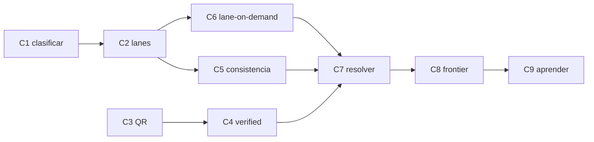

# Plan de cierre de circuitos — `scripts/poc-flow-v2`

| Campo | Valor |
|---|---|
| Alcance | Completar los flujos de `my_flow.md` que la migración dejó abiertos, **como diseño** y no como nota |
| Fuente | `my_flow.md` §3–§9 · `scripts/poc-flow-v2/` (estado actual) · el plan de migración (`README.md` en este mismo directorio) |
| Estado | **Plan** — esperando aprobación antes de ejecutar |
| Prerrequisito | Migración A/B/C cerrada (proceso `run`, motor, gates) |

---

## Visión

La migración cerró el **proceso** y el **motor de decisión**. Lo que falta son los
**circuitos**: los caminos de `my_flow.md` que hoy no se ejecutan — clasificar,
las lanes completas, el QR, el resolver, el frontier y el aprendizaje. Cada uno
se cierra con un **test que falla si el circuito no cierra** (B.16), igual que las
gates ya hechas.

**Regla del plan:** un circuito está cerrado cuando un documento real puede
recorrerlo y un test lo demuestra. No se cierra "en el código": se cierra con
evidencia.

## Inventario de circuitos abiertos

| # | Circuito | § | Qué falta hoy | Qué lo cierra |
|---|---|---|---|---|
| C1 | Clasificar (fast-fail) | §3 | no existe; todo documento va a extraer | un gate antes de `extract` que descarte no-comprobantes con razón |
| C2 | Lanes completas (A/B × texto/vision) | §4.1 | solo lane A de texto; `CROSS_MODAL` y `SAME_MATERIAL` nunca se producen | las 4 lanes + split de prompts en el registry |
| C3 | QR | §4.2 | no hay decodificación | candidato determinístico por QR + `conflicto_qr` |
| C4 | `verified` real | §4.2 | stand-in por dígitos en el texto | verificación mecánica del contenido en la ubicación declarada |
| C5 | Grupos de consistencia | §6.4 | asume neto+IVA; sin `required_components` | componentes por tipo + evaluación de combinaciones |
| C6 | Lane-on-demand | §6.5 | la escalera del Anexo A no corre | correr vision cuando el gate no cierra |
| C7 | Resolver (loop → motor) | §7 | decide una vez y termina | re-entrada con `max_loops=2` y códigos `ESC_NO_NEW_EVIDENCE`/`ESC_LOOP_LIMIT` |
| C8 | Frontier + HITL | §8 | `suggest` no está | sugerencia del frontier (`--resolve`) + backtest de reglas candidatas |
| C9 | Aprender | §9 | nada implementado | dos canales, templates, `LAYOUT_HISTORY`, auditoría por riesgo |

## Orden de ejecución

El orden es por **desbloqueo**, no por número: cada circuito habilita al siguiente.

- **C1 primero**: sin clasificar, los circuitos siguientes corren sobre basura.
- **C2 habilita C5 y C6**: sin vision y review no hay `CROSS_MODAL`/`SAME_MATERIAL`
  que alimenten la escalera, y la consistencia necesita las lecturas completas.
- **C7 necesita C4, C5 y C6**: el resolver re-entra solo con evidencia o candidatos
  nuevos, que son exactamente los que estos tres producen.
- **C8 y C9 al final**: el frontier sugiere sobre lo que el resolver no cerró, y el
  aprendizaje solo se activa desde `HUMAN_CONFIRMED` (I7) — sin C8 no hay
  confirmación humana que aprender.

---

## Fase 1 — Clasificar y leer completo (C1, C2, C3, C4)

### Ola 1.1 — C1: clasificar (fast-fail)

- [x] Definir el gate de clasificación: `texto_nativo`/`escaneado_ocr` → reglas
      sobre el texto (§3); un documento que no es comprobante se **descarta con
      razón**, no se extrae
- [x] Nuevo módulo `flow/classify.py` (reglas puras, sin adapter); se invoca en
      `extract_stage` antes de pagar el modelo
- [x] Test: un documento no-comprobante termina `descartado` con razón, sin pagar
      el modelo (`test_c1_*`)

**Aceptación**: el fast-fail corre antes del modelo; un no-comprobante no llega a
`extract`.

### Ola 1.2 — C2: lanes completas

- [x] Split de prompts en el registry: `extract_texto` (invoice.txt), `extract_vision`
      (vision.txt), `review_texto` (review/texto.txt), `review_vision`
      (review/vision.txt) + `schemas/review/review.json`, declarados en el manifest
- [x] `extract.py`: lane A texto + lane B texto (framing adversarial, I5); lane A
      vision + lane B vision sobre `material.images`
- [x] `CROSS_MODAL` (+2) cuando texto y vision coinciden en `normalized_value`;
      `SAME_MATERIAL` (+1) con `agree` (tope por familia, I4)
- [x] Test: `test_c2_*` — cross-modal por cruce, tope por familia, disagree→candidato nuevo
- [x] Persistencia de imágenes: el `read` escribe `images/` y las recarga al reusar
      (la vision lane no quedaba sin material en un resume)

**Aceptación**: un documento con ambas lanes puede confirmar total/IVA por cruce.
Verificado sobre `pdf_escaneados/9b7a423c…pdf`: producers `regexp + extractor_llm_texto
+ vision`, `CROSS_MODAL` en fecha/IVA/moneda. Nota: `granite-vision:2b` (lane B vision)
no está pulled — la lane se niega con nota, no se finge.

### Ola 1.3 — C3: QR

- [x] Decodificación determinística del QR de ARCA (fecha, CUIT emisor, punto de
      venta, tipo/nro, importe, moneda, receptor, CAE) — `flow/qr.py` con `cv2`
- [x] Coincidencia QR ↔ impreso → señal `DETERMINISTIC`; desacuerdo → flag
      `conflicto_qr` (nunca se resuelve por puntaje, §4.2)
- [x] Test: un QR válido produce candidatos por extracción determinística; un QR
      que discrepa del impreso activa `REV_QR_CONFLICT` (`test_c3_*`)

**Aceptación**: el QR es una fuente determinística, no la verdad del comprobante.

### Ola 1.4 — C4: `verified` real

- [x] `_present_at_location` verifica el contenido con **fronteras de dígito**:
      un valor numérico solo se da por presente si es un número completo, no la
      cola de uno más largo (el falso positivo del stand-in por subcadena)
- [x] `DOCUMENT_CONTENT` usa el check por fronteras; un valor que no está en su
      lugar puntúa `UNKNOWN`, nunca `PASS` (B.10)
- [x] Test: `test_c4_*` — ubicación, valor dentro de un número más largo, texto
      libre por ocurrencia; con prueba de mutación (quitar la frontera → rojo)
- [ ] La verificación por **bbox declarado** (releer el recorte) sigue pendiente:
      el extractor no declara un box hoy; `PdfEngine.tokens` provee `Token.bbox`
      para el texto nativo → `# TODO: [MVP]`

**Aceptación**: un ancla no verificada es `UNKNOWN`, nunca `PASS` (B.10).

---

## Fase 2 — El motor completo (C5, C6, C7)

### Ola 2.1 — C5: grupos de consistencia

- [ ] `required_components` por `tipo_comprobante` (Factura C no discrimina IVA)
- [ ] Evaluar **combinaciones** `{subtotal, IVA, total}`: exactamente una
      consistente → +3 y veto a las otras; cero o más de una → escalar
- [ ] Test: una Factura C sin IVA discriminado no se juzga por la ecuación de
      neto+IVA (es `UNKNOWN`, no `FAIL`)

**Aceptación**: el validador aritmético no veta lo que no puede evaluar (§6.4).

### Ola 2.2 — C6: lane-on-demand

- [ ] Cuando un campo crítico no cierra el gate y falta la vision lane, correrla
      a demanda antes de escalar (§6.5)
- [ ] Test: total/IVA en texto nativo sin determinístico corre vision y cierra
      (la escalera del Anexo A)

**Aceptación**: el par (campo, tier) inalcanzable del Anexo A tiene camino real.

### Ola 2.3 — C7: resolver (loop → motor)

- [ ] `resolver` deriva candidatos con traza; re-entra al motor solo si hay
      candidato o evidencia **nuevos** (`ESC_NO_NEW_EVIDENCE` si no)
- [ ] Tope de `max_loops=2` (`ESC_LOOP_LIMIT`)
- [ ] Test: un validador que dirime re-entra; sin novedad escala directo

**Aceptación**: el loop está acotado y nunca repite el motor sobre la misma evidencia.

---

## Fase 3 — Frontier y aprendizaje (C8, C9)

### Ola 3.1 — C8: frontier + HITL

- [ ] `suggest` (FrontierEngine) + `--resolve`: lee el documento original y
      sugiere por campo; la sugerencia es evidencia, nunca veredicto (I6)
- [ ] Refutadores mecánicos también sobre `campos_frontier` (§8)
- [ ] Backtest de reglas candidatas contra el histórico `HUMAN_CONFIRMED` antes
      de proponerlas
- [ ] Test: sin credencial, la cola se escribe y la negativa es una nota, no un fake

**Aceptación**: un escalamiento llega al frontier o se reporta su negativa; una
regla candidata no se propone si rompe un caso ya resuelto.

### Ola 3.2 — C9: aprender

- [ ] Dos canales: `SYSTEM_CONFIRMED` (estadísticas en sombra, sin efecto) y
      `HUMAN_CONFIRMED` (activa templates, calibra) — I7
- [ ] Templates `shadow → active → stale → retired` con clave
      `(emisor, tipo, layout_fingerprint)`; `LAYOUT_HISTORY` +1 solo activo
- [ ] Auditoría por riesgo (severidad × tier × template nuevo) sobre `SYSTEM_CONFIRMED`
- [ ] Test: `SYSTEM_CONFIRMED` no activa un template (un error sistemático no se
      enseña a sí mismo)

**Aceptación**: nada se aprende de una lectura cruda ni de un `resolved` sin
reconfirmar; la activación exige confirmación humana (I7).

---

## Criterio de cierre

1. **Nueve circuitos con test** — cada C1…C9 tiene un test que falla si el
   circuito no cierra (B.16).
2. **El Anexo A no tiene celdas inalcanzables** salvo la intencional — lane-on-demand
   y el resolver cubren la escalera.
3. **Ningún §3–§9 queda como nota** — lo que no se implemente queda `# TODO: [MVP]`
   declarado, no ausente.
4. **Gates en verde** — `pytest`, `ruff check`, `ruff format --check`, `pylint`
   sobre `scripts/poc-flow-v2` y `tests/poc_flow_v2`.

## Fuera de alcance (por ahora)

- Constatación del comprobante contra ARCA y consulta del padrón por CUIT
  (dependen de conectividad/credenciales) → `# TODO: [MVP]`
- Ítems de línea como salida (§6.4) → `# TODO: [MVP]`
- `cross_modal_correlated_error_rate` y las métricas del revisor B (§Notas):
  requieren `HUMAN_CONFIRMED` acumulado, o sea C9 → se instrumentan al cerrar C9

## Cómo ejecutar

En orden de fases y olas. Cada ola cierra con los cuatro QA gates y con la prueba
de que su test se pone **rojo** al romper el circuito. No se avanza de ola sin la
aceptación de la anterior.
