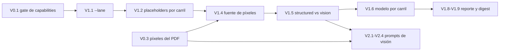

# Plan — soporte de visión en `myllmlocal.py`

| Campo | Valor |
|---|---|
| Alcance | Que el cliente `scripts/poc-flow-v2/myllmlocal.py` pueda leer **píxeles**, no solo texto, y que los prompts de visión del registry sean alcanzables |
| Fuente | `my_flow.md` §2/§4.1/§4.2 · `registry/prompts/**` · `scripts/poc-flow-v2/flow/**` · mediciones de esta sesión (2026-09-22) |
| Estado | **Propuesto** — sin empezar |
| Esfuerzo | `S` la Fase 1 · `S` la Fase 2 · `M` la Fase 0 |
| Prerrequisito | Fase 0 completa: sin ella, `gemma3:4b` queda bloqueado por un gate que miente |
| Decisión del usuario | Modelos de visión: **A = `qwen2.5vl:3b`**, **B = `gemma3:4b`** |

---

## Visión

Hoy el cliente **solo sabe mandar texto**. Una imagen entra, se convierte a texto con OCR
y ese texto viaja al modelo: los píxeles nunca salen del disco. Eso hace que la mitad de
los artefactos de prompt del registry **no tengan puerta** y que la lane de visión de
`my_flow.md` §4.1 no exista en el bench.

El trabajo tiene tres partes, y el orden importa:

1. **Desbloquear** lo que está roto fuera del cliente (el gate de `capabilities` que
   reporta mal, y el `Material` de una imagen que no adjunta píxeles).
2. **Darle un carril de imagen al cliente** — sin romper el carril de texto, que hoy
   funciona y que el usuario usa a propósito.
3. **Cerrar los prompts que faltan**, para que la lane de visión tenga los dos roles
   (extraer / revisar) que §4.1 exige.

**Principio rector:** el carril lo sugiere **el prompt**, no el sufijo del archivo.
`jpg` + `invoice_deteccion.txt` (hoy: OCR → texto) es una invocación legítima y debe
seguir funcionando; `jpg` + `invoice_vision.txt` (píxeles) es la nueva. Un `auto` atado
al sufijo rompería la primera.

---

## Hallazgos medidos que condicionan el diseño

Todo lo de esta tabla se midió en esta sesión, contra este runtime y estos fixtures.

### H1 — `gemma3:4b` lee píxeles, y el adapter dice que no puede (bloqueante)

El runtime declara la capacidad de dos formas y **no coinciden**:

| endpoint | `gemma3:4b` | quién lo lee |
|---|---|---|
| `/api/tags` | `['completion']` | **`OllamaEngine._catalogue()`** → `supports_vision = "vision" in declared` = **`False`** |
| `/api/show` | `['completion', 'vision']` | nadie |

Y el modelo **sí lee pixels**, con el mismo prompt y variando solo la imagen:

| control | `gemma3:4b` | `qwen2.5vl:3b` |
|---|---|---|
| píxeles de `66cd35e9…jpg` (factura) | *"La imagen muestra una factura de Aimaró Electricidad con… punto de venta, fecha de emisión…"* | *"FACTURA ELECTRICA DE AIMARO JAVIER ANGEL PARA CVC S.A."* |
| píxeles de `66e6e0ea…jpg` (otro documento) | *"…desglose de impuestos y totales … KALPA GROUP S.A. y CVC SA…"* | *"Una factura impresa con detalles de compra y facturación."* |
| **sin** píxeles, mismo prompt | *"SIN IMAGEN"* | *"SIN IMAGEN"* |

Las dos imágenes producen descripciones distintas y correctas; sin píxeles el modelo
responde `SIN IMAGEN`. **Los píxeles llegan.** Que `capabilities` diga lo contrario es un
defecto del adapter, no una limitación del modelo.

**Consecuencia:** cualquier gate que consulte `supports_vision` antes de llamar **bloquea
`gemma3:4b`** — y lo bloquea justo en el rol B de visión que este plan tiene que cablear.
Es también la forma peligrosa: un gate que consulta un dato incorrecto no falla ruidoso,
**falla en el sentido del dato**.

### H2 — El runtime sí se niega fuerte, si el modelo no tiene visión

No hay riesgo de falla silenciosa por mandar píxeles a un modelo de texto:

| modelo | con píxeles |
|---|---|
| `qwen2.5:7b-instruct` | `unsupported_format`: *"Multimodal data provided, but model does not support multimodal requests"* |
| `granite3.1-moe:1b` | `unsupported_format` (idem) |
| `deepseek-r1:8b` | `model_unknown` sobre HTTP 500: *"image input is not supported"* |

**Consecuencia:** el gate de H1 es conveniencia (evita cargar el modelo para nada y deja
el motivo en el reporte), **no** es lo que sostiene la corrección. Arreglarlo es necesario
igual, porque hoy bloquea un modelo que funciona.

### H3 — Un `Material` de imagen no adjunta píxeles

`flow/material.py` construye `images` en **una sola rama**: el OCR de un PDF, después de
renderizar. Medido con `read_material`:

| fixture | etiqueta en la matriz del usuario | `kind` | `tier` | `route` | `images` | `text` |
|---|---|---|---|---|---|---|
| `casos/66cd35e9….jpg` | imagen con comprobante | `image` | `escaneado_ocr` | `ocr` | **0** | 896 |
| `casos/66cd35e9….pdf` | pdf texto | `pdf` | `texto_nativo` | `layout_text` | 0 | 2493 |
| `pdf_aptos_layout/36744cc6….pdf` | **pdf imagen** con comprobante | `pdf` | **`texto_nativo`** | **`layout_text`** | 0 | 2307 |
| `negativos/neg_2026-10_pantalla_aprobacion.pdf` | pdf imagen sin comprobante | `pdf` | `escaneado_ocr` | `render+ocr` | **1** | 90 |

Dos cosas se caen de acá:

- **Una imagen nativa no tiene píxeles en el `Material`.** Para el cliente no es
  bloqueante —`RasterEngine.load` los da directo, medido: 179 450 B → `Bytes(image/png,
  438 577)` en **0,16 s**—, pero significa que el `Material` **no es** la fuente de
  píxeles que §4.1 supone.
- **`36744cc6….pdf` no es un "pdf imagen".** Tiene capa de texto y el flujo lo rutea
  `texto_nativo`. Las etiquetas de la matriz de prueba del usuario no coinciden con el
  ruteo real. Un caso de prueba mal etiquetado prueba lo que no dice.

### H4 — Los prompts de visión existen y son inalcanzables

| artefacto | placeholders | lane | hoy |
|---|---|---|---|
| `extraction/invoice.txt` | `{text}` | texto A | ✅ corre |
| `extraction/invoice_vision.txt` | *(ninguno)* | visión A | ❌ `error: the prompt does not contain '{text}'` → exit 4 |
| `review/invoice.txt` | `{text} {proposal}` | texto B | ✅ corre |
| `review/invoice_vision.txt` | `{proposal}` | visión B | ❌ exit 4 |

**Causa única:** `_substituted` exige `{text}` sin condición. Los prompts de visión no lo
llevan **a propósito** (leen píxeles). El guard que protege contra *"el documento nunca
llegó al modelo"* es exactamente lo que bloquea la lane de visión. La mitad de los
artefactos de prompt del registry no tiene puerta.

### H5 — El carril de visión cambia la independencia entre lanes

`my_flow.md` §4.2 apoya `CROSS_MODAL` (+2) en que texto y visión son **fuentes
independientes**, y dice explícitamente *"familias de modelo distintas"*. Con los modelos
elegidos:

| par | familias | ¿independiente? |
|---|---|---|
| visión A `qwen2.5vl:3b` ↔ visión B `gemma3:4b` | qwen ↔ gemma | ✅ |
| texto A `qwen2.5:7b-instruct` ↔ texto B `gemma3:4b` | qwen ↔ gemma | ✅ |
| **texto A `qwen2.5:7b-instruct` ↔ visión A `qwen2.5vl:3b`** | **qwen ↔ qwen** | ⚠️ **no** |

El cruce que sostiene `CROSS_MODAL` es justamente la última fila. **No es un defecto de
este plan** —es una decisión de modelos que el plan tiene que dejar registrada, porque
§4.2 asume una independencia que este par no da.

### H6 — `read_material` sobre un PDF con texto no puede dar píxeles

Es la consecuencia de H3 llevada al límite: `--lane image` sobre un `texto_nativo` **no
tiene de dónde sacar el render**. El cliente no puede resolverlo solo; renderizar es
trabajo del flujo (`pdf.render` + `_render_dpi` con el tope anti-upscale).

---

## Fase 0 — Desbloquear (fuera del cliente)

Sin esta fase, la lane de visión B nace bloqueada por un dato que miente.

| # | Qué | Dónde | Qué lo cierra |
|---|---|---|---|
| **V0.1** | Que `supports_vision` refleje la capacidad real | `src/docflow/adapters/ollama.py` | Leer la capacidad de `/api/show` (o unir las dos fuentes) en vez de confiar solo en `/api/tags`. Medido: `gemma3:4b` pasa de `False` a `True` |
| **V0.2** | Dejar de adivinar en un solo lugar | idem | Una función única `_declares_vision(model)` con su test, no el `"vision" in declared` inline |
| **V0.3** | Que el cliente pueda obtener píxeles de un PDF con texto | `scripts/poc-flow-v2/flow/material.py` | `Material.images` se puebla también en la rama `layout_text` (renderiza lo que ya midió), **o** el cliente declara la limitación y la refusa con un código |

**Decisión pendiente en V0.3.** Puebla la rama de texto → cada PDF con texto paga un
render que hoy no paga (`my_flow.md` §2 hace lo contrario: solo renderiza cuando hace
falta). No la puebla → `--lane image` sobre un PDF con texto se **refusa nombrando la
causa**, que es honesto pero deja el caso sin cubrir. Las dos son defendibles; la elección
es del usuario.

**Acceptance V0.1:** `capabilities('gemma3:4b').observed['supports_vision'] is True`, y
`vision('gemma3:4b', …, [img], …)` devuelve valor en vez de ser bloqueado por el gate.

**Test falsable:** el test compara `supports_vision` contra lo que **`/api/show` declara
para ese modelo** (no contra un literal `True`, ni contra `/api/tags`, que es justo la
fuente que miente). Falsificación: revertir a leer solo `/api/tags` → `gemma3:4b` vuelve a
`False` → rojo.

---

## Fase 1 — El carril de imagen del cliente

### Ola 1.1 — El carril como dato (V1.1 – V1.3)

| # | Qué | Qué lo cierra |
|---|---|---|
| **V1.1** | `--lane {auto,text,image}`, default `auto` | `auto` derivado de *(¿el prompt lleva `{text}`?)* **y** *(¿el documento tiene píxeles?)*. El flag explícito cubre lo que `auto` no puede saber: probar la lane de visión sobre un PDF con capa de texto (`--lane image`), o pedir el transcript de una imagen (`--lane text`) |
| **V1.2** | `_substituted` pasa a ser consciente del carril | `{text}` es requisito **de la lane texto**, no de toda invocación. Un template que lleva `{text}` y va por píxeles se sustituye igual (texto + píxeles en una sola llamada, precedente medido: `scripts/poc/llm_frontier.py::extract_from_text_and_image`) — nunca se deja el literal |
| **V1.3** | `Text` → `Document(text, images, lane)` | Reemplaza el `Text(body, route, notes)` actual. `route` sobrevive; `images` y `lane` son nuevos |

**Acceptance V1.2:** `invoice_vision.txt` **llega al modelo** en vez de morir en exit 4.

**Test falsable V1.2:** un prompt sin `{text}` corre y **la llamada al modelo ocurre**
(assert sobre las imágenes enviadas, no sobre la respuesta: un stub coopera y la respuesta
no prueba nada). Falsificación: restaurar el guard incondicional → el prompt de visión
vuelve a exit 4 → rojo.

### Ola 1.2 — De dónde salen los píxeles (V1.4)

| # | Qué | Qué lo cierra |
|---|---|---|
| **V1.4** | `_document()` decide la fuente de píxeles por tipo | `.txt`/`.md` → **no tiene píxeles**, `--lane image` se refusa nombrando que un archivo de texto no tiene imagen. Imagen (`.jpg`/`.jpeg`/`.png`/`.tif`/`.tiff`/`.bmp`/`.webp`) → `RasterEngine.load(path)`. PDF → `material.images`, que solo viene poblado en `render+ocr` (H3/H6) |

**Acceptance V1.4:** las tres fuentes de la matriz del usuario producen píxeles —imagen
nativa, PDF sin capa de texto— y la cuarta (`.txt`) se refusa con causa.

**Test falsable V1.4:** `.txt` + `--lane image` → exit 4 y el mensaje nombra la falta de
píxeles (no un `TypeError`, ni una lista vacía que después falle en el adapter).

**Límite declarado:** un PDF `texto_nativo` + `--lane image` queda sin cubrir hasta que
se resuelva V0.3. El cliente lo **refusa con causa**, no lo finge.

### Ola 1.3 — Que la llamada sea la correcta (V1.5 – V1.7)

| # | Qué | Qué lo cierra |
|---|---|---|
| **V1.5** | `_answer` elige `structured` vs `vision` según el carril | `StructuredEngine` (el `Protocol`) hoy declara **un solo método**, `structured`. Sumar `vision(model, prompt, images, schema)` — la misma firma que el puerto |
| **V1.6** | `_default_model()` deriva por carril | Hoy deriva `text_model_a` siempre. Derivar `text_model_a` para una llamada de visión es *"el modelo equivocado respondió y los dos reportan éxito"*. El default sale de `flow.config` (`vision_model_a`), nunca de un literal nuevo |
| **V1.7** | `--lane image` sin `--model` sobre un modelo sin visión | Se apoya en el runtime (H2), pero el mensaje debe llegar con el código del adapter, no como excepción |

**Test falsable V1.6:** con `--lane image` y sin `--model`, el modelo que recibe la llamada
es `VISION_MODEL_A` de `flow.config` (assert sobre el modelo **enviado**). Falsificación:
volver a derivar `text_model_a` → el assert nombra el modelo equivocado → rojo.

### Ola 1.4 — El reporte dice por dónde pasó (V1.8 – V1.9)

| # | Qué | Qué lo cierra |
|---|---|---|
| **V1.8** | El reporte suma `lane` y `images` (conteo) | Un reporte que no dice el carril no se distingue de otro. `_announce` suma una línea de imágenes con su tamaño, no solo el conteo |
| **V1.9** | `_question_digest` incluye el carril | Con dos carriles para el **mismo par documento+prompt**, el digest actual hace que uno **pise** al otro en `--out`. El nombre del archivo es la identidad de la pregunta |

**Test falsable V1.9:** dos corridas, mismo documento y mismo prompt, una por carril →
**dos archivos distintos** en `--out`. Falsificación: sacar el carril del digest → la
segunda corrida sobrescribe la primera y queda **un** archivo → rojo.

---

## Fase 2 — Los prompts que faltan

**La sospecha del usuario es correcta.** De los artefactos del registry, la lane de visión
tiene **la mitad**: los dos prompts base de visión existen (`invoice_vision.txt`,
`review/invoice_vision.txt`), pero los **pasos reservados** tienen uno solo cada uno y son
de texto.

`flow/artifacts.py::RESERVED_EXTRACTION_STEPS` declara cuatro pasos, y
`tests/poc_flow_v2/test_gates.py` afirma explícitamente que *"the reserved steps have one
prompt each and no vision"* — o sea, **es una decisión de diseño, no un olvido**. Agregar
variantes de visión es cambiar esa decisión.

| paso | prompt de texto | falta para visión |
|---|---|---|
| `detection` | `extraction/invoice_deteccion.txt` | `extraction/invoice_deteccion_vision.txt` |
| `desglose` | `extraction/invoice_desglose.txt` | `extraction/invoice_desglose_vision.txt` |
| `clasificacion` | `extraction/invoice_clasificacion.txt` | `extraction/invoice_clasificacion_vision.txt` |
| `rubro` | `extraction/invoice_rubro.txt` | `extraction/invoice_rubro_vision.txt` (lleva `{rubro}` **y** píxeles) |

| # | Qué | Qué lo cierra |
|---|---|---|
| **V2.1** | Decidir cuáles de los cuatro pasos reservados necesitan lane de visión | No todos: `clasificacion` y `rubro` son **derivados** (`_DERIVED_FIELDS` en `extract.py`: `categoria_gasto`, `centro_de_costo` no tienen ancla en el documento). Un derivado no necesita leer píxeles. `detection` **sí** — una imagen es la fuente más directa del gate de §3 |
| **V2.2** | Escribir el prompt de visión de `detection` | El par con `invoice_vision.txt` como molde: método (barrer, localizar, leer glifos), regla de `null` cuando el glifo queda ambiguo, y **sin** `{text}` |
| **V2.3** | Declararlos en `registry/manifest.json` | K8 rechaza un registry con un archivo que el manifest no nombra (`_undeclared_files`). Un artefacto sin declarar **no existe** |
| **V2.4** | Actualizar el test que afirma "no vision" | `test_gates.py` línea ~533. Si no se actualiza, el test **protege la decisión vieja** y el trabajo nuevo queda rojo por diseño |

**Acceptance V2.2:** `myllmlocal.py <jpg> --prompt registry/prompts/extraction/invoice_deteccion_vision.txt --schema registry/schemas/extraction/invoice_detection.json --model qwen2.5vl:3b` devuelve `comprobante_valido`, y en el fixture negativo devuelve `false` con `motivo_rechazo`.

**Test falsable V2.4:** el test de deriva (`tests/kernels/test_committed_registry.py`, que
compara `required`/`properties` del schema contra el texto del prompt) **cubre también los
prompts nuevos**. Un prompt de visión que nombre menos campos que los que el schema
requiere es el defecto que ese test existe para atrapar.

---

## Orden de ejecución



- **V0.1 primero:** sin él, la lane B de visión queda bloqueada por un dato que miente, y
  todo lo que se pruebe después mide el defecto, no el trabajo.
- **V1.2 antes que V1.4:** hacer alcanzable el prompt es lo que destraba el resto; sin eso
  no hay con qué probar la fuente de píxeles.
- **V0.3 antes que V2:** los prompts de visión se prueban sobre imágenes nativas (no
  necesitan V0.3), pero el caso `pdf imagen` de la matriz del usuario **sí** lo necesita
  si se quiere correr la lane de visión sobre `neg_2026-10_pantalla_aprobacion.pdf`.
- **V2 al final:** un prompt se escribe contra un carril que ya funciona.

---

## Aceptación de la fase

Un operador puede correr la lane de visión de `my_flow.md` §4.1 **desde el bench**, en los
dos roles, sin que ningún artefacto del registry quede sin puerta:

| caso | comando | esperado |
|---|---|---|
| detección por visión, positivo | `jpg` + `invoice_deteccion_vision.txt` + `qwen2.5vl:3b` | `comprobante_valido` |
| detección por visión, negativo | `neg_*.jpg` + idem | `comprobante_valido` con `motivo_rechazo` |
| extracción por visión | `jpg` + `invoice_vision.txt` + `invoice.json` + `qwen2.5vl:3b` | 7 campos |
| review por visión | `jpg` + `review/invoice_vision.txt` + `--proposal` | `field_verdicts` |
| carril de texto intacto | `jpg` + `invoice_deteccion.txt` (el comando de hoy) | **idéntico a hoy** |
| `.txt` + `--lane image` | cualquiera | exit 4 nombrando la falta de píxeles |

Y el registro responde, sin abrir el código, **por qué carril pasó cada corrida** y **con
qué modelo**.

---

## Fuera de alcance

- **Cablear la lane de visión en `flow/extract.py`.** Ese trabajo ya está hecho (C2 en
  `cierre-circuitos.md`, verificado sobre `pdf_escaneados/9b7a423c…pdf` con producers
  `regexp + extractor_llm_texto + vision` y `CROSS_MODAL` en fecha/IVA/moneda). Este plan
  es sobre el **cliente**, que es el que no puede mandar píxeles.
- **`granite-vision:2b`.** `my_flow.md` §4.1 la nombra como B de visión y no está pulled.
  El usuario eligió `gemma3:4b` en su lugar. Queda como **cambio de §4.1 a registrar**, no
  como defecto.
- **El `--proposal` de visión con un reporte propio.** `_read_proposal` ya sabe desenvolver
  la clave `answer`. El prompt de visión no lleva `{text}`, así que el caso *"B lee la
  fuente"* (I5) se satisface con píxeles — pero **no está medido** y no se promete acá.
- **Los otros clientes** (`myflow.py`, `flow/run.py`). Comparten `read_material`, así que
  V0.3 los afecta; el carril es del cliente del bench.

## Cómo ejecutar

```bash
# el comando de hoy: debe seguir idéntico (texto por OCR)
python scripts/poc-flow-v2/myllmlocal.py \
  'tests/fixtures/casos/66cd35e9-a0a2-4342-b4f9-4c7e7c39d6b0.jpg' \
  --prompt 'registry/prompts/extraction/invoice_deteccion.txt' \
  --schema 'registry/schemas/extraction/invoice_detection.json' \
  --model 'qwen2.5:7b-instruct' --pretty

# la lane de visión: hoy exit 4, después de la Fase 1 un valor
python scripts/poc-flow-v2/myllmlocal.py \
  'tests/fixtures/casos/66cd35e9-a0a2-4342-b4f9-4c7e7c39d6b0.jpg' \
  --prompt 'registry/prompts/extraction/invoice_vision.txt' \
  --schema 'registry/schemas/extraction/invoice.json' \
  --model 'qwen2.5vl:3b' --pretty

# las cuatro puertas de calidad, desde la raíz
python -m pytest -q && ruff check . && ruff format --check . && pylint src tests
```

Nota: `tests/fixtures-txt/casos/66cd35e9….jpg` **no existe** — los `.jpg` viven en
`tests/fixtures/casos/`. Los comandos de la sección `# IMAGE` de `my_prompt.md` apuntan al
árbol equivocado.

## Verificación

Cada ola cierra con las cuatro puertas en verde y con su test **falsificado**: se muta la
fuente, se observa el rojo que nombra el invariante, se restaura y se vuelve a verde. Se
reportan las **dos** observaciones. Un test que solo pasa cuando el código está bien no
prueba nada.
