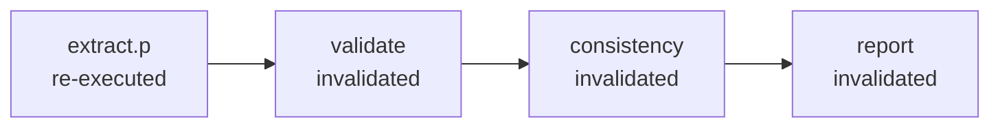
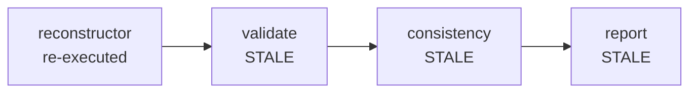
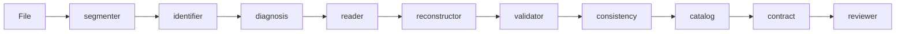

# CLI invocations

How each of the thirteen pipelines is called from the CLI, and how each of the ten components is invoked on its own.

**The CLI surface below is proposed, not specified.** No document in this workspace defines the command names, flags or job model — `my_prompt.md` states the requirements (library + CLI, per-component invocation, batch, stop with force, pause/resume) without fixing syntax. The examples are consistent with those requirements, with the pipeline codes in `workflow.md`, and with the component names in `components.md`. Treat them as a design proposal to adjust.

**Contents**

- [Common shape](#common-shape) — the command, idempotent `run`, and every flag
- [Pipeline invocations](#m0--text-arrives-directly) — the thirteen, `M0-ErVR` through `M4-EpVR`
- [Choosing without declaring](#choosing-without-declaring) — `--extractor` vs `--pipeline`
- [Batch](#batch) — one file, several, a folder
- [Output directory](#output-directory) — `run.json` and where progress lives
- [Per-document ledger](#per-document-ledger) — what makes resuming granular
- [Forced reprocess](#what-force-means) — `--force` for what the ledger calls done
- [Control](#control) — `stop` to see what is running, plus pause and resume
- [Component invocations](#component-invocations) — the ten, runnable in isolation
- [What every invocation returns](#what-every-invocation-returns)
- [Quick reference](#quick-reference) — the thirteen pipelines
- [Quick reference — components](#quick-reference--components) — the ten components

---

## Common shape

Every pipeline invocation is the same command with a different `--pipeline` code:

```bash
docflow run --pipeline <CODE> <input> [options]
```

| Part | Meaning |
|---|---|
| `run` | Execute a pipeline end to end. Sibling subcommands exist for single components (see below) |
| `--pipeline` | One of the thirteen codes from `workflow.md` |
| `<input>` | A file, several files, a folder, or `-` for stdin |
| `--out` | Output directory |

**There is no flag to skip validation.** The `V` in every primitive is invariant (`workflow.md`), so no `--no-validate` exists and no example below passes one.

### `run` is idempotent

`run` is the only execution verb, and repeating it is safe:

| Situation | What `run` does |
|---|---|
| Fresh output directory | Runs everything |
| A run already finished | **Skips the whole batch** — nothing to do |
| A run interrupted, paused or killed | **Reads the ledger, skips what is done, continues what is not** |
| Any of the above, with `--force` | **Ignores the ledger and reprocesses** |

There is no separate `resume`. Running the same command again **is** resuming: the ledger is read, finished work is skipped, and incomplete work continues. That is what makes a folder run over eleven thousand files interruptible without a second verb to remember.

`--force` is the only override, and it means one thing: **do not trust the ledger.**

### Naming the mode

Every pipeline has a material prefix and an extractor mode. The two ways to name the mode, and when each applies:

| Form | Mode comes from | Use |
|---|---|---|
| `--pipeline M1-ErpVR` | the code | When the pipeline is known — reproducible runs |
| `--extractor rp` | a flag, material inferred | When the material varies across the corpus |

`--extractor` takes `r`, `p` or `rp` and expects **Diagnosis to select the material per file**, which is what makes one pass work over a mixed folder. The two forms are alternatives; passing both is an error. See *Choosing without declaring*.

### Options

Every flag used anywhere in this document:

**Input**

| Flag | Meaning |
|---|---|
| `--schema` | Document-type schema, used by `validator` |
| `--golden` | Golden set for tuning and comparison |

**Models**

| Flag | Meaning |
|---|---|
| `--model` | Local extraction model, e.g. `ollama:qwen2.5`. Used by `EpVR` and `ErpVR` |
| `--validator` | Frontier LLM that governs escalation, e.g. `claude`, `deepseek`, `openai` |

**Output**

| Flag | Meaning |
|---|---|
| `--out` | Output directory. Folder input mirrors its tree here |
| `--work` | Where bookkeeping and artifacts go, when not inside `--out`. See *Output directory* |
| `--format` | Result format: `json` (default), `md`, `html` |

**Execution**

| Flag | Meaning |
|---|---|
| `--jobs` | Concurrency for batch runs |
| `--force` | Ignore the ledger and reprocess. On `stop`: kill without draining |
| `--stage` | With `--force`, the stage to start reprocessing from |
| `--isolate` | With `--force --stage`, keep downstream artifacts marked `stale` |
| `--keep-artifacts` | Keep the previous artifact as `.prev` instead of overwriting |
| `--only` | Restrict to a subset, e.g. `--only failed` |
| `--dry-run` | Report what would happen, run nothing |

**Component-specific** — the rest, grouped by where they appear

| Flag | Component | Meaning |
|---|---|---|
| `--cut-confidence` | `segmenter` | Threshold for accepting a cut |
| `--show-evidence` | `identifier` | Print the words or shapes that triggered the decision |
| `--min-chars`, `--min-dpi` | `diagnosis` | Quality gate before routing |
| `--ocr` | `reader` | Force an OCR engine |
| `--correct` | `reader` | Enable OCR-text correction |
| `--continuity-only` | `reconstructor` | Cross-page continuity without full layout |
| `--tolerance-amounts` | `consistency` | Tolerance for amounts, in cents |
| `--source` | `catalog` | External source to validate against |
| `--retry-queue`, `--retry` | `catalog` | Inspect or retry unverified fields |
| `--rebuild`, `--rebuild-index` | `ledger`, `run` | Recompute the index from artifacts |
| `--state` | `ledger` | Filter documents by stage state |
| `--verify` | `run`, `status` | Reconcile the record against the filesystem |
| `--rule`, `--new-type`, `--value` | `reviewer` | Promote a case to a rule, a type, or a corrected value |
| `--failed` | `status` | Show only what escalated |

---

## M0 — text arrives directly

No acquisition step. The caller supplies the text, so the pipeline begins at the extractor. `workflow.md` calls this "the primitive with an empty prefix".

**The positional input is text** — the pipeline code says so, so no separate flag is needed. A `.txt` file, a Markdown file, or `-` for stdin all work. Pointing M0 at a PDF is an error, not a silent conversion: if the material is a PDF, that is M1 or M2.

### M0-ErVR — text, regex

```bash
docflow run --pipeline M0-ErVR cuerpo.txt --out out/
```

```bash
# same, from stdin
cat cuerpo.txt | docflow run --pipeline M0-ErVR - --out out/
```

Deterministic read, invents nothing. **Blind spot:** a bad anchor is invisible to it — the value is real, with correct shape and type.

### M0-EpVR — text, prompt

```bash
docflow run --pipeline M0-EpVR cuerpo.txt \
  --model ollama:qwen2.5 --out out/
```

Use when the wording varies and a pattern per variant is impractical. **Blind spot:** can invent a value and can misattribute one.

### M0-ErpVR — text, both

```bash
docflow run --pipeline M0-ErpVR cuerpo.txt \
  --model ollama:qwen2.5 --out out/
```

Both reads over the same text, compared by Consistency. **The cheapest contrast in the system** — nothing was spent acquiring the text, so a second read costs only one call on critical fields.

---

## M1 — text PDF

`pdftotext` produces a linear stream. One step more than M0, and that step is the only liability: reading order is heuristic, so table continuity across pages is lost and the failure is quiet.

### M1-ErVR — text PDF, regex

```bash
docflow run --pipeline M1-ErVR documentos/factura.pdf --out out/
```

### M1-EpVR — text PDF, prompt

```bash
docflow run --pipeline M1-EpVR documentos/factura.pdf \
  --model ollama:qwen2.5 --out out/
```

### M1-ErpVR — text PDF, both

```bash
docflow run --pipeline M1-ErpVR documentos/factura.pdf \
  --model ollama:qwen2.5 --out out/
```

---

## M2 — image PDF

Rasterize, then OCR. Identical to M3 once the image exists, so the two share one implementation with a switch at the front.

### M2-ErVR — image PDF, regex

```bash
docflow run --pipeline M2-ErVR documentos/escaneo.pdf --out out/
```

Patterns must tolerate the misreads OCR actually produces — an `O` for a `0` in a known position, for instance.

### M2-EpVR — image PDF, prompt

```bash
docflow run --pipeline M2-EpVR documentos/escaneo.pdf \
  --model ollama:qwen2.5 --out out/
```

### M2-ErpVR — image PDF, both

```bash
docflow run --pipeline M2-ErpVR documentos/escaneo.pdf \
  --model ollama:qwen2.5 --out out/
```

---

## M3 — image via OCR

Page becomes a string first. Loses everything visual — layout, signatures, seals, checkboxes, logos.

### M3-ErVR — image, regex

```bash
docflow run --pipeline M3-ErVR documentos/foto.jpg --out out/
```

### M3-EpVR — image, prompt

```bash
docflow run --pipeline M3-EpVR documentos/foto.jpg \
  --model ollama:qwen2.5 --out out/
```

### M3-ErpVR — image, both

```bash
docflow run --pipeline M3-ErpVR documentos/foto.jpg \
  --model ollama:qwen2.5 --out out/
```

**The M3-versus-M4 fork is a real trade.** M3 can verify itself cheaply, because the text it produces admits a second read. M4 cannot. If contrast on critical fields is required, that requirement is what pushes an image to M3.

---

## M4 — image, direct to the model

The one material with a **single primitive**. No text intermediate exists, so there is no string for a regex to run on and no `ErVR` or `ErpVR` variant.

### M4-EpVR — image, prompt on pixels

```bash
docflow run --pipeline M4-EpVR documentos/foto.jpg \
  --model ollama:llava --out out/
```

**Sees what no other route can:** signatures, seals, checkboxes and logos are available to the extractor rather than lost in conversion.

**At the cost of two things:** a single fused read with no second opinion, and no character offset — the trace is a bounding region.

---

## Choosing without declaring

The codes above declare the pipeline explicitly. Since Diagnosis is the component that decides the material, the same run can be left to select:

```bash
# let Diagnosis pick the material, then choose the extractor mode
docflow run --extractor rp documentos/ --model ollama:qwen2.5 --out out/
```

```bash
# inspect what would be chosen, without running
docflow run --extractor rp documentos/ --dry-run
```

**Whether this is allowed is an open question in `workflow.md`** — nothing yet says whether the caller declares the pipeline or the system infers it. It is sharpest in two places: M0 is a caller *assertion* with no artifact to diagnose, and for an image both M3 and M4 are valid.

---

## Batch

The batch requirement from `my_prompt.md`: one file, several files, or a folder. Folder input **mirrors its tree** in the output.

### One file

```bash
docflow run --pipeline M1-ErpVR documentos/factura.pdf --out out/
```

### Several files

```bash
docflow run --pipeline M1-ErpVR \
  documentos/enero/factura-001.pdf \
  documentos/enero/factura-002.pdf \
  documentos/febrero/nota-014.pdf \
  --out out/
```

### A folder

```bash
docflow run --pipeline M1-ErpVR documentos/ --out out/ --jobs 8
```

The tree is preserved:

```
documentos/                          out/
  2024/enero/factura-001.pdf    →      2024/enero/factura-001.json
  2024/enero/factura-002.pdf    →      2024/enero/factura-002.json
  2024/febrero/nota-014.pdf     →      2024/febrero/nota-014.json
```

### Mixed materials in one folder

For a corpus of eleven thousand files, the materials will not be uniform. Since a folder run can select per file, one pass handles the mixture:

```bash
docflow run --extractor rp documentos/ --out out/ --jobs 8
```

### With a golden set

`my_prompt.md` describes the golden set as serving two jobs: tuning the local models, and comparing the pipelines against each other on equal terms. The second is why the flag exists at run time:

```bash
docflow run --pipeline M1-ErpVR documentos/ \
  --model ollama:qwen2.5 --validator claude \
  --golden golden/facturas.jsonl --out out/
```

---

## Output directory

**Yes — two levels of progress, in two different files.** A batch-level manifest and a per-document ledger, both JSON, both inside the output directory.

### Layout

```
out/
  run.json                                   ← batch progress
  .docflow/
    ledger/2024/enero/factura-001.ledger.json   ← per-document progress
    work/2024/enero/factura-001/
      text.txt                                  ← intermediate artifacts
      fields.r.json
      fields.p.json
  2024/enero/factura-001.json                ← final result
  2024/enero/factura-002.json
```

**Bookkeeping is dot-prefixed; results are not.** The consumer points at `out/` and walks the tree, getting only documents. `.docflow/` holds everything that describes the run rather than being its output — so a consumer that does not care about progress never has to filter it out.

`--work` overrides where the bookkeeping and artifacts go, for when the output is a mount the consumer owns:

```bash
docflow run --pipeline M1-ErpVR documentos/ --out out/ --work work/ --jobs 8
```

### `run.json` — the batch

One file per job, answering "how is the run doing" without reading eleven thousand ledgers:

```json
{
  "job": "7f3a91c2",
  "pipeline": "M1-ErpVR",
  "root": "documentos",
  "state": "running",
  "started": "2026-09-16T14:02:11Z",
  "updated": "2026-09-16T14:31:07Z",

  "totals": {
    "discovered": 11034,
    "done": 4821,
    "failed": 12,
    "pending": 6201
  },

  "stages": {
    "acquire":   4821,
    "extract.r": 4821,
    "extract.p": 4809,
    "validate":  4702,
    "report":    4702
  },

  "outcomes": {
    "escalated": 34,
    "to_review": 21,
    "partial":   6
  },

  "inflight": [
    { "path": "2024/marzo/factura-881.pdf", "stage": "extract.p", "started": "14:31:02Z" },
    { "path": "2024/marzo/factura-882.pdf", "stage": "extract.p", "started": "14:31:03Z" }
  ]
}
```

| Field | Answers |
|---|---|
| `state` | `running` · `paused` · `stopped` · `finished` |
| `totals` | How much is done, failed, still pending |
| `stages` | **Where** the run is — a stage counter, not just a file counter |
| `outcomes` | How many documents needed escalation, review, or emitted partially |
| `inflight` | What is executing right now, and since when |

`inflight` is the same information the `stop` command lists, which is why `stop` needs no separate state store.

### `run.json` is derived, not authoritative

The counters are a **cache over the ledgers**, and that distinction matters for the same reason it does everywhere else in this system.

A batch manifest updated continuously can drift from the filesystem: a `--force` kill lands mid-write, a document's artifact is deleted, an input changes. If `run.json` were the truth, a stale count would report a run as complete when it is not — a silent error at the level of the whole batch.

So the ledgers are authoritative and `run.json` is rebuildable:

```bash
# recompute run.json from the ledgers on disk
docflow run --rebuild-index out/

# what does it currently claim, and does it hold?
docflow status 7f3a91c2 --verify
```

### Reading progress without the tool

Both files are plain JSON, so a monitoring script does not need `docflow` installed:

```bash
jq '.totals' out/run.json
```

```bash
# documents that failed, from the ledgers
jq -r 'select(.outcome == "failed") | .input.path' out/.docflow/ledger/**/*.ledger.json
```

### What the two levels are for

| Level | File | Answers | Granularity |
|---|---|---|---|
| **Batch** | `out/run.json` | How is the run doing, overall? | Counters and stages |
| **Document** | `.docflow/ledger/…ledger.json` | Why did *this* file stop where it did? | Per stage, with artifacts |

Neither replaces the other. `run.json` is what you poll; the ledger is what you open when a specific document needs explaining. A batch file that tried to answer "why" for every document would be eleven thousand ledgers in one file; a ledger that tried to answer "how is the run" would mean reading them all.

---

## Per-document ledger

A folder run over eleven thousand files cannot be resumed from a single job-level state. Pause it after four thousand and the question is not "where was the run" but **"which documents are done, and which stages of the ones that are not."**

The answer is a **ledger per document** — one file recording what has been produced and what has not.

```
out/
  .docflow/
    ledger/
      2024/enero/factura-001.ledger.json
      2024/enero/factura-002.ledger.json
      2024/febrero/nota-014.ledger.json
```

With `--work work/`, the same tree appears under `work/ledger/` instead.

### What it holds

```json
{
  "input": {
    "path": "documentos/2024/enero/factura-001.pdf",
    "sha256": "9f2a…",
    "bytes": 184320
  },
  "pipeline": {
    "code": "M1-ErpVR",
    "model": "ollama:qwen2.5",
    "validator": "claude",
    "schema": "schemas/factura.json",
    "config_hash": "c41b…"
  },
  "stages": {
    "acquire":       { "state": "done",    "artifacts": ["…text.txt"], "ms": 1904 },
    "extract.r":     { "state": "done",    "artifacts": ["…fields.r.json"], "ms": 8 },
    "extract.p":     { "state": "done",    "artifacts": ["…fields.p.json"], "ms": 2410 },
    "validate":      { "state": "failed",  "reason": "content", "field": "total" },
    "consistency":   { "state": "blocked" },
    "report":        { "state": "blocked" },
    "reviewer":      { "state": "pending" }
  },
  "not_applicable": ["segmenter", "identifier", "reconstructor", "catalog"],
  "outcome": null,
  "updated": "2026-09-16T14:07:11Z"
}
```

**The stages recorded are the ones the pipeline actually runs.** `M1-ErpVR` does not segment, identify, reconstruct or query the Catalog — `workflow.md`'s component-usage table is explicit that no pipeline runs those. Listing them as stages would be a false record of work that never happened, so they go in `not_applicable` instead, which also documents *why* a stage is absent rather than leaving it ambiguous.

### Stage states

Seven states. Two of them — `running` and `stale` — exist to record work that must not be trusted, and they are what make a forced stop and a forced re-run recoverable:

| State | Meaning | Resumable? |
|---|---|---|
| `pending` | Not started, or invalidated by a re-run | Yes — will run |
| `running` | Started, not finished | **Yes — re-run.** A kill leaves it here |
| `done` | Finished, artifact written | Only if the artifact verifies |
| `failed` | Ran, produced a verdict that routes out | Yes — escalate or review |
| `blocked` | Waiting on an earlier stage | Yes — will run once unblocked |
| `stale` | Kept deliberately, but derived from an artifact that has since changed | **Only by choice** — see *Isolating a stage* |
| `skipped` | Not applicable to this pipeline | Never |

`running` is written **when a stage starts**, not when it ends. That is deliberate: it is the state a forced kill leaves behind, and it is the reason the ledger can tell "never began" from "began and was cut off". Without it, a killed stage would look like one that never ran, and a later `run` would have no way to know an artifact might be partial.

`stale` is the same idea for the other direction. `--force --stage … --isolate` keeps downstream artifacts that no longer match their inputs; marking them `stale` records that, where `done` would be a lie. A later `run` re-runs `stale` stages, because their claim is that they are out of date — no `--force` needed.

`skipped` and `blocked` differ in cause: `skipped` is a stage this pipeline never runs — the `not_applicable` list, promoted to a state per document — while `blocked` is waiting on a stage that has not produced its input.

`blocked` and `pending` differ in cause, not in effect: `blocked` is waiting on an earlier stage; `pending` has its input but has not been dispatched, or was dispatched and invalidated.

A different pipeline produces a different stage set. `M2-ErVR` has `acquire` split across two components (rasterize, then OCR) and no `extract.p`; `M4-EpVR` has a single `extract` with no separate `acquire`, because the model reads pixels directly.

### The stage set follows the primitive

The ledger does not need a bespoke stage list per pipeline, because every pipeline has the same structure — `workflow.md`'s primitive:

```
[material prefix] → extractor → validate → report
```

| Ledger stage | Maps to | Varies by |
|---|---|---|
| `acquire` | the material prefix | material — empty at M0, one step at M1, two at M2 |
| `extract.r` / `extract.p` | the `E` of the primitive | mode — one or both, neither at M4 |
| `validate` | the `V` | never |
| `report` | the `R` | never |

The two invariant stages are the two the ledger can rely on always being present. That is the same guarantee `workflow.md` makes about the pipelines themselves: whatever route a document takes, it is validated and reported, so those two rows always exist to be tracked.

Three things this buys that a job-level state cannot:

**Resume is granular by stage, not just by document.** `validate` failed on `total`; the ledger shows `acquire`, `extract.r` and `extract.p` are done and their artifacts exist. Resuming re-runs from `validate` — it does not re-read the PDF, and it does not re-call the model twice. On a corpus where the model call dominates the cost, that is the difference that matters.

**The ledger is the index of artifacts.** The read/write chain in the component section says which artifact feeds which stage; the ledger records which of them actually exist for this document. A stage is resumable only if its input artifact is still there — and for `ErpVR`, the two extraction artifacts are separately resumable, so a prompt that misbehaved can be re-run without repeating the regex read.

**It is the natural outbox for the Reviewer.** Cases routed out — low confidence, illegible pages, content failures, disagreements — are per-document facts, and they belong next to the document's own history rather than in a global review queue with no provenance.

### Continuing an interrupted run

No separate verb. Run it again:

```bash
docflow run --pipeline M1-ErpVR documentos/ --out out/ --jobs 8
```

```
found 11034 documents, 4821 complete

  skipping   4821
  continuing 6201

  resuming job 7f3a91c2
```

The ledger decides what "complete" means — including partial progress *inside* a document, so a run killed mid-stage continues at that stage rather than restarting the file.

```bash
# what would happen, without doing it
docflow run --pipeline M1-ErpVR documentos/ --out out/ --dry-run
```

```bash
# finish only what failed
docflow run --pipeline M1-ErpVR documentos/ --out out/ --only failed
```

Scoping does not change the rule: the ledger is still consulted, and completed work is still skipped.

### What `--force` means

`--force` is the single override, and it does one thing: **ignore the ledger's completion claims.**

```bash
docflow run --pipeline M1-ErpVR documentos/ --out out/ --force
```

```
found 11034 documents, 4821 complete

  --force: ignoring 4821 completed

  reprocessing 11034
```

| Without `--force` | With `--force` |
|---|---|
| Ledger is read | Ledger is ignored |
| `done` is skipped | `done` is reprocessed |
| Completes a run | Repeats a run |

That is the whole difference. `--force` is not a different verb with its own semantics — it is the same `run` with the ledger's claims set aside.

### Why `--force` is needed at all

Because **a ledger records completion, not validity.** A stage can be `done` and still be wrong, or right and no longer good enough:

| Situation | Ledger says | Needs `--force` |
|---|---|---|
| The extraction prompt improved | `extract.p` is `done` | Yes — the artifacts are valid but from the older prompt |
| A business rule was added to the Validator | `validate` is `done` | Yes — it passed the rules that existed then |
| A bug was fixed in a component | everything is `done` | Yes — completion was never in question |
| A correction was promoted by the Reviewer | `report` is `done` | Yes — the output predates the rule |
| An artifact is suspect | `done` | Yes — the stage claims success |

Without `--force`, all five are invisible to the tool: every stage is complete, so a plain `run` has nothing to do.

### Scoping a forced reprocess

`--force` over eleven thousand documents is the expensive case. `--stage` sets the floor:

```bash
# reprocess everything, from validate onward
docflow run --pipeline M1-ErpVR documentos/ --out out/ --force --stage validate
```

```
--force from validate

  11034 documents
  skipping:   acquire, extract.r, extract.p
  re-running: validate, consistency, report
```

```bash
# only the documents that failed
docflow run --pipeline M1-ErpVR documentos/ --out out/ --force --stage validate --only failed
```

```bash
# one document
docflow run --pipeline M1-ErpVR documentos/2024/enero/factura-001.pdf --force --stage extract.p
```

```bash
# what would be reprocessed, without doing it
docflow run --pipeline M1-ErpVR documentos/ --force --stage validate --dry-run
```

The order to reach for, cheapest first: plain `run` to finish incomplete work, `--force --stage <late stage>` to refresh derived output, `--force --stage acquire` only when the acquisition itself is what changed.

### Downstream is invalidated

This is the part that has to be right, and it is where a naive reprocess becomes a silent error.

Re-executing `extract.p` changes the fields. Everything after it — `validate`, `consistency`, `report` — was computed from the **previous** values. Leaving those artifacts in place produces an output where the fields are new and the verdicts describe the old ones. Nothing would flag it: every stage is `done`, every artifact verifies, and the result is inconsistent.

So reprocessing a stage invalidates what follows:



The ledger records `pending` for each invalidated stage, so the next `run` — with or without `--force` — sees the truth rather than a stale `done`.

### Isolating a stage

Sometimes only one stage should re-run — measuring the OCR correction on its own, or re-deriving a layout without touching the reads. That is possible, and it is **opt-in because it produces a knowingly inconsistent state**:

```bash
docflow run --pipeline M1-ErpVR documentos/ --force --stage reconstructor --isolate
```

```
re-running reconstructor only

  downstream artifacts kept, marked stale:
    validate, consistency, report

  \u26a0 report was produced from the previous document.json.
    re-run with --stage reconstructor to refresh it,
    or accept that the output no longer matches the artifacts.
```



The affected stages are marked `stale` rather than `done`, and the Contract reports it, so the inconsistency is **declared in the output instead of hidden in the artifacts**. Same rule as everywhere else here: a field carries its verdicts, and a document carries the state of what produced it.

### Artifacts

A reprocess overwrites the previous artifact by default, because keeping every version of every stage across eleven thousand documents is unbounded.

```bash
# keep the previous artifact as .prev, for diffing
docflow run --pipeline M1-ErpVR documentos/ --force --stage extract.p --keep-artifacts
```

Worth using when the point of the reprocess is to compare — a new prompt, a new model — since the previous output is the only baseline available.

### Relationship to a forced stop

They compose without special cases. A forced reprocess is killed and recovered exactly like any other execution: the same `running` states, the same `--verify` before trusting the ledger, and the same rule that at most one stage per in-flight document is repeated.

### Inspecting the ledger

```bash
docflow ledger documentos/2024/enero/factura-001.pdf
```

```bash
# which documents are incomplete, and at which stage
docflow ledger documentos/ --state failed
```

```bash
# rebuild the ledger index from the artifacts on disk
docflow ledger documentos/ --rebuild
```

### The ledger can be wrong, and that is the danger

A ledger is a claim about the filesystem, and it can disagree with it. Three ways, and each has a different remedy:

| Drift | What happened | Remedy |
|---|---|---|
| **Input changed** | The source file was replaced after being processed | Compare `input.sha256`. If it differs, the whole document is stale |
| **Artifact missing** | A stage is `done` but its artifact was deleted or moved | Check that each artifact exists before trusting the stage |
| **Config changed** | The model, validator or schema changed since the run | Compare `pipeline.config_hash`. A different config invalidates what came before |

This matters more here than in an ordinary job runner, and for the same reason the whole architecture exists: **a stale ledger produces results that look complete and are not.** A document marked `done` whose artifact is missing, or whose input changed underneath it, reports as finished. Nothing downstream would notice.

So the ledger is not authoritative — **the artifacts and the input hash are**. The ledger is an index over them, and it has to be validated against them before a `run` trusts it:

```bash
# verify every 'done' stage against the filesystem before continuing
docflow run --pipeline M1-ErpVR documentos/ --out out/ --verify
```

### Relationship to pipeline and mode

Two changes invalidate a ledger's claims, and both are recorded so the check is automatic rather than remembered:

- **A different pipeline.** `M1-ErVR` and `M1-ErpVR` share `M1`'s prefix, so the artifacts up to the extractor are reusable. But a pipeline that changes the *material* — M1 to M2 — invalidates everything, because acquisition itself changes.
- **A different extractor mode.** Re-running `M1-ErVR` as `M1-ErpVR` reuses the acquisition and re-runs extraction. That is exactly the case the read/write chain is designed to make cheap.

The ledger therefore records the pipeline code and the config hash, not just a completion flag — so `--verify` can decide per stage what is still valid instead of discarding the whole run.

---

## Control

A folder run over eleven thousand files will be interrupted, and sometimes it has to be interrupted **now**. `my_prompt.md` requires a forced stop, plus pause and resume.

The forced stop is not only a kill switch. It is the **general command for finding out what is running** — because to stop something safely you first have to know it exists, what it is doing, and what it will leave behind.

### `stop` is the entry point

Run with no arguments, it **discovers** rather than kills:

```bash
docflow stop
```

```
3 runs active

  job        pipeline    progress        pid      started
  7f3a91c2   M1-ErpVR    4821/11034      48213    14:02
  3b1e77d0   M3-EpVR      210/330        48301    14:09
  8c02a914   M0-ErVR     11034/11034     48290    13:44  (finalising)

nothing stopped. pass --force to stop, or a job id to stop one.
```

This is the answer to "what is running" without parsing logs or hunting processes: the runs are known to the tool, with their pipeline, their progress and their process id.

### Scoped stop

```bash
docflow stop 7f3a91c2           # graceful: drain in-flight files, then stop
docflow stop 7f3a91c2 --force   # kill now, no drain
```

### Forced stop, everything

`--force` without a job id is the general kill:

```bash
docflow stop --force
```

```
stopping 3 runs

  7f3a91c2   M1-ErpVR    killed (pid 48213)
  3b1e77d0   M3-EpVR     killed (pid 48301)
  8c02a914   M0-ErVR     was finalising, allowed to complete

2 killed, 1 completed. 17 documents left in-flight.
run again with `--verify` before trusting the ledger.
```

Three behaviours worth noting, because they are what make `--force` safe to reach for:

- **It distinguishes states.** A run that is finalising is allowed to finish — killing it would discard completed work for no reason. Only genuinely active runs are killed.
- **It reports what it left behind.** "17 documents left in-flight" is the number that matters on the next `run`, not the number of processes killed.
- **It tells you the next command.** A forced kill can leave an artifact half-written, so the output says to verify before resuming rather than leaving that to be discovered.

### What a forced kill leaves behind

`--force` does not drain, so a stage can be interrupted **while writing its artifact**. That is the real cost of the flag, and it lands on the ledger.

The rule that contains it: **a stage is trusted only if it is recorded `done` *and* its artifact verifies.** Anything else is treated as incomplete.

Because `running` is written when a stage *starts*, a killed stage is always already recorded as `running` — so the ledger never has to guess. What varies is whether the artifact on disk is usable:

| State at kill | Ledger says | Artifact on disk | On next `run` |
|---|---|---|---|
| Stage completed, `done` written | `done` | complete, verifies | Skipped |
| Killed mid-stage | `running` | not written yet | Re-run from here |
| Killed mid-write | `running` | **partial** — fails its check | Re-run from here |
| Ledger itself cut off | `done` for the wrong stage, or unparsable | unclear | `--verify` quarantines it, re-run from the earliest unverified stage |

The last row is the one that needs the check rather than the state. If the kill lands while the ledger is being written, the file can claim a stage finished when it did not — the same class of silent error the rest of the system is built to catch, and the reason `--verify` re-checks every `done` against the filesystem instead of trusting the record.

**This is why a forced stop is safe to use.** Without per-document ledgers and verification, a killed run would have to be either fully re-done or manually inspected. With them, it continues from the interrupted stage — and the artifacts written before the kill are still good.

```bash
# reconcile every ledger against what is actually on disk
docflow run --pipeline M1-ErpVR documentos/ --out out/ --verify
```

```bash
# then continue — the same command, without --verify
docflow run --pipeline M1-ErpVR documentos/ --out out/
```

**Accepted cost of `--force`:** at most one stage per in-flight document is re-run — the one that was executing. Everything before it is preserved, and nothing after it had started. On eleven thousand files that is the difference between resuming a run and repeating it.

### Pause and resume

Pause is the *polite* counterpart to a forced stop: it drains in-flight work instead of cutting it off.

```bash
docflow pause 7f3a91c2        # finish in-flight files, then hold
```

```bash
# continue: the same run command
docflow run --pipeline M1-ErpVR documentos/ --out out/
```

| | `pause` | `stop --force` |
|---|---|---|
| In-flight files | Finish | Killed |
| Ledger state | Always consistent | May need `--verify` |
| Continues from | Exact point | Exact stage, after verification |
| When to use | Planned interruption | Something is wrong, or you need the machine |

Both are recovered the same way — by running again. The per-document ledgers decide what still needs doing, not a single cursor, so the process can end and the run picks up without reprocessing what already completed, including partial progress inside a document.

### Every run reports a job id

```bash
docflow run --pipeline M1-ErpVR documentos/ --out out/ --jobs 8
# job 7f3a91c2 started — 11034 files queued
```

### Inspect

```bash
docflow status 7f3a91c2               # one run, in detail
docflow status 7f3a91c2 --failed      # what escalated, and why
docflow jobs                          # all runs, including finished
```

`stop` answers *what is running now*. `jobs` and `status` answer what happened — including runs that already ended. For why a *specific document* stopped where it did, the per-document ledger is the place — see above.

---

## Component invocations

`my_prompt.md` requires each component to be invocable on its own, so a stage can be re-run without repeating the ones before it.

Each component reads the previous one's artifact and writes its own, mirroring the chain in `components.md`:



### Artifacts

Every component takes an input and writes an artifact to `--out`. Passing artifacts between stages is what makes a single stage re-runnable:

| Component | Reads | Writes |
|---|---|---|
| `segmenter` | `<name>.pdf` / `.jpg` / … | `<name>.segments.json` |
| `identifier` | `<name>.segments.json` | `<name>.identity.json` |
| `diagnosis` | `<name>.identity.json` | `<name>.diagnosis.json` |
| `reader` | `<name>.diagnosis.json` | `<name>.tokens.json` |
| `reconstructor` | `<name>.tokens.json` | `<name>.document.json` |
| `validator` | `<name>.document.json` | `<name>.validated.json` |
| `consistency` | `<name>.validated.json` | `<name>.consistency.json` |
| `catalog` | `<name>.consistency.json` | `<name>.catalog.json` |
| `contract` | `<name>.catalog.json` | the final output |
| `reviewer` | routed cases | corrections |

This is the shape the examples below follow: each stage names the artifact it consumes, so a run can be continued at any point in the chain.

---

### segmenter

Groups pages into logical documents. **The only component with no escape hatch** — its error is unrecoverable downstream, which is why it over-segments on a doubtful cut.

```bash
docflow segmenter documentos/escaneo.pdf --out work/
```

```bash
# a folder, preserving the tree
docflow segmenter documentos/ --out work/ --jobs 8
```

```bash
# raise the bar for accepting a cut; doubtful ones split
docflow segmenter documentos/escaneo.pdf --cut-confidence 0.7 --out work/
```

Over-splitting is on by default and there is no flag to disable it. Splitting too much is recoverable noise; merging too much is silent corruption.

### identifier

Determines the document type and the routing.

```bash
docflow identifier work/escaneo.segments.json --out work/
```

```bash
# print which words or shapes triggered each decision
docflow identifier work/escaneo.segments.json --show-evidence --out work/
```

Low confidence routes to review rather than guessing the most likely type. If the evidence shows **two types in one segment**, it returns the cut and forces re-segmentation — **once only**, and pages already read are reused.

### diagnosis

Detects what is there, measures whether it is processable, and adapts the input. Runs before reading.

```bash
docflow diagnosis work/escaneo.identity.json --out work/
```

```bash
# tighten the quality gate
docflow diagnosis work/escaneo.identity.json \
  --min-chars 100 --min-dpi 200 --out work/
```

The gate is **quality, not presence** — a layer with 40 characters on an A4 sheet is not a text layer. Three outcomes: route to conversion, adapt then route to OCR, or route aside with a reason.

### reader

Extracts tokens by conversion or OCR, routed **per page**.

```bash
docflow reader work/escaneo.diagnosis.json --out work/
```

```bash
# force an OCR engine, and enable OCR-text correction
docflow reader work/escaneo.diagnosis.json \
  --ocr tesseract --correct --out work/
```

Correction exists **only in the OCR path** — a converter does not read badly, it transcribes what is there. Output is **positioned tokens**, not ordered text: reading order is the Reconstructor's job.

### reconstructor

Layout, tables and reading order across pages.

```bash
docflow reconstructor work/escaneo.tokens.json --out work/
```

```bash
# cross-page continuity only, for documents where each page stands alone
docflow reconstructor work/escaneo.tokens.json \
  --continuity-only --out work/
```

Receives **several pages**, not one: layout is local, continuity is not. A table whose header is on one page and whose rows continue on the next loses the association if pages are processed in isolation.

### validator

The four independent checks — shape, type, content, check digit — and the policy that governs escalation.

```bash
docflow validator work/escaneo.document.json --out work/
```

```bash
# validate against a document-type schema
docflow validator work/escaneo.document.json \
  --schema schemas/factura.json --out work/
```

```bash
# validate an existing output without re-running anything upstream
docflow validator out/factura-001.json --schema schemas/factura.json
```

There is **no flag to skip validation** — the `V` is invariant across all thirteen pipelines. The four checks are independent, and the most severe failure governs the outcome.

### consistency

Cross-checks fields against each other, and compares extractors.

```bash
docflow consistency work/escaneo.validated.json --out work/
```

```bash
# override the default tolerance for amounts, in cents
docflow consistency work/escaneo.validated.json --tolerance-amounts 1 --out work/
```

Two levels: **between fields** (subtotal + taxes = total; issue ≤ due) and **across extractors** (the same field read by `r` and by `p`). Values are normalized before comparison — otherwise it measures format, not value. Where the two reads disagree, arithmetic arbitrates before a human is involved.

### catalog

Validates identity fields against something outside the document.

```bash
docflow catalog work/escaneo.consistency.json \
  --source padron --out work/
```

```bash
# inspect the retry queue for fields that could not be verified
docflow catalog --retry-queue work/
```

```bash
# retry with backoff
docflow catalog --retry-queue work/ --retry --out work/
```

**Unavailability is not invalidity.** If the external source does not answer, the field is `unverified`, not rejected — and the Catalog owns the retry queue, so the state does not become a hole.

### contract

Assembles the output. A **barrier**: it waits for every page to resolve.

```bash
docflow contract work/escaneo.catalog.json --out out/
```

```bash
# other report formats
docflow contract work/escaneo.catalog.json --format md --out out/
```

Emits each field with its **verdict vector**, not a collapsed score, plus its `(page, extractor)` trace. Failure is partial: an illegible page is marked as such and the rest of the document is emitted.

### reviewer

Closes the loop. Takes what the other components routed out.

```bash
# what is waiting, grouped by case pattern
docflow reviewer queue --out work/
```

```bash
# fix a one-off
docflow reviewer correct <case-id> --value 1540.00
```

```bash
# a case that repeats becomes a rule and stops reaching review
docflow reviewer promote <case-id> --rule reglas/cuit-proveedor.yaml
```

```bash
# the "other" category accumulated cases: define a type and its route
docflow reviewer promote <case-id> --new-type nota-de-credito
```

Three outputs — corrected datum, new rule, new type. **Without it the system does not improve**: corrections pile up in logs nobody reads and the same error returns in every batch.

---

### Re-running a single stage

This is the practical payoff of invocability. A document misclassified does not need re-parsing:

```bash
docflow identifier work/escaneo.segments.json --out work/

# the extraction model changed; re-run from the reader on
docflow reader     work/escaneo.diagnosis.json --out work/ --correct
docflow reconstructor work/escaneo.tokens.json --out work/
docflow validator  work/escaneo.document.json --schema schemas/factura.json --out work/
```

At eleven thousand files this matters most when the expensive step is the model call, not the parse.

### Library equivalent

Every component is reachable from code with the same names:

```python
from docflow import Pipeline, components

result = Pipeline("M1-ErpVR", model="ollama:qwen2.5").run("documentos/factura.pdf")

segments = components.segmenter("documentos/escaneo.pdf")
identity = components.identifier(segments)
tokens   = components.reader(components.diagnosis(identity))

for field, verdicts in result.verdicts.items():
    print(field, verdicts)
```

---

## What every invocation returns

The output shape does not vary by pipeline — that is what makes the thirteen substitutable (`workflow.md`). Every field carries its verdicts separately rather than a collapsed score:

```json
{
  "total": {
    "value": "15400.00",
    "extractor": "r",
    "trace": { "page": 3, "offset": [412, 424] },
    "verdicts": {
      "shape": "ok",
      "type": "ok",
      "content": "ok",
      "digit": null,
      "consistency": "ok",
      "catalog": "unverified"
    }
  }
}
```

`consistency` is `null` unless the pipeline ran both reads — so a consumer can require it on critical fields and accept `null` elsewhere, which is the information needed to pick a pipeline per document type.

---

## Quick reference

| Pipeline | Command |
|---|---|
| `M0-ErVR` | `docflow run --pipeline M0-ErVR cuerpo.txt` |
| `M0-EpVR` | `docflow run --pipeline M0-EpVR cuerpo.txt --model ollama:qwen2.5` |
| `M0-ErpVR` | `docflow run --pipeline M0-ErpVR cuerpo.txt --model ollama:qwen2.5` |
| `M1-ErVR` | `docflow run --pipeline M1-ErVR documentos/factura.pdf` |
| `M1-EpVR` | `docflow run --pipeline M1-EpVR documentos/factura.pdf --model ollama:qwen2.5` |
| `M1-ErpVR` | `docflow run --pipeline M1-ErpVR documentos/factura.pdf --model ollama:qwen2.5` |
| `M2-ErVR` | `docflow run --pipeline M2-ErVR documentos/escaneo.pdf` |
| `M2-EpVR` | `docflow run --pipeline M2-EpVR documentos/escaneo.pdf --model ollama:qwen2.5` |
| `M2-ErpVR` | `docflow run --pipeline M2-ErpVR documentos/escaneo.pdf --model ollama:qwen2.5` |
| `M3-ErVR` | `docflow run --pipeline M3-ErVR documentos/foto.jpg` |
| `M3-EpVR` | `docflow run --pipeline M3-EpVR documentos/foto.jpg --model ollama:qwen2.5` |
| `M3-ErpVR` | `docflow run --pipeline M3-ErpVR documentos/foto.jpg --model ollama:qwen2.5` |
| `M4-EpVR` | `docflow run --pipeline M4-EpVR documentos/foto.jpg --model ollama:llava` |

Add `--out out/` to any of them. Add `--jobs N` for a folder.

---

## Quick reference — components

| Component | Command |
|---|---|
| `segmenter` | `docflow segmenter <file> --out work/` |
| `identifier` | `docflow identifier work/<name>.segments.json --out work/` |
| `diagnosis` | `docflow diagnosis work/<name>.identity.json --out work/` |
| `reader` | `docflow reader work/<name>.diagnosis.json --out work/` |
| `reconstructor` | `docflow reconstructor work/<name>.tokens.json --out work/` |
| `validator` | `docflow validator work/<name>.document.json --out work/` |
| `consistency` | `docflow consistency work/<name>.validated.json --out work/` |
| `catalog` | `docflow catalog work/<name>.consistency.json --source padron` |
| `contract` | `docflow contract work/<name>.catalog.json --out out/` |
| `reviewer` | `docflow reviewer queue --out work/` |

**No component can be invoked with validation disabled.** The `V` in every primitive is invariant, so there is no flag that would let a pipeline skip it.