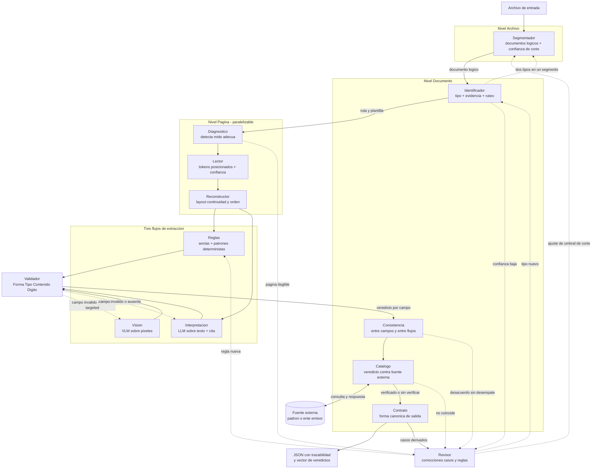
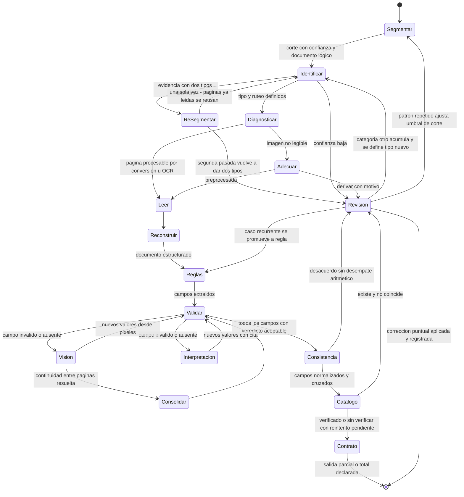

# Informe de Análisis — Sistema de Extracción de Documentos (`ibm-docling-ref`)

> **Fuentes analizadas:** `README.md` (565 líneas), `wip/a.md`, `wip/b.md`, `wip/c.md`, `wip/d.md`. El workspace no contiene código, ni configuración de proyecto, ni tests, ni set de datos. Todo lo afirmado abajo surge de esos cinco archivos; cuando algo no está definido, se indica explícitamente.

---

## 1. Resumen ejecutivo

El sistema extrae campos de comprobantes argentinos (CUIT, IVA, importes, fechas) y emite, por cada campo, un **vector de veredictos** con su traza de procedencia, en lugar de un score único. Resuelve la automatización de facturación, compliance y auditoría **solo cuando la confianza es suficiente para no requerir humano**, y su tesis central es que la confianza no viene de un método aislado sino de tres flujos en cascada (Reglas → Interpretación → Visión), validación interna (aritmética, dígito verificador), contraste entre flujos sobre campos críticos y consulta a fuentes externas. La arquitectura es inusualmente madura en **decisiones de política de error**: define invariantes, asimetrías de costo, barreras entre componentes y límites de bucle. Su estado de madurez es **diseño conceptual cerrado, especificación operativa abierta**: diez componentes con contrato conceptual, pero sin umbrales, sin catálogo de estados del veredicto, sin tipos de documento listados y con **seis categorías de reglas de negocio marcadas "⏳ Pendiente definir"**. Los `wip/*.md` no son especificaciones complementarias: son alternativas de implementación parciales que contradicen puntos explícitos del README (ver §3.5). No existe en ningún archivo un set dorado de evaluación ni una línea de código.

---

## 2. Análisis BA — Alcance funcional

### 2.1 Objetivo de negocio y propuesta de valor

| Aspecto | Contenido según el README |
|---|---|
| **Problema** | "Extraer información de documentos mixtos con suficiente confianza para automatizar procesos que lo requieren (facturación, compliance, auditoría)" (README, *Panorama*). Sin contraste el sistema "ve errores lógicos (2+2=5)"; sin consulta externa "no ve errores de identidad (CUIT válido pero empresa equivocada)". |
| **Propuesta de valor** | Autonomía verificable: decidir **por campo** si la evidencia alcanza, y derivar al humano solo lo que no alcanza. El umbral no lo fija el sistema: "el umbral lo pone el consumidor, que conoce su caso de uso" (*Contrato*, *Invariantes*). |
| **Diferencial declarado** | El contraste entre flujos "no es una optimización, es el único mecanismo que ve la clase de error más silenciosa": un valor válido en el lugar equivocado (*Comparativa de flujos*). |
| **Beneficio económico** | Acotar el costo del contraste a campos críticos en vez del documento entero, y acotar el escalamiento a la región del campo inválido ("reprocesa esos 2, no los 20"), con la advertencia explícita de que eso aplica **solo** al caso "campo inválido", no al "campo ausente". |

### 2.2 Alcance

**In-scope declarado**

- Documentos mixtos con capa de texto, escaneos y fotos; "un PDF de 20 páginas puede contener una factura, o tres" (*Niveles*).
- Segmentación de archivo en documentos lógicos, identificación de tipo, ruteo a extractor/plantilla.
- Extracción de campos por tres flujos, validación, consistencia, consulta externa, contrato de salida y bucle de revisión humana.
- Trazabilidad heterogénea por campo: `offset exacto` (Reglas), `cita + offset` (Interpretación), `bbox aproximado` (Visión).
- Fallo parcial: una página ilegible se marca y el resto del documento se emite.

**Out-of-scope (declarado o deducido por omisión)**

| Fuera de alcance | Evidencia |
|---|---|
| Entrenamiento o fine-tuning de modelos | El README trata los modelos como cajas externas ("un LLM sobre el texto", "un VLM lee directamente los píxeles"); no hay componente de entrenamiento. |
| Resolución del umbral de aceptación | Explícitamente delegado al consumidor. |
| Verificación de cumplimiento normativo | El README nombra "compliance" como caso de uso, pero no define normativa, jurisdicción ni reglas fiscales aplicables. |
| Persistencia, almacenamiento, retención y APIs | No se menciona base de datos, cola, API de entrada/salida ni formato de transporte. |
| Definición de reglas de negocio del dominio | Se declaran pendientes (6 categorías). |
| UI del Revisor | "Corrección humana" e "interfaz de revisión" se mencionan, pero sin especificación. |
| Evaluación comparativa de los tres flujos | El README compara cualitativamente (tabla *Comparativa de flujos*), pero **no define set dorado ni métricas**; `d.md` lo menciona de pasada ("hace comparables las arquitecturas sobre el mismo set dorado") sin definirlo. |

### 2.3 Actores y sistemas externos

| Actor / Sistema | Rol | Definido en README |
|---|---|---|
| **Operador humano / Revisor** | Corrige casos derivados; produce dato corregido, regla nueva o tipo nuevo. Es el motor de mejora. | Sí (*Revisor*): "Sin el Revisor, el sistema no mejora". Sin SLA ni capacidad definidos. |
| **Consumidor de la salida** | Define el umbral de aceptación sobre el vector de veredictos. | Sí (*Contrato*): "El umbral lo pone el consumidor". No se identifica quién es (¿sistema de facturación? ¿auditor?). |
| **Fuente externa de identidad** | Padrón de proveedores, servicio del ente emisor, registro de un identificador. | Sí (*Catálogo*). **No** se nombra una fuente concreta ni su contrato. |
| **Proveedor de LLM** | Ejecuta el flujo Interpretación sobre texto reconstruido. | Mencionado como "un LLM" sin proveedor, modelo ni presupuesto de contexto. |
| **Proveedor de VLM** | Ejecuta el flujo Visión sobre píxeles. | Mencionado como "un VLM" sin especificación. |
| **Motor OCR / conversor** | Camino de lectura según Diagnóstico. | Mencionado como "OCR" y "Conversión"; sin motor concreto. |
| **Servicio de corpus/documentos** | Entrega archivos al sistema. | **No especificado.** El README arranca en "Archivo". |

### 2.4 Requerimientos funcionales

| ID | Requerimiento (verificable) | Origen |
|---|---|---|
| **RF-01** | El sistema debe determinar, por página, si existe capa de texto **usable** y rutear a conversión u OCR en consecuencia. | *Diagnóstico*: "No alcanza con preguntar si hay texto"; "una capa con 40 caracteres en una A4 es basura". |
| **RF-02** | El Diagnóstico debe medir legibilidad (no solo resolución/DPI) y, si falla, reescalar/comprimir o derivar con motivo; **nunca** pasar al OCR una imagen ilegible. | *Diagnóstico*: "Legibilidad es distinto de resolución". |
| **RF-03** | El Segmentador debe agrupar páginas en documentos lógicos usando continuidad, numeración reiniciada y encabezado nuevo, y emitir **confianza por corte**. | *Segmentador*. |
| **RF-04** | El Segmentador debe **sobre-segmentar** ante corte dudoso (política asimétrica obligatoria). | *Segmentador*, *Invariantes*. |
| **RF-05** | El Segmentador debe esperar a que todas las páginas estén leídas antes de emitir (barrera). | *Barreras*. |
| **RF-06** | El Identificador debe determinar tipo de documento, variante de evidencia (texto / imagen / mixta) y ruteo a extractor, devolviendo la **evidencia** que disparó la decisión. | *Identificador*. |
| **RF-07** | El Identificador debe derivar a revisión ante confianza baja en vez de elegir el tipo más probable. | *Identificador*. |
| **RF-08** | El Identificador debe disponer de una categoría "otro" con ruta propia. | *Identificador*, *Revisor*. |
| **RF-09** | Ante evidencia de **dos tipos** en un mismo segmento, el Identificador debe devolver el corte y forzar re-segmentación, **una sola vez**. | *Identificador*, *Invariantes*. |
| **RF-10** | La re-segmentación debe reutilizar Diagnóstico y Lector ya ejecutados (no releer). | *Identificador*: "Re-segmentar no implica releer". |
| **RF-11** | La re-segmentación debe registrar el caso y alimentar el umbral de corte del Segmentador cuando el patrón se repite. | *Identificador*, *Revisor*. |
| **RF-12** | El Lector debe emitir **tokens con coordenadas**, sin orden de lectura resuelto. | *Lector*: "Entrega tokens con coordenadas, sin orden de lectura resuelto". |
| **RF-13** | La corrección post-OCR debe aplicarse **solo** en el camino OCR; la conversión no se corrige. | *Lector*: "Aplicarle un modelo de lenguaje 'por las dudas' solo puede introducir daño". |
| **RF-14** | El Lector debe rutear por página y unir ambos caminos en PDFs mixtos. | *Lector*. |
| **RF-15** | El Reconstructor debe operar sobre **varias páginas** y resolver: layout, continuidad entre páginas, tablas (encabezado + filas), encabezados repetidos y orden de lectura. | *Reconstructor*. |
| **RF-16** | En el flujo Visión el Reconstructor debe resolver únicamente la continuidad entre páginas. | *Reconstructor*: "el VLM absorbe el layout de cada página". |
| **RF-17** | El sistema debe ejecutar extracción por Reglas (anclas + patrones deterministas) sin costo de modelo. | *Flujo Reglas*. |
| **RF-18** | El sistema debe ejecutar extracción por Interpretación (LLM sobre texto reconstruido) verificando que la **cita** literal sostenga el valor. | *Flujo Interpretación*: paso "Verificar cita = valor". |
| **RF-19** | El sistema debe ejecutar extracción por Visión (VLM sobre píxeles), usada como recurso último. | *Cascada*, *Flujo Visión*. |
| **RF-20** | El Validador debe ejecutar cuatro chequeos **independientes** sobre el mismo campo — Forma, Tipo, Contenido, Dígito verificador — sin encadenamiento ni dependencia de orden. | *Validador*: "No están encadenados". |
| **RF-21** | El Validador debe combinar los veredictos aplicando la **falla más grave manda**. | *Validador*. |
| **RF-22** | El Validador debe gobernar el escalamiento, siendo el único lugar donde se define "no pudo". | *Validador*, *Cascada*. |
| **RF-23** | El sistema debe distinguir **campo inválido** (escalamiento targeted con región renderizada) de **campo ausente** (rel lectura del documento entero). | *Validador*, y sección siguiente. |
| **RF-24** | Consistencia debe comparar campos entre sí (aritmética y orden: subtotal + impuestos = total; emisión ≤ vencimiento). | *Consistencia*. |
| **RF-25** | Consistencia debe comparar el mismo campo entre dos flujos, **normalizando antes de comparar**. | *Consistencia*, *Invariantes*. |
| **RF-26** | La comparación entre flujos debe aplicar tolerancia por tipo de campo: centavos en importes, **exacta** en identificadores y fechas. | *Consistencia*. |
| **RF-27** | Cuando los flujos difieren, el nivel aritmético debe desempatar y resolver sin humano si uno de los valores cierra. | *Consistencia*: "El nivel aritmético desempata el nivel entre-flujos". |
| **RF-28** | El contraste entre flujos debe reservarse a **campos críticos** (importes, identificadores), no al documento entero. | *Consistencia*, *Contraste*. |
| **RF-29** | El Catálogo debe consultar campos de identidad contra fuente externa y emitir tres estados distinguibles: verificado, no coincide, **sin verificar**. | *Catálogo*. |
| **RF-30** | La indisponibilidad de la fuente externa **no** debe producir rechazo: el campo queda `sin_verificar` con cola de reintento y backoff propia. | *Catálogo*: "Sin reintento propio, el estado es un agujero". |
| **RF-31** | El Contrato debe esperar a que todas las páginas estén resueltas antes de emitir (barrera). | *Barreras*, *Contrato*. |
| **RF-32** | El Contrato debe unir campos provenientes de páginas distintas y adjuntar, **por campo**, flujo y traza (`offset` exacto o `bbox` aproximado según origen). | *Contrato*. |
| **RF-33** | El Contrato debe emitir el **vector de veredictos** por campo, sin colapsarlo en un score. | *Contrato*, *Invariantes*. |
| **RF-34** | El Contrato debe emitir salida parcial declarando explícitamente las páginas ilegibles. | *Contrato*, *Invariantes*. |
| **RF-35** | El Revisor debe registrar el par `original → corregido` y agrupar casuística para promover a regla nueva o tipo nuevo. | *Revisor*. |
| **RF-36** | El Revisor debe poder cerrar el bucle del Segmentador (ajuste de umbral) cuando el caso "dos tipos" se repite. | *Revisor*. |
| **RF-37** | Las reglas de negocio adicionales deben integrarse como chequeos paralelos que emiten veredicto propio, bajo el mismo principio de "falla más grave manda". | *Reglas de negocio pendientes*. |
| **RF-38** *(propuesta)* | El sistema debe validar los tres flujos contra un esquema único y medir su desempeño sobre un **set dorado** común. | No está en el README; surge de `d.md` ("hace comparables las arquitecturas sobre el mismo set dorado"). Se marca como propuesta. |

### 2.5 Requerimientos no funcionales

> El README **no contiene una sección de NFRs** ni cifras. Las metas numéricas de abajo son **propuestas** a validar en Fase 0.

| ID | RNF | Definición / origen | Meta propuesta |
|---|---|---|---|
| **RNF-01** | **Costo por documento** | Objetivo explícito de la cascada y del contraste por campo. | Pendiente: presupuesto por documento y por lote. |
| **RNF-02** | **Latencia p95** | Afectada por barreras (Segmentador y Contrato esperan al conjunto) y por reintentos del Catálogo. | Pendiente. |
| **RNF-03** | **Determinismo** | El flujo Reglas es determinista; Interpretación y Visión no lo son; el Catálogo "no es determinista" por dependencia de terceros. | Pendiente: qué se considera reproducible en una auditoría. |
| **RNF-04** | **Trazabilidad / auditoría** | Cada campo declara (página, flujo) y tipo de traza; la cita prueba procedencia, no acierto. | Pendiente: retención y formato de la evidencia. |
| **RNF-05** | **Privacidad de datos** | **El README no lo menciona.** Se procesan CUIT, razones sociales e importes con proveedores LLM/VLM y una fuente externa. | Pendiente: residencia de datos, on-premise vs. nube, retención. |
| **RNF-06** | **Escalabilidad por paralelización de página** | "Los de nivel página son paralelizables" (*Barreras*); Diagnóstico, Lector y Reconstructor son de nivel página. | Pendiente: grado de concurrencia y cuellos en barreras. |
| **RNF-07** | **Disponibilidad / resiliencia de terceros** | El Catálogo degrada a `sin_verificar` con reintento; "Confundir las dos cosas convierte una caída del servicio en una cola de rechazos". | Pendiente: reintentos, backoff, TTL. |
| **RNF-08** | **Observabilidad** | **El README no la menciona como requisito**, aunque la trazabilidad por campo y la métrica de F1 por tipo de error (`d.md`) son su base. | Pendiente: qué se instrumenta y dónde. |
| **RNF-09** | **Exactitud por campo** | El sistema entrega veredictos, no una precisión; no hay meta declarada. | Pendiente: F1 por campo sobre set dorado. |
| **RNF-10** | **Acotamiento del escalamiento** | Explícito: "si el escalamiento es mayoritariamente por campos ausentes, el ahorro no es de un orden de magnitud sino de ninguno." | Pendiente: tope de escalamientos por documento. |

### 2.6 Vacíos de especificación y ambigüedades que bloquean implementación

| # | Vacío | Dónde |
|---|---|---|
| V-01 | Las **6 categorías de reglas de negocio** están todas en "⏳ Pendiente definir": rangos, relaciones entre campos, condicionales, estructurales, específicas del dominio, cruces inter-documento. Sin ellas el Validador solo tiene 4 chequeos universales. | *Reglas de negocio pendientes* |
| V-02 | **Catálogo de valores del veredicto** no definido. El ejemplo JSON muestra `"ok"`, `null` y `"sin_verificar"`, pero no hay enumeración cerrada; `d.md` obliga a usar `Literal[...]` para enumeraciones, lo que exige fijarlas antes de implementar. | *Contrato*, `d.md` |
| V-03 | **Lista de campos críticos** para el contraste: el README dice "importes, identificadores" a modo de ejemplo, no como catálogo. | *Consistencia* |
| V-04 | **Umbrales** de confianza de corte (Segmentador) y de confianza del Identificador: no hay números ni escala. | *Segmentador*, *Identificador* |
| V-05 | **Semántica de "confianza"** del Lector OCR ("estimada", valor 1.0 en conversión): no se define cómo se estima. | *Lector* |
| V-06 | **Política de reintento del Catálogo**: número de intentos, backoff, TTL, y qué ocurre si nunca responde. | *Catálogo* |
| V-07 | **Cola de revisión**: prioridad, SLA, capacidad, quién revisa. | *Revisor* |
| V-08 | **Tipos de documento en alcance**: no hay lista (¿factura A/B/C, nota de crédito, recibo, ticket?). Sin tipos no hay plantillas ni ruteo. | Ausente |
| V-09 | **Formato de la evidencia** del Identificador ("qué palabras o formas dispararon la decisión"): no especificado. | *Identificador* |
| V-10 | **Promoción de "otro" a tipo nuevo**: cuándo y con qué criterio. | *Identificador*, *Revisor* |
| V-11 | **Interfaz de entrada/salida**: no se define cómo llega el archivo ni cómo se consume el JSON. | Ausente |
| V-12 | **Versionado**: de reglas, de esquema del Contrato y de extractores. Sin esto no hay auditoría reproducible a lo largo del tiempo. | Ausente |
| V-13 | **Idempotencia y deduplicación**: nada impide procesar dos veces el mismo archivo. | Ausente |
| V-14 | **Multi-moneda / idioma / jurisdicción**: el ejemplo usa una sola moneda y el README no acota el universo. | Ausente |
| V-15 | **Metadatos del archivo como fuente de corte**: el Segmentador usa señales intra-documento; no se dice si puede usar metadatos del PDF (marcadores, nombres). | *Segmentador* |
| V-16 | **Consistencia entre flujos**: se dice que se reserva a campos críticos, pero no **qué pasa** con un campo crítico para el que nunca corrió un segundo flujo (¿queda sin contraste? ¿baja confianza?). | *Consistencia* |
| V-17 | **Ambigüedad documental**: `README.md` abre con "Versión resumida. El detalle está en `README.md`", es decir, se declara versión resumida **de sí mismo** y remite a un detalle inexistente en el workspace. | `README.md`, línea 3 |
| V-18 | **Zona gris del Segmentador**: "la duda parte, el error vuelve" se presenta como cierre del solapamiento, pero no se define qué ocurre si **ninguno** de los dos mecanismos actúa (corte con confianza alta y tipo único, pero corte erróneo). | *Identificador* |

---

## 3. Análisis SA — Arquitectura

### 3.1 Diagrama del sistema completo



**Lectura del diagrama:** las tres barreras del README son visibles como aristas de agregación — Segmentador requiere todas las páginas leídas (el README declara la dependencia aunque el flujo de datos de página a Archivo no sea explícito, lo que es en sí una ambigüedad: el Lector es de nivel página pero depende del corte), Consistencia entre flujos requiere ambos flujos sobre el mismo campo, y Contrato requiere todas las páginas resueltas. Visión no pasa por Diagnóstico ni por Lector: recibe píxeles renderizados y lee y extrae en un paso.

### 3.2 Máquina de estados de decisión y escalamiento



### 3.3 Contratos entre componentes

| Componente | Recibe | Emite | Especificado en README | Faltante |
|---|---|---|---|---|
| **Segmentador** | Archivo completo (todas las páginas leídas) | Documentos lógicos + confianza por corte | Sí, conceptual | Escala y umbral de confianza; formato del corte; señales ponderadas |
| **Identificador** | Documento lógico (+ evidencia textual/visual) | Tipo + confianza + evidencia + ruteo (plantilla/extractor) | Sí | Formato de la evidencia; taxonomía de tipos; definición de "otro" |
| **Diagnóstico** | Página | Ruta (conversión / OCR / derivar) + advertencias + acciones de adecuación | Sí | Umbral de proporción de alfabéticos; criterio de legibilidad; formato de advertencias |
| **Lector** | Página + ruta del Diagnóstico | Tokens posicionados + confianza (+ corrección si OCR) | Sí | Estructura del token; semántica de la confianza estimada; modelo de corrección |
| **Reconstructor** | Varias páginas leídas | Documento estructurado (layout, tablas, encabezados, orden) | Sí, conceptual | Representación del documento estructurado; contrato de continuidad; forma de "cita" |
| **Validador** | Campo extraído (+ posición para escalamiento targeted) | Veredicto por chequeo (Forma, Tipo, Contenido, Dígito) + decisión combinada + acción de escalamiento | Sí (parcial) | Enumeración de veredictos; reglas de Contenido; catálogo de reglas por tipo |
| **Consistencia** | Campos validados de uno o dos flujos | Veredicto de consistencia entre campos y entre flujos; refuerzo o desacuerdo | Sí | Lista de campos críticos; forma canónica de normalización; tabla de tolerancias completa |
| **Catálogo** | Campo de identidad | verificado / no coincide / sin verificar + evidencia de la consulta | Sí | Contrato de la fuente externa; política de reintento; timeout |
| **Contrato** | Documentos validados + trazas + veredictos + páginas ilegibles | JSON con valor, flujo, traza y vector de veredictos por campo | Sí, con ejemplo JSON | Catálogo de estados; versión del esquema; semántica de `null` (no aplica vs. no evaluado) |
| **Revisor** | Casos derivados de Identificador, Diagnóstico, Validador, Consistencia y Catálogo | Dato corregido / regla nueva / tipo nuevo + registro `original → corregido` | Sí, conceptual | Modelo del caso de revisión; criterio de promoción; versionado y no regresión |

### 3.4 Decisiones arquitectónicas clave (ADR resumido)

**ADR-01 — Tokens posicionados en lugar de texto ordenado**
- **Contexto:** si el Lector entregara texto ya ordenado, absorbería parte del Reconstructor.
- **Decisión:** el Lector emite tokens con coordenadas, **sin** orden de lectura resuelto (*Lector*).
- **Consecuencia:** el Reconstructor tiene razón de existir y ambos flujos de texto lo necesitan por igual; el costo es que el orden y el layout se resuelven aguas abajo, sobre múltiples páginas.
- **Alternativa descartada:** serialización lineal a texto plano (es exactamente lo que propone `wip/a.md`).

**ADR-02 — Vector de veredictos en lugar de score**
- **Contexto:** un campo acumula señales de cinco fuentes (confianza de corte, confianza del Lector, 4 veredictos del Validador, refuerzo/desacuerdo de Consistencia, verificado/sin-verificar del Catálogo).
- **Decisión:** emitir los veredictos **separados**; el umbral lo pone el consumidor (*Contrato*, *Invariantes*).
- **Consecuencia:** el consumidor debe implementar su propia política; no hay un "apto/no apto" universal.
- **Alternativa descartada:** score único agregado, que "repite el error que el Catálogo prohíbe": mezclar caída del servicio con verificación fallida.

**ADR-03 — Sobre-segmentar ante duda**
- **Contexto:** el Segmentador es "el único componente sin escape" y su error es irrecuperable aguas abajo.
- **Decisión:** ante corte dudoso, partir de más (*Segmentador*, *Invariantes*).
- **Consecuencia:** se acepta ruido (documentos fragmentados) para evitar corrupción silenciosa; el Contrato debe tolerar campos faltantes legítimos.
- **Alternativa descartada:** unir ante duda, cuyo error "no se detecta después".

**ADR-04 — Un solo bucle de re-segmentación**
- **Contexto:** la relación Segmentador↔Identificador es circular.
- **Decisión:** una única re-segmentación; la segunda pasada es final y deriva a revisión (*Identificador*, *Invariantes*).
- **Consecuencia:** se acota el riesgo de bucle; el caso irresoluble se resuelve con humano.
- **Alternativa descartada:** bucle sin tope.

**ADR-05 — Contraste reservado a campos críticos**
- **Contexto:** "correr dos flujos sobre todo es caro".
- **Decisión:** contrastar solo importes e identificadores (*Consistencia*).
- **Consecuencia:** los campos no críticos no tienen señal de contraste, y su única defensa es la validación interna; el ahorro depende de que esa lista sea corta. Además implica que el escalamiento de un campo crítico nunca puede "ahorrar" si el campo está **ausente**.
- **Alternativa descartada:** contraste sobre el documento completo.

**ADR-06 — "Sin verificar" ≠ "inválido"**
- **Contexto:** el Catálogo depende de un tercero no determinista.
- **Decisión:** la falla por indisponibilidad produce `sin_verificar`, con dueño (el propio Catálogo) y cola de reintento con backoff (*Catálogo*, *Invariantes*).
- **Consecuencia:** el estado es visible como campo pendiente, no como ausencia; exige política de reintento y TTL.
- **Alternativa descartada:** tratar la caída como rechazo, que "convierte una caída del servicio en una cola de rechazos".

**ADR-07 — Centralizar el "no pudo" en el Validador**
- **Contexto:** la política de escalamiento estaba dispersa en Identificador, Diagnóstico y Validador "sin que ninguno supiera de los otros".
- **Decisión:** el Validador gobierna la cascada y define "no pudo" en un solo lugar, con cuatro chequeos independientes y regla de falla más grave (*Validador*, *Cascada*).
- **Consecuencia:** un único punto de cambio; el Validador se vuelve el componente más crítico y más costoso de especificar (de ahí las 6 categorías pendientes).
- **Alternativa descartada:** política distribuida por componente.

**ADR-08 — Auditar no es normalizar**
- **Contexto:** la coerción de tipos de Pydantic ocurre antes de poder observar qué devolvió el modelo.
- **Decisión:** dos pasos y dos modelos: observación sin tipos de negocio y **sin defaults** (`str | None`, `extra="forbid"`), y normalización aparte (`d.md`, *Invariantes*).
- **Consecuencia:** se distingue campo ausente / `null` explícito / valor presente vía `model_fields_set`; `errors()` devuelve el valor crudo en `input`, que alimenta la métrica de F1 por tipo de error.
- **Alternativa descartada:** un único modelo con `Decimal = 0`, que "fabrica datos" sin error ni aviso. Restricción asociada: nunca `strict=True` en el modelo completo contra un LLM.

**ADR-09 — Visión no usa Diagnóstico ni Lector**
- **Contexto:** el VLM lee y extrae en un paso desde píxeles.
- **Decisión:** Visión salta Diagnóstico y Lector; el Reconstructor interviene solo para continuidad entre páginas (*Componentes por nivel*, *Reconstructor*).
- **Consecuencia:** se pierde el control de legibilidad previo (no hay derivación por ilegibilidad en Visión) y la trazabilidad es `bbox aproximado`, no offset. El flujo no tiene señal de calidad de entrada.
- **Alternativa descartada:** enrutar Visión por el mismo Diagnóstico, innecesario porque el VLM no necesita legibilidad medida por OCR.

**ADR-10 — Fallo parcial**
- **Contexto:** una página ilegible no debe invalidar el documento.
- **Decisión:** marcar la página y emitir el resto con la ausencia declarada (*Contrato*, *Invariantes*).
- **Consecuencia:** el consumidor debe saber interpretar ausencias parciales; si no, las trata como campos ausentes del negocio.
- **Alternativa descartada:** descartar el documento entero.

### 3.5 Modelo de datos propuesto

**Entidades y campos mínimos.** Se marca con ✅ lo que el README sugiere y con ➕ lo que falta.

**`Archivo`**
| Campo | Origen |
|---|---|
| `id`, `hash`, `nombre`, `tamano`, `mime`, `fecha_ingreso` | ➕ |
| `paginas[]`, `documentos[]` | ✅ implícito en *Niveles* |
| `version_esquema`, `version_pipeline` | ➕ (V-12; sin esto no hay auditoría reproducible) |

**`Documento`**
| Campo | Origen |
|---|---|
| `id`, `archivo_id`, `paginas[]` | ✅ (rango de páginas, p. ej. "págs 1-7") |
| `confianza_corte` | ✅ (*Segmentador*) |
| `tipo`, `evidencia_tipo` | ✅ (*Identificador*) — **forma de la evidencia no definida** |
| `ruta_extractor` | ✅ ("plantilla · extractor") |
| `re_segmentado` (bool), `intento` (1/2) | ✅ derivado de "una sola re-segmentación" |
| `advertencias_entrada` | ✅ (*Diagnóstico*: "ruta y advertencias de entrada") |

**`Pagina`**
| Campo | Origen |
|---|---|
| `numero`, `documento_id` | ✅ |
| `ruta` (conversión / OCR / render para VLM) | ✅ (*Diagnóstico*) |
| `legible` (bool), `motivo_derivacion` | ✅ |
| `acciones_adecuacion[]` (reescalar, comprimir) | ✅ |
| `calidad_medida` (proporción de alfabéticos, DPI, peso) | ✅ mencionada, **sin escala** |
| `estado_escalamiento` | ➕ (para no releer al re-segmentar) |

**`Campo extraído`**
| Campo | Origen |
|---|---|
| `nombre` (total, cuit, fecha_emision, …) | ✅ |
| `valor` | ✅ |
| `flujo` (`reglas` / `interpretacion` / `vision`) | ✅ |
| `traza.pagina` | ✅ |
| `traza.offset [inicio, fin]` | ✅, cuando el flujo es Reglas o Interpretación |
| `traza.bbox` | ✅ implícito ("bbox aproximado" en Visión) |
| `traza.cita` | ✅ ("Cita + offset" en Interpretación) |
| `traza.regla_id` | ➕ (`a.md` §6 guarda qué regex/regla capturó; el README no lo exige) |
| `confianza_lector` | ✅ ("confianza del Lector") |
| `moneda`, `unidad` | ➕ |
| `es_critico` | ➕ (necesario para RF-28) |
| `valor_normalizado` | ➕ |
| `version_extractor` | ➕ |

**`Veredicto`** (uno por chequeo, no agregado)
| Campo | Origen |
|---|---|
| `campo_id`, `chequeo` (`forma`/`tipo`/`contenido`/`digito`/`consistencia`/`catalogo`/regla nueva) | ✅ (el JSON del Contrato lista exactamente estas seis claves) |
| `estado` | ✅ parcialmente: el ejemplo muestra `"ok"`, `"sin_verificar"` y `null`. **Enumeración completa no definida** (`d.md` exige `Literal[...]`) |
| `detalle` / `motivo` | ➕ |
| `gravedad` (para "la falla más grave manda") | ➕ |
| `valor_contrastado` (el otro valor del desacuerdo) | ➕ |

**`Evidencia` / `Traza`**
| Campo | Origen |
|---|---|
| `pagina`, `flujo`, `offset` o `bbox`, `cita`, `regla_id` | ✅ / ➕ |
| `mapa_activacion` (Grad-CAM) | ➕ — propuesto **solo** en `b.md`, no en el README |
| `reintentos_catalogo`, `ultimo_intento`, `respuesta_cruda` | ➕ (`Catálogo`: la cola "tiene dueño") |

**`Caso de revisión`**
| Campo | Origen |
|---|---|
| `id`, `campo_id` o `documento_id` | ➕ |
| `origen_derivacion` (Identificador, Diagnóstico, Validador, Consistencia, Catálogo, "otro") | ✅ (el Revisor "recibe lo que derivaron los demás") |
| `valor_original`, `valor_corregido` | ✅ ("par original → corregido") |
| `estado`, `revisor_id`, `timestamps` | ➕ |
| `casuistica` (agrupación) | ✅ mencionada, sin criterio de agrupamiento |

**`Regla`**
| Campo | Origen |
|---|---|
| `id`, `tipo_documento`, `campos`, `regla`, `como_falla`, `que_escala` | ✅ (`Reglas de negocio pendientes` fija exactamente ese formato) |
| `veredicto_que_emite`, `gravedad` | ✅ implícito ("sigue el mismo modelo que los 4 chequeos") |
| `version`, `vigente_desde`, `origen_caso_id` | ➕ |

**Lo que falta de forma transversal:** versionado de esquema y de reglas, idempotencia por hash, retención, y la entidad `Umbral`/`Configuracion` que hoy es un supuesto implícito (V-04).

### 3.6 Relación entre `README.md` y `wip/a.md`, `b.md`, `c.md`, `d.md`

**Diagnóstico:** los `wip` **no son documentos contradictorios entre sí en su núcleo**, pero tampoco son especificaciones complementarias del README: son **tres alternativas de implementación de un solo flujo cada una**, escritas con una granularidad distinta (hablan de OCR, CNN, LayoutLM, coordenadas fijas) y con decisiones que **el README prohíbe explícitamente**. `d.md` es el único que se lee como anexo técnico del README, y el propio README lo reconoce: el invariante 12 es literalmente "Auditar no es normalizar. Ver `d.md`."

| Punto | README | `wip` | Veredicto |
|---|---|---|---|
| **Naturaleza de la lectura** | El Lector "devuelve tokens, no texto… sin orden de lectura resuelto — así el Reconstructor tiene razón de existir" (*Lector*). | `a.md` §1: "destruir la naturaleza bidimensional… convertirla en un flujo unidimensional de texto"; "ordena las palabras de izquierda a derecha y de arriba a abajo. Al finalizar cada fila física… inyecta un salto de línea estricto". | **Contradicción directa.** `a.md` absorbe el Reconstructor dentro del paso 1 y anula ADR-01. El README llama a eso exactamente el caso que haría innecesario un componente. |
| **Cantidad de flujos** | Tres flujos en cascada, con contraste entre al menos dos sobre campos críticos. | `a.md`, `b.md` y `c.md` describen **un** pipeline cada uno, sin cascada, sin escalamiento gobernado, sin contraste (salvo `c.md`, que fusiona en lugar de contrastar). | Los `wip` implementan **fragmentos** de la arquitectura del README, no la arquitectura. |
| **Trazabilidad** | Offset exacto (Reglas), cita + offset (Interpretación), bbox aproximado (Visión); la traza declara página y flujo (*Invariantes*). | `a.md` §6: `Start_Index`/`End_Index` **"dentro de la cadena de texto original normalizada"**. | **Riesgo de trazabilidad.** La normalización de `a.md` §2 (quitar acentos, colapsar espacios, borrar caracteres) **cambia los offsets**; auditar contra esa cadena no permite volver al texto impreso. El README exige traza a nivel página. Además `a.md` nunca declara el flujo en la traza. |
| **Validación** | Validador con 4 chequeos independientes + Consistencia con desempate aritmético; "rechazar" queda reservado para el dígito verificador (*Validador*). | `a.md` §5: "Si la matemática no cierra, **el registro se rechaza**." | **Contradicción de política.** Rechazar por aritmética elimina el caso que el README protege: el desempate aritmético entre flujos (RF-27) y la derivación a revisión en vez de rechazo. Además `a.md` no distingue campo inválido de ausente (RF-23). |
| **Rol del LLM/NER** | `a.md` describe NLP/NER sobre texto | `a.md` §4 incluye "NER basado en texto… modelo basado en BERT" dentro de las reglas | **Mezcla de flujos.** Un NER no determinista pertenece a *Interpretación* en la taxonomía del README, no a *Reglas*, cuyo atributo definitorio es "Inventa valores: No". Etiquetar como Reglas un paso que puede inventar rompe la comparativa de flujos. |
| **Componentes ausentes** | 10 componentes, 3 niveles, 3 barreras, Catálogo con cola de reintento, Contrato con vector de veredictos, Revisor. | Ninguno de los tres `wip` menciona: Segmentador (nivel archivo), Catálogo (fuente externa), Contrato (vector de veredictos), Revisor, barreras, ni la distinción inválido/ausente. | `a.md` y `c.md` sí tienen una noción de "validación" y "trazabilidad", pero **no** de confianza por campo ni de umbral del consumidor. |
| **Umbral de decisión** | "El umbral lo pone el consumidor"; vector de veredictos, no score (*Invariantes*). | `b.md` §5: "score de presencia mayor al 90%"; `c.md` §5: "score de confianza combinado… (ej. < 85%)". | **Contradicción explícita.** Ambos proponen exactamente el "número mágico único" que el Contrato rechaza. |
| **Contraste vs. fusión** | El contraste entre flujos **independientes** es "el único mecanismo que ve la clase de error más silenciosa". | `c.md` encabezado: "no procesa el texto y la imagen por separado como islas independientes"; §3 fusiona en un "súper-vector" (LayoutLM / Graph NN). | **Divergencia arquitectónica de fondo, no de implementación.** Un modelo fusionado único no tiene dos lecturas independientes: si se equivoca, se equivoca de forma correlacionada y no hay desacuerdo que detectar. Es óptimo para precisión media y ciego al error que el README prioriza. |
| **Reconstructor** | Componente explícito de nivel multi-página con continuidad, tablas, encabezados y orden. | `c.md` §4 lo reemplaza por "Estructuración de Tablas por Contexto" dentro del modelo. `b.md` lo elimina (no hay texto). | Compatible en concepto con `c.md` (la fusión absorbe layout) pero **incompatible con la invariante** de que la continuidad entre páginas sigue haciendo falta por separado. |
| **Firmas, sellos, checkboxes, logos** | Solo se menciona en el flujo Visión ("Ve firmas, sellos: Sí") y en la comparativa; **ningún componente produce un campo de firma**. | `b.md` §3-§5 crea ZONA_FIRMA, ZONA_SELLO, ZONA_LOGOTIPO, estado de checkbox y "validación de presencia" con score. | **Alcance nuevo no cubierto por el README.** Es el único aporte sustantivo de `b.md` a la arquitectura: introduce una clase de campo (presencia/sello/firma) que en el README caería en "Validaciones estructurales" o "Reglas condicionales" — es decir, en las categorías ⏳ pendientes. |
| **Normalización geométrica** | Solo "adecuar: reescalar · comprimir" en Diagnóstico (*Diagnóstico*). | `b.md` §1: warp de perspectiva, matriz fija **1024x1024**, CLAHE. `c.md` §1: warp y lienzo fijo **1000x1000**. | **Inconsistencia entre wip** (1024 vs. 1000) y **detalle ausente** en el README, que no define preprocesamiento. |
| **Stack** | No se decide. | `a.md` y `c.md` terminan preguntando lenguaje o nube vs. open source; `b.md` pregunta por GPU; `d.md` asume Python (Pydantic, Logfire, OpenAI Structured Outputs). | `d.md` es el único que implica un stack, y lo hace de forma lateral. **Ningún documento toma la decisión.** |

**Recomendación técnica (propuesta):** conservar `README.md` como la especificación normativa y relegar `a.md`, `b.md` y `c.md` a **notas de evaluación de tecnología**, renombrándolos para que no compitan con el README (p. ej. `tecnologias/texto-lineal.md`, `tecnologias/vision-clasica.md`, `tecnologias/fusion-multimodal.md`). Tres correcciones concretas antes de usarlos: (1) en `a.md`, mover el NER a Interpretación y preservar offsets sobre el texto **sin normalizar**, normalizando solo para comparar y guardando el mapeo inverso; (2) en `b.md` y `c.md`, reemplazar los umbrales numéricos por veredictos; (3) en `c.md`, explicitar que la fusión es **un** flujo y que el contraste requiere un segundo lector independiente. `d.md` debería promoverse a anexo del README (`docs/validacion.md`) y citarse desde la sección *Contrato*.

---

## 4. Análisis PM — Planificación

### 4.1 Épicas

| Épica | Nombre | Historias | Talla | Justificación (una línea) |
|---|---|---|---|---|
| **E1** | Núcleo de confianza y contrato de salida | HU-01, HU-02, HU-06 | **L** | Define el modelo de veredictos del que dependen todos los demás; un error aquí es estructural. |
| **E2** | Segmentación e identificación | HU-03, HU-04, HU-05 | **XL** | Es el único punto sin escape y con bucle acotado; concentra las decisiones irreversibles. |
| **E3** | Lectura y reconstrucción multi-página | HU-07, HU-08 | **L** | Contiene las dos barreras y el preprocesamiento de calidad de entrada. |
| **E4** | Validación y reglas de negocio | HU-09, HU-12 | **XL** | Depende de las 6 categorías pendientes: sin negocio definido no se puede cerrar. |
| **E5** | Consistencia y contraste entre flujos | HU-10 | **L** | Es el mecanismo diferenciador y el más caro de evaluar; requiere set dorado. |
| **E6** | Integración con fuente externa | HU-11 | **M** | Alcance acotado a un contrato de tercero y una cola de reintento, pero no determinista. |
| **E7** | Bucle de mejora (Revisor) | HU-13 | **M** | Alto valor, bajo riesgo técnico; su ausencia degrada el sistema lentamente, no lo rompe. |

### 4.2 Historias de usuario

**HU-01 (E1, Must)** — Como **Solution Architect**, quiero que cada campo se emita con su vector de veredictos y su traza de procedencia, para que el consumidor decida con su propio umbral sin perder información.
```gherkin
Dado un documento procesado donde el campo "total" fue extraído por Reglas
Cuando el Contrato emite la salida
Entonces el campo incluye valor, flujo, traza con página y offset, y veredictos separados para forma, tipo, contenido, digito, consistencia y catalogo
Y no existe ningún campo numérico agregado que resuma esos veredictos
```

**HU-02 (E1, Must)** — Como **Auditor**, quiero que la salida distinga "sin verificar" de "inválido", para que una caída de un servicio externo no se lea como rechazo.
```gherkin
Dada una fuente externa de identidad que no responde
Cuando el Catálogo intenta verificar el CUIT
Entonces el campo se emite con catalogo = sin_verificar
Y no se emite rechazo por ese motivo
Y el caso queda en la cola de reintento del Catálogo con su próximo intento registrado
```

**HU-03 (E2, Must)** — Como **Business Analyst**, quiero que ante un corte dudoso el Segmentador separe documentos, para que un error de unión no contamine campos entre comprobantes.
```gherkin
Dado un PDF de 20 páginas con un corte de confianza dudosa entre las páginas 7 y 8
Cuando el Segmentador emite los documentos lógicos
Entonces produce dos documentos en lugar de uno
Y registra la confianza del corte dudoso para ajuste de umbral
Y el Contrato puede reportar campos faltantes en ambos sin mezclarlos
```

**HU-04 (E2, Must)** — Como **Business Analyst**, quiero que la re-segmentación ocurra como máximo una vez, para que el sistema no entre en un bucle.
```gherkin
Dado un segmento donde el Identificador detecta evidencia de dos tipos distintos
Cuando el sistema re-segmenta
Entonces la nueva segmentación es la definitiva
Y si la segunda pasada vuelve a detectar dos tipos, el caso se deriva a revisión humana sin tercer intento
Y las páginas ya leídas se reutilizan sin volver a ejecutar Diagnóstico ni Lector
```

**HU-05 (E2, Should)** — Como **Operador**, quiero que exista una categoría "otro" con ruta propia, para que los tipos no soportados no se fuercen al tipo más parecido.
```gherkin
Dado un documento cuyo tipo no coincide con ningún tipo conocido
Cuando el Identificador evalúa la evidencia
Entonces asigna la categoría "otro" y la deriva a revisión
Y registra la evidencia observada para promover un tipo nuevo si el patrón se repite
```

**HU-06 (E1, Must)** — Como **Operator de procesos**, quiero que una página ilegible no descarte el documento completo, para no perder los campos que sí se pudieron leer.
```gherkin
Dada una factura de 5 páginas donde la página 3 es ilegible
Cuando el Contrato emite la salida del documento
Entonces la página 3 se marca explícitamente como no resuelta
Y los campos de las páginas 1, 2, 4 y 5 se emiten con su traza y veredictos completos
```

**HU-07 (E3, Must)** — Como **SA**, quiero que el Lector entregue tokens con coordenadas y no texto ordenado, para que la continuidad entre páginas se resuelva en un componente propio.
```gherkin
Dada una página con capa de texto usable
Cuando el Lector procesa la página
Entonces emite tokens con coordenadas y confianza
Y no resuelve orden de lectura ni continuidad entre páginas
```

**HU-08 (E3, Should)** — Como **responsable de calidad de datos**, quiero que una imagen no legible nunca pase al OCR sin control, para que el sistema no devuelva texto inventado indistinguible de una lectura real.
```gherkin
Dada una página escaneada con DPI suficiente pero desenfocada
Cuando el Diagnóstico mide su legibilidad
Entonces la marca como no usable y ejecuta una de las dos salidas válidas: preprocesar o derivar con motivo
Y en ningún caso la envía al OCR sin adecuación
```

**HU-09 (E4, Must)** — Como **Business Analyst**, quiero que las reglas de negocio pendientes se ejecuten como chequeos paralelos con veredicto propio, para poder agregarlas sin tocar el Validador.
```gherkin
Dada una regla de negocio nueva registrada como tipo de documento, campos, regla, cómo falla y qué escala
Cuando el Validador evalúa un campo alcanzado por esa regla
Entonces la regla emite su propio veredicto independiente de los cuatro chequeos universales
Y la decisión final se resuelve por la falla más grave
```

**HU-10 (E5, Must)** — Como **SA**, quiero que el contraste entre flujos se active solo en campos críticos y con tolerancia por tipo, para detectar el error silencioso sin multiplicar el costo.
```gherkin
Dado un campo "total" presente en dos flujos con valores 1540 y 15400
Cuando Consistencia compara ambos valores normalizados
Entonces marca el desacuerdo y consulta si alguno cierra con subtotal + impuestos del documento
Y si uno cierra, resuelve sin intervención humana; si ninguno cierra, deriva a revisión
Y para un campo identificador la comparación es exacta, sin tolerancia
```

**HU-11 (E6, Should)** — Como **responsable de operaciones**, quiero que el Catálogo reintente con backoff y no bloquee la emisión, para que la indisponibilidad de un tercero no detenga el lote.
```gherkin
Dada una fuente externa con latencia por encima del umbral o caída
Cuando el Catálogo no obtiene respuesta
Entonces el documento se emite igual con el campo marcado como sin_verificar
Y el caso permanece en la cola de reintento con backoff hasta obtener respuesta o agotar los intentos
Y al agotarse, el estado del campo sigue siendo pendiente y no ausente
```

**HU-12 (E4, Should)** — Como **Auditor**, quiero que la procedencia del valor se registre en el formato crudo devuelto por el modelo, para poder explicar por qué se extrajo mal.
```gherkin
Dado un campo que el modelo devolvió como "N/A" o con formato "15.400,00"
Cuando el sistema audita el resultado
Entonces se conserva el valor crudo tal como salió del modelo, sin coerción ni default
Y el diagnóstico distingue campo ausente, null explícito y valor presente
```

**HU-13 (E7, Must)** — Como **Product Owner**, quiero que cada corrección humana se registre y se agrupe para promoverla a regla o tipo nuevo, para que el mismo error no vuelva en el próximo lote.
```gherkin
Dado un caso derivado a revisión y corregido por un operador
Cuando el Revisor registra el par original → corregido
Entonces el caso queda agrupado por casuística
Y si el patrón se repite alcanzando el criterio definido, se genera una regla nueva o un tipo nuevo y se notifica al responsable
```

**HU-14 (E5, Could)** — Como **SA**, quiero comparar los tres flujos sobre un set dorado común con un esquema único, para elegir la configuración por caso de uso con evidencia y no por opinión.
```gherkin
Dado un set dorado de documentos con campo esperado por cada campo crítico
Cuando se ejecutan los tres flujos sobre el mismo conjunto
Entonces se reporta F1 por campo y por flujo
Y la comparación usa el mismo esquema de validación para los tres
```

**Priorización MoSCoW:** Must = HU-01, HU-02, HU-03, HU-04, HU-06, HU-07, HU-09, HU-10, HU-13. Should = HU-05, HU-08, HU-11, HU-12. Could = HU-14. Won't (por ahora) = entrenamiento de modelos propios, mapa de calor Grad-CAM (propuesto solo en `b.md`), interfaz web de auditoría.

### 4.3 Roadmap por fases

| Fase | Objetivo | Entregable | Criterio de salida |
|---|---|---|---|
| **Fase 0 — Cierre de definición** | Resolver lo que hoy bloquea implementar: las **6 categorías de "Reglas de negocio pendientes"** (rangos, relaciones entre campos, condicionales, estructurales, específicas, cruces inter-documento) y definir el **set dorado de evaluación**, los tipos de documento en alcance y el catálogo de estados del veredicto. | `reglas-negocio.md` (formato Tipo → Campos → Reglas → Cómo falla → Qué escala, como pide el README); set dorado anotado; catálogo cerrado de valores de veredicto; lista de campos críticos; SLOs propuestos (RNF-01/02/06). | Las 6 categorías salen de "⏳ Pendiente definir" a "definida con al menos 1 regla de ejemplo verificable"; existe un set dorado con campo esperado por campo crítico; la enumeración del veredicto es cerrada (`Literal[...]`). |
| **Fase 1 — Núcleo determinista** | Construir el camino que no depende de modelos: Diagnóstico, Lector por conversión, Reconstructor, Validador con los 4 chequeos, Contrato y traza. | Pipeline Reglas end-to-end sobre PDFs con capa de texto; esquema Pydantic de observación vs. normalización (`d.md`); emisión del vector de veredictos. | Cada campo emitido tiene traza con página y offset; ningún campo tiene default; se distinguen ausente / null / presente; el set dorado corre de punta a punta sin intervención. |
| **Fase 2 — Segmentación, identidad y calidad de entrada** | Incorporar Segmentador con confianza de corte, Identificador con evidencia y ruteo, bucle único de re-segmentación, OCR y adecuación de imagen. | Soporte de archivos multi-documento y de PDFs escaneados/mixtos; categoría "otro" operativa. | Un PDF con tres facturas se separa correctamente; el caso "dos tipos" re-segmenta una sola vez y escala a revisión si se repite; ninguna imagen no legible llega al OCR sin adecuación. |
| **Fase 3 — Confianza externa y contraste** | Incorporar Interpretación y Visión como flujos de escalamiento, Catálogo contra fuente externa con cola de reintento, y Consistencia con contraste por campo crítico y desempate aritmético. | Cascada completa gobernada por el Validador; escalamiento targeted por campo inválido; estado `sin_verificar` con dueño. | La cascada solo escala cuando el Validador dice "no pudo"; un desacuerdo entre flujos con desempate aritmético se resuelve sin humano; una caída de la fuente externa no produce ningún rechazo. |
| **Fase 4 — Mejora continua** | Cerrar el bucle con el Revisor: registro `original → corregido`, agrupación de casuística, promoción a regla o tipo nuevo, y ajuste del umbral de corte. | Consola de revisión mínima; repositorio versionado de reglas; tablero de métricas. | Los casos recurrentes dejan de llegar a revisión tras la promoción a regla; el umbral de corte del Segmentador cambia por evidencia registrada, no por decisión ad hoc; se mide auto-resolución y costo por documento por lote. |

### 4.4 Estimación relativa

| Épica | Talla | Justificación (una línea) |
|---|---|---|
| E2 — Segmentación e identificación | **XL** | Es el punto sin escape, con bucle acotado y tres límites que hay que implementar junto con el registro de evidencia para el ajuste de umbral. |
| E4 — Validación y reglas | **XL** | Depende de negocio no definido y debe admitir reglas nuevas en paralelo sin tocar el Validador. |
| E1 — Núcleo y contrato de salida | **L** | Es la decisión que atraviesa todo el sistema y no admite revisión posterior sin romper consumidores. |
| E3 — Lectura y reconstrucción | **L** | Dos barreras, dos caminos de lectura y continuidad entre páginas con tablas abiertas. |
| E5 — Consistencia y contraste | **L** | Exige normalización canónica, tabla de tolerancias y desempate aritmético, y su validación depende del set dorado. |
| E6 — Fuente externa | **M** | Contrato acotado y una cola de reintento, pero con un tercero no determinista. |
| E7 — Revisor | **M** | Valor alto y riesgo técnico bajo; su complejidad está en el criterio de promoción y el versionado de reglas. |

### 4.5 Matriz de riesgos

| Riesgo | Prob. | Impacto | Mitigación | Contenido por |
|---|---|---|---|---|
| **Error silencioso de segmentación (unir de más)** | Media | **Crítico** | Política de sobre-segmentar; registro de casos "dos tipos" para ajuste de umbral; agregar una métrica de campos faltantes por documento como señal indirecta. | Segmentador + Identificador (bucle único) + Revisor |
| **Alucinación del modelo** | Alta | Alto | El modelo nunca reemplaza al Validador; verificación de cita = valor por separado; dígito verificador como chequeo sin falsos positivos; `extra="forbid"` y sin defaults para ver el valor crudo. | Validador + Interpretación/`d.md` |
| **Deriva de costos por escalamiento no acotado** | Alta | Alto | Escalamiento targeted solo para campo inválido; el caso "ausente" se mide aparte y se declara sin ahorro; contraste solo en campos críticos; presupuesto por documento en Fase 0. | Validador (gobierno) + Consistencia |
| **Indisponibilidad de la fuente externa** | Alta | Medio | `sin_verificar` con dueño, cola de reintento con backoff, emisión no bloqueante; distinción explícita de inválido. | Catálogo |
| **Sobreajuste de reglas Regex a un cliente** | Alta | Medio | Separar las reglas por tipo de documento en archivo versionado; set dorado multi-cliente; interpretación y visión como salida ante la duda; prohibir que una regla específica actúe como universal. | Reglas + Identificador (ruteo por tipo) |
| **Ausencia de set dorado** | **Alta** | **Crítico** | Fase 0 como condición de entrada del resto; esquema único de validación para los tres flujos (`d.md`); métrica de F1 por tipo de error alimentada por `errors()`. | Proc. de evaluación + Contrato |
| **Confundir "sin verificar" con "inválido"** | Media | Alto | Estado con dueño y cola propia; el fallo del tercero nunca produce rechazo; el vector de veredictos impide el colapso en un score. | Catálogo + Contrato |
| **Re-segmentación en bucle o relecura innecesaria** | Baja | Medio | Un solo bucle; reutilización obligatoria de Diagnóstico y Lector; segunda pasada definitiva. | Identificador |
| **Degradación de la calidad de OCR no detectada** | Media | Alto | Diagnóstico mide legibilidad además de presencia; una capa con proporción ínfima no va a conversión; nunca enviar imagen no legible al OCR sin adecuación. | Diagnóstico + Lector |
| **El Revisor no se implementa y la mejora se estanca** | Alta | Alto | HU-13 como Must; registro del par original → corregido como requisito de la Fase 4 y métrica de reglas promovidas. | Revisor |
| **Pérdida del valor crudo antes de auditar** | Media | Medio | Dos modelos separados (observación sin tipos ni defaults, normalización aparte); nunca `strict=True` contra LLM; nunca `model_construct()`. | `d.md` + Contrato |
| **Ambigüedad de alcance (tipos de documento y reglas)** | Alta | Alto | Fase 0 obligatoria; categoría "otro" como válvula; reglas por tipo de documento. | Identificador + Reglas |

### 4.6 Métricas de éxito

> Todas se **proponen**: el README no define métricas ni instrumentación.

| Métrica | Definición | Componente que la produce | Dónde se mide |
|---|---|---|---|
| **Tasa de auto-resolución sin humano** | Documentos emitidos sin derivación a Revisor / total | Contrato + Revisor (salidas) | Tablero por lote y por tipo de documento |
| **Precisión por campo (F1)** | Campo correcto vs. set dorado, por campo y por flujo | Validador + esquema de evaluación (`d.md`: `errors()` con `input` crudo) | Comparación contra set dorado |
| **Tasa de desacuerdo entre flujos** | Campos donde dos flujos difieren / campos contrastados | Consistencia | Por lote y por campo crítico |
| **Costo por documento** | Costo de modelo + OCR + reintentos / documento | Contrato (agregación por documento) + observabilidad de costos (`d.md`: Logfire) | Por lote, por flujo, por tipo de documento |
| **Latencia p95** | Percentil 95 de tiempo por archivo y por documento | Barreras (Segmentador, Contrato) y Catálogo | End-to-end y por etapa, para localizar el cuello |
| **Tasa de `sin_verificar`** | Campos sin verificar / campos de identidad | Catálogo (dueño del estado y de la cola) | Tablero del Catálogo, con edad de los pendientes |
| **Tasa de escalamiento por caso** | Escalamientos por campo inválido vs. por campo ausente | Validador (gobierna el escalamiento) | Tablero del Validador: es la métrica que decide si el ahorro existe o no |
| **Tasa de corrección asistida por regla** | Casos que dejan de llegar a revisión tras promover una regla | Revisor | Histórico por regla promovida |
| **Tasa de páginas ilegibles derivadas** | Páginas derivadas por ilegibilidad / páginas procesadas | Diagnóstico | Por lote y por origen de captura |

### 4.7 Próximos pasos

- **Cerrar las 6 categorías de "Reglas de negocio pendientes"** en un único archivo versionado con el formato que el README ya fija: Tipo de documento → Campos → Reglas → Cómo falla → Qué escala.
- **Construir el set dorado** con campo esperado por campo crítico, y usarlo como esquema único para los tres flujos (lo que `d.md` señala como condición para hacerlos comparables).
- **Cerrar la enumeración del veredicto** (`ok`, `dudoso`, `sin_verificar`, `no_aplica`, `null`/no evaluado) para poder usar `Literal[...]` y evitar que `null` signifique dos cosas distintas.
- **Definir tipos de documento en alcance** y la lista de campos críticos por tipo, sin lo cual ni el ruteo ni el contraste tienen insumo.
- **Decidir stack, despliegue y política de privacidad** (on-premise vs. nube, residencia de datos con LLM/VLM y padrón externo): es la decisión que hoy no está tomada en ningún archivo.
- **Reubicar los `wip`** como notas de evaluación tecnológica y aplicar las tres correcciones de §3.6 (NER fuera de Reglas, offsets sin normalizar, umbrales por veredicto en lugar de scores de 85/90%).
- **Prototipar el camino determinista (Fase 1)** sobre el set dorado para medir costo, latencia y tasa de auto-resolución antes de invertir en los flujos con modelo.

---

## 5. Preguntas abiertas para el usuario

1. **Volumen y forma de operación:** ¿cuántos documentos por mes/día y en qué modalidad (lote nocturno, API síncrona, carpeta monitoreada)? Esto define si las barreras del Segmentador y del Contrato son tolerables o si hay que rediseñar el flujo para streaming.
2. **Tipos de documento en alcance:** ¿solo facturas A/B/C, o también notas de crédito/débito, recibos, tickets y otros comprobantes? Sin esta lista no se puede cerrar el Identificador ni el catálogo de reglas.
3. **Tolerancia de costo por documento y presupuesto de escalamiento:** ¿cuál es el costo aceptable por documento y qué porcentaje del lote puede pasar por LLM/VLM antes de que el ahorro del contraste desaparezca (el README advierte que si el escalamiento es por campos ausentes, el ahorro es nulo)?
4. **Despliegue y privacidad:** ¿on-premise, nube propia o SaaS? ¿Se permite enviar CUIT, razones sociales e importes a proveedores LLM/VLM externos y a un padrón de terceros? El README no menciona privacidad en ningún punto.
5. **Fuentes externas concretas:** ¿qué padrón o servicio del ente emisor se usará para el Catálogo, tiene SLA, cuota y contrato de respuesta? De esto dependen la cola de reintento y la tasa esperada de `sin_verificar`.
6. **Umbral de aceptación del consumidor:** ¿quién consume la salida y qué combinación exacta de veredictos considera aceptable para automatizar sin humano (por ejemplo, ¿`sin_verificar` en identidad es bloqueante)?
7. **Normativa y criterio de auditoría:** ¿qué requisitos fiscales/contables y qué evidencia de auditoría se exige (retención, inmutabilidad, quién firma la aprobación)? El README usa "compliance" como caso de uso pero no define normativa.
8. **Stack, equipo y set dorado:** ¿lenguaje y runtime (Python/Pydantic parece implícito por `d.md`, pero no está decidido), quién anota el set dorado y dónde vive (¿repo versionado? ¿herramienta externa?), y quién opera la cola de revisión?