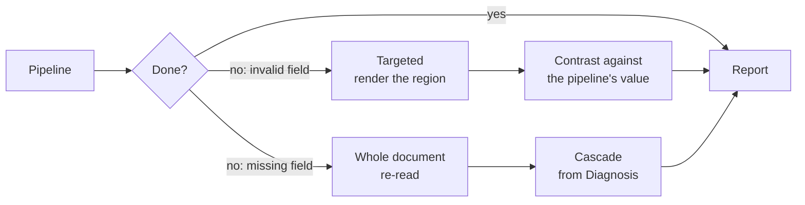

# Workflows

The thirteen input pipelines, built out of the components defined in `components.md`.

`components.md` defines the **components** (named by what they produce). `README.md` defines the **three method flows** (Rules, Interpretation, Vision — named by what the extractor receives). This document defines the **thirteen input pipelines** and maps each one onto those components.

**Terminology note.** The source notes in `my_prompt.md` call these "flujos"; `README.md` uses that word for the method flows. To keep the two apart, this document calls the input-routed ones **pipelines**, and codes them `M<material>.<extractor>`.

---

## Thirteen pipelines are a matrix, not thirteen designs

The thirteen come from two independent choices multiplied out, plus the one material where only one choice is possible:

| Axis | Question | Values |
|---|---|---|
| **Material** | How does the text reach us? | **M0** arrives as text · **M1** extracted from a text PDF · **M2** OCR of an image PDF · **M3** OCR of an image · **M4** never text (pixels only) |
| **Extractor** | How do we read values from it? | **.R** rules · **.P** prompts · **.B** both |

$$4 \text{ text-available materials} \times 3 \text{ extractor modes} + 1 \text{ pixels-only material} \times 1 = 13$$

| | Material path | `.R` rules | `.P` prompts | `.B` both |
|---|---|:---:|:---:|:---:|
| **M0** | text arrives directly | 1 | 2 | 3 |
| **M1** | text PDF → extract text | 4 | 5 | 6 |
| **M2** | image PDF → convert → OCR | 7 | 8 | 9 |
| **M3** | image → OCR | 10 | 11 | 12 |
| **M4** | image → (no text ever) | — | 13 | — |

**M4 has one variant only.** Regex needs a string to run on, and M4 never produces one — pixels go to the model and fields come back. So the matrix is 4×3+1, and every other material supports all three extractor modes.

**The material prefix and the extractor are independent.** M0 and M3 differ only in how text is obtained; `.R` and `.P` differ only in how that text is read. Neither choice constrains the other, which is why the count multiplies rather than adds.

---

## The material axis is acquisition cost

Seen across all five materials, the axis is not really *what the input is* but *what has to happen before there is text*:

| Material | Steps before text exists | Acquisition cost |
|---|---|---|
| **M0** | none — it arrives as text | **zero** |
| **M1** | extract text from a PDF | low |
| **M2** | rasterize, then OCR | high |
| **M3** | OCR | high |
| **M4** | never — the model reads pixels | n/a (no text) |

**M0 is the floor, and it makes the rest of the model legible.** With acquisition cost at zero, M0 is nothing but *extraction → validation → reporting*. Every other material is that same pipeline with work prepended to obtain the text. The pipeline is extraction plus verification; the materials are five ways of arriving at its input.

**M0 is a first-class case.** `my_prompt.md` describes a library consumed as includes or as a CLI, and a caller that already holds text is a natural consumer — text from a web form, a database field, an upstream system, or an OCR step run elsewhere.

---

## The thirteen pipelines

With an ID for reference, in the sequence each one follows.

| # | Code | Pipeline |
|---|---|---|
| 1 | `M0.R` | text → rules → validate → report |
| 2 | `M0.P` | text → prompts → validate → report |
| 3 | `M0.B` | text → rules / prompts → validate → report |
| 4 | `M1.R` | text PDF → extract text → rules → validate → report |
| 5 | `M1.P` | text PDF → extract text → prompts → validate → report |
| 6 | `M1.B` | text PDF → extract text → rules / prompts → validate → report |
| 7 | `M2.R` | image PDF → convert img → OCR → rules → validate → report |
| 8 | `M2.P` | image PDF → convert img → OCR → prompts → validate → report |
| 9 | `M2.B` | image PDF → convert img → OCR → rules / prompts → validate → report |
| 10 | `M3.R` | image → OCR → rules → validate → report |
| 11 | `M3.P` | image → OCR → prompts → validate → report |
| 12 | `M3.B` | image → OCR → rules / prompts → validate → report |
| 13 | `M4.P` | image → prompts → validate → report |

### The primitive: `extractor → validate → report`

Every pipeline is one primitive:

```
extractor → validate → report
```

A pipeline is this primitive plus a **prefix** that obtains the text. The extractor slot is filled by one of three modes:

```
[material prefix] → extractor → validate → report
        ↑                ↑
   varies by material   varies by mode
```

| Slot | Varies by | Applies to |
|---|---|---|
| **Material prefix** | Material | M1–M4; empty at M0 |
| **Extractor** | Mode (`.R`, `.P`, `.B`) | all thirteen |
| **Validate** | — never | all thirteen |
| **Report** | — never | all thirteen |

**No pipeline skips validation**, including the rules-only ones. A regex match proves a value was **captured**, not that it is **correct** — a bad anchor in Rules is detected only by cross-flow contrast, because the value is real and carries the correct shape and type. Acquisition quality is not a factor: `M0.R` and `M1.R` are the same read, differing only in where the text came from.

**What the primitive guarantees.** A field always arrives with the four check verdicts and a trace, whatever route produced it, which is what makes the pipelines substitutable rather than merely similar.

---

## Material prefixes

What each material prepends to the primitive. Nothing here changes the tail.

### M0 — no prefix

The caller supplies the text and the primitive runs unchanged.

**The traceability ceiling is set by the caller.** An offset is only meaningful against *the text that was actually processed*; if the caller's document and the text it passes differ, the offset points into the passed text and no further. The contract should record this.

**Nothing is lossy, and nothing is checked.** No acquisition risk — no OCR error, no reading-order heuristic — but also no acquisition *evidence*. Diagnosis has no gate here, because a string has no legibility to measure. Text extracted badly elsewhere arrives indistinguishable from clean text.

### M1 — `pdf → text`

Conversion needs no correction: a converter does not read badly, it transcribes what is there.

The cost is reading order. `pdftotext` is heuristic, so a table header is not associated with rows continuing on the next page, and a header repeated across five pages is not collapsed. That is the Reconstructor's job and it is not being done. Broken linear text still looks plausible, so the failure is quiet.

**M1 is M0 plus one step**, and that step is its only liability.

### M2 — `pdf → image → text`

**Identical to M3 once rasterized**, so the two should share one implementation with a switch at the front. Six of the thirteen pipelines are three designs with a prefix; divergence would be an accident rather than a decision.

### M3 — `image → text`

**Loses everything visual.** Layout, signatures, seals, checkboxes, logos — the Vision flow is the one that sees signatures and seals, and M3 by construction does not.

**Inherits OCR error.** A pattern has to tolerate the misreads OCR actually produces; a prompt may quietly "repair" a digit it should have flagged. Validation catches either.

### M4 — no text at all

The extractor slot is filled by a multimodal model reading pixels.

**Uniquely sees** visual evidence — a signature, a seal, a checkbox — as part of extraction rather than as something lost in conversion.

**Uniquely risks** a single fused read with no second opinion, and no offset to trace: the trace is a bounding region, less precise than a character offset.

**Diagnosis is absent by design**, matching `README.md`'s note that Vision uses neither Diagnosis nor Reader. Nothing measures legibility before the model reads, so a bad input surfaces as low-confidence extraction rather than as a routing decision.

---

## Extractor modes

What fills the extractor slot. All three read the text from the material prefix — except `.P` in M4, which reads pixels.

| Mode | Method | Invents values | Deterministic | Contrast | Trace |
|---|---|:---:|:---:|:---:|---|
| **`.R`** | regex | No | Yes | — | exact offset |
| **`.P`** | prompt | Yes | No | — | quote + offset |
| **`.B`** | both | — | — | **✓** | exact + quote |

### `.R` — regex

Cheapest and deterministic; it either captures a value that is there or fails.

- One pattern per wording variant, and at 11k files the variants are unknown.
- **An anchor error is invisible.** A bad anchor in Rules is detected only by cross-flow contrast, because the value is real and carries the correct shape and type. With no second read, `.R` cannot notice it took the value from the neighboring block.

### `.P` — prompt

Tolerates wording variation, which is what makes it viable when the corpus is unknown.

- **Can invent values.** Arithmetic and check digit in the Validator catch this.
- **Can misattribute.** A real value assigned to the wrong field.

### `.B` — both

Runs `.R` and `.P` over the **same text** and lets Consistency compare them.

**The only mode that produces contrast**, and contrast is the one mechanism that catches a plausible-but-false value: a total of 15400 that was 1540 passes shape, type and content, and has no check digit. Nothing internal sees it. A disagreement between two reads does.

**Cheap, because the acquisition is already paid.** `components.md` reserves cross-flow contrast because each method flow re-acquires the document; here the text is in hand, so a second read costs one extra call on critical fields.

**Not available in M4**, because there is no text for a regex to run on.

---

## What each of the thirteen buys

| # | Code | Validated | Deterministic | Invents values | Contrast | Sees visuals | Trace |
|---|---|:---:|:---:|:---:|:---:|:---:|---|
| 1 | `M0.R` | ✓ | Yes | No | — | No | exact offset |
| 2 | `M0.P` | ✓ | No | Yes | — | No | quote + offset |
| 3 | `M0.B` | ✓ | — | — | **✓** | No | exact + quote |
| 4 | `M1.R` | ✓ | Yes | No | — | No | exact offset |
| 5 | `M1.P` | ✓ | No | Yes | — | No | quote + offset |
| 6 | `M1.B` | ✓ | — | — | **✓** | No | exact + quote |
| 7 | `M2.R` | ✓ | Yes | No | — | No | exact offset |
| 8 | `M2.P` | ✓ | No | Yes | — | No | quote + offset |
| 9 | `M2.B` | ✓ | — | — | **✓** | No | exact + quote |
| 10 | `M3.R` | ✓ | Yes | No | — | No | exact offset |
| 11 | `M3.P` | ✓ | No | Yes | — | No | quote + offset |
| 12 | `M3.B` | ✓ | — | — | **✓** | No | exact + quote |
| 13 | `M4.P` | ✓ | No | Yes | — | **✓** | bounding region |

**`Validated` is ✓ in all thirteen**, which is the invariant from above and not a coincidence to read past. Every difference between pipelines lies in *what they produce* — determinism, whether they can invent a value, whether a second read exists, what evidence they can see, how precisely a value can be traced. None of them lies in whether the output was checked.

**Only 4 of the 13 have contrast**, and they are exactly the `.B` ones. The other nine produce a single read, so each carries one of these blind spots:

| Blind spot | Pipelines | What goes undetected |
|---|---|---|
| **Single read, `.R`** | 1, 4, 7, 10 | A bad anchor — a real value taken from the wrong place |
| **Single read, `.P`** | 2, 5, 8, 11, 13 | A plausible-but-false value, and a bad anchor |
| **None of the above** | 3, 6, 9, 12 (`.B`) | — contrast is present |
| **No visual evidence** | 1–12 | Signatures, seals, checkboxes, logos |
| **No offset** | 13 | Precise traceability |

**Read this table as residual risk, not as coverage.** Validation already runs on all thirteen, so these blind spots are what remains *after* the four checks — the failures the Validator structurally cannot see. The only remedies are contrast (`.B`) or an external source (`Catalog`, which no pipeline runs).

**This table is the whole decision surface.** Choosing a pipeline is choosing which residual blind spot to accept. The extractor choice decides whether the pipeline can catch its own characteristic error. The material choice decides acquisition cost and what evidence is available — but not the `.R` anchor blind spot or the `.P` invention risk, which are properties of the reader.

---

## Contrast is cheapest at M0

`components.md` reserves cross-flow contrast because running two method flows is expensive — each re-acquires the document. Acquisition cost is zero at M0 and already paid at M1, M2 and M3:

| Pipelines | Contrast available | Incremental cost |
|---|---|---|
| 3 (`M0.B`) | **Yes** — rules and prompts over text in hand | one call on critical fields |
| 6, 9, 12 (`M1.B`, `M2.B`, `M3.B`) | **Yes** — same text, already obtained | one call on critical fields |
| 1, 2, 4, 5, 7, 8, 10, 11 | No — a single read | — |
| 13 (`M4.P`) | No — a single fused read, nothing to compare against | — |

Running both costs one extra call on critical fields, not a second acquisition. **This is the strongest argument for `.B` when the material is text**: it is the only mode whose characteristic failure is detectable. At M0 the argument is at its strongest, because there is no acquisition cost to weigh against it at all.

---

## Component usage

| Component | M0 | M1 | M2 | M3 | M4 |
|---|:---:|:---:|:---:|:---:|:---:|
| **Segmenter** | — | — | — | — | — |
| **Identifier** | — | — | — | — | — |
| **Diagnosis** | — | *selector* | *selector* | *selector* | *selector* |
| **Reader** | — | ✓ conversion | ✓ OCR | ✓ OCR | — |
| **Reconstructor** | — | — | — | — | — |
| **Validator** | ✓ | ✓ | ✓ | ✓ | ✓ |
| **Consistency** | ◐ `.B` only | ◐ `.B` only | ◐ `.B` only | ◐ `.B` only | — |
| **Catalog** | — | — | — | — | — |
| **Contract** | ✓ | ✓ | ✓ | ✓ | ✓ |
| **Reviewer** | ✓ | ✓ | ✓ | ✓ | ✓ |

✓ runs in full · ◐ only in the `.B` variants · — does not run · *selector* gates the pipeline, does not run inside it

**M0 runs no acquisition component at all** — no Diagnosis, no Reader. It is the primitive with an empty prefix: Validate and Report, with nothing before the extractor.

**Diagnosis selects where it can.** Choosing M1 over M2 asks whether the PDF has a usable text layer — exactly Diagnosis's question in `components.md`, including its warning that the check must be **quality, not presence**, because an old bad OCR layer is not a text layer. Choosing M0 is a caller assertion rather than a detection: there is no artifact to diagnose, only text handed over. So M0 also moves the most trust onto the caller.

**Validate and Report run in all thirteen.** The Validator does not care how a value was obtained, so schema, type, content and check-digit checks apply unchanged. The Contract is what makes the thirteen substitutable: the consumer receives the same output shape whichever route a file took.

---

## What the pipelines give up

| Removed | Consequence | Detectable downstream? |
|---|---|---|
| **Segmenter** | Assumes one file = one document. Fields from a second document overwrite the first's | **No** — `components.md` calls this unrecoverable and silent |
| **Identifier** | No type, so no template routing and no evidence record | Only as a badly extracted field, at the end |
| **Reconstructor** | No cross-page table continuity, no header collapsing, no reading order | Partially: as missing or misattributed fields |
| **Catalog** | Identity fields never checked against an external source | Only by a human eventually noticing |

**Silent losses per pipeline:**

| Pipelines | Silent losses |
|---|---|
| 3, 6, 9, 12 (`.B`) | The **Segmenter** |
| 1, 2, 4, 5, 7, 8, 10, 11 | The **Segmenter**, and the blind spot of a single read |
| 13 | The **Segmenter**, a second read, and precise traceability |

**The Segmenter is the one gap no pipeline closes**, and M0 shows why it is unavoidable rather than an oversight: a caller handing over a string has already made the segmentation decision outside the system. There is nothing to segment — and equally, no way to check that the string holds one document rather than three. Every other reduction degrades into something visible; a merge error produces output that looks correct.

---

## Escalation

A pipeline that cannot finish must escalate, not send the case straight to review.



`components.md` makes the Validator the single place where "could not" is defined: a pipeline failure is not a new kind of failure, it is the existing escalation with a lower starting point.

| Kind | What is there | Cost |
|---|---|---|
| **Invalid field** | Value, page, offset | Renders the region. Cheap and precise |
| **Missing field** | Nothing to point at | Whole document re-read — no saving over the cascade |

**A pipeline has less to point at than the cascade**, because without the Reconstructor it has no resolved structure to locate a field in. So where the cascade escalates cheaply, a pipeline can escalate expensively. The number that decides whether a pipeline pays: **cost saved on the files it handles, against cost of files it hands on having done partial work.**

**Escalation also recovers contrast.** A pipeline's value exists, so when the cascade re-reads the field the two values can be compared exactly as two flows are — a second opinion already paid for.

**M0 escalates differently and should be considered separately.** Rendering a region is meaningless for text that has no page and no image — there is nothing to render. So `M0.P`'s targeted escalation has to mean re-reading a span of the supplied string with a narrower question, or handing the whole string back to the cascade. Which one applies is unresolved, and it is the one place where M0 breaks an assumption the other materials share.

---

## Report is shape-identical across pipelines

Every pipeline reports through the **Contract**, so outputs have the same shape and the consumer needs no per-pipeline logic.

| Verdict | Cascade | `.R` variants | `.P` variants | `.B` variants |
|---|---|---|---|---|
| `shape` / `type` / `content` / `digit` | From Validator | Same | Same | Same |
| `consistency` | Reinforcement or disagreement | `null` | `null` | set — both reads compared |
| `catalog` | Verified / unverified | `unverified` | `unverified` | `unverified` |

**One field the Contract should carry for M0 and M1.** Both trace into text the system did not produce, so the offset is only meaningful against the exact string that was processed. Recording a hash of that string alongside the trace would make the offset verifiable later; without it a trace into supplied text is a pointer to something that may no longer exist in that form.

**This is the argument for the verdict vector over a score.** With a single confidence number, a pipeline's output and the cascade's would collapse to the same scale and the difference would vanish — a field nobody cross-checked would look identical to one that survived contrast. Kept separate, the consumer can require `consistency` on critical fields and accept `null` elsewhere, which is precisely the information needed to choose a pipeline per document type.

---

## Open questions

- **What M0's targeted escalation means.** With no page or image, "render the region" has no meaning. Either it becomes "re-read a span of the string", or M0 escalates only to the cascade. Unresolved, and unique to M0.
- **Whether M0 accepts text with a declared provenance.** A caller may hold text extracted elsewhere by an unknown process. Whether M0 records *how* the text was obtained affects how much its verdicts can be trusted, and today there is nowhere to put that.
- **Whether M0's trace should carry a hash of the processed text.** Without it, an offset points into a string that may not be reproducible.
- **Which pipeline, and who decides.** The thirteen are keyed by material and extractor, but nothing says whether the caller declares the pipeline or the system infers it. This is sharpest at M0 and at M3-vs-M4: M0 is an assertion with nothing to diagnose, and for an image, M3 and M4 are both valid with a real cost/verification trade between them.
- **Whether `.B` is the default for text materials.** It is the only mode that catches its own characteristic failure, and the extra cost is one call on critical fields rather than a re-read. The argument for ever choosing `.R` or `.P` alone needs stating.
- **What decides `.R` vs `.P` inside `.B` when they disagree.** Consistency can break a tie by arithmetic, but only for fields with an arithmetic relation. For an identifier, disagreement has no tie-breaker.
- **What defines a "critical field".** Both the contrast policy and the target of escalation depend on it, and today it exists only as an expression in `components.md`.
- **Whether OCR correction is inside the OCR step.** `components.md` has the Reader correcting OCR output (scoped to characters and spacing, never digits, raw text retained for audit). The M2 and M3 prefixes are written as a single `OCR` step, so correction is either inside it or absent.
- **Whether the M2 and M3 prefixes include preprocessing.** Both are written as `OCR` alone, yet `components.md` has input adaptation (rescale, compress) and treats legibility as distinct from resolution. A blurred photo passed straight to OCR is the outcome it calls invalid.
- **Whether the Segmenter is needed after all.** It is the only silent gap. A cheap continuity check — page numbering, header recurrence — may be enough to keep it, though M0 gives it nothing to inspect.
- **Whether M4's model is the same one the cascade's Vision flow uses**, or a cheaper specialist. It decides whether tuning and the golden set carry over.
- **What the extraction prompt is built from.** Per document type, derived from the schema, or shared with the general Interpretation flow. If shared, tuning carries over; if not, there are two prompt sets to maintain.
- **`pdftotext` is a poppler dependency** (external binary). It needs a stated version and a fallback, or M1 silently depends on whatever the host has.
- **Whether M2 and M3 should share one implementation.** They are the same pipeline with a conversion prefix, so six of the thirteen are three designs with a prefix.
